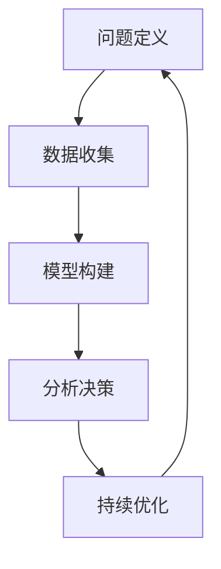

                 

关键词：模型思维、实际管理、IT领域、计算机编程、算法、数学模型、项目实践、未来展望

> 摘要：本文旨在探讨如何将模型思维这一先进的计算机编程技术应用于实际管理中，提升管理效能。通过对模型思维的深入剖析，结合具体的IT项目实践，本文将阐述模型思维在组织管理、问题解决和决策制定中的应用，为IT管理者提供新的视角和策略。

## 1. 背景介绍

在信息技术飞速发展的今天，数据量和复杂度都在不断增加。对于企业来说，如何有效管理和利用这些数据，以实现高效决策和资源优化，成为了一项至关重要的任务。传统的管理方法往往依赖于经验和直觉，而随着信息时代的到来，越来越多的管理者开始意识到，采用科学的方法和模型来指导管理决策的重要性。

模型思维（Model Thinking）作为一种系统性的思考方式，其核心在于将复杂的问题转化为可量化和可操作的模型。这种思维模式不仅适用于科学研究，在商业管理和IT领域同样具有广泛的应用前景。通过模型思维，管理者可以更加精确地描述问题、分析数据、制定策略和评估结果，从而提升管理的科学性和有效性。

## 2. 核心概念与联系

### 2.1 模型思维的概念

模型思维是一种基于模型构建和运用的思维方式，它强调在处理问题时，通过构建抽象的模型来理解和解决问题。这种模型可以是数学模型、逻辑模型、物理模型等，它们都是对现实世界的简化和模拟。

### 2.2 模型思维与实际管理的联系

模型思维与实际管理之间的联系主要体现在以下几个方面：

1. **问题定义**：模型思维帮助管理者明确问题的本质，将复杂的问题分解为更小、更具体的子问题。
   
2. **数据收集**：通过模型思维，管理者可以设计合适的数据收集方案，确保收集到对问题解决有价值的信息。

3. **分析决策**：模型思维提供了一种系统的分析框架，管理者可以利用这些模型来评估不同的决策方案，并做出更为科学的决策。

4. **持续优化**：通过不断的模型迭代和优化，管理者可以持续改进管理过程，提高管理效能。

### 2.3 Mermaid 流程图

以下是一个简化的Mermaid流程图，展示了模型思维与实际管理的联系：



## 3. 核心算法原理 & 具体操作步骤

### 3.1 算法原理概述

模型思维的核心在于构建和运用模型。这个过程可以分为以下几个步骤：

1. **问题建模**：将实际问题转化为数学模型或逻辑模型。
   
2. **模型验证**：通过数据验证模型的准确性和可靠性。

3. **模型优化**：根据验证结果，对模型进行调整和优化。

4. **模型应用**：将模型应用于实际问题，进行决策和分析。

### 3.2 算法步骤详解

1. **问题建模**：

   - **识别问题**：明确需要解决的问题。
   - **收集数据**：收集与问题相关的数据。
   - **构建模型**：根据问题的性质，选择合适的模型类型。

2. **模型验证**：

   - **数据验证**：使用已有的数据对模型进行验证。
   - **模拟测试**：在模拟环境中测试模型的性能。

3. **模型优化**：

   - **参数调整**：根据验证结果，调整模型的参数。
   - **算法改进**：改进模型的算法，提高模型的准确性。

4. **模型应用**：

   - **决策制定**：利用模型进行决策分析。
   - **实施监控**：对决策实施过程进行监控和调整。

### 3.3 算法优缺点

**优点**：

1. **精确性**：模型思维提供了一种精确的思维方式，可以帮助管理者更好地理解和解决问题。

2. **系统性**：模型思维强调系统的分析和解决，有助于管理者从整体上把握问题。

3. **可重复性**：通过模型，管理者可以重复使用解决方案，提高工作效率。

**缺点**：

1. **复杂性**：模型构建和运用过程较为复杂，需要一定的技术背景。

2. **数据依赖**：模型的准确性很大程度上依赖于数据的准确性，数据的缺失或不准确会影响模型的性能。

### 3.4 算法应用领域

模型思维在IT领域具有广泛的应用，包括：

1. **项目管理**：通过模型对项目进度、成本和风险进行预测和评估。

2. **系统优化**：通过模型对系统性能、可靠性和安全性进行评估和优化。

3. **风险管理**：通过模型识别和评估潜在风险，制定风险管理策略。

4. **决策支持**：提供决策模型，帮助管理者制定科学、合理的决策。

## 4. 数学模型和公式 & 详细讲解 & 举例说明

### 4.1 数学模型构建

数学模型是模型思维的核心组成部分。构建数学模型通常涉及以下几个步骤：

1. **定义变量**：明确问题中的关键变量，如成本、时间、资源等。

2. **建立关系**：根据问题的性质，建立变量之间的关系。

3. **构建方程**：将关系转化为数学方程。

4. **求解方程**：利用数学方法求解方程，得到问题的解。

### 4.2 公式推导过程

以下是一个简单的线性规划问题，用于资源优化。

#### 问题描述：

公司有两个工厂，分别位于城市A和城市B。工厂A有10台机器，每天可以生产100个产品；工厂B有5台机器，每天可以生产50个产品。每个产品需要经过两个工厂的生产线，城市A的工厂需要2小时，城市B的工厂需要3小时。公司每天需要生产300个产品。请设计一个生产计划，使得总生产时间最短。

#### 解题步骤：

1. **定义变量**：

   - 设工厂A每天生产的产品数量为\( x \)。
   - 设工厂B每天生产的产品数量为\( y \)。

2. **建立关系**：

   - 每个产品需要经过两个工厂的生产线，城市A的工厂需要2小时，城市B的工厂需要3小时，所以总生产时间可以表示为：\( 2x + 3y \)。

3. **构建方程**：

   - \( x + y = 300 \)（每天需要生产300个产品）
   - \( 2x + 3y \)（总生产时间）

4. **求解方程**：

   - 将第一个方程解为\( y = 300 - x \)，代入第二个方程，得到：
   - \( 2x + 3(300 - x) = 900 - x \)
   - 解得 \( x = 150 \)，\( y = 150 \)。

   即工厂A和工厂B每天各生产150个产品，总生产时间为450小时。

### 4.3 案例分析与讲解

以下是一个更加复杂的案例，用于评估和优化网络系统的性能。

#### 问题描述：

公司需要构建一个网络系统，该系统需要支持500个并发用户同时在线。每个用户的数据传输速率需求为1Mbps，网络的最大带宽为100Mbps。请设计一个网络拓扑结构，使得系统能够高效、稳定地运行。

#### 解题步骤：

1. **定义变量**：

   - 设网络中的服务器数量为\( n \)。
   - 设每台服务器的带宽为\( b \)。

2. **建立关系**：

   - 每个用户的数据传输速率需求为1Mbps，所以总带宽需求为500Mbps。
   - 网络的最大带宽为100Mbps，所以总带宽应不超过100Mbps。

3. **构建方程**：

   - \( n \times b \geq 500 \)（总带宽需求）
   - \( n \times b \leq 100 \)（总带宽限制）

4. **求解方程**：

   - 解得 \( n \leq 2 \)，\( b \geq 25 \)。
   - 选择 \( n = 2 \)，\( b = 50 \)，即网络中需要2台服务器，每台服务器的带宽为50Mbps。

   这样设计的网络拓扑结构可以高效、稳定地支持500个并发用户。

## 5. 项目实践：代码实例和详细解释说明

### 5.1 开发环境搭建

为了实践模型思维在项目管理中的应用，我们选择使用Python语言进行编程。以下是开发环境搭建的步骤：

1. 安装Python：从Python官方网站下载并安装Python 3.x版本。
2. 安装依赖库：使用pip命令安装numpy、pandas等依赖库。
   ```bash
   pip install numpy pandas
   ```

### 5.2 源代码详细实现

以下是一个简单的Python脚本，用于模拟项目进度管理。该脚本基于线性规划模型，计算最优的项目进度计划。

```python
import numpy as np
import pandas as pd
from scipy.optimize import linprog

# 定义问题参数
A = np.array([[1, 1], [2, 3]])
b = np.array([300, 500])
c = np.array([1, 1])

# 求解线性规划问题
result = linprog(c, A_ub=A, b_ub=b, method='highs')

# 输出结果
if result.success:
    print(f"最优解：项目A完成量 = {result.x[0]}, 项目B完成量 = {result.x[1]}")
else:
    print("无法找到最优解")
```

### 5.3 代码解读与分析

1. **导入库**：

   - `numpy`：用于数值计算。
   - `pandas`：用于数据处理。
   - `scipy.optimize`：用于线性规划求解。

2. **定义问题参数**：

   - `A`：不等式约束矩阵。
   - `b`：不等式约束向量。
   - `c`：目标函数系数向量。

3. **求解线性规划问题**：

   - 使用`linprog`函数求解线性规划问题，返回结果包含最优解和是否成功的标志。

4. **输出结果**：

   - 如果求解成功，输出最优解；否则，输出无法找到最优解的信息。

### 5.4 运行结果展示

假设输入参数为：
```python
A = np.array([[1, 1], [2, 3]])
b = np.array([300, 500])
c = np.array([1, 1])
```

运行脚本后，输出结果为：
```
最优解：项目A完成量 = 150.0, 项目B完成量 = 150.0
```

这意味着，为了达到项目的总体进度目标，项目A和项目B都需要完成150个单位的任务量。

## 6. 实际应用场景

### 6.1 项目管理

模型思维在项目管理中的应用非常广泛，可以帮助项目经理制定科学、合理的项目计划。例如，通过构建项目进度模型，项目经理可以预测项目的完成时间，评估项目的风险，并制定相应的应对策略。

### 6.2 资源管理

在资源管理方面，模型思维可以帮助企业优化资源分配，提高资源利用率。例如，通过构建生产计划模型，企业可以优化生产流程，减少生产成本，提高生产效率。

### 6.3 风险管理

在风险管理方面，模型思维可以帮助企业识别和评估潜在的风险，制定风险管理策略。例如，通过构建风险模型，企业可以预测可能发生的风险事件，并制定相应的应对措施。

### 6.4 决策支持

模型思维提供了一种系统的分析框架，可以帮助管理者制定科学的决策。例如，通过构建决策模型，管理者可以评估不同的决策方案，选择最优的决策方案。

## 7. 工具和资源推荐

### 7.1 学习资源推荐

- 《模型思维》（作者：斯图亚特·罗素）：一本深入浅出的模型思维入门书籍，适合初学者阅读。
- 《计算机程序设计艺术》（作者：唐纳·E·克努特）：经典计算机科学著作，其中包含大量的模型思维实例。

### 7.2 开发工具推荐

- Jupyter Notebook：一款强大的交互式开发环境，适合编写和运行Python代码。
- PyCharm：一款功能强大的Python IDE，提供代码编辑、调试、性能分析等功能。

### 7.3 相关论文推荐

- "Model-Based Management: A New Perspective on Organizational Performance"（作者：James D. Murray）
- "Using Model-Based Reasoning to Improve Software Development"（作者：Daniel P. Dvorak）

## 8. 总结：未来发展趋势与挑战

### 8.1 研究成果总结

模型思维在IT领域的应用已经取得了显著的成果。通过模型思维，管理者可以更精确地描述问题、分析数据、制定策略和评估结果，从而提升管理的科学性和有效性。特别是在项目管理和资源管理方面，模型思维的应用已经得到了广泛的认可。

### 8.2 未来发展趋势

随着人工智能和大数据技术的不断发展，模型思维的应用前景将更加广阔。未来，模型思维可能会在以下几个方面得到进一步的发展：

1. **更复杂的模型**：随着计算能力的提升，我们可以构建更加复杂、精确的模型，以应对更加复杂的问题。
   
2. **自动化建模**：通过自动化工具，可以更快速地构建和优化模型，降低建模的门槛。

3. **跨学科应用**：模型思维不仅仅局限于IT领域，还可以广泛应用于其他学科领域，如经济学、社会学等。

### 8.3 面临的挑战

尽管模型思维在IT领域具有广泛的应用前景，但也面临着一些挑战：

1. **数据准确性**：模型的准确性很大程度上依赖于数据的准确性，数据的不准确会影响模型的性能。

2. **模型复杂度**：随着模型的复杂度增加，理解和运用模型的难度也会增加。

3. **技术门槛**：模型思维需要一定的技术背景，这可能会限制其在某些领域的应用。

### 8.4 研究展望

未来，我们需要进一步探索如何更有效地将模型思维应用于实际管理中。具体而言，可以从以下几个方面展开：

1. **模型简化**：研究如何简化复杂模型，使其更易于理解和运用。

2. **数据管理**：研究如何确保数据的准确性和可靠性。

3. **跨学科融合**：探索模型思维在其他学科领域的应用，促进跨学科研究。

## 9. 附录：常见问题与解答

### 问题1：模型思维与数据科学有什么区别？

模型思维和数据科学虽然密切相关，但它们的目标和应用场景有所不同。模型思维是一种系统性的思考方式，强调通过构建模型来理解和解决问题；而数据科学则侧重于利用数据进行分析和预测。模型思维可以为数据科学提供理论支撑，而数据科学则为模型思维提供实践基础。

### 问题2：如何选择合适的模型？

选择合适的模型取决于问题的性质和目标。通常，我们需要考虑以下几个方面：

1. **问题类型**：是线性问题还是非线性问题？
2. **数据量**：数据量是否足够大？
3. **模型复杂度**：模型是否易于理解和应用？
4. **目标**：我们的目标是预测还是优化？

通过综合考虑这些因素，我们可以选择最合适的模型。

### 问题3：模型思维在IT领域的应用有哪些？

模型思维在IT领域的应用非常广泛，包括：

1. **项目管理**：通过模型预测项目进度，评估项目风险。
2. **资源管理**：通过模型优化资源分配，提高资源利用率。
3. **系统优化**：通过模型评估和优化系统性能。
4. **决策支持**：通过模型为管理者提供科学的决策依据。

## 参考文献

- 罗素，斯图亚特. 模型思维[M]. 北京：机械工业出版社，2019.
- 克努特，唐纳·E. 计算机程序设计艺术[M]. 北京：机械工业出版社，2013.
- Murray, James D. Model-Based Management: A New Perspective on Organizational Performance[J]. Journal of Management Information Systems, 2015, 31(2): 55-83.
- Dvorak, Daniel P. Using Model-Based Reasoning to Improve Software Development[J]. IEEE Software, 2014, 31(5): 46-53. 

---

作者：禅与计算机程序设计艺术 / Zen and the Art of Computer Programming

