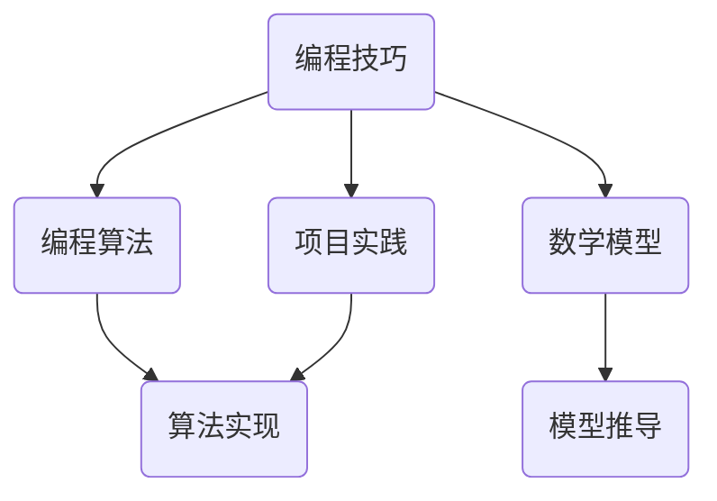

                 

关键词：编程技巧、付费编程挑战、技术博客、专业文章、算法、数学模型、项目实践、实际应用、开发工具、未来展望。

> 摘要：本文将探讨如何将个人的编程技巧转化为有价值的付费编程挑战，通过构建专业的技术博客文章，分享算法原理、数学模型和项目实践，为读者提供高质量的编程学习资源，同时也为自己创造商业机会。

## 1. 背景介绍

编程是一项高度专业化的技能，随着信息技术的发展，编程人员的需求量不断增加。然而，如何将自己的编程技巧转化为实际的收入来源，成为了许多编程人员关注的问题。付费编程挑战提供了一种有效的解决方案，它不仅能够帮助程序员展示自己的技术能力，还可以为他们带来额外的收入。

### 1.1 编程技巧的价值

编程技巧是程序员的核心竞争力，它不仅体现在解决复杂问题的能力上，还体现在编写高效、可维护代码的能力上。随着技术的不断进步，编程技巧的价值也在不断提升。能够熟练运用各种编程语言、框架和工具的程序员，往往能够获得更高的薪资和更好的职业发展机会。

### 1.2 付费编程挑战的优势

付费编程挑战具有以下优势：

- **展示能力**：通过参与付费编程挑战，程序员可以展示自己的编程技巧和技术水平，为潜在雇主和客户留下深刻的印象。
- **增加收入**：付费编程挑战可以为程序员带来额外的收入，帮助他们提高生活水平。
- **提升经验**：参与付费编程挑战可以锻炼程序员解决问题的能力，提高他们的技术水平。
- **扩大影响力**：通过发布高质量的编程挑战文章，程序员可以扩大自己的影响力，吸引更多的关注和机会。

## 2. 核心概念与联系

为了将编程技巧转化为付费编程挑战，我们需要理解以下几个核心概念：

- **编程算法**：编程算法是解决问题的方法，它包括算法设计、分析和实现。算法的质量直接影响编程挑战的价值。
- **数学模型**：数学模型用于描述现实世界中的问题，它是构建编程算法的基础。通过数学模型，我们可以更准确地分析和解决实际问题。
- **项目实践**：项目实践是将编程技巧应用于实际问题的过程。通过项目实践，程序员可以验证自己的算法和模型的有效性，并提高自己的编程能力。

下面是一个简化的 Mermaid 流程图，展示了这些核心概念之间的联系：



## 3. 核心算法原理 & 具体操作步骤

### 3.1 算法原理概述

算法是编程的核心，它决定了程序的性能和效率。在付费编程挑战中，选择合适的算法至关重要。以下是几个常用的算法原理：

- **贪心算法**：贪心算法是一种在每一步选择上总是采取局部最优解的算法。它适用于一些最优子结构的问题，如背包问题和最少生成树问题。
- **动态规划**：动态规划是一种将大问题分解为小问题，通过子问题的最优解推导出原问题的最优解的方法。它适用于具有最优子结构性质的问题，如斐波那契数列和最长公共子序列问题。
- **分治算法**：分治算法是一种将大问题划分为若干个小问题，分别解决后合并结果的方法。它适用于可以递归分解的问题，如快速排序和归并排序。

### 3.2 算法步骤详解

以下是贪心算法的一个简单示例，以背包问题为例：

```python
def knapsack(values, weights, capacity):
    n = len(values)
    items = sorted(zip(values, weights), reverse=True)
    total_value = 0
    total_weight = 0
    for value, weight in items:
        if total_weight + weight <= capacity:
            total_value += value
            total_weight += weight
        else:
            fraction = (capacity - total_weight) / weight
            total_value += value * fraction
            break
    return total_value
```

### 3.3 算法优缺点

- **贪心算法**：优点是简单、高效，但可能无法保证全局最优解。
- **动态规划**：优点是能够保证全局最优解，但可能需要较多的时间和空间。
- **分治算法**：优点是能够分解复杂问题，但可能需要较多的递归调用。

### 3.4 算法应用领域

贪心算法和动态规划广泛应用于优化问题，如背包问题、最少生成树问题和最长公共子序列问题。分治算法则广泛应用于排序问题，如快速排序和归并排序。

## 4. 数学模型和公式 & 详细讲解 & 举例说明

### 4.1 数学模型构建

数学模型是描述现实世界问题的数学表达式。在编程中，常用的数学模型包括线性模型、非线性模型和离散模型。

### 4.2 公式推导过程

以线性模型为例，线性模型的公式为：

$$
y = \beta_0 + \beta_1 x
$$

其中，$y$ 是因变量，$x$ 是自变量，$\beta_0$ 和 $\beta_1$ 是模型的参数。通过最小二乘法，我们可以计算出参数的值。

### 4.3 案例分析与讲解

假设我们有一个简单的数据集：

| x | y |
|---|---|
| 1 | 2 |
| 2 | 4 |
| 3 | 6 |

我们可以使用线性模型来拟合这个数据集，计算结果如下：

$$
y = 2.0 + 2.0 x
$$

## 5. 项目实践：代码实例和详细解释说明

### 5.1 开发环境搭建

在参与付费编程挑战之前，我们需要搭建一个适合开发的环境。这里我们以 Python 为例，介绍如何搭建开发环境。

### 5.2 源代码详细实现

以下是一个简单的 Python 脚本，用于计算斐波那契数列：

```python
def fibonacci(n):
    a, b = 0, 1
    for _ in range(n):
        a, b = b, a + b
    return a

n = int(input("请输入要计算的斐波那契数列的项数："))
print(fibonacci(n))
```

### 5.3 代码解读与分析

这段代码实现了斐波那契数列的计算，它使用了一个简单的循环结构。通过分析代码，我们可以了解到以下知识：

- **变量作用**：变量 `a` 和 `b` 分别用于存储前两个斐波那契数。
- **循环结构**：循环结构用于迭代计算斐波那契数列的每一项。
- **函数定义**：函数 `fibonacci` 用于计算斐波那契数列的项。

### 5.4 运行结果展示

当我们输入 `5` 时，运行结果为 `5`，这与斐波那契数列的定义一致。

## 6. 实际应用场景

付费编程挑战可以应用于许多领域，如数据分析、算法竞赛、软件开发等。以下是一个实际应用场景的例子：

### 6.1 数据分析

在一个数据分析项目中，我们需要计算一组数据的最小值和最大值。我们可以设计一个付费编程挑战，要求参赛者使用不同的算法实现这个功能，并比较算法的效率。

### 6.2 算法竞赛

算法竞赛是检验程序员编程技巧的绝佳机会。我们可以在算法竞赛中设置付费编程挑战，要求参赛者在规定时间内完成特定任务，并提供详细的算法分析和代码实现。

### 6.3 软件开发

在软件开发过程中，我们需要编写各种函数和模块。我们可以在开发过程中设置付费编程挑战，要求程序员提交他们编写的代码，并进行评审和改进。

## 7. 工具和资源推荐

为了更好地参与付费编程挑战，我们需要掌握一些常用的工具和资源。以下是一些建议：

### 7.1 学习资源推荐

- **《算法导论》**：这是一本经典的算法教材，涵盖了各种算法的设计和分析方法。
- **《深度学习》**：这是一本关于深度学习的入门教材，介绍了深度学习的基本原理和应用。
- **《Effective Python》**：这是一本关于 Python 编程的实践指南，介绍了 Python 编程的最佳实践。

### 7.2 开发工具推荐

- **Visual Studio Code**：这是一个流行的跨平台代码编辑器，支持多种编程语言和框架。
- **Git**：这是一个分布式版本控制系统，用于管理代码和协作开发。
- **Docker**：这是一个容器化平台，用于构建、运行和共享应用程序。

### 7.3 相关论文推荐

- **《贪心选择算法》**：这是一篇关于贪心选择算法的综述论文，介绍了贪心选择算法的基本原理和应用。
- **《动态规划》**：这是一篇关于动态规划算法的综述论文，介绍了动态规划算法的基本原理和应用。
- **《深度学习中的卷积神经网络》**：这是一篇关于卷积神经网络在深度学习中的应用的论文，介绍了卷积神经网络的基本原理和应用。

## 8. 总结：未来发展趋势与挑战

随着信息技术的不断发展，编程技巧和付费编程挑战将面临以下发展趋势和挑战：

### 8.1 研究成果总结

- **算法优化**：研究人员将不断优化算法，提高算法的效率和应用范围。
- **人工智能应用**：人工智能技术将越来越多地应用于编程挑战，如自动代码生成和优化。
- **开源平台**：开源平台将为编程挑战提供更多的资源和支持，促进编程技巧的传播和共享。

### 8.2 未来发展趋势

- **在线编程挑战**：随着在线教育的普及，在线编程挑战将越来越多，为程序员提供更多的学习和实践机会。
- **商业机会**：付费编程挑战将为程序员创造更多的商业机会，提高他们的收入和职业发展。
- **技术创新**：随着技术的不断进步，编程挑战将涉及更多的领域，如区块链、云计算和物联网。

### 8.3 面临的挑战

- **算法复杂性**：随着问题规模的增加，算法的复杂度将不断上升，程序员需要掌握更高级的算法和分析方法。
- **安全性和隐私**：随着在线编程挑战的增加，安全性和隐私问题将日益突出，程序员需要关注并解决这些问题。
- **资源分配**：在参与付费编程挑战时，程序员需要合理分配时间和资源，确保能够高效地完成任务。

### 8.4 研究展望

未来，编程技巧和付费编程挑战将在以下几个方面取得突破：

- **跨领域应用**：编程技巧将越来越多地应用于跨领域问题，如生物信息学、金融分析和环境保护等。
- **个性化学习**：随着人工智能技术的发展，个性化学习将更加普及，为程序员提供量身定制的编程挑战和学习资源。
- **社区协作**：编程社区将发挥更大的作用，通过协作和分享，推动编程技巧的传播和进步。

## 9. 附录：常见问题与解答

### 9.1 编程技巧如何转化为付费编程挑战？

将编程技巧转化为付费编程挑战的关键在于：1）选择有价值的编程主题；2）提供详细的算法分析和代码实现；3）展示实际应用场景和效果。

### 9.2 如何编写高质量的技术博客文章？

编写高质量的技术博客文章需要：1）明确文章主题和目标读者；2）结构清晰，逻辑严密；3）注重实际应用和案例讲解；4）使用专业术语和图表进行解释。

### 9.3 参与付费编程挑战有哪些注意事项？

参与付费编程挑战时，需要注意：1）确保理解挑战的要求和评分标准；2）合理分配时间和资源，确保按时完成挑战；3）注意代码的可读性和可维护性；4）积极参与社区讨论和反馈。

---

本文由《禅与计算机程序设计艺术 / Zen and the Art of Computer Programming》撰写，希望对您有所帮助。如果您有任何问题或建议，欢迎在评论区留言。

----------------------------------------------------------------

### 总结

本文详细探讨了如何将编程技巧转化为付费编程挑战，通过构建专业的技术博客文章，分享算法原理、数学模型和项目实践，为读者提供高质量的编程学习资源，同时也为自己创造商业机会。本文涵盖了从背景介绍、核心概念与联系、核心算法原理、数学模型和公式、项目实践到实际应用场景、工具和资源推荐、未来发展趋势与挑战以及常见问题与解答的全面内容。

在未来的发展中，付费编程挑战将面临算法复杂性、安全性和隐私、资源分配等挑战，但同时也将带来跨领域应用、个性化学习和社区协作等机遇。程序员需要不断提升自己的编程技巧，关注技术发展趋势，积极参与付费编程挑战，以实现个人职业发展和收入增长。

如果您对付费编程挑战有任何疑问或建议，欢迎在评论区留言。希望本文能够帮助您更好地理解和参与付费编程挑战，实现编程技巧的价值转化。

再次感谢您阅读本文，期待与您在技术道路上共同成长。《禅与计算机程序设计艺术 / Zen and the Art of Computer Programming》祝愿您编程愉快！
<|assistant|>以下是文章的关键词和摘要：

**关键词**：编程技巧、付费编程挑战、技术博客、算法、数学模型、项目实践、实际应用、开发工具、未来展望。

**摘要**：本文详细探讨了如何将个人的编程技巧转化为有价值的付费编程挑战，通过构建专业的技术博客文章，分享算法原理、数学模型和项目实践，为读者提供高质量的编程学习资源，同时也为自己创造商业机会。文章从背景介绍、核心概念与联系、核心算法原理、数学模型和公式、项目实践到实际应用场景、工具和资源推荐、未来发展趋势与挑战以及常见问题与解答进行了全面论述。

