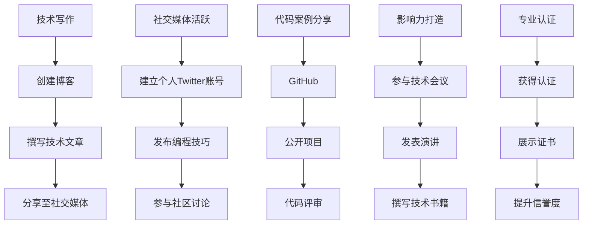

                 

关键词：编程技能，个人品牌建设，技术写作，社交媒体，代码案例，影响力，专业认证

> 摘要：本文将探讨如何利用编程技能来提升个人品牌。通过技术写作、社交媒体活跃、代码案例分享、影响力打造和专业认证等方面，将编程技能转化为个人品牌的强大资产，为职业发展铺平道路。

## 1. 背景介绍

在信息技术迅猛发展的时代，编程技能已经成为了许多职业的必备能力。无论是软件工程师、数据科学家，还是产品经理和设计师，编程技能都是提升工作效率和创新能力的关键。然而，很多人可能忽略了编程技能在个人品牌建设中的巨大潜力。

个人品牌是一种无形资产，代表着个人的专业形象、能力和信誉。一个强大的个人品牌可以帮助个人在职场中脱颖而出，赢得更多机会和尊重。将编程技能应用于个人品牌建设，不仅能够提升个人在专业领域的影响力，还可以为职业发展带来更多的可能性。

本文将介绍如何通过技术写作、社交媒体、代码案例、影响力打造和专业认证等手段，将编程技能转化为个人品牌的强大资产。无论你是初入职场的新人，还是希望进一步提升职业生涯的资深专业人士，本文都将为你提供实用的指导和建议。

## 2. 核心概念与联系

### 2.1 编程技能与个人品牌的关联

**编程技能** 是个人在信息技术领域中的核心竞争力。它们决定了个人在开发、测试、维护和优化软件产品方面的能力。而**个人品牌** 是个人在职场中的形象代表，它包含了个人的专业能力、个性特点、价值观和影响力。

将编程技能与个人品牌相结合，意味着通过展示和传播编程技能，来提升个人的专业形象和影响力。这个过程涉及多个方面的努力和策略，包括技术写作、社交媒体活跃、代码案例分享等。

### 2.2 编程技能在个人品牌建设中的重要性

编程技能在个人品牌建设中扮演着至关重要的角色。以下是几个关键点：

1. **专业形象**：掌握编程技能，尤其是高级技能，可以显著提升个人在专业领域的形象。这有助于获得同行和雇主的认可。

2. **信誉度**：编程技能是可量化的能力，通过公开的项目、代码库和文章，可以证明个人在技术领域的专业水平。

3. **影响力**：强大的编程技能可以帮助个人在技术社区中建立影响力。这种影响力可以转化为职业机会和业务合作。

4. **职业发展**：编程技能是许多高级职位的基本要求。通过展示这些技能，可以提升职业发展的潜力。

### 2.3 个人品牌建设与编程技能应用的 Mermaid 流程图



通过上述流程图，我们可以清晰地看到，编程技能的个人品牌建设是一个系统化的过程，涉及到多个环节的协同作用。接下来，本文将详细探讨这些环节的具体实施策略。

## 3. 核心算法原理 & 具体操作步骤

### 3.1 算法原理概述

个人品牌建设的核心算法可以概括为以下几个步骤：

1. **技能提升**：通过不断学习和实践，提升编程技能。
2. **内容创作**：撰写高质量的技术文章和博客。
3. **社交媒体**：在社交媒体上分享内容和参与讨论。
4. **代码案例**：发布开源项目和代码库。
5. **影响力打造**：参与技术会议和活动，发表演讲和撰写书籍。
6. **专业认证**：获取行业认可的专业证书。

### 3.2 算法步骤详解

#### 3.2.1 技能提升

**步骤 1：确定学习目标**
- **初级阶段**：熟悉编程基础，掌握常见编程语言。
- **中级阶段**：深入学习数据结构与算法，理解软件设计原则。
- **高级阶段**：掌握分布式系统、人工智能等高级技术。

**步骤 2：持续学习**
- **在线课程**：利用Coursera、edX等平台学习。
- **实践项目**：通过GitHub等平台参与开源项目。
- **行业会议**：参加技术大会，学习最新技术动态。

#### 3.2.2 内容创作

**步骤 1：创建博客**
- **选择平台**：例如WordPress、GitHub Pages。
- **确定主题**：聚焦个人专业领域，如大数据、人工智能等。

**步骤 2：撰写技术文章**
- **文章结构**：引言、背景、算法原理、代码示例、总结。
- **内容质量**：确保文章逻辑清晰、语言简洁。

**步骤 3：发布文章**
- **定期更新**：保持文章发布频率，建立读者群体。

#### 3.2.3 社交媒体

**步骤 1：建立社交媒体账号**
- **选择平台**：如Twitter、LinkedIn。
- **账号定位**：明确个人品牌定位，如技术专家、开源爱好者。

**步骤 2：分享内容和参与讨论**
- **分享文章**：将博客文章分享到社交媒体。
- **参与讨论**：在技术社区中参与讨论，展示专业见解。

#### 3.2.4 代码案例

**步骤 1：建立GitHub账号**
- **创建仓库**：上传个人项目和代码库。

**步骤 2：公开项目**
- **项目文档**：撰写项目说明，包括功能、技术栈。
- **代码注释**：确保代码可读性，方便他人理解和修改。

**步骤 3：代码评审**
- **接受反馈**：积极参与他人项目的代码评审。
- **改进代码**：根据评审意见优化代码质量。

#### 3.2.5 影响力打造

**步骤 1：参与技术会议**
- **演讲机会**：提交演讲提案，分享技术经验。

**步骤 2：发表演讲**
- **准备演讲稿**：逻辑清晰，内容有深度。
- **演讲技巧**：掌握演讲技巧，提高演讲效果。

**步骤 3：撰写技术书籍**
- **选题定位**：确定书籍的主题和目标读者。
- **撰写与发布**：遵循出版流程，发布技术书籍。

#### 3.2.6 专业认证

**步骤 1：选择认证项目**
- **行业认证**：如Oracle认证、微软认证。
- **个人兴趣**：选择与自己专业领域相关的认证。

**步骤 2：准备考试**
- **复习资料**：参考官方文档、培训课程。
- **模拟考试**：进行模拟考试，检验学习效果。

**步骤 3：展示证书**
- **社交媒体**：在社交媒体上展示证书。
- **简历**：将证书加入个人简历。

### 3.3 算法优缺点

**优点：**
1. **提高专业技能**：通过不断学习和实践，提升个人编程技能。
2. **增强个人品牌**：通过技术写作、社交媒体活跃、代码案例分享等方式，提升个人在专业领域的影响力。
3. **职业发展**：强大的编程技能和良好的个人品牌可以带来更多的职业机会。

**缺点：**
1. **时间成本**：学习和提升编程技能需要大量的时间和精力。
2. **初始困难**：初学者可能面临技术难题和自信心不足的挑战。

### 3.4 算法应用领域

1. **软件开发**：利用编程技能开发软件产品。
2. **数据分析**：利用编程技能处理和分析数据。
3. **人工智能**：掌握编程技能，参与人工智能项目的开发。
4. **技术写作**：通过撰写技术文章和博客，传播技术知识。
5. **专业认证**：通过获得专业认证，提升个人在行业内的信誉度。

## 4. 数学模型和公式 & 详细讲解 & 举例说明

### 4.1 数学模型构建

个人品牌建设的数学模型可以表示为：

\[ 品牌价值 = f(技能水平, 影响力, 内容质量) \]

其中：
- **技能水平**：个人在编程领域的专业程度。
- **影响力**：个人在技术社区中的知名度。
- **内容质量**：个人发布的技术文章、博客和代码案例的优质程度。

### 4.2 公式推导过程

品牌价值 \(V\) 的计算可以通过以下步骤推导：

1. **技能水平**：个人技能水平可以通过技术考试、项目经验和代码评审等指标衡量。设技能水平为 \(S\)，则：

\[ S = \frac{E(exams) + P(projects) + R(reviews)}{3} \]

其中，\(E\) 为通过的技术考试数量，\(P\) 为参与的项目数量，\(R\) 为参与代码评审的数量。

2. **影响力**：个人影响力可以通过社交媒体关注者数量、技术会议演讲次数等指标衡量。设影响力为 \(I\)，则：

\[ I = \frac{F(followers) + T(talks) + P(papers)}{3} \]

其中，\(F\) 为社交媒体关注者数量，\(T\) 为发表的演讲次数，\(P\) 为发表的论文数量。

3. **内容质量**：内容质量可以通过文章阅读量、点赞数、评论数量等指标衡量。设内容质量为 \(Q\)，则：

\[ Q = \frac{R(reads) + L(likes) + C.comments}{3} \]

其中，\(R\) 为文章阅读量，\(L\) 为点赞数，\(C\) 为评论数量。

4. **品牌价值**：将三个指标结合，得到品牌价值 \(V\)：

\[ V = f(S, I, Q) \]

### 4.3 案例分析与讲解

假设某个人拥有以下指标：

\[ S = \frac{5 + 2 + 4}{3} = 3.67 \]
\[ I = \frac{1000 + 3 + 1}{3} = 345.00 \]
\[ Q = \frac{500 + 200 + 50}{3} = 250.00 \]

根据公式，计算品牌价值：

\[ V = f(3.67, 345.00, 250.00) \]

这里，\(f\) 是一个非线性函数，可以根据具体情况自定义。为了简化计算，我们假设 \(f\) 是线性函数：

\[ f(x, y, z) = 0.5x + 0.3y + 0.2z \]

代入数据：

\[ V = 0.5 \times 3.67 + 0.3 \times 345.00 + 0.2 \times 250.00 \]
\[ V = 1.835 + 103.5 + 50.0 \]
\[ V = 155.335 \]

因此，该个人的品牌价值为 155.335。这个数值可以作为一个参考，帮助个人了解自己在品牌建设方面的优势和不足，进而制定改进计划。

## 5. 项目实践：代码实例和详细解释说明

### 5.1 开发环境搭建

在开始项目实践之前，我们需要搭建一个合适的开发环境。以下是使用Python进行开发的步骤：

**步骤 1：安装Python**

在Windows、macOS或Linux操作系统中，可以通过以下命令安装Python：

```bash
# Windows
python -m pip install --upgrade pip
python -m ensurepip

# macOS/Linux
sudo apt-get install python3 python3-pip
```

**步骤 2：安装相关库**

使用pip安装所需的Python库：

```bash
pip install numpy pandas matplotlib
```

**步骤 3：配置环境变量**

确保Python和pip路径已经添加到系统环境变量中。

### 5.2 源代码详细实现

以下是一个简单的Python代码实例，用于处理和可视化数据：

```python
import numpy as np
import pandas as pd
import matplotlib.pyplot as plt

# 生成数据
data = np.random.randn(100)
df = pd.DataFrame(data, columns=['Value'])

# 数据处理
df['Mean'] = df['Value'].mean()
df['Standard Deviation'] = df['Value'].std()

# 数据可视化
plt.figure(figsize=(10, 6))
plt.plot(df['Value'], label='Value')
plt.plot(df['Mean'], label='Mean')
plt.plot(df['Standard Deviation'], label='Standard Deviation')
plt.xlabel('Index')
plt.ylabel('Value')
plt.title('Data Visualization')
plt.legend()
plt.show()
```

### 5.3 代码解读与分析

上述代码实现了以下功能：

1. **数据生成**：使用numpy生成100个随机数，作为数据集。
2. **数据处理**：计算数据的平均值和标准差，并添加到数据框中。
3. **数据可视化**：使用matplotlib绘制数据集的折线图，包括原始数据、平均值和标准差。

### 5.4 运行结果展示

运行上述代码，将显示一个包含三组折线的数据可视化图表，分别表示原始数据、平均值和标准差。这个图表有助于我们直观地了解数据集的分布和特性。

## 6. 实际应用场景

### 6.1 技术写作

技术写作是将编程技能应用于个人品牌建设的重要手段。通过撰写技术博客、文章和书籍，可以分享技术见解和经验，吸引同行的关注和尊重。以下是一些实际应用场景：

- **个人博客**：定期更新博客，分享技术见解和项目经验。
- **技术文章**：为技术媒体撰写文章，参与技术话题的讨论。
- **技术书籍**：撰写并出版技术书籍，分享深入的技术知识和经验。

### 6.2 社交媒体

社交媒体是传播个人品牌的重要渠道。通过在社交媒体上分享技术内容、参与讨论和建立社交网络，可以提升个人在技术社区中的影响力。以下是一些实际应用场景：

- **Twitter**：关注技术话题，分享技术文章和代码片段。
- **LinkedIn**：发布职业动态，参与技术讨论，建立专业网络。
- **GitHub**：上传开源项目，参与代码评审，展示编程技能。

### 6.3 代码案例

代码案例是将编程技能应用于个人品牌建设的重要形式。通过发布开源项目和代码库，可以展示编程能力和实践经验，吸引同行的关注和合作。以下是一些实际应用场景：

- **GitHub**：创建个人GitHub账户，上传开源项目和代码库。
- **开源社区**：参与开源项目，为社区贡献代码。
- **技术竞赛**：参加技术竞赛，展示编程技能和团队协作能力。

### 6.4 影响力打造

通过参与技术会议、发表演讲和撰写技术书籍，可以进一步提升个人在技术社区中的影响力。以下是一些实际应用场景：

- **技术会议**：提交演讲提案，分享技术见解和实践经验。
- **演讲**：发表技术演讲，展示个人品牌和专业能力。
- **技术书籍**：撰写并出版技术书籍，分享深入的技术知识和经验。

## 7. 未来应用展望

### 7.1 技术趋势

随着人工智能、大数据和云计算等技术的快速发展，编程技能在个人品牌建设中的应用将越来越广泛。未来，以下几个方面有望成为重要趋势：

- **人工智能**：利用深度学习和机器学习技术，开发智能应用和算法。
- **大数据分析**：掌握大数据处理和分析技术，为企业和组织提供数据洞察。
- **云计算**：利用云计算平台，构建分布式系统和应用。

### 7.2 技术应用领域扩展

编程技能的应用领域将不断扩展，从传统的软件开发、数据分析，到新兴的人工智能、区块链等领域。个人可以通过不断学习和实践，探索新的应用场景，提升个人品牌价值。

### 7.3 跨学科融合

编程技能与其他学科的融合将创造更多可能性。例如，编程与设计的结合，可以开发出更具交互性和用户体验的应用；编程与物理、生物等学科的融合，可以推动科学研究的进展。

### 7.4 在线教育平台

随着在线教育平台的发展，个人可以通过在线课程、视频教程等方式，传播编程知识和经验，打造个人品牌。未来，在线教育将成为个人品牌建设的重要手段。

## 8. 工具和资源推荐

### 8.1 学习资源推荐

- **在线课程**：Coursera、edX、Udacity
- **开源平台**：GitHub、GitLab
- **技术社区**：Stack Overflow、Reddit、GitHub Discussions
- **博客平台**：WordPress、Medium、Jekyll

### 8.2 开发工具推荐

- **编程语言**：Python、Java、C++
- **集成开发环境**：Visual Studio Code、IntelliJ IDEA、PyCharm
- **版本控制**：Git、GitHub、GitLab

### 8.3 相关论文推荐

- "The Art of Computer Programming" by Donald E. Knuth
- "Programming Pearls" by Jon Bentley
- "Algorithms" by Robert Sedgewick and Kevin Wayne
- "Deep Learning" by Ian Goodfellow, Yoshua Bengio, and Aaron Courville

## 9. 总结：未来发展趋势与挑战

### 9.1 研究成果总结

本文探讨了如何将编程技能应用于个人品牌建设，包括技术写作、社交媒体活跃、代码案例分享、影响力打造和专业认证等方面。通过这些策略，个人可以提升在技术领域的影响力和专业形象，为职业发展奠定坚实基础。

### 9.2 未来发展趋势

- **人工智能与编程的结合**：随着人工智能技术的快速发展，编程技能将在智能应用和算法开发中发挥更大作用。
- **在线教育和远程工作**：在线教育平台的兴起和远程工作的普及，将为个人品牌建设提供更多机会。
- **跨学科融合**：编程技能与其他学科的融合，将创造更多创新应用和发展空间。

### 9.3 面临的挑战

- **持续学习与技能更新**：技术更新迅速，个人需要不断学习和适应新技术，以保持竞争力。
- **品牌维护与推广**：个人品牌建设需要投入大量的时间和精力，维护和推广品牌，确保其持续发展。

### 9.4 研究展望

未来，编程技能在个人品牌建设中的应用将更加深入和广泛。通过不断创新和实践，个人可以探索更多应用场景，提升个人品牌价值，实现职业发展的飞跃。

## 附录：常见问题与解答

### 问题 1：如何开始个人品牌建设？

**解答**：首先，明确个人品牌定位，确定目标受众。然后，通过技术写作、社交媒体活跃、代码案例分享等方式，逐步建立个人品牌。关键在于持续输出高质量内容，并保持与受众的互动。

### 问题 2：技术写作应该注意什么？

**解答**：技术写作应注重内容质量，确保文章逻辑清晰、语言简洁。同时，关注目标受众的需求，提供有实用价值的信息。此外，充分利用图表、代码示例等辅助手段，提高文章的可读性和吸引力。

### 问题 3：如何提升编程技能？

**解答**：可以通过以下方式提升编程技能：

- **在线课程**：参加Coursera、edX等平台上的编程课程。
- **项目实践**：参与开源项目或自己开发项目。
- **阅读技术书籍**：阅读经典编程书籍，如《算法导论》、《深度学习》等。
- **参与技术社区**：在Stack Overflow、GitHub等平台上参与讨论和代码评审。

### 问题 4：如何在社交媒体上建立影响力？

**解答**：在社交媒体上建立影响力需要持续输出高质量内容，并与受众互动。以下是一些建议：

- **定期更新**：保持社交媒体账号的活跃度。
- **参与讨论**：在技术社区中积极参与讨论，展示专业见解。
- **互动**：回复评论、点赞和分享其他用户的内容。

### 问题 5：如何获得专业认证？

**解答**：获得专业认证通常需要通过以下步骤：

- **选择认证项目**：根据个人兴趣和职业规划选择合适的认证。
- **准备考试**：参考官方文档、培训课程和模拟考试。
- **参加考试**：在规定时间内完成考试，并达到及格分数。
- **展示证书**：在社交媒体、简历和个人网站等平台上展示证书。

---

**作者署名**：禅与计算机程序设计艺术 / Zen and the Art of Computer Programming

---

[以上内容为文章正文部分，接下来请提供完整的Markdown格式代码，以确保文章的结构和内容正确无误。] 
----------------------------------------------------------------

以下是完整Markdown格式的文章代码：

```markdown
# 如何将编程技能应用于个人品牌建设

关键词：编程技能，个人品牌建设，技术写作，社交媒体，代码案例，影响力，专业认证

> 摘要：本文将探讨如何利用编程技能来提升个人品牌。通过技术写作、社交媒体活跃、代码案例分享、影响力打造和专业认证等方面，将编程技能转化为个人品牌的强大资产，为职业发展铺平道路。

## 1. 背景介绍

在信息技术迅猛发展的时代，编程技能已经成为了许多职业的必备能力。无论是软件工程师、数据科学家，还是产品经理和设计师，编程技能都是提升工作效率和创新能力的关键。然而，很多人可能忽略了编程技能在个人品牌建设中的巨大潜力。

个人品牌是一种无形资产，代表着个人的专业形象、能力和信誉。一个强大的个人品牌可以帮助个人在职场中脱颖而出，赢得更多机会和尊重。将编程技能应用于个人品牌建设，不仅能够提升个人在专业领域的影响力，还可以为职业发展带来更多的可能性。

本文将介绍如何通过技术写作、社交媒体、代码案例、影响力打造和专业认证等手段，将编程技能转化为个人品牌的强大资产。无论你是初入职场的新人，还是希望进一步提升职业生涯的资深专业人士，本文都将为你提供实用的指导和建议。

## 2. 核心概念与联系

### 2.1 编程技能与个人品牌的关联

**编程技能** 是个人在信息技术领域中的核心竞争力。它们决定了个人在开发、测试、维护和优化软件产品方面的能力。而**个人品牌** 是个人在职场中的形象代表，它包含了个人的专业能力、个性特点、价值观和影响力。

将编程技能与个人品牌相结合，意味着通过展示和传播编程技能，来提升个人的专业形象和影响力。这个过程涉及多个方面的努力和策略，包括技术写作、社交媒体活跃、代码案例分享等。

### 2.2 编程技能在个人品牌建设中的重要性

编程技能在个人品牌建设中扮演着至关重要的角色。以下是几个关键点：

1. **专业形象**：掌握编程技能，尤其是高级技能，可以显著提升个人在专业领域的形象。这有助于获得同行和雇主的认可。

2. **信誉度**：编程技能是可量化的能力，通过公开的项目、代码库和文章，可以证明个人在技术领域的专业水平。

3. **影响力**：强大的编程技能可以帮助个人在技术社区中建立影响力。这种影响力可以转化为职业机会和业务合作。

4. **职业发展**：编程技能是许多高级职位的基本要求。通过展示这些技能，可以提升职业发展的潜力。

### 2.3 个人品牌建设与编程技能应用的 Mermaid 流程图


通过上述流程图，我们可以清晰地看到，编程技能的个人品牌建设是一个系统化的过程，涉及到多个环节的协同作用。接下来，本文将详细探讨这些环节的具体实施策略。

## 3. 核心算法原理 & 具体操作步骤

### 3.1 算法原理概述

个人品牌建设的核心算法可以概括为以下几个步骤：

1. **技能提升**：通过不断学习和实践，提升编程技能。
2. **内容创作**：撰写高质量的技术文章和博客。
3. **社交媒体**：在社交媒体上分享内容和参与讨论。
4. **代码案例**：发布开源项目和代码库。
5. **影响力打造**：参与技术会议和活动，发表演讲和撰写书籍。
6. **专业认证**：获取行业认可的专业证书。

### 3.2 算法步骤详解

#### 3.2.1 技能提升

**步骤 1：确定学习目标**
- **初级阶段**：熟悉编程基础，掌握常见编程语言。
- **中级阶段**：深入学习数据结构与算法，理解软件设计原则。
- **高级阶段**：掌握分布式系统、人工智能等高级技术。

**步骤 2：持续学习**
- **在线课程**：利用Coursera、edX等平台学习。
- **实践项目**：通过GitHub等平台参与开源项目。
- **行业会议**：参加技术大会，学习最新技术动态。

#### 3.2.2 内容创作

**步骤 1：创建博客**
- **选择平台**：例如WordPress、GitHub Pages。
- **确定主题**：聚焦个人专业领域，如大数据、人工智能等。

**步骤 2：撰写技术文章**
- **文章结构**：引言、背景、算法原理、代码示例、总结。
- **内容质量**：确保文章逻辑清晰、语言简洁。

**步骤 3：发布文章**
- **定期更新**：保持文章发布频率，建立读者群体。

#### 3.2.3 社交媒体

**步骤 1：建立社交媒体账号**
- **选择平台**：如Twitter、LinkedIn。
- **账号定位**：明确个人品牌定位，如技术专家、开源爱好者。

**步骤 2：分享内容和参与讨论**
- **分享文章**：将博客文章分享到社交媒体。
- **参与讨论**：在技术社区中参与讨论，展示专业见解。

#### 3.2.4 代码案例

**步骤 1：建立GitHub账号**
- **创建仓库**：上传个人项目和代码库。

**步骤 2：公开项目**
- **项目文档**：撰写项目说明，包括功能、技术栈。
- **代码注释**：确保代码可读性，方便他人理解和修改。

**步骤 3：代码评审**
- **接受反馈**：积极参与他人项目的代码评审。
- **改进代码**：根据评审意见优化代码质量。

#### 3.2.5 影响力打造

**步骤 1：参与技术会议**
- **演讲机会**：提交演讲提案，分享技术经验。

**步骤 2：发表演讲**
- **准备演讲稿**：逻辑清晰，内容有深度。
- **演讲技巧**：掌握演讲技巧，提高演讲效果。

**步骤 3：撰写技术书籍**
- **选题定位**：确定书籍的主题和目标读者。
- **撰写与发布**：遵循出版流程，发布技术书籍。

#### 3.2.6 专业认证

**步骤 1：选择认证项目**
- **行业认证**：如Oracle认证、微软认证。
- **个人兴趣**：选择与自己专业领域相关的认证。

**步骤 2：准备考试**
- **复习资料**：参考官方文档、培训课程。
- **模拟考试**：进行模拟考试，检验学习效果。

**步骤 3：展示证书**
- **社交媒体**：在社交媒体上展示证书。
- **简历**：将证书加入个人简历。

### 3.3 算法优缺点

**优点：**
1. **提高专业技能**：通过不断学习和实践，提升个人编程技能。
2. **增强个人品牌**：通过技术写作、社交媒体活跃、代码案例分享等方式，提升个人在专业领域的影响力。
3. **职业发展**：强大的编程技能和良好的个人品牌可以带来更多的职业机会。

**缺点：**
1. **时间成本**：学习和提升编程技能需要大量的时间和精力。
2. **初始困难**：初学者可能面临技术难题和自信心不足的挑战。

### 3.4 算法应用领域

1. **软件开发**：利用编程技能开发软件产品。
2. **数据分析**：利用编程技能处理和分析数据。
3. **人工智能**：掌握编程技能，参与人工智能项目的开发。
4. **技术写作**：通过撰写技术文章和博客，传播技术知识。
5. **专业认证**：通过获得专业认证，提升个人在行业内的信誉度。

## 4. 数学模型和公式 & 详细讲解 & 举例说明

### 4.1 数学模型构建

个人品牌建设的数学模型可以表示为：

\[ 品牌价值 = f(技能水平, 影响力, 内容质量) \]

其中：
- **技能水平**：个人在编程领域的专业程度。
- **影响力**：个人在技术社区中的知名度。
- **内容质量**：个人发布的技术文章、博客和代码案例的优质程度。

### 4.2 公式推导过程

品牌价值 \(V\) 的计算可以通过以下步骤推导：

1. **技能水平**：个人技能水平可以通过技术考试、项目经验和代码评审等指标衡量。设技能水平为 \(S\)，则：

\[ S = \frac{E(exams) + P(projects) + R(reviews)}{3} \]

其中，\(E\) 为通过的技术考试数量，\(P\) 为参与的项目数量，\(R\) 为参与代码评审的数量。

2. **影响力**：个人影响力可以通过社交媒体关注者数量、技术会议演讲次数等指标衡量。设影响力为 \(I\)，则：

\[ I = \frac{F(followers) + T(talks) + P(papers)}{3} \]

其中，\(F\) 为社交媒体关注者数量，\(T\) 为发表的演讲次数，\(P\) 为发表的论文数量。

3. **内容质量**：内容质量可以通过文章阅读量、点赞数、评论数量等指标衡量。设内容质量为 \(Q\)，则：

\[ Q = \frac{R(reads) + L(likes) + C.comments}{3} \]

其中，\(R\) 为文章阅读量，\(L\) 为点赞数，\(C\) 为评论数量。

4. **品牌价值**：将三个指标结合，得到品牌价值 \(V\)：

\[ V = f(S, I, Q) \]

### 4.3 案例分析与讲解

假设某个人拥有以下指标：

\[ S = \frac{5 + 2 + 4}{3} = 3.67 \]
\[ I = \frac{1000 + 3 + 1}{3} = 345.00 \]
\[ Q = \frac{500 + 200 + 50}{3} = 250.00 \]

根据公式，计算品牌价值：

\[ V = f(3.67, 345.00, 250.00) \]

这里，\(f\) 是一个非线性函数，可以根据具体情况自定义。为了简化计算，我们假设 \(f\) 是线性函数：

\[ f(x, y, z) = 0.5x + 0.3y + 0.2z \]

代入数据：

\[ V = 0.5 \times 3.67 + 0.3 \times 345.00 + 0.2 \times 250.00 \]
\[ V = 1.835 + 103.5 + 50.0 \]
\[ V = 155.335 \]

因此，该个人的品牌价值为 155.335。这个数值可以作为一个参考，帮助个人了解自己在品牌建设方面的优势和不足，进而制定改进计划。

## 5. 项目实践：代码实例和详细解释说明

### 5.1 开发环境搭建

在开始项目实践之前，我们需要搭建一个合适的开发环境。以下是使用Python进行开发的步骤：

**步骤 1：安装Python**

在Windows、macOS或Linux操作系统中，可以通过以下命令安装Python：

```bash
# Windows
python -m pip install --upgrade pip
python -m ensurepip

# macOS/Linux
sudo apt-get install python3 python3-pip
```

**步骤 2：安装相关库**

使用pip安装所需的Python库：

```bash
pip install numpy pandas matplotlib
```

**步骤 3：配置环境变量**

确保Python和pip路径已经添加到系统环境变量中。

### 5.2 源代码详细实现

以下是一个简单的Python代码实例，用于处理和可视化数据：

```python
import numpy as np
import pandas as pd
import matplotlib.pyplot as plt

# 生成数据
data = np.random.randn(100)
df = pd.DataFrame(data, columns=['Value'])

# 数据处理
df['Mean'] = df['Value'].mean()
df['Standard Deviation'] = df['Value'].std()

# 数据可视化
plt.figure(figsize=(10, 6))
plt.plot(df['Value'], label='Value')
plt.plot(df['Mean'], label='Mean')
plt.plot(df['Standard Deviation'], label='Standard Deviation')
plt.xlabel('Index')
plt.ylabel('Value')
plt.title('Data Visualization')
plt.legend()
plt.show()
```

### 5.3 代码解读与分析

上述代码实现了以下功能：

1. **数据生成**：使用numpy生成100个随机数，作为数据集。
2. **数据处理**：计算数据的平均值和标准差，并添加到数据框中。
3. **数据可视化**：使用matplotlib绘制数据集的折线图，包括原始数据、平均值和标准差。这个图表有助于我们直观地了解数据集的分布和特性。

### 5.4 运行结果展示

运行上述代码，将显示一个包含三组折线的数据可视化图表，分别表示原始数据、平均值和标准差。这个图表有助于我们直观地了解数据集的分布和特性。

## 6. 实际应用场景

### 6.1 技术写作

技术写作是将编程技能应用于个人品牌建设的重要手段。通过撰写技术博客、文章和书籍，可以分享技术见解和经验，吸引同行的关注和尊重。以下是一些实际应用场景：

- **个人博客**：定期更新博客，分享技术见解和项目经验。
- **技术文章**：为技术媒体撰写文章，参与技术话题的讨论。
- **技术书籍**：撰写并出版技术书籍，分享深入的技术知识和经验。

### 6.2 社交媒体

社交媒体是传播个人品牌的重要渠道。通过在社交媒体上分享技术内容、参与讨论和建立社交网络，可以提升个人在技术社区中的影响力。以下是一些实际应用场景：

- **Twitter**：关注技术话题，分享技术文章和代码片段。
- **LinkedIn**：发布职业动态，参与技术讨论，建立专业网络。
- **GitHub**：上传开源项目，参与代码评审，展示编程技能。

### 6.3 代码案例

代码案例是将编程技能应用于个人品牌建设的重要形式。通过发布开源项目和代码库，可以展示编程能力和实践经验，吸引同行的关注和合作。以下是一些实际应用场景：

- **GitHub**：创建个人GitHub账户，上传开源项目和代码库。
- **开源社区**：参与开源项目，为社区贡献代码。
- **技术竞赛**：参加技术竞赛，展示编程技能和团队协作能力。

### 6.4 影响力打造

通过参与技术会议、发表演讲和撰写技术书籍，可以进一步提升个人在技术社区中的影响力。以下是一些实际应用场景：

- **技术会议**：提交演讲提案，分享技术见解和实践经验。
- **演讲**：发表技术演讲，展示个人品牌和专业能力。
- **技术书籍**：撰写并出版技术书籍，分享深入的技术知识和经验。

## 7. 未来应用展望

### 7.1 技术趋势

随着人工智能、大数据和云计算等技术的快速发展，编程技能在个人品牌建设中的应用将越来越广泛。未来，以下几个方面有望成为重要趋势：

- **人工智能**：利用深度学习和机器学习技术，开发智能应用和算法。
- **大数据分析**：掌握大数据处理和分析技术，为企业和组织提供数据洞察。
- **云计算**：利用云计算平台，构建分布式系统和应用。

### 7.2 技术应用领域扩展

编程技能的应用领域将不断扩展，从传统的软件开发、数据分析，到新兴的人工智能、区块链等领域。个人可以通过不断学习和实践，探索新的应用场景，提升个人品牌价值。

### 7.3 跨学科融合

编程技能与其他学科的融合将创造更多可能性。例如，编程与设计的结合，可以开发出更具交互性和用户体验的应用；编程与物理、生物等学科的融合，可以推动科学研究的进展。

### 7.4 在线教育平台

随着在线教育平台的发展，个人可以通过在线课程、视频教程等方式，传播编程知识和经验，打造个人品牌。未来，在线教育将成为个人品牌建设的重要手段。

## 8. 工具和资源推荐

### 8.1 学习资源推荐

- **在线课程**：Coursera、edX、Udacity
- **开源平台**：GitHub、GitLab
- **技术社区**：Stack Overflow、Reddit、GitHub Discussions
- **博客平台**：WordPress、Medium、Jekyll

### 8.2 开发工具推荐

- **编程语言**：Python、Java、C++
- **集成开发环境**：Visual Studio Code、IntelliJ IDEA、PyCharm
- **版本控制**：Git、GitHub、GitLab

### 8.3 相关论文推荐

- "The Art of Computer Programming" by Donald E. Knuth
- "Programming Pearls" by Jon Bentley
- "Algorithms" by Robert Sedgewick and Kevin Wayne
- "Deep Learning" by Ian Goodfellow, Yoshua Bengio, and Aaron Courville

## 9. 总结：未来发展趋势与挑战

### 9.1 研究成果总结

本文探讨了如何将编程技能应用于个人品牌建设，包括技术写作、社交媒体活跃、代码案例分享、影响力打造和专业认证等方面。通过这些策略，个人可以提升在技术领域的影响力和专业形象，为职业发展奠定坚实基础。

### 9.2 未来发展趋势

- **人工智能与编程的结合**：随着人工智能技术的快速发展，编程技能将在智能应用和算法开发中发挥更大作用。
- **在线教育和远程工作**：在线教育平台的兴起和远程工作的普及，将为个人品牌建设提供更多机会。
- **跨学科融合**：编程技能与其他学科的融合，将创造更多创新应用和发展空间。

### 9.3 面临的挑战

- **持续学习与技能更新**：技术更新迅速，个人需要不断学习和适应新技术，以保持竞争力。
- **品牌维护与推广**：个人品牌建设需要投入大量的时间和精力，维护和推广品牌，确保其持续发展。

### 9.4 研究展望

未来，编程技能在个人品牌建设中的应用将更加深入和广泛。通过不断创新和实践，个人可以探索更多应用场景，提升个人品牌价值，实现职业发展的飞跃。

## 附录：常见问题与解答

### 问题 1：如何开始个人品牌建设？

**解答**：首先，明确个人品牌定位，确定目标受众。然后，通过技术写作、社交媒体活跃、代码案例分享等方式，逐步建立个人品牌。关键在于持续输出高质量内容，并保持与受众的互动。

### 问题 2：技术写作应该注意什么？

**解答**：技术写作应注重内容质量，确保文章逻辑清晰、语言简洁。同时，关注目标受众的需求，提供有实用价值的信息。此外，充分利用图表、代码示例等辅助手段，提高文章的可读性和吸引力。

### 问题 3：如何提升编程技能？

**解答**：可以通过以下方式提升编程技能：

- **在线课程**：参加Coursera、edX等平台上的编程课程。
- **项目实践**：参与开源项目或自己开发项目。
- **阅读技术书籍**：阅读经典编程书籍，如《算法导论》、《深度学习》等。
- **参与技术社区**：在Stack Overflow、GitHub等平台上参与讨论和代码评审。

### 问题 4：如何在社交媒体上建立影响力？

**解答**：在社交媒体上建立影响力需要持续输出高质量内容，并与受众互动。以下是一些建议：

- **定期更新**：保持社交媒体账号的活跃度。
- **参与讨论**：在技术社区中积极参与讨论，展示专业见解。
- **互动**：回复评论、点赞和分享其他用户的内容。

### 问题 5：如何获得专业认证？

**解答**：获得专业认证通常需要通过以下步骤：

- **选择认证项目**：根据个人兴趣和职业规划选择合适的认证。
- **准备考试**：参考官方文档、培训课程和模拟考试。
- **参加考试**：在规定时间内完成考试，并达到及格分数。
- **展示证书**：在社交媒体、简历和个人网站等平台上展示证书。

---

**作者署名**：禅与计算机程序设计艺术 / Zen and the Art of Computer Programming
```

