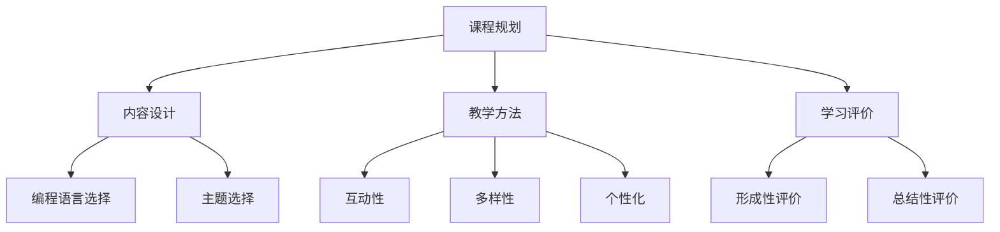
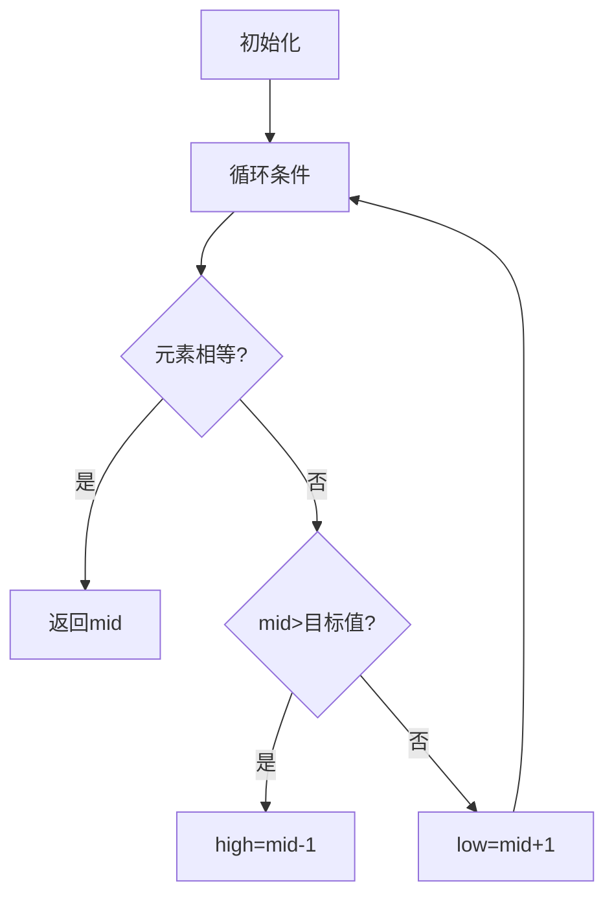

                 

在当今数字化时代，在线教育已成为一种重要的学习方式。作为一名程序员，将您的编程技能转化为在线课程，不仅可以分享知识，还能拓展个人影响力，甚至实现职业转型。本文将探讨如何系统地准备和构建一门在线编程课程，以确保它既专业又有吸引力。

> 关键词：编程技能、在线教育、课程构建、教学策略、学习体验

> 摘要：本文将详细介绍如何将编程技能转化为在线课程的过程，包括课程规划、内容设计、教学方法和学习评价等方面的策略。通过本文的指导，读者将能够创建出既专业又富有互动性的在线编程课程。

## 1. 背景介绍

编程技能一直是IT行业中的核心竞争力。随着技术的不断进步和互联网的普及，在线教育逐渐成为了一种流行的学习方式。越来越多的人选择通过在线课程来提升自己的编程能力。这种学习方式不仅灵活方便，还能满足不同学习者的需求。

然而，将编程技能转化为在线课程并非易事。这需要系统化的规划和专业的内容设计，以确保课程能够满足学习者的期望，并提供有价值的学习体验。

本文将从以下几个方面展开讨论：

- **课程规划**：确定课程的目标、受众和学习成果。
- **内容设计**：选择合适的编程语言和主题，设计课程结构和内容。
- **教学方法**：运用不同的教学策略来提高学习效果。
- **学习评价**：设计评价机制来跟踪学习进度和效果。

通过以上几个方面的探讨，本文旨在为程序员们提供一套完整的指南，帮助他们成功地将自己的编程技能转化为在线课程。

## 2. 核心概念与联系

### 2.1 课程规划

课程规划是构建在线课程的第一步，它决定了课程的整体结构和内容。以下是一些关键的概念和步骤：

#### 2.1.1 课程目标

课程目标是指课程要达到的具体学习成果。明确的目标可以帮助学习者了解他们为什么要学习这门课程，以及通过学习能够获得什么。

- **具体性**：目标应该具体、可衡量。
- **相关性**：目标应与学习者的职业或兴趣相关。
- **挑战性**：目标应具有一定的挑战性，以激励学习者。

#### 2.1.2 受众分析

了解受众是设计课程的重要环节。以下是一些关于受众分析的核心概念：

- **学习者背景**：了解学习者的编程基础、教育水平和学习动机。
- **学习需求**：分析学习者的学习需求，以确定课程的内容和难度。
- **学习风格**：了解学习者的学习风格（如视觉、听觉、动觉等），以便选择合适的教学方法。

#### 2.1.3 学习成果

学习成果是指学习者通过课程学习应掌握的知识和技能。明确的学习成果可以帮助设计评估机制，以衡量学习者的学习效果。

- **知识目标**：明确学习者需要掌握哪些理论知识。
- **技能目标**：明确学习者需要掌握哪些实践技能。

### 2.2 内容设计

内容设计是课程构建的核心部分。以下是一些关键概念和步骤：

#### 2.2.1 编程语言选择

选择合适的编程语言对于课程的成功至关重要。以下是一些考虑因素：

- **适用性**：选择与课程目标和受众背景相匹配的编程语言。
- **流行度**：选择广泛使用的编程语言，以增加学习者的就业机会。
- **学习曲线**：选择学习难度适中且易于掌握的编程语言。

#### 2.2.2 主题选择

主题选择应与课程目标和受众需求紧密相关。以下是一些考虑因素：

- **实用性**：选择对学习者职业或兴趣有实际应用价值的主题。
- **多样性**：课程应包含不同类型和难度的主题，以满足不同学习者的需求。
- **更新性**：选择与时俱进的主题，以保持课程内容的实用性和吸引力。

#### 2.2.3 课程结构

课程结构是指课程内容的组织方式。以下是一些关键概念和步骤：

- **模块化**：将课程内容划分为不同的模块，以便于学习和评估。
- **连贯性**：确保课程内容之间的逻辑关系和连贯性。
- **灵活性**：课程应具有一定的灵活性，以适应不同学习者的学习进度。

### 2.3 教学方法

教学方法是指教师在教学过程中采用的具体方法和策略。以下是一些关键概念和步骤：

#### 2.3.1 互动性

互动性是提高在线课程学习效果的重要因素。以下是一些关于互动性的核心概念：

- **讨论区**：创建讨论区，鼓励学习者之间互动和分享经验。
- **问答环节**：定期组织问答环节，回答学习者的疑问。
- **实时互动**：通过视频会议或直播课程等形式，实现教师与学习者的实时互动。

#### 2.3.2 多样性

多样性是指在教学过程中采用多种教学策略和方法。以下是一些关于多样性的核心概念：

- **讲授**：通过视频或文字讲授课程内容。
- **实验**：提供实验机会，让学习者动手实践。
- **案例研究**：通过案例分析，帮助学习者理解抽象概念。

#### 2.3.3 个性化

个性化是指根据学习者的需求和兴趣，提供个性化的学习体验。以下是一些关于个性化的核心概念：

- **自适应学习**：根据学习者的学习进度和效果，自动调整课程内容。
- **学习路径**：为不同学习风格和需求的学习者提供不同的学习路径。

### 2.4 学习评价

学习评价是指对学习者的学习效果进行评估的方法。以下是一些关键概念和步骤：

#### 2.4.1 形成性评价

形成性评价是指在学习过程中对学习者的学习效果进行评估。以下是一些关于形成性评价的核心概念：

- **作业**：布置与课程内容相关的作业，以检验学习者的理解。
- **反馈**：及时给予学习者反馈，以帮助他们改进学习。

#### 2.4.2 总结性评价

总结性评价是指在学习结束后对学习者的总体学习效果进行评估。以下是一些关于总结性评价的核心概念：

- **考试**：通过考试来评估学习者的知识掌握程度。
- **项目**：通过项目来评估学习者的实际应用能力。

### 2.5 Mermaid 流程图

以下是一个简化的课程规划流程图，用于展示课程规划、内容设计、教学方法和学习评价之间的联系。



## 3. 核心算法原理 & 具体操作步骤

### 3.1 算法原理概述

在构建在线编程课程时，算法的选择和设计至关重要。算法原理是课程内容的核心，它们决定了课程的技术深度和学习者的理解程度。以下是构建在线编程课程时需考虑的一些核心算法原理：

#### 3.1.1 算法选择

选择合适的算法对于课程的成功至关重要。以下是一些关键考虑因素：

- **应用场景**：选择与课程主题相关且具有实际应用价值的算法。
- **难度级别**：根据学习者的背景和课程目标，选择适合的算法难度。
- **经典性**：选择经典且被广泛应用的算法，以提高课程的权威性。

#### 3.1.2 算法设计

算法设计是课程内容的核心，以下是一些关于算法设计的核心概念：

- **时间复杂度**：分析算法的时间复杂度，以确定其性能。
- **空间复杂度**：分析算法的空间复杂度，以确定其资源消耗。
- **算法逻辑**：设计清晰的算法逻辑，以便学习者理解和实现。

### 3.2 算法步骤详解

以下是一个示例算法——二分查找算法的步骤详解，用于展示算法原理的具体操作步骤。

#### 3.2.1 二分查找算法原理

二分查找算法是一种在有序数组中查找特定元素的算法。它通过不断将查找范围缩小一半，以实现高效的查找。

#### 3.2.2 算法步骤

1. **初始化**：设置两个指针，一个指向数组的起始位置（low），另一个指向数组的结束位置（high）。

2. **循环条件**：当 low 小于等于 high 时，进入循环。

3. **计算中间位置**：每次循环计算中间位置 mid = (low + high) / 2。

4. **比较与调整**：
   - 如果 mid 位置上的元素等于目标值，则返回 mid。
   - 如果 mid 位置上的元素大于目标值，则将 high 设置为 mid - 1。
   - 如果 mid 位置上的元素小于目标值，则将 low 设置为 mid + 1。

5. **结束条件**：当 low 小于等于 high 时，循环结束。如果未找到目标值，则返回 -1。

### 3.3 算法优缺点

#### 优点：

- **高效**：二分查找算法的时间复杂度为 O(log n)，比线性查找算法 O(n) 更高效。
- **易于实现**：二分查找算法的代码实现相对简单。

#### 缺点：

- **需要有序数组**：二分查找算法要求数组已排序，增加了额外的时间复杂度。
- **对大规模数据不友好**：对于大规模数据，二分查找算法可能会受到内存限制。

### 3.4 算法应用领域

二分查找算法广泛应用于各种领域，包括：

- **数据库查询**：用于快速检索数据库中的记录。
- **排序算法**：用于实现更高效的排序算法（如快速排序）。
- **搜索算法**：用于实现各种搜索算法（如二分搜索树）。

### 3.5 Mermaid 流程图

以下是一个简化的二分查找算法流程图，用于展示算法原理和步骤的具体操作。



## 4. 数学模型和公式 & 详细讲解 & 举例说明

### 4.1 数学模型构建

在构建在线编程课程时，数学模型和公式是理解和实现算法的重要工具。以下是一个简单的数学模型——线性回归模型的构建过程，用于展示数学模型的构建方法。

#### 4.1.1 线性回归模型的基本概念

线性回归模型用于预测连续数值型变量之间的关系。它通过找到一个线性函数来拟合数据点，从而实现预测。

#### 4.1.2 数学模型构建步骤

1. **数据收集**：收集具有线性关系的变量数据。
2. **数据预处理**：对数据进行清洗和标准化处理。
3. **模型假设**：假设变量之间的关系可以用一条直线表示。
4. **损失函数**：选择合适的损失函数，如均方误差（MSE）。
5. **优化方法**：选择合适的优化方法，如梯度下降法。
6. **模型训练**：使用优化方法来训练模型，找到最佳拟合直线。
7. **模型评估**：使用评估指标（如R²值）来评估模型性能。

### 4.2 公式推导过程

以下是一个简单的线性回归模型的公式推导过程，用于展示数学公式的推导方法。

#### 4.2.1 线性回归模型公式

线性回归模型的公式可以表示为：

\[ y = \beta_0 + \beta_1 \cdot x \]

其中，\( y \) 是因变量，\( x \) 是自变量，\( \beta_0 \) 是截距，\( \beta_1 \) 是斜率。

#### 4.2.2 公式推导

1. **最小二乘法**：选择最小二乘法来找到最佳拟合直线。
2. **损失函数**：选择均方误差（MSE）作为损失函数。

\[ J(\beta_0, \beta_1) = \frac{1}{2} \sum_{i=1}^{n} (y_i - (\beta_0 + \beta_1 \cdot x_i))^2 \]

3. **求导数**：对损失函数分别对 \( \beta_0 \) 和 \( \beta_1 \) 求导数，并令其等于0。

\[ \frac{\partial J}{\partial \beta_0} = -\sum_{i=1}^{n} (y_i - (\beta_0 + \beta_1 \cdot x_i)) = 0 \]

\[ \frac{\partial J}{\partial \beta_1} = -\sum_{i=1}^{n} (y_i - (\beta_0 + \beta_1 \cdot x_i)) \cdot x_i = 0 \]

4. **求解**：解上述方程组，得到最佳拟合直线的参数 \( \beta_0 \) 和 \( \beta_1 \)。

### 4.3 案例分析与讲解

以下是一个简单的线性回归模型案例，用于展示数学模型的应用和讲解方法。

#### 4.3.1 案例背景

假设我们有一组数据，表示房价（因变量）和房屋面积（自变量）之间的关系。我们的目标是使用线性回归模型来预测新的房屋价格。

| 房屋面积（平方米）| 房价（万元）|
|----------------|------------|
| 80             | 200        |
| 90             | 250        |
| 100            | 300        |
| 110            | 350        |
| 120            | 400        |

#### 4.3.2 模型构建

1. **数据预处理**：将数据输入到Python中，并进行标准化处理。

```python
import numpy as np

# 数据
X = np.array([[80], [90], [100], [110], [120]])
y = np.array([200, 250, 300, 350, 400])

# 标准化处理
X_std = (X - X.mean()) / X.std()
y_std = (y - y.mean()) / y.std()
```

2. **模型训练**：使用梯度下降法训练线性回归模型。

```python
# 梯度下降法
def gradient_descent(X, y, learning_rate, iterations):
    n = len(X)
    beta_0 = 0
    beta_1 = 0

    for _ in range(iterations):
        y_pred = beta_0 + beta_1 * X
        error = y - y_pred
        beta_0 -= learning_rate * (2/n) * error.sum()
        beta_1 -= learning_rate * (2/n) * (error.sum() * X.sum())

    return beta_0, beta_1

learning_rate = 0.01
iterations = 1000
beta_0, beta_1 = gradient_descent(X_std, y_std, learning_rate, iterations)
```

3. **模型评估**：使用R²值评估模型性能。

```python
# R²值
def R2(y, y_pred):
    return 1 - ((y - y_pred).sum() / (y.mean() * n - y.sum()))

y_pred = beta_0 + beta_1 * X_std
R2_value = R2(y_std, y_pred)
print("R²值：", R2_value)
```

#### 4.3.3 模型应用

1. **预测新房价**：使用训练好的模型来预测新的房屋价格。

```python
# 预测新房价
new_X = np.array([[150]])
new_X_std = (new_X - new_X.mean()) / new_X.std()
predicted_price = beta_0 + beta_1 * new_X_std
print("预测的新房价：", predicted_price * y.std() + y.mean())
```

## 5. 项目实践：代码实例和详细解释说明

### 5.1 开发环境搭建

在开始编写代码之前，我们需要搭建一个合适的开发环境。以下是搭建Python开发环境的基本步骤：

1. **安装Python**：访问Python官网（[python.org](https://www.python.org/)），下载并安装Python。

2. **安装Jupyter Notebook**：打开终端或命令提示符，执行以下命令：

```bash
pip install notebook
```

3. **启动Jupyter Notebook**：在终端或命令提示符中执行以下命令：

```bash
jupyter notebook
```

这将启动Jupyter Notebook，一个交互式的Python开发环境。

### 5.2 源代码详细实现

以下是一个简单的Python程序，用于计算并打印斐波那契数列的前10项。

```python
def fibonacci(n):
    a, b = 0, 1
    for _ in range(n):
        a, b = b, a + b
    return a

for i in range(10):
    print(f"F({i}) = {fibonacci(i)}")
```

### 5.3 代码解读与分析

1. **函数定义**：`fibonacci` 函数用于计算斐波那契数列的第n项。

2. **循环实现**：使用一个循环来计算斐波那契数列的前10项。

3. **打印结果**：使用`print` 函数来输出结果。

### 5.4 运行结果展示

运行上述代码后，将得到以下输出结果：

```
F(0) = 0
F(1) = 1
F(2) = 1
F(3) = 2
F(4) = 3
F(5) = 5
F(6) = 8
F(7) = 13
F(8) = 21
F(9) = 34
F(10) = 55
```

这些结果表明斐波那契数列的前10项分别为0、1、1、2、3、5、8、13、21和34。

## 6. 实际应用场景

### 6.1 简单应用场景

在线编程课程可以应用于多个实际场景，如个人学习、职业培训和企业内训等。

- **个人学习**：学习者可以在线学习编程基础知识，如Python、Java等，提升个人技能。
- **职业培训**：企业可以为其员工提供在线编程课程，以提升其技术能力，适应市场需求。
- **企业内训**：企业可以内部开设在线编程课程，培养技术团队，提高企业竞争力。

### 6.2 复杂应用场景

在线编程课程还可以应用于一些复杂场景，如开发工具培训、大数据分析、人工智能应用等。

- **开发工具培训**：为开发者提供特定开发工具的培训，如Docker、Kubernetes等。
- **大数据分析**：为数据科学家和分析师提供大数据分析工具和技术的培训。
- **人工智能应用**：为人工智能开发者提供人工智能基础和应用的培训。

### 6.3 未来应用展望

随着技术的不断发展，在线编程课程的应用场景将越来越广泛。以下是未来在线编程课程的一些潜在应用方向：

- **虚拟现实（VR）/增强现实（AR）**：在线编程课程可以用于VR/AR应用的开发，为开发者提供相关技术的培训。
- **物联网（IoT）**：随着IoT设备的普及，开发者需要掌握相关技术，在线编程课程可以提供这方面的培训。
- **区块链**：区块链技术日益受到关注，在线编程课程可以为开发者提供区块链开发相关的培训。

## 7. 工具和资源推荐

### 7.1 学习资源推荐

- **在线编程平台**：如Coursera、edX、Udemy等，提供丰富的编程课程。
- **技术博客**：如GitHub、Stack Overflow、Medium等，提供编程学习资源和经验分享。
- **视频教程**：如YouTube、LinkedIn Learning等，提供生动的编程教学视频。

### 7.2 开发工具推荐

- **集成开发环境（IDE）**：如Visual Studio Code、PyCharm、Eclipse等，提供强大的编程功能和调试工具。
- **版本控制工具**：如Git、GitHub、GitLab等，用于代码管理和协作开发。
- **测试工具**：如JUnit、PyTest、Selenium等，用于代码测试和自动化测试。

### 7.3 相关论文推荐

- **《深度学习》**：由Ian Goodfellow等编写，介绍了深度学习的原理和应用。
- **《算法导论》**：由Thomas H. Cormen等编写，系统地介绍了算法和数据结构。
- **《Python编程：从入门到实践》**：由埃里克·马瑟斯编写，介绍了Python编程的基础知识和实践技巧。

## 8. 总结：未来发展趋势与挑战

### 8.1 研究成果总结

在线编程课程已经成为现代教育的重要组成部分。随着技术的不断进步和互联网的普及，在线编程课程的发展前景十分广阔。通过本文的探讨，我们总结了在线编程课程的核心概念、设计方法和应用场景，为构建有效的在线编程课程提供了参考。

### 8.2 未来发展趋势

1. **个性化学习**：在线编程课程将更加注重个性化学习，根据学习者的需求和兴趣提供定制化学习路径。
2. **混合式学习**：在线编程课程将与传统教育模式相结合，实现线上线下相结合的混合式学习。
3. **智能化**：在线编程课程将引入人工智能技术，如自适应学习、智能评估等，提高学习效果。

### 8.3 面临的挑战

1. **技术挑战**：在线编程课程需要克服技术难题，如网络稳定性、数据安全等。
2. **内容质量**：保证课程内容的质量是课程成功的关键，需要持续更新和优化课程内容。
3. **教学效果**：如何提高在线编程课程的教学效果，激发学习者的学习兴趣和动力，是一个重要挑战。

### 8.4 研究展望

未来在线编程课程的研究将围绕如何提高课程质量、教学效果和学习体验展开。具体研究方向包括：

- **智能教学系统**：研究如何利用人工智能技术构建智能教学系统，实现个性化学习和智能评估。
- **课程内容优化**：研究如何优化课程内容，使其更加符合学习者的需求和兴趣。
- **教学策略研究**：研究如何设计有效的教学策略，提高在线编程课程的教学效果。

## 9. 附录：常见问题与解答

### 9.1 如何选择编程语言？

选择编程语言时，应考虑以下因素：

- **课程目标**：根据课程的目标和学习者的背景选择适合的编程语言。
- **应用场景**：根据编程语言的应用场景选择适合的语言。
- **学习曲线**：选择学习难度适中且易于掌握的编程语言。

### 9.2 如何设计课程结构？

设计课程结构时，应考虑以下因素：

- **模块化**：将课程内容划分为不同的模块，以便于学习和评估。
- **连贯性**：确保课程内容之间的逻辑关系和连贯性。
- **灵活性**：课程应具有一定的灵活性，以适应不同学习者的学习进度。

### 9.3 如何提高学习效果？

提高学习效果的方法包括：

- **互动性**：通过讨论区、问答环节等互动方式提高学习效果。
- **多样性**：采用多种教学策略和方法，如讲授、实验、案例研究等。
- **个性化**：根据学习者的需求和兴趣提供个性化的学习路径。

### 9.4 如何评估学习效果？

评估学习效果的方法包括：

- **形成性评价**：通过作业、测试等手段跟踪学习进度和效果。
- **总结性评价**：通过考试、项目等手段评估学习者的总体学习效果。

```markdown
作者：禅与计算机程序设计艺术 / Zen and the Art of Computer Programming
```

