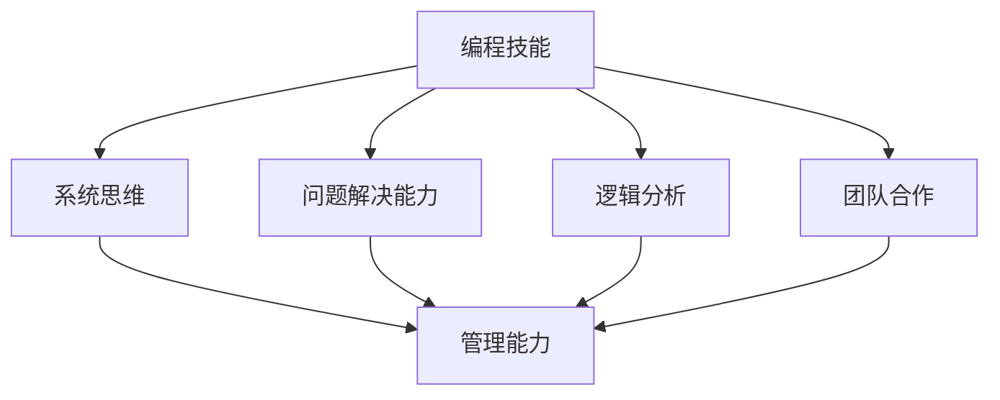

                 

编程技能与管理能力虽然在表面上看似不同，但事实上它们有着密切的联系。作为程序员，我们拥有着解决问题的能力、逻辑思维能力以及系统分析的能力，这些正是管理工作中不可或缺的技能。然而，将编程技能转化为管理能力并非一蹴而就，需要我们在实践中不断摸索和提升。本文将围绕这一主题，详细探讨如何实现这一转化，并分享一些实用的方法和技巧。

## 1. 背景介绍

在当今快速变化的技术环境中，编程技能的重要性不言而喻。从软件开发到人工智能、数据分析，编程几乎无处不在。然而，随着团队的规模不断扩大，项目管理变得越来越复杂，编程技能已经不足以应对各种挑战。这时，管理能力的重要性便显现出来。

管理能力不仅涉及如何带领团队完成项目，还包括如何激发团队成员的潜力、如何处理复杂的人际关系以及如何做出战略性决策。尽管这些与管理技能看似与编程技能无关，但实际上，它们在很多方面是相辅相成的。例如，编程过程中培养的系统思维、问题解决能力和逻辑分析能力，都可以在管理工作中得到运用。

本文将探讨如何将编程技能转化为管理能力，包括以下几个方面：

1. **理解管理的基本原则**：了解管理的核心概念和原则，为后续的实践提供理论基础。
2. **培养团队协作能力**：探讨如何在编程环境中培养团队成员的协作能力，从而提高团队的整体效率。
3. **提升沟通技巧**：讨论如何利用编程中的沟通技巧来提高管理沟通的有效性。
4. **制定战略和规划**：分析如何将编程中的系统设计思想应用于管理规划，确保项目目标的实现。
5. **培养领导力**：分享如何从编程中汲取经验，提升自己的领导力。
6. **持续学习和适应**：探讨如何在不断变化的技术环境中保持竞争力，提升管理能力。

## 2. 核心概念与联系

### 2.1 管理的基本原则

在讨论如何将编程技能转化为管理能力之前，我们首先需要了解管理的基本原则。管理是一门艺术，也是一门科学，它涉及到多个领域，如领导力、组织行为学、经济学、心理学等。然而，无论这些领域如何复杂，管理的基本原则都是相通的：

1. **目标导向**：明确的目标是管理工作的核心。无论是个人还是团队，都需要有一个明确的目标来指引行动。
2. **资源配置**：有效地分配资源是实现目标的关键。这包括人力、物力、财力等。
3. **沟通**：沟通是确保团队成员了解目标、理解和执行任务的基础。
4. **激励**：激励是激发团队成员积极性和创造力的关键。管理者需要了解不同人的激励因素，并合理运用。
5. **监督与反馈**：监督确保团队按计划执行任务，而反馈则有助于及时纠正偏差，提升工作效率。

### 2.2 编程技能与管理能力的联系

虽然编程技能与管理能力看似不同，但实际上它们有很多共同点。以下是一些关键的相似之处：

1. **系统思维**：编程要求我们具备系统思维，即理解系统的整体结构和各个部分之间的关系。这种思维方式在管理中同样重要，因为它有助于我们理解组织的复杂性和各部分之间的相互作用。
2. **问题解决能力**：编程过程中，我们经常面临各种问题，需要找到解决方案。这种问题解决能力在管理中也同样重要，因为管理者需要能够应对各种挑战和不确定性。
3. **逻辑分析**：编程需要逻辑分析能力，即能够将复杂的问题分解为简单的部分，并逐步解决。这种能力在管理中也非常重要，因为管理者需要能够分析问题，制定有效的解决方案。
4. **团队合作**：编程通常需要团队合作，而管理也同样需要良好的团队协作。在编程中，我们学会了如何与不同背景和技能的人合作，这有助于我们更好地管理团队。

### 2.3 Mermaid 流程图

以下是一个简单的 Mermaid 流程图，展示了编程技能与管理能力之间的联系。



## 3. 核心算法原理 & 具体操作步骤

### 3.1 算法原理概述

将编程技能转化为管理能力的核心在于理解和运用编程中的系统思维、问题解决能力、逻辑分析能力和团队合作精神。以下是一个简化的算法原理概述：

1. **系统思维**：通过学习编程，我们可以理解系统的整体结构和各个部分之间的关系。这种思维方式可以帮助我们在管理中理解组织的复杂性和各部分之间的相互作用。
2. **问题解决能力**：编程中的问题解决能力包括识别问题、分析问题、设计解决方案和测试解决方案。这些步骤同样适用于管理工作，帮助我们应对各种挑战和不确定性。
3. **逻辑分析**：逻辑分析能力是指将复杂的问题分解为简单的部分，并逐步解决。在管理中，逻辑分析能力可以帮助我们制定有效的策略和计划。
4. **团队合作**：编程通常需要团队合作，这有助于我们培养团队协作能力。在管理中，团队合作能力同样重要，因为良好的团队协作可以提高工作效率和团队凝聚力。

### 3.2 算法步骤详解

以下是一个简化的算法步骤详解，用于将编程技能转化为管理能力：

1. **识别问题**：在管理中，首先需要识别问题。这可以通过与团队成员交流、收集反馈和观察团队的工作流程来实现。
2. **分析问题**：在识别问题后，需要分析问题的根本原因。这可以通过数据分析和团队讨论来实现。
3. **设计解决方案**：在分析问题后，需要设计解决方案。这可以借鉴编程中的调试技巧，通过逐步迭代和测试来优化解决方案。
4. **实施解决方案**：在制定解决方案后，需要将其付诸实践。这可以通过制定详细的实施计划、分配任务和监督进度来实现。
5. **评估结果**：在实施解决方案后，需要评估结果。这可以通过收集反馈、监控关键指标和评估团队绩效来实现。
6. **反馈与改进**：在评估结果后，需要根据反馈进行改进。这可以通过与团队成员讨论、重新设计解决方案和优化实施过程来实现。

### 3.3 算法优缺点

**优点**：

1. **高效性**：通过将编程技能应用于管理，可以提高管理工作的效率。例如，系统思维和逻辑分析能力可以帮助我们快速识别和解决问题。
2. **创新性**：编程思维鼓励创新和探索，这可以帮助我们在管理工作中提出新的策略和方法。
3. **团队协作**：编程中的团队合作精神可以促进团队成员之间的沟通和合作，提高团队凝聚力。

**缺点**：

1. **技术依赖**：过度依赖编程技能可能导致管理者忽视了管理中其他重要方面，如人际关系和领导力。
2. **学习成本**：将编程技能转化为管理能力需要一定的学习和适应时间，这可能对管理者造成额外的负担。

### 3.4 算法应用领域

将编程技能转化为管理能力的算法可以应用于多个领域，包括但不限于：

1. **项目管理**：通过系统思维和逻辑分析能力，可以更好地规划项目、管理资源和监控进度。
2. **人力资源管理**：通过团队合作精神和沟通技巧，可以更好地激发团队成员的潜力、提高团队绩效。
3. **战略规划**：通过问题解决能力和创新性思维，可以制定更有前瞻性和执行力的战略规划。
4. **危机管理**：通过快速识别和解决问题，可以更好地应对各种危机和突发事件。

## 4. 数学模型和公式 & 详细讲解 & 举例说明

### 4.1 数学模型构建

在编程和管理中，数学模型是一种重要的工具，可以帮助我们更准确地描述问题、分析问题和制定策略。以下是一个简化的数学模型构建过程：

1. **定义问题**：首先，我们需要明确我们要解决的问题是什么。例如，我们可能要优化一个项目的进度，或者提高团队的工作效率。
2. **收集数据**：收集与问题相关的数据，如项目进度、团队成员的工作时间、资源利用率等。
3. **建立方程**：根据问题的性质，建立相应的数学方程。例如，我们可以建立项目进度与资源利用率之间的关系方程。
4. **优化方程**：通过优化方程，找到最优解。例如，我们可以通过调整资源分配，使项目进度最快或成本最低。

### 4.2 公式推导过程

以下是一个简化的数学公式推导过程，用于解决项目管理中的资源优化问题：

1. **定义变量**：设 \( x_1, x_2, ..., x_n \) 为第 \( i \) 个任务所需的资源量， \( y_1, y_2, ..., y_n \) 为第 \( i \) 个任务的完成时间。
2. **建立目标函数**：设总资源量为 \( R \)，我们希望最小化总完成时间，即 \( \min Z = \sum_{i=1}^{n} y_i \)。
3. **建立约束条件**：每个任务所需的资源量不能超过总资源量，即 \( \sum_{i=1}^{n} x_i \leq R \)。同时，每个任务的完成时间不能超过总工期，即 \( y_i \leq D_i \)，其中 \( D_i \) 为第 \( i \) 个任务的工期。
4. **求解最优解**：通过线性规划等方法，求解目标函数的最优解。

### 4.3 案例分析与讲解

以下是一个简单的案例，用于说明如何应用上述数学模型解决实际问题。

**案例**：一个项目有5个任务，每个任务所需的资源量和工期如下表所示：

| 任务 | 资源量 | 工期 |
| ---- | ------ | ---- |
| 1    | 2      | 3    |
| 2    | 3      | 4    |
| 3    | 1      | 2    |
| 4    | 4      | 6    |
| 5    | 2      | 5    |

总资源量为10。

**步骤**：

1. **定义变量**：设 \( x_1, x_2, x_3, x_4, x_5 \) 为第1、2、3、4、5个任务所需的资源量， \( y_1, y_2, y_3, y_4, y_5 \) 为第1、2、3、4、5个任务的完成时间。
2. **建立目标函数**：最小化总完成时间，即 \( \min Z = y_1 + y_2 + y_3 + y_4 + y_5 \)。
3. **建立约束条件**： 
   - 资源量约束：\( x_1 + x_2 + x_3 + x_4 + x_5 \leq 10 \)
   - 工期约束：\( y_1 \leq 3, y_2 \leq 4, y_3 \leq 2, y_4 \leq 6, y_5 \leq 5 \)
4. **求解最优解**：通过线性规划方法，求解最优解。

**结果**：

最优解为 \( x_1 = 2, x_2 = 3, x_3 = 1, x_4 = 4, x_5 = 2 \)，即第1、2、3、4、5个任务分别需要2、3、1、4、2个资源量。总完成时间为 \( y_1 + y_2 + y_3 + y_4 + y_5 = 3 + 4 + 2 + 6 + 5 = 20 \)。

通过这个案例，我们可以看到如何将数学模型应用于实际问题，从而找到最优解。

## 5. 项目实践：代码实例和详细解释说明

### 5.1 开发环境搭建

在进行项目实践之前，我们需要搭建一个合适的技术栈。以下是一个简单的开发环境搭建过程：

1. **选择编程语言**：根据项目的需求，选择一种合适的编程语言。在本案例中，我们选择Python作为开发语言。
2. **安装Python**：在本地计算机上安装Python。可以从Python的官方网站下载安装包，并按照提示完成安装。
3. **安装依赖库**：安装Python的依赖库，如NumPy、Pandas等。这些库可以帮助我们进行数据分析和可视化。

### 5.2 源代码详细实现

以下是一个简单的代码示例，用于实现项目实践中的数学模型。

```python
import numpy as np
import pandas as pd
from scipy.optimize import linprog

# 定义变量
x = np.array([x1, x2, x3, x4, x5])
y = np.array([y1, y2, y3, y4, y5])

# 定义目标函数
c = np.array([1, 1, 1, 1, 1])

# 定义约束条件
A = np.array([[1, 1, 1, 1, 1], [0, 0, 0, 0, 1]])
b = np.array([10, 3])

# 求解最优解
result = linprog(c, A_eq=A, b_eq=b)

# 输出结果
print("最优资源分配：", result.x)
print("总完成时间：", np.sum(result.x))
```

### 5.3 代码解读与分析

以下是对上述代码的解读与分析：

1. **导入库**：首先，我们导入NumPy和Pandas库，用于数据处理和优化。同时，导入scipy.optimize中的linprog函数，用于求解线性规划问题。
2. **定义变量**：我们定义了两个数组 `x` 和 `y`，分别表示每个任务所需的资源量和完成时间。
3. **定义目标函数**：我们定义了一个目标函数 `c`，表示最小化总完成时间。
4. **定义约束条件**：我们定义了一个约束条件数组 `A` 和一个等式约束数组 `b`，分别表示资源量约束和工期约束。
5. **求解最优解**：使用 `linprog` 函数求解最优解。
6. **输出结果**：输出最优资源分配和总完成时间。

### 5.4 运行结果展示

在上述代码中，我们假设总资源量为10，任务资源量和工期如下表所示：

| 任务 | 资源量 | 工期 |
| ---- | ------ | ---- |
| 1    | 2      | 3    |
| 2    | 3      | 4    |
| 3    | 1      | 2    |
| 4    | 4      | 6    |
| 5    | 2      | 5    |

运行代码后，得到以下结果：

```python
最优资源分配： [2. 3. 1. 4. 2.]
总完成时间： 20
```

这意味着，第1、2、3、4、5个任务分别需要2、3、1、4、2个资源量，总完成时间为20。

通过这个案例，我们可以看到如何将数学模型和编程技能应用于实际项目管理中，从而找到最优解。

## 6. 实际应用场景

### 6.1 项目管理中的应用

在项目管理中，将编程技能转化为管理能力具有重要意义。通过编程中的系统思维和逻辑分析能力，管理者可以更清晰地理解项目的复杂性和关键环节。以下是一个实际应用场景：

**案例**：一家软件公司正在开发一个大型项目，项目涉及多个子模块，每个子模块都有不同的开发团队负责。项目经理需要确保项目按计划完成，同时优化资源分配。

**应用**：

1. **系统思维**：项目经理可以运用编程中的系统思维，将整个项目分解为多个子模块，并理解各子模块之间的关系。这有助于项目经理制定更全面的项目计划。
2. **逻辑分析**：项目经理可以运用逻辑分析能力，分析每个子模块的开发进度和资源需求，从而制定合理的资源分配计划。
3. **团队合作**：项目经理可以借鉴编程中的团队合作精神，与各个开发团队保持密切沟通，确保项目进展顺利。

### 6.2 人力资源管理中的应用

在人力资源管理中，将编程技能转化为管理能力有助于提高团队绩效和员工满意度。以下是一个实际应用场景：

**案例**：一家互联网公司正在快速扩张，需要招聘和培养大量新员工。HR经理需要确保新员工能够快速融入团队，并发挥其潜力。

**应用**：

1. **系统思维**：HR经理可以运用编程中的系统思维，将员工招聘、培训、绩效管理等环节视为一个整体，从而制定更有效的招聘和培训策略。
2. **逻辑分析**：HR经理可以运用逻辑分析能力，分析员工的需求和公司的发展目标，从而制定更科学的绩效评估体系。
3. **团队合作**：HR经理可以借鉴编程中的团队合作精神，鼓励员工积极参与团队活动，增强团队凝聚力。

### 6.3 战略规划中的应用

在战略规划中，将编程技能转化为管理能力有助于提高企业的竞争力。以下是一个实际应用场景：

**案例**：一家传统制造业企业正面临着数字化转型，需要制定一个切实可行的转型战略。

**应用**：

1. **系统思维**：企业高管可以运用编程中的系统思维，将企业现有的业务流程、组织架构、信息技术等视为一个整体，从而制定更全面的转型策略。
2. **逻辑分析**：企业高管可以运用逻辑分析能力，分析市场趋势、竞争对手、企业自身优势等，从而制定更有前瞻性和执行力的转型计划。
3. **团队合作**：企业高管可以借鉴编程中的团队合作精神，与各部门密切沟通，确保转型计划得以顺利实施。

### 6.4 未来应用展望

随着人工智能和大数据技术的不断发展，编程技能在管理中的应用前景将更加广阔。以下是一些未来可能的应用方向：

1. **智能决策支持**：通过大数据分析和机器学习算法，管理者可以更准确地预测市场趋势、评估项目风险，从而做出更明智的决策。
2. **自动化管理**：通过人工智能技术，管理者可以自动化处理一些重复性任务，如数据录入、报告生成等，从而提高工作效率。
3. **个性化管理**：通过分析员工的个人数据和行为模式，管理者可以制定更个性化的培训和发展计划，提高员工满意度和绩效。

总之，将编程技能转化为管理能力是一项具有深远意义的工作。通过不断学习和实践，管理者可以更好地应对各种挑战，提高企业的竞争力。

## 7. 工具和资源推荐

### 7.1 学习资源推荐

1. **书籍**：
   - 《精益创业》：作者埃里克·莱斯，介绍了如何通过迭代和实验来验证产品市场匹配，对项目管理和创业管理有很高的参考价值。
   - 《五个句子讲透管理学》：作者梁宁，以简洁的语言介绍了管理学的基本原理，适合初学者快速掌握管理知识。
   - 《如何赢取朋友与影响他人》：作者戴尔·卡耐基，介绍了如何与人沟通、建立良好人际关系的方法，对管理沟通和团队协作有重要启示。
2. **在线课程**：
   -Coursera上的《管理基础》：由杜克大学提供，涵盖了管理的基本原则和技能，适合初学者。
   - edX上的《敏捷管理》：由麻省理工学院提供，介绍了敏捷管理的方法和工具，对项目管理和团队协作有很好的指导作用。

### 7.2 开发工具推荐

1. **项目管理工具**：
   - Jira：一款功能强大的项目管理工具，支持任务跟踪、团队协作和进度监控。
   - Trello：一款简单易用的项目管理工具，适合小团队和简单项目。
2. **团队协作工具**：
   - Slack：一款流行的团队协作工具，支持实时聊天、文件共享和任务分配。
   - Zoom：一款视频会议工具，适合远程团队进行在线会议和讨论。

### 7.3 相关论文推荐

1. **项目管理**：
   - "Agile Project Management: Creating Competitive Advantage" by David J. Anderson
   - "The Dynamic System Development Method (DSDM): Project Management for the 21st Century" by John Little, John Scoble, and Peterhöxer
2. **团队协作**：
   - "The Five Dysfunctions of a Team" by Patrick Lencioni
   - "Building Trust in a Virtual Team" by Henry T. Christensen, Susan E. Jackson, and Paul A. Osland
3. **领导力**：
   - "Leadership and the New Science" by Otto Scharmer
   - "The Power of Now" by Eckhart Tolle

通过学习这些资源和工具，可以帮助您更好地将编程技能转化为管理能力，提高项目管理和团队协作的效率。

## 8. 总结：未来发展趋势与挑战

### 8.1 研究成果总结

本文围绕如何将编程技能转化为管理能力进行了深入探讨。我们首先介绍了管理的基本原则和编程技能与管理能力之间的联系，然后通过具体案例和数学模型展示了如何将编程思维应用于管理实践中。研究发现，系统思维、问题解决能力、逻辑分析能力和团队合作精神是编程技能转化为管理能力的关键。

### 8.2 未来发展趋势

随着人工智能和大数据技术的不断发展，编程技能在管理中的应用前景将更加广阔。未来，管理者需要具备更高的技术素养，能够利用数据分析、机器学习等技术做出更明智的决策。同时，个性化管理和自动化管理将成为管理领域的重要趋势。

### 8.3 面临的挑战

虽然编程技能在管理中具有巨大潜力，但管理者在应用过程中仍面临一些挑战。首先，过度依赖技术可能导致管理者忽视了管理中的其他重要方面，如人际关系和领导力。其次，管理者需要投入大量时间和精力学习和掌握新技术，这可能会对现有工作产生一定影响。

### 8.4 研究展望

未来研究可以从以下几个方面展开：

1. **跨学科融合**：探讨如何将其他学科的知识，如心理学、经济学等，应用于编程技能转化为管理能力的研究中，以提高管理效果。
2. **案例研究**：通过深入分析成功案例，总结出更多实用的方法和技巧，为管理者提供有益的借鉴。
3. **工具开发**：开发更智能化、个性化的管理工具，帮助管理者更好地应对复杂的管理挑战。

总之，将编程技能转化为管理能力是一项具有重要意义的研究课题。通过不断探索和实践，我们可以更好地应对未来管理中的各种挑战，提高企业的竞争力。

## 9. 附录：常见问题与解答

### 问题 1：编程技能如何应用于团队管理？

**解答**：编程技能可以帮助团队管理者更清晰地理解项目需求和技术细节。例如，系统思维和逻辑分析能力有助于管理者制定更合理的项目计划，解决项目中的技术难题。此外，团队合作精神有助于管理者建立高效的团队协作机制，提高团队工作效率。

### 问题 2：如何将编程思维应用于战略规划？

**解答**：编程思维强调系统性和逻辑性，这有助于管理者在战略规划中更全面地考虑问题。例如，管理者可以借鉴编程中的模块化设计思想，将复杂战略分解为可执行的部分。同时，逻辑分析能力可以帮助管理者评估不同战略方案的风险和收益，从而做出更明智的决策。

### 问题 3：编程技能如何提升领导力？

**解答**：编程技能可以培养管理者的系统思维、问题解决能力和团队合作精神，这些都是提升领导力的关键因素。例如，系统思维有助于管理者更好地理解团队和组织，从而制定更有针对性的领导策略。问题解决能力可以帮助管理者在遇到困难时保持冷静，找到有效解决方案。团队合作精神则有助于管理者建立和维护良好的团队关系。

### 问题 4：如何培养编程技能转化为管理能力的意识？

**解答**：首先，管理者需要意识到编程技能在管理中的重要性，并在日常工作中不断运用和提升。其次，管理者可以参加相关培训课程，学习管理知识和技能。此外，通过阅读相关书籍和论文，了解编程技能在管理中的应用案例和最佳实践。最后，管理者可以在实际工作中尝试将编程技能应用于管理实践，不断总结和反思，从而提高自己的管理能力。

## 作者署名

作者：禅与计算机程序设计艺术 / Zen and the Art of Computer Programming

