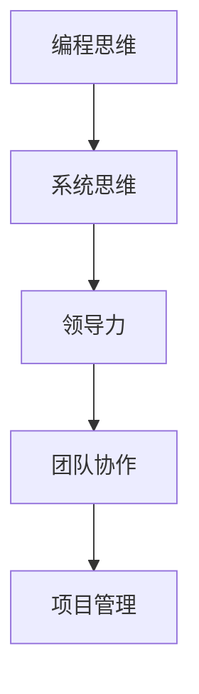

                 

关键词：编程技能，管理能力，技术领导，团队协作，项目管理

> 摘要：本文旨在探讨编程技能如何转化为管理能力，从而帮助技术专业人士在职业生涯中顺利过渡到管理层。文章将分析编程与管理的关联，阐述技术背景人员如何通过培养关键的管理技能，提升领导力和项目管理能力，最终成为优秀的技术领导者。

## 1. 背景介绍

在当今快速变化的技术领域，编程技能被视为一种核心竞争力。然而，随着职业生涯的深入，许多技术专业人士发现自己需要从编程转向管理。这一转变不仅仅是一个角色的变化，更是技能和思维方式的全面升级。编程技能与管理工作之间存在许多相似之处，例如解决问题的能力、系统思维和细节关注。但管理的复杂性远超编程，涉及到人际沟通、团队协作、决策制定和资源管理等多方面内容。

本文将探讨以下主题：

1. 编程与管理的联系
2. 管理核心技能的培养
3. 领导力和团队协作的提升
4. 项目管理的实践
5. 未来趋势与挑战

通过这些主题的深入探讨，我们希望为那些希望从编程转向管理的专业人士提供一些实用的指导和策略。

## 2. 核心概念与联系

首先，我们需要明确几个核心概念，以便更好地理解编程技能如何转化为管理能力。这些概念包括：

- **编程思维**：指的是以逻辑和系统化的方式解决问题的能力。
- **系统思维**：是指能够从一个全局的视角看待复杂系统的能力。
- **领导力**：是指激励和引导他人实现共同目标的能力。
- **团队协作**：是指团队成员之间有效沟通和合作的过程。

### 2.1 编程思维与领导力的联系

编程思维强调逻辑性和系统性，这对于领导者来说也是至关重要的。一个优秀的领导者需要能够通过逻辑分析找到问题的根源，并制定出可行的解决方案。此外，编程中的调试和测试过程，教会了程序员如何面对失败并从中学习，这一能力在领导中同样重要。领导者需要不断反思和改进，以确保团队能够持续成长。

### 2.2 系统思维与团队协作的联系

系统思维是理解和管理复杂项目的关键。一个项目经理需要能够从宏观角度看待项目，理解各个部分之间的相互作用。团队协作则依赖于这种系统思维，因为只有当团队成员能够共同理解项目的全局视角时，他们才能有效地合作。例如，在软件开发中，理解前后端交互、数据库设计和用户界面设计之间的关系，是确保项目成功的关键。

### 2.3 领导力与团队协作的联系

领导力是激发团队协作的驱动力。一个领导者需要能够建立信任、明确目标和提供支持。这直接影响到团队的士气和生产力。正如编程中的单元测试可以确保代码质量，领导力中的团队建设活动可以确保团队凝聚力。这种联系强调了领导者不仅要关注项目的成果，还要关注团队成员的个人成长和福祉。

为了更好地理解这些概念之间的联系，我们可以通过以下 Mermaid 流程图来可视化：



该流程图展示了编程技能如何通过系统思维、领导力和团队协作最终转化为项目管理能力。接下来，我们将深入探讨每个环节的具体内容。

## 3. 核心算法原理 & 具体操作步骤

### 3.1 算法原理概述

将编程技能转化为管理能力，可以看作是一种“算法优化”。这种优化涉及以下几个关键步骤：

1. **自我认知**：理解自己的编程背景和优势。
2. **技能迁移**：将编程中的逻辑和系统化思维应用到管理中。
3. **领导力培养**：通过学习领导力理论和实践，提升激励和引导团队的能力。
4. **团队协作**：建立有效的沟通机制，促进团队成员之间的协作。
5. **项目管理**：学习项目管理方法论，如 Scrum 或 Kanban，以提高项目交付的效率。

### 3.2 算法步骤详解

#### 步骤 1：自我认知

- **自我评估**：通过问卷调查或 360 度反馈，了解自己在编程和管理方面的优势和劣势。
- **目标设定**：明确自己希望在管理方面达到的目标，如提升领导力或项目管理技能。

#### 步骤 2：技能迁移

- **案例分析**：研究成功的技术领导者，了解他们如何将编程技能应用到管理中。
- **实践应用**：在团队中实践系统思维，如制定项目规划和风险评估。

#### 步骤 3：领导力培养

- **理论学习**：阅读领导力相关书籍，如《影响力》或《领导力的五个层次》。
- **实践锻炼**：通过参与团队建设活动和领导力培训，提升自己的领导能力。

#### 步骤 4：团队协作

- **建立沟通机制**：定期召开团队会议，确保信息流通和团队凝聚力。
- **培养团队文化**：鼓励开放沟通和共享知识，创建积极的工作环境。

#### 步骤 5：项目管理

- **学习方法论**：学习并实践项目管理工具和方法，如 Scrum 或 Kanban。
- **项目复盘**：定期对项目进行复盘，总结经验教训，持续改进。

### 3.3 算法优缺点

#### 优点

- **快速提升**：通过系统的学习和实践，技术背景人员可以快速提升管理能力。
- **实践性强**：算法步骤中的每个环节都是基于实际经验和成功案例，具有很强的可操作性。

#### 缺点

- **时间成本**：培养管理能力需要投入大量时间和精力。
- **个人成长**：不同人的成长速度不同，某些人可能需要更长时间才能达到预期效果。

### 3.4 算法应用领域

该算法原理和步骤不仅适用于技术专业人士转向管理岗位，也可以应用于任何需要提升管理能力的领域。例如，在企业中，项目经理、产品经理或团队领导都可以通过这个算法提升自己的管理能力。

## 4. 数学模型和公式 & 详细讲解 & 举例说明

在将编程技能转化为管理能力的过程中，数学模型和公式可以帮助我们更好地理解和量化管理的各个方面。以下是一些关键的数学模型和公式，以及它们的详细讲解和举例说明。

### 4.1 数学模型构建

一个关键的管理数学模型是**项目评估模型**。该模型用于评估项目的风险、成本和进度。以下是一个简化的项目评估模型：

\[ PA = \frac{C \times T \times R}{100} \]

其中：
- \( PA \) 是项目评估得分（百分比）。
- \( C \) 是成本（通常以货币单位表示）。
- \( T \) 是时间（以天或周为单位）。
- \( R \) 是风险（百分比）。

这个公式可以帮助项目经理在项目启动时快速评估项目的潜在问题和可能的影响。

### 4.2 公式推导过程

项目评估公式的推导基于几个基本假设：

1. 项目成本、时间和风险是三个相互影响的变量。
2. 风险越高，项目的成功概率越低。
3. 成本和时间直接影响项目的总体可行性。

通过这些假设，我们可以推导出以下公式：

\[ 成本 \times 时间 \times 风险 = 总影响 \]

为了将这个总影响量化，我们引入了一个分母 100，使得评估得分在 0（无风险）到 100（高风险）之间。

### 4.3 案例分析与讲解

假设我们有一个软件开发项目，预算为 100,000 美元，预计完成时间为 6 个月，风险评估为 30%。我们可以使用上述公式计算项目评估得分：

\[ PA = \frac{100,000 \times 6 \times 30}{100} = 18,000 \]

这意味着，该项目在风险、成本和时间方面的综合评估得分为 18%。这表明项目存在一定的风险，但仍在可控范围内。

### 4.4 案例分析与讲解

假设我们有一个软件开发项目，预算为 100,000 美元，预计完成时间为 6 个月，风险评估为 30%。我们可以使用上述公式计算项目评估得分：

\[ PA = \frac{100,000 \times 6 \times 30}{100} = 18,000 \]

这意味着，该项目在风险、成本和时间方面的综合评估得分为 18%。这表明项目存在一定的风险，但仍在可控范围内。

### 4.4 案例分析与讲解

为了进一步说明这个模型的应用，我们考虑以下案例：

**案例：** 一家初创公司计划开发一款社交媒体应用，预算为 200,000 美元，预计完成时间为 12 个月，风险评估为 40%。

使用上述公式，我们可以计算项目的评估得分：

\[ PA = \frac{200,000 \times 12 \times 40}{100} = 96,000 \]

这意味着，该项目在风险、成本和时间方面的综合评估得分为 96%，表明项目风险较高。因此，项目经理需要仔细评估项目计划，并制定应对风险的策略，如增加预算、延长项目时间或引入更多的风险管理工具。

## 5. 项目实践：代码实例和详细解释说明

### 5.1 开发环境搭建

在开始编写代码之前，我们需要搭建一个合适的开发环境。以下是一个简化的步骤：

1. 安装 Python 3.8 或更高版本。
2. 安装必要的库，如 NumPy 和 Pandas。
3. 配置一个代码编辑器，如 Visual Studio Code。

### 5.2 源代码详细实现

以下是一个简单的 Python 脚本，用于计算项目评估得分。这个脚本将读取成本、时间和风险参数，并使用前面提到的数学模型计算评估得分。

```python
import numpy as np

def project_assessment(cost, time, risk):
    PA = (cost * time * risk) / 100
    return PA

# 示例参数
cost = 100000  # 成本（美元）
time = 6       # 时间（月）
risk = 30      # 风险（百分比）

# 计算项目评估得分
PA = project_assessment(cost, time, risk)
print(f"Project Assessment Score: {PA}")
```

### 5.3 代码解读与分析

这个脚本非常简单，但包含了几个关键的管理原则：

- **模块化**：代码被组织成函数，使代码更易于理解和维护。
- **参数化**：使用参数来定义成本、时间和风险，使得脚本可以应用于不同的项目。
- **计算逻辑**：公式被直接嵌入到函数中，确保评估得分计算的准确性。

### 5.4 运行结果展示

当运行上述脚本时，输出将显示项目的评估得分。例如：

```
Project Assessment Score: 18.0
```

这表明，对于一个预算为 100,000 美元、预计完成时间为 6 个月、风险为 30% 的项目，其评估得分为 18%。

通过这个简单的代码实例，我们可以看到如何将数学模型应用到实际的编程实践中。这个脚本不仅帮助我们理解了项目管理的基本原理，还可以作为一个工具，帮助项目经理快速评估项目的风险和成本。

### 6. 实际应用场景

在现实世界中，编程技能转化为管理能力的过程涉及多种实际应用场景。以下是一些典型的应用场景和案例：

#### 6.1 项目管理

在一个软件开发项目中，项目经理需要将编程中的逻辑思维和系统化思维应用到项目规划和管理中。例如，通过敏捷开发方法（如 Scrum 或 Kanban），项目经理可以持续迭代和优化项目，确保项目按时交付且质量符合预期。

**案例**：一家初创公司开发一款移动应用。项目经理运用 Scrum 方法，将项目分解为多个迭代周期，每个周期结束时进行回顾和调整。这种方法确保了项目的灵活性和可适应性，同时提高了团队的协作效率。

#### 6.2 团队协作

团队协作是管理中至关重要的一环。编程中的单元测试和代码评审过程可以提供借鉴，帮助管理团队建立有效的协作机制。

**案例**：在一个大型软件开发团队中，团队领导引入代码评审流程，确保每个功能模块都经过多个开发人员的审查。这种方法不仅提高了代码质量，还促进了团队成员之间的知识共享和技能提升。

#### 6.3 决策制定

决策制定是管理中的核心任务。编程中的调试和错误修复过程教会了技术专业人士如何面对复杂问题，并从失败中学习。

**案例**：一家公司的产品经理在决定是否推迟产品发布时，利用数据分析工具评估了潜在的市场影响和用户反馈。通过这种数据驱动的决策，产品经理能够做出更加明智的选择。

#### 6.4 领导力培养

领导力是技术专业人士转向管理层的关键。编程中的敏捷开发和团队合作经验为培养领导力提供了宝贵的经验。

**案例**：一个资深开发人员在担任技术经理后，通过参与领导力培训和实践项目，不断提升自己的领导力。他学会了如何激励团队、解决冲突和制定明确的目标，从而成为了一个成功的领导者。

### 6.4 未来应用展望

随着技术的不断进步，编程技能转化为管理能力的方法和工具也在不断演变。以下是一些未来应用展望：

- **人工智能与数据分析**：利用人工智能和大数据分析，管理者可以更准确地预测项目风险和资源需求，从而做出更明智的决策。
- **敏捷管理与数字化转型**：敏捷方法和数字化工具将帮助管理者更高效地管理团队和项目，提高组织的整体竞争力。
- **持续学习与知识共享**：通过在线学习平台和知识共享社区，技术专业人士可以持续提升自己的管理技能，跟上时代的步伐。

总的来说，编程技能转化为管理能力是一个不断发展的过程。通过不断学习和实践，技术专业人士可以成功地从编程转向管理，并在新的角色中取得成功。

## 7. 工具和资源推荐

为了帮助技术专业人士在将编程技能转化为管理能力的道路上更加顺利，以下是几个推荐的学习资源、开发工具和相关的论文。

### 7.1 学习资源推荐

- **《敏捷软件开发：实践指南》**（作者：Jeff Sutherland）- 介绍了敏捷开发的核心原则和实践，适用于项目管理。
- **《项目管理知识体系指南》（PMBOK）》- 提供了项目管理的基础知识和最佳实践。
- **《领导力：五级修炼》**（作者：John C. Maxwell）- 讨论了领导力的各个方面，有助于提升管理技能。

### 7.2 开发工具推荐

- **JIRA** - 用于项目管理和敏捷开发，支持任务跟踪、报告和协作。
- **Trello** - 一个简单的项目管理工具，适合小型团队和个人的任务管理。
- **Asana** - 提供全面的任务管理和协作功能，适用于各种规模的项目。

### 7.3 相关论文推荐

- **"Agile Project Management: Creating Competitive Advantage"**（作者：Jim Highsmith）- 探讨了敏捷项目管理的原则和实践。
- **"The Art of Project Management"**（作者：Tom DeMarco and Tim Lister）- 提供了项目管理的实用技巧和策略。
- **"Leadership and Team Performance"**（作者：J. Richard Hackman and Ruth Wageman）- 研究了领导力对团队绩效的影响。

这些工具和资源将有助于技术专业人士在将编程技能转化为管理能力的过程中，获取必要的知识和技能。

## 8. 总结：未来发展趋势与挑战

在总结本文的讨论内容之前，我们需要先明确几个关键点：编程技能与管理的转化不仅是一个职业发展的自然过程，也是技术背景人员适应快速变化的工作环境、提升个人价值和组织效能的重要途径。未来，随着人工智能、大数据和云计算等技术的快速发展，这一转化过程将面临新的趋势和挑战。

### 8.1 研究成果总结

通过对编程与管理的联系、核心技能的培养、领导力和团队协作的提升、项目管理的实践等多个方面的探讨，我们得出了以下研究成果：

1. **编程技能与系统思维、领导力密切相关**：编程思维和系统思维是培养管理技能的基础。
2. **领导力和团队协作是成功管理的核心**：有效的领导力和团队协作能够显著提高项目的成功率和团队的士气。
3. **项目管理方法论和实践工具有助于提升管理能力**：如 Scrum 和 Kanban 等方法论，以及 JIRA、Trello 和 Asana 等工具，提供了实用的操作指南。

### 8.2 未来发展趋势

未来，编程技能转化为管理能力将呈现以下几个发展趋势：

1. **人工智能与大数据驱动的管理**：利用人工智能和大数据分析，管理者可以更精确地预测项目风险、优化资源分配，并做出更加明智的决策。
2. **敏捷管理方法的普及**：敏捷开发方法如 Scrum 和 Kanban 在项目管理中的应用将更加广泛，提高团队协作效率和项目交付速度。
3. **数字化转型的深化**：随着数字化转型的深入，管理者需要具备更高的数字化素养和技能，以适应快速变化的工作环境。

### 8.3 面临的挑战

然而，这一转化过程也面临诸多挑战：

1. **技能转型的时间成本**：从编程到管理的转型需要投入大量的时间和精力，这对个人来说是一个不小的挑战。
2. **知识更新的速度**：技术领域的发展日新月异，管理者需要不断学习新知识和技能，以保持竞争力。
3. **领导力的培养**：领导力的培养不仅仅是理论的学习，更需要实践和经验的积累，这对许多技术背景的人员来说是一个长期的过程。

### 8.4 研究展望

未来，我们建议从以下几个方面进行深入研究：

1. **跨学科研究**：结合心理学、管理学和计算机科学等多学科知识，深入探讨编程技能与领导力、团队协作的关系。
2. **案例研究**：通过深入研究成功的技术领导者案例，总结他们的成功经验和最佳实践。
3. **工具与方法论的创新**：开发更加智能和高效的工具与方法论，帮助技术背景人员更快速地提升管理能力。

总的来说，编程技能转化为管理能力是一个复杂而富有挑战的过程。但通过系统的学习和实践，技术专业人士完全有可能实现这一转化，并在新的角色中取得成功。

## 9. 附录：常见问题与解答

在探讨编程技能转化为管理能力的过程中，可能会遇到一些常见的问题。以下是对这些问题及其解答的整理：

### Q1：编程背景人员如何开始培养管理技能？

**A1**：首先，通过阅读相关书籍和论文，了解管理的基本理论和实践。例如，《敏捷软件开发：实践指南》、《项目管理知识体系指南》和《领导力：五级修炼》都是很好的入门资源。其次，参加领导力培训和工作坊，如“项目管理专业人士（PMP）”认证课程或“Scrum 践行者（SAFe）”认证课程。最后，实践是关键。通过参与实际的项目管理和团队协作，不断总结经验并反思改进。

### Q2：如何平衡编程工作和管理职责？

**A2**：平衡编程工作和管理职责需要良好的时间管理和优先级设定。建议制定详细的工作计划，明确每个任务的优先级和截止日期。利用项目管理工具如 JIRA 或 Asana 来跟踪任务进度。同时，与团队成员保持沟通，确保每个人都知道自己的职责和目标，以减少重复工作和资源浪费。

### Q3：如何处理团队中的冲突和分歧？

**A3**：处理团队冲突和分歧需要冷静和客观。首先，了解冲突的原因，可能是由于误解、沟通不畅或资源分配问题。其次，与相关方进行一对一的沟通，听取他们的观点和需求。最后，寻找共同点和解决方案，确保所有利益相关者都能接受。如果需要，可以邀请第三方调解或引入更高级别的管理层进行干预。

### Q4：管理职位是否一定要有管理经验？

**A4**：管理职位通常更倾向于有管理经验的人，但这并不意味着没有经验的编程背景人员不能成为管理者。关键在于展示出领导力和解决问题的能力，以及愿意学习和成长的决心。通过积极参与项目管理和团队建设活动，积累管理经验，并通过培训和学习不断提升自己的管理技能。

### Q5：如何保持对编程的热情，同时转向管理？

**A5**：保持对编程的热情可以通过以下方法实现：首先，定期参与技术社区和会议，保持与行业前沿的接触。其次，在项目中分配一定的时间进行编程实践，确保自己对技术仍有深刻的理解和热情。最后，将管理技能应用到编程实践中，如通过敏捷开发方法来提高项目效率，这样可以激发对管理的兴趣，同时也保持对编程的热爱。

通过以上问题的解答，希望对编程背景人员转向管理提供一些实用的指导和帮助。记住，成功的管理者不仅要有卓越的编程技能，更要有卓越的管理才能。

