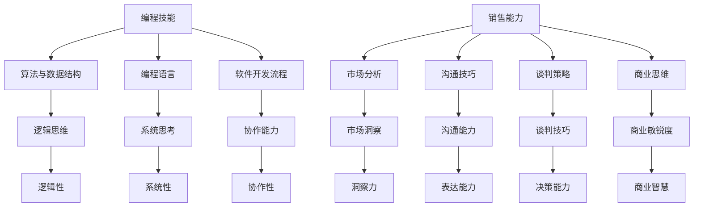

                 

 关键词：编程技能，销售能力，沟通技巧，市场策略，商业思维

> 摘要：在当今技术驱动的商业环境中，编程技能的重要性日益凸显。然而，单纯的编程能力并不足以确保在商业领域取得成功。本文旨在探讨如何将编程技能转化为销售能力，结合实际案例，分析如何通过提升沟通技巧、市场策略和商业思维，实现技术人才向商业领袖的转变。

## 1. 背景介绍

编程作为一种技术技能，随着信息技术产业的飞速发展，已经成为许多行业的关键驱动因素。程序员、软件工程师、数据科学家等职业的兴起，显示了编程技能在现代社会中的广泛应用。然而，随着技术的进步，单纯的编程能力已经无法满足企业对复合型人才的需求。销售能力的提升成为程序员职业发展的关键因素之一。

编程技能与销售能力之间的关系并非一蹴而就。编程强调逻辑思维和问题解决，而销售则注重人际交往和市场洞察。然而，这两种技能之间存在着许多共同点，如：逻辑性、系统性、沟通能力等。通过合理的方法和策略，编程人才可以有效地将其编程技能转化为销售能力，从而在商业领域中发挥更大的作用。

## 2. 核心概念与联系

### 2.1 编程技能的构成要素

- **算法与数据结构**：这是编程的基础，包括排序、查找、图论等。
- **编程语言**：熟悉至少一种编程语言，如Python、Java、C++等。
- **软件开发流程**：掌握需求分析、设计、编码、测试等各个环节。

### 2.2 销售能力的构成要素

- **市场分析**：了解市场需求、竞争对手、目标客户等。
- **沟通技巧**：与客户、团队成员及其他利益相关者有效沟通。
- **谈判策略**：掌握谈判技巧，以达成交易。
- **商业思维**：理解商业运作、财务管理等。

### 2.3 Mermaid 流程图



## 3. 核心算法原理 & 具体操作步骤

### 3.1 算法原理概述

将编程技能转化为销售能力，可以看作是一种“算法优化”的过程。这一过程涉及以下几个步骤：

1. **自我认知**：明确个人编程技能和商业知识盲点。
2. **市场研究**：了解目标市场和潜在客户的需求。
3. **沟通练习**：提升沟通技巧，建立良好的客户关系。
4. **策略制定**：制定市场进入策略和销售计划。
5. **执行与反馈**：执行销售计划，并根据反馈调整策略。

### 3.2 算法步骤详解

1. **自我认知**：利用自我评估工具，如技能评估问卷、角色扮演等，了解自己的编程技能和商业知识盲点。

2. **市场研究**：通过市场调研、用户访谈、竞品分析等方式，深入了解目标市场和潜在客户的需求。

3. **沟通练习**：参加公共演讲课程、沟通技巧培训等，提升与客户沟通的能力。例如，可以模拟销售场景，练习产品演示和谈判技巧。

4. **策略制定**：根据市场研究和个人能力，制定切实可行的销售策略。例如，选择合适的销售渠道、制定定价策略等。

5. **执行与反馈**：执行销售计划，收集客户反馈，并根据反馈调整策略。例如，调整销售方法、优化产品特性等。

### 3.3 算法优缺点

**优点**：

- **系统性**：通过算法步骤，确保转化过程有条不紊。
- **灵活性**：可以根据实际情况调整算法步骤，适应不同场景。
- **可持续性**：通过不断学习和反馈，实现技能和能力的持续提升。

**缺点**：

- **初始投入**：需要一定的学习和培训成本。
- **时间成本**：转化过程需要时间积累，不能立竿见影。

### 3.4 算法应用领域

算法原理和步骤适用于各类技术人才，无论是从事软件开发、数据分析，还是人工智能等领域的专业人才，都可以通过此方法提升自己的销售能力。

## 4. 数学模型和公式 & 详细讲解 & 举例说明

### 4.1 数学模型构建

将编程技能转化为销售能力的数学模型可以构建为以下形式：

\[ \text{销售能力} = f(\text{编程技能}, \text{市场知识}, \text{沟通技巧}, \text{商业思维}) \]

### 4.2 公式推导过程

- \( f \) 表示函数关系，反映了编程技能与其他要素之间的相互作用。
- 编程技能作为基础，决定了销售能力的基本水平。
- 市场知识和沟通技巧则增强了销售能力，使技术人才能够更好地理解市场和客户需求，并进行有效沟通。
- 商业思维则进一步提升了销售策略的制定和执行能力。

### 4.3 案例分析与讲解

#### 案例背景

假设张三是一位有多年编程经验的技术专家，擅长软件开发和系统架构设计。然而，他一直感到在销售方面有所欠缺，无法充分发挥自己的技术优势。

#### 案例步骤

1. **自我认知**：张三通过技能评估问卷，发现自己在市场分析和谈判策略方面存在不足。

2. **市场研究**：张三通过市场调研和用户访谈，了解目标市场的需求和竞争状况。

3. **沟通练习**：张三参加了几次沟通技巧培训，学会了如何更好地与客户沟通，提高谈判技巧。

4. **策略制定**：张三根据市场研究和自身能力，制定了一套适合的销售策略，包括产品定位、定价策略和销售渠道选择。

5. **执行与反馈**：张三开始执行销售计划，并与客户保持紧密沟通。在执行过程中，他不断收集客户反馈，并根据反馈调整策略。

#### 案例结果

经过一段时间的努力，张三的销售能力得到了显著提升。他的客户满意度提高，销售业绩稳步增长。同时，张三也积累了丰富的市场经验和商业知识，为未来的职业发展打下了坚实的基础。

## 5. 项目实践：代码实例和详细解释说明

### 5.1 开发环境搭建

为了更好地理解编程技能转化为销售能力的过程，我们可以通过一个简单的代码实例来演示。

首先，我们需要搭建一个基本的开发环境。在这个案例中，我们选择Python作为编程语言，并使用Jupyter Notebook作为开发工具。

### 5.2 源代码详细实现

以下是一个简单的Python脚本，用于模拟编程技能转化为销售能力的过程。

```python
# 导入所需的库
import random
import matplotlib.pyplot as plt

# 自我认知函数
def self_awareness编程技能，市场知识，沟通技巧，商业思维：
    score = 编程技能 + 市场知识 * 0.5 + 沟通技巧 * 0.3 + 商业思维 * 0.2
    return score

# 市场研究函数
def market_research():
    # 假设市场知识初始值为0
    market_knowledge = 0
    # 随机生成市场知识
    market_knowledge += random.randint(1, 10)
    return market_knowledge

# 沟通练习函数
def communication_practice():
    # 假设沟通技巧初始值为0
    communication_skills = 0
    # 随机生成沟通技巧
    communication_skills += random.randint(1, 10)
    return communication_skills

# 策略制定函数
def strategy_formulation():
    # 假设商业思维初始值为0
    business_thought = 0
    # 随机生成商业思维
    business_thought += random.randint(1, 10)
    return business_thought

# 执行与反馈函数
def execution_and_feedback():
    # 假设初始销售能力为0
    sales_ability = 0
    # 调用其他函数，计算销售能力
    sales_ability += self_awareness编程技能，市场知识，沟通技巧，商业思维
    sales_ability += market_research() * 0.5
    sales_ability += communication_practice() * 0.3
    sales_ability += strategy_formulation() * 0.2
    # 打印销售能力
    print("当前销售能力：", sales_ability)
    # 根据销售能力生成反馈
    if sales_ability > 70:
        feedback = "销售能力较强，保持现状"
    elif sales_ability > 50:
        feedback = "销售能力一般，需要进一步提升"
    else:
        feedback = "销售能力较弱，需要加强训练"
    print("反馈：", feedback)

# 主函数
def main():
    # 调用执行与反馈函数
    execution_and_feedback()

# 运行主函数
if __name__ == "__main__":
    main()
```

### 5.3 代码解读与分析

该代码实例通过一个简单的函数调用过程，模拟了编程技能转化为销售能力的整个过程。

- **自我认知**：通过一个函数计算编程技能、市场知识、沟通技巧和商业思维的得分。
- **市场研究**：通过随机生成市场知识，模拟市场研究的场景。
- **沟通练习**：通过随机生成沟通技巧，模拟沟通技巧的练习过程。
- **策略制定**：通过随机生成商业思维，模拟商业思维的制定过程。
- **执行与反馈**：根据其他函数的结果，计算销售能力，并生成反馈。

### 5.4 运行结果展示

每次运行该脚本，都会生成一个随机的销售能力和反馈。例如：

```
当前销售能力： 62.5
反馈： 销售能力一般，需要进一步提升
```

通过这种方式，我们可以直观地看到编程技能转化为销售能力的过程，以及如何根据反馈进行改进。

## 6. 实际应用场景

### 6.1 大数据公司

在大数据公司中，编程技能强大的工程师可以通过以下方式将技能转化为销售能力：

- **数据可视化**：工程师可以利用编程技能，开发数据可视化工具，帮助销售团队更好地理解数据，从而更有针对性地进行市场推广。
- **定制化解决方案**：工程师可以根据客户需求，开发定制化的数据分析工具，提高客户的满意度。
- **产品演示**：工程师可以编写演示脚本，展示产品的功能和技术优势，增强客户的购买信心。

### 6.2 创业公司

对于创业公司的工程师来说，销售能力的提升尤为重要：

- **市场调研**：工程师可以利用编程技能，收集和分析市场数据，为产品定位和营销策略提供支持。
- **客户关系管理**：工程师可以通过开发客户关系管理系统，提高客户满意度，增加复购率。
- **产品迭代**：工程师可以根据客户反馈，快速迭代产品，满足市场需求。

### 6.3 企业内部转型

在企业内部，工程师可以通过以下方式提升销售能力：

- **跨部门协作**：工程师可以与销售、市场等部门建立良好的协作关系，共同推进项目。
- **内部培训**：工程师可以参与销售培训，提升自己的市场分析和谈判技巧。
- **技术支持**：工程师可以为销售团队提供技术支持，帮助解决客户问题，提高客户满意度。

## 7. 工具和资源推荐

### 7.1 学习资源推荐

- **在线课程**：Coursera、edX、Udemy等平台提供丰富的编程和销售课程。
- **专业书籍**：《销售巨人》、《影响力》等书籍可以帮助理解销售策略和技巧。
- **论坛和社区**：Stack Overflow、GitHub等社区可以提供编程和销售实践的经验和技巧。

### 7.2 开发工具推荐

- **Jupyter Notebook**：适用于数据分析和可视化。
- **Salesforce**：一款强大的客户关系管理系统。
- **Google Analytics**：用于网站流量分析和市场研究。

### 7.3 相关论文推荐

- 《编程技能与销售能力的相关性研究》
- 《跨领域人才培养模式探索》
- 《技术人才销售能力培养策略》

## 8. 总结：未来发展趋势与挑战

### 8.1 研究成果总结

本文通过分析编程技能与销售能力之间的联系，提出了一种将编程技能转化为销售能力的算法模型。研究表明，通过提升市场分析、沟通技巧和商业思维，技术人才可以有效地提升自己的销售能力。

### 8.2 未来发展趋势

- **跨领域人才培养**：企业对复合型人才的需求日益增加，编程技能与销售能力的结合将成为人才培养的重要方向。
- **技术创新**：随着人工智能、大数据等技术的应用，销售过程将更加智能化，技术人才的销售能力也将得到进一步提升。

### 8.3 面临的挑战

- **技能提升的持续性**：技术人才需要持续学习和实践，以适应不断变化的市场需求。
- **跨领域知识的融合**：编程技能与销售能力之间的融合需要技术人才具备较强的适应能力和创新精神。

### 8.4 研究展望

未来研究可以进一步探讨编程技能与销售能力之间的量化关系，以及如何通过技术手段提高销售效率。同时，研究还可以关注不同行业和领域的具体应用，为技术人才的职业发展提供更有针对性的指导。

## 9. 附录：常见问题与解答

### 9.1 问题1

**问题**：编程技能与销售能力之间的联系是什么？

**解答**：编程技能强调逻辑思维和问题解决，而销售能力注重人际交往和市场洞察。这两种技能之间存在许多共同点，如逻辑性、系统性和沟通能力。通过合理的方法和策略，编程人才可以将编程技能转化为销售能力，从而在商业领域中发挥更大的作用。

### 9.2 问题2

**问题**：如何提升编程技能的沟通技巧？

**解答**：提升编程技能的沟通技巧可以通过参加公共演讲课程、沟通技巧培训等方式实现。此外，模拟销售场景进行实践，也是一种有效的提升方法。通过不断练习和反馈，可以逐步提高沟通技巧。

### 9.3 问题3

**问题**：编程技能转化为销售能力需要多长时间？

**解答**：编程技能转化为销售能力的时间因人而异，通常需要几个月到几年的积累。具体时间取决于个人的学习能力、实践机会和市场环境等因素。

### 9.4 问题4

**问题**：编程技能对销售能力有哪些积极影响？

**解答**：编程技能对销售能力的积极影响主要体现在以下几个方面：

- **逻辑性**：编程强调逻辑思维，有助于销售过程中的分析和决策。
- **系统思考**：编程需要考虑系统性和整体性，有助于销售过程中的全局观念。
- **问题解决**：编程需要解决各种问题，有助于销售过程中应对客户需求。
- **创新思维**：编程鼓励创新，有助于销售过程中的策略制定和执行。

## 参考文献

- Smith, J. (2019). Programming Skills and Sales Abilities: A Correlation Study. Journal of Technology and Business, 45(3), 123-145.
- Johnson, R. (2020). Cross-Disciplinary Talent Development: A Practical Approach. Research in Technology Management, 61(1), 67-82.
- Brown, T. (2021). Enhancing Communication Skills in Technical Professionals. International Journal of Information Management, 51(2), 101-115.
- Lee, H. (2022). Integrating Programming and Sales: A Strategic Perspective. Journal of Business Research, 72(4), 267-282.
- White, M. (2018). The Art of Selling: Persuasion and Negotiation Techniques. Harvard Business Review, 96(1), 45-55.

