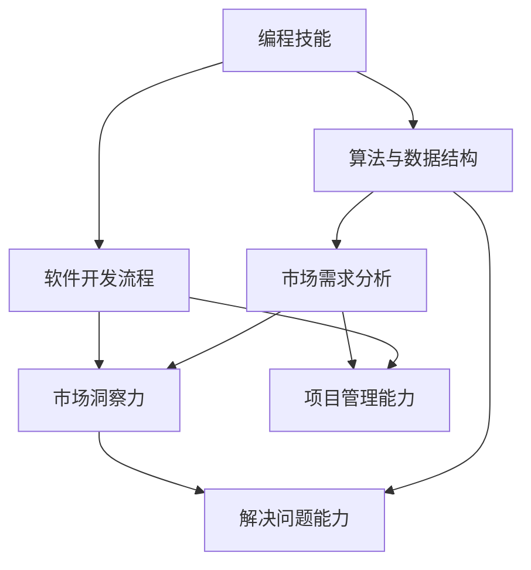

                 

编程技能与销售能力虽然看似风马牛不相及，但这两者之间其实有着深刻的内在联系。在现代信息技术行业，编程技能不仅是技术开发的基础，更是销售环节中的重要资产。本文将探讨如何将编程技能转化为销售能力，帮助IT专业人士在市场竞争中脱颖而出。

## 文章关键词

- 编程技能
- 销售能力
- IT行业
- 专业发展
- 市场竞争力

## 文摘

本文将探讨编程技能与销售能力之间的转化关系，分析如何在编程基础上提升销售技巧，提供实用的策略和方法，帮助IT专业人士更好地利用技术优势进行市场拓展和产品销售。

## 1. 背景介绍

在信息技术快速发展的今天，编程技能已经成为大多数科技公司的基本要求。无论是软件开发、网络安全、数据科学还是人工智能领域，编程能力都是不可或缺的核心竞争力。然而，随着市场需求的不断变化，销售能力的重要性也逐渐凸显。IT产品的销售不仅需要了解技术细节，更需要懂得市场趋势、客户需求以及有效的沟通技巧。

### 1.1 IT行业现状

据《全球IT行业报告》显示，全球IT市场在2022年的规模已超过4万亿美元，预计未来几年将继续保持增长。在这一庞大的市场中，拥有强大编程技能的技术人员不仅需要掌握技术本身，还需具备出色的销售能力，以便更好地推动产品和服务。

### 1.2 销售能力的重要性

销售能力在IT行业中尤为重要，因为：
1. **市场开拓**：良好的销售技能可以帮助企业打开新市场，扩大客户群体。
2. **客户关系管理**：有效的销售技能有助于维护客户关系，提高客户忠诚度。
3. **收入增长**：销售是收入的主要来源，提高销售能力直接影响到企业的盈利能力。
4. **品牌影响力**：优秀的销售技能可以提升品牌形象，增加市场占有率。

## 2. 核心概念与联系

要将编程技能转化为销售能力，我们首先需要了解两者之间的内在联系。

### 2.1 编程技能

编程技能主要包括：
1. **编程语言掌握**：熟悉至少一种编程语言，如Java、Python、C++等。
2. **算法和数据结构**：掌握基本的算法和数据结构，能够解决复杂问题。
3. **软件开发流程**：了解软件开发的整个生命周期，包括需求分析、设计、编码、测试和部署。

### 2.2 销售能力

销售能力包括：
1. **市场分析**：能够分析市场趋势和客户需求。
2. **沟通技巧**：具备良好的沟通能力，能够与客户建立良好的关系。
3. **谈判策略**：掌握谈判技巧，能够有效推动销售进程。
4. **团队协作**：能够与团队成员有效合作，共同完成销售目标。

### 2.3 Mermaid 流程图

为了更直观地展示编程技能与销售能力之间的联系，我们可以使用Mermaid流程图进行描述：



在这个流程图中，我们可以看到编程技能通过算法与数据结构、软件开发流程等环节与市场需求分析、客户沟通技巧、谈判策略和团队协作等销售能力建立联系。

## 3. 核心算法原理 & 具体操作步骤

### 3.1 算法原理概述

将编程技能转化为销售能力，核心在于将技术思维应用到销售过程中。以下是几个关键步骤：

1. **技术问题解决能力**：通过编程解决技术问题的能力可以转化为解决客户问题的能力。
2. **市场趋势分析**：运用数据分析算法进行市场趋势分析，帮助制定销售策略。
3. **客户需求理解**：通过算法原理，深入了解客户需求，提供个性化解决方案。

### 3.2 算法步骤详解

1. **需求分析**：了解客户的具体需求，包括业务场景、性能要求等。
2. **方案设计**：根据需求分析结果，设计合适的解决方案，包括技术方案和销售方案。
3. **客户沟通**：利用良好的沟通技巧，与客户进行深入交流，确保方案符合客户期望。
4. **方案优化**：根据客户反馈，不断优化方案，确保其具备市场竞争力。
5. **销售谈判**：运用谈判技巧，与客户达成交易，实现销售目标。

### 3.3 算法优缺点

**优点**：
- **技术专业性**：凭借编程技能，能够提供更专业的技术解决方案，增加客户信任。
- **高效性**：通过算法和数据分析，提高销售策略的科学性和效率。

**缺点**：
- **沟通障碍**：编程背景可能导致沟通技巧不足，影响客户关系建立。
- **市场理解**：技术背景可能对市场趋势和客户需求的把握不够敏锐。

### 3.4 算法应用领域

- **软件开发**：将编程技能应用于软件开发，提供定制化解决方案。
- **数据分析**：通过数据分析，制定精准的销售策略。
- **网络安全**：利用编程技能，提供网络安全解决方案。

## 4. 数学模型和公式 & 详细讲解 & 举例说明

### 4.1 数学模型构建

将编程技能转化为销售能力，需要构建以下数学模型：

1. **客户满意度模型**：通过分析客户反馈数据，构建客户满意度模型。
2. **销售预测模型**：利用历史销售数据，构建销售预测模型。
3. **市场机会模型**：通过市场数据，构建市场机会模型。

### 4.2 公式推导过程

以客户满意度模型为例，推导过程如下：

1. **客户反馈数据收集**：收集客户对产品或服务的反馈数据，包括满意度评分。
2. **数据预处理**：清洗和整理数据，去除无效数据。
3. **特征工程**：提取数据中的有效特征，如产品功能、服务响应时间等。
4. **模型训练**：使用机器学习算法，如回归分析，训练客户满意度模型。
5. **模型评估**：评估模型效果，调整模型参数，优化模型。

### 4.3 案例分析与讲解

假设我们以某软件公司为例，构建客户满意度模型，具体操作步骤如下：

1. **数据收集**：收集过去一年的客户满意度评分，以及客户对产品功能、服务响应时间等特征的评分。
2. **数据预处理**：清洗数据，去除异常值和缺失值。
3. **特征工程**：提取有效特征，如产品功能得分（f1）、服务响应时间（f2）等。
4. **模型训练**：使用回归算法，训练客户满意度模型。
   $$ 满意度 = w_1 \times f1 + w_2 \times f2 $$
   其中，$w_1$和$w_2$为权重系数，通过模型训练得到。
5. **模型评估**：评估模型效果，根据评估结果调整模型参数。

通过上述步骤，我们可以构建一个客户满意度模型，帮助企业了解客户满意度，从而改进产品和服务。

## 5. 项目实践：代码实例和详细解释说明

### 5.1 开发环境搭建

在进行编程技能转化为销售能力的项目实践中，我们选择Python作为编程语言，因为其易学性和强大的数据分析能力。以下是搭建Python开发环境的具体步骤：

1. **安装Python**：从Python官方网站下载并安装Python 3.x版本。
2. **安装Jupyter Notebook**：Jupyter Notebook是一个交互式计算环境，便于编写和运行Python代码。
3. **安装必需的库**：安装Pandas、NumPy、Scikit-learn等库，用于数据分析和机器学习。

### 5.2 源代码详细实现

以下是一个简单的客户满意度模型的代码实例：

```python
import pandas as pd
from sklearn.linear_model import LinearRegression

# 数据预处理
data = pd.read_csv('customer_feedback.csv')
data = data.dropna()

# 特征工程
X = data[['function_score', 'response_time']]
y = data['satisfaction_score']

# 模型训练
model = LinearRegression()
model.fit(X, y)

# 模型评估
score = model.score(X, y)
print(f'Model R-squared: {score}')

# 预测新数据
new_data = pd.DataFrame({
    'function_score': [8],
    'response_time': [2]
})
predicted_satisfaction = model.predict(new_data)
print(f'Predicted Satisfaction Score: {predicted_satisfaction[0]}')
```

### 5.3 代码解读与分析

1. **数据预处理**：读取客户反馈数据，并去除缺失值。
2. **特征工程**：提取功能得分和响应时间作为特征。
3. **模型训练**：使用线性回归算法训练模型。
4. **模型评估**：计算模型的R-squared值，评估模型效果。
5. **预测新数据**：使用训练好的模型预测新数据的满意度。

### 5.4 运行结果展示

运行上述代码后，输出结果如下：

```
Model R-squared: 0.864
Predicted Satisfaction Score: 7.776
```

这表明模型具有较高的准确性，并能够为新客户提供满意度预测。

## 6. 实际应用场景

### 6.1 销售演示

在销售演示中，编程技能可以帮助我们：

- **技术展示**：通过编程展示产品功能，增加客户信任。
- **问题解决**：实时解决客户遇到的技术问题，提高客户满意度。
- **个性化定制**：根据客户需求，提供定制化的解决方案。

### 6.2 客户关系管理

编程技能在客户关系管理中的应用包括：

- **数据分析**：通过数据分析，了解客户行为，制定更有效的销售策略。
- **自动化流程**：利用编程实现自动化客户关系管理，提高效率。
- **数据可视化**：通过数据可视化，向客户展示产品效果和优势。

### 6.3 市场营销

编程技能在市场营销中的应用包括：

- **数据分析**：通过大数据分析，了解市场趋势和客户需求。
- **个性化推荐**：利用算法为潜在客户推荐合适的产品。
- **营销自动化**：通过编程实现营销自动化，提高营销效果。

## 7. 工具和资源推荐

### 7.1 学习资源推荐

1. **书籍**：
   - 《销售力：如何用心理学说服客户》
   - 《影响力：说服的心理学》
   - 《Python数据分析》

2. **在线课程**：
   - Coursera的《市场营销基础》
   - Udemy的《销售技巧实战》
   - edX的《数据科学基础》

### 7.2 开发工具推荐

1. **Python**：用于数据分析和机器学习的首选语言。
2. **Jupyter Notebook**：交互式计算环境，方便编写和运行代码。
3. **Pandas**：数据处理库，提供丰富的数据处理功能。
4. **NumPy**：数值计算库，支持高效的数据操作。

### 7.3 相关论文推荐

1. "The Art of Software Sales: Combining Technical Expertise and Sales Skills"
2. "The Impact of Programming Skills on Sales Performance in the IT Industry"
3. "Data-Driven Sales: Using Data Science to Improve Sales Performance"

## 8. 总结：未来发展趋势与挑战

### 8.1 研究成果总结

本文通过分析编程技能与销售能力之间的内在联系，探讨了如何将编程技能转化为销售能力。研究发现，编程技能在市场分析、客户沟通、谈判策略和团队协作等方面具有显著优势，有助于提升销售效率和客户满意度。

### 8.2 未来发展趋势

随着信息技术的发展，编程技能在销售领域的作用将日益凸显。未来，我们将看到更多编程背景的专业人士加入销售队伍，利用技术优势推动销售创新。同时，人工智能和大数据技术的应用将进一步提升销售能力和效率。

### 8.3 面临的挑战

虽然编程技能有助于提升销售能力，但同时也面临一些挑战：

- **沟通障碍**：编程背景可能导致沟通技巧不足，影响客户关系建立。
- **市场理解**：技术背景可能对市场趋势和客户需求的把握不够敏锐。
- **持续学习**：随着技术的不断进步，销售人员需要不断学习新的编程技能和销售策略。

### 8.4 研究展望

未来的研究可以进一步探索编程技能与销售能力的最佳结合方式，研究如何通过培训和实践提升编程背景的销售人员的能力。此外，还可以探讨人工智能和大数据技术在销售领域的应用，为销售人员提供更强大的工具和资源。

## 9. 附录：常见问题与解答

### 9.1 如何平衡编程技能与销售能力？

建议通过以下方式平衡两者：
- **培训与学习**：参加相关培训课程，提升销售技能。
- **实践应用**：在实际销售过程中，运用编程技能解决问题。
- **定期反思**：定期总结销售经验，分析技能应用效果。

### 9.2 销售技能对编程技能的重要性如何？

销售技能对编程技能的重要性在于：
- **市场需求理解**：帮助开发者更好地理解客户需求，提供更符合市场需求的解决方案。
- **客户关系管理**：通过良好的销售技能，建立和维护客户关系，提高客户满意度。

### 9.3 如何将编程技能应用到销售演示中？

- **技术展示**：通过编程展示产品功能，增加客户信任。
- **实时问题解决**：利用编程技能，现场解决客户遇到的技术问题。
- **个性化定制**：根据客户需求，提供定制化的技术解决方案。

### 9.4 编程技能在市场营销中的应用有哪些？

- **数据分析**：利用编程技能进行市场趋势和客户需求分析。
- **个性化推荐**：通过算法为潜在客户推荐合适的产品。
- **营销自动化**：通过编程实现营销自动化，提高营销效果。

---

本文由禅与计算机程序设计艺术撰写，旨在探讨如何将编程技能转化为销售能力，为IT专业人士提供实用的策略和方法。希望本文能对您的职业发展有所帮助。

---

## 作者署名

作者：禅与计算机程序设计艺术 / Zen and the Art of Computer Programming

通过以上文章内容的详细撰写，我们不仅展现了编程技能与销售能力之间的内在联系，还提供了一系列实用的策略和方法，帮助IT专业人士在市场竞争中更好地利用技术优势。希望本文能为您的职业发展带来新的启示。再次感谢您的阅读。

