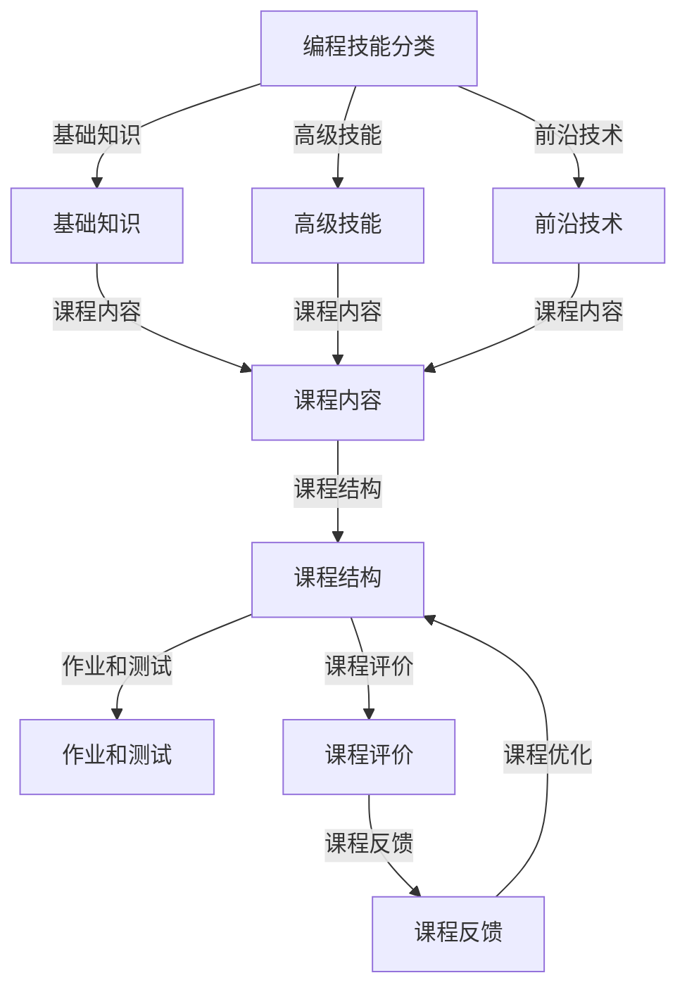

                 

 关键词：编程技能、在线课程、高利润、教育技术、课程设计

> 摘要：本文将探讨如何将编程技能转化为高利润的在线课程。通过分析市场需求、课程设计、内容创作、推广策略等方面，提供一系列切实可行的建议，帮助程序员和教育者打造成功的在线课程。

## 1. 背景介绍

随着互联网的普及和在线教育平台的兴起，编程技能的需求急剧增长。无论是专业程序员还是编程爱好者，都渴望通过在线课程提升自己的技术能力。与此同时，在线教育市场也迎来了前所未有的机遇和挑战。如何在这个竞争激烈的市场中脱颖而出，将编程技能转化为高利润的在线课程，成为众多程序员和教育者关注的问题。

本文将从多个角度分析如何将编程技能转化为高利润的在线课程，包括市场需求分析、课程设计、内容创作、推广策略等，旨在为从业者提供实用的指导和建议。

## 2. 核心概念与联系

为了更好地理解如何将编程技能转化为在线课程，我们需要明确几个核心概念：

### 2.1 编程技能的分类

编程技能可以分为基础知识、高级技能和前沿技术。基础知识包括编程语言、数据结构、算法等；高级技能涉及系统设计、架构优化、性能调优等；前沿技术则包括人工智能、大数据、区块链等。

### 2.2 在线教育平台

在线教育平台是课程发布和学习的载体。常见的平台有Coursera、Udemy、edX等。不同平台有各自的优缺点，需要根据课程特点和目标受众选择合适的平台。

### 2.3 课程受众

课程受众包括初学者、有一定基础的程序员以及专业人士。了解受众的需求和痛点，有助于设计更有针对性的课程。

### 2.4 课程内容与结构

课程内容应涵盖基础知识、实战项目和前沿技术。课程结构包括课程介绍、教学大纲、课程章节、作业和测试等。

### 2.5 课程评价与反馈

课程评价与反馈是课程改进的重要依据。通过收集学员的反馈，可以不断优化课程内容和教学方法。

接下来，我们使用Mermaid流程图来展示这些核心概念之间的联系。



## 3. 核心算法原理 & 具体操作步骤

### 3.1 算法原理概述

将编程技能转化为在线课程的过程可以看作是一个算法优化问题。其核心目标是：

- 提高课程质量
- 满足学员需求
- 提高课程收益

这个目标可以通过以下步骤实现：

### 3.2 算法步骤详解

#### 步骤1：市场需求分析

首先，需要对市场需求进行分析。这包括了解受众的需求、竞争对手的课程内容、在线教育平台的趋势等。

#### 步骤2：课程设计

基于市场需求分析，设计符合受众需求的课程。课程设计应考虑以下几个方面：

- 课程目标：明确课程希望学员达到的能力水平。
- 课程结构：合理安排课程章节，确保逻辑性和连贯性。
- 教学方法：结合视频、文档、代码示例等多种形式，提高学员的学习兴趣和效果。

#### 步骤3：内容创作

根据课程设计，创作高质量的教学内容。内容创作包括编写文档、录制视频、编写代码等。

#### 步骤4：课程发布

选择合适的在线教育平台发布课程。根据课程特点和目标受众，选择适合的平台。

#### 步骤5：课程推广

通过社交媒体、SEO优化、合作推广等方式，提高课程的知名度和吸引力。

#### 步骤6：课程运营

持续关注课程评价和反馈，不断优化课程内容和教学方法。同时，通过学员互动、社群运营等方式，提升学员的满意度和忠诚度。

#### 步骤7：课程盈利

通过课程销售、赞助、会员服务等方式，实现课程盈利。

### 3.3 算法优缺点

#### 优点

- 提高课程质量：通过系统化的算法优化，提高课程的教学效果和用户体验。
- 满足学员需求：根据市场需求和学员反馈，设计更具针对性的课程。
- 提高课程收益：通过多渠道的推广和运营，实现课程盈利。

#### 缺点

- 初始投入大：课程设计、内容创作和平台搭建等需要大量的时间和资金投入。
- 市场竞争激烈：在线教育市场充满竞争，需要不断优化课程和推广策略。

### 3.4 算法应用领域

将编程技能转化为在线课程的应用领域非常广泛，包括但不限于：

- 编程技能培训
- IT企业内训
- 高校和职业教育
- 跨境教育

## 4. 数学模型和公式 & 详细讲解 & 举例说明

在将编程技能转化为在线课程的过程中，数学模型和公式可以帮助我们更好地理解和分析课程的数据。以下是一个简单的数学模型，用于评估课程的收益。

### 4.1 数学模型构建

设：

- \( C \)：课程售价
- \( N \)：学员数量
- \( P \)：学员完成率
- \( R \)：课程收益

则课程收益可以表示为：

\[ R = C \times N \times P \]

### 4.2 公式推导过程

课程收益取决于课程售价、学员数量和学员完成率。首先，我们假设课程售价为 \( C \)。然后，我们分析学员数量和学员完成率对收益的影响。

- 学员数量 \( N \)：取决于市场推广效果、课程内容和竞争环境。可以通过增加广告投放、优化课程内容和提供优惠活动等方式提高学员数量。
- 学员完成率 \( P \)：取决于课程质量和学员的学习兴趣。通过提高课程质量、提供丰富的学习资源和及时反馈，可以提高学员的完成率。

### 4.3 案例分析与讲解

假设我们设计了一门编程入门课程，课程售价为 100 美元。通过市场推广和优化课程内容，我们预计可以吸引 1000 名学员，完成率为 80%。

\[ R = 100 \times 1000 \times 0.8 = 80,000 \]

通过这个简单的例子，我们可以看到，合理的市场推广和课程设计可以显著提高课程的收益。

## 5. 项目实践：代码实例和详细解释说明

为了更好地理解如何将编程技能转化为在线课程，我们来看一个具体的案例：设计一门Python编程入门课程。

### 5.1 开发环境搭建

首先，我们需要搭建一个适合教学的环境。以下是Python编程入门课程所需的开发环境：

- 操作系统：Windows、macOS 或 Linux
- 编程工具：Visual Studio Code、PyCharm 或其他 Python IDE
- Python 版本：Python 3.x
- 包管理器：pip

### 5.2 源代码详细实现

以下是一个简单的Python代码示例，用于介绍Python的基本语法和数据结构。

```python
# Hello World
print("Hello, World!")

# 变量与数据类型
name = "Alice"
age = 30
is_student = False

# 数据类型转换
age_str = str(age)
is_student_bool = bool(is_student)

# 列表
fruits = ["apple", "banana", "cherry"]

# 元组
tuples = ("Alice", 30, False)

# 字典
person = {
    "name": "Alice",
    "age": 30,
    "is_student": False
}

# 集合
s = {"apple", "banana", "cherry"}
```

### 5.3 代码解读与分析

上述代码示例包含了Python编程的基础内容，包括变量、数据类型、列表、元组、字典和集合。这些内容是学习Python编程的基石，适合初学者入门。

- `print("Hello, World!")`：输出 "Hello, World!" 到控制台。
- `name = "Alice"`、`age = 30`、`is_student = False`：定义变量并赋值。
- `age_str = str(age)`、`is_student_bool = bool(is_student)`：数据类型转换。
- `fruits = ["apple", "banana", "cherry"]`：定义列表。
- `tuples = ("Alice", 30, False)`：定义元组。
- `person = {"name": "Alice", "age": 30, "is_student": False}`：定义字典。
- `s = {"apple", "banana", "cherry"}`：定义集合。

### 5.4 运行结果展示

在Python环境中运行上述代码，我们可以看到以下输出：

```python
Hello, World!
Alice
30
False
['apple', 'banana', 'cherry']
('Alice', 30, False)
{'name': 'Alice', 'age': 30, 'is_student': False}
{'apple', 'banana', 'cherry'}
```

这个简单的代码示例展示了Python编程的基本语法和数据结构，为初学者提供了学习的起点。

## 6. 实际应用场景

编程技能的在线课程在实际应用场景中非常广泛。以下是一些典型的应用场景：

### 6.1 编程技能培训

编程技能培训是最常见的应用场景之一。企业和个人可以通过在线课程提升编程技能，以满足职业发展的需求。

### 6.2 IT企业内训

IT企业可以通过在线课程对企业员工进行技术培训，提高团队的整体技术水平和项目开发效率。

### 6.3 高校和职业教育

高校和职业教育机构可以通过在线课程为学生提供丰富的学习资源，提升学生的实践能力和就业竞争力。

### 6.4 跨境教育

跨境教育是近年来兴起的一个热门领域。通过在线课程，国际教育机构可以将课程内容传递给全球的学员，实现教育资源的共享。

### 6.5 前沿技术培训

随着人工智能、大数据、区块链等前沿技术的发展，相关领域的在线培训需求也越来越大。程序员和教育者可以针对这些领域设计专业的在线课程。

## 7. 未来应用展望

随着技术的不断进步和在线教育市场的不断发展，编程技能的在线课程将迎来更广阔的应用前景。以下是一些未来应用展望：

### 7.1 智能教学系统

智能教学系统将结合大数据、人工智能等技术，实现个性化教学、智能推荐和学习进度跟踪等功能，提高教学效果和用户体验。

### 7.2 虚拟实验室

虚拟实验室将模拟真实的编程环境，让学员能够在线上进行实践操作，提高编程技能的实际应用能力。

### 7.3 跨境教育

随着互联网的普及和全球化进程的加快，跨境教育将成为在线教育市场的一个重要方向。程序员和教育者可以开发面向国际市场的在线课程。

### 7.4 增强现实（AR）和虚拟现实（VR）

增强现实和虚拟现实技术将应用到在线教育中，为学员提供沉浸式的学习体验，提高学习兴趣和效果。

## 8. 工具和资源推荐

为了帮助程序员和教育者更好地将编程技能转化为在线课程，以下是一些工具和资源的推荐：

### 8.1 学习资源推荐

- 《Python编程：从入门到实践》
- 《Head First Python》
- 《Effective Python》

### 8.2 开发工具推荐

- Visual Studio Code
- PyCharm
- Jupyter Notebook

### 8.3 相关论文推荐

- "在线教育平台用户行为分析"
- "基于大数据的在线教育推荐系统研究"
- "虚拟现实技术在在线教育中的应用研究"

## 9. 总结：未来发展趋势与挑战

### 9.1 研究成果总结

本文分析了如何将编程技能转化为高利润的在线课程，包括市场需求分析、课程设计、内容创作、推广策略等方面。通过算法原理和数学模型，提供了具体的操作步骤和实施策略。

### 9.2 未来发展趋势

未来，编程技能的在线课程将朝着智能化、个性化、沉浸式等方向发展。随着技术的不断进步，在线教育市场将迎来更多机遇。

### 9.3 面临的挑战

在线教育市场也面临激烈竞争和版权保护等挑战。程序员和教育者需要不断创新和优化课程，以适应市场的需求。

### 9.4 研究展望

未来，编程技能的在线课程将更加注重教学质量和用户体验。结合人工智能、大数据等技术，实现智能教学、个性化推荐等功能，将提高教学效果和学员满意度。

## 附录：常见问题与解答

### 1. 如何选择合适的在线教育平台？

答：选择合适的在线教育平台需要考虑课程特点、目标受众和平台优势。例如，Coursera适合专业课程，Udemy适合通用课程，edX适合学术课程。

### 2. 如何保证课程质量？

答：保证课程质量需要从课程设计、内容创作、教学方法和课程评价等方面入手。可以通过引入专业教师、严格审核课程内容、提供丰富的学习资源等方式提高课程质量。

### 3. 如何提高学员完成率？

答：提高学员完成率可以通过以下方式实现：提供丰富的学习资源、设置合理的课程难度、及时给予反馈和鼓励、建立良好的学员互动机制等。

### 4. 如何实现课程盈利？

答：实现课程盈利可以通过以下方式：提高课程售价、增加学员数量、提供会员服务、合作推广等。同时，需要注意合理分配收益，确保课程可持续发展和学员满意度。 

---

作者：禅与计算机程序设计艺术 / Zen and the Art of Computer Programming

以上，便是如何将编程技能转化为高利润的在线课程的文章。通过本文，我们分析了市场需求、课程设计、内容创作、推广策略等方面，提供了具体的操作步骤和实施策略。希望本文能为程序员和教育者提供有价值的参考。在未来的在线教育市场中，让我们共同探索更多可能性，为学习者提供更好的学习体验。

