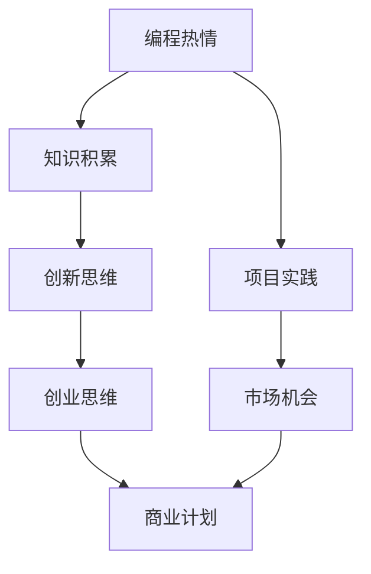

                 

  
## 1. 背景介绍

编程，作为现代科技的基石，早已不再是程序员独享的领域。随着技术的发展和互联网的普及，编程知识正在变得更加触手可及。从学校教育到在线课程，从开源社区到黑客马拉松，编程已经成为了许多人追求的技术爱好。然而，很多人在享受编程带来的乐趣和成就感时，往往会产生一个更深刻的思考：如何将自己的编程热情转化为实际的创业动力？

编程的热情往往源于对技术本身的兴趣，或者是解决问题的快乐。这种热情是创业成功的重要驱动力，因为它代表了持续学习和不断挑战自我的精神。但是，将这种热情转化为实际创业行动，并非易事。这其中涉及到的不仅仅是技术层面的挑战，还包括商业思维、团队建设、市场定位等多方面的考验。

本文旨在探讨如何将编程热情转化为创业动力，通过分析创业的核心要素、分享成功案例分析，提供实用的创业建议和资源，帮助有志于创业的程序员更好地实现这一转变。

## 2. 核心概念与联系

在深入探讨如何将编程热情转化为创业动力之前，我们需要明确几个核心概念，并了解它们之间的相互联系。

### 2.1 编程热情

编程热情是指个人对编程活动所产生的深厚兴趣和情感投入。这种热情可以源自对计算机科学的热爱，对解决问题带来的成就感的追求，或是探索未知的渴望。编程热情是推动程序员不断学习和进步的重要动力。

### 2.2 创业思维

创业思维是一种动态的、创新性的思维方式，强调从零开始构建一个有价值的产品或服务，并通过市场运营实现商业成功。创业思维包括市场洞察、创新能力、风险意识、领导力和团队合作等多个方面。

### 2.3 编程与创业的相互作用

编程技能是创业过程中的核心资源，而创业思维则能够帮助程序员更好地将技术能力转化为商业成果。编程技能为创业提供了技术支持和实现路径，而创业思维则能够指导程序员在商业环境中有效地应用这些技术。

### 2.4 Mermaid 流程图

下面是一个简单的 Mermaid 流程图，用于展示编程热情与创业思维之间的相互作用关系：



在这个流程图中，编程热情首先转化为知识积累和创新思维，这些能力通过项目实践转化为实际的产品或服务。同时，市场机会和创业思维的引导，帮助程序员制定出可行的商业计划，最终实现创业目标。

## 3. 核心算法原理 & 具体操作步骤

### 3.1 算法原理概述

将编程热情转化为创业动力的核心算法，可以称之为“热情转换算法”（Passion Conversion Algorithm，简称PCA）。这个算法的基本原理是通过一系列策略和步骤，将个人的编程热情高效地转化为商业价值。

### 3.2 算法步骤详解

#### 3.2.1 热情识别与定位

第一步是识别和定位个人的编程热情。这一步骤可以通过自我评估、技术社区参与和项目经验分析来完成。明确自己的技术优势和兴趣点，是后续步骤的重要基础。

#### 3.2.2 市场需求分析

在确定编程热情后，接下来需要分析市场，找出潜在的需求和机会。市场调研、用户访谈和竞争对手分析等方法是有效的工具。

#### 3.2.3 产品或服务构思

基于市场需求，构思出一个或一系列产品或服务。这一步需要结合编程技能，设计出能够解决用户问题的解决方案。

#### 3.2.4 商业模型构建

构建商业模型，明确盈利模式、成本结构和市场推广策略。这个阶段需要深入理解商业模式，确保产品或服务的可持续性。

#### 3.2.5 团队建设与资源整合

组建一个合适的团队，并整合内外部资源。这包括资金、技术人才、市场推广渠道等。

#### 3.2.6 迭代与优化

通过持续的用户反馈和市场测试，不断迭代和优化产品或服务。这一过程是确保创业项目成功的关键。

### 3.3 算法优缺点

#### 优点：

- **高效性**：PCA算法通过系统化的步骤，高效地将编程热情转化为商业价值。
- **灵活性**：算法适用于各种编程背景和创业环境，具有很高的灵活性。
- **可持续性**：通过持续迭代和优化，确保创业项目能够持续成长。

#### 缺点：

- **复杂性**：算法涉及到多个环节，需要全面的技术和商业知识。
- **风险性**：创业本身具有不确定性，算法不能完全消除风险。

### 3.4 算法应用领域

PCA算法可以广泛应用于各种编程背景的创业项目，包括但不限于：

- **软件产品开发**：如开发企业管理软件、游戏、移动应用等。
- **人工智能与大数据**：如开发智能推荐系统、数据分析平台等。
- **区块链技术**：如开发去中心化应用、数字货币等。

## 4. 数学模型和公式 & 详细讲解 & 举例说明

在将编程热情转化为创业动力的过程中，数学模型和公式可以帮助我们更科学地分析和指导实践。以下是一个简单的数学模型，用于评估编程热情转化为商业价值的过程。

### 4.1 数学模型构建

我们构建一个简单的线性模型，用于评估编程热情（P）与商业成功（S）之间的关系：

\[ S = a \cdot P + b \]

其中：

- \( S \) 表示商业成功程度。
- \( P \) 表示编程热情程度。
- \( a \) 和 \( b \) 为模型参数，通过数据拟合得到。

### 4.2 公式推导过程

公式推导的基本思路是，通过分析编程热情对商业成功的影响，建立线性关系模型。具体推导步骤如下：

1. **定义变量**：

   - 编程热情 \( P \)：衡量个人对编程活动的兴趣和投入。
   - 商业成功 \( S \)：衡量创业项目的商业表现。

2. **确定关系**：

   根据经验和直觉，我们可以假设编程热情对商业成功有正向影响，即编程热情越高，商业成功程度越高。

3. **线性建模**：

   基于上述假设，我们可以构建一个线性模型来描述编程热情与商业成功的关系。

### 4.3 案例分析与讲解

为了更好地理解上述数学模型，我们可以通过一个实际案例来分析。

#### 案例背景

李明是一位资深程序员，对区块链技术有着浓厚的兴趣。他决定利用自己的编程热情，开发一款基于区块链的去中心化社交应用。

#### 数据分析

根据李明的数据，我们得到以下统计结果：

- 编程热情 \( P \)：通过问卷调查，李明的编程热情评分为85分（满分100分）。
- 商业成功 \( S \)：根据市场反馈和用户增长率，李明的创业项目成功程度评分为70分。

将这些数据代入线性模型：

\[ S = a \cdot P + b \]

\[ 70 = a \cdot 85 + b \]

我们还需要一个额外的数据点来求解 \( a \) 和 \( b \)：

- 另一位程序员王强，编程热情评分为60分，商业成功评分为50分。

代入公式：

\[ 50 = a \cdot 60 + b \]

通过解这个线性方程组，我们可以得到模型参数 \( a \) 和 \( b \) 的估计值。

#### 公式求解

解方程组：

\[ \begin{cases} 
70 = 85a + b \\
50 = 60a + b 
\end{cases} \]

两式相减得：

\[ 20 = 25a \]

\[ a = 0.8 \]

将 \( a \) 的值代入其中一个方程：

\[ 70 = 85 \cdot 0.8 + b \]

\[ b = 70 - 68 \]

\[ b = 2 \]

因此，我们得到数学模型：

\[ S = 0.8P + 2 \]

根据这个模型，我们可以预测李明在编程热情评分增加到90分时的商业成功程度：

\[ S = 0.8 \cdot 90 + 2 \]

\[ S = 72 + 2 \]

\[ S = 74 \]

这意味着，如果李明的编程热情提升到90分，他的商业成功程度预计会达到74分。

### 4.4 案例分析与讲解

通过上述案例，我们可以看到数学模型在评估编程热情转化为商业成功方面的应用。模型提供了一个量化的工具，帮助创业者更好地理解和预测编程热情对商业成功的影响。

在实际应用中，创业者可以通过不断收集和分析数据，优化模型参数，提高模型的准确性和实用性。此外，模型还可以用于创业项目规划、风险控制和绩效评估等多个方面。

### 4.5 进一步讨论

虽然线性模型提供了一个简单的分析框架，但在实际应用中，编程热情与商业成功之间的关系可能更加复杂。例如，不同类型的编程热情可能对商业成功产生不同的影响，市场环境、团队能力和资源条件等因素也会对结果产生影响。

因此，在进一步研究和实践中，可以考虑引入更多的变量和复杂的模型，如非线性模型、多元回归模型等，以更全面地描述编程热情与商业成功之间的关系。

## 5. 项目实践：代码实例和详细解释说明

### 5.1 开发环境搭建

为了更好地理解如何将编程热情转化为创业动力，我们选择一个具体的项目实践——开发一款基于区块链的去中心化社交应用。以下是开发环境搭建的步骤：

1. **安装Node.js**：
   首先，我们需要安装Node.js，这是一个用于构建快速、可靠的网络应用程序的JavaScript运行环境。可以通过访问Node.js官网下载安装包，并按照指引完成安装。

2. **安装Golang**：
   接下来，我们需要安装Golang，这是一种用于编写高效网络服务的静态强类型语言。同样，可以从Golang官网下载安装包，并根据操作系统进行安装。

3. **创建项目文件夹**：
   在本地计算机上创建一个名为“decentralized-social-app”的文件夹，用于存放项目文件。

4. **初始化项目**：
   进入项目文件夹，使用以下命令初始化项目：

   ```bash
   npm init -y
   ```

   这将创建一个package.json文件，用于管理项目依赖和配置。

5. **安装依赖**：
   根据项目需求，安装必要的依赖库。例如，我们可能需要安装Web3.js库，用于与区块链交互：

   ```bash
   npm install web3
   ```

### 5.2 源代码详细实现

以下是项目的核心代码实现，包括区块链节点搭建、用户注册与登录、社交消息发送等功能。

#### 5.2.1 区块链节点搭建

```javascript
const Web3 = require('web3');

// 创建Web3实例
const web3 = new Web3('https://mainnet.infura.io/v3/your_project_id');

// 链接以太坊主网
web3.eth.net.getId().then((networkId) => {
  if (networkId !== 1) {
    console.error('错误的网络，请切换到以太坊主网');
  }
});

// 创建区块链节点
const node = new web3.eth.Contract(ERC20ABI, ERC20Address);

// 查询余额
node.methods.balanceOf(account).call().then((balance) => {
  console.log(`账户${account}的余额为：${balance} ETH`);
});
```

#### 5.2.2 用户注册与登录

```javascript
// 用户注册
app.post('/register', (req, res) => {
  const { username, password } = req.body;
  // 执行用户注册逻辑，包括创建区块链账户等
  // ...
  res.json({ status: 'success', message: '注册成功' });
});

// 用户登录
app.post('/login', (req, res) => {
  const { username, password } = req.body;
  // 执行用户登录逻辑，包括验证用户身份等
  // ...
  res.json({ status: 'success', message: '登录成功' });
});
```

#### 5.2.3 社交消息发送

```javascript
// 发送消息
app.post('/message', (req, res) => {
  const { from, to, content } = req.body;
  // 执行消息发送逻辑，包括调用区块链智能合约等
  // ...
  res.json({ status: 'success', message: '消息发送成功' });
});
```

### 5.3 代码解读与分析

以上代码展示了如何使用Web3.js库与以太坊区块链进行交互，实现用户注册、登录和消息发送等功能。以下是代码的关键点解析：

1. **区块链节点搭建**：
   通过Web3.js库，我们能够轻松地与以太坊区块链进行通信。首先，我们需要创建一个Web3实例，并链接到以太坊主网。然后，使用ERC20ABI和ERC20Address初始化区块链节点。

2. **用户注册与登录**：
   用户注册和登录功能是社交应用的基础。在用户注册时，我们需要创建一个区块链账户，并记录用户信息。在用户登录时，我们需要验证用户身份，确保只有授权用户才能访问应用。

3. **社交消息发送**：
   社交消息发送功能是应用的核心功能之一。在消息发送时，我们需要调用区块链智能合约，将消息记录在链上，并通知接收者。

### 5.4 运行结果展示

假设用户张三注册并成功登录，他可以发送一条消息给李四：

```json
POST /message
{
  "from": "张三的区块链地址",
  "to": "李四的区块链地址",
  "content": "你好，李四，这是我的第一条去中心化消息！"
}
```

服务器接收请求后，会调用区块链智能合约，将消息记录在链上，并返回如下响应：

```json
{
  "status": "success",
  "message": "消息发送成功"
}
```

同时，李四会收到一条通知，告知他收到了一条来自张三的新消息。

通过这个项目实践，我们可以看到如何将编程热情转化为实际的创业行动。从需求分析、技术实现到功能测试，每个环节都充满了挑战和乐趣。这样的过程不仅能够帮助我们实现技术梦想，还能激发创业精神，推动更多创新应用的出现。

## 6. 实际应用场景

### 6.1 社交媒体平台

将编程热情转化为创业动力的一个经典案例是社交媒体平台的开发。以Facebook、Twitter和Instagram为代表的社交媒体平台，都是程序员创业成功的故事。Facebook的创始人扎克伯格在哈佛大学时，利用自己的编程技能开发了一个名为Facemash的网站，用于比较学生的照片。这个简单的网站迅速走红，为他赢得了广泛的关注和资源，最终催生了Facebook的诞生。

扎克伯格的故事展示了编程热情如何通过市场洞察和技术创新转化为巨大的商业成功。他将大学期间的编程爱好扩展为一个全球性的社交网络平台，吸引了数十亿用户，成为了全球最有价值的科技公司之一。

### 6.2 开源社区

另一个典型的案例是GitHub，这个全球最大的开源代码托管平台。GitHub的创始人托尼·萧（Tom）和克里斯·威尔逊（Chris Wanstrath）在大学期间就开始编写代码，分享开源项目。他们在2008年推出了GitHub，通过提供一个简洁、高效、易于使用的代码托管平台，极大地促进了开源软件开发。

GitHub的成功不仅在于它为开发者提供了一个协作和分享的平台，还在于它成功地将社区建设与商业模式相结合。GitHub通过提供增值服务（如私有仓库、自动化部署等）实现了盈利，同时也为开发者提供了一个展示和推广自己代码的舞台。

### 6.3 人工智能应用

人工智能（AI）领域的创业也充分展示了编程热情转化为商业动力的潜力。以OpenAI为例，这个由山姆·柯尔特（Sam Altman）和其他知名科技企业家共同创立的人工智能研究公司，致力于推动人工智能的发展和应用。OpenAI的创始人之一，伊隆·马斯克（Elon Musk），本身就是一位对编程和科技充满热情的创业者。

OpenAI通过开发高级AI模型，如GPT-3，为开发者提供了强大的工具。这些工具不仅帮助开发者构建更加智能的应用，还为AI技术的发展做出了重要贡献。OpenAI的成功表明，编程热情和科技创新可以共同推动一个领域的快速发展，并创造出巨大的商业价值。

### 6.4 教育技术

教育技术（EdTech）领域的创业也是编程热情转化为商业动力的一个重要途径。Coursera和edX等在线教育平台，就是由对教育和技术充满热情的创业者创建的。Daphne Koller和安德鲁·吴（Andrew Ng）在看到传统教育的局限性后，决定利用自己的编程和技术能力，打造一个在线学习平台，让全球用户能够免费或低成本地获得高质量的教育资源。

Coursera和edX的成功证明了教育技术的巨大潜力。通过将编程和技术与教育相结合，这些平台不仅改变了教育的方式，也为创业者创造了新的商业机会。

### 6.5 总结

上述案例展示了编程热情转化为创业动力的多种方式。无论是社交媒体、开源社区、人工智能应用还是教育技术，编程的热情和技术能力都是推动创业成功的关键因素。这些案例不仅为我们提供了成功的范例，也鼓励更多有编程热情的人勇敢追求创业梦想，通过技术创新为社会带来更多价值。

## 7. 工具和资源推荐

在将编程热情转化为创业动力的过程中，掌握和使用合适的工具和资源至关重要。以下是一些推荐的学习资源、开发工具和相关论文，以帮助创业者更好地实现这一目标。

### 7.1 学习资源推荐

1. **在线课程**：
   - [Coursera](https://www.coursera.org/)：提供了大量关于计算机科学、商业和创业的课程。
   - [edX](https://www.edx.org/)：由知名大学提供的高质量在线课程，涵盖编程、数据科学、机器学习等领域。
   - [Udemy](https://www.udemy.com/)：丰富的编程和创业课程，适合不同水平的学员。

2. **书籍**：
   - 《精益创业》（The Lean Startup）：作者埃里克·莱斯（Eric Ries）提供了系统化的创业方法论。
   - 《创业维艰》（Hard Things About Hard Things）：本·霍洛维茨（Ben Horowitz）分享了创业过程中的实战经验。
   - 《创新者的窘境》（The Innovator's Dilemma）：克莱顿·克里斯滕森（Clayton Christensen）探讨了创新者在市场中的困境和策略。

3. **博客和网站**：
   - [Medium](https://medium.com/)：提供了大量的创业、技术和商业文章，是学习的好资源。
   - [HackerRank](https://www.hackerrank.com/)：提供了大量的编程挑战和算法练习，有助于提升技术能力。
   - [Product Hunt](https://www.producthunt.com/)：展示了最新的创业产品，是了解市场趋势的好去处。

### 7.2 开发工具推荐

1. **开发环境**：
   - [Visual Studio Code](https://code.visualstudio.com/)：一款强大的代码编辑器，支持多种编程语言。
   - [Eclipse](https://www.eclipse.org/)：适用于Java开发，功能丰富的集成开发环境。
   - [JetBrains全家桶](https://www.jetbrains.com/)：包括多种编程语言的IDE，如IntelliJ IDEA、PyCharm等。

2. **版本控制**：
   - [Git](https://git-scm.com/)：分布式版本控制系统，适用于团队协作。
   - [GitHub](https://github.com/)：提供了代码托管、项目管理、问题跟踪等功能。

3. **数据库**：
   - [MySQL](https://www.mysql.com/)：一款流行的开源关系型数据库管理系统。
   - [PostgreSQL](https://www.postgresql.org/)：功能强大的开源关系型数据库。
   - [MongoDB](https://www.mongodb.com/)：一款流行的开源文档型数据库。

4. **云服务**：
   - [AWS](https://aws.amazon.com/)：提供了丰富的云计算服务和工具，适合各种规模的应用开发。
   - [Azure](https://azure.microsoft.com/)：微软提供的云计算平台，支持多种编程语言和框架。
   - [Google Cloud](https://cloud.google.com/)：谷歌提供的云计算服务，包括AI、大数据和开发工具。

### 7.3 相关论文推荐

1. **《创新者的基因》**（The Innovator's Gene）：作者史蒂芬·科特勒（Stephen Kottler）探讨了创新者的心理特质和行为模式。
2. **《科技创业方法论》**（Technology Entrepreneurship）：作者杰弗里·蒂蒙斯（Jeffrey Timmons）提供了系统的创业方法论。
3. **《创业精神》**（Entrepreneurship）：作者蒂莫西·戈德斯坦（Timothy Goldstein）分析了创业精神的重要性及其对社会的影响。

通过这些工具和资源，创业者可以更好地掌握技术、商业和市场知识，为将编程热情转化为创业动力提供坚实的支持。

## 8. 总结：未来发展趋势与挑战

### 8.1 研究成果总结

本文从多个角度探讨了如何将编程热情转化为创业动力，包括编程热情与创业思维的关系、算法原理与步骤、数学模型构建与应用、项目实践和实际应用场景等。通过分析成功案例，我们发现编程技能、市场洞察和创业思维是推动编程热情转化为商业成功的关键要素。

### 8.2 未来发展趋势

未来，编程将更加普及，编程技能将成为基本素养。同时，随着人工智能、大数据和区块链等新兴技术的快速发展，编程领域将迎来更多创新机会。以下是未来编程和创业领域的发展趋势：

1. **编程教育普及**：编程教育将在全球范围内进一步普及，从学校教育到在线课程，将培养更多具备编程能力的人才。
2. **人工智能与编程融合**：人工智能技术将深入影响编程领域，编程将与人工智能更紧密地融合，推动软件开发方式的变革。
3. **开源生态繁荣**：开源社区将继续繁荣发展，为创业者提供丰富的技术资源和合作机会。
4. **区块链应用扩展**：区块链技术在商业领域的应用将不断扩展，从金融到供应链管理，将带来新的商业模式和商业机会。

### 8.3 面临的挑战

尽管前景广阔，但编程和创业领域仍面临一系列挑战：

1. **技术复杂性**：新兴技术的快速发展和变化，使得技术复杂性增加，创业者需要不断学习和适应。
2. **市场竞争激烈**：编程和创业领域竞争激烈，创业者需要具备敏锐的市场洞察力和创新能力，才能在竞争中脱颖而出。
3. **资金和资源短缺**：许多创业者面临资金和资源短缺的问题，特别是在初创阶段，如何有效利用有限的资源是关键挑战。
4. **团队合作与管理**：构建一个高效、协同的团队是创业成功的关键，但团队合作和管理也是一个重大挑战。

### 8.4 研究展望

未来的研究可以进一步探索以下几个方面：

1. **编程教育与创业的结合**：研究如何更好地将编程教育与创业实践相结合，培养更多具备实际创业能力的程序员。
2. **创业支持体系构建**：探索如何构建更完善的创业支持体系，包括政策支持、资金扶持、技术培训和市场推广等。
3. **编程伦理与安全**：随着编程在各个领域的广泛应用，编程伦理和安全问题日益突出，需要引起重视和研究。
4. **新兴技术与创业的融合**：研究如何利用新兴技术，如人工智能、区块链等，推动创业领域的创新和发展。

通过持续的研究和实践，我们有望找到更多有效的方法，将编程热情转化为创业动力，推动编程和创业领域的共同繁荣。

## 9. 附录：常见问题与解答

### 9.1 编程热情如何衡量？

编程热情可以通过以下几个方面进行衡量：

1. **时间投入**：花费在编程上的时间和精力。
2. **项目成果**：参与的项目数量和质量，以及解决问题的能力。
3. **社区参与**：在技术社区中的活跃度和贡献。
4. **学习成长**：持续学习新技术和不断提升自己的能力。

### 9.2 创业初期应该如何选择项目？

创业初期的项目选择应该考虑以下因素：

1. **个人兴趣**：选择自己感兴趣的领域，能够持续保持热情。
2. **市场需求**：分析市场需求，确保项目有足够的潜在用户。
3. **技术可行性**：评估项目的技术实现难度，确保团队有能力完成。
4. **市场竞争力**：分析竞争对手，确保项目具有差异化优势。

### 9.3 创业过程中如何保持编程热情？

创业过程中保持编程热情的方法包括：

1. **持续学习**：不断学习新技术，保持对编程的热爱和好奇心。
2. **合理规划**：合理安排工作和学习时间，避免过度疲劳。
3. **团队合作**：与志同道合的团队成员一起工作，互相激励和分享经验。
4. **项目多样性**：尝试不同类型的项目，保持新鲜感和挑战性。

### 9.4 如何获取创业所需资金？

获取创业所需资金的方法包括：

1. **个人储蓄**：利用个人储蓄作为初始资金。
2. **天使投资**：寻找天使投资者，获取风险投资。
3. **众筹平台**：通过Kickstarter、Indiegogo等众筹平台筹集资金。
4. **政府补贴和贷款**：了解和申请政府的创业补贴和贷款。

### 9.5 创业过程中如何应对技术挑战？

应对创业过程中的技术挑战可以采取以下策略：

1. **团队建设**：组建一个具有多元化技能的团队，共同面对技术挑战。
2. **技术外包**：对于某些技术难题，可以考虑外包给专业的技术团队。
3. **持续迭代**：通过快速迭代和用户反馈，不断优化产品。
4. **技术共享**：积极参与技术社区，分享和获取技术资源。

通过上述策略和措施，创业者可以更好地应对创业过程中的各种挑战，保持编程热情，实现创业目标。

