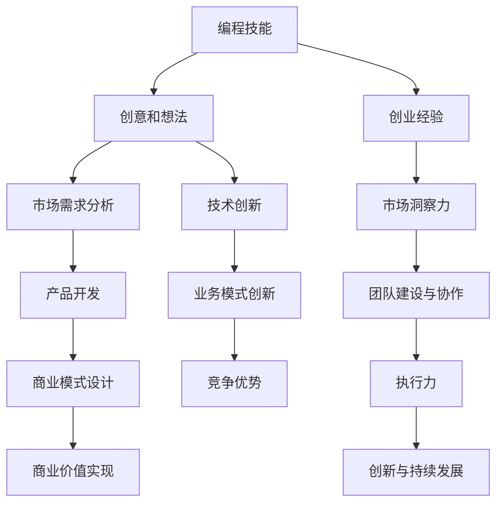

                 

在当今的科技浪潮中，编程已经成为一种至关重要的技能，不仅改变了我们工作和生活的方方面面，也为无数有志之士提供了实现梦想的舞台。然而，许多人拥有编程热情，却往往在将这种热情转化为实际的创业动力时感到困惑。本文将深入探讨如何将编程热情转化为创业动力，通过分析成功的创业案例、明确创业的核心要素、提供实用的策略和工具，帮助读者踏出创业的第一步。

## 关键词

- 编程热情
- 创业动力
- 成功案例
- 创业策略
- 工具推荐
- 未来展望

## 摘要

本文将探讨如何将编程热情转化为创业动力。我们将首先回顾编程与创业之间的关系，接着分析成功创业者的经验，探讨将编程技能应用于创业的途径。随后，我们将介绍构建和实施创业项目的实用策略，并推荐相关的开发工具和资源。最后，我们将展望创业的未来趋势和面临的挑战，以及提供研究展望和常见问题解答。

## 1. 背景介绍

编程是一种创造性的活动，它让开发者能够通过编写代码来实现各种功能和应用程序。编程不仅仅是编写代码，更是一种解决复杂问题的思维方式。随着互联网、大数据、人工智能等领域的迅猛发展，编程技能在商业和社会中的重要性日益凸显。

创业则是将创意转化为实际业务的过程。创业不仅仅是创办一家公司，更是一种创新和探索的精神。创业者需要具备坚定的信念、敏锐的市场洞察力、优秀的执行力和团队合作精神。随着科技的发展，创业形式也越来越多样化，从传统的实体企业到线上平台，从独立开发到团队协作，创业者们有了更多的选择。

编程与创业之间的关系是相辅相成的。编程技能为创业者提供了实现创意的工具，而创业经验则为开发者提供了更广阔的舞台，让他们能够将自己的技术应用到实际业务中，实现更大的价值。

## 2. 核心概念与联系

为了更好地理解如何将编程热情转化为创业动力，我们需要了解一些核心概念和它们之间的联系。以下是一个Mermaid流程图，展示了编程、创业和商业价值之间的相互作用。



### 2.1 编程技能与创意

编程技能是创业的基础。通过编程，开发者可以快速构建原型，验证自己的想法，并不断迭代改进。编程技能不仅仅是编写代码，更是一种解决问题的能力，这种能力在创业过程中至关重要。

### 2.2 市场需求分析

市场需求分析是创业成功的关键。创业者需要了解目标市场的需求，确定产品的定位和功能。通过数据分析和技术工具，创业者可以更准确地了解用户需求，从而设计出更受欢迎的产品。

### 2.3 产品开发

产品开发是将创意转化为实际产品的过程。创业者需要具备技术实现的能力，将市场需求转化为具体的功能和特性。在产品开发过程中，敏捷开发和迭代是提高效率和质量的重要手段。

### 2.4 商业模式设计

商业模式设计是创业的核心。创业者需要找到一种能够盈利的商业模式，将产品与市场需求结合起来，实现商业价值。这需要创业者具备商业思维和创新能力。

### 2.5 商业价值实现

商业价值实现是创业的终极目标。通过市场推广、销售和客户服务，创业者可以将产品推向市场，获取收益。在这个过程中，商业价值和客户满意度是关键指标。

### 2.6 创业经验与市场洞察力

创业经验是创业者成功的重要因素。通过创业实践，创业者可以积累丰富的经验，提高市场洞察力和判断力。市场洞察力是创业者成功的关键，它帮助创业者发现市场机会，制定正确的战略。

### 2.7 团队建设与协作

团队建设与协作是实现创业目标的关键。创业者需要找到合适的团队成员，共同面对挑战和机遇。团队合作能够提高效率，激发创新，是创业成功的重要保障。

### 2.8 执行力与创新

执行力是创业者实现目标的关键。创业者需要具备坚定的信念和执行力，将计划和想法付诸实践。同时，创新是创业的核心竞争力，它帮助创业者保持市场领先地位。

### 2.9 技术创新与业务模式创新

技术创新和业务模式创新是创业的重要驱动力。通过技术创新，创业者可以开发出更具竞争力的产品；通过业务模式创新，创业者可以找到更高效的盈利方式。

### 2.10 竞争优势

竞争优势是创业者在市场竞争中脱颖而出的关键。通过技术领先、市场定位准确、商业模式创新等手段，创业者可以建立竞争优势，实现可持续发展。

## 3. 核心算法原理 & 具体操作步骤

### 3.1 算法原理概述

将编程热情转化为创业动力，关键在于将技术技能与商业思维相结合。核心算法原理可以概括为以下几个步骤：

1. **市场调研与需求分析**：通过数据分析和技术工具，了解市场需求，确定产品的定位和功能。
2. **原型设计与开发**：利用编程技能，快速构建原型，验证创意，并根据用户反馈进行迭代改进。
3. **商业模式设计**：结合市场需求和技术特点，设计盈利模式，确保产品能够实现商业价值。
4. **市场推广与销售**：制定市场推广策略，将产品推向市场，获取收益。

### 3.2 算法步骤详解

1. **市场调研与需求分析**：

   - 利用在线调查、用户访谈和竞品分析等工具，收集市场数据。
   - 使用Python的Pandas库对数据进行分析，提取有用的信息。
   - 根据分析结果，确定产品的核心功能和目标用户群体。

2. **原型设计与开发**：

   - 使用Python的Django框架或React前端框架，快速搭建原型。
   - 根据用户反馈，不断优化产品功能和界面设计。
   - 使用Git进行版本控制，确保开发过程的协同和可追溯性。

3. **商业模式设计**：

   - 结合市场需求和产品特性，设计合理的商业模式。
   - 使用Excel或Tableau等工具，进行财务预测和利润分析。
   - 根据分析结果，调整商业模式，确保其可行性和盈利性。

4. **市场推广与销售**：

   - 制定市场推广策略，包括SEO、SEM、社交媒体推广等。
   - 使用Google Analytics等工具，监控市场推广效果。
   - 根据推广效果，调整推广策略，提高市场占有率。

### 3.3 算法优缺点

1. **优点**：

   - 快速验证创意，降低创业风险。
   - 利用技术优势，提高产品竞争力。
   - 通过数据分析，精准定位用户需求。

2. **缺点**：

   - 对技术要求较高，可能需要团队合作。
   - 市场推广成本较高，需要持续投入。

### 3.4 算法应用领域

- **电子商务**：通过数据分析，优化产品推荐和购物体验。
- **互联网金融**：利用区块链技术，提高交易安全和透明度。
- **健康医疗**：通过大数据分析，提供个性化健康管理和咨询服务。

## 4. 数学模型和公式 & 详细讲解 & 举例说明

### 4.1 数学模型构建

在将编程热情转化为创业动力的过程中，数学模型可以用来量化市场分析和商业预测。以下是几个常见的数学模型：

1. **需求函数**：用于预测市场对产品的需求。
   \[
   D = f(P, T, M)
   \]
   其中，\(D\) 表示需求量，\(P\) 表示产品价格，\(T\) 表示市场温度（可表示为季节或经济周期），\(M\) 表示市场促销力度。

2. **成本函数**：用于计算产品生产成本。
   \[
   C = f(Q, W, S)
   \]
   其中，\(C\) 表示成本，\(Q\) 表示生产量，\(W\) 表示原材料成本，\(S\) 表示生产设备的折旧成本。

3. **利润函数**：用于计算产品的利润。
   \[
   \Pi = R - C
   \]
   其中，\(\Pi\) 表示利润，\(R\) 表示收入，\(C\) 表示成本。

### 4.2 公式推导过程

1. **需求函数推导**：

   - **线性模型**：假设需求量与价格、温度和促销力度呈线性关系。
     \[
     D = aP + bT + cM
     \]
     其中，\(a\)、\(b\) 和 \(c\) 为系数。

   - **非线性模型**：考虑更复杂的关系，如指数函数或多项式函数。
     \[
     D = ae^{kP} + bT^2 + cM^3
     \]
     其中，\(k\) 为非线性系数。

2. **成本函数推导**：

   - **固定成本**：与生产量无关，如厂房租金。
     \[
     C_{fixed} = d
     \]
     其中，\(d\) 为固定成本。

   - **可变成本**：与生产量成正比，如原材料成本。
     \[
     C_{variable} = wQ
     \]
     其中，\(w\) 为每单位产品的原材料成本。

3. **利润函数推导**：

   - 利润为收入减去成本。
     \[
     \Pi = R - C
     \]
     其中，\(R\) 为收入，\(C\) 为成本。

### 4.3 案例分析与讲解

#### 案例一：在线教育平台

- **需求函数**：假设在线教育平台的需求量与价格、季节（温度）和促销力度有关。
  \[
  D = 1000 - 10P + 5T + 2M
  \]

- **成本函数**：固定成本为每月租金 \(d = 5000\) 美元，每节课可变成本为 \(w = 10\) 美元。
  \[
  C = 5000 + 10Q
  \]

- **利润函数**：每节课售价为 \(P = 30\) 美元。
  \[
  \Pi = 30Q - (5000 + 10Q) = 20Q - 5000
  \]

#### 案例二：电子商务网站

- **需求函数**：假设电子商务网站的需求量与价格和促销力度有关。
  \[
  D = 2000 - 20P + 3M
  \]

- **成本函数**：固定成本为每月服务器费用 \(d = 1000\) 美元，每件商品可变成本为 \(w = 5\) 美元。
  \[
  C = 1000 + 5Q
  \]

- **利润函数**：每件商品售价为 \(P = 20\) 美元。
  \[
  \Pi = 20Q - (1000 + 5Q) = 15Q - 1000
  \]

通过这些数学模型和公式，创业者可以更好地预测市场趋势、制定战略计划，并优化业务运营。

## 5. 项目实践：代码实例和详细解释说明

### 5.1 开发环境搭建

为了实践将编程热情转化为创业动力的理念，我们选择一个简单的在线书店项目。以下是搭建开发环境的具体步骤：

1. **安装Python环境**：

   - 在Windows或macOS系统中，可以从Python官方网站下载并安装Python 3.8及以上版本。
   - 安装完成后，打开命令行工具，输入`python --version`确认安装成功。

2. **安装相关库**：

   - 使用pip工具安装必要的库，如Flask、SQLite、Pandas等。
     \[
     pip install Flask Flask-SQLAlchemy Pandas
     \]

3. **创建虚拟环境**：

   - 为了避免不同项目之间的依赖冲突，可以使用virtualenv创建虚拟环境。
     \[
     virtualenv my_bookstore
     \]
   - 激活虚拟环境：
     \[
     source my_bookstore/bin/activate
     \]

### 5.2 源代码详细实现

以下是创建一个简单的在线书店的源代码实现。此代码使用了Flask框架和SQLite数据库。

```python
# app.py

from flask import Flask, render_template, request, redirect, url_for
from flask_sqlalchemy import SQLAlchemy

app = Flask(__name__)
app.config['SQLALCHEMY_DATABASE_URI'] = 'sqlite:///books.db'
db = SQLAlchemy(app)

class Book(db.Model):
    id = db.Column(db.Integer, primary_key=True)
    title = db.Column(db.String(100))
    author = db.Column(db.String(100))
    price = db.Column(db.Float)

@app.route('/')
def index():
    books = Book.query.all()
    return render_template('index.html', books=books)

@app.route('/add', methods=['POST'])
def add_book():
    title = request.form['title']
    author = request.form['author']
    price = float(request.form['price'])
    new_book = Book(title=title, author=author, price=price)
    db.session.add(new_book)
    db.session.commit()
    return redirect(url_for('index'))

if __name__ == '__main__':
    db.create_all()
    app.run(debug=True)
```

### 5.3 代码解读与分析

1. **数据库模型**：

   - 使用Flask-SQLAlchemy库创建数据库模型`Book`，包含书名、作者和价格。

2. **路由和视图函数**：

   - `index`视图函数：返回主页，显示所有书籍。
   - `add_book`视图函数：处理添加书籍的表单提交。

3. **模板文件**：

   - `index.html`：定义主页的HTML模板，包含书籍列表和添加书籍的表单。

### 5.4 运行结果展示

1. **启动服务器**：

   - 在命令行中运行`python app.py`启动Flask服务器。

2. **访问主页**：

   - 在浏览器中访问本地地址`http://127.0.0.1:5000/`，可以看到所有书籍。

3. **添加书籍**：

   - 在主页上填写书籍信息并提交，可以看到书籍被成功添加到数据库。

通过这个简单的项目，我们展示了如何使用编程技能快速搭建一个功能完整的在线书店。这只是一个起点，创业者可以根据自己的需求，逐步完善和扩展功能，实现更大的商业价值。

## 6. 实际应用场景

将编程热情转化为创业动力，可以应用于多个实际场景，以下是一些常见的应用领域：

### 6.1 在线教育平台

随着远程教育的兴起，许多创业者利用编程技能开发了各种在线教育平台。这些平台可以提供视频课程、实时互动、作业提交等功能，满足不同用户的学习需求。例如，Coursera和Udemy等平台就是成功的案例，它们通过优质的内容和用户体验，吸引了全球数百万用户。

### 6.2 电子商务

电子商务是编程技能的另一个重要应用领域。创业者可以开发在线商店，利用编程技术实现商品展示、订单管理、支付处理等功能。随着移动购物的发展，响应式设计、个性化推荐和智能搜索等技术也变得至关重要。例如，Amazon和eBay等巨头都是利用先进的编程技术，打造出用户体验卓越的电商平台。

### 6.3 健康医疗

健康医疗领域也需要大量的编程技能，创业者可以开发各种健康应用，如健身追踪器、疾病管理系统和医疗数据分析工具。这些应用可以收集用户数据，提供个性化的健康建议，甚至帮助医生进行诊断和治疗。例如，MyFitnessPal和HealthKit等应用就是利用编程技术，为用户提供健康管理和监测服务。

### 6.4 物联网

物联网（IoT）是编程技术的又一大应用领域。创业者可以开发各种物联网设备，如智能家居控制器、智能健康监测器和工业自动化系统。这些设备通过编程实现远程控制、数据采集和分析等功能，为用户带来更便捷和智能的生活体验。例如，Nest恒温器和Arduino平台都是物联网技术的成功应用。

### 6.5 游戏开发

游戏开发是编程技能的另一个重要应用领域。创业者可以开发各种类型的游戏，从简单的移动游戏到复杂的多人在线游戏。通过编程，开发者可以实现游戏逻辑、图形渲染和声音效果，为用户提供沉浸式的游戏体验。例如，Candy Crush和Fortnite等游戏都是利用先进的编程技术，成为全球流行的游戏。

通过以上实际应用场景，我们可以看到编程技能在创业中的巨大潜力。创业者可以利用编程技能，开发创新的产品和服务，满足市场需求，实现商业价值。

### 6.5 未来应用展望

随着技术的不断发展，编程热情转化为创业动力的应用领域也将不断拓展。以下是一些未来应用展望：

1. **区块链技术**：区块链的兴起为创业提供了新的机遇。创业者可以利用区块链技术，开发去中心化的应用，如加密货币交易所、智能合约平台和供应链管理系统。这些应用将提升交易的安全性和透明度，为用户带来更好的体验。

2. **人工智能（AI）**：人工智能技术的发展，为创业带来了无限可能。创业者可以开发各种AI应用，如智能助手、图像识别系统和自然语言处理平台。这些应用将在医疗、金融、零售等领域发挥重要作用，提升业务效率和用户体验。

3. **虚拟现实（VR）和增强现实（AR）**：虚拟现实和增强现实技术的进步，为创业者提供了新的创意空间。创业者可以开发VR游戏、AR广告和虚拟购物体验等应用，为用户带来全新的互动体验。

4. **物联网（IoT）**：物联网技术的不断成熟，为创业提供了新的机会。创业者可以开发智能设备、智能家居系统和工业物联网解决方案，为用户提供更智能、便捷的生活和工作环境。

5. **边缘计算**：边缘计算技术的发展，将推动创业领域的创新。创业者可以开发边缘计算应用，如实时数据分析、智能监控和远程控制等，提高系统的响应速度和可靠性。

通过这些未来应用展望，我们可以看到编程热情转化为创业动力的巨大潜力。创业者需要不断学习新技术，把握市场机遇，开发创新的产品和服务，实现商业成功。

## 7. 工具和资源推荐

在将编程热情转化为创业动力的过程中，选择合适的开发工具和资源至关重要。以下是一些推荐的工具和资源：

### 7.1 学习资源推荐

1. **在线课程**：Coursera、edX和Udemy等平台提供了丰富的编程和创业课程，适合不同层次的学习者。
2. **技术博客**：Medium、Hackernoon和Dev.to等平台上有大量关于编程和创业的文章，可以帮助读者获取最新技术和理念。
3. **开源社区**：GitHub和GitLab是优秀的开源社区，提供了大量的代码库和项目，可以学习和借鉴其他开发者的经验。

### 7.2 开发工具推荐

1. **集成开发环境（IDE）**：Visual Studio Code、PyCharm和Eclipse等IDE提供了强大的编程功能，支持多种编程语言。
2. **数据库工具**：MySQL、PostgreSQL和MongoDB等数据库工具广泛应用于各种创业项目。
3. **云服务**：AWS、Azure和Google Cloud等云服务提供了丰富的云计算资源，支持创业项目的开发和部署。

### 7.3 相关论文推荐

1. **《编程之禅》**：作者：Brian W. Kernighan，深入探讨了编程的本质和哲学，对开发者具有很高的启发意义。
2. **《创业维艰》**：作者：本·霍洛维茨，分享了他在创业过程中的经验和教训，为创业者提供了实用的建议。
3. **《人工智能：一种现代的方法》**：作者：斯图尔特·罗素和彼得·诺维格，全面介绍了人工智能的基本理论和应用。

通过这些工具和资源的推荐，创业者可以更好地实现自己的创业梦想。

## 8. 总结：未来发展趋势与挑战

### 8.1 研究成果总结

近年来，编程与创业之间的关系得到了广泛关注。研究发现，编程技能是创业者成功的关键因素之一。通过编程，创业者能够快速验证创意、构建原型和优化产品，提高市场竞争力。同时，技术的进步，如人工智能、区块链和物联网等，为创业提供了新的机遇和挑战。

### 8.2 未来发展趋势

1. **技术融合**：不同技术领域的融合将推动创业创新的不断发展。例如，AI与物联网的融合将带来智能城市和智能家居等新应用。
2. **平台化**：创业平台和孵化器的兴起，将降低创业门槛，促进创业者之间的合作与交流。
3. **可持续发展**：随着社会对环境保护和可持续发展的关注，绿色创业将越来越受欢迎。

### 8.3 面临的挑战

1. **技术壁垒**：掌握新兴技术需要较高的技术门槛，创业者需要不断学习和适应。
2. **资金压力**：创业初期的资金筹集是一个难题，尤其是技术型创业项目，需要较大的研发投入。
3. **市场风险**：市场竞争激烈，创业者需要具备敏锐的市场洞察力和风险管理能力。

### 8.4 研究展望

未来的研究可以关注以下几个方面：

1. **技术创新**：探索新的编程技术和工具，提高开发效率和产品质量。
2. **创业模式**：研究多样化的创业模式，为不同类型的创业者提供有效的指导。
3. **政策支持**：研究政府政策对创业的影响，提出优化创业环境的建议。

通过不断的研究和实践，我们可以更好地将编程热情转化为创业动力，推动创业创新的发展。

## 9. 附录：常见问题与解答

### Q1. 如何选择合适的编程语言？

A1. 选择编程语言应考虑项目的需求、个人经验和市场趋势。常见编程语言有Python、Java、JavaScript、C++和Go。Python适合数据分析、人工智能和Web开发；Java适用于企业级应用和安卓开发；JavaScript适合前端开发；C++适用于性能要求高的应用；Go适合云服务和并发编程。

### Q2. 创业项目失败的原因有哪些？

A2. 创业项目失败的原因有多种，主要包括：

- 市场需求不明确；
- 产品定位不准确；
- 研发投入不足；
- 竞争对手强大；
- 资金链断裂；
- 团队管理不善。

### Q3. 如何进行有效的市场调研？

A3. 市场调研可以通过以下几种方式进行：

- 在线调查问卷；
- 用户访谈；
- 竞品分析；
- 数据分析；
- 参加行业会议和展览。

通过多种调研方式，可以全面了解市场需求和竞争态势，为创业项目提供有力支持。

### Q4. 创业初期如何筹集资金？

A4. 创业初期筹集资金可以通过以下几种途径：

- 个人储蓄；
- 家人和朋友的投资；
- 天使投资；
- 风险投资；
- 政府创业补贴；
- 发起众筹。

根据项目需求和融资目标，选择合适的融资途径。

### Q5. 如何建立一个成功的创业团队？

A5. 建立成功的创业团队需要考虑以下几点：

- 明确团队目标和使命；
- 寻找互补技能的成员；
- 建立良好的沟通和协作机制；
- 提供合理的薪酬和福利；
- 关注团队成员的个人发展和职业规划。

通过这些措施，可以增强团队的凝聚力和执行力，提高创业成功率。

