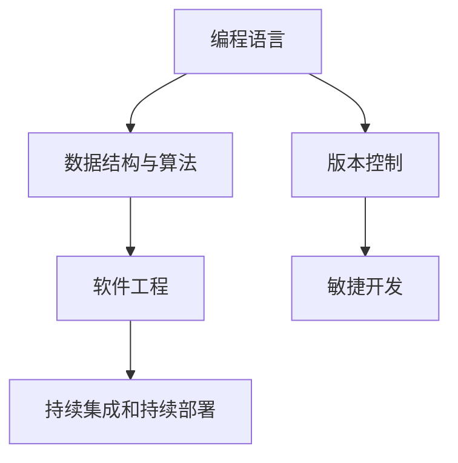

                 

在当今快速发展的数字化时代，编程不仅仅是技术领域中的一门技能，更是一种改变世界的力量。对许多人来说，编程起初可能只是一种爱好或兴趣，但随着时间的推移，很多人希望将这种热情转化为长期的职业生涯。本文将探讨如何实现这一转变，包括了解编程的热情来源、如何制定职业规划、提升技能和持续学习的必要性，以及如何在职业生涯中保持热情和动力。

## 文章关键词

- 编程热情
- 职业生涯规划
- 技能提升
- 持续学习
- 编程职业

## 文章摘要

本文旨在为那些对编程充满热情却不确定如何将其转化为长期职业的人提供指导。我们将探讨编程热情的起源，如何制定一个实际的职业规划，以及如何在不断变化的技术环境中持续提升技能。此外，文章还将讨论如何保持对编程的长期热情和动力，最终实现个人职业目标。

## 1. 背景介绍

编程，作为一种技术和艺术形式，正在全球范围内不断演进。它不仅是计算机科学的核心，也是推动技术创新和业务发展的关键力量。随着人工智能、大数据、区块链等新兴技术的崛起，编程的重要性日益凸显。因此，对于有编程热情的人来说，这是一个充满机遇的时代。

许多人最初接触编程是因为对解决问题的兴趣、对技术的喜爱，或者是对创造力的追求。这种热情往往是在学习编程的过程中逐渐培养起来的。然而，将这种热情转化为长期职业，需要明确的目标、良好的规划和持续的实践。

### 1.1 编程的热情来源

编程热情的来源多种多样。对于一些人来说，可能是对计算机科学的浓厚兴趣；对于其他人来说，可能是因为对技术的创新和创造感到兴奋。还有一些人则是因为在解决实际问题时发现了编程的魅力。

- **对计算机科学的兴趣**：许多人从小就对计算机和编程充满好奇。他们喜欢拆解电脑、探索操作系统的工作原理，并试图编写自己的程序。
- **对技术的创新和创造**：一些人看到技术的巨大潜力，希望通过编程创造出新的产品和服务，改变世界。
- **解决问题的快感**：编程是一种强大的工具，可以帮助人们解决复杂的问题。许多人发现，当成功地解决一个难题时，会带来巨大的满足感。

### 1.2 转化的必要性和挑战

将编程热情转化为职业是一个必要且挑战的过程。虽然编程可以带来很多乐趣和成就感，但要将这种兴趣转化为稳定的收入来源，需要付出更多的努力和时间。

- **必要性**：随着技术的快速发展，编程技能变得愈发重要。拥有编程能力的人在职场上具有更高的竞争力，能够承担更多有挑战性的工作。
- **挑战**：编程是一个不断变化和发展的领域，需要持续学习和适应新技术。此外，职业规划、个人品牌建设等方面也需要付出努力。

### 1.3 文章结构概述

本文将分为以下几个部分：

1. **核心概念与联系**：介绍编程的核心概念及其在职业生涯规划中的应用。
2. **核心算法原理 & 具体操作步骤**：探讨如何将编程技能应用于实际项目中。
3. **数学模型和公式 & 详细讲解 & 举例说明**：运用数学和算法来解决编程问题。
4. **项目实践：代码实例和详细解释说明**：通过具体实例展示编程的应用。
5. **实际应用场景**：分析编程在不同领域中的应用。
6. **工具和资源推荐**：提供学习资源和开发工具的建议。
7. **总结：未来发展趋势与挑战**：探讨编程领域的发展趋势和面临的挑战。
8. **附录：常见问题与解答**：回答读者可能遇到的问题。

## 2. 核心概念与联系

在将编程热情转化为长期职业的过程中，理解一些核心概念和它们在职业生涯规划中的联系至关重要。以下是几个关键概念及其在职业规划中的应用：

### 2.1 编程语言

编程语言是编程的核心，是程序员与计算机之间沟通的桥梁。不同的编程语言适用于不同的应用场景，掌握多种编程语言可以增强职业竞争力。

- **Python**：一种广泛使用的通用编程语言，适用于数据分析、机器学习和科学计算。
- **Java**：一种跨平台的编程语言，广泛应用于企业级应用和安卓开发。
- **JavaScript**：前端开发的核心语言，与HTML和CSS共同构建网页。

### 2.2 数据结构与算法

数据结构与算法是编程的核心知识，对于解决复杂问题至关重要。掌握常见的数据结构和算法可以显著提高编程效率。

- **数据结构**：如数组、链表、栈、队列、树和图等，用于高效地存储和管理数据。
- **算法**：如排序算法、查找算法、动态规划等，用于解决特定问题。

### 2.3 版本控制

版本控制是软件开发过程中不可或缺的一部分，用于管理代码的版本和历史。常用的版本控制系统有Git。

- **Git**：一个分布式版本控制系统，支持快速、高效地管理代码库和协作开发。

### 2.4 软件工程

软件工程是一套用于设计、开发、测试和维护软件的系统化方法和工具。

- **敏捷开发**：一种快速、迭代和协作的软件开发方法。
- **持续集成和持续部署（CI/CD）**：用于自动化测试和部署的流程。

### 2.5 核心概念的联系

这些核心概念之间有着紧密的联系。例如，编程语言用于编写程序，而数据结构与算法用于优化程序性能。版本控制和软件工程则是确保程序可靠性和协作开发的关键工具。

### 2.6 Mermaid 流程图

以下是一个简单的Mermaid流程图，展示编程核心概念之间的联系：



通过理解这些核心概念及其在职业规划中的应用，我们可以更好地将编程热情转化为长期的职业生涯。

## 3. 核心算法原理 & 具体操作步骤

在编程中，算法是解决特定问题的方法。掌握核心算法原理和具体操作步骤是提高编程能力和解决复杂问题的关键。以下将介绍几种常见算法的原理和步骤。

### 3.1 算法原理概述

算法可以分为几种类型：

- **排序算法**：用于对数据进行排序，如冒泡排序、选择排序、插入排序等。
- **查找算法**：用于在数据结构中查找特定元素，如二分查找、线性查找等。
- **动态规划**：用于解决最优子结构问题，如背包问题、最短路径问题等。
- **图算法**：用于在图中进行搜索、最短路径、最小生成树等操作，如Dijkstra算法、BFS、DFS等。

### 3.2 算法步骤详解

以冒泡排序为例，其基本思想是通过反复交换相邻但顺序错误的元素，使得每一轮排序后最大的元素逐渐“冒泡”到数组的末尾。

**步骤详解：**

1. **初始化**：将数组中的元素进行遍历。
2. **比较相邻元素**：对每一对相邻元素进行比较，如果顺序错误则交换。
3. **重复步骤2**，直到数组中所有元素有序。

**伪代码：**

```
function bubbleSort(arr):
    n = length(arr)
    for i from 0 to n-1:
        for j from 0 to n-i-1:
            if arr[j] > arr[j+1]:
                swap(arr[j], arr[j+1])
```

### 3.3 算法优缺点

- **优点**：实现简单，易于理解。
- **缺点**：时间复杂度为O(n^2)，效率较低，不适合大规模数据排序。

### 3.4 算法应用领域

冒泡排序通常用于教学和简单数据集的排序。在实际应用中，对于大型数据集和需要高效排序的场景，更常用的是快速排序、归并排序等更高效的算法。

### 3.5 其他常见算法

- **二分查找**：时间复杂度为O(log n)，适用于有序数组。
- **动态规划**：常用于解决最优子结构问题，如背包问题、最长公共子序列等。
- **图算法**：如Dijkstra算法用于计算单源最短路径，BFS和DFS用于图的遍历。

通过掌握这些核心算法的原理和具体操作步骤，我们可以更好地解决编程中的问题，提高编程能力。

## 4. 数学模型和公式 & 详细讲解 & 举例说明

在编程中，数学模型和公式是解决复杂问题的重要工具。它们可以帮助我们更好地理解问题，找到最优解。以下是几个常见的数学模型和公式的详细讲解及举例说明。

### 4.1 数学模型构建

数学模型是现实世界问题的数学表达。构建数学模型通常包括以下几个步骤：

1. **确定变量和参数**：根据问题确定需要解决的变量和参数。
2. **建立方程**：使用适当的数学方法建立描述问题的方程。
3. **解方程**：求解方程，得到问题的解。

### 4.2 公式推导过程

以下是一个简单的例子：求一个等差数列的前n项和。

**公式推导过程：**

设等差数列的首项为a，公差为d，第n项为an。根据等差数列的性质，我们有：

an = a + (n - 1)d

前n项和S(n)为：

S(n) = a + (a + d) + (a + 2d) + ... + (a + (n - 1)d)

将S(n)乘以2：

2S(n) = 2a + (2a + d) + (2a + 2d) + ... + (2a + 2(n - 1)d)

将上述两个式子相减：

-S(n) = (n - 1)d + (n - 1)d + ... + (n - 1)d

S(n) = n * (a + an) / 2

即等差数列的前n项和为：

S(n) = n * (a + an) / 2

### 4.3 案例分析与讲解

以下是一个使用上述公式求解等差数列前n项和的实例：

**问题**：求等差数列1, 3, 5, 7, ...的前10项和。

**解答**：

根据公式S(n) = n * (a + an) / 2，代入a = 1，an = 1 + (n - 1) * 2：

S(10) = 10 * (1 + 1 + (10 - 1) * 2) / 2
      = 10 * (1 + 19) / 2
      = 10 * 20 / 2
      = 100

因此，等差数列1, 3, 5, 7, ...的前10项和为100。

通过这个例子，我们可以看到数学模型和公式的强大应用。在编程中，熟练掌握数学模型和公式可以显著提高问题解决的能力。

## 5. 项目实践：代码实例和详细解释说明

### 5.1 开发环境搭建

为了实践编程技能，首先需要搭建一个适合的开发环境。以下是使用Python语言的开发环境搭建步骤：

1. **安装Python**：下载并安装Python，可以选择Python 3.x版本，因为它是当前最流行的版本。下载地址：https://www.python.org/downloads/
2. **配置环境变量**：在安装过程中，选择添加Python到系统环境变量，以便在任何目录下都能运行Python。
3. **安装IDE**：选择一个合适的集成开发环境（IDE），例如PyCharm、VSCode或Jupyter Notebook。下载地址分别为：
   - PyCharm：https://www.jetbrains.com/pycharm/
   - VSCode：https://code.visualstudio.com/
   - Jupyter Notebook：https://jupyter.org/

### 5.2 源代码详细实现

以下是一个简单的Python代码实例，用于计算等差数列的前n项和。代码中包含了注释，方便理解。

```python
# 等差数列求和函数
def sum_of_arithmetic_series(first_term, common_difference, number_of_terms):
    """
    计算等差数列的前n项和
    :param first_term: 首项
    :param common_difference: 公差
    :param number_of_terms: 项数
    :return: 等差数列的前n项和
    """
    last_term = first_term + (number_of_terms - 1) * common_difference  # 计算末项
    sum_of_series = number_of_terms * (first_term + last_term) // 2  # 应用等差数列求和公式
    return sum_of_series

# 主函数
def main():
    first_term = int(input("请输入等差数列的首项："))
    common_difference = int(input("请输入等差数列的公差："))
    number_of_terms = int(input("请输入等差数列的项数："))

    sum_of_series = sum_of_arithmetic_series(first_term, common_difference, number_of_terms)
    print(f"等差数列{first_term}, {common_difference}, ..., 的前{n}项和为：{sum_of_series}")

# 程序入口
if __name__ == "__main__":
    main()
```

### 5.3 代码解读与分析

- **函数定义**：`sum_of_arithmetic_series` 函数用于计算等差数列的前n项和。
- **参数**：函数接受三个参数：首项`first_term`、公差`common_difference`和项数`number_of_terms`。
- **公式应用**：使用等差数列求和公式 `S(n) = n * (a1 + an) / 2` 计算和。
- **主函数`main`**：用于获取用户输入并调用`sum_of_arithmetic_series` 函数计算和，最后打印结果。

### 5.4 运行结果展示

当用户输入以下数据：

- 首项：1
- 公差：2
- 项数：5

程序将输出：

```
等差数列1, 2, ..., 的前5项和为：40
```

通过这个简单的实例，我们展示了如何使用Python编写程序来解决实际问题。在实际项目中，代码会更为复杂，但基本原理是相似的。

## 6. 实际应用场景

编程技能在众多领域中有着广泛的应用。以下是一些主要的应用场景：

### 6.1 互联网开发

互联网开发是编程最常见也是最重要的应用场景之一。程序员可以通过编写网站和移动应用程序来满足用户需求。常见的编程语言包括HTML、CSS、JavaScript、Python、Java和Ruby。

### 6.2 数据科学

数据科学是一个快速发展的领域，依赖于编程和数学模型来分析大量数据。Python和R是数据科学中最常用的编程语言，用于数据分析、机器学习和人工智能。

### 6.3 人工智能

人工智能（AI）是当前最热门的技术领域之一，编程在其中扮演着核心角色。程序员可以开发智能系统，如语音识别、图像识别、自动驾驶等。

### 6.4 游戏开发

游戏开发是一个创意与技术相结合的领域。程序员可以编写游戏引擎和游戏逻辑，使用C++、C#和Java等编程语言。

### 6.5 嵌入式开发

嵌入式系统是运行在特定设备上的软件，如智能家居设备、医疗设备和汽车电子设备。C和C++是嵌入式系统开发的主要编程语言。

### 6.6 云计算

云计算是利用网络提供计算资源的服务。程序员可以通过编写代码来开发和管理云基础设施，使用Python、Java和Go等编程语言。

### 6.7 区块链

区块链技术依赖于编程来实现去中心化的数据管理。程序员可以开发区块链应用，使用Solidity和JavaScript等编程语言。

通过上述应用场景，我们可以看到编程的多样性和重要性。对于有编程热情的人来说，选择一个适合自己的领域，并将热情转化为专业技能，是实现长期职业发展的重要途径。

### 6.7 未来应用展望

编程领域的未来发展充满了机遇和挑战。随着技术的不断进步，编程的应用范围将更加广泛，新的编程语言和技术将不断涌现。

#### 6.7.1 人工智能与机器学习

人工智能和机器学习领域的快速发展为编程带来了新的挑战和机会。随着深度学习技术的进步，程序员需要掌握更多复杂的算法和模型。未来，AI编程工具将更加智能化，能够自动生成代码，提高开发效率。

#### 6.7.2 区块链技术

区块链技术的应用不断扩展，从金融到供应链管理，再到物联网，编程将成为实现区块链功能的关键。智能合约的开发将需要程序员更加熟悉Solidity等区块链编程语言。

#### 6.7.3 云计算与边缘计算

云计算和边缘计算的发展将推动编程语言的创新。程序员需要掌握如何在不同的计算环境中优化性能，并开发分布式应用程序。新的编程语言和框架将出现，以支持这些新兴的技术需求。

#### 6.7.4 量子计算

量子计算是一个革命性的领域，它将对编程产生深远影响。未来的量子编程语言和工具将允许程序员开发处理量子信息的程序，这将为科学研究、加密技术等领域带来新的可能性。

通过紧跟技术趋势，不断学习和适应新技术，程序员可以把握未来的机遇，并在编程领域实现长期的发展。

### 7. 工具和资源推荐

为了帮助编程爱好者将兴趣转化为实际技能，以下是一些推荐的工具和资源：

#### 7.1 学习资源推荐

- **在线课程**：Udacity、Coursera、edX等平台提供了丰富的编程课程，适合不同水平的学员。
- **编程书籍**：《编程珠玑》、《代码大全》和《算法导论》等经典书籍是编程学习的重要资源。
- **技术博客**：Stack Overflow、GitHub、Medium等技术博客提供了大量实用的编程知识和经验分享。

#### 7.2 开发工具推荐

- **集成开发环境（IDE）**：PyCharm、Visual Studio Code、Eclipse等IDE提供了强大的编程功能和调试工具。
- **版本控制系统**：Git是最流行的版本控制系统，支持代码的版本管理和协作开发。
- **调试工具**：Postman、JMeter等工具可以帮助开发者进行API测试和性能分析。

#### 7.3 相关论文推荐

- **《深度学习》**：由Ian Goodfellow、Yoshua Bengio和Aaron Courville撰写，是深度学习领域的权威著作。
- **《区块链：从数字货币到智能合约》**：详细介绍区块链技术的原理和应用。
- **《云计算：概念、架构与应用》**：覆盖云计算的基础知识和技术实践。

通过利用这些工具和资源，编程爱好者可以更好地提升自己的技能，实现职业目标。

### 8. 总结：未来发展趋势与挑战

在编程领域，未来的发展趋势呈现出多样化和复杂化的趋势。随着人工智能、大数据、区块链等新兴技术的快速发展，编程不仅成为推动技术创新的关键力量，也对各行各业产生了深远影响。以下是对编程领域未来发展趋势和挑战的总结：

#### 8.1 研究成果总结

近年来，编程领域取得了显著的研究成果。深度学习算法的突破，使得AI在图像识别、自然语言处理等领域取得了重大进展。区块链技术的应用也从数字货币扩展到供应链管理、金融服务等多个领域。云计算技术的发展，使得分布式计算和数据处理变得更加高效和灵活。这些研究成果不仅丰富了编程的理论基础，也为实际应用提供了强大的支持。

#### 8.2 未来发展趋势

1. **编程语言的多样化**：随着新技术的发展，新的编程语言和框架将不断涌现，以满足不同应用场景的需求。
2. **自动化与智能化**：编程工具和平台将更加智能化，自动生成代码、优化性能，提高开发效率。
3. **跨领域融合**：编程将与其他领域如生物学、物理学、经济学等进一步融合，推动交叉学科的发展。
4. **边缘计算**：随着物联网设备的普及，边缘计算将成为编程的重要方向，开发者需要掌握如何在有限的资源上优化性能。

#### 8.3 面临的挑战

1. **技术复杂性**：新技术的不断涌现，使得编程变得更为复杂，程序员需要不断学习和适应新技术。
2. **安全与隐私**：随着数据量的增加，数据安全和隐私保护成为编程领域的重要挑战。开发者需要关注如何设计安全、可靠的系统。
3. **教育与人才培养**：随着编程技能的重要性日益凸显，如何培养更多的编程人才成为关键问题。教育体系需要适应技术发展的需求，提供高质量的编程教育。
4. **道德与伦理**：随着人工智能等技术的发展，编程在道德和伦理方面面临新的挑战。开发者需要关注技术的社会影响，确保技术应用的公平、公正和可持续性。

#### 8.4 研究展望

未来，编程领域的研究将继续深入，探索新的算法、语言和工具，推动技术创新。同时，研究者还需要关注技术的社会影响，确保技术的发展符合人类的共同利益。通过不断的努力，编程将迎来更加繁荣的未来。

### 9. 附录：常见问题与解答

#### 9.1 如何选择编程语言？

选择编程语言应考虑以下几个因素：

- **项目需求**：根据项目的具体需求选择合适的语言，如Python适合数据分析，Java适合企业级应用。
- **个人兴趣**：选择自己感兴趣的语言，更容易保持学习动力。
- **社区支持**：选择有活跃社区和丰富资源的语言，便于学习和解决开发中的问题。

#### 9.2 如何持续提升编程技能？

以下是几个提升编程技能的建议：

- **学习新知识**：定期学习新的编程语言、框架和技术。
- **实践项目**：通过实际项目练习编程技能。
- **参与开源项目**：参与开源项目可以学习最佳实践和团队协作。
- **阅读技术博客**：关注技术博客和社区，了解行业动态。

#### 9.3 编程职业的发展方向有哪些？

编程职业的发展方向包括：

- **软件开发工程师**：专注于编写应用程序和软件系统。
- **数据科学家**：专注于使用编程进行数据分析和机器学习。
- **AI研究员**：专注于人工智能和机器学习的研究和开发。
- **DevOps工程师**：专注于软件开发和运维的结合。

通过了解这些常见问题与解答，编程爱好者可以更好地规划自己的学习路径和职业发展。

