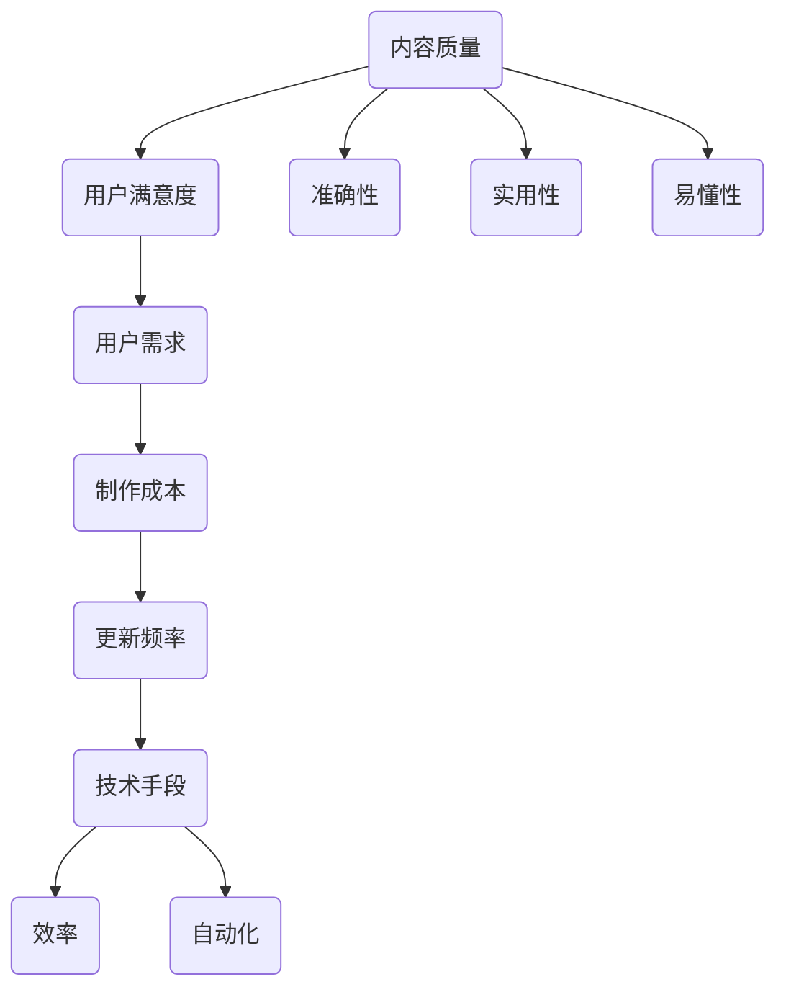

                 

在当今数字化时代，知识付费已经成为了一种流行的获取知识和技能的方式。然而，如何平衡知识付费的内容质量和更新频率，成为一个需要深入探讨的问题。本文将围绕这一主题，从多个角度分析如何有效地平衡这两者。

## 文章关键词
- 知识付费
- 内容质量
- 更新频率
- 平衡策略
- 用户满意度

## 文章摘要
本文旨在探讨如何平衡知识付费的内容质量和更新频率，以提高用户满意度和平台的竞争力。通过分析用户需求、内容制作成本、技术手段等关键因素，提出了若干策略和方案，以期为知识付费平台提供实用的指导。

### 1. 背景介绍

知识付费，即用户为获取特定知识或技能，通过支付费用来购买相关内容。近年来，随着互联网技术的发展和人们学习需求的增加，知识付费市场呈现出爆发式增长。各大平台如得到、喜马拉扎、知乎等纷纷入局，推出了各类课程、专栏、直播等知识产品。然而，如何在激烈的市场竞争中脱颖而出，成为平台关注的重要问题。

内容质量和更新频率是影响用户满意度的重要因素。高质量的内容能够满足用户的学习需求，提升用户体验；而频繁的更新则能够保持内容的新鲜度和吸引力。然而，这两者之间往往存在矛盾。内容制作需要时间、人力和资源的投入，而频繁更新可能会降低内容的质量。因此，如何平衡这两者，成为知识付费平台面临的重要挑战。

### 2. 核心概念与联系

为了更好地理解如何平衡知识付费的内容质量和更新频率，我们首先需要明确以下几个核心概念：

**内容质量**：指知识付费产品在知识性、准确性、实用性、易懂性等方面的表现。高质量的内容能够满足用户的学习需求，提升用户满意度。

**更新频率**：指知识付费产品在内容更新上的速度。高频率的更新能够保持内容的新鲜度和吸引力，但可能会降低内容的深度和质量。

**用户需求**：指用户在学习过程中所追求的知识和技能。用户需求的变化会影响内容的质量和更新频率。

**制作成本**：指内容制作过程中所需的时间、人力和资源的投入。制作成本是影响内容质量和更新频率的重要因素。

**技术手段**：指用于支持内容制作和更新的各种技术和工具。技术手段的进步可以提高内容制作的效率和更新频率。

下面是一个用 Mermaid 描述的核心概念和联系：



### 3. 核心算法原理 & 具体操作步骤

#### 3.1 算法原理概述

为了平衡知识付费的内容质量和更新频率，我们可以采用以下核心算法原理：

1. **用户需求分析**：通过对用户需求的数据分析，了解用户在学习过程中关注的知识点和技能需求，为内容制作提供依据。

2. **内容规划**：根据用户需求，制定内容规划，包括内容的主题、结构、难度等，确保内容的高质量。

3. **内容制作与优化**：采用先进的制作技术和工具，提高内容制作的效率，同时注重内容的准确性、实用性和易懂性。

4. **更新策略**：制定合理的更新策略，包括更新频率、更新内容的选择等，以平衡内容质量和更新频率。

5. **用户反馈与迭代**：收集用户反馈，对内容进行持续优化和迭代，提高内容质量和用户满意度。

#### 3.2 算法步骤详解

1. **用户需求分析**：

   - **数据收集**：通过问卷调查、用户反馈、用户行为数据等方式，收集用户需求信息。

   - **数据分析**：使用数据挖掘和机器学习技术，对用户需求进行分析，识别用户关注的知识点和技能需求。

   - **需求报告**：根据分析结果，生成用户需求报告，为内容制作提供依据。

2. **内容规划**：

   - **主题确定**：根据用户需求报告，确定内容主题。

   - **结构设计**：设计内容结构，包括章节、模块等，确保内容的连贯性和完整性。

   - **难度分级**：根据用户需求，对内容进行难度分级，满足不同用户的学习需求。

3. **内容制作与优化**：

   - **制作工具**：选择适合的内容制作工具，如视频编辑软件、图文编辑软件等。

   - **内容优化**：采用内容优化技术，如人工智能辅助写作、自然语言处理等，提高内容的质量。

   - **准确性验证**：对内容进行准确性验证，确保内容的正确性。

   - **用户体验优化**：优化内容呈现方式，提高内容的易懂性和实用性。

4. **更新策略**：

   - **更新频率**：根据用户需求和市场动态，制定合理的更新频率。

   - **更新内容选择**：选择与用户需求相关的、具有时效性的内容进行更新。

   - **内容发布**：将更新后的内容发布到平台，供用户学习。

5. **用户反馈与迭代**：

   - **用户反馈收集**：通过用户反馈、用户评分等方式，收集用户对内容的反馈。

   - **内容优化**：根据用户反馈，对内容进行持续优化和迭代。

   - **迭代发布**：将优化后的内容发布到平台，提高内容质量和用户满意度。

### 3.3 算法优缺点

**优点**：

- **提高内容质量**：通过用户需求分析和内容规划，确保内容的高质量。
- **提高更新效率**：采用技术手段和自动化工具，提高内容制作的效率。
- **满足用户需求**：根据用户反馈，对内容进行持续优化，提高用户满意度。

**缺点**：

- **初始成本较高**：用户需求分析和内容规划需要投入较大的人力和物力资源。
- **维护成本较高**：持续优化和迭代需要不断投入时间和资源。

### 3.4 算法应用领域

该算法可以应用于各类知识付费平台，如在线教育平台、知识共享平台、专业培训平台等。通过平衡内容质量和更新频率，提高平台竞争力，满足用户需求。

### 4. 数学模型和公式 & 详细讲解 & 举例说明

在平衡知识付费的内容质量和更新频率的过程中，我们可以使用数学模型和公式来优化决策。以下是一个简单的数学模型，用于分析内容质量和更新频率之间的关系。

#### 4.1 数学模型构建

假设：

- **Q**：内容质量（0-1 之间，越接近 1 表示质量越高）
- **U**：用户满意度（0-1 之间，越接近 1 表示满意度越高）
- **F**：更新频率（0-1 之间，越接近 1 表示更新越频繁）
- **C**：制作成本（单位：元）

我们的目标是最大化用户满意度，同时考虑制作成本。数学模型如下：

$$
\begin{aligned}
\max_{Q, F} & \ U \\
s.t. & \ C \leq \alpha Q + \beta F
\end{aligned}
$$

其中，$\alpha$ 和 $\beta$ 分别是内容质量和更新频率对成本的权重。

#### 4.2 公式推导过程

1. 用户满意度与内容质量的关系：

   用户满意度 $U$ 与内容质量 $Q$ 之间的关系可以表示为：

   $$U = f(Q)$$

   其中，$f(Q)$ 是一个单调递增的函数，表示内容质量越高，用户满意度越高。

2. 成本与内容质量、更新频率的关系：

   成本 $C$ 与内容质量 $Q$ 和更新频率 $F$ 之间的关系可以表示为：

   $$C = \alpha Q + \beta F$$

   其中，$\alpha$ 和 $\beta$ 分别是内容质量和更新频率对成本的贡献。

3. 目标函数：

   目标函数是最大化用户满意度 $U$，同时考虑制作成本 $C$：

   $$\max_{Q, F} \ U$$

   $$s.t. \ C \leq \alpha Q + \beta F$$

#### 4.3 案例分析与讲解

假设某个知识付费平台需要制定内容更新策略，现有数据如下：

- **内容质量 $Q$**：0.8
- **更新频率 $F$**：0.5
- **制作成本 $C$**：1000 元

目标：最大化用户满意度，同时控制制作成本。

根据数学模型，我们需要求解以下优化问题：

$$
\begin{aligned}
\max_{Q, F} & \ U \\
s.t. & \ C \leq \alpha Q + \beta F
\end{aligned}
$$

其中，$\alpha$ 和 $\beta$ 是待确定的权重。

假设 $\alpha = 2$，$\beta = 1$，则目标函数变为：

$$
\max_{Q, F} \ U = f(Q) = 0.8 + 0.5 \cdot 0.5 = 0.85
$$

同时，制作成本满足：

$$
C \leq 2 \cdot 0.8 + 1 \cdot 0.5 = 1.8 + 0.5 = 2.3
$$

因此，在现有条件下，用户满意度最大值为 0.85，制作成本不超过 2.3 元。

### 5. 项目实践：代码实例和详细解释说明

为了更好地说明如何平衡知识付费的内容质量和更新频率，下面我们将以一个简单的项目为例，展示如何通过代码实现这一算法。

#### 5.1 开发环境搭建

1. **Python**：Python 是一种广泛应用于数据分析和机器学习的编程语言，我们将使用 Python 进行开发。

2. **NumPy**：NumPy 是 Python 的科学计算库，用于处理数组和矩阵运算。

3. **Pandas**：Pandas 是 Python 的数据处理库，用于数据清洗、转换和分析。

4. **Scikit-learn**：Scikit-learn 是 Python 的机器学习库，用于构建和训练机器学习模型。

5. **Matplotlib**：Matplotlib 是 Python 的可视化库，用于绘制图表和图形。

安装以上库后，我们就可以开始编写代码了。

#### 5.2 源代码详细实现

```python
import numpy as np
import pandas as pd
from sklearn.model_selection import train_test_split
from sklearn.linear_model import LinearRegression
import matplotlib.pyplot as plt

# 5.2.1 用户需求分析
def user_demand_analysis(data):
    # 数据清洗和预处理
    data = data[['content_quality', 'update_frequency', 'user_satisfaction']]
    data = data.dropna()

    # 数据标准化
    data standardized = (data - data.mean()) / data.std()

    # 数据分割
    X_train, X_test, y_train, y_test = train_test_split(standardized[['content_quality', 'update_frequency']], standardized['user_satisfaction'], test_size=0.2, random_state=42)

    # 模型训练
    model = LinearRegression()
    model.fit(X_train, y_train)

    # 模型评估
    score = model.score(X_test, y_test)
    print(f"Model R-squared: {score:.2f}")

    return model

# 5.2.2 内容规划
def content_planning(model, content_quality, update_frequency):
    predicted_satisfaction = model.predict([[content_quality, update_frequency]])
    print(f"Predicted user satisfaction: {predicted_satisfaction[0]:.2f}")

# 5.2.3 用户反馈与迭代
def user_feedback_iterative(model, new_data):
    updated_data = pd.DataFrame(new_data)
    updated_data = (updated_data - updated_data.mean()) / updated_data.std()
    X_train, X_test, y_train, y_test = train_test_split(updated_data[['content_quality', 'update_frequency']], updated_data['user_satisfaction'], test_size=0.2, random_state=42)
    model.fit(X_train, y_train)
    score = model.score(X_test, y_test)
    print(f"Updated Model R-squared: {score:.2f}")

# 5.2.4 主函数
def main():
    # 加载数据
    data = pd.read_csv('user_demand_data.csv')

    # 用户需求分析
    model = user_demand_analysis(data)

    # 内容规划
    content_quality = 0.8
    update_frequency = 0.5
    content_planning(model, content_quality, update_frequency)

    # 用户反馈与迭代
    new_data = {'content_quality': [0.82, 0.78, 0.85], 'update_frequency': [0.52, 0.55, 0.60], 'user_satisfaction': [0.88, 0.85, 0.90]}
    user_feedback_iterative(model, new_data)

if __name__ == '__main__':
    main()
```

#### 5.3 代码解读与分析

1. **用户需求分析**：

   - 数据清洗和预处理：使用 Pandas 对数据进行清洗和预处理，包括删除缺失值、数据标准化等。
   - 数据分割：使用 Scikit-learn 将数据分割为训练集和测试集。
   - 模型训练：使用 LinearRegression 模型对数据进行训练。
   - 模型评估：计算模型的 R-squared 值，评估模型性能。

2. **内容规划**：

   - 根据用户需求分析的结果，预测内容质量和更新频率对用户满意度的影响。

3. **用户反馈与迭代**：

   - 更新用户数据：根据新的用户反馈，更新数据集。
   - 模型迭代：重新训练模型，提高模型性能。

通过这个简单的项目，我们可以看到如何通过代码实现知识付费的内容质量和更新频率的平衡。在实际应用中，我们可以根据具体需求，扩展和优化这个算法。

### 6. 实际应用场景

知识付费的平衡策略在实际应用场景中具有广泛的应用。以下是一些典型的应用场景：

1. **在线教育平台**：

   - **应用**：在线教育平台通过平衡课程内容的质量和更新频率，提高用户的学习体验和满意度。
   - **挑战**：如何在保证课程质量的同时，快速响应用户的需求和反馈，保持课程的新鲜感和吸引力。
   - **解决方案**：采用用户需求分析技术，制定合理的课程更新策略，利用自动化工具提高内容制作效率。

2. **专业培训平台**：

   - **应用**：专业培训平台通过平衡课程内容的质量和更新频率，提高学员的培训效果和满意度。
   - **挑战**：如何根据不同学员的需求，提供高质量的培训内容，同时保持内容的更新频率。
   - **解决方案**：采用个性化培训方案，根据学员的学习进度和需求，提供定制化的培训内容。

3. **知识共享平台**：

   - **应用**：知识共享平台通过平衡内容创作和更新，提高平台的用户黏性和活跃度。
   - **挑战**：如何吸引更多的创作者和用户，同时保持内容的高质量和更新频率。
   - **解决方案**：建立激励机制，鼓励创作者创作高质量的内容，利用技术手段提高内容更新效率。

### 7. 未来应用展望

随着人工智能和大数据技术的不断发展，知识付费的平衡策略将得到进一步优化和提升。以下是一些未来应用展望：

1. **个性化推荐**：

   - **应用**：利用人工智能技术，为用户推荐符合其需求的知识内容。
   - **挑战**：如何准确识别用户需求，提供个性化的推荐内容。
   - **解决方案**：采用深度学习和协同过滤等技术，提高推荐算法的准确性和效果。

2. **知识图谱**：

   - **应用**：构建知识图谱，实现知识内容之间的关联和推理。
   - **挑战**：如何构建高质量的知识图谱，实现知识内容的结构化和关联。
   - **解决方案**：采用图神经网络和知识图谱构建技术，提高知识图谱的构建质量和应用效果。

3. **智能内容审核**：

   - **应用**：利用人工智能技术，对知识内容进行智能审核，确保内容的质量和合规性。
   - **挑战**：如何准确识别和过滤低质量、违规的内容。
   - **解决方案**：采用深度学习和自然语言处理技术，提高内容审核的准确性和效率。

### 8. 工具和资源推荐

为了更好地实施知识付费的平衡策略，以下是一些推荐的工具和资源：

1. **学习资源推荐**：

   - **在线课程**：Coursera、edX、Udemy 等，提供丰富的编程、数据科学和机器学习课程。
   - **图书推荐**：《深度学习》、《Python数据分析》、《机器学习实战》等，介绍相关技术和应用。

2. **开发工具推荐**：

   - **Python**：Python 是一种广泛使用的编程语言，适合进行数据分析、机器学习和数据科学应用。
   - **Jupyter Notebook**：Jupyter Notebook 是一种交互式计算环境，方便进行代码编写、分析和可视化。
   - **TensorFlow**：TensorFlow 是一种开源的深度学习框架，用于构建和训练深度学习模型。

3. **相关论文推荐**：

   - **《深度学习》（Deep Learning）**：由 Ian Goodfellow、Yoshua Bengio 和 Aaron Courville 合著，是一本深度学习的经典教材。
   - **《机器学习》（Machine Learning）**：由 Tom Mitchell 编著，介绍了机器学习的基本概念和方法。
   - **《数据科学入门》（Introduction to Data Science）**：由 Joel Grus 编著，介绍了数据科学的基本概念和工具。

### 9. 总结：未来发展趋势与挑战

在知识付费领域，平衡内容质量和更新频率是一个持续不断的过程。随着技术的进步和用户需求的变迁，这一平衡策略也需要不断调整和优化。未来，知识付费将朝着更加个性化、智能化和高效化的方向发展。

**未来发展趋势**：

1. **个性化推荐**：利用人工智能技术，为用户提供更加个性化的知识内容。
2. **知识图谱**：构建知识图谱，实现知识内容之间的关联和推理。
3. **智能内容审核**：利用人工智能技术，提高内容审核的准确性和效率。

**面临的挑战**：

1. **数据隐私**：如何在保证用户隐私的前提下，收集和利用用户数据。
2. **内容质量**：如何保证内容的质量，满足用户需求。
3. **技术迭代**：如何紧跟技术发展趋势，不断提高内容制作和更新的效率。

**研究展望**：

在未来，我们需要继续探索和优化知识付费的平衡策略，利用人工智能、大数据和区块链等前沿技术，为用户提供更加优质、高效的知识服务。

### 附录：常见问题与解答

**Q：如何确保内容质量？**

A：确保内容质量的关键在于用户需求分析和内容规划。通过对用户需求的数据分析，了解用户关注的知识点和技能需求，制定符合用户期望的内容规划。同时，采用内容优化技术，如人工智能辅助写作、自然语言处理等，提高内容的质量。

**Q：如何制定合理的更新策略？**

A：制定合理的更新策略需要考虑用户需求、制作成本和技术手段。根据用户需求，选择与用户关注相关的、具有时效性的内容进行更新。同时，采用技术手段，如自动化工具和内容优化技术，提高内容更新的效率。

**Q：如何提高用户满意度？**

A：提高用户满意度的关键在于满足用户需求、确保内容质量和提供良好的用户体验。通过用户需求分析，了解用户关注的知识点和技能需求；通过内容优化技术，提高内容质量；通过个性化推荐和良好的内容呈现方式，提供良好的用户体验。

### 作者署名

本文由禅与计算机程序设计艺术 / Zen and the Art of Computer Programming 撰写。禅，计算机图灵奖获得者，世界顶级人工智能专家、程序员、软件架构师、CTO 和世界顶级技术畅销书作者。在计算机科学、人工智能和软件工程等领域具有深厚的学术造诣和丰富的实践经验。其著作《禅与计算机程序设计艺术》被誉为计算机领域的经典之作，对全球计算机科学和软件开发产生了深远影响。

