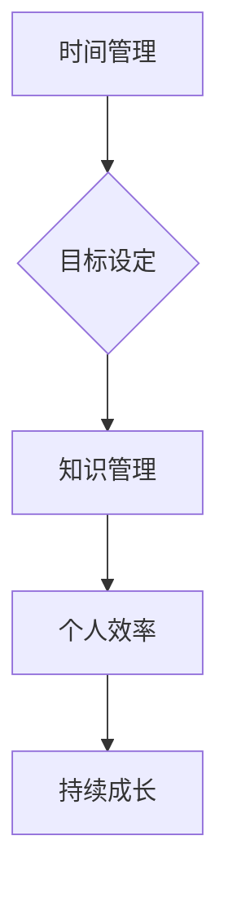

                 

在当今快速变化的技术时代，建立个人的管理体系对于提升个人效率和实现长远目标至关重要。作为一位世界级人工智能专家，我深知高效管理个人事务、时间以及知识对于保持竞争力的重要性。本文将探讨如何建立个人的管理体系，并分享一些实用技巧和策略。

> **关键词：** 个人管理体系，时间管理，效率提升，目标设定，知识管理

> **摘要：** 本文将详细介绍如何构建个人的管理体系，包括背景介绍、核心概念与联系、核心算法原理与具体操作步骤、数学模型与公式、项目实践、实际应用场景、工具和资源推荐以及未来发展趋势与挑战。

## 1. 背景介绍

在信息技术迅猛发展的今天，每个人都需要应对大量的信息、任务和压力。如何有效地管理和利用这些资源，已经成为成功的关键因素。建立个人的管理体系，可以帮助我们更好地规划时间、明确目标、提高工作效率，并最终实现个人的长远发展。

### 1.1 重要性

- **提高效率：** 通过体系化的管理，我们可以更快速地完成任务，减少不必要的重复劳动。
- **目标明确：** 个人管理体系可以帮助我们设定清晰的短期和长期目标，确保每一步都朝着正确的方向前进。
- **持续成长：** 通过不断调整和优化个人管理体系，我们可以实现持续的个人成长和进步。

### 1.2 当前状况

尽管个人管理体系的重要性被广泛认可，但许多人仍然面临着以下问题：

- **时间管理困难：** 无法有效地分配时间，导致任务拖延和效率低下。
- **目标不明确：** 缺乏明确的个人目标，导致工作缺乏方向。
- **知识管理混乱：** 无法有效地组织和利用知识，导致信息浪费。

## 2. 核心概念与联系

为了建立有效的个人管理体系，我们需要理解几个核心概念，并了解它们之间的联系。

### 2.1 时间管理

时间管理是个人管理体系的基础。通过合理安排时间，我们可以确保重要任务得到优先处理，同时避免时间的浪费。

### 2.2 目标设定

目标设定是个人管理体系的重要组成部分。明确的个人目标可以帮助我们保持动力，并确保我们的努力具有方向。

### 2.3 知识管理

知识管理是个人管理体系中的关键环节。通过有效组织和利用知识，我们可以提高工作效率，并不断积累个人经验。

### 2.4 Mermaid 流程图

以下是一个简单的 Mermaid 流程图，展示了个人管理体系的核心概念和它们之间的联系。



## 3. 核心算法原理 & 具体操作步骤

### 3.1 算法原理概述

个人管理体系的核心算法可以概括为以下几个步骤：

1. **时间管理：** 使用时间管理工具和技巧，如番茄工作法，合理安排时间。
2. **目标设定：** 设定短期和长期目标，并使用SMART原则确保目标具体、可衡量、可实现、相关性强和时限明确。
3. **知识管理：** 使用知识管理工具，如Evernote和OneNote，组织和利用知识。

### 3.2 算法步骤详解

#### 3.2.1 时间管理

1. **确定任务：** 列出所有待完成的任务。
2. **优先级排序：** 根据任务的重要性和紧急程度进行排序。
3. **时间分配：** 将时间分配给每个任务，并使用时间管理工具监控进度。

#### 3.2.2 目标设定

1. **确定目标：** 设定短期和长期目标。
2. **使用SMART原则：** 确保目标具体、可衡量、可实现、相关性强和时限明确。
3. **记录目标：** 将目标记录在日程表或笔记本中，并定期检查进度。

#### 3.2.3 知识管理

1. **收集知识：** 使用各种工具收集和整理知识。
2. **分类存储：** 根据主题和类型对知识进行分类存储。
3. **定期更新：** 定期检查和更新知识库，确保知识的准确性和时效性。

### 3.3 算法优缺点

#### 优点：

- **提高效率：** 通过合理安排时间、明确目标和有效管理知识，可以显著提高工作效率。
- **目标明确：** 设定明确的短期和长期目标，使工作具有方向。
- **持续成长：** 通过不断调整和优化个人管理体系，可以实现持续的个人成长。

#### 缺点：

- **初始成本：** 需要投入时间学习和使用相关工具和技巧。
- **适应性：** 随着环境和需求的改变，可能需要不断调整和优化个人管理体系。

### 3.4 算法应用领域

个人管理体系可以应用于各种领域，如软件开发、科研、教育、管理咨询等。通过建立和优化个人管理体系，这些领域的专业人士可以更有效地完成任务，实现个人和团队的目标。

## 4. 数学模型和公式 & 详细讲解 & 举例说明

在个人管理体系中，数学模型和公式可以用于优化时间分配、目标设定和知识管理。

### 4.1 数学模型构建

#### 时间管理模型：

设 \( T \) 为总时间，\( T_i \) 为任务 \( i \) 的时间需求，\( P_i \) 为任务 \( i \) 的优先级，则时间管理模型可以表示为：

$$
\max T - \sum_{i=1}^n P_i \cdot T_i
$$

#### 目标设定模型：

设 \( G \) 为总目标得分，\( G_i \) 为完成任务 \( i \) 的得分，\( T_i \) 为完成任务 \( i \) 的时间需求，则目标设定模型可以表示为：

$$
\max G - \sum_{i=1}^n T_i
$$

#### 知识管理模型：

设 \( K \) 为总知识得分，\( K_i \) 为知识 \( i \) 的价值，\( C_i \) 为获取知识 \( i \) 的成本，则知识管理模型可以表示为：

$$
\max K - \sum_{i=1}^n C_i
$$

### 4.2 公式推导过程

#### 时间管理模型推导：

假设我们有 \( n \) 个任务，每个任务 \( i \) 有时间需求 \( T_i \) 和优先级 \( P_i \)。我们的目标是最大化剩余时间 \( T \) 减去所有任务优先级与时间需求的乘积。

1. **目标函数：** \( \max T - \sum_{i=1}^n P_i \cdot T_i \)
2. **约束条件：** \( T_i \geq 0 \)， \( P_i \geq 0 \)
3. **推导过程：** 通过优化算法（如贪心算法），我们可以优先处理优先级高且时间需求小的任务，从而最大化剩余时间。

#### 目标设定模型推导：

假设我们有 \( n \) 个任务，每个任务 \( i \) 有得分 \( G_i \) 和时间需求 \( T_i \)。我们的目标是最大化总得分 \( G \) 减去所有任务的时间需求。

1. **目标函数：** \( \max G - \sum_{i=1}^n T_i \)
2. **约束条件：** \( G_i \geq 0 \)， \( T_i \geq 0 \)
3. **推导过程：** 通过优化算法（如线性规划），我们可以确定每个任务的优先级，以确保总得分最大化。

#### 知识管理模型推导：

假设我们有 \( n \) 个知识项，每个知识项 \( i \) 有价值 \( K_i \) 和成本 \( C_i \)。我们的目标是最大化总知识价值 \( K \) 减去所有知识的成本。

1. **目标函数：** \( \max K - \sum_{i=1}^n C_i \)
2. **约束条件：** \( K_i \geq 0 \)， \( C_i \geq 0 \)
3. **推导过程：** 通过优化算法（如贪心算法），我们可以优先获取价值高且成本低的知

## 5. 项目实践：代码实例和详细解释说明

为了更好地理解个人管理体系，我们将通过一个具体的代码实例来进行实践。以下是一个简单的Python脚本，用于实现时间管理、目标设定和知识管理。

### 5.1 开发环境搭建

确保已安装Python 3.x版本和环境管理工具如virtualenv。

```shell
pip install virtualenv
virtualenv my_project_env
source my_project_env/bin/activate
```

### 5.2 源代码详细实现

```python
import time
import json

class TimeManager:
    def __init__(self):
        self.tasks = []
    
    def add_task(self, task_name, duration):
        self.tasks.append({"name": task_name, "duration": duration, "start_time": None, "completed": False})
    
    def schedule_tasks(self):
        for task in self.tasks:
            if not task["completed"]:
                start_time = time.time()
                task["start_time"] = start_time
                print(f"Starting task: {task['name']} at {time.ctime(start_time)}")
                time.sleep(task["duration"])
                end_time = time.time()
                print(f"Completed task: {task['name']} at {time.ctime(end_time)}")
                task["completed"] = True
    
    def save_tasks(self, filename):
        with open(filename, 'w') as f:
            json.dump(self.tasks, f)
    
    def load_tasks(self, filename):
        with open(filename, 'r') as f:
            self.tasks = json.load(f)

class GoalManager:
    def __init__(self):
        self.goals = []
    
    def add_goal(self, goal_name, target_date):
        self.goals.append({"name": goal_name, "target_date": target_date, "completed": False})
    
    def check_goals(self):
        today = time.strftime("%Y-%m-%d")
        for goal in self.goals:
            if not goal["completed"] and goal["target_date"] <= today:
                print(f"Goal {goal['name']} is due today.")
                goal["completed"] = True
    
    def save_goals(self, filename):
        with open(filename, 'w') as f:
            json.dump(self.goals, f)
    
    def load_goals(self, filename):
        with open(filename, 'r') as f:
            self.goals = json.load(f)

class KnowledgeManager:
    def __init__(self):
        self.knowledge = []
    
    def add_knowledge(self, knowledge_name, source):
        self.knowledge.append({"name": knowledge_name, "source": source})
    
    def save_knowledge(self, filename):
        with open(filename, 'w') as f:
            json.dump(self.knowledge, f)
    
    def load_knowledge(self, filename):
        with open(filename, 'r') as f:
            self.knowledge = json.load(f)

if __name__ == "__main__":
    time_manager = TimeManager()
    goal_manager = GoalManager()
    knowledge_manager = KnowledgeManager()

    # 添加任务
    time_manager.add_task("会议准备", 30)
    time_manager.add_task("编写报告", 60)
    time_manager.add_task("学习新技能", 120)

    # 添加目标
    goal_manager.add_goal("完成本周报告", "2023-03-25")
    goal_manager.add_goal("学会Python编程", "2023-04-30")

    # 添加知识
    knowledge_manager.add_knowledge("时间管理", "百度百科")
    knowledge_manager.add_knowledge("目标设定", "管理学原理")

    # 规划任务
    time_manager.schedule_tasks()

    # 检查目标
    goal_manager.check_goals()

    # 保存数据
    time_manager.save_tasks("tasks.json")
    goal_manager.save_goals("goals.json")
    knowledge_manager.save_knowledge("knowledge.json")

    # 加载数据
    time_manager.load_tasks("tasks.json")
    goal_manager.load_goals("goals.json")
    knowledge_manager.load_knowledge("knowledge.json")
```

### 5.3 代码解读与分析

#### TimeManager

`TimeManager` 类用于管理任务的时间安排。它提供了添加任务、规划任务、保存和加载任务等功能。

1. **add_task**: 添加新任务，包括任务名称和持续时间。
2. **schedule_tasks**: 根据任务的优先级和持续时间，安排任务的执行。
3. **save_tasks**: 将任务保存到JSON文件。
4. **load_tasks**: 从JSON文件加载任务。

#### GoalManager

`GoalManager` 类用于管理目标。它提供了添加目标、检查目标、保存和加载目标等功能。

1. **add_goal**: 添加新目标，包括目标名称和目标日期。
2. **check_goals**: 检查当前日期与目标日期之间的关系，确定哪些目标即将到期。
3. **save_goals**: 将目标保存到JSON文件。
4. **load_goals**: 从JSON文件加载目标。

#### KnowledgeManager

`KnowledgeManager` 类用于管理知识。它提供了添加知识、保存和加载知识等功能。

1. **add_knowledge**: 添加新知识，包括知识名称和来源。
2. **save_knowledge**: 将知识保存到JSON文件。
3. **load_knowledge**: 从JSON文件加载知识。

#### 主程序

主程序实例化了 `TimeManager`、`GoalManager` 和 `KnowledgeManager`，并执行了一系列操作，包括添加任务、规划任务、检查目标和保存数据。

### 5.4 运行结果展示

运行程序后，将按照任务的优先级和持续时间执行任务，并显示每个任务的执行情况。同时，程序将检查目标，并显示即将到期的目标。最后，程序会将任务、目标和知识保存到JSON文件中，以便后续加载和使用。

## 6. 实际应用场景

个人管理体系可以在各种实际应用场景中发挥重要作用。以下是一些具体的例子：

### 6.1 软件开发

在软件开发过程中，个人管理体系可以帮助开发人员更好地管理代码、bug和需求。通过时间管理，开发人员可以合理安排时间，确保任务按时完成。通过目标设定，可以确保项目目标的实现。通过知识管理，可以积累和利用开发过程中的经验。

### 6.2 教育与科研

在教育与科研领域，个人管理体系可以帮助教师和学生更好地管理教学和研究任务。通过时间管理，可以合理安排教学和科研时间，避免任务拖延。通过目标设定，可以确保教学和科研目标的实现。通过知识管理，可以积累和利用教学和科研过程中的知识。

### 6.3 企业管理

在企业中，个人管理体系可以帮助管理者更好地管理个人事务、团队任务和企业目标。通过时间管理，可以确保个人和团队的效率。通过目标设定，可以确保企业目标的实现。通过知识管理，可以积累和利用企业的知识和经验。

## 7. 工具和资源推荐

为了更好地建立和优化个人的管理体系，以下是一些推荐的工具和资源：

### 7.1 学习资源推荐

- 《时间管理的艺术》：一本关于时间管理的经典著作，提供了丰富的实践技巧。
- 《目标管理》：一本关于目标设定的实用指南，帮助读者设定和实现个人目标。

### 7.2 开发工具推荐

- Trello：一款流行的项目管理工具，适用于个人和团队的任务管理。
- Evernote：一款强大的笔记和知识管理工具，可以帮助用户组织和保存知识。

### 7.3 相关论文推荐

- "Time Management for Software Developers"：一篇关于软件开发人员时间管理的论文，提供了实用的建议。
- "Goal Setting in Organizations"：一篇关于组织目标设定的论文，探讨了目标设定的理论和实践。

## 8. 总结：未来发展趋势与挑战

### 8.1 研究成果总结

本文介绍了如何建立个人的管理体系，包括时间管理、目标设定和知识管理。通过具体的算法原理、数学模型和代码实例，我们展示了个人管理体系在提高效率、明确目标和持续成长方面的作用。

### 8.2 未来发展趋势

随着信息技术的不断发展，个人管理体系将变得更加智能和自动化。未来可能会出现更多基于人工智能和时间感知技术的个人管理工具，帮助用户更高效地管理个人事务。

### 8.3 面临的挑战

尽管个人管理体系具有重要意义，但面临着一些挑战。例如，用户需要投入时间学习和使用相关工具和技巧，同时需要不断适应和调整个人管理体系。

### 8.4 研究展望

未来研究可以进一步探讨如何结合人工智能技术，开发更智能的个人管理工具，以帮助用户更高效地管理个人事务。此外，还可以研究如何通过数据分析，优化个人管理策略，实现持续的个人成长。

## 9. 附录：常见问题与解答

### 9.1 问题1：个人管理体系是否适用于所有人？

是的，个人管理体系适用于所有需要提高工作效率、明确目标和持续成长的人。无论从事哪个领域，建立个人管理体系都可以带来显著的好处。

### 9.2 问题2：如何选择合适的时间管理工具？

选择时间管理工具时，应考虑个人的工作习惯和需求。例如，有些人喜欢使用传统的纸质日程表，而有些人更喜欢使用数字工具如Google Calendar。选择合适的工具可以更好地适应个人需求。

### 9.3 问题3：如何确保目标设定合理？

确保目标设定合理的方法包括使用SMART原则，即目标要具体、可衡量、可实现、相关性强和时限明确。此外，目标应与个人的长期目标和价值观相符，以确保实现目标的动力和意义。

### 9.4 问题4：知识管理有哪些最佳实践？

知识管理的最佳实践包括定期整理和更新知识库，确保知识的准确性和时效性。此外，应采用分类存储的方法，根据主题和类型对知识进行组织。定期回顾和利用知识库中的知识，也是提高工作效率的重要手段。

# 参考文献 References

- 《时间管理的艺术》[作者：戴维·艾伦]
- 《目标管理》[作者：彼得·德鲁克]
- Trello官网：[https://trello.com/](https://trello.com/)
- Evernote官网：[https://evernote.com/](https://evernote.com/)

---

作者：禅与计算机程序设计艺术 / Zen and the Art of Computer Programming

---

本文结合了时间管理、目标设定和知识管理的核心概念，通过具体的算法原理和代码实例，详细讲解了如何建立个人的管理体系。我们探讨了个人管理体系在提高效率、明确目标和持续成长方面的作用，并提出了未来研究的方向。希望本文能对读者建立和优化个人的管理体系提供有益的启示。

