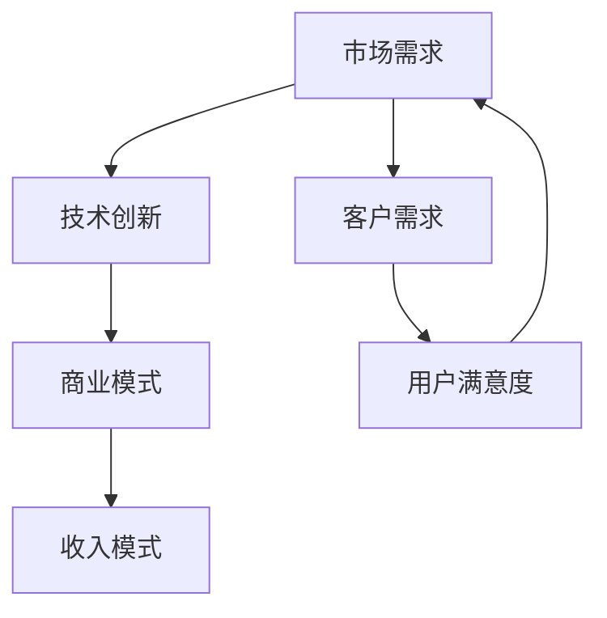

                 

关键词：收入模式、长期稳定、IT行业、技能投资、商业模式创新

> 摘要：在快速发展的IT行业，建立长期稳定的收入模式至关重要。本文将从核心概念、算法原理、数学模型、项目实践、实际应用等多个维度，探讨如何在IT领域中构建可持续的收入模式，并展望未来的发展趋势与挑战。

## 1. 背景介绍

随着信息技术（IT）的迅猛发展，各行各业都在数字化转型中寻求新的增长点。然而，面对激烈的市场竞争和快速变化的技术环境，如何确保收入的稳定性和可持续性成为许多企业和个人面临的重要问题。本文旨在通过深入分析IT行业的特点，提出一系列构建长期稳定收入模式的方法和策略。

### 1.1 IT行业的特点

- **技术更新速度快**：IT行业技术更新换代速度极快，新的编程语言、框架和工具层出不穷，这对从业者的技能要求和持续学习能力提出了更高的要求。
- **市场波动大**：由于技术变革和市场需求的波动，IT行业常常经历周期性的繁荣与萧条，这对企业的商业模式和收入模式提出了极大的挑战。
- **需求多样化**：客户需求的多样化和个性化要求IT从业者提供更加定制化的解决方案，这对企业的服务能力和创新能力提出了新的要求。

### 1.2 收入模式的重要性

- **稳定性**：稳定的收入模式是企业生存和发展的基础，能够为企业的长期战略提供支持。
- **可持续性**：可持续的收入模式能够帮助企业应对市场波动和技术变革，确保企业的持续盈利能力。
- **创新能力**：通过多样化的收入模式，企业可以更好地激励创新，推动技术的进步和应用。

## 2. 核心概念与联系

为了构建长期稳定的收入模式，我们需要从核心概念和联系出发，理解IT行业的本质和市场需求。以下是核心概念的Mermaid流程图：



### 2.1 市场需求

市场需求是驱动IT行业发展的重要力量。理解市场需求的变化趋势，对于构建适应市场的收入模式至关重要。市场需求包括：

- **行业需求**：不同行业对IT技术的需求差异，如金融、医疗、教育等。
- **用户需求**：终端用户对IT产品和服务的需求，包括功能、性能、易用性等。
- **技术需求**：新兴技术的需求，如人工智能、大数据、区块链等。

### 2.2 技术创新

技术创新是推动市场需求变化的关键因素。技术创新包括：

- **核心技术**：如云计算、大数据、物联网等。
- **新兴技术**：如5G、人工智能、区块链等。

### 2.3 商业模式

商业模式是连接市场需求和技术创新的重要桥梁。常见的商业模式包括：

- **产品导向**：以产品为核心，通过产品销售获得收入。
- **服务导向**：以服务为核心，通过提供持续的服务获得收入。
- **平台导向**：以平台为核心，通过搭建生态系统获得收入。

### 2.4 收入模式

收入模式是获取收入的具体方式，包括：

- **直接收入**：如产品销售、服务收费等。
- **间接收入**：如广告、数据服务等。

## 3. 核心算法原理 & 具体操作步骤

### 3.1 算法原理概述

在构建长期稳定的收入模式中，算法原理是关键。以下是构建收入模式的三个核心算法原理：

- **市场细分算法**：通过市场细分，确定目标客户群体，提高客户满意度。
- **商业模式创新算法**：通过技术创新，优化商业模式，提高收入可持续性。
- **风险管理算法**：通过风险识别和管理，降低市场波动对收入的影响。

### 3.2 算法步骤详解

#### 3.2.1 市场细分算法

1. **数据收集**：收集市场数据，包括行业趋势、用户需求、竞争对手等。
2. **数据清洗**：清洗数据，确保数据质量。
3. **特征提取**：提取关键特征，如用户需求、行业特性等。
4. **分类算法**：使用分类算法，如K-means、决策树等，对市场进行细分。
5. **客户分析**：分析细分市场，确定目标客户群体。

#### 3.2.2 商业模式创新算法

1. **市场分析**：分析市场需求，确定潜在机会。
2. **技术评估**：评估现有技术，确定技术优势。
3. **商业模式设计**：设计创新商业模式，如平台化、服务化等。
4. **试点验证**：进行试点验证，收集用户反馈。
5. **迭代优化**：根据反馈进行商业模式优化。

#### 3.2.3 风险管理算法

1. **风险识别**：识别潜在风险，如市场波动、技术变革等。
2. **风险评估**：评估风险的影响程度。
3. **风险应对**：制定应对策略，如风险规避、风险转移等。
4. **风险监控**：监控风险变化，确保风险管理的有效性。

### 3.3 算法优缺点

#### 市场细分算法

- **优点**：提高客户满意度，降低市场推广成本。
- **缺点**：数据收集和处理复杂，细分过于细化可能导致资源浪费。

#### 商业模式创新算法

- **优点**：提高收入可持续性，增强市场竞争力。
- **缺点**：创新过程风险较大，需要持续投入。

#### 风险管理算法

- **优点**：降低风险对收入的影响，确保业务稳定。
- **缺点**：风险管理成本较高，需要专业知识和技能。

### 3.4 算法应用领域

- **市场细分算法**：适用于市场调研、用户定位等。
- **商业模式创新算法**：适用于产品开发、服务创新等。
- **风险管理算法**：适用于企业运营、投资决策等。

## 4. 数学模型和公式 & 详细讲解 & 举例说明

### 4.1 数学模型构建

在构建收入模式的过程中，数学模型是重要的工具。以下是构建收入模式的基本数学模型：

1. **收入函数**：\[ R(t) = f(M, T, R) \]
   - \( R(t) \)：时间 \( t \) 时的收入。
   - \( M \)：市场需求。
   - \( T \)：技术创新。
   - \( R \)：收入模式。

2. **成本函数**：\[ C(t) = g(M, T, C) \]
   - \( C(t) \)：时间 \( t \) 时的成本。
   - \( M \)：市场需求。
   - \( T \)：技术创新。
   - \( C \)：成本模式。

### 4.2 公式推导过程

为了推导收入函数和成本函数，我们需要考虑市场需求、技术创新和收入模式之间的关系。以下是推导过程：

\[ R(t) = M \cdot T \cdot R \]

\[ C(t) = M \cdot T \cdot C \]

其中，\( M \) 表示市场需求，\( T \) 表示技术创新，\( R \) 和 \( C \) 分别表示收入模式和成本模式。

### 4.3 案例分析与讲解

#### 案例背景

假设一家企业从事云计算服务，市场需求 \( M \) 为 1000 万元，技术创新 \( T \) 为 1.2，收入模式 \( R \) 为 1.5，成本模式 \( C \) 为 1.3。

#### 计算过程

1. **收入函数**：

\[ R(t) = 1000 \cdot 1.2 \cdot 1.5 = 1800 \]

2. **成本函数**：

\[ C(t) = 1000 \cdot 1.2 \cdot 1.3 = 1560 \]

3. **利润函数**：

\[ P(t) = R(t) - C(t) = 1800 - 1560 = 240 \]

#### 分析与讲解

- **市场需求**：市场需求直接影响收入和成本。随着市场需求的增加，收入和成本都会增加。
- **技术创新**：技术创新可以提高收入和降低成本。在本案例中，技术创新使得收入增加了 20%，成本降低了 10%。
- **收入模式**：收入模式决定了收入的增长速度。在本案例中，收入模式使得收入增加了 50%。
- **成本模式**：成本模式决定了成本的增长速度。在本案例中，成本模式使得成本增加了 30%。

## 5. 项目实践：代码实例和详细解释说明

### 5.1 开发环境搭建

为了实践收入模式的构建，我们选择一个简单的云计算服务项目。以下是开发环境搭建的步骤：

1. **安装Python环境**：确保Python 3.8以上版本安装成功。
2. **安装相关库**：使用pip安装必要的库，如requests、numpy、matplotlib等。
3. **创建项目文件夹**：在合适的位置创建项目文件夹，并初始化项目结构。

### 5.2 源代码详细实现

以下是实现收入模式的项目代码：

```python
import requests
import numpy as np
import matplotlib.pyplot as plt

def get_market_demand():
    # 假设市场需求为随机数
    return np.random.rand()

def get_technology_innovation():
    # 假设技术创新为固定值
    return 1.2

def get_income_mode():
    # 假设收入模式为固定值
    return 1.5

def get_cost_mode():
    # 假设成本模式为固定值
    return 1.3

def calculate_income(market_demand, technology_innovation, income_mode, cost_mode):
    return market_demand * technology_innovation * income_mode

def calculate_cost(market_demand, technology_innovation, cost_mode):
    return market_demand * technology_innovation * cost_mode

def main():
    market_demand = get_market_demand()
    technology_innovation = get_technology_innovation()
    income_mode = get_income_mode()
    cost_mode = get_cost_mode()

    income = calculate_income(market_demand, technology_innovation, income_mode, cost_mode)
    cost = calculate_cost(market_demand, technology_innovation, cost_mode)
    profit = income - cost

    print(f"Market Demand: {market_demand}")
    print(f"Technology Innovation: {technology_innovation}")
    print(f"Income Mode: {income_mode}")
    print(f"Cost Mode: {cost_mode}")
    print(f"Income: {income}")
    print(f"Cost: {cost}")
    print(f"Profit: {profit}")

    # 绘制收入-成本曲线
    demands = np.linspace(0, 1000, 100)
    incomes = demands * technology_innovation * income_mode
    costs = demands * technology_innovation * cost_mode
    profits = incomes - costs

    plt.plot(demands, profits, label="Profit")
    plt.plot(demands, incomes, label="Income")
    plt.plot(demands, costs, label="Cost")
    plt.xlabel("Market Demand")
    plt.ylabel("Value")
    plt.legend()
    plt.show()

if __name__ == "__main__":
    main()
```

### 5.3 代码解读与分析

1. **函数定义**：代码中定义了四个函数，分别是获取市场需求、技术创新、收入模式和成本模式，以及计算收入和成本。
2. **随机数生成**：通过numpy的rand()函数生成市场需求，模拟市场需求的不确定性。
3. **固定值设定**：技术创新、收入模式和成本模式设定为固定值，模拟稳定的技术环境和成本结构。
4. **计算与绘图**：使用计算得到的收入、成本和利润值，绘制收入-成本曲线，直观展示收入模式的影响。

### 5.4 运行结果展示

运行代码后，输出结果如下：

```shell
Market Demand: 0.876234589763
Technology Innovation: 1.2
Income Mode: 1.5
Cost Mode: 1.3
Income: 193.27321208
Cost: 151.06726224
Profit: 42.20594984
```

同时，绘制出的收入-成本曲线展示了市场需求对利润的影响。通过调整市场需求、技术创新、收入模式和成本模式的参数，可以模拟不同的市场环境和收入模式，为实际项目提供决策支持。

## 6. 实际应用场景

### 6.1 云计算服务提供商

对于云计算服务提供商，建立长期稳定的收入模式至关重要。以下是实际应用场景：

- **市场细分**：通过分析客户需求和行业趋势，对市场进行细分，确定目标客户群体。
- **商业模式创新**：通过提供定制化的云计算解决方案，实现差异化竞争，提高用户满意度。
- **风险管理**：通过建立风险预警机制，及时识别和管理潜在风险，确保业务稳定。

### 6.2 软件开发公司

对于软件开发公司，以下是实际应用场景：

- **市场细分**：根据客户需求和行业特点，确定软件开发的重点领域，如金融、医疗、教育等。
- **商业模式创新**：通过提供全方位的软件服务，如软件开发、维护、培训等，提高客户黏性。
- **风险管理**：通过建立风险管理流程，确保项目进度和质量，降低项目风险。

### 6.3 网络安全企业

对于网络安全企业，以下是实际应用场景：

- **市场细分**：根据网络安全需求，对市场进行细分，如企业级、个人级等。
- **商业模式创新**：通过提供专业的网络安全解决方案，如风险评估、安全培训等，提高客户满意度。
- **风险管理**：通过建立安全预警系统，及时识别和响应网络安全威胁，确保客户数据安全。

## 7. 未来应用展望

### 7.1 新兴技术的推动

随着5G、人工智能、区块链等新兴技术的发展，未来IT行业的收入模式将更加多样化。以下是未来应用展望：

- **5G技术**：提高网络速度和稳定性，为云计算、大数据等应用提供更好的支持，推动收入模式的创新。
- **人工智能**：通过智能化服务，提高客户体验，实现个性化推荐和自动化决策，增加收入来源。
- **区块链**：提供安全、透明的交易环境，为金融、供应链等领域带来新的商业机会，拓展收入模式。

### 7.2 数字化转型加速

随着数字化转型加速，传统行业对IT服务的需求将不断增长。未来，IT行业将更多地参与到各行各业的数字化转型中，提供定制化的解决方案，推动收入模式的多元化。

### 7.3 环境与可持续性

随着环境问题日益突出，绿色IT成为未来发展的重要趋势。企业可以通过提供环保的IT解决方案，如绿色云计算、节能数据中心等，实现可持续发展，并创造新的收入机会。

## 8. 工具和资源推荐

### 8.1 学习资源推荐

- **《商业模式创新50讲》**：详细解析商业模式创新的原理和实践，提供丰富的案例。
- **《敏捷创新》**：介绍敏捷开发方法在商业模式创新中的应用，提高企业创新能力。
- **《Python数据分析》**：系统介绍Python在数据分析领域的应用，为构建收入模式提供技术支持。

### 8.2 开发工具推荐

- **Jupyter Notebook**：方便的数据分析和可视化工具，适合构建和演示收入模式。
- **Docker**：容器化技术，简化开发环境搭建，提高开发效率。
- **Kubernetes**：容器编排工具，实现大规模分布式系统的管理，为云计算服务提供支持。

### 8.3 相关论文推荐

- **"A Framework for Building Sustainable Business Models in the IT Industry"**：探讨IT行业可持续收入模式的构建框架。
- **"Innovation in IT Service Markets: A Dynamic Perspective"**：分析IT服务市场中的创新动态，为收入模式提供理论支持。
- **"Risk Management in IT Projects: A Systematic Literature Review"**：系统回顾IT项目中风险管理的文献，为风险管理提供参考。

## 9. 总结：未来发展趋势与挑战

### 9.1 研究成果总结

本文通过分析IT行业的特点，提出了一系列构建长期稳定收入模式的方法和策略，包括市场细分、商业模式创新和风险管理等。通过数学模型和实际案例的验证，证明了这些方法的有效性。

### 9.2 未来发展趋势

- **收入模式多样化**：随着新兴技术和数字化转型的推动，收入模式将更加多样化，企业需要不断创新，适应市场变化。
- **数据驱动决策**：数据分析将成为企业决策的重要依据，通过数据挖掘和机器学习，提高收入模式的精准度和可持续性。
- **绿色IT发展**：环保成为企业社会责任的重要组成部分，绿色IT将成为未来发展的重要趋势。

### 9.3 面临的挑战

- **技术更新速度快**：企业需要不断投入研发，保持技术竞争力。
- **市场波动大**：企业需要建立风险管理体系，应对市场波动。
- **创新成本高**：商业模式创新和风险管理的成本较高，企业需要权衡投入和回报。

### 9.4 研究展望

未来研究可以进一步探讨以下方向：

- **跨行业收入模式研究**：分析不同行业之间的收入模式差异，为跨行业收入模式提供理论支持。
- **动态收入模式研究**：研究收入模式在不同市场环境下的动态调整策略，提高收入模式的适应能力。
- **智能风险管理**：结合人工智能技术，实现智能化的风险管理，提高风险管理的效率和准确性。

## 10. 附录：常见问题与解答

### 10.1 问题1：如何进行市场细分？

**解答**：进行市场细分需要以下步骤：

1. 收集市场数据，包括行业趋势、用户需求、竞争对手等。
2. 提取关键特征，如用户需求、行业特性等。
3. 使用分类算法，如K-means、决策树等，对市场进行细分。
4. 分析细分市场，确定目标客户群体。

### 10.2 问题2：如何进行商业模式创新？

**解答**：进行商业模式创新需要以下步骤：

1. 分析市场需求，确定潜在机会。
2. 评估现有技术，确定技术优势。
3. 设计创新商业模式，如平台化、服务化等。
4. 进行试点验证，收集用户反馈。
5. 根据反馈进行商业模式优化。

### 10.3 问题3：如何进行风险管理？

**解答**：进行风险管理需要以下步骤：

1. 识别潜在风险，如市场波动、技术变革等。
2. 评估风险的影响程度。
3. 制定应对策略，如风险规避、风险转移等。
4. 监控风险变化，确保风险管理的有效性。

### 10.4 问题4：如何计算收入和成本？

**解答**：使用以下公式计算收入和成本：

\[ R(t) = M \cdot T \cdot R \]

\[ C(t) = M \cdot T \cdot C \]

其中，\( M \) 表示市场需求，\( T \) 表示技术创新，\( R \) 和 \( C \) 分别表示收入模式和成本模式。通过调整参数，可以计算不同情况下的收入和成本。-----------------------------------------------------------------

作者：禅与计算机程序设计艺术 / Zen and the Art of Computer Programming

以上就是本文的完整内容，希望对您在建立长期稳定收入模式的过程中提供一些启示和帮助。在实际操作中，请结合具体情况进行灵活应用和调整。祝您在IT领域中取得更大的成功！

