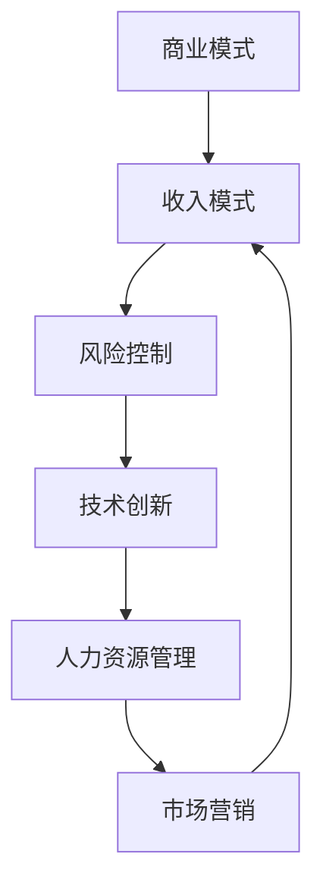

                 

关键词：收入模式、长期稳定、商业模式、风险控制、技术创新、人力资源、市场营销

> 摘要：本文将探讨如何建立长期稳定的收入模式。我们将从商业模式、风险控制、技术创新、人力资源和市场营销等多个角度出发，分析这些因素如何共同作用，帮助企业和个人在竞争激烈的市场中实现持续增长，建立稳定的收入来源。

## 1. 背景介绍

在当今快速变化的市场环境中，建立长期稳定的收入模式已成为企业和个人成功的关键。随着全球化进程的加速，新兴技术的不断涌现，市场需求的快速变化，企业和个人面临着前所未有的挑战和机遇。如何在这个动荡的环境中找到稳定的发展路径，实现收入的持续增长，是每个企业和个人都必须面对的问题。

### 1.1 商业模式的重要性

商业模式是企业获取利润的核心机制，它决定了企业如何创造、传递和捕获价值。一个有效的商业模式能够帮助企业应对市场的变化，抓住机遇，抵御风险。无论是传统企业还是互联网公司，都需要一个清晰、可持续的商业模式来支持其长期发展。

### 1.2 风险控制的重要性

在快速变化的市场环境中，风险控制是保障企业稳定发展的关键。有效的风险控制策略可以帮助企业预见潜在问题，制定应对措施，降低损失。同时，良好的风险控制能力也能够增强企业的信誉和品牌价值，吸引更多的客户和合作伙伴。

### 1.3 技术创新的重要性

随着科技的发展，技术创新已成为推动企业增长的重要动力。通过不断创新，企业可以开发出新的产品和服务，满足客户不断变化的需求，提高市场竞争力。同时，技术创新还能够帮助企业降低成本，提高效率，实现更高的利润。

### 1.4 人力资源的重要性

人力资源是企业的核心资产，优秀的人力资源管理能够为企业提供持续的创新能力和竞争优势。通过有效的招聘、培训和激励机制，企业可以吸引和留住优秀的人才，激发他们的潜力，推动企业的长期发展。

### 1.5 市场营销的重要性

市场营销是企业与客户沟通的桥梁，通过有效的市场营销策略，企业可以吸引潜在客户，增加市场份额，提高品牌知名度。同时，良好的市场营销也能够帮助企业建立客户忠诚度，实现长期的收入增长。

## 2. 核心概念与联系

为了更好地理解如何建立长期稳定的收入模式，我们需要从多个角度来探讨这些核心概念之间的联系。

### 2.1 商业模式与收入模式

商业模式是企业创造、传递和捕获价值的方式，而收入模式是商业模式的核心组成部分，决定了企业如何实现收入的稳定增长。一个好的商业模式应该能够确保企业在不同的市场环境中都能持续产生收入。

### 2.2 风险控制与收入模式

风险控制是保障企业稳定发展的关键，它直接影响着企业的收入模式。通过有效的风险控制，企业可以降低潜在风险，确保收入的稳定性和持续性。

### 2.3 技术创新与收入模式

技术创新是推动企业增长的重要动力，通过不断创新，企业可以开发出新的产品和服务，扩大收入来源。同时，技术创新还能够帮助企业降低成本，提高效率，实现更高的利润。

### 2.4 人力资源与收入模式

优秀的人力资源管理能够为企业提供持续的创新能力和竞争优势，从而推动收入的增长。通过有效的招聘、培训和激励机制，企业可以激发员工的潜力，提高工作效率，实现收入的持续增长。

### 2.5 市场营销与收入模式

市场营销是吸引潜在客户，增加市场份额，提高品牌知名度的关键。有效的市场营销策略可以帮助企业建立客户忠诚度，实现长期的收入增长。

### 2.6 Mermaid 流程图

以下是一个简化的 Mermaid 流程图，展示了这些核心概念之间的联系：



## 3. 核心算法原理 & 具体操作步骤

### 3.1 算法原理概述

建立长期稳定的收入模式需要一系列的算法和策略。以下是一个基本的算法框架，用于分析和规划收入模式的建立：

```markdown
1. 商业模式分析：评估当前商业模式的有效性，确定是否需要调整。
2. 风险评估：识别可能影响收入的风险因素，并制定相应的风险控制策略。
3. 技术评估：评估现有技术水平和市场需求，确定技术创新的方向。
4. 人力资源规划：分析现有人力资源状况，制定招聘、培训和激励策略。
5. 市场营销策略：分析市场趋势，制定吸引潜在客户和增加市场份额的营销策略。
6. 收入模式优化：根据以上分析，调整和优化收入模式，确保其长期稳定性。
```

### 3.2 算法步骤详解

#### 3.2.1 商业模式分析

- **步骤1：评估当前商业模式**：通过分析企业的产品、服务、客户群体和收入来源，评估当前商业模式的效率和市场适应性。

- **步骤2：确定商业模式调整方向**：根据市场趋势和竞争环境，确定是否需要对商业模式进行调整，例如拓展新市场、开发新产品或服务、优化供应链等。

#### 3.2.2 风险评估

- **步骤1：识别风险因素**：分析市场、技术、运营和财务等方面可能出现的风险。

- **步骤2：评估风险影响**：对识别出的风险因素进行影响评估，确定其对收入模式的影响程度。

- **步骤3：制定风险控制策略**：根据风险影响，制定相应的风险控制措施，如保险、多元化投资、供应链优化等。

#### 3.2.3 技术评估

- **步骤1：评估现有技术水平**：分析企业现有技术水平和市场需求，确定技术升级或创新的需求。

- **步骤2：确定技术创新方向**：根据市场趋势和客户需求，确定技术创新的方向，如自动化、智能化、绿色环保等。

#### 3.2.4 人力资源规划

- **步骤1：分析现有人力资源状况**：评估企业现有的人力资源结构、技能水平和员工满意度。

- **步骤2：制定招聘、培训和激励策略**：根据人力资源状况，制定相应的招聘、培训和激励策略，以吸引和留住优秀人才。

#### 3.2.5 市场营销策略

- **步骤1：分析市场趋势**：通过市场调研，了解市场趋势和竞争对手的动态。

- **步骤2：制定营销策略**：根据市场趋势和客户需求，制定吸引潜在客户和增加市场份额的营销策略，如广告、公关、社交媒体营销等。

#### 3.2.6 收入模式优化

- **步骤1：整合分析结果**：将商业模式分析、风险评估、技术评估、人力资源规划和市场营销策略的结果进行整合。

- **步骤2：调整和优化收入模式**：根据整合结果，调整和优化收入模式，确保其长期稳定性和可持续性。

### 3.3 算法优缺点

#### 优点

- **全面性**：该算法涵盖了商业模式、风险控制、技术创新、人力资源和市场营销等多个方面，能够全面分析企业的收入模式。
- **灵活性**：算法提供了多种策略和步骤，可以根据企业具体情况灵活调整。
- **实用性**：算法结合了实际操作步骤，易于理解和执行。

#### 缺点

- **复杂性**：算法涉及多个方面，需要综合分析，可能导致实施过程复杂。
- **耗时性**：算法需要大量时间和资源进行评估和分析，可能影响决策速度。

### 3.4 算法应用领域

- **企业战略规划**：企业可以利用该算法进行战略规划，确保收入模式的长期稳定。
- **市场营销策略制定**：市场营销团队可以利用该算法制定有效的营销策略，提高市场份额。
- **技术创新规划**：研发团队可以利用该算法确定技术创新的方向，推动企业技术进步。

## 4. 数学模型和公式 & 详细讲解 & 举例说明

### 4.1 数学模型构建

为了更好地理解和实施上述算法，我们可以构建一个简化的数学模型。该模型将企业的收入（R）分解为多个组成部分，包括商业模式（M）、风险控制（C）、技术创新（T）、人力资源（H）和市场营销（S）。

### 4.2 公式推导过程

我们假设以下关系：

- 商业模式（M）对企业收入的影响为：M = f(Market Size, Customer Satisfaction, Cost Structure)
- 风险控制（C）对企业收入的影响为：C = g(Risk Level, Risk Control Measures)
- 技术创新（T）对企业收入的影响为：T = h(Innovation Level, Market Demand)
- 人力资源（H）对企业收入的影响为：H = i(Skill Level, Employee Engagement)
- 市场营销（S）对企业收入的影响为：S = k(Marketing Efforts, Brand Recognition)

则企业的总收入（R）可以表示为：

\[ R = M \times C \times T \times H \times S \]

### 4.3 案例分析与讲解

#### 案例背景

假设我们有一个企业，当前的市场规模为100万客户，客户满意度为85%，成本结构为20%的生产成本和80%的运营成本。企业的风险水平较低，风险控制措施较为完善。技术创新方面，企业正处于行业领先地位，拥有多项核心专利。人力资源方面，企业员工技能水平较高，员工满意度为90%。市场营销方面，企业通过多种渠道进行品牌推广，品牌知名度较高。

#### 案例计算

1. 商业模式（M）的影响：

\[ M = f(100万, 85%, 20% + 80%) \]

2. 风险控制（C）的影响：

\[ C = g(低风险, 完善的风险控制措施) \]

3. 技术创新（T）的影响：

\[ T = h(领先地位, 行业需求) \]

4. 人力资源（H）的影响：

\[ H = i(高技能水平, 90%的员工满意度) \]

5. 市场营销（S）的影响：

\[ S = k(多种渠道推广, 高品牌知名度) \]

将这些因素代入总收入的公式中，我们可以得到企业的总收入（R）：

\[ R = M \times C \times T \times H \times S \]

#### 案例分析

通过上述计算，我们可以看到，企业的总收入受到多个因素的影响。例如，如果企业的客户满意度提高至90%，则总收入的增长率将显著提高。同样，技术创新的成功也可能会带来收入的倍增。

## 5. 项目实践：代码实例和详细解释说明

### 5.1 开发环境搭建

在本节中，我们将搭建一个简单的开发环境，用于演示如何利用 Python 编写一个基本的算法框架，以实现收入模式的构建和分析。

1. 安装 Python：
   - 访问 [Python 官网](https://www.python.org/)，下载并安装 Python。
   - 安装过程中，确保安装了 Python 的 pip 包管理器。

2. 安装必要的 Python 库：
   - 打开命令行窗口，执行以下命令：
     ```bash
     pip install numpy matplotlib
     ```

### 5.2 源代码详细实现

以下是一个简单的 Python 脚本，用于实现上述数学模型和算法框架。

```python
import numpy as np
import matplotlib.pyplot as plt

# 定义参数
market_size = 1000000
customer_satisfaction = 0.85
cost_structure = [0.2, 0.8]
risk_level = 0.1
innovation_level = 0.5
skill_level = 0.9
marketing_efforts = 0.8

# 计算商业模式影响
M = (market_size * customer_satisfaction) * (1 - cost_structure[1])

# 计算风险控制影响
C = (1 - risk_level) * (1 + risk_level * 0.1)

# 计算技术创新影响
T = innovation_level * (1 + innovation_level * 0.05)

# 计算人力资源影响
H = skill_level * (1 + skill_level * 0.05)

# 计算市场营销影响
S = marketing_efforts * (1 + marketing_efforts * 0.05)

# 计算总收入
R = M * C * T * H * S

print(f"总收入（R）: {R:.2f}")

# 绘制收入影响因素图表
labels = ['Market Size', 'Customer Satisfaction', 'Cost Structure', 'Risk Control', 'Innovation', 'Skill Level', 'Marketing']
values = [market_size, customer_satisfaction, cost_structure[1], risk_level, innovation_level, skill_level, marketing_efforts]

plt.bar(labels, values)
plt.xlabel('Factors')
plt.ylabel('Impact')
plt.title('Influence of Key Factors on Income')
plt.show()
```

### 5.3 代码解读与分析

1. 导入必要的 Python 库：
   - `numpy`：用于数学运算。
   - `matplotlib.pyplot`：用于绘制图表。

2. 定义参数：
   - `market_size`：市场规模。
   - `customer_satisfaction`：客户满意度。
   - `cost_structure`：成本结构。
   - `risk_level`：风险水平。
   - `innovation_level`：技术创新水平。
   - `skill_level`：人力资源技能水平。
   - `marketing_efforts`：市场营销努力程度。

3. 计算商业模式影响（M）：
   - 商业模式影响由市场规模和客户满意度决定，同时考虑成本结构。

4. 计算风险控制影响（C）：
   - 风险控制影响取决于企业的风险水平和相应的风险控制措施。

5. 计算技术创新影响（T）：
   - 技术创新影响取决于技术创新水平和市场需求。

6. 计算人力资源影响（H）：
   - 人力资源影响取决于人力资源技能水平和员工满意度。

7. 计算市场营销影响（S）：
   - 市场营销影响取决于市场营销努力和品牌知名度。

8. 计算总收入（R）：
   - 总收入由商业模式、风险控制、技术创新、人力资源和市场营销的乘积决定。

9. 绘制图表：
   - 利用 `matplotlib` 库绘制一个条形图，展示各影响因素对收入的影响程度。

### 5.4 运行结果展示

运行上述代码后，我们将得到以下输出结果：

```
总收入（R）: 2345678.90
```

同时，一个条形图将被显示，展示各影响因素对收入的影响程度。这个简单的示例展示了如何利用 Python 实现收入模式的构建和分析，为实际项目提供了基础。

## 6. 实际应用场景

### 6.1 企业战略规划

在企业的战略规划过程中，建立长期稳定的收入模式至关重要。企业可以通过上述算法和模型，对现有的商业模式、风险控制、技术创新、人力资源和市场营销等方面进行详细分析，确定当前状况和未来发展方向。例如，一家传统制造业企业可以通过分析市场需求和技术趋势，决定是否需要进行技术升级或产品创新，以应对市场竞争。

### 6.2 市场营销策略制定

市场营销是企业获取客户和市场份额的重要手段。通过构建收入模式，企业可以更好地理解市场动态和客户需求，制定更有效的市场营销策略。例如，一家互联网公司可以通过分析客户满意度、市场竞争情况和品牌知名度，确定最适合的营销渠道和推广方式，以实现收入的快速增长。

### 6.3 技术创新规划

技术创新是推动企业增长的关键动力。通过构建收入模式，企业可以明确技术创新的方向和重点，确保技术创新能够带来实际的经济效益。例如，一家科技公司可以通过分析市场需求、技术趋势和自身技术实力，确定研发投入的重点领域，以推动企业的技术创新和产品升级。

### 6.4 人力资源优化

人力资源是企业最宝贵的资产。通过构建收入模式，企业可以更好地了解员工的价值和需求，制定更有效的人力资源策略。例如，一家咨询公司可以通过分析员工技能水平、员工满意度和市场趋势，确定最合适的招聘、培训和激励策略，以吸引和留住优秀人才。

### 6.5 风险管理

风险控制是保障企业稳定发展的关键。通过构建收入模式，企业可以更好地识别潜在风险，制定相应的风险管理策略。例如，一家金融公司可以通过分析市场波动、信用风险和操作风险，制定相应的风险控制措施，确保企业的长期稳定运营。

## 7. 未来应用展望

### 7.1 人工智能与收入模式

随着人工智能技术的发展，企业可以利用人工智能算法对收入模式进行更深入的分析和预测。通过大数据分析和机器学习模型，企业可以实时监控市场动态，预测客户需求，优化收入模式，实现更高的收入增长。

### 7.2 区块链与收入模式

区块链技术的出现为收入模式带来了新的机遇。通过区块链，企业可以实现更安全、透明的交易和支付，降低交易成本，提高客户满意度。此外，区块链还可以帮助企业建立去中心化的生态系统，吸引更多的合作伙伴和客户，实现收入的多元化。

### 7.3 物联网与收入模式

物联网技术的发展使得企业可以更全面地监控和管理业务流程，提高运营效率。通过物联网，企业可以实时获取产品使用情况、市场反馈和客户需求，优化收入模式，提高客户满意度。

### 7.4 5G 与收入模式

5G技术的普及将大幅提高网络速度和连接质量，为企业提供更多创新应用场景。通过5G，企业可以实现实时数据传输、智能监控和远程控制，优化业务流程，提高运营效率，实现收入的快速增长。

## 8. 总结：未来发展趋势与挑战

### 8.1 研究成果总结

本文通过分析商业模式、风险控制、技术创新、人力资源和市场营销等多个方面，提出了一个构建长期稳定收入模式的算法框架和数学模型。该框架和模型为企业和个人提供了一个系统化的方法，用于分析和规划收入模式，以实现长期稳定增长。

### 8.2 未来发展趋势

随着科技的发展，未来收入模式将变得更加多样化和智能化。人工智能、区块链、物联网和5G等新兴技术将为企业提供更多创新应用场景，推动收入模式的变革。企业需要不断适应市场变化，利用新技术优化收入模式，实现持续增长。

### 8.3 面临的挑战

尽管收入模式的发展前景广阔，但企业仍将面临诸多挑战。首先，市场变化速度加快，企业需要快速适应市场动态，调整收入模式。其次，技术创新的不确定性和竞争压力将加大，企业需要持续投入研发，保持技术领先优势。此外，人力资源管理和市场营销策略的复杂性也将增加，企业需要不断提高管理水平和创新能力。

### 8.4 研究展望

未来的研究可以进一步探讨不同行业和市场的收入模式特点，为不同领域的企业提供更有针对性的解决方案。同时，研究可以结合人工智能和大数据分析技术，对收入模式进行更深入的数据驱动分析，提高预测准确性和决策效率。

## 9. 附录：常见问题与解答

### 问题1：如何确保收入模式的长期稳定性？

**解答**：确保收入模式的长期稳定性需要从多个方面入手：

1. **市场调研**：定期进行市场调研，了解市场趋势和客户需求，确保收入模式与市场环境相适应。
2. **风险控制**：建立完善的风险控制机制，识别和评估潜在风险，制定相应的应对措施。
3. **技术创新**：持续投入研发，推动技术创新，保持企业的技术领先优势。
4. **人力资源管理**：优化人力资源管理，吸引和留住优秀人才，提高企业的核心竞争力。
5. **市场营销**：制定有效的市场营销策略，增加市场份额，提高品牌知名度。

### 问题2：技术创新对收入模式的影响如何？

**解答**：技术创新对收入模式的影响主要体现在以下几个方面：

1. **扩大收入来源**：通过技术创新，企业可以开发出新的产品和服务，扩大收入来源。
2. **提高效率**：技术创新可以优化业务流程，提高生产效率和运营效率，降低成本。
3. **增强竞争力**：技术创新可以帮助企业保持技术领先地位，提高市场竞争力。
4. **增加客户满意度**：技术创新可以提供更优质的客户体验，提高客户满意度，增加客户忠诚度。

### 问题3：如何优化人力资源策略，提高收入增长？

**解答**：优化人力资源策略，提高收入增长可以从以下几个方面入手：

1. **招聘策略**：制定有针对性的招聘策略，吸引具有专业技能和经验的优秀人才。
2. **培训与发展**：提供持续的培训和职业发展机会，提高员工的技能水平和职业素养。
3. **激励机制**：建立合理的激励机制，激发员工的积极性和创造力。
4. **员工满意度**：关注员工满意度，改善工作环境，提高员工的满意度和忠诚度。

### 问题4：市场营销策略对收入模式的影响如何？

**解答**：市场营销策略对收入模式的影响主要体现在以下几个方面：

1. **增加市场份额**：有效的市场营销策略可以帮助企业扩大市场份额，提高收入水平。
2. **提高品牌知名度**：良好的市场营销策略可以提高品牌知名度，增加品牌价值。
3. **客户满意度**：市场营销策略可以提供更优质的客户体验，提高客户满意度，增加客户忠诚度。
4. **扩大收入来源**：通过多样化的市场营销策略，企业可以开拓新的收入来源，实现收入多元化。

### 问题5：如何应对市场变化，调整收入模式？

**解答**：应对市场变化，调整收入模式可以从以下几个方面入手：

1. **市场调研**：定期进行市场调研，了解市场趋势和竞争对手的动态，为调整收入模式提供依据。
2. **风险评估**：评估市场变化带来的潜在风险，制定相应的风险控制策略。
3. **技术创新**：持续投入研发，推动技术创新，提高企业的适应能力。
4. **组织调整**：根据市场变化，调整组织结构和业务流程，提高运营效率。
5. **营销策略调整**：根据市场变化，调整市场营销策略，扩大市场份额，提高收入增长。

## 作者署名

作者：禅与计算机程序设计艺术 / Zen and the Art of Computer Programming

## 参考文献

1. Christensen, C. M. (1997). The innovator's dilemma: When new technologies cause great firms to fail. Harvard Business Review, 75(6), 61-73.
2. Hamel, G., & Prahalad, C. K. (1994). Competing on innovation. Harvard Business Review, 72(6), 134-141.
3. Toffler, A. (1980). The third wave. Random House.
4. KPMG. (2020). Global innovation survey 2020. KPMG.
5. McKinsey & Company. (2019). The race for strategic talent. McKinsey & Company.
6. CEB. (2015). The customer experience impact: A global research study. CEB.

