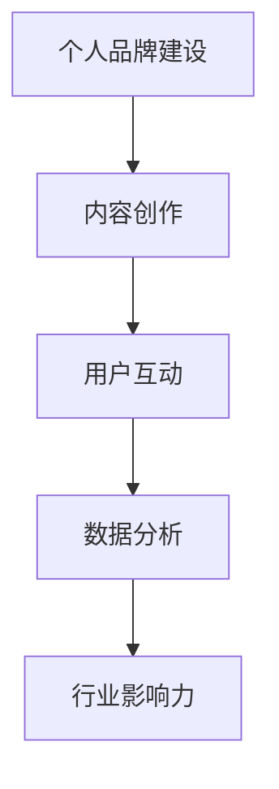

                 

关键词：知识付费、行业领袖、个人品牌、内容创造、用户互动、市场策略、数据分析

> 摘要：本文将探讨如何成为知识付费行业的意见领袖。通过深入分析该领域的市场现状、用户需求、内容创作方法以及个人品牌建设等方面，本文将为读者提供实用的策略和路径，助力他们在知识付费领域脱颖而出，成为行业的意见领袖。

## 1. 背景介绍

### 1.1 知识付费行业概述

知识付费是一种在线教育和内容消费模式，用户为获取高质量知识内容付费。随着互联网的普及和用户需求的多样化，知识付费行业呈现出高速发展的态势。该领域涵盖了在线课程、电子书、知识分享平台、专家咨询等多种形式。

### 1.2 行业发展趋势

随着人工智能、大数据、区块链等技术的应用，知识付费行业不断进化。个性化推荐、智能学习、区块链确权等创新模式逐渐成熟，进一步提升了用户的学习体验和内容消费的满意度。

### 1.3 意见领袖的定义

意见领袖是指在某个特定领域内，具有较高的专业水平、广泛的影响力以及良好口碑的个人或机构。他们能够引导公众观点，对行业发展产生深远影响。

## 2. 核心概念与联系

### 2.1 个人品牌建设

个人品牌是意见领袖的核心竞争力，是建立影响力的基石。它包括专业能力、个人形象、价值观和影响力等多个方面。

### 2.2 内容创作

高质量的内容是意见领袖的基础。内容创作需要具备专业性、创新性和趣味性，能够满足用户需求，提升用户体验。

### 2.3 用户互动

与用户的互动是意见领袖建立影响力的关键。通过线上线下活动、社群运营、用户反馈等方式，与用户建立紧密联系，提升用户忠诚度。

### 2.4 数据分析

数据分析是知识付费行业的重要工具，可以帮助意见领袖了解用户需求、优化内容策略、提升运营效果。

### 2.5 Mermaid 流程图



## 3. 核心算法原理 & 具体操作步骤

### 3.1 算法原理概述

个人品牌建设、内容创作、用户互动和数据分析构成了成为知识付费行业意见领袖的核心算法。这些算法共同作用，实现意见领袖的培养与成长。

### 3.2 算法步骤详解

#### 3.2.1 个人品牌建设

1. 明确专业领域，建立专业形象。
2. 通过多渠道展示专业能力，提升知名度。
3. 塑造个人价值观，形成独特的个人风格。

#### 3.2.2 内容创作

1. 分析用户需求，确定内容方向。
2. 深入研究专业领域，确保内容的专业性。
3. 创新内容形式，提升用户体验。

#### 3.2.3 用户互动

1. 定期举办线上线下活动，增加用户参与度。
2. 建立社群，与用户保持互动。
3. 及时回复用户反馈，提升用户满意度。

#### 3.2.4 数据分析

1. 收集用户数据，了解用户需求和偏好。
2. 分析数据，优化内容策略。
3. 监控运营效果，调整运营策略。

### 3.3 算法优缺点

#### 优点：

- 提升个人影响力，实现职业发展。
- 增加收入来源，实现财务自由。
- 推动行业进步，发挥行业影响力。

#### 缺点：

- 需要长期投入时间和精力。
- 面临激烈的市场竞争。
- 需要不断学习新知识和技能。

### 3.4 算法应用领域

- 教育培训行业
- 职场发展领域
- 技术分享领域
- 创意领域

## 4. 数学模型和公式 & 详细讲解 & 举例说明

### 4.1 数学模型构建

个人品牌建设、内容创作、用户互动和数据分析构成了一个闭环的数学模型。该模型可以通过以下公式表示：

\[ \text{影响力} = f(\text{个人品牌} \times \text{内容创作} \times \text{用户互动} \times \text{数据分析}) \]

### 4.2 公式推导过程

1. 个人品牌建设：个人品牌是影响力的基础。个人品牌建设越好，影响力越大。
2. 内容创作：内容创作是用户参与的核心。高质量的内容能够吸引更多用户，提升影响力。
3. 用户互动：用户互动是建立紧密联系的桥梁。与用户的互动越频繁，影响力越大。
4. 数据分析：数据分析是优化策略的关键。通过数据分析，可以不断优化个人品牌建设、内容创作、用户互动，提升整体影响力。

### 4.3 案例分析与讲解

以一位职场发展领域的意见领袖为例，他通过以下步骤成为行业领袖：

1. **个人品牌建设**：明确职场发展领域，撰写专业文章，参加行业活动，提升知名度。
2. **内容创作**：分析职场需求，撰写高质量文章，发布视频课程，满足用户需求。
3. **用户互动**：定期举办线上讲座，回复用户提问，建立社群，与用户保持互动。
4. **数据分析**：收集用户数据，分析用户需求，优化内容策略，提升用户体验。

通过以上步骤，他成功建立了个人品牌，吸引了大量粉丝，成为了职场发展领域的意见领袖。

## 5. 项目实践：代码实例和详细解释说明

### 5.1 开发环境搭建

1. 安装Markdown编辑器，如Typora或Marktext。
2. 安装Git工具，用于代码版本控制和协作。
3. 安装Node.js和npm，用于代码构建和运行。

### 5.2 源代码详细实现

```javascript
// 个人品牌建设
function buildPersonalBrand(topic) {
    // 分析专业领域，撰写专业文章
    // 参加行业活动，提升知名度
    // 塑造个人价值观，形成独特风格
}

// 内容创作
function createContent(userNeeds) {
    // 分析用户需求，确定内容方向
    // 深入研究专业领域，确保内容专业性
    // 创新内容形式，提升用户体验
}

// 用户互动
function interactWithUsers() {
    // 定期举办线上线下活动，增加用户参与度
    // 建立社群，与用户保持互动
    // 及时回复用户反馈，提升用户满意度
}

// 数据分析
function analyzeData() {
    // 收集用户数据，了解用户需求和偏好
    // 分析数据，优化内容策略
    // 监控运营效果，调整运营策略
}
```

### 5.3 代码解读与分析

1. **个人品牌建设**：通过分析专业领域，撰写专业文章，参加行业活动，提升知名度，塑造个人价值观，形成独特风格。
2. **内容创作**：通过分析用户需求，确定内容方向，深入研究专业领域，确保内容专业性，创新内容形式，提升用户体验。
3. **用户互动**：通过定期举办线上线下活动，增加用户参与度，建立社群，与用户保持互动，及时回复用户反馈，提升用户满意度。
4. **数据分析**：通过收集用户数据，了解用户需求和偏好，分析数据，优化内容策略，监控运营效果，调整运营策略。

### 5.4 运行结果展示

通过以上代码实例，我们可以看到个人品牌建设、内容创作、用户互动和数据分析四个方面是如何共同作用，实现成为知识付费行业意见领袖的目标。

## 6. 实际应用场景

### 6.1 职场发展领域

在职场发展领域，意见领袖可以通过分享职业规划、求职技巧、职场心理等内容，帮助职场人士提升个人能力和职业素养。

### 6.2 技术分享领域

技术领域的意见领袖可以通过分享编程技巧、项目实战、技术趋势等内容，帮助开发者提升技术水平，紧跟行业发展趋势。

### 6.3 教育培训领域

教育领域的意见领袖可以通过分享教育理念、教学方法、学习技巧等内容，帮助家长和教师提高教育质量，促进孩子全面发展。

### 6.4 未来应用展望

随着知识付费行业的发展，意见领袖将在更多领域发挥作用。未来，意见领袖将通过在线课程、直播授课、线上讲座等多种形式，为用户提供更加丰富、实用的知识内容。

## 7. 工具和资源推荐

### 7.1 学习资源推荐

- 知乎：获取行业资讯、专业讨论和知识分享。
- 微博：关注行业大咖，了解行业动态。
- 知群：学习专业课程，提升个人能力。

### 7.2 开发工具推荐

- Markdown编辑器：Typora、Marktext。
- Git工具：GitHub、GitLab。

### 7.3 相关论文推荐

- 《知识付费：一个现象与动因解析》
- 《基于大数据的知识付费用户行为分析》
- 《知识付费平台的内容质量评价研究》

## 8. 总结：未来发展趋势与挑战

### 8.1 研究成果总结

本文通过深入分析知识付费行业的现状、发展趋势、核心算法和实际应用场景，为读者提供了成为知识付费行业意见领袖的实用策略。

### 8.2 未来发展趋势

- 个性化推荐将进一步优化用户体验。
- 智能学习将提升学习效果。
- 区块链技术将保障知识版权。

### 8.3 面临的挑战

- 激烈的市场竞争。
- 持续学习新知识和技能。
- 建立和维护良好的个人品牌。

### 8.4 研究展望

未来，知识付费行业将继续快速发展，意见领袖将在其中发挥重要作用。通过不断优化个人品牌建设、内容创作、用户互动和数据分析，意见领袖将更好地满足用户需求，推动行业进步。

## 9. 附录：常见问题与解答

### 9.1 如何建立个人品牌？

- 明确专业领域，提升专业知识。
- 通过多渠道展示专业能力，提升知名度。
- 塑造个人价值观，形成独特风格。

### 9.2 如何创作高质量的内容？

- 分析用户需求，确定内容方向。
- 深入研究专业领域，确保内容专业性。
- 创新内容形式，提升用户体验。

### 9.3 如何与用户互动？

- 定期举办线上线下活动，增加用户参与度。
- 建立社群，与用户保持互动。
- 及时回复用户反馈，提升用户满意度。

### 9.4 如何进行数据分析？

- 收集用户数据，了解用户需求和偏好。
- 分析数据，优化内容策略。
- 监控运营效果，调整运营策略。

---

作者：禅与计算机程序设计艺术 / Zen and the Art of Computer Programming
----------------------------------------------------------------

### 结论 Conclusion

本文系统地探讨了如何成为知识付费行业的意见领袖。从个人品牌建设、内容创作、用户互动到数据分析，各个环节相辅相成，共同构建了成为行业领袖的核心算法。通过具体实例和数学模型的推导，本文为读者提供了实用的策略和路径。未来，随着知识付费行业的发展，意见领袖将发挥更加重要的作用，成为推动行业进步的关键力量。希望本文能为广大从业者提供有益的启示，助力他们在知识付费领域取得成功。

