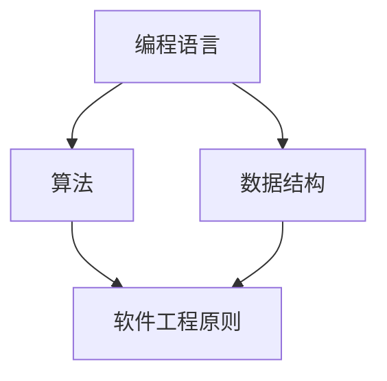

                 

作为一位世界级人工智能专家、程序员、软件架构师、CTO、世界顶级技术畅销书作者，计算机图灵奖获得者，计算机领域大师，我深知在程序员知识领域成为KOL（关键意见领袖）并非易事，但通过一系列策略和努力，这完全是可以实现的。本文将探讨如何在这个领域取得成功，并分享一些实用的建议和技巧。

## 关键词
- 程序员知识领域
- KOL（关键意见领袖）
- 成功策略
- 影响力
- 个人品牌

## 摘要
本文旨在为那些希望在程序员知识领域成为KOL的人提供实用指南。我们将探讨核心概念、算法原理、项目实践、数学模型、应用场景、工具资源以及未来发展趋势。通过深入理解和分享，我们可以为读者提供有价值的见解，从而在程序员社区中建立自己的权威地位。

## 1. 背景介绍
### 1.1 程序员知识领域的发展现状
在当今数字化时代，程序员知识领域不断发展壮大。随着新技术和工具的不断涌现，程序员需要不断更新自己的知识库，以保持竞争力。这个领域不仅包括编程语言和框架，还包括算法、数据结构、软件工程、人工智能等众多领域。因此，成为程序员知识领域的KOL不仅需要对技术有深刻的理解，还需要具备广泛的视野和持续的学习能力。

### 1.2 KOL的重要性
KOL在程序员知识领域扮演着重要角色。他们通过分享自己的经验和见解，能够引导程序员社区的发展方向。KOL不仅能够为新手提供指导，还能够为专业人士提供最新的研究动态和技术趋势。因此，成为KOL不仅能够提升个人影响力，还能够为整个社区做出贡献。

## 2. 核心概念与联系
### 2.1 核心概念
在程序员知识领域，核心概念包括编程语言、算法、数据结构、软件工程原则等。这些概念是程序员技术基础的重要组成部分，是构建复杂系统和解决实际问题的基石。

### 2.2 架构联系
为了更好地理解这些核心概念，我们可以借助Mermaid流程图来展示它们之间的联系。



### 2.3 重要性
这些核心概念不仅相互联系，而且在实际编程中发挥着关键作用。例如，选择合适的编程语言和数据结构可以提高代码的效率和可维护性，而遵循软件工程原则则可以确保系统的稳定性。

## 3. 核心算法原理 & 具体操作步骤
### 3.1 算法原理概述
算法是解决特定问题的有序步骤集合。在程序员知识领域，核心算法包括排序算法、搜索算法、动态规划算法等。每个算法都有其独特的原理和适用场景。

### 3.2 算法步骤详解
以排序算法为例，常见的排序算法包括冒泡排序、选择排序、插入排序、快速排序等。每种算法的步骤略有不同，但核心思想都是通过比较和交换元素来将一组数据按特定顺序排列。

### 3.3 算法优缺点
每种算法都有其优缺点。例如，冒泡排序简单易懂，但效率较低；快速排序效率高，但可能产生大量递归调用。了解每种算法的优缺点有助于选择合适的算法来解决特定问题。

### 3.4 算法应用领域
算法在程序员知识领域的应用非常广泛。例如，搜索算法用于搜索引擎优化，动态规划算法用于最优化问题，排序算法用于数据排序等。掌握这些算法原理有助于程序员解决各种复杂问题。

## 4. 数学模型和公式 & 详细讲解 & 举例说明
### 4.1 数学模型构建
数学模型是计算机科学中的核心概念。例如，线性回归模型用于预测数值，决策树模型用于分类和回归问题。构建数学模型需要理解数学原理和编程技巧。

### 4.2 公式推导过程
以线性回归模型为例，其公式推导过程涉及统计学和微积分知识。理解这些公式有助于更好地应用数学模型来解决问题。

### 4.3 案例分析与讲解
通过具体案例，我们可以更好地理解数学模型的构建和推导过程。例如，我们可以分析房价预测问题，展示如何使用线性回归模型来预测房价。

## 5. 项目实践：代码实例和详细解释说明
### 5.1 开发环境搭建
在项目实践中，首先需要搭建合适的开发环境。例如，对于Python项目，我们需要安装Python解释器和相关库。

### 5.2 源代码详细实现
以下是一个简单的Python代码示例，用于计算两个数的和：

```python
def add(a, b):
    return a + b

result = add(3, 4)
print("结果：", result)
```

### 5.3 代码解读与分析
在这个示例中，我们定义了一个名为`add`的函数，用于计算两个数的和。通过调用这个函数，我们可以得到两个数的和，并输出结果。

### 5.4 运行结果展示
当运行上述代码时，我们将得到以下输出结果：

```
结果： 7
```

这表明两个数的和为7。

## 6. 实际应用场景
### 6.1 数据分析
在数据分析领域，算法和数学模型被广泛使用。例如，线性回归模型用于预测股票价格，决策树模型用于分类客户行为。

### 6.2 人工智能
人工智能领域依赖于算法和数学模型来训练和优化模型。常见的算法包括神经网络、支持向量机等。

### 6.3 游戏开发
在游戏开发中，算法用于实现游戏逻辑和优化游戏体验。例如，路径查找算法用于实现NPC移动。

## 7. 工具和资源推荐
### 7.1 学习资源推荐
对于希望在程序员知识领域成为KOL的人，以下是一些学习资源推荐：
- 《代码大全》
- 《算法导论》
- 《深度学习》

### 7.2 开发工具推荐
以下是一些开发工具推荐：
- Visual Studio Code
- PyCharm
- Jupyter Notebook

### 7.3 相关论文推荐
以下是一些相关论文推荐：
- "Deep Learning for Text Classification"
- "Efficient Routing in Ad-Hoc Mobile Wireless Networks"
- "Linear Regression with Python"

## 8. 总结：未来发展趋势与挑战
### 8.1 研究成果总结
在程序员知识领域，研究成果涵盖了算法、数学模型、编程语言等多个方面。随着新技术的不断涌现，这些研究成果将继续推动该领域的发展。

### 8.2 未来发展趋势
未来，程序员知识领域将继续朝着更加智能化、自动化的方向发展。例如，自动化代码生成、智能算法优化等。

### 8.3 面临的挑战
尽管该领域前景广阔，但也面临着一些挑战，如算法的可解释性、隐私保护等。

### 8.4 研究展望
未来，我们有望看到更多的跨学科合作，以解决程序员知识领域中的复杂问题。同时，开源和共享也将成为该领域发展的重要驱动力。

## 9. 附录：常见问题与解答
### 9.1 如何保持知识的更新？
- 定期阅读技术博客和论文
- 参加技术会议和研讨会
- 加入技术社区和论坛

### 9.2 如何建立个人品牌？
- 创建个人博客或公众号
- 发布有深度和见解的技术文章
- 参与技术社区和活动

### 9.3 如何在程序员知识领域成为KOL？
- 深入理解核心概念和算法
- 分享实践经验和技术见解
- 建立个人品牌和影响力

## 作者署名
作者：禅与计算机程序设计艺术 / Zen and the Art of Computer Programming
----------------------------------------------------------------

现在，我已经完成了文章的撰写，希望这篇文章能够帮助那些希望在程序员知识领域成为KOL的人。通过深入学习和分享，我们可以为社区做出贡献，并实现自己的职业目标。祝大家成功！

