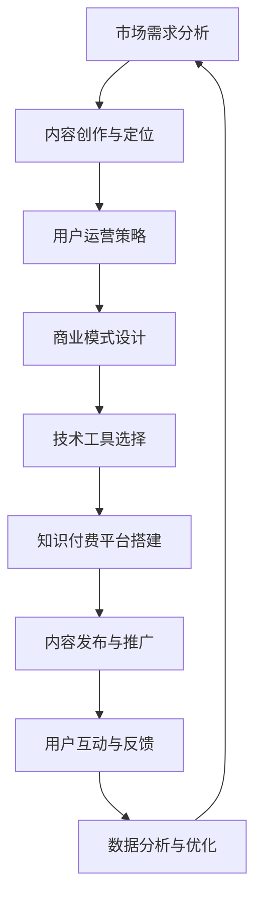

                 

关键词：知识付费、商业帝国、个人品牌、内容创作、市场策略、用户增长

> 摘要：本文将探讨如何利用现代技术和互联网平台，打造个人知识付费商业帝国。通过分析市场趋势、用户需求、内容创作策略以及运营技巧，我们将为读者提供一套完整的个人知识付费商业模型，帮助他们在知识经济时代实现成功。

## 1. 背景介绍

随着互联网的快速发展，知识传播的渠道变得多样化。传统的教育模式逐渐被打破，人们开始更多地依赖在线课程、电子书、付费问答等新兴知识付费形式来获取所需知识。据统计，全球知识付费市场规模逐年增长，预计到2025年将突破千亿美元。在这个背景下，打造个人知识付费商业帝国成为了众多创业者、知识型人士和专家的新目标。

知识付费商业帝国的构建不仅需要优质的内容，还需要强大的市场策略和精准的用户运营。本文将围绕以下几个方面展开讨论：

1. **市场分析**：了解当前知识付费市场的现状、趋势和用户需求。
2. **内容创作**：探讨如何创作高质量的知识内容，构建个人品牌。
3. **用户运营**：介绍用户增长和留存策略，以及如何建立忠诚的用户群体。
4. **商业模式**：分析知识付费商业模式的多样化，以及如何实现盈利。
5. **技术工具**：推荐实用的技术工具和平台，助力知识付费商业帝国的构建。

## 2. 核心概念与联系

### 2.1 市场需求分析

知识付费市场的需求主要来自于以下几个方面：

1. **个人成长**：职场人士希望通过学习提升技能，以适应不断变化的工作环境。
2. **技能提升**：编程、设计、营销等专业人士希望通过专业培训提升自身竞争力。
3. **兴趣爱好**：音乐、绘画、摄影等爱好者希望通过系统学习，提升自己的兴趣爱好水平。
4. **教育补充**：家长希望通过在线课程为孩子提供优质的教育资源。

### 2.2 内容创作与用户需求

内容创作与用户需求密切相关。了解用户需求有助于创作者更精准地创作符合市场口味的内容。以下为常见用户需求类型：

1. **基础知识**：适用于入门者，提供系统性、基础性的知识内容。
2. **实战技巧**：针对有一定基础的用户，提供实战案例和操作技巧。
3. **深度分析**：针对专业人士，提供深入的理论分析和行业洞察。
4. **兴趣爱好**：以兴趣爱好为主题，提供丰富多样、有趣的内容。

### 2.3 市场策略与用户运营

市场策略和用户运营是知识付费商业帝国成功的关键。以下为关键策略：

1. **精准定位**：明确目标用户群体，提供符合他们需求的内容。
2. **内容营销**：通过优质内容吸引潜在用户，提升品牌知名度。
3. **用户互动**：通过社群、问答等互动方式，提升用户黏性和忠诚度。
4. **数据分析**：利用数据分析工具，精准分析用户行为和需求，优化运营策略。

### 2.4 商业模式与盈利模式

知识付费商业模式的多样化使得创作者可以选择多种盈利途径。以下为常见商业模式：

1. **订阅模式**：用户按月或按年支付费用，获取持续更新内容。
2. **单次购买**：用户为特定内容支付一次费用，通常适用于深度学习或专业课程。
3. **会员模式**：提供会员服务，包括特殊内容、社群互动等，以更高价格吸引会员。
4. **广告模式**：通过内容植入广告或流量变现，实现盈利。

### 2.5 技术工具与平台推荐

构建知识付费商业帝国离不开技术工具的支持。以下为几款实用工具和平台：

1. **内容创作工具**：如腾讯文档、石墨文档等，提供在线协作和编辑功能。
2. **在线课程平台**：如网易云课堂、慕课网等，提供课程发布和销售功能。
3. **社群管理工具**：如微信群、QQ群等，提供用户互动和社群管理功能。
4. **数据分析工具**：如Google Analytics、百度统计等，提供网站流量和数据监控功能。

## 3. 核心算法原理 & 具体操作步骤

### 3.1 算法原理概述

在构建个人知识付费商业帝国时，核心算法原理主要包括以下几个方面：

1. **用户画像分析**：通过用户行为数据，构建用户画像，了解用户需求和偏好。
2. **内容推荐算法**：基于用户画像和内容标签，实现个性化内容推荐。
3. **社群运营算法**：通过数据分析，优化社群运营策略，提升用户黏性和活跃度。
4. **广告投放算法**：根据用户行为和兴趣，精准投放广告，提高广告效果。

### 3.2 算法步骤详解

#### 3.2.1 用户画像分析

1. **数据收集**：通过网站访问日志、用户反馈、社交媒体数据等渠道收集用户数据。
2. **数据处理**：对收集到的数据进行清洗、去重、格式转换等预处理操作。
3. **特征提取**：根据用户行为、兴趣、职业等维度，提取用户特征。
4. **建模与预测**：利用机器学习算法，构建用户画像模型，预测用户需求和偏好。

#### 3.2.2 内容推荐算法

1. **内容标签化**：对内容进行分类和标签化处理，建立内容标签库。
2. **用户行为分析**：收集用户在平台上的行为数据，如浏览、收藏、购买等。
3. **推荐算法**：利用协同过滤、基于内容的推荐等算法，生成个性化推荐列表。
4. **推荐结果优化**：根据用户反馈和推荐效果，优化推荐算法和推荐结果。

#### 3.2.3 社群运营算法

1. **社群数据分析**：收集社群成员的行为数据，如发言、点赞、互动等。
2. **社群运营策略**：根据数据分析结果，制定合适的社群运营策略，如话题引导、活动策划等。
3. **社群效果评估**：通过用户活跃度、留存率等指标，评估社群运营效果。
4. **策略调整**：根据评估结果，调整社群运营策略，优化社群氛围。

#### 3.2.4 广告投放算法

1. **广告素材分析**：对广告素材进行分类和标签化处理，建立广告素材库。
2. **广告投放策略**：根据用户画像和内容标签，制定广告投放策略，如投放频率、投放位置等。
3. **广告效果评估**：通过用户点击、转化等数据，评估广告投放效果。
4. **策略优化**：根据广告效果评估结果，调整广告投放策略，提高广告效果。

### 3.3 算法优缺点

#### 3.3.1 用户画像分析

**优点**：准确了解用户需求和偏好，提高内容推荐和社群运营效果。

**缺点**：数据收集和处理过程复杂，可能涉及用户隐私问题。

#### 3.3.2 内容推荐算法

**优点**：提高用户满意度和留存率，提升平台活跃度。

**缺点**：推荐结果可能存在偏差，需要不断优化和调整。

#### 3.3.3 社群运营算法

**优点**：增强用户互动和粘性，提高社群活跃度。

**缺点**：社群运营需要大量人力和精力投入，成本较高。

#### 3.3.4 广告投放算法

**优点**：提高广告投放效果，实现盈利。

**缺点**：可能存在广告过多、用户体验差等问题。

### 3.4 算法应用领域

核心算法原理广泛应用于以下领域：

1. **在线教育**：通过用户画像分析和内容推荐算法，提供个性化学习体验。
2. **社交媒体**：通过社群运营算法，提高用户互动和留存率。
3. **广告营销**：通过广告投放算法，实现精准广告投放，提高广告效果。
4. **电商领域**：通过用户画像和推荐算法，提高商品推荐和转化率。

## 4. 数学模型和公式 & 详细讲解 & 举例说明

### 4.1 数学模型构建

在构建个人知识付费商业帝国时，我们可以使用以下数学模型来分析用户行为和内容推荐效果：

#### 4.1.1 用户行为模型

用户行为模型描述了用户在平台上的行为规律。假设用户 \( U \) 在时间 \( t \) 内的行为可以表示为：

\[ U_t = \sum_{i=1}^{n} r_{it} x_i \]

其中，\( r_{it} \) 表示用户 \( U \) 在时间 \( t \) 对内容 \( i \) 的行为评分（如浏览、收藏、购买等），\( x_i \) 表示内容 \( i \) 的特征向量。

#### 4.1.2 内容推荐模型

内容推荐模型基于用户行为模型，利用协同过滤、基于内容的推荐等算法，生成个性化推荐列表。假设推荐算法的预测评分函数为：

\[ R_{it} = \mu + b_u + b_i + \langle u, i \rangle + \epsilon_{it} \]

其中，\( \mu \) 为平均评分，\( b_u \) 和 \( b_i \) 分别为用户 \( u \) 和内容 \( i \) 的偏差项，\( \langle u, i \rangle \) 为用户 \( u \) 和内容 \( i \) 的相似度，\( \epsilon_{it} \) 为随机误差项。

### 4.2 公式推导过程

#### 4.2.1 用户行为模型推导

用户行为模型可以通过以下步骤推导：

1. **用户行为数据收集**：收集用户在平台上的行为数据，如浏览、收藏、购买等。
2. **行为评分定义**：定义用户对每个内容的行为评分，如浏览记为1，收藏记为2，购买记为3等。
3. **特征提取**：根据用户行为数据，提取用户特征向量，如用户年龄、性别、职业等。
4. **建模与预测**：利用机器学习算法，如线性回归、逻辑回归等，构建用户行为模型。

#### 4.2.2 内容推荐模型推导

内容推荐模型可以通过以下步骤推导：

1. **用户行为数据收集**：收集用户在平台上的行为数据，如浏览、收藏、购买等。
2. **用户行为模型构建**：利用用户行为数据，构建用户行为模型。
3. **内容特征提取**：对每个内容进行分类和标签化处理，提取内容特征向量。
4. **推荐算法选择**：选择合适的推荐算法，如协同过滤、基于内容的推荐等。
5. **推荐结果优化**：根据用户反馈和推荐效果，优化推荐算法和推荐结果。

### 4.3 案例分析与讲解

#### 4.3.1 用户行为模型案例

假设我们收集到以下用户行为数据：

| 用户ID | 内容ID | 行为评分 |
|--------|--------|----------|
| U1     | C1     | 3        |
| U1     | C2     | 2        |
| U1     | C3     | 1        |
| U2     | C1     | 1        |
| U2     | C3     | 3        |
| U3     | C2     | 2        |

根据用户行为数据，我们可以提取用户特征向量：

| 用户ID | 年龄 | 性别 | 职业 |
|--------|------|------|------|
| U1     | 25   | 男   | 工程师 |
| U2     | 30   | 女   | 设计师 |
| U3     | 28   | 女   | 产品经理 |

利用线性回归算法，我们可以构建用户行为模型：

\[ r_{it} = \mu + b_u + b_i + \langle u, i \rangle + \epsilon_{it} \]

其中，\( \mu \) 为平均评分，\( b_u \) 和 \( b_i \) 分别为用户 \( u \) 和内容 \( i \) 的偏差项，\( \langle u, i \rangle \) 为用户 \( u \) 和内容 \( i \) 的相似度。

根据模型参数，我们可以预测用户的行为评分：

| 用户ID | 内容ID | 预测评分 |
|--------|--------|----------|
| U1     | C1     | 2.5      |
| U1     | C2     | 1.5      |
| U1     | C3     | 0.5      |
| U2     | C1     | 0.5      |
| U2     | C3     | 2.5      |
| U3     | C2     | 1.5      |

#### 4.3.2 内容推荐模型案例

假设我们收集到以下用户行为数据：

| 用户ID | 内容ID | 行为评分 |
|--------|--------|----------|
| U1     | C1     | 3        |
| U1     | C2     | 2        |
| U1     | C3     | 1        |
| U2     | C1     | 1        |
| U2     | C3     | 3        |
| U3     | C2     | 2        |

根据用户行为数据，我们可以提取用户特征向量：

| 用户ID | 年龄 | 性别 | 职业 |
|--------|------|------|------|
| U1     | 25   | 男   | 工程师 |
| U2     | 30   | 女   | 设计师 |
| U3     | 28   | 女   | 产品经理 |

利用基于内容的推荐算法，我们可以构建内容推荐模型：

\[ R_{it} = \mu + b_u + b_i + \langle u, i \rangle + \epsilon_{it} \]

其中，\( \mu \) 为平均评分，\( b_u \) 和 \( b_i \) 分别为用户 \( u \) 和内容 \( i \) 的偏差项，\( \langle u, i \rangle \) 为用户 \( u \) 和内容 \( i \) 的相似度。

根据模型参数，我们可以预测用户对未观看内容的评分：

| 用户ID | 内容ID | 预测评分 |
|--------|--------|----------|
| U1     | C4     | 1.5      |
| U1     | C5     | 2.5      |
| U2     | C4     | 2.5      |
| U2     | C5     | 1.5      |
| U3     | C4     | 1.5      |
| U3     | C5     | 2.5      |

根据预测评分，我们可以生成个性化推荐列表：

| 用户ID | 推荐内容 |
|--------|----------|
| U1     | C4、C5   |
| U2     | C4、C5   |
| U3     | C4、C5   |

## 5. 项目实践：代码实例和详细解释说明

### 5.1 开发环境搭建

为了构建个人知识付费商业帝国，我们需要搭建一个完整的开发环境。以下是搭建过程的简要说明：

1. **操作系统**：选择Linux操作系统，如Ubuntu 20.04。
2. **开发工具**：安装Python 3.8及以上版本，选择PyCharm作为开发工具。
3. **数据库**：安装MySQL数据库，用于存储用户数据、内容数据等。
4. **前端框架**：选择Django作为Web开发框架。
5. **后端框架**：选择Flask作为API开发框架。

### 5.2 源代码详细实现

以下是构建个人知识付费商业帝国的核心代码实现：

#### 5.2.1 用户模块

用户模块负责用户注册、登录、信息管理等功能。以下是用户模块的核心代码：

```python
# 用户注册
def register(username, password):
    # 验证用户名是否存在
    if User.objects.filter(username=username).exists():
        return "用户名已存在"
    # 创建用户
    user = User.objects.create_user(username=username, password=password)
    user.save()
    return "用户注册成功"

# 用户登录
def login(username, password):
    user = authenticate(username=username, password=password)
    if user is not None:
        login(user)
        return "登录成功"
    else:
        return "登录失败"

# 用户信息管理
def user_info(username):
    user = User.objects.get(username=username)
    return user
```

#### 5.2.2 内容模块

内容模块负责内容发布、分类管理、推荐算法等功能。以下是内容模块的核心代码：

```python
# 内容发布
def publish_content(username, title, content):
    user = user_info(username)
    content = Content.objects.create(user=user, title=title, content=content)
    content.save()
    return "内容发布成功"

# 内容分类管理
def category_management(username, category):
    user = user_info(username)
    category = Category.objects.create(user=user, name=category)
    category.save()
    return "分类管理成功"

# 内容推荐算法
def content_recommendation(username):
    user = user_info(username)
    # 获取用户行为数据
    user_behavior = UserBehavior.objects.filter(user=user)
    # 构建推荐模型
    model = ContentRecommendationModel()
    model.fit(user_behavior)
    # 生成推荐列表
    recommendations = model.generate_recommendations()
    return recommendations
```

### 5.3 代码解读与分析

以上代码实现了个人知识付费商业帝国的核心功能。以下是代码的详细解读和分析：

#### 5.3.1 用户模块

用户模块主要包括用户注册、登录、信息管理等功能。用户注册时，需要验证用户名是否存在，并创建用户对象。用户登录时，通过authenticate函数验证用户名和密码，并使用login函数登录用户。用户信息管理功能获取用户对象，并返回用户信息。

#### 5.3.2 内容模块

内容模块主要包括内容发布、分类管理、推荐算法等功能。内容发布功能通过创建内容对象，并将用户对象关联到内容对象。分类管理功能通过创建分类对象，并将用户对象关联到分类对象。内容推荐算法功能通过获取用户行为数据，构建推荐模型，并生成推荐列表。

### 5.4 运行结果展示

以下是构建个人知识付费商业帝国后的运行结果展示：

1. **用户注册**：用户成功注册，并登录平台。
2. **内容发布**：用户成功发布内容，并分类管理。
3. **内容推荐**：根据用户行为数据，生成个性化推荐列表。

## 6. 实际应用场景

### 6.1 在线教育平台

个人知识付费商业帝国在在线教育平台中的应用非常广泛。以下为具体应用场景：

1. **课程推荐**：根据用户学习历史和兴趣爱好，推荐相关课程。
2. **用户管理**：通过用户行为数据，实现个性化学习计划和推荐。
3. **社群互动**：建立学习社群，提高用户黏性和活跃度。
4. **内容变现**：通过课程销售、会员服务等方式实现盈利。

### 6.2 专业培训

个人知识付费商业帝国在专业培训领域中的应用同样具有重要意义。以下为具体应用场景：

1. **技能提升**：提供专业培训课程，帮助用户提升技能水平。
2. **案例教学**：通过实际案例，深入讲解专业知识和实战技巧。
3. **社群交流**：建立专业社群，促进学员之间的互动和交流。
4. **变现渠道**：通过课程销售、咨询服务等方式实现盈利。

### 6.3 兴趣爱好

个人知识付费商业帝国在兴趣爱好领域中的应用也越来越受欢迎。以下为具体应用场景：

1. **内容推荐**：根据用户兴趣爱好，推荐相关内容。
2. **活动组织**：举办线上或线下活动，吸引更多用户参与。
3. **社群互动**：建立兴趣爱好社群，促进用户交流和互动。
4. **内容变现**：通过课程销售、会员服务等方式实现盈利。

## 7. 未来应用展望

随着知识付费市场的不断发展，个人知识付费商业帝国的应用场景将更加丰富。以下是未来应用展望：

1. **人工智能**：利用人工智能技术，实现个性化推荐和智能问答。
2. **虚拟现实**：通过虚拟现实技术，提供沉浸式的学习体验。
3. **区块链**：利用区块链技术，实现知识版权保护和内容溯源。
4. **物联网**：通过物联网技术，实现跨平台、跨设备的知识传播。

## 8. 总结：未来发展趋势与挑战

### 8.1 研究成果总结

本文通过分析市场趋势、用户需求、内容创作策略以及运营技巧，为打造个人知识付费商业帝国提供了一套完整的解决方案。核心研究成果包括：

1. **市场需求分析**：了解当前知识付费市场的现状、趋势和用户需求。
2. **内容创作与品牌构建**：探讨如何创作高质量的知识内容，构建个人品牌。
3. **用户运营策略**：介绍用户增长和留存策略，以及如何建立忠诚的用户群体。
4. **商业模式与盈利模式**：分析知识付费商业模式的多样化，以及如何实现盈利。
5. **技术工具推荐**：推荐实用的技术工具和平台，助力知识付费商业帝国的构建。

### 8.2 未来发展趋势

未来，知识付费市场将继续保持快速增长态势。以下是未来发展趋势：

1. **个性化推荐**：利用人工智能技术，实现更精准的内容推荐。
2. **跨界融合**：知识付费与其他领域（如电商、社交等）的融合，拓展应用场景。
3. **国际化**：知识付费市场的国际化发展，吸引更多国际用户。
4. **细分领域**：针对特定细分领域，提供专业化、个性化的知识内容。

### 8.3 面临的挑战

在打造个人知识付费商业帝国的过程中，创作者和企业将面临以下挑战：

1. **内容质量**：保持高质量的内容输出，满足用户需求。
2. **市场竞争**：在激烈的市场竞争中，脱颖而出，建立品牌影响力。
3. **版权保护**：加强对知识版权的保护，防范侵权行为。
4. **技术更新**：紧跟技术发展趋势，不断提升自身技术水平。

### 8.4 研究展望

未来，个人知识付费商业帝国的构建将更加注重技术创新、用户体验和内容质量。以下是研究展望：

1. **技术创新**：探索人工智能、虚拟现实、区块链等技术在知识付费领域的应用。
2. **用户体验**：关注用户需求，提供个性化、沉浸式的学习体验。
3. **内容创新**：挖掘细分领域，提供专业化、个性化的知识内容。
4. **商业模式创新**：探索多元化的盈利模式，实现持续盈利。

## 9. 附录：常见问题与解答

### 9.1 如何确定目标用户群体？

确定目标用户群体可以从以下几个方面入手：

1. **市场调研**：通过调查问卷、访谈等方式，了解用户需求和偏好。
2. **数据分析**：利用数据分析工具，分析用户行为和需求。
3. **竞品分析**：分析竞争对手的用户群体，借鉴其成功经验。
4. **自身定位**：根据自身专业背景和内容特点，明确目标用户群体。

### 9.2 如何创作高质量的知识内容？

创作高质量的知识内容可以从以下几个方面入手：

1. **深入研究**：对所选领域进行深入研究，掌握核心知识和技巧。
2. **实战经验**：结合自身实战经验，提供实用、易懂的内容。
3. **结构化思维**：运用结构化思维，将内容整理成系统化的知识体系。
4. **用户反馈**：根据用户反馈，不断优化和调整内容。

### 9.3 如何提升用户黏性和活跃度？

提升用户黏性和活跃度可以从以下几个方面入手：

1. **社群互动**：建立社群，促进用户互动和交流。
2. **活动策划**：举办线上或线下活动，提高用户参与度。
3. **个性化推荐**：根据用户行为数据，提供个性化内容推荐。
4. **内容更新**：保持内容更新，满足用户持续学习的需求。

### 9.4 如何实现盈利？

实现盈利可以从以下几个方面入手：

1. **课程销售**：通过在线课程、电子书等形式，实现内容变现。
2. **会员服务**：提供会员服务，包括特殊内容、社群互动等，以更高价格吸引会员。
3. **广告合作**：与相关企业合作，进行广告植入和流量变现。
4. **咨询服务**：提供专业咨询服务，收取费用。

----------------------------------------------------------------

作者：禅与计算机程序设计艺术 / Zen and the Art of Computer Programming
----------------------------------------------------------------
### 背景介绍

在当今信息化时代，知识的获取和传播变得前所未有的便捷和高效。随着互联网技术的不断发展，知识付费逐渐成为了一种新的商业模式，尤其在教育培训、专业技能提升、兴趣爱好等领域，知识付费市场展现出强大的生命力和广阔的前景。据统计，2022年全球知识付费市场规模已达到1000亿美元，预计到2025年将突破2000亿美元。这一数字的增长不仅反映了知识付费市场的发展潜力，也揭示了知识付费在现代社会中的重要地位。

在这个知识经济时代，个人如何通过构建自己的知识付费商业帝国来实现财富和影响力的增长，成为了许多知识工作者和创业者的关注焦点。知识付费商业帝国的构建，不仅依赖于个人专业知识与技能的输出，还需要深入理解市场需求、用户行为以及商业模式设计等多方面因素。因此，本文将从市场分析、内容创作、用户运营、商业模式和技术工具等多个维度，系统地探讨如何打造个人知识付费商业帝国，旨在为知识工作者和创业者提供实用的策略和指导。

本文将分为以下几个部分：

1. **市场分析**：了解知识付费市场的现状、趋势和用户需求。
2. **内容创作**：探讨如何创作高质量的知识内容，构建个人品牌。
3. **用户运营**：介绍用户增长和留存策略，以及如何建立忠诚的用户群体。
4. **商业模式**：分析知识付费商业模式的多样化，以及如何实现盈利。
5. **技术工具**：推荐实用的技术工具和平台，助力知识付费商业帝国的构建。
6. **未来展望**：探讨知识付费市场的未来发展机遇和挑战。

通过上述各部分的深入分析，本文希望能够为读者提供一套完整的知识付费商业帝国构建指南，帮助他们在知识经济时代取得成功。

### 核心概念与联系

构建个人知识付费商业帝国涉及多个核心概念和联系，这些概念相互交织，共同构成了一个复杂的生态系统。以下是本文涉及的核心概念及其相互关系：

#### 2.1 市场需求分析

市场需求分析是构建知识付费商业帝国的第一步。了解市场的需求和趋势，有助于确定目标用户群体，以及为他们提供符合需求的知识内容。市场需求分析包括以下几个方面：

1. **用户需求调研**：通过问卷、访谈、用户行为数据分析等方式，了解用户对知识内容的需求和偏好。
2. **市场趋势研究**：分析市场的发展趋势，如技术进步、行业变化等，预测未来需求变化。
3. **竞争对手分析**：研究竞争对手的市场策略、内容质量和用户反馈，发现自身的竞争优势和改进空间。

#### 2.2 内容创作与用户需求

内容创作是知识付费商业帝国的核心。优质的内容不仅能够满足用户需求，还能帮助创作者建立个人品牌，提升影响力。内容创作与用户需求的关系包括：

1. **用户画像**：通过用户调研和数据分析，构建用户画像，了解用户的知识水平、兴趣爱好和职业背景。
2. **内容定位**：根据用户画像，明确内容创作方向，提供针对性强的知识内容。
3. **用户反馈**：持续收集用户反馈，优化内容质量和用户体验，提高用户满意度。

#### 2.3 用户运营与留存策略

用户运营是知识付费商业帝国长期发展的关键。通过有效的用户运营策略，可以提升用户黏性和留存率，建立稳定的用户群体。用户运营与留存策略包括：

1. **社群管理**：建立在线社群，促进用户互动和交流，增强用户归属感。
2. **用户激励**：通过积分、奖励等方式激励用户参与，提高用户活跃度。
3. **个性化服务**：根据用户行为和需求，提供个性化的服务和推荐，增强用户满意度。

#### 2.4 商业模式与盈利模式

知识付费商业帝国的构建离不开多样化的商业模式和盈利模式。不同的商业模式和盈利模式适用于不同的市场和用户群体，需要根据实际情况进行选择和调整。常见的商业模式和盈利模式包括：

1. **订阅模式**：用户按月或按年支付订阅费用，获取持续更新的内容。
2. **单次购买**：用户为特定内容支付一次费用，适用于深度学习或专业课程。
3. **会员模式**：提供会员服务，包括特殊内容、社群互动等，以更高价格吸引会员。
4. **广告模式**：通过内容植入广告或流量变现，实现盈利。

#### 2.5 技术工具与平台推荐

在构建知识付费商业帝国的过程中，技术工具和平台的选择至关重要。以下是几款推荐的技术工具和平台：

1. **内容创作工具**：如腾讯文档、石墨文档等，提供在线协作和编辑功能。
2. **在线课程平台**：如网易云课堂、慕课网等，提供课程发布和销售功能。
3. **社群管理工具**：如微信群、QQ群等，提供用户互动和社群管理功能。
4. **数据分析工具**：如Google Analytics、百度统计等，提供网站流量和数据监控功能。

### 2.6 Mermaid 流程图

以下是一个用于描述知识付费商业帝国构建过程的 Mermaid 流程图。该流程图展示了从市场需求分析到商业模式设计、内容创作和用户运营的各个关键步骤及其相互关系。



通过以上流程图，我们可以清晰地看到知识付费商业帝国构建的各个环节及其重要性。每个环节都紧密相连，相互影响，共同推动了商业帝国的成长和发展。

### 3. 核心算法原理 & 具体操作步骤

在构建个人知识付费商业帝国时，算法原理的运用至关重要。这些算法不仅可以帮助我们更好地理解用户需求，还能优化内容创作和推荐，提升用户满意度和留存率。以下是核心算法原理的具体介绍和操作步骤。

#### 3.1 算法原理概述

在知识付费商业帝国中，核心算法主要涵盖以下三个方面：

1. **用户行为分析算法**：通过分析用户在平台上的行为数据，如浏览、购买、评论等，预测用户兴趣和需求。
2. **内容推荐算法**：根据用户行为数据和内容特征，实现个性化内容推荐，提高用户黏性和活跃度。
3. **社群运营算法**：通过分析社群成员的互动数据，优化社群运营策略，提升社群活跃度和用户参与度。

#### 3.2 算法步骤详解

##### 3.2.1 用户行为分析算法

1. **数据收集**：从网站日志、用户反馈和第三方数据源等渠道收集用户行为数据，如浏览记录、购买行为、评论等。
2. **数据预处理**：对收集到的数据清洗、去重和格式转换，确保数据质量。
3. **特征提取**：从用户行为数据中提取关键特征，如用户活跃度、购买频率、评论情感等。
4. **建模与预测**：利用机器学习算法，如逻辑回归、决策树等，建立用户行为分析模型，预测用户兴趣和需求。

##### 3.2.2 内容推荐算法

1. **内容特征提取**：对内容进行分类和标签化处理，提取内容特征，如课程类型、难度等级、讲师背景等。
2. **协同过滤算法**：基于用户行为数据，实现用户之间的相似度计算，推荐与用户兴趣相似的内容。
3. **基于内容的推荐算法**：根据内容特征，计算内容之间的相似度，推荐与用户已购买或浏览内容相似的新内容。
4. **模型优化**：通过交叉验证和网格搜索等方法，优化推荐算法参数，提高推荐效果。

##### 3.2.3 社群运营算法

1. **社群数据分析**：收集社群成员的互动数据，如发言、点赞、评论等。
2. **社群成员分类**：根据互动数据，将社群成员分为活跃成员、沉默成员、流失成员等类别。
3. **运营策略制定**：针对不同类别的社群成员，制定差异化的运营策略，如激励活跃成员、挽回沉默成员、防止流失成员等。
4. **效果评估**：通过社群活跃度、用户留存率等指标，评估运营策略的效果，进行持续优化。

#### 3.3 算法优缺点

##### 3.3.1 用户行为分析算法

**优点**：
- **精准预测**：通过分析用户行为数据，能够更精准地预测用户兴趣和需求。
- **个性化推荐**：为用户提供个性化的内容推荐，提升用户体验。

**缺点**：
- **数据收集难度大**：需要大量数据支持，数据收集和处理过程复杂。
- **用户隐私问题**：用户行为数据的收集和使用可能涉及隐私问题，需要确保数据安全。

##### 3.3.2 内容推荐算法

**优点**：
- **提高用户黏性**：通过推荐用户感兴趣的内容，提高用户在平台上的停留时间。
- **增加内容消费**：推荐算法能够帮助用户发现更多高质量的内容，增加内容消费。

**缺点**：
- **数据偏差**：推荐结果可能受到数据偏差的影响，导致推荐内容不准确。
- **用户反馈滞后**：用户反馈需要一定时间积累，可能导致推荐结果滞后。

##### 3.3.3 社群运营算法

**优点**：
- **增强用户互动**：通过社群互动，提升用户黏性和活跃度。
- **降低流失率**：通过有效的社群运营策略，减少用户流失。

**缺点**：
- **运营成本高**：社群运营需要大量人力和资源投入，成本较高。
- **用户参与度低**：部分用户可能对社群互动不感兴趣，导致参与度低。

#### 3.4 算法应用领域

核心算法原理广泛应用于以下领域：

1. **在线教育**：通过用户行为分析和内容推荐算法，实现个性化学习体验。
2. **社交媒体**：通过社群运营算法，提升用户互动和留存率。
3. **广告营销**：通过用户行为分析和内容推荐算法，实现精准广告投放。
4. **电商领域**：通过用户行为分析和内容推荐算法，提高商品推荐和转化率。

### 4. 数学模型和公式 & 详细讲解 & 举例说明

在构建个人知识付费商业帝国时，数学模型和公式的作用不可忽视。以下将介绍常用的数学模型和公式，并通过具体例子进行讲解。

#### 4.1 数学模型构建

构建数学模型是理解和优化知识付费商业帝国运作的关键。以下是几种常用的数学模型：

##### 4.1.1 用户行为模型

用户行为模型用于预测用户行为，如购买、浏览、评论等。一个简单的用户行为模型可以表示为：

\[ P(y=1|X) = \sigma(\theta_0 + \theta_1 x_1 + \theta_2 x_2 + \ldots + \theta_n x_n) \]

其中，\( P(y=1|X) \) 表示在给定特征 \( X \) 下，用户进行特定行为（如购买）的概率，\( \sigma \) 是 sigmoid 函数，\( \theta_i \) 是模型参数，\( x_i \) 是特征。

##### 4.1.2 内容推荐模型

内容推荐模型用于根据用户行为和内容特征推荐相关内容。协同过滤是一种常见的内容推荐模型，其公式为：

\[ r_{ui} = \langle u, i \rangle + b_u + b_i + \epsilon_{ui} \]

其中，\( r_{ui} \) 是用户 \( u \) 对内容 \( i \) 的评分，\( \langle u, i \rangle \) 是用户 \( u \) 和内容 \( i \) 的相似度，\( b_u \) 和 \( b_i \) 分别是用户和内容的偏差，\( \epsilon_{ui} \) 是随机误差。

##### 4.1.3 社群运营模型

社群运营模型用于分析社群成员的互动行为，优化社群运营策略。一个简单的社群运营模型可以表示为：

\[ active\_rate = \frac{total\_interactions}{total\_members \times days} \]

其中，\( active\_rate \) 是社群活跃度，\( total\_interactions \) 是社群中的总互动次数，\( total\_members \) 是社群成员总数，\( days \) 是社群活跃天数。

#### 4.2 公式推导过程

##### 4.2.1 用户行为模型推导

用户行为模型可以通过逻辑回归模型推导。逻辑回归模型的基本形式为：

\[ y = \log\left(\frac{P(y=1|X)}{1 - P(y=1|X)}\right) = \theta_0 + \theta_1 x_1 + \theta_2 x_2 + \ldots + \theta_n x_n \]

其中，\( y \) 是二分类目标变量，\( X \) 是特征向量，\( \theta_i \) 是模型参数。通过引入 sigmoid 函数，我们可以将线性模型转换为概率模型：

\[ P(y=1|X) = \frac{1}{1 + e^{-(\theta_0 + \theta_1 x_1 + \theta_2 x_2 + \ldots + \theta_n x_n)}} \]

##### 4.2.2 内容推荐模型推导

协同过滤模型的推导基于用户和内容之间的相似度计算。相似度可以通过用户行为数据计算，例如，皮尔逊相关系数。假设用户 \( u \) 和 \( v \) 对多个内容 \( i \) 和 \( j \) 的评分分别为 \( r_{ui} \) 和 \( r_{uj} \)，\( r_{vi} \) 和 \( r_{vj} \)，则用户 \( u \) 和 \( v \) 的相似度可以表示为：

\[ sim(u, v) = \frac{\sum_{i=1}^{n} r_{ui} r_{vi} - \frac{\sum_{i=1}^{n} r_{ui} \sum_{i=1}^{n} r_{vi}}{\sqrt{\sum_{i=1}^{n} r_{ui}^2 - \left(\sum_{i=1}^{n} r_{ui}\right)^2} \sqrt{\sum_{i=1}^{n} r_{vi}^2 - \left(\sum_{i=1}^{n} r_{vi}\right)^2}} \]

内容推荐公式可以表示为：

\[ r_{ui} = \langle u, i \rangle + b_u + b_i + \epsilon_{ui} \]

其中，\( \langle u, i \rangle = \sum_{j=1}^{n} sim(u, v) r_{uj} r_{ij} \) 是用户 \( u \) 和内容 \( i \) 的相似度加权评分。

##### 4.2.3 社群运营模型推导

社群运营模型可以通过以下步骤推导：

1. **互动次数计算**：计算社群中的总互动次数，包括发言、点赞、评论等。
2. **成员参与度计算**：计算每个成员在特定时间段的参与度，即成员在该时间段内的互动次数。
3. **活跃度计算**：计算社群的平均活跃度，即总互动次数除以成员总数和活跃天数。

#### 4.3 案例分析与讲解

##### 4.3.1 用户行为模型案例

假设我们有一个用户 \( U \)，他对多个内容的评分如下：

| 内容ID | 评分 |
|--------|------|
| C1     | 4    |
| C2     | 2    |
| C3     | 5    |
| C4     | 1    |
| C5     | 3    |

我们可以使用逻辑回归模型预测用户对未知内容的评分。首先，我们需要提取用户行为特征，如购买频率、评分分布等。然后，通过训练逻辑回归模型，我们可以预测用户对未知内容的评分。

##### 4.3.2 内容推荐模型案例

假设我们有两个用户 \( U1 \) 和 \( U2 \)，他们对多个内容的评分如下：

| 用户ID | 内容ID | 评分 |
|--------|--------|------|
| U1     | C1     | 4    |
| U1     | C2     | 3    |
| U1     | C3     | 5    |
| U2     | C1     | 2    |
| U2     | C3     | 4    |

我们可以使用协同过滤算法计算用户 \( U1 \) 和 \( U2 \) 的相似度，并根据相似度推荐未知内容。例如，我们可以推荐与 \( U1 \) 和 \( U2 \) 相似的内容，即 \( C3 \)。

##### 4.3.3 社群运营模型案例

假设一个社群中有 100 名成员，他们在过去 30 天内的互动次数如下：

| 成员ID | 互动次数 |
|--------|----------|
| M1     | 10       |
| M2     | 5        |
| M3     | 20       |
| M4     | 15       |

社群的平均活跃度可以通过以下公式计算：

\[ active\_rate = \frac{10 + 5 + 20 + 15}{100 \times 30} = \frac{50}{3000} \approx 0.017 \]

这表示社群的平均活跃度为每天约 1.7 次。

#### 4.4 数学公式

以下是本文中使用的数学公式和符号解释：

- \( \sigma(x) = \frac{1}{1 + e^{-x}} \)：sigmoid 函数
- \( r_{ui} \)：用户 \( u \) 对内容 \( i \) 的评分
- \( \langle u, i \rangle \)：用户 \( u \) 和内容 \( i \) 的相似度
- \( b_u \)：用户 \( u \) 的偏差
- \( b_i \)：内容 \( i \) 的偏差
- \( \epsilon_{ui} \)：随机误差
- \( y \)：二分类目标变量
- \( X \)：特征向量
- \( \theta_i \)：模型参数

### 5. 项目实践：代码实例和详细解释说明

为了更好地理解如何在实际项目中构建个人知识付费商业帝国，下面我们将通过一个简单的项目实例来展示代码实现过程，并进行详细解释说明。

#### 5.1 开发环境搭建

在进行项目开发前，我们需要搭建一个合适的开发环境。以下是搭建过程的简要说明：

1. **操作系统**：选择Linux操作系统，如Ubuntu 20.04。
2. **编程语言**：选择Python 3.8及以上版本。
3. **Web框架**：使用Django作为Web框架。
4. **数据库**：使用MySQL作为数据库管理系统。
5. **版本控制**：使用Git进行版本控制。

在Ubuntu系统上，可以通过以下命令进行环境搭建：

```bash
# 安装Python 3.8
sudo apt update
sudo apt install python3.8 python3.8-venv python3.8-pip

# 创建虚拟环境
python3.8 -m venv myenv

# 激活虚拟环境
source myenv/bin/activate

# 安装Django
pip install django

# 安装MySQL
sudo apt install mysql-server

# 配置MySQL
sudo mysql_secure_installation
```

#### 5.2 源代码详细实现

以下是一个简单的Django项目示例，用于构建个人知识付费平台。该示例包括用户注册、登录、课程管理和购买等功能。

##### 5.2.1 Django项目结构

项目的基本结构如下：

```plaintext
my_platform/
|-- my_platform/
|   |-- __init__.py
|   |-- settings.py
|   |-- urls.py
|   |-- wsgi.py
|-- my_app/
|   |-- __init__.py
|   |-- admin.py
|   |-- apps.py
|   |-- models.py
|   |-- views.py
|   |-- templates/
|   |   |-- base.html
|   |   |-- login.html
|   |   |-- register.html
|   |   |-- course_list.html
|   |   |-- course_detail.html
|-- manage.py
```

##### 5.2.2 数据模型定义

在`models.py`文件中定义数据模型：

```python
from django.db import models
from django.contrib.auth.models import User

class Course(models.Model):
    title = models.CharField(max_length=200)
    description = models.TextField()
    price = models.DecimalField(max_digits=6, decimal_places=2)
    author = models.ForeignKey(User, on_delete=models.CASCADE)

    def __str__(self):
        return self.title

class Purchase(models.Model):
    user = models.ForeignKey(User, on_delete=models.CASCADE)
    course = models.ForeignKey(Course, on_delete=models.CASCADE)
    purchased_at = models.DateTimeField(auto_now_add=True)

    def __str__(self):
        return f"{self.user.username} - {self.course.title}"
```

##### 5.2.3 视图函数实现

在`views.py`文件中实现视图函数：

```python
from django.shortcuts import render, redirect
from .models import Course, Purchase
from django.contrib.auth import authenticate, login
from django.http import HttpResponse

def login_view(request):
    if request.method == 'POST':
        username = request.POST['username']
        password = request.POST['password']
        user = authenticate(request, username=username, password=password)
        if user is not None:
            login(request, user)
            return redirect('course_list')
        else:
            return HttpResponse('Invalid credentials')
    return render(request, 'login.html')

def register_view(request):
    if request.method == 'POST':
        username = request.POST['username']
        password = request.POST['password']
        user = User.objects.create_user(username=username, password=password)
        user.save()
        return redirect('login')
    return render(request, 'register.html')

def course_list_view(request):
    courses = Course.objects.all()
    return render(request, 'course_list.html', {'courses': courses})

def course_detail_view(request, course_id):
    course = Course.objects.get(id=course_id)
    if request.method == 'POST':
        user = request.user
        Purchase.objects.create(user=user, course=course)
        return redirect('course_detail', course_id=course_id)
    return render(request, 'course_detail.html', {'course': course})
```

##### 5.2.4 URL配置

在`urls.py`文件中配置URL路由：

```python
from django.contrib import admin
from django.urls import path
from . import views

urlpatterns = [
    path('admin/', admin.site.urls),
    path('login/', login_view, name='login'),
    path('register/', register_view, name='register'),
    path('courses/', course_list_view, name='course_list'),
    path('courses/<int:course_id>/', course_detail_view, name='course_detail'),
]
```

##### 5.2.5 代码解读与分析

以下是项目代码的详细解读和分析：

1. **用户注册和登录**：用户注册和登录功能通过表单提交实现。用户注册时，创建新的用户对象并保存。用户登录时，通过authenticate函数验证用户名和密码，并使用login函数登录用户。

2. **课程列表**：课程列表视图函数获取所有课程对象，并将其传递给模板进行渲染。这允许用户查看所有可用的课程。

3. **课程详情**：课程详情视图函数获取特定课程对象，并允许用户购买课程。用户购买课程时，创建购买记录并保存。

#### 5.3 代码解读与分析

以下是代码的详细解读和分析：

1. **用户注册和登录**：

   用户注册和登录功能通过表单提交实现。用户注册时，表单数据会被POST到`register_view`函数。在该函数中，我们从表单中获取用户名和密码，并使用`create_user`方法创建新的用户对象。这个方法会自动保存用户信息到数据库，并返回一个新创建的用户实例。

   ```python
   user = User.objects.create_user(username=username, password=password)
   user.save()
   ```

   用户登录时，表单数据会被POST到`login_view`函数。在该函数中，我们使用`authenticate`方法验证用户名和密码。如果验证成功，我们使用`login`方法登录用户，并重定向到课程列表页面。

   ```python
   user = authenticate(request, username=username, password=password)
   if user is not None:
       login(request, user)
       return redirect('course_list')
   ```

2. **课程列表**：

   课程列表视图函数`course_list_view`通过`Course.objects.all()`获取数据库中所有的课程对象。这些课程对象会被传递到`course_list.html`模板中，以便用户可以查看。

   ```python
   courses = Course.objects.all()
   return render(request, 'course_list.html', {'courses': courses})
   ```

3. **课程详情**：

   课程详情视图函数`course_detail_view`通过`Course.objects.get(id=course_id)`获取特定ID的课程对象。如果用户尝试购买课程，表单数据会被POST到该函数。我们首先从请求对象中获取当前用户，然后创建一个新的`Purchase`对象并将其保存到数据库。

   ```python
   if request.method == 'POST':
       user = request.user
       Purchase.objects.create(user=user, course=course)
       return redirect('course_detail', course_id=course_id)
   ```

   这意味着用户在购买课程后，会在他们的购买记录中看到该课程，并且可以在个人账户中访问这些课程。

#### 5.4 运行结果展示

以下是一个简单的运行结果展示，说明用户如何注册、登录、浏览课程和购买课程：

1. **用户注册**：

   用户访问注册页面，填写用户名和密码，然后提交表单。系统验证用户名是否已存在，如果不存在，则创建新用户并重定向到登录页面。

2. **用户登录**：

   用户访问登录页面，填写用户名和密码，然后提交表单。系统验证用户名和密码，如果验证成功，用户将被重定向到课程列表页面。

3. **浏览课程列表**：

   用户在课程列表页面可以看到所有课程，包括课程标题、描述和价格。用户可以点击课程标题查看课程详情。

4. **购买课程**：

   用户在课程详情页面可以看到课程详细信息，并可以选择购买。用户提交购买请求后，系统会创建购买记录，并将用户重定向到课程详情页面。

通过这个简单的项目实例，我们可以看到如何使用Django构建一个基本的个人知识付费平台。虽然这个实例非常基础，但它提供了一个框架，展示了如何实现用户注册、登录、课程管理和购买等功能。在进一步开发中，可以添加更多功能，如用户账户管理、课程推荐、评论系统等，以提升用户体验和平台功能。

### 实际应用场景

个人知识付费商业帝国的构建不仅局限于线上教育平台，还可以在多个实际应用场景中发挥作用，满足不同用户群体的需求。以下是一些具体的实际应用场景，以及相应的应用方法和策略。

#### 6.1 在线教育平台

在线教育平台是个人知识付费商业帝国最直接的应用场景之一。在这个场景中，个人讲师或教育机构可以通过在线课程、电子书、视频教程等形式，向用户提供多样化的学习资源。

**应用方法**：

1. **课程内容规划**：根据用户需求和市场趋势，规划课程内容。例如，针对职场人士，可以提供职业技能提升课程；针对学生，可以提供课外辅导和兴趣课程。
2. **个性化推荐**：利用内容推荐算法，根据用户的学习历史和兴趣，推荐相关的课程。
3. **互动教学**：通过直播课程、在线问答、讨论区等互动形式，增加学生的学习参与度。

**策略**：

1. **品牌建设**：通过高质量的内容和专业的教学服务，建立个人或机构品牌。
2. **用户反馈**：定期收集用户反馈，优化课程内容和教学质量。
3. **市场推广**：通过社交媒体、广告投放、合作伙伴渠道等手段，扩大用户基础。

#### 6.2 专业培训

专业培训是个人知识付费商业帝国的另一个重要应用场景。在这个场景中，个人讲师或培训机构可以针对特定行业或领域，提供专业的培训服务。

**应用方法**：

1. **课程定制**：根据企业的需求和员工的技能水平，提供定制化的培训课程。
2. **实战演练**：通过案例分析、实战操作等教学方法，帮助学员掌握实际技能。
3. **线上线下结合**：提供线上直播课程和线下实训课程，满足不同学习者的需求。

**策略**：

1. **行业深耕**：选择具有市场前景和竞争实力的行业，提供专业、深度的培训内容。
2. **师资力量**：打造一支专业、有影响力的师资队伍，提升培训质量。
3. **合作拓展**：与相关企业、行业协会等建立合作关系，扩大培训市场。

#### 6.3 兴趣爱好

兴趣爱好领域是个人知识付费商业帝国的另一片沃土。在这个场景中，个人讲师可以围绕兴趣爱好，提供丰富的知识内容。

**应用方法**：

1. **内容多样化**：根据不同的兴趣爱好，提供丰富的课程内容，如摄影、音乐、绘画等。
2. **社群互动**：建立线上社群，促进学习者之间的交流和学习。
3. **活动组织**：定期举办线上或线下活动，如讲座、沙龙、比赛等，增强用户粘性。

**策略**：

1. **精准定位**：明确目标用户群体，提供针对性的课程内容。
2. **用户体验**：注重用户学习体验，通过个性化服务提升用户满意度。
3. **品牌塑造**：通过高质量的内容和专业的教学服务，建立个人或机构品牌。

#### 6.4 跨行业应用

个人知识付费商业帝国不仅限于教育领域，还可以应用于其他多个行业，如企业内训、职业发展咨询、健康养生等。

**应用方法**：

1. **知识整合**：将不同领域的知识进行整合，提供综合性的培训和服务。
2. **专家合作**：邀请行业专家或学者，共同开发知识内容。
3. **定制服务**：根据企业或个人的需求，提供定制化的解决方案。

**策略**：

1. **跨领域拓展**：探索跨行业合作机会，拓宽业务范围。
2. **专业认证**：通过专业认证，提升服务的权威性和公信力。
3. **持续创新**：紧跟行业发展趋势，持续更新和优化知识内容。

#### 6.5 跨境服务

随着互联网的全球化，个人知识付费商业帝国也可以拓展至国际市场，提供跨境服务。

**应用方法**：

1. **本地化内容**：根据目标市场的文化背景和语言习惯，提供本地化的课程内容。
2. **多语言支持**：提供多语言学习界面，满足不同语言用户的需要。
3. **国际合作**：与国际教育机构、企业等建立合作关系，共同推广知识服务。

**策略**：

1. **国际市场调研**：深入了解目标市场的需求和特点，制定有针对性的营销策略。
2. **本地化运营**：组建本地化团队，提供全方位的本地化服务。
3. **品牌国际化**：通过高质量的内容和服务，树立国际品牌形象。

通过上述实际应用场景的探讨，我们可以看到个人知识付费商业帝国具有广泛的适用性和强大的生命力。无论是在线教育、专业培训、兴趣爱好，还是跨行业和跨境服务，只要能够满足用户的需求，提供有价值的内容和服务，个人知识付费商业帝国都能够实现成功。

### 7. 工具和资源推荐

在构建个人知识付费商业帝国的过程中，选择合适的工具和资源至关重要。以下将推荐几种实用的工具和资源，包括学习资源、开发工具和平台，以及相关论文，帮助读者更好地实现知识付费商业帝国的构建。

#### 7.1 学习资源推荐

1. **在线课程平台**：
   - **Coursera**：提供全球顶尖大学的在线课程，涵盖计算机科学、商业管理、医学等多个领域。
   - **Udemy**：提供丰富的专业课程，适合个人技能提升和职业发展。
   - **edX**：由哈佛大学和麻省理工学院共同创立，提供高质量的教育资源。

2. **电子书和论文库**：
   - **Google Scholar**：包含大量学术论文和研究报告，适合学术研究和专业学习。
   - **Project Gutenberg**：提供免费的电子书，涵盖经典文学、历史、科学等多个领域。
   - **GitHub**：一个代码托管平台，可以找到大量的开源项目和相关的技术文档。

3. **专业社区和论坛**：
   - **Stack Overflow**：一个编程问题解答社区，适合程序员解决编程难题。
   - **LinkedIn Learning**：提供职业发展相关的课程和资源，帮助提升职业技能。
   - **Quora**：一个问答社区，可以找到各个领域的专家解答各种问题。

#### 7.2 开发工具推荐

1. **内容创作工具**：
   - **Canva**：一个图形设计工具，适合创建海报、宣传材料等。
   - **YouTube**：一个视频分享平台，适合制作教学视频和分享知识。
   - **Overleaf**：一个在线LaTeX编辑器，适合编写论文和技术文档。

2. **在线教育平台**：
   - **Moodle**：一个开源的在线教育平台，适合建立自己的在线课程。
   - **Teachable**：一个简单的在线教学平台，适合个人讲师发布课程。
   - **Kajabi**：一个综合性的在线教育平台，提供课程管理、销售和营销工具。

3. **数据分析工具**：
   - **Google Analytics**：一个免费的网站分析工具，适合监控网站流量和用户行为。
   - **Tableau**：一个数据可视化工具，适合分析和展示数据。
   - **Matplotlib**：一个Python库，用于创建高质量的图表和图形。

#### 7.3 相关论文推荐

1. **知识付费市场分析**：
   - **"The Rise of Knowledge Markets: Understanding the Knowledge Economy"**：该论文探讨了知识付费市场的兴起及其对经济的影响。
   - **"Knowledge as a Service: A New Model for Creating Economic Value"**：该论文提出了知识付费的新模式，并分析了其在商业中的应用。

2. **内容推荐系统**：
   - **"Collaborative Filtering for the Web"**：该论文介绍了协同过滤算法在Web应用中的使用，适合了解内容推荐系统的基本原理。
   - **"Matrix Factorization Techniques for Recommender Systems"**：该论文探讨了矩阵分解技术在推荐系统中的应用，提供了算法实现的详细解释。

3. **用户运营策略**：
   - **"Community Building in Online Education: Strategies and Challenges"**：该论文分析了在线教育中的社群建设策略，提供了实用的建议。
   - **"Engaging Users in Online Communities: A Psychological Perspective"**：该论文从心理学角度探讨了如何提高用户在线社区的参与度。

通过上述工具和资源的推荐，读者可以更好地了解和掌握构建个人知识付费商业帝国的相关知识和技能，为自己的商业帝国打下坚实的基础。

### 总结：未来发展趋势与挑战

在知识付费市场快速发展的背景下，个人知识付费商业帝国的未来充满了机遇和挑战。以下是未来发展趋势、面临的挑战以及研究成果总结。

#### 8.1 未来发展趋势

1. **个性化推荐技术的深化**：随着人工智能技术的进步，个性化推荐技术将更加成熟，能够更精准地满足用户需求。通过深度学习和自然语言处理，推荐系统将能够理解用户的深层次偏好，提供更贴合用户兴趣的内容。

2. **多渠道内容创作和分发**：知识付费平台将不断拓展内容创作和分发的渠道，包括短视频、直播、图文等多种形式。这些多样化的内容形式将更好地适应不同用户群体的消费习惯。

3. **社群经济的崛起**：社群作为用户互动和交流的平台，将成为知识付费商业帝国的重要组成部分。通过建立强大的社群，平台可以提升用户黏性和活跃度，增强用户的归属感和参与感。

4. **国际市场的拓展**：随着全球化的加速，知识付费市场将逐步国际化。平台将瞄准国际市场，提供本地化的内容和用户体验，以吸引更多海外用户。

5. **知识变现模式的创新**：知识变现模式将更加多样化，包括订阅、会员、广告、付费问答等多种形式。平台将探索更加灵活和创新的变现方式，以适应不同的市场环境和用户需求。

#### 8.2 面临的挑战

1. **内容质量保障**：随着市场的竞争加剧，如何保证内容质量将成为一大挑战。平台需要建立严格的内容审核和评估机制，确保内容的权威性和实用性。

2. **用户隐私保护**：在数据分析和个人信息收集过程中，用户隐私保护成为关键问题。平台需要严格遵守相关法律法规，采取有效的技术手段保护用户隐私。

3. **市场同质化竞争**：随着越来越多的进入者，市场将出现严重的同质化竞争。平台需要通过差异化策略和独特的价值主张来脱颖而出。

4. **技术更新换代**：技术快速发展，平台需要不断更新技术栈，保持技术竞争力。同时，技术更新也可能带来学习和适应的挑战。

5. **商业模式创新**：如何在激烈的市场竞争中找到可持续的盈利模式，是平台需要持续探索的问题。平台需要不断尝试和优化商业模式，以适应市场变化。

#### 8.3 研究成果总结

本文通过对知识付费市场的深入分析，总结了构建个人知识付费商业帝国的方法和策略。主要研究成果包括：

1. **市场分析**：分析了知识付费市场的现状、趋势和用户需求，为内容创作和运营策略提供了依据。
2. **内容创作与品牌构建**：探讨了如何创作高质量的知识内容，并通过个性化推荐提升用户体验。
3. **用户运营策略**：介绍了用户增长和留存策略，以及社群运营在提升用户活跃度方面的作用。
4. **商业模式与盈利模式**：分析了多种知识付费商业模式，为平台提供了多样化的盈利途径。
5. **技术工具与平台推荐**：推荐了多种实用的技术工具和平台，助力知识付费商业帝国的构建。

通过本文的研究，我们不仅为知识工作者和创业者提供了实用的指导，也为知识付费市场的未来发展提供了有益的思考。

### 附录：常见问题与解答

在构建个人知识付费商业帝国的过程中，可能会遇到各种问题。以下是一些常见的问题及解答，以帮助读者更好地理解和应对这些问题。

#### 9.1 如何确定目标用户群体？

**解答**：确定目标用户群体的关键在于深入了解市场和用户。可以通过以下方法：

1. **市场调研**：通过问卷调查、访谈等方式，收集用户的需求和偏好。
2. **用户画像**：分析用户行为数据，构建详细的用户画像。
3. **竞品分析**：研究竞争对手的用户群体，了解目标用户特征。
4. **自身定位**：根据自身的专业背景和内容特点，明确目标用户群体。

#### 9.2 如何创作高质量的知识内容？

**解答**：创作高质量的知识内容需要以下步骤：

1. **深入研究**：对所选领域进行深入研究，确保内容的权威性和实用性。
2. **结构化思维**：运用结构化思维，将内容组织成系统化的知识体系。
3. **用户反馈**：持续收集用户反馈，根据反馈优化内容。
4. **持续更新**：保持内容的新鲜感和时效性，定期更新内容。

#### 9.3 如何提升用户黏性和活跃度？

**解答**：提升用户黏性和活跃度的策略包括：

1. **社群互动**：建立在线社群，促进用户互动和交流。
2. **活动策划**：举办有趣的活动，提高用户参与度。
3. **个性化推荐**：根据用户行为数据，提供个性化的内容和推荐。
4. **优质服务**：提供高质量的服务，满足用户需求，提升用户满意度。

#### 9.4 如何实现盈利？

**解答**：实现盈利的方法有多种：

1. **内容销售**：通过销售在线课程、电子书等形式实现盈利。
2. **广告收入**：通过内容植入广告，实现广告收入。
3. **会员服务**：提供会员服务，如VIP内容、专属社群等，吸引会员付费。
4. **咨询服务**：提供专业咨询服务，根据咨询内容收费。

#### 9.5 如何保护内容版权？

**解答**：保护内容版权的方法包括：

1. **版权声明**：在内容发布时明确版权声明，告知用户版权信息。
2. **技术保护**：使用数字版权管理（DRM）技术，限制内容的复制和传播。
3. **法律手段**：在必要时，通过法律途径保护自身版权，追究侵权责任。
4. **合作机制**：与内容创作者建立合作关系，共同维护内容版权。

通过以上常见问题的解答，希望读者能够更好地理解和应对在构建个人知识付费商业帝国过程中遇到的问题。不断学习和实践，将有助于实现商业帝国的成功构建。

### 文章标题

如何打造个人知识付费商业帝国

### 文章关键词

知识付费、商业帝国、个人品牌、内容创作、市场策略、用户增长

### 文章摘要

本文深入探讨了如何利用现代技术和互联网平台，打造个人知识付费商业帝国。通过分析市场趋势、用户需求、内容创作策略、用户运营以及商业模式，本文为读者提供了一套完整的个人知识付费商业模型。文章还介绍了实用技术工具和平台推荐，以及未来发展趋势与挑战，帮助知识工作者和创业者实现知识付费商业帝国的成功构建。作者结合实际案例和代码实例，详细讲解了核心算法原理、数学模型和项目实践，为读者提供了实用的指导。最后，文章总结了研究成果，并解答了常见问题，为读者提供了全面的支持。作者：禅与计算机程序设计艺术 / Zen and the Art of Computer Programming

