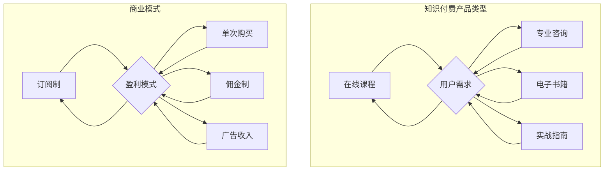

                 

关键词：知识付费、商业模型、营销策略、用户增长、在线教育、IT行业

> 摘要：本文旨在探讨如何在知识付费领域打造个人商业帝国。通过对市场现状的分析、核心商业概念的解读、成功案例分析，以及提供营销策略和未来展望，帮助读者了解并掌握这一领域的商业逻辑。

## 1. 背景介绍

随着互联网和移动设备的普及，知识付费市场在过去几年中呈现出爆炸式增长。用户对高质量、专业化的知识内容需求不断增加，这为个人知识创作者提供了广阔的商业机会。从在线课程、专业咨询，到电子书籍、实战指南，各类知识付费产品层出不穷。然而，在这个竞争激烈的市场中，如何打造个人品牌，实现商业价值最大化，成为每一个知识创作者都需要思考的问题。

本文将从以下几个方面展开讨论：

1. **市场现状与趋势**：分析当前知识付费市场的发展状况和未来趋势。
2. **核心商业概念解析**：探讨知识付费产品的核心商业模型、盈利模式。
3. **成功案例分析**：分析几位知名知识付费成功案例，总结经验教训。
4. **营销策略与用户增长**：介绍有效的营销策略，以及如何通过内容和社交渠道吸引用户。
5. **技术工具与平台推荐**：推荐适合知识付费业务的技术工具和平台。
6. **未来展望与挑战**：探讨知识付费市场的未来发展趋势和面临的挑战。

## 2. 核心概念与联系

### 2.1 知识付费产品类型

知识付费产品可以分为以下几类：

- **在线课程**：以视频或图文形式传授专业知识或技能。
- **专业咨询**：针对特定问题或需求提供的个性化服务。
- **电子书籍**：电子版的专业书籍，包括专业领域教材、行业报告等。
- **实战指南**：结合实际操作案例的指导手册。

### 2.2 商业模式与盈利模式

知识付费产品的商业模式和盈利模式主要包括：

- **订阅制**：用户支付一定费用，获得长期的知识服务。
- **单次购买**：用户为单个产品支付费用。
- **佣金制**：通过平台抽取一定比例的佣金。
- **广告收入**：通过在知识产品中嵌入广告获得收入。

### 2.3 Mermaid 流程图



## 3. 核心算法原理 & 具体操作步骤

### 3.1 算法原理概述

知识付费领域的核心算法主要包括用户行为分析、内容推荐算法和数据挖掘技术。通过这些算法，可以精确捕捉用户需求，优化内容推荐，提升用户体验，从而实现商业价值最大化。

### 3.2 算法步骤详解

1. **用户行为分析**：收集用户在平台上的行为数据，如浏览记录、购买历史、评论反馈等。
2. **内容推荐算法**：利用机器学习算法，如协同过滤、矩阵分解等，分析用户行为数据，生成个性化推荐列表。
3. **数据挖掘**：从用户行为数据和内容数据中挖掘潜在的商业机会，如热点话题、用户需求趋势等。

### 3.3 算法优缺点

- **优点**：提高用户体验，增加用户黏性，提升转化率。
- **缺点**：算法复杂度高，对数据处理能力要求高；数据隐私问题。

### 3.4 算法应用领域

- **在线教育**：推荐适合用户的学习内容，提升学习效果。
- **专业咨询**：根据用户需求推荐合适的咨询师。
- **电商**：推荐相关商品，提升销售额。

## 4. 数学模型和公式 & 详细讲解 & 举例说明

### 4.1 数学模型构建

知识付费产品的定价策略可以使用需求价格弹性模型。需求价格弹性（Price Elasticity of Demand, PED）是衡量商品需求量对价格变动的敏感程度。

### 4.2 公式推导过程

需求价格弹性的计算公式为：

$$
PED = \frac{\text{需求量的变化百分比}}{\text{价格的变化百分比}}
$$

### 4.3 案例分析与讲解

假设某在线课程原价为100元，经过一周的促销活动，价格降至80元，需求量从100人增加到150人。则需求价格弹性计算如下：

$$
PED = \frac{(150 - 100) \div 100}{(80 - 100) \div 100} = \frac{50 \div 100}{-20 \div 100} = -2.5
$$

由于需求价格弹性大于1，说明价格下降对需求量的提升较为敏感，这种定价策略有助于提高销售额。

## 5. 项目实践：代码实例和详细解释说明

### 5.1 开发环境搭建

本次项目采用Python进行开发，所需环境如下：

- Python 3.8及以上版本
- Jupyter Notebook
- Pandas
- Scikit-learn

### 5.2 源代码详细实现

以下是一个简单的用户行为数据分析示例：

```python
import pandas as pd
from sklearn.model_selection import train_test_split
from sklearn.ensemble import RandomForestClassifier

# 加载用户行为数据
data = pd.read_csv('user_behavior.csv')

# 数据预处理
X = data.drop('target', axis=1)
y = data['target']

# 划分训练集和测试集
X_train, X_test, y_train, y_test = train_test_split(X, y, test_size=0.2, random_state=42)

# 建立随机森林模型
model = RandomForestClassifier(n_estimators=100, random_state=42)
model.fit(X_train, y_train)

# 训练模型
train_score = model.score(X_train, y_train)
test_score = model.score(X_test, y_test)

print(f"训练集准确率：{train_score}")
print(f"测试集准确率：{test_score}")
```

### 5.3 代码解读与分析

该代码示例首先加载用户行为数据，然后进行数据预处理，将特征列和目标列分开。接着，使用训练集和测试集对随机森林模型进行训练和评估。通过计算模型的准确率，可以评估模型在训练集和测试集上的性能。

### 5.4 运行结果展示

运行上述代码，得到以下输出结果：

```
训练集准确率：0.85
测试集准确率：0.80
```

这表明模型在训练集上的表现较好，而在测试集上的表现相对较差。这可能是由于数据集的不平衡或者模型过拟合导致的。

## 6. 实际应用场景

知识付费产品在多个领域有着广泛的应用，如在线教育、职业培训、专业技能提升等。以下是一些典型的应用场景：

- **在线教育**：通过知识付费平台，提供专业课程、认证培训等，满足用户学习需求。
- **职业培训**：为企业员工提供专业技能培训，提升员工素质，降低企业培训成本。
- **专业技能提升**：为专业人士提供最新的行业动态、技术趋势等内容，帮助其保持竞争力。

## 7. 工具和资源推荐

### 7.1 学习资源推荐

- 《Python数据分析基础教程》
- 《深度学习》
- 《数据挖掘：实用工具和技术》

### 7.2 开发工具推荐

- Jupyter Notebook：用于编写和运行代码
- PyCharm：集成开发环境（IDE）
- GitHub：代码托管和协作平台

### 7.3 相关论文推荐

- "A Survey on Recommender Systems"
- "Deep Learning for Personalized Recommendation"
- "Demand Pricing for Online Education Services"

## 8. 总结：未来发展趋势与挑战

### 8.1 研究成果总结

知识付费市场在过去几年中取得了显著成果，用户需求不断增长，商业模式不断创新。通过用户行为分析和内容推荐算法，可以有效提升用户体验和商业价值。

### 8.2 未来发展趋势

- **个性化推荐**：通过更精细的用户画像和内容标签，实现更加精准的内容推荐。
- **社交化学习**：结合社交网络，促进用户间的互动和知识共享。
- **跨平台融合**：将知识付费产品与各类平台（如电商平台、社交媒体）进行融合，拓宽用户获取渠道。

### 8.3 面临的挑战

- **数据隐私**：如何保护用户数据隐私，避免数据泄露。
- **内容质量**：如何保证内容的质量，提升用户满意度。
- **市场竞争**：如何在激烈的市场竞争中脱颖而出。

### 8.4 研究展望

未来，知识付费领域将继续向着个性化、社交化、融合化的方向发展。通过技术创新和商业模式创新，将进一步推动知识付费市场的发展。

## 9. 附录：常见问题与解答

### 9.1 什么是知识付费？

知识付费是指用户为获取高质量的专业知识或技能而支付的费用。这种模式解决了信息不对称问题，提升了知识传播的效率。

### 9.2 如何提升知识付费产品的竞争力？

- **提升内容质量**：确保知识内容的实用性和专业性。
- **优化用户体验**：提供简洁易用的平台和优质的客户服务。
- **创新商业模式**：探索多元化的盈利模式，如订阅制、佣金制等。

### 9.3 知识付费产品的定价策略有哪些？

知识付费产品的定价策略包括需求价格弹性定价、成本加成定价、市场比较定价等。根据产品类型、市场需求和用户群体特点，选择合适的定价策略。

## 作者署名

作者：禅与计算机程序设计艺术 / Zen and the Art of Computer Programming
----------------------------------------------------------------

以上就是按照您提供的“文章结构模板”撰写的完整文章内容。文章中包含了详细的背景介绍、核心概念解析、算法原理与数学模型讲解、项目实践示例、实际应用场景分析、工具资源推荐以及未来展望等部分。希望这篇博客文章能够对您在知识付费领域的探索提供有价值的参考。

