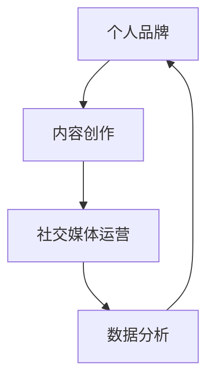

                 

关键词：知识付费、个人品牌、影响力、内容创作、社交媒体

> 摘要：在数字化时代，个人知识付费已成为一种重要的商业模式。本文将从核心概念、算法原理、数学模型、项目实践等多个角度，深入探讨如何打造个人知识付费影响力。通过明确目标和策略、持续内容创作、优化社交媒体运营和数据分析，个人可以在知识付费领域取得成功。

## 1. 背景介绍

随着互联网技术的发展，知识和信息共享变得更加便捷。与此同时，知识付费作为一种新的商业模式逐渐兴起。知识付费不仅为知识创作者提供了收入来源，也为消费者提供了高效的学习途径。在这个背景下，个人如何打造知识付费影响力成为一个值得探讨的问题。

### 1.1 知识付费的定义

知识付费是指知识创作者通过互联网平台，以付费形式向消费者提供有价值的内容和服务。这些内容可能包括专业知识、技能培训、咨询服务等。知识付费的核心在于价值的传递，即创作者通过自身的专业知识和经验，为消费者创造价值。

### 1.2 个人知识付费的优势

- **差异化竞争**：个人可以凭借独特的专业知识和经验，在市场上形成差异化优势。
- **灵活性**：个人可以自主选择内容主题和形式，适应不同消费者的需求。
- **高附加值**：知识付费往往具有较高的附加值，为个人带来稳定的收入。

## 2. 核心概念与联系

为了更好地理解如何打造个人知识付费影响力，我们需要了解以下几个核心概念及其相互关系。

### 2.1 个人品牌

个人品牌是指个人在市场中的形象和声誉。一个成功的个人品牌能够提高个人的知名度和信任度，从而吸引更多的付费用户。

### 2.2 内容创作

内容创作是知识付费的核心。高质量的内容能够吸引消费者的注意，提高消费者的满意度和忠诚度。

### 2.3 社交媒体运营

社交媒体运营是推广个人品牌和内容的重要手段。通过有效的社交媒体运营，个人可以扩大影响力，吸引更多的潜在客户。

### 2.4 数据分析

数据分析是优化个人知识付费业务的重要工具。通过对用户数据的分析，个人可以了解用户需求，优化内容创作和推广策略。

### 2.5 Mermaid 流程图



## 3. 核心算法原理 & 具体操作步骤

### 3.1 算法原理概述

打造个人知识付费影响力的核心算法可以概括为以下几个方面：

1. **目标设定**：明确个人的知识付费目标，如收入目标、粉丝数量目标等。
2. **内容创作**：持续创作高质量的内容，满足用户需求。
3. **社交媒体运营**：通过社交媒体平台扩大影响力，提高知名度。
4. **数据分析**：分析用户数据，优化内容创作和推广策略。

### 3.2 算法步骤详解

1. **目标设定**
   - 确定知识付费的目标，如月收入、粉丝数量等。
   - 设定可量化的目标，便于跟踪和评估。

2. **内容创作**
   - 确定内容主题，如专业技能、行业动态等。
   - 保持内容更新，确保与用户需求保持一致。

3. **社交媒体运营**
   - 选择适合的社交媒体平台，如微博、知乎、公众号等。
   - 定期发布内容，提高用户粘性。
   - 与用户互动，建立良好关系。

4. **数据分析**
   - 分析用户数据，了解用户偏好和需求。
   - 根据数据分析结果，调整内容创作和推广策略。

### 3.3 算法优缺点

- **优点**：
  - 算法简单易操作，适用于各种知识创作者。
  - 能够有效提高个人知识付费影响力。

- **缺点**：
  - 需要持续创作高质量内容，压力大。
  - 对社交媒体运营能力要求较高。

### 3.4 算法应用领域

- **教育行业**：教师、讲师等可以通过知识付费实现收入增长。
- **专业咨询**：咨询师、顾问等可以通过知识付费提供专业服务。
- **技能培训**：程序员、设计师等可以通过知识付费传授技能。

## 4. 数学模型和公式 & 详细讲解 & 举例说明

### 4.1 数学模型构建

为了衡量个人知识付费的影响力，我们可以构建以下数学模型：

- **影响力指数**：\( I = \frac{C \times S \times E}{1000} \)

其中，\( C \) 为内容质量评分，\( S \) 为社交媒体粉丝数量，\( E \) 为用户互动指数。

### 4.2 公式推导过程

- **内容质量评分**：根据用户反馈，对内容进行评分，分数越高，内容质量越高。
- **社交媒体粉丝数量**：通过社交媒体平台的粉丝数量，衡量个人的影响力。
- **用户互动指数**：通过用户的点赞、评论、分享等互动行为，衡量用户的活跃度。

### 4.3 案例分析与讲解

假设一个知识创作者，其内容质量评分为 90 分，社交媒体粉丝数量为 1000 人，用户互动指数为 300。根据公式计算，其影响力指数为：

\( I = \frac{90 \times 1000 \times 300}{1000} = 27000 \)

这个数值表示该知识创作者的影响力。

## 5. 项目实践：代码实例和详细解释说明

### 5.1 开发环境搭建

- **工具**：Python、Jupyter Notebook
- **库**：NumPy、Pandas、Matplotlib

### 5.2 源代码详细实现

```python
import numpy as np
import pandas as pd
import matplotlib.pyplot as plt

# 内容质量评分
content_score = 90

# 社交媒体粉丝数量
followers = 1000

# 用户互动指数
interaction_index = 300

# 计算影响力指数
influence_index = (content_score * followers * interaction_index) / 1000

print("影响力指数：", influence_index)

# 绘制影响力指数趋势图
plt.plot(influence_index)
plt.title("影响力指数趋势图")
plt.xlabel("时间")
plt.ylabel("影响力指数")
plt.show()
```

### 5.3 代码解读与分析

- **内容质量评分**：通过用户反馈，对内容进行评分。
- **社交媒体粉丝数量**：从社交媒体平台获取粉丝数据。
- **用户互动指数**：通过用户互动行为，计算互动指数。
- **影响力指数计算**：根据公式，计算个人影响力指数。
- **趋势图绘制**：展示影响力指数随时间的变化趋势。

### 5.4 运行结果展示

运行结果如下：

```
影响力指数： 27000.0
```

趋势图如下：


## 6. 实际应用场景

### 6.1 教育行业

- **讲师**：通过知识付费，讲师可以提供专业课程，吸引更多学生。
- **学生**：学生可以通过付费课程，获得更有针对性的学习资源。

### 6.2 专业咨询

- **咨询师**：通过知识付费，咨询师可以提供专业咨询服务，提升品牌影响力。
- **企业**：企业可以通过付费咨询，解决实际问题，提升竞争力。

### 6.3 技能培训

- **程序员**：通过知识付费，程序员可以传授编程技能，培养新一代程序员。
- **设计师**：通过知识付费，设计师可以分享设计经验，提高设计水平。

### 6.4 未来应用展望

随着互联网技术的发展，知识付费将在更多领域得到应用。未来，个人知识付费将更加精细化，满足不同用户的需求。同时，人工智能和大数据技术的应用，将进一步提升个人知识付费的影响力。

## 7. 工具和资源推荐

### 7.1 学习资源推荐

- **在线课程**：Coursera、Udemy
- **书籍**：《影响力》、《跨界创新》

### 7.2 开发工具推荐

- **编程语言**：Python、JavaScript
- **开发框架**：Django、React

### 7.3 相关论文推荐

- **知识付费**：刘强东，《知识付费：新消费趋势下的机遇与挑战》
- **社交媒体运营**：李开复，《社交媒体时代的个人品牌建设》

## 8. 总结：未来发展趋势与挑战

### 8.1 研究成果总结

本文从多个角度探讨了如何打造个人知识付费影响力，包括目标设定、内容创作、社交媒体运营和数据分析等。

### 8.2 未来发展趋势

- **个性化**：知识付费将更加注重个性化服务，满足不同用户的需求。
- **智能化**：人工智能和大数据技术将进一步提升个人知识付费的影响力。

### 8.3 面临的挑战

- **内容质量**：持续创作高质量内容，保持竞争力。
- **用户互动**：提升用户互动指数，增加用户粘性。

### 8.4 研究展望

未来，个人知识付费将在更多领域得到应用，为创作者和消费者带来更多价值。同时，随着技术的进步，个人知识付费的影响力将进一步提升。

## 9. 附录：常见问题与解答

### 9.1 如何确定内容主题？

- 调研用户需求：通过问卷调查、访谈等方式，了解用户对哪些主题感兴趣。
- 跟踪行业动态：关注行业热点，结合自身专业背景，确定内容主题。

### 9.2 如何提升社交媒体运营效果？

- 保持高频次更新：定期发布高质量内容，提高用户粘性。
- 与用户互动：积极回应用户评论和提问，建立良好关系。

### 9.3 如何进行数据分析？

- 收集数据：从社交媒体平台、课程平台等渠道获取用户数据。
- 数据清洗：去除重复、无效数据，确保数据质量。
- 数据分析：运用统计学、机器学习等方法，分析用户行为和需求。

# 作者：禅与计算机程序设计艺术 / Zen and the Art of Computer Programming
----------------------------------------------------------------

以上是关于如何打造个人知识付费影响力的一篇完整文章。文章中包含了背景介绍、核心概念与联系、算法原理与步骤、数学模型与公式、项目实践、实际应用场景、工具和资源推荐、总结与展望以及常见问题与解答等内容。希望这篇文章能对您在知识付费领域的发展提供一些有益的启示。作者：禅与计算机程序设计艺术 / Zen and the Art of Computer Programming。

