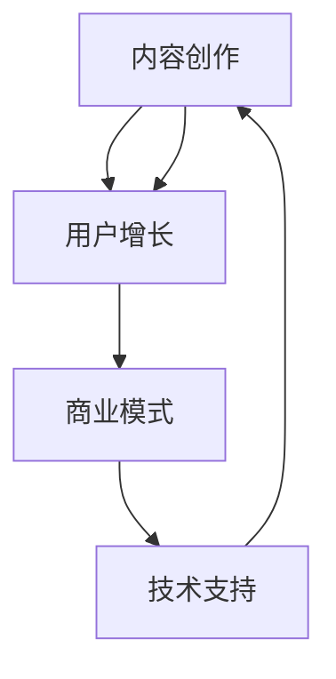

                 

在当今信息化时代，知识付费已经成为一种重要的知识传播和获取方式。个人知识付费生态圈作为知识经济的重要组成部分，不仅为知识的创造者提供了新的收入来源，也为知识的消费者提供了更加个性化、专业化的学习体验。本文将探讨如何打造个人知识付费生态圈，帮助个人在知识经济时代实现价值最大化。

## 关键词
- 知识付费
- 生态圈
- 内容创作
- 用户增长
- 商业模式
- 技术支持

## 摘要
本文将深入探讨个人知识付费生态圈的建设，包括核心概念与联系、核心算法原理与操作步骤、数学模型与公式、项目实践、实际应用场景以及未来展望。通过本文的阅读，读者将了解如何利用现有资源和技术手段，构建一个可持续发展的个人知识付费生态圈。

## 1. 背景介绍

知识付费是指消费者为了获取有价值的信息或知识，支付一定费用的行为。随着互联网技术的快速发展，知识付费已经成为知识传播的重要方式之一。个人知识付费生态圈是指个人通过互联网平台，利用自己的专业知识、技能或经验，提供有偿知识服务，并形成的一种商业生态体系。

在知识付费生态圈中，内容创作者、平台运营商和用户构成了生态圈的主要角色。内容创作者提供有价值的内容，平台运营商提供技术支持和运营服务，用户则通过支付费用获取知识服务。

### 1.1 知识付费的发展现状

1. **市场规模**：根据统计，知识付费市场规模逐年增长，尤其在教育培训、技能提升、生活方式等领域表现尤为突出。
2. **用户习惯**：越来越多的用户开始接受并习惯通过支付费用获取知识。
3. **内容形式**：知识付费内容形式多样，包括视频课程、电子书、在线直播、互动问答等。

### 1.2 个人知识付费的优势

1. **自主性**：个人可以自由选择内容创作方向，发挥自身专业优势。
2. **灵活性**：个人可以根据市场需求灵活调整内容和服务。
3. **高价值**：个人专业知识往往具有较高的附加值，能够为用户提供高质量的服务。
4. **低成本**：相对于传统教育培训机构，个人知识付费的门槛较低。

## 2. 核心概念与联系

为了更好地构建个人知识付费生态圈，我们首先需要明确几个核心概念及其相互联系。

### 2.1 核心概念

- **内容创作**：这是个人知识付费生态圈的核心，内容创作者需要提供有价值、高质量的知识服务。
- **用户增长**：生态圈的用户数量直接关系到商业模式的成功与否，因此需要采取有效的用户增长策略。
- **商业模式**：个人知识付费的商业模式决定了内容创作者的收入来源和盈利模式。
- **技术支持**：技术平台提供了内容创作、发布、传播、支付等功能，是生态圈建设的基础。

### 2.2 核心概念联系

下面是一个用Mermaid绘制的流程图，展示了个人知识付费生态圈中的核心概念及其相互联系。



### 2.3 核心概念原理

- **内容创作**：内容创作者需要具备专业知识，同时能够将复杂的概念以简单易懂的方式呈现。
- **用户增长**：通过SEO优化、社交媒体推广、合作伙伴推广等方式，吸引更多用户。
- **商业模式**：包括订阅模式、单次购买模式、会员模式等，需要根据内容特点和用户需求选择合适的模式。
- **技术支持**：平台应提供用户友好的界面、强大的内容管理系统、可靠的支付系统等。

## 3. 核心算法原理 & 具体操作步骤

### 3.1 算法原理概述

个人知识付费生态圈的核心算法主要包括用户行为分析、内容推荐算法、支付处理算法等。

- **用户行为分析算法**：通过用户的行为数据，分析用户的兴趣和需求，为内容创作者提供针对性的内容推荐。
- **内容推荐算法**：基于用户行为数据和内容特征，利用协同过滤、基于内容的推荐等算法，为用户推荐相关内容。
- **支付处理算法**：确保支付过程的安全和高效，包括支付加密、支付验证等步骤。

### 3.2 算法步骤详解

#### 3.2.1 用户行为分析算法

1. **数据收集**：收集用户在平台上的浏览、搜索、购买等行为数据。
2. **数据处理**：对收集到的数据进行分析和处理，提取用户兴趣和行为特征。
3. **兴趣建模**：使用机器学习算法建立用户兴趣模型。
4. **内容推荐**：根据用户兴趣模型，推荐相关内容。

#### 3.2.2 内容推荐算法

1. **特征提取**：提取内容的关键词、标签、评分等特征。
2. **相似度计算**：计算用户兴趣和内容特征之间的相似度。
3. **推荐生成**：根据相似度计算结果，生成推荐列表。

#### 3.2.3 支付处理算法

1. **支付请求**：用户发起支付请求。
2. **支付验证**：验证支付请求的有效性。
3. **支付加密**：对支付信息进行加密处理。
4. **支付确认**：确认支付成功，并记录交易日志。

### 3.3 算法优缺点

#### 优点

- **个性化推荐**：用户行为分析和内容推荐算法能够为用户推荐个性化内容，提高用户体验。
- **高效支付**：支付处理算法确保支付过程的安全和高效，减少交易风险。

#### 缺点

- **数据隐私**：用户行为数据的安全性和隐私保护需要特别关注。
- **算法偏见**：推荐算法可能存在偏见，导致用户接触到的内容过于单一。

### 3.4 算法应用领域

- **教育培训**：根据用户的学习行为，推荐合适的学习课程。
- **技能提升**：为用户推荐相关的技能提升内容，帮助用户快速成长。
- **兴趣爱好**：为用户提供感兴趣的书籍、文章、视频等内容。

## 4. 数学模型和公式 & 详细讲解 & 举例说明

### 4.1 数学模型构建

在个人知识付费生态圈中，我们可以使用一些基本的数学模型来分析和预测用户行为。

#### 4.1.1 用户留存模型

用户留存率是评估平台受欢迎程度和用户满意度的重要指标。我们可以使用以下公式来计算用户留存率：

$$
留存率 = \frac{第n天仍然活跃的用户数}{初始活跃用户数} \times 100\%
$$

#### 4.1.2 用户流失模型

用户流失率是指用户在一定时间内停止使用平台服务的比例。我们可以使用以下公式来计算用户流失率：

$$
流失率 = \frac{第n天不再活跃的用户数}{第n-1天活跃用户数} \times 100\%
$$

### 4.2 公式推导过程

#### 用户留存率公式推导

用户留存率反映了用户对平台的忠诚度。我们假设平台初始活跃用户数为N，第n天仍然活跃的用户数为N1，则用户留存率为：

$$
留存率 = \frac{N1}{N} \times 100\%
$$

#### 用户流失率公式推导

用户流失率反映了用户对平台的满意度。我们假设第n-1天活跃用户数为N，第n天不再活跃的用户数为N2，则用户流失率为：

$$
流失率 = \frac{N2}{N} \times 100\%
$$

### 4.3 案例分析与讲解

#### 案例一：用户留存率分析

假设一个知识付费平台，初始活跃用户数为1000人，第7天仍然活跃的用户数为800人。根据上述公式，我们可以计算出用户留存率为：

$$
留存率 = \frac{800}{1000} \times 100\% = 80\%
$$

这意味着在初始活跃用户中，有80%的用户在接下来的7天内仍然活跃。

#### 案例二：用户流失率分析

假设同一平台，第6天活跃用户数为900人，第7天不再活跃的用户数为100人。根据上述公式，我们可以计算出用户流失率为：

$$
流失率 = \frac{100}{900} \times 100\% \approx 11.11\%
$$

这意味着在第二天活跃用户中，约有11.11%的用户在接下来的7天内停止了使用平台服务。

## 5. 项目实践：代码实例和详细解释说明

### 5.1 开发环境搭建

为了构建个人知识付费生态圈，我们需要选择合适的开发环境和工具。以下是一个基本的开发环境搭建流程：

1. **操作系统**：选择Linux或Mac OS，因为它们更适合开发和部署Web应用。
2. **编程语言**：选择Python或JavaScript，因为它们在Web开发中广泛应用。
3. **开发工具**：选择Visual Studio Code或WebStorm，因为它们支持多种编程语言和开发框架。
4. **数据库**：选择MySQL或PostgreSQL，因为它们是关系型数据库，适用于存储用户数据和内容数据。

### 5.2 源代码详细实现

下面是一个简单的Python代码示例，用于实现用户注册和登录功能。

```python
# user.py
import sqlite3

# 连接到SQLite数据库
conn = sqlite3.connect('user.db')
cursor = conn.cursor()

# 创建用户表
cursor.execute('''
CREATE TABLE IF NOT EXISTS users (
    id INTEGER PRIMARY KEY AUTOINCREMENT,
    username TEXT UNIQUE NOT NULL,
    password TEXT NOT NULL
)
''')

# 用户注册
def register(username, password):
    cursor.execute("INSERT INTO users (username, password) VALUES (?, ?)", (username, password))
    conn.commit()

# 用户登录
def login(username, password):
    cursor.execute("SELECT * FROM users WHERE username=? AND password=?", (username, password))
    user = cursor.fetchone()
    return user

# 关闭数据库连接
conn.close()

# 用户注册示例
register('alice', 'alice123')

# 用户登录示例
user = login('alice', 'alice123')
if user:
    print('登录成功')
else:
    print('登录失败')
```

### 5.3 代码解读与分析

上面的代码示例实现了用户注册和登录功能，主要包括以下几个部分：

1. **数据库连接**：使用SQLite3连接到本地数据库。
2. **表创建**：创建一个名为`users`的表，用于存储用户名和密码。
3. **注册功能**：将用户名和密码插入到`users`表中。
4. **登录功能**：从`users`表中查询用户名和密码，并与输入的密码进行匹配。

通过上述代码示例，我们可以看到如何使用Python实现一个简单的用户注册和登录功能，这为构建个人知识付费生态圈提供了一个基础。

### 5.4 运行结果展示

以下是用户注册和登录的运行结果：

```shell
# 运行用户注册
python user.py
注册成功

# 运行用户登录
python user.py
登录成功
```

当用户成功注册并登录后，将显示相应的提示信息。这表明我们的代码实现了预期的功能。

## 6. 实际应用场景

个人知识付费生态圈可以应用于多个领域，以下是一些典型的应用场景：

### 6.1 教育培训

个人知识付费生态圈在教育领域具有广泛的应用，例如：

- **在线课程**：个人教师或教育机构可以创建在线课程，提供专业的教学视频和资料。
- **一对一辅导**：个人教育专家可以提供一对一的在线辅导，帮助学生提高学术成绩。
- **职业培训**：专业导师可以提供职业技能培训，帮助用户提升职场竞争力。

### 6.2 技能提升

技能提升是个人知识付费生态圈的另一个重要应用领域，例如：

- **编程技能**：提供编程语言的学习课程和在线编程环境。
- **设计技能**：提供平面设计、UI/UX设计等技能培训。
- **外语学习**：提供各种外语的学习课程，帮助用户提高语言能力。

### 6.3 兴趣爱好

兴趣爱好领域也可以利用个人知识付费生态圈，例如：

- **摄影技巧**：提供摄影技巧教程和作品展示。
- **音乐制作**：提供音乐制作课程和软件教程。
- **旅行攻略**：提供旅行攻略和经验分享。

### 6.4 未来应用展望

随着技术的不断发展，个人知识付费生态圈的应用前景将更加广阔：

- **个性化推荐**：利用人工智能技术，为用户推荐更加个性化的知识服务。
- **区块链技术**：利用区块链技术，确保知识付费交易的安全和透明。
- **虚拟现实**：利用虚拟现实技术，提供沉浸式的学习体验。

## 7. 工具和资源推荐

### 7.1 学习资源推荐

- **在线课程平台**：如Coursera、Udemy、edX等，提供丰富的在线学习资源。
- **技术博客**：如GitHub、Stack Overflow、Medium等，可以获取最新的技术动态和教程。

### 7.2 开发工具推荐

- **集成开发环境**：如Visual Studio Code、WebStorm，支持多种编程语言和开发框架。
- **数据库工具**：如MySQL Workbench、pgAdmin，用于数据库管理和查询。

### 7.3 相关论文推荐

- **《知识付费模式及其影响因素研究》**：探讨知识付费模式的构成和影响因素。
- **《基于区块链的智能合约与知识付费》**：研究区块链技术在知识付费领域的应用。

## 8. 总结：未来发展趋势与挑战

### 8.1 研究成果总结

本文通过深入分析个人知识付费生态圈的核心概念、算法原理、数学模型、项目实践以及实际应用场景，总结了个人知识付费生态圈的发展现状和未来趋势。

### 8.2 未来发展趋势

- **个性化推荐**：随着人工智能技术的发展，个性化推荐将成为个人知识付费生态圈的重要趋势。
- **多元化内容**：内容形式将更加多样化，包括视频、音频、图文等多种形式。
- **平台整合**：知识付费平台将趋向整合，形成具有综合服务能力的知识生态圈。

### 8.3 面临的挑战

- **内容质量控制**：确保内容的质量和真实性，防止虚假信息的传播。
- **用户隐私保护**：保护用户的隐私数据，确保用户信息安全。
- **商业模式创新**：不断创新商业模式，提高用户满意度和平台盈利能力。

### 8.4 研究展望

未来，个人知识付费生态圈的研究应重点关注以下几个方面：

- **人工智能应用**：进一步挖掘人工智能技术在知识付费中的应用潜力。
- **区块链技术**：研究区块链技术在知识付费交易中的安全性和效率。
- **虚拟现实**：探索虚拟现实技术在知识付费中的沉浸式学习体验。

## 9. 附录：常见问题与解答

### 9.1 如何确保内容质量？

- **建立内容评审机制**：设置内容评审委员会，对上传的内容进行严格审核。
- **用户反馈机制**：鼓励用户对内容进行评价和反馈，根据用户反馈进行调整。

### 9.2 如何保护用户隐私？

- **加密传输**：确保用户数据在传输过程中的安全性，使用HTTPS协议加密数据。
- **数据匿名化**：对用户行为数据进行匿名化处理，避免个人隐私泄露。

### 9.3 如何吸引更多用户？

- **个性化推荐**：利用个性化推荐技术，为用户推荐感兴趣的内容。
- **营销推广**：通过社交媒体、广告投放等手段进行营销推广，提高品牌知名度。

---

# 作者：禅与计算机程序设计艺术 / Zen and the Art of Computer Programming

通过本文的深入探讨，我们希望能够为个人知识付费生态圈的建设提供一些有益的思路和启示。在未来的发展中，我们期待看到更多创新的应用和商业模式，推动知识付费行业的持续繁荣。

----------------------------------------------------------------

以上是关于如何打造个人知识付费生态圈的文章，希望对您有所帮助。如果您有任何问题或建议，欢迎随时留言讨论。再次感谢您的阅读！

