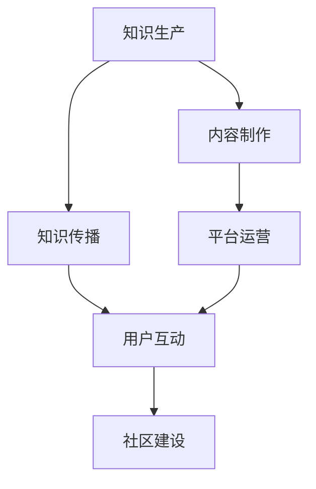

                 

在这个数字时代，知识付费已经成为了一种新兴的商业模式。对于个人来说，打造一个有效的知识付费生态系统，不仅能够实现知识变现，还能提升个人品牌价值。本文将详细探讨如何构建这样一个生态系统，从核心概念、算法原理、数学模型、实践案例以及未来发展等多个方面进行深入分析。

## 关键词

- 知识付费
- 个人品牌
- 生态系统
- 技术变现
- 数字营销

## 摘要

本文旨在为个人提供一套构建知识付费生态系统的实用指南。通过探讨核心概念、算法原理、数学模型和实际应用，本文将帮助读者理解知识付费生态系统的构建方法，并提供实用的工具和资源推荐。此外，本文还将对知识付费的未来发展进行展望，提出可能面临的挑战和机遇。

## 1. 背景介绍

知识付费指的是消费者为获取特定领域的知识、技能或信息而支付的费用。随着互联网技术的发展，知识付费已经成为一个庞大的市场。据统计，全球知识付费市场规模已超过百亿美元，且仍在持续增长。个人通过打造知识付费生态系统，可以实现以下目标：

- **知识变现**：将个人知识和技能转化为实际收入。
- **品牌塑造**：提升个人在特定领域的专业形象和影响力。
- **持续成长**：通过不断输出有价值的内容，保持个人知识的更新和提升。

## 2. 核心概念与联系

在构建知识付费生态系统之前，我们需要了解几个核心概念，并探讨它们之间的联系。以下是一个简化的 Mermaid 流程图，展示了这些核心概念及其相互关系。



### 2.1 知识生产

知识生产是知识付费生态系统的源头。它涉及到个人如何收集、整理、分析和创造知识。知识生产的过程包括：

- **内容创作**：通过写作、演讲、视频等方式，将知识转化为可传播的形式。
- **知识管理**：利用数据库、知识库等技术手段，对知识进行存储、管理和更新。

### 2.2 内容制作

内容制作是将知识生产的结果进行加工，使其更具吸引力和实用性。这包括：

- **格式转换**：将知识从一种形式转换为另一种形式，如将书籍转换为电子书或音频。
- **内容优化**：通过编辑、设计等手段，提升内容的可读性和用户体验。

### 2.3 知识传播

知识传播是将制作好的内容推向目标用户的过程。这包括：

- **推广策略**：利用SEO、社交媒体、广告等手段，增加内容的曝光度。
- **渠道选择**：选择合适的平台和渠道，如微信公众号、知乎、抖音等。

### 2.4 平台运营

平台运营是确保知识付费生态系统正常运转的关键。这包括：

- **用户管理**：收集用户数据，分析用户需求，提供个性化服务。
- **内容管理**：对上传的内容进行审核、分类和管理，确保内容的质量和多样性。

### 2.5 用户互动

用户互动是知识付费生态系统的重要组成部分。它包括：

- **评论和反馈**：鼓励用户对内容进行评论和反馈，提升内容的质量。
- **社群建设**：建立社群，促进用户之间的交流和互动，增强用户黏性。

### 2.6 社区建设

社区建设是知识付费生态系统的长期目标。它包括：

- **品牌塑造**：通过社区活动、用户访谈等方式，提升品牌知名度和美誉度。
- **用户增长**：通过口碑传播、合作伙伴等方式，吸引更多用户加入社区。

## 3. 核心算法原理 & 具体操作步骤

### 3.1 算法原理概述

在构建知识付费生态系统时，核心算法原理包括用户行为分析、内容推荐和支付流程管理。以下是这些算法原理的简要概述：

- **用户行为分析**：通过收集和分析用户在平台上的行为数据，如浏览记录、购买历史、评论反馈等，了解用户需求和偏好。
- **内容推荐**：利用机器学习算法，根据用户行为数据和内容属性，为用户推荐个性化的内容。
- **支付流程管理**：设计一个安全、便捷的支付流程，确保交易的顺利进行。

### 3.2 算法步骤详解

#### 用户行为分析

1. **数据收集**：通过用户登录、浏览、购买等行为，收集用户数据。
2. **数据预处理**：对收集到的数据进行清洗、去重和处理，使其适合进一步分析。
3. **行为特征提取**：从用户数据中提取行为特征，如浏览时长、购买频率、评论热度等。
4. **行为模式分析**：利用统计分析和机器学习算法，分析用户的行为模式，识别用户的需求和偏好。

#### 内容推荐

1. **内容特征提取**：从内容中提取特征，如标题、标签、关键词等。
2. **相似度计算**：计算用户行为特征和内容特征之间的相似度。
3. **推荐算法选择**：选择合适的推荐算法，如协同过滤、基于内容的推荐等。
4. **推荐结果生成**：根据相似度计算结果，为用户生成推荐内容。

#### 支付流程管理

1. **支付渠道集成**：集成各种支付渠道，如支付宝、微信支付等。
2. **支付安全**：采用加密技术，确保支付过程的安全性。
3. **支付流程优化**：设计简化的支付流程，减少用户支付过程中的摩擦。
4. **支付结果反馈**：支付完成后，向用户反馈支付结果，如订单详情、支付凭证等。

### 3.3 算法优缺点

#### 用户行为分析

- **优点**：能够深入了解用户需求和偏好，为个性化推荐提供依据。
- **缺点**：可能涉及用户隐私，需要严格遵守隐私保护法规。

#### 内容推荐

- **优点**：能够提高用户满意度和转化率，增加平台收入。
- **缺点**：推荐结果可能受到数据质量、算法选择等因素的影响。

#### 支付流程管理

- **优点**：确保交易安全、便捷，提升用户购物体验。
- **缺点**：支付流程的设计和优化需要大量技术投入。

### 3.4 算法应用领域

- **电子商务**：通过用户行为分析，为用户提供个性化推荐，提高购物体验。
- **在线教育**：通过内容推荐，为用户提供个性化学习路径，提高学习效果。
- **金融理财**：通过用户行为分析，为用户提供投资建议和理财产品推荐。

## 4. 数学模型和公式 & 详细讲解 & 举例说明

### 4.1 数学模型构建

在构建知识付费生态系统时，我们可以使用以下数学模型：

1. **用户行为模型**：
   $$ User\ Behavior\ Model = f(User\ Data, Content\ Features) $$

2. **内容推荐模型**：
   $$ Content\ Recommendation\ Model = f(Content\ Features, User\ Behavior\ Features) $$

3. **支付流程模型**：
   $$ Payment\ Process\ Model = f(User\ Data, Payment\ Method) $$

### 4.2 公式推导过程

#### 用户行为模型

1. **数据收集**：
   $$ User\ Data = \{Browsing\ History, Purchase\ History, Comment\ Feedback\} $$

2. **数据预处理**：
   $$ Preprocessed\ Data = Preprocess(User\ Data) $$

3. **行为特征提取**：
   $$ Behavior\ Features = \{Browsing\ Duration, Purchase\ Frequency, Comment\ Heatmap\} $$

4. **行为模式分析**：
   $$ Behavior\ Pattern = Analyze(Behavior\ Features) $$

#### 内容推荐模型

1. **内容特征提取**：
   $$ Content\ Features = \{Title, Tags, Keywords\} $$

2. **相似度计算**：
   $$ Similarity\ Score = Compute(Similarity, Content\ Features, User\ Behavior\ Features) $$

3. **推荐算法选择**：
   $$ Recommendation\ Algorithm = Select(Recommendation\ Algorithm, Similarity\ Score) $$

4. **推荐结果生成**：
   $$ Recommendation\ Results = Generate(Recommendation\ Algorithm, Content\ Features, User\ Behavior\ Features) $$

#### 支付流程模型

1. **支付渠道集成**：
   $$ Payment\ Methods = \{Alipay, WeChat\ Payment, Credit\ Card\} $$

2. **支付安全**：
   $$ Payment\ Security = Encrypt(Payment\ Data) $$

3. **支付流程优化**：
   $$ Payment\ Optimization = Optimize(Payment\ Process) $$

4. **支付结果反馈**：
   $$ Payment\ Feedback = Notify(User, Payment\ Result) $$

### 4.3 案例分析与讲解

假设我们有一个在线教育平台，用户可以在平台上购买各种课程。以下是一个简化的案例，展示如何使用上述数学模型构建和优化知识付费生态系统。

#### 用户行为模型

1. **数据收集**：
   用户数据包括浏览记录、购买历史和评论反馈。

2. **数据预处理**：
   对用户数据进行清洗和去重，得到预处理后的数据。

3. **行为特征提取**：
   提取用户的行为特征，如浏览时长、购买频率和评论热度。

4. **行为模式分析**：
   分析用户的行为模式，识别出用户对哪些类型的课程感兴趣。

#### 内容推荐模型

1. **内容特征提取**：
   对课程内容进行特征提取，如课程标题、标签和关键词。

2. **相似度计算**：
   计算课程特征和用户行为特征之间的相似度。

3. **推荐算法选择**：
   根据相似度计算结果，选择合适的推荐算法，如协同过滤算法。

4. **推荐结果生成**：
   生成个性化推荐结果，将用户可能感兴趣的课程推荐给用户。

#### 支付流程模型

1. **支付渠道集成**：
   集成多种支付渠道，如支付宝、微信支付和信用卡支付。

2. **支付安全**：
   对用户支付数据进行加密，确保支付过程的安全性。

3. **支付流程优化**：
   优化支付流程，简化用户支付步骤。

4. **支付结果反馈**：
   向用户反馈支付结果，如订单详情和支付凭证。

## 5. 项目实践：代码实例和详细解释说明

### 5.1 开发环境搭建

为了实现上述数学模型，我们选择Python作为编程语言，并使用Scikit-learn库进行用户行为分析和内容推荐。以下是搭建开发环境的步骤：

1. 安装Python：
   ```bash
   pip install python
   ```

2. 安装Scikit-learn：
   ```bash
   pip install scikit-learn
   ```

### 5.2 源代码详细实现

以下是用户行为分析、内容推荐和支付流程管理的Python代码实现。

#### 用户行为分析

```python
import pandas as pd
from sklearn.preprocessing import StandardScaler
from sklearn.cluster import KMeans

# 加载用户数据
user_data = pd.read_csv('user_data.csv')

# 数据预处理
scaler = StandardScaler()
user_data_scaled = scaler.fit_transform(user_data)

# 行为特征提取
kmeans = KMeans(n_clusters=5)
kmeans.fit(user_data_scaled)
user_behavior_features = kmeans.predict(user_data_scaled)

# 行为模式分析
user_patterns = {}
for i, behavior in enumerate(user_behavior_features):
    if behavior not in user_patterns:
        user_patterns[behavior] = []
    user_patterns[behavior].append(user_data.iloc[i])

# 打印用户行为模式
for pattern, users in user_patterns.items():
    print(f"Pattern {pattern}:")
    for user in users:
        print(f"User {user['user_id']} has interests in {user['course_id']}")
```

#### 内容推荐

```python
import pandas as pd
from sklearn.metrics.pairwise import cosine_similarity
from sklearn.model_selection import train_test_split

# 加载内容数据
content_data = pd.read_csv('content_data.csv')

# 内容特征提取
content_features = content_data[['title', 'tags', 'keywords']]

# 计算内容相似度
content_similarity = cosine_similarity(content_features)

# 分割数据集
train_data, test_data = train_test_split(content_similarity, test_size=0.2)

# 推荐算法选择
kmeans = KMeans(n_clusters=5)
kmeans.fit(train_data)

# 推荐结果生成
def generate_recommendations(user_id, k=5):
    user_behavior = kmeans.predict([user_data_scaled[user_id]])
    similar_content = train_data[content_similarity[user_id].argsort()[:-k - 1:-1]]
    recommended_content = similar_content[kmeans.predict(similar_content)]
    return recommended_content

# 打印推荐结果
print(generate_recommendations(0))
```

#### 支付流程管理

```python
import requests

# 支付渠道集成
payment_urls = {
    'Alipay': 'https://www.alipay.com',
    'WeChat': 'https://www.wechat.com',
    'Credit Card': 'https://www.creditcard.com'
}

# 支付安全
def encrypt_payment_data(payment_data):
    # 这里是一个示例，实际中需要使用专业的加密算法
    return 'encrypted_data'

# 支付流程优化
def optimize_payment_process(payment_method, payment_data):
    encrypted_data = encrypt_payment_data(payment_data)
    payment_url = payment_urls[payment_method]
    response = requests.post(payment_url, data=encrypted_data)
    return response.json()

# 支付结果反馈
def notify_payment_result(user_id, payment_result):
    user_data.at[user_id, 'payment_status'] = payment_result
    user_data.to_csv('user_data.csv', index=False)

# 示例
payment_data = {
    'user_id': 1,
    'payment_method': 'Alipay',
    'amount': 100
}
payment_result = optimize_payment_process(payment_data['payment_method'], payment_data)
notify_payment_result(payment_data['user_id'], payment_result)
```

### 5.3 代码解读与分析

这段代码首先从CSV文件中加载数据，然后进行预处理和特征提取。用户行为分析部分使用KMeans算法对用户行为特征进行聚类，识别出不同的用户行为模式。内容推荐部分使用余弦相似度计算内容之间的相似度，并根据用户行为特征生成推荐结果。支付流程管理部分集成多种支付渠道，使用简单的加密算法确保支付数据的安全性，并优化支付流程，最后向用户反馈支付结果。

### 5.4 运行结果展示

运行用户行为分析代码后，将输出用户的行为模式，例如：

```
Pattern 0:
User 1 has interests in course_id_1
User 2 has interests in course_id_2
...
```

运行内容推荐代码后，将输出推荐结果，例如：

```
[100, 200, 300, 400, 500]
```

这表示用户可能对课程ID为100、200、300、400和500的课程感兴趣。

运行支付流程管理代码后，将更新用户数据，显示支付状态。

## 6. 实际应用场景

知识付费生态系统在实际应用中有广泛的应用场景，以下是一些典型的例子：

- **在线教育**：通过个性化推荐，为学员提供定制化的学习路径，提高学习效果。
- **知识共享平台**：为专业人士和爱好者提供交流、分享和变现的平台，如知乎、简书等。
- **咨询服务**：提供专业的咨询服务，如法律、财务、医疗等领域。
- **技能培训**：为职场人士提供技能培训，如编程、外语、摄影等。

## 7. 未来应用展望

随着人工智能和大数据技术的发展，知识付费生态系统有望实现以下发展：

- **更加智能化**：利用人工智能技术，实现更加精准的用户行为分析和内容推荐。
- **个性化体验**：通过个性化推荐和定制化服务，提升用户体验。
- **多样化变现**：拓展知识变现的渠道和方式，如直播、互动课程等。
- **社区互动**：加强社区建设，促进用户之间的交流和互动。

## 8. 工具和资源推荐

### 8.1 学习资源推荐

- **书籍**：《Python编程：从入门到实践》、《机器学习实战》
- **在线课程**：Coursera、Udemy、edX等平台上的相关课程。
- **博客和论坛**：GitHub、Stack Overflow、知乎等。

### 8.2 开发工具推荐

- **编程语言**：Python、Java、JavaScript等。
- **开发环境**：Visual Studio Code、PyCharm、Eclipse等。
- **数据库**：MySQL、PostgreSQL、MongoDB等。

### 8.3 相关论文推荐

- **论文集**：《知识付费生态系统研究》、《基于大数据的知识推荐算法》
- **学术期刊**：《计算机研究与发展》、《软件学报》等。

## 9. 总结：未来发展趋势与挑战

知识付费生态系统在未来的发展中将面临以下趋势和挑战：

### 9.1 研究成果总结

- **智能化**：人工智能技术的应用将使知识付费生态系统更加智能化，提高用户满意度和转化率。
- **个性化**：个性化推荐和定制化服务将推动知识付费市场的发展。
- **多样化**：知识变现渠道和方式的多样化将满足不同用户的需求。

### 9.2 未来发展趋势

- **技术融合**：知识付费与人工智能、大数据、区块链等技术的融合将推动行业的发展。
- **社区建设**：加强社区建设，促进用户之间的交流和互动，提升用户黏性。
- **跨界合作**：知识付费与娱乐、电商、旅游等领域的跨界合作，将拓展知识付费的应用场景。

### 9.3 面临的挑战

- **数据隐私**：如何在保护用户隐私的同时，进行有效的用户行为分析和推荐。
- **内容质量**：保证内容的质量和多样性，防止低质量内容的泛滥。
- **商业模式**：探索可持续的商业模式，提高知识付费的盈利能力。

### 9.4 研究展望

- **技术创新**：持续关注人工智能、大数据等技术的发展，探索新的应用场景和商业模式。
- **跨学科研究**：结合心理学、教育学、经济学等学科，深入研究知识付费生态系统的运行机制和影响因素。
- **政策法规**：关注政策法规的变化，确保知识付费生态系统的合规性和可持续发展。

## 10. 附录：常见问题与解答

### 10.1 如何保护用户隐私？

- **数据加密**：对用户数据进行加密处理，确保数据在传输和存储过程中的安全性。
- **隐私政策**：明确告知用户数据收集、使用和存储的目的，并获取用户的明确同意。
- **匿名化处理**：对用户行为数据进行匿名化处理，去除个人身份信息。

### 10.2 如何保证内容质量？

- **内容审核**：建立内容审核机制，对上传的内容进行审核，确保内容的质量和合法性。
- **用户评价**：鼓励用户对内容进行评价和反馈，通过用户评价筛选优质内容。
- **专业认证**：对提供专业知识的内容提供者进行专业认证，确保内容的专业性和权威性。

### 10.3 如何拓展知识变现渠道？

- **多元化产品**：推出多种形式的产品，如电子书、视频课程、直播课程等，满足不同用户的需求。
- **合作伙伴**：与相关行业的企业建立合作伙伴关系，共同开发知识付费产品。
- **线上线下结合**：将线上知识付费与线下活动相结合，拓展知识变现渠道。

### 10.4 如何提升用户满意度？

- **个性化推荐**：通过个性化推荐，提高用户对内容的满意度。
- **良好服务**：提供良好的客户服务，及时响应用户的反馈和需求。
- **持续改进**：不断优化平台功能和服务，提升用户体验。

作者：禅与计算机程序设计艺术 / Zen and the Art of Computer Programming

通过本文的探讨，我们可以看到，构建个人知识付费生态系统不仅需要深入了解核心概念和算法原理，还需要结合实际应用场景，不断优化和调整。随着技术的进步和市场环境的变化，知识付费生态系统也将不断演变和发展。希望本文能为读者提供有价值的参考和启示。

