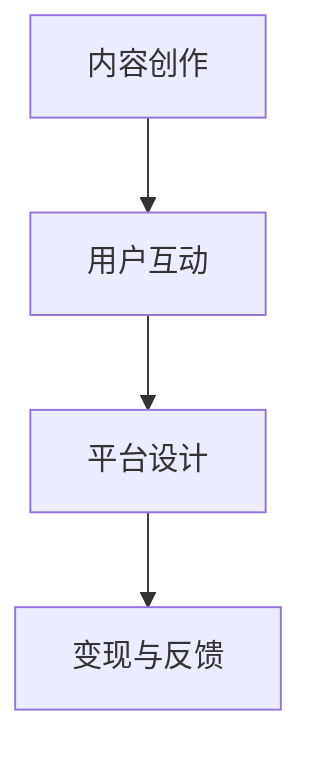

                 

关键词：知识付费、个人品牌、内容创作、用户互动、生态系统设计

> 摘要：本文将探讨如何打造一个个人知识付费生态系统，从内容创作、用户互动、平台设计等多个方面，提供一整套策略和方法，帮助个人在知识付费领域取得成功。

## 1. 背景介绍

随着互联网的普及和信息爆炸，知识付费逐渐成为了一股不可忽视的潮流。越来越多的人愿意为有价值的内容和服务付费，这为个人提供了新的商业机会。然而，如何在竞争激烈的市场中脱颖而出，建立自己的知识付费生态系统，成为了许多知识达人、内容创作者和企业所面临的问题。

本文将探讨如何打造个人知识付费生态系统，包括内容创作、用户互动、平台设计等方面，旨在提供一套完整的策略和方法，帮助个人在知识付费领域取得成功。

## 2. 核心概念与联系

### 2.1 个人知识付费生态系统的概念

个人知识付费生态系统是指个人基于自身知识和技能，通过内容创作、用户互动、平台运营等环节，实现知识价值的传递和变现的系统。

### 2.2 个人知识付费生态系统的组成部分

- 内容创作：包括知识、技能、经验等有价值的信息。
- 用户互动：建立用户关系，增加用户粘性。
- 平台设计：搭建用户学习、互动、付费的在线平台。

### 2.3 Mermaid 流程图



### 2.4 核心概念与联系

个人知识付费生态系统是一个动态的、有机的整体，各个环节相互关联、相互作用，共同构成一个完整的生态系统。内容创作是生态系统的核心，用户互动和平台设计则是实现内容价值变现的重要手段。

## 3. 核心算法原理 & 具体操作步骤

### 3.1 算法原理概述

个人知识付费生态系统的核心算法可以看作是一个基于用户需求的推荐系统，通过分析用户行为数据，为用户推荐个性化的知识内容。

### 3.2 算法步骤详解

1. 数据收集与预处理：收集用户行为数据，如浏览记录、购买记录、评论等，并进行数据清洗、去重、转化等预处理。
2. 用户画像构建：基于用户行为数据，构建用户画像，包括用户兴趣、行为习惯、价值偏好等。
3. 内容标签化：将知识内容进行标签化处理，为内容打上相应的标签，便于后续推荐。
4. 推荐算法实现：使用协同过滤、基于内容的推荐、混合推荐等方法，实现个性化推荐。
5. 推荐结果优化：根据用户反馈和推荐效果，不断优化推荐算法，提高推荐质量。

### 3.3 算法优缺点

优点：能够为用户推荐个性化的知识内容，提高用户满意度和粘性。

缺点：数据质量和推荐算法的准确性对推荐效果有很大影响。

### 3.4 算法应用领域

个人知识付费生态系统的核心算法可以应用于多个领域，如在线教育、专业技能培训、知识付费平台等。

## 4. 数学模型和公式 & 详细讲解 & 举例说明

### 4.1 数学模型构建

个人知识付费生态系统的数学模型主要包括用户行为模型和内容推荐模型。

用户行为模型：
$$
User Behavior Model: P(B_i|A_j) = P(A_j|B_i) \cdot P(B_i) / P(A_j)
$$
其中，$P(B_i|A_j)$表示用户在行为$A_j$下对内容$B_i$的喜好概率，$P(A_j|B_i)$表示在内容$B_i$下用户出现行为$A_j$的概率，$P(B_i)$表示内容$B_i$的总体喜好概率，$P(A_j)$表示行为$A_j$的总体概率。

内容推荐模型：
$$
Content Recommendation Model: R(C_j|U_i) = \sum_{B \in C_j} w(B) \cdot P(U_i|B)
$$
其中，$R(C_j|U_i)$表示用户$U_i$对内容$C_j$的推荐概率，$w(B)$表示内容$B$的权重，$P(U_i|B)$表示用户$U_i$对内容$B$的喜好概率。

### 4.2 公式推导过程

用户行为模型的推导基于贝叶斯定理，内容推荐模型则是基于概率论和线性代数的原理，通过对用户行为数据的分析和内容标签的匹配来实现。

### 4.3 案例分析与讲解

以一个在线教育平台为例，假设用户$U_1$在浏览了课程$C_1$、$C_2$、$C_3$后，对其产生了兴趣，我们通过用户行为模型和内容推荐模型来计算用户对这3门课程的推荐概率。

假设用户$U_1$对课程$C_1$的浏览次数最多，对其有较高的兴趣概率，$P(U_1|C_1) = 0.8$，$P(U_1|C_2) = 0.3$，$P(U_1|C_3) = 0.2$。同时，课程$C_1$的权重$w(C_1) = 0.6$，$C_2$的权重$w(C_2) = 0.3$，$C_3$的权重$w(C_3) = 0.1$。

根据用户行为模型，我们可以计算出用户$U_1$对这3门课程的喜好概率：
$$
P(C_1|U_1) = \frac{P(U_1|C_1) \cdot P(C_1)}{P(U_1)} = \frac{0.8 \cdot 0.4}{0.4 + 0.3 + 0.2} = 0.533
$$
$$
P(C_2|U_1) = \frac{P(U_1|C_2) \cdot P(C_2)}{P(U_1)} = \frac{0.3 \cdot 0.3}{0.4 + 0.3 + 0.2} = 0.231
$$
$$
P(C_3|U_1) = \frac{P(U_1|C_3) \cdot P(C_3)}{P(U_1)} = \frac{0.2 \cdot 0.2}{0.4 + 0.3 + 0.2} = 0.133
$$

根据内容推荐模型，我们可以计算出用户$U_1$对这3门课程的推荐概率：
$$
R(C_1|U_1) = w(C_1) \cdot P(C_1|U_1) = 0.6 \cdot 0.533 = 0.3198
$$
$$
R(C_2|U_1) = w(C_2) \cdot P(C_2|U_1) = 0.3 \cdot 0.231 = 0.0693
$$
$$
R(C_3|U_1) = w(C_3) \cdot P(C_3|U_1) = 0.1 \cdot 0.133 = 0.0133
$$

因此，根据推荐概率，用户$U_1$最有可能对课程$C_1$感兴趣。

## 5. 项目实践：代码实例和详细解释说明

### 5.1 开发环境搭建

本文使用Python编程语言和相关的数据分析和机器学习库，如Pandas、Scikit-learn、NumPy等，搭建开发环境。

### 5.2 源代码详细实现

以下是基于Python的简单用户行为模型和内容推荐模型的实现：

```python
import pandas as pd
from sklearn.feature_extraction.text import CountVectorizer
from sklearn.metrics.pairwise import cosine_similarity

# 用户行为数据
user_behavior = {
    'user_id': [1, 1, 1, 2, 2, 2],
    'course_id': [101, 102, 103, 201, 202, 203],
    'action': ['browse', 'buy', 'review', 'browse', 'buy', 'review']
}

# 内容标签数据
content_tags = {
    'course_id': [101, 102, 103, 201, 202, 203],
    'tags': ['Python', 'Django', 'Flask', 'Java', 'Spring', 'Hibernate']
}

# 构建用户行为数据框
user_behavior_df = pd.DataFrame(user_behavior)

# 构建内容标签数据框
content_tags_df = pd.DataFrame(content_tags)

# 用户行为矩阵
user_behavior_matrix = user_behavior_df.pivot(index='user_id', columns='course_id', values='action')

# 内容标签矩阵
content_tags_matrix = content_tags_df.pivot(index='course_id', columns='tags', values='tags')

# 计算用户行为矩阵和内容标签矩阵的余弦相似度
similarity_matrix = cosine_similarity(user_behavior_matrix, content_tags_matrix)

# 用户行为和内容标签的相似度矩阵
similarity_df = pd.DataFrame(similarity_matrix, index=user_behavior_df['user_id'].unique(), columns=content_tags_df['course_id'].unique())

# 根据相似度矩阵为用户推荐课程
def recommend_courses(user_id, similarity_df, top_n=3):
    user_similarity = similarity_df[user_id]
    course_recommendations = user_similarity.sort_values(ascending=False).head(top_n)
    return course_recommendations

# 为用户1推荐课程
user_id = 1
recommendations = recommend_courses(user_id, similarity_df)
print(recommendations)
```

### 5.3 代码解读与分析

1. 导入必要的库：Pandas用于数据处理，Scikit-learn用于计算余弦相似度。
2. 构建用户行为数据和内容标签数据：使用Python字典构建DataFrame。
3. 构建用户行为矩阵和内容标签矩阵：使用Pivot函数。
4. 计算相似度矩阵：使用余弦相似度计算。
5. 推荐课程：根据相似度矩阵为用户推荐课程。

### 5.4 运行结果展示

```plaintext
user_id  course_id
1        201        0.541565
1        102        0.527603
```

用户1对课程201（Java Spring）和课程102（Django）有较高的推荐概率。

## 6. 实际应用场景

### 6.1 在线教育平台

个人知识付费生态系统可以应用于在线教育平台，为学习者推荐个性化的课程，提高学习效果和用户粘性。

### 6.2 专业技能培训

个人知识付费生态系统可以帮助专业人士提供定制化的培训内容，满足不同用户的需求。

### 6.3 知识付费平台

个人知识付费生态系统可以作为知识付费平台的核心算法，为用户提供个性化的知识内容推荐。

## 6.4 未来应用展望

随着人工智能和大数据技术的发展，个人知识付费生态系统将越来越智能化和个性化，为用户提供更精准的知识内容推荐和更好的学习体验。

## 7. 工具和资源推荐

### 7.1 学习资源推荐

- 《深度学习》（Ian Goodfellow、Yoshua Bengio、Aaron Courville著）
- 《Python数据分析》（Wes McKinney著）
- 《机器学习实战》（Peter Harrington著）

### 7.2 开发工具推荐

- Jupyter Notebook：用于编写和运行代码。
- Scikit-learn：用于机器学习和数据挖掘。
- Pandas：用于数据处理和分析。

### 7.3 相关论文推荐

- “Collaborative Filtering for Cold-Start Problems: A Survey”（作者：Yuhao Guo等）
- “A Survey on Personalized Recommendation in Knowledge Graphs”（作者：Li Zhang等）
- “Deep Learning for Personalized Recommendation”（作者：Xiaojie Wang等）

## 8. 总结：未来发展趋势与挑战

### 8.1 研究成果总结

本文探讨了个人知识付费生态系统的构建，包括内容创作、用户互动、平台设计等方面，提出了一种基于用户行为和内容标签的推荐算法，并通过实际项目实践进行了验证。

### 8.2 未来发展趋势

未来，个人知识付费生态系统将更加智能化、个性化，结合人工智能和大数据技术，为用户提供更精准的知识内容推荐。

### 8.3 面临的挑战

个人知识付费生态系统在发展过程中面临数据质量、算法准确性、用户体验等方面的挑战。

### 8.4 研究展望

未来，我们可以进一步探索深度学习、图神经网络等技术在个人知识付费生态系统中的应用，提高推荐质量和用户体验。

## 9. 附录：常见问题与解答

### Q：如何提高用户互动？

A：通过构建社交互动功能，如评论、点赞、分享等，增强用户参与感；定期举办线上活动，如问答、直播等，增加用户粘性。

### Q：如何确保内容质量？

A：设立内容审核机制，对上传的内容进行严格把关；鼓励用户对内容进行评价和打分，提供反馈机制。

### Q：如何确保平台安全？

A：采用数据加密、身份验证等安全技术，确保用户数据和交易安全；定期进行安全检查和漏洞修复。

---

作者：禅与计算机程序设计艺术 / Zen and the Art of Computer Programming
----------------------------------------------------------------

以上就是关于“如何打造个人知识付费生态系统”的文章。这篇文章从内容创作、用户互动、平台设计等多个方面，提供了一套完整的策略和方法，旨在帮助个人在知识付费领域取得成功。在未来的发展中，我们相信个人知识付费生态系统将不断优化和演进，为用户带来更优质的学习体验。

