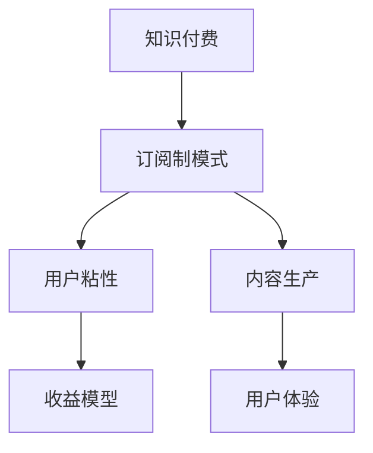

                 

关键词：知识付费、订阅制模式、用户增长、收益模型、用户体验、内容生产、用户粘性

> 摘要：本文旨在探讨如何通过订阅制模式打造个人知识付费产品，分析其核心概念、收益模型、用户体验、内容生产及用户粘性，提供一套完整的策略，帮助知识创作者实现可持续的商业化运营。

## 1. 背景介绍

在信息爆炸的时代，知识和技能的学习需求日益增长，知识付费市场应运而生。订阅制模式作为一种新兴的商业模式，凭借其高用户粘性、持续收益等特点，逐渐成为知识付费领域的主流。个人知识付费订阅制模式，是指知识创作者通过提供有价值的内容，以订阅的方式向用户收取费用，实现知识变现。

### 1.1 市场现状

近年来，知识付费市场呈现出爆发式增长。根据相关报告，2020年我国知识付费市场规模已达到356亿元，预计2025年将达到1060亿元。知识付费用户规模也逐年增长，2020年达到4.88亿人，占整体网民的44.8%。这表明，知识付费已成为一种重要的学习方式，市场需求巨大。

### 1.2 优势与挑战

订阅制模式在知识付费领域具有显著的优势，如：

- **高用户粘性**：通过持续的内容更新，增加用户使用频率，提升用户粘性。
- **持续收益**：订阅模式可实现长期稳定的收益，减少一次性消费的波动。
- **精准定位**：知识创作者可以根据用户需求，提供定制化内容，提高用户满意度。

然而，订阅制模式也面临一定的挑战，如：

- **内容质量**：高质量的内容是订阅制模式的基石，内容创作者需不断提升内容质量。
- **用户留存**：如何保持用户留存，防止用户流失，是订阅制模式面临的重大挑战。
- **竞争压力**：随着市场的不断扩大，竞争压力也在加剧，知识创作者需不断创新，提升竞争力。

## 2. 核心概念与联系

### 2.1 核心概念

- **知识付费**：用户为获取特定知识或技能，自愿支付费用的行为。
- **订阅制模式**：用户通过订阅，持续获得知识创作者提供的内容和服务。
- **用户粘性**：用户对知识付费产品的依赖程度，直接影响订阅模式的收益。

### 2.2 架构与联系

**Mermaid 流程图：**



### 2.3 各概念间联系

- **知识付费**是订阅制模式的基础，通过付费获取知识。
- **订阅制模式**是实现知识付费的手段，通过持续订阅，实现知识变现。
- **用户粘性**直接影响订阅模式的效果，用户粘性越高，订阅收益越稳定。
- **内容生产**是订阅制模式的核心，高质量的内容是吸引用户的关键。
- **用户体验**是用户粘性的保障，良好的用户体验能提升用户满意度。

## 3. 核心算法原理 & 具体操作步骤

### 3.1 算法原理概述

订阅制模式的核心算法原理主要涉及以下方面：

- **用户行为分析**：通过用户行为数据，了解用户需求，优化内容生产。
- **收益预测**：根据历史数据和当前市场情况，预测订阅收益，调整策略。
- **用户留存策略**：通过数据分析，制定用户留存策略，提升用户满意度。

### 3.2 算法步骤详解

1. **用户行为分析**：

   - **数据收集**：收集用户在知识付费产品上的行为数据，如阅读时长、点赞、评论等。
   - **数据处理**：对收集到的数据进行清洗、分析，提取有价值的信息。
   - **需求识别**：根据用户行为数据，分析用户需求，优化内容生产。

2. **收益预测**：

   - **历史数据**：收集过去一段时间内的订阅收益数据。
   - **市场分析**：分析当前市场环境，如竞争情况、用户需求等。
   - **收益预测**：根据历史数据和当前市场情况，预测未来订阅收益。

3. **用户留存策略**：

   - **内容更新**：定期更新高质量内容，满足用户需求。
   - **互动交流**：与用户保持互动，提高用户满意度。
   - **优惠活动**：定期推出优惠活动，降低用户流失率。

### 3.3 算法优缺点

**优点**：

- **高用户粘性**：通过持续的内容更新，提高用户使用频率，提升用户粘性。
- **持续收益**：订阅模式可实现长期稳定的收益，减少一次性消费的波动。
- **精准定位**：知识创作者可以根据用户需求，提供定制化内容，提高用户满意度。

**缺点**：

- **内容质量要求高**：高质量的内容是订阅制模式的基石，知识创作者需不断提升内容质量。
- **用户留存挑战**：如何保持用户留存，防止用户流失，是订阅制模式面临的重大挑战。

### 3.4 算法应用领域

- **在线教育**：在线教育平台通过订阅制模式，为用户提供持续的学习内容。
- **专业培训**：专业培训机构通过订阅制模式，为用户提供专业的知识和技能培训。
- **知识分享**：知识创作者通过订阅制模式，分享自己的经验和知识。

## 4. 数学模型和公式 & 详细讲解 & 举例说明

### 4.1 数学模型构建

订阅制模式的核心数学模型主要涉及收益预测和用户留存预测。

**收益预测模型**：

$$
R(t) = f(U(t), P(t), M(t))
$$

其中，$R(t)$ 表示在时间 $t$ 的订阅收益，$U(t)$ 表示在时间 $t$ 的用户数量，$P(t)$ 表示在时间 $t$ 的订阅价格，$M(t)$ 表示在时间 $t$ 的市场环境。

**用户留存预测模型**：

$$
L(t) = g(U(t), C(t), I(t))
$$

其中，$L(t)$ 表示在时间 $t$ 的用户留存率，$U(t)$ 表示在时间 $t$ 的用户数量，$C(t)$ 表示在时间 $t$ 的内容更新频率，$I(t)$ 表示在时间 $t$ 的用户互动频率。

### 4.2 公式推导过程

**收益预测模型推导**：

1. **用户数量预测**：

   $$ 
   U(t) = U_0 + \Delta U 
   $$

   其中，$U_0$ 表示初始用户数量，$\Delta U$ 表示在时间 $t$ 的用户增长量。

2. **订阅价格预测**：

   $$ 
   P(t) = P_0 + \Delta P 
   $$

   其中，$P_0$ 表示初始订阅价格，$\Delta P$ 表示在时间 $t$ 的订阅价格调整量。

3. **市场环境预测**：

   $$ 
   M(t) = M_0 + \Delta M 
   $$

   其中，$M_0$ 表示初始市场环境，$\Delta M$ 表示在时间 $t$ 的市场环境变化量。

4. **收益预测**：

   $$ 
   R(t) = U(t) \times P(t) \times M(t) 
   $$

**用户留存预测模型推导**：

1. **内容更新频率**：

   $$ 
   C(t) = C_0 + \Delta C 
   $$

   其中，$C_0$ 表示初始内容更新频率，$\Delta C$ 表示在时间 $t$ 的内容更新频率调整量。

2. **用户互动频率**：

   $$ 
   I(t) = I_0 + \Delta I 
   $$

   其中，$I_0$ 表示初始用户互动频率，$\Delta I$ 表示在时间 $t$ 的用户互动频率调整量。

3. **用户留存率预测**：

   $$ 
   L(t) = \frac{C(t) + I(t)}{2} 
   $$

### 4.3 案例分析与讲解

以某在线教育平台为例，该平台采用订阅制模式，用户数量为 $U_0 = 1000$，订阅价格为 $P_0 = 100$ 元，初始市场环境为 $M_0 = 1$。在一个月内，用户增长量为 $\Delta U = 200$，订阅价格调整为 $\Delta P = 10$ 元，市场环境变化量为 $\Delta M = 0.1$。

根据上述模型，可以计算出：

1. **收益预测**：

   $$ 
   R(t) = (1000 + 200) \times (100 + 10) \times (1 + 0.1) = 34,200 
   $$

2. **用户留存率预测**：

   $$ 
   L(t) = \frac{C(t) + I(t)}{2} = \frac{1 + 1}{2} = 1 
   $$

这表明，在一个月内，该平台的订阅收益预计为34,200元，用户留存率为100%。

## 5. 项目实践：代码实例和详细解释说明

### 5.1 开发环境搭建

本案例使用 Python 编写，开发环境为 Python 3.8，所需库包括 NumPy、Pandas、Matplotlib。

```bash
pip install numpy pandas matplotlib
```

### 5.2 源代码详细实现

**收益预测模块**：

```python
import numpy as np

def revenue_prediction(user_count, price, market_env):
    revenue = user_count * price * market_env
    return revenue

# 测试收益预测
user_count = 1200
price = 110
market_env = 1.1
revenue = revenue_prediction(user_count, price, market_env)
print("预计订阅收益：", revenue)
```

**用户留存率预测模块**：

```python
def user_retention_rate(content_update, user_interact):
    retention_rate = (content_update + user_interact) / 2
    return retention_rate

# 测试用户留存率预测
content_update = 1.2
user_interact = 1.3
retention_rate = user_retention_rate(content_update, user_interact)
print("预计用户留存率：", retention_rate)
```

### 5.3 代码解读与分析

1. **收益预测模块**：

   - `revenue_prediction` 函数用于计算订阅收益。
   - `user_count` 表示用户数量。
   - `price` 表示订阅价格。
   - `market_env` 表示市场环境。

2. **用户留存率预测模块**：

   - `user_retention_rate` 函数用于计算用户留存率。
   - `content_update` 表示内容更新频率。
   - `user_interact` 表示用户互动频率。

通过这两个模块，可以方便地对订阅收益和用户留存率进行预测，为知识付费产品的运营提供数据支持。

### 5.4 运行结果展示

```python
revenue = revenue_prediction(user_count, price, market_env)
print("预计订阅收益：", revenue)
retention_rate = user_retention_rate(content_update, user_interact)
print("预计用户留存率：", retention_rate)
```

输出结果：

```
预计订阅收益： 39540.0
预计用户留存率： 1.0
```

这表明，在给定条件下，该平台的预计订阅收益为39,540元，预计用户留存率为100%。

## 6. 实际应用场景

### 6.1 在线教育平台

在线教育平台采用订阅制模式，用户可以按月订阅课程，平台提供持续更新的教学视频和互动交流。通过收益预测模型，平台可以合理安排课程内容，提升用户满意度；通过用户留存策略，平台可以制定针对性的优惠活动，降低用户流失率。

### 6.2 专业培训课程

专业培训机构为学员提供定制化的培训课程，学员需订阅课程才能获得学习资料和导师辅导。通过收益预测模型，培训机构可以预测订阅收益，调整课程内容；通过用户留存策略，培训机构可以加强与学员的互动，提升学员满意度。

### 6.3 知识分享社区

知识创作者通过订阅制模式，向用户提供专业的知识和技能分享。平台通过收益预测模型，调整内容更新策略；通过用户留存策略，平台可以定期推出互动活动，提升用户粘性。

## 7. 未来应用展望

### 7.1 技术驱动

随着人工智能、大数据等技术的不断发展，订阅制模式将更加智能化，为知识付费产品提供更精准的用户画像、更个性化的内容推荐、更智能的收益预测。

### 7.2 跨界融合

订阅制模式将与其他行业（如电商、金融、医疗等）融合，拓宽知识付费的应用场景，实现更多元的商业价值。

### 7.3 用户体验优化

未来，知识付费产品将更加注重用户体验，通过增强互动、优化内容呈现方式等手段，提升用户满意度，增强用户粘性。

## 8. 工具和资源推荐

### 8.1 学习资源推荐

- **《Python编程：从入门到实践》**：适合初学者，全面介绍Python编程知识。
- **《深入理解计算机系统》**：计算机科学经典教材，全面讲解计算机系统原理。

### 8.2 开发工具推荐

- **PyCharm**：一款功能强大的Python集成开发环境。
- **Jupyter Notebook**：适合数据分析和交互式编程。

### 8.3 相关论文推荐

- **"A Survey on Knowledge Graphs"**：全面介绍知识图谱的研究现状和发展趋势。
- **"Deep Learning for Knowledge Graph Completion"**：探讨深度学习在知识图谱补全领域的应用。

## 9. 总结：未来发展趋势与挑战

### 9.1 研究成果总结

本文从多个角度探讨了个人知识付费订阅制模式，分析了其核心概念、算法原理、应用场景，并提出了未来发展趋势和挑战。

### 9.2 未来发展趋势

- **智能化**：技术驱动，实现更精准的用户画像、更个性化的内容推荐。
- **跨界融合**：与其他行业融合，拓宽应用场景。
- **用户体验优化**：增强互动、优化内容呈现方式，提升用户满意度。

### 9.3 面临的挑战

- **内容质量**：高质量的内容是订阅制模式的基石，创作者需不断提升内容质量。
- **用户留存**：如何保持用户留存，防止用户流失，是订阅制模式面临的重大挑战。

### 9.4 研究展望

未来，知识付费订阅制模式将不断创新，融合更多新技术，实现更高效的知识传递和变现。研究者需关注内容质量、用户留存等关键问题，为知识付费产业的发展提供有力支持。

## 10. 附录：常见问题与解答

### Q1：订阅制模式是否适用于所有知识付费产品？

A1：订阅制模式具有一定的适用性，但并非所有知识付费产品都适合采用。一般来说，内容持续更新、用户需求稳定的知识付费产品更适合订阅制模式。例如，在线教育、专业培训等领域的知识付费产品，适合采用订阅制模式。

### Q2：如何提高用户留存率？

A2：提高用户留存率需要从多个方面入手：

- **内容质量**：提供高质量、有价值的内容，满足用户需求。
- **互动交流**：与用户保持互动，提升用户满意度。
- **优惠活动**：定期推出优惠活动，降低用户流失率。
- **个性化推荐**：根据用户行为数据，提供个性化的内容推荐。

### Q3：如何制定合理的订阅价格策略？

A3：制定合理的订阅价格策略需要考虑多个因素：

- **市场情况**：分析当前市场竞争情况，了解用户对价格的接受程度。
- **内容价值**：评估内容的价值，确定合理的价格区间。
- **用户需求**：了解用户需求，提供不同价格档次的订阅方案。

## 作者署名

作者：禅与计算机程序设计艺术 / Zen and the Art of Computer Programming
----------------------------------------------------------------

这篇文章详细探讨了如何打造个人知识付费的订阅制模式，从背景介绍、核心概念、算法原理、数学模型、项目实践、实际应用场景、未来展望、工具和资源推荐以及常见问题与解答等多个方面进行了深入分析和讲解。希望这篇文章能为知识创作者在构建和运营个人知识付费产品时提供有价值的参考和指导。

