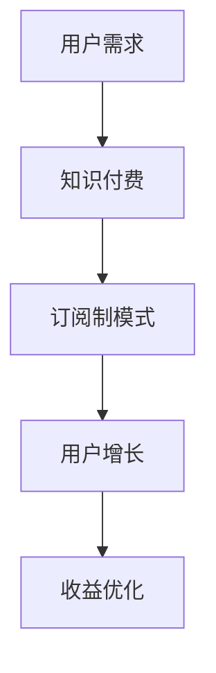

                 

关键词：知识付费、订阅制模式、用户增长、内容创作、收益优化

> 摘要：本文旨在探讨如何通过构建个人知识付费的订阅制模式，实现可持续的用户增长和收益优化。文章将详细分析订阅制模式的定义、核心概念、实现步骤以及实际应用中的挑战和解决方案。

## 1. 背景介绍

在数字化时代，知识付费逐渐成为知识传播与消费的重要途径。通过付费获取知识不仅满足了用户对高质量内容的需求，也为知识提供者创造了新的收入来源。订阅制模式作为知识付费的一种重要形式，凭借其灵活性和持续性，正受到越来越多人的关注。

### 1.1 知识付费的定义

知识付费是指用户为获取有价值的信息、知识或服务而支付的货币行为。随着网络技术的发展，知识付费形式日益多样化，包括在线课程、付费问答、知识星球等。

### 1.2 订阅制模式的概念

订阅制模式是一种用户付费订阅内容或服务的商业模式。用户支付一定费用后，可以在一定时间内无限次访问或使用订阅内容或服务。

### 1.3 订阅制模式的优缺点

订阅制模式的优点包括：

- **用户黏性高**：用户一旦订阅，通常会有持续的使用需求。
- **收益稳定**：订阅费用可以定期收取，提供稳定的现金流。
- **用户增长快**：优质内容能够吸引更多用户订阅。

订阅制模式的缺点包括：

- **内容更新压力大**：订阅内容需要持续更新以维持用户兴趣。
- **用户流失风险**：订阅费用较高时，用户可能会因为价格或内容不满足需求而流失。

## 2. 核心概念与联系

### 2.1 订阅制模式的核心概念

订阅制模式的核心概念包括：

- **订阅计划**：用户可以选择的不同订阅方案，如按月、按年等。
- **订阅费用**：用户为订阅内容或服务支付的费用。
- **订阅期限**：用户订阅的有效期。

### 2.2 订阅制模式的联系

订阅制模式与知识付费、用户增长等概念紧密相关。知识付费是订阅制模式的基础，用户增长是订阅制模式的驱动力，而收益优化是订阅制模式的最终目标。

### 2.3 Mermaid 流程图



## 3. 核心算法原理 & 具体操作步骤

### 3.1 算法原理概述

订阅制模式的核心算法原理是基于用户需求和行为分析，制定合理的订阅计划，通过内容更新和用户体验优化，实现用户增长和收益最大化。

### 3.2 算法步骤详解

#### 步骤1：需求分析

- 调查用户需求：通过问卷调查、用户访谈等方式了解用户对知识内容的需求。
- 数据分析：利用大数据分析工具对用户行为数据进行分析，挖掘用户偏好。

#### 步骤2：订阅计划制定

- 订阅方案设计：根据用户需求，设计多种订阅方案，如按月、按年等。
- 订阅费用设定：结合成本和市场调研，设定合理的订阅费用。

#### 步骤3：内容更新

- 内容创作：定期创作高质量的知识内容，满足用户需求。
- 内容更新频率：根据用户行为数据，调整内容更新频率，提高用户体验。

#### 步骤4：用户体验优化

- 互动环节设计：增加用户互动环节，提高用户参与度。
- 用户反馈收集：及时收集用户反馈，优化内容和服务。

### 3.3 算法优缺点

订阅制模式具有以下优点：

- **用户黏性强**：通过订阅计划，用户有持续的使用需求。
- **收益稳定**：订阅费用定期收取，提供稳定的现金流。

订阅制模式也存在一些缺点：

- **内容更新压力大**：需要持续创作高质量内容，保持用户兴趣。
- **用户流失风险**：订阅费用较高时，用户可能会因为价格或内容不满足需求而流失。

### 3.4 算法应用领域

订阅制模式广泛应用于在线教育、知识付费、内容创作等领域。通过该模式，知识提供者可以实现持续的收入增长，用户也能方便地获取所需的知识和服务。

## 4. 数学模型和公式 & 详细讲解 & 举例说明

### 4.1 数学模型构建

订阅制模式下的收益模型可以表示为：

\[ R(t) = \sum_{i=1}^{n} (P_i - C_i) \]

其中，\( R(t) \) 为总收益，\( P_i \) 为第 \( i \) 个订阅方案的订阅费用，\( C_i \) 为第 \( i \) 个订阅方案的成本。

### 4.2 公式推导过程

假设有 \( n \) 个订阅方案，每个方案的费用为 \( P_i \)，成本为 \( C_i \)，订阅期限为 \( T_i \)。则每个方案的收益为 \( (P_i - C_i) \times T_i \)。

总收益为所有订阅方案收益之和，即：

\[ R(t) = \sum_{i=1}^{n} (P_i - C_i) \times T_i \]

### 4.3 案例分析与讲解

假设有两个订阅方案，方案一为每月订阅，费用为 100 元，成本为 70 元；方案二为年度订阅，费用为 1200 元，成本为 800 元。订阅期限分别为 1 个月和 12 个月。

则总收益为：

\[ R(t) = (100 - 70) \times 1 + (1200 - 800) \times 12 = 4300 元 \]

通过数学模型，我们可以计算出在不同的订阅方案下，知识提供者可以获得的总收益。这有助于知识提供者制定更合理的订阅计划，实现收益最大化。

## 5. 项目实践：代码实例和详细解释说明

### 5.1 开发环境搭建

- 开发语言：Python
- 数据库：MySQL
- 开发工具：PyCharm

### 5.2 源代码详细实现

```python
# 订阅制模式收益计算示例

# 导入相关库
import pymysql

# 连接数据库
conn = pymysql.connect(
    host='localhost',
    user='root',
    password='password',
    database='subscription_model'
)

# 创建数据库表
with conn.cursor() as cursor:
    cursor.execute("""
    CREATE TABLE IF NOT EXISTS subscriptions (
        id INT AUTO_INCREMENT PRIMARY KEY,
        plan_name VARCHAR(50),
        subscription_fee DECIMAL(10, 2),
        cost DECIMAL(10, 2),
        subscription_period INT
    )
    """)

# 插入数据
subscription_data = [
    ('月度订阅', 100, 70, 1),
    ('年度订阅', 1200, 800, 12)
]

cursor.executemany("""
    INSERT INTO subscriptions (plan_name, subscription_fee, cost, subscription_period)
    VALUES (%s, %s, %s, %s)
    """, subscription_data)

# 计算总收益
def calculate_total_revenue():
    cursor.execute("""
    SELECT plan_name, subscription_fee, cost, subscription_period
    FROM subscriptions
    """)
    subscriptions = cursor.fetchall()

    total_revenue = 0
    for subscription in subscriptions:
        plan_name, subscription_fee, cost, subscription_period = subscription
        revenue = (subscription_fee - cost) * subscription_period
        total_revenue += revenue

    return total_revenue

total_revenue = calculate_total_revenue()
print(f"总收益: {total_revenue} 元")

# 关闭数据库连接
conn.close()
```

### 5.3 代码解读与分析

上述代码首先建立了一个名为 `subscriptions` 的数据库表，用于存储订阅方案的信息。然后插入两个订阅方案的数据。

`calculate_total_revenue` 函数用于计算总收益。它通过查询 `subscriptions` 表获取所有订阅方案的数据，然后遍历每个方案，计算每个方案的收益，并将其累加到总收益中。

最后，代码输出总收益，展示了如何通过简单的代码实现订阅制模式下的收益计算。

## 6. 实际应用场景

### 6.1 在线教育

在线教育平台通过订阅制模式，为用户提供优质课程资源。用户可以根据自己的需求和兴趣选择订阅课程，平台则通过持续更新课程内容和优化用户体验，实现用户增长和收益优化。

### 6.2 知识付费

知识付费领域，如付费问答平台、专业领域知识库等，采用订阅制模式，用户通过订阅获得专业知识的持续更新和服务。平台通过合理设计订阅方案、优化内容和用户体验，提高用户黏性和收益。

### 6.3 内容创作

内容创作者可以通过订阅制模式，为用户提供高质量的内容和服务。创作者可以根据用户需求，定期更新内容，并通过订阅费用获得稳定收入。同时，创作者可以通过互动环节，提高用户参与度，进一步提升订阅转化率。

## 7. 工具和资源推荐

### 7.1 学习资源推荐

- 《深度学习》
- 《Python编程：从入门到实践》
- 《算法导论》

### 7.2 开发工具推荐

- PyCharm
- MySQL Workbench
- Git

### 7.3 相关论文推荐

- "Subscription-based Business Models: A Comprehensive Review"
- "Subscription Models in the Digital Age: A Marketing Perspective"
- "The Subscription Economy: How Subscription Models Are Transforming the Economy"

## 8. 总结：未来发展趋势与挑战

### 8.1 研究成果总结

本文通过分析订阅制模式的核心概念、算法原理、实际应用场景，探讨了如何通过订阅制模式实现知识付费的可持续增长和收益优化。

### 8.2 未来发展趋势

随着互联网技术的发展，订阅制模式将在更多领域得到应用。同时，人工智能和大数据分析技术的引入，将为订阅制模式带来更多创新和发展机会。

### 8.3 面临的挑战

订阅制模式面临的主要挑战包括内容更新压力、用户流失风险以及市场竞争加剧。知识提供者需要不断创新和优化，以应对这些挑战。

### 8.4 研究展望

未来研究应重点关注如何利用人工智能和大数据分析技术，提升订阅制模式的用户体验和收益优化效果。同时，探索更多适应不同领域的订阅制模式，以实现知识付费的可持续发展。

## 9. 附录：常见问题与解答

### 9.1 什么是订阅制模式？

订阅制模式是一种用户付费订阅内容或服务的商业模式。用户支付一定费用后，可以在一定时间内无限次访问或使用订阅内容或服务。

### 9.2 订阅制模式有哪些优点？

订阅制模式的优点包括用户黏性强、收益稳定、用户增长快等。

### 9.3 订阅制模式有哪些缺点？

订阅制模式的缺点包括内容更新压力大、用户流失风险等。

### 9.4 如何设计合理的订阅计划？

设计合理的订阅计划需要考虑用户需求、成本、市场竞争等因素。可以通过市场调研、用户行为分析等方法，制定多种订阅方案，并选择最适合用户的方案。

### 9.5 如何实现订阅制模式下的收益优化？

实现订阅制模式下的收益优化可以通过以下方法：

- 定期更新高质量内容，提高用户满意度。
- 优化用户体验，提高用户参与度。
- 合理定价，平衡收益和用户接受度。
- 利用大数据分析，挖掘用户需求，优化订阅方案。  
----------------------------------------------------------------

以上是关于如何打造个人知识付费的订阅制模式的完整文章。希望对您有所帮助。作者：禅与计算机程序设计艺术 / Zen and the Art of Computer Programming。如有任何问题，欢迎随时指正和交流。

