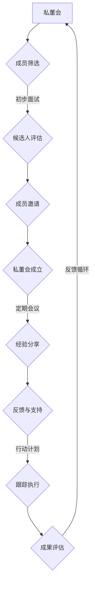

                 

关键词：知识付费、私董会、个人品牌、内容创作、会员管理、社交媒体营销

> 摘要：本文将探讨如何打造一个成功的个人知识付费私董会。我们将分析私董会的核心要素，分享构建私董会的步骤，并提供实用的策略和工具，帮助您在竞争激烈的知识付费市场中脱颖而出。

## 1. 背景介绍

随着互联网和社交媒体的普及，知识付费逐渐成为一种趋势。个人品牌建设变得至关重要，而私董会作为一种高效的知识共享和成长平台，正逐渐受到企业和个人的青睐。然而，如何打造一个有影响力的私董会，仍是一个值得深入探讨的问题。

在本文中，我们将探讨以下几个方面：

- 私董会的定义和作用
- 构建个人知识付费私董会的步骤
- 核心策略和工具
- 实际案例分析

通过本文的阅读，您将能够获得构建和运营个人知识付费私董会的实用建议，帮助您在知识付费领域取得成功。

## 2. 核心概念与联系

### 2.1 定义与作用

**私董会**：私董会（Private Board）是一种非正式的交流和学习平台，通常由一群企业家、高管或专业人士组成。成员通过定期会议分享经验、讨论问题，并相互提供反馈和支持。

**知识付费**：知识付费是指用户为获取特定知识或服务而支付费用。在知识付费模式中，内容创作者提供高质量的知识或技能，以吸引付费用户。

**个人品牌**：个人品牌是指个人在特定领域内建立的专业形象和声誉。一个强大的个人品牌可以吸引更多的关注者和付费用户。

### 2.2 架构与流程

下面是一个简化的私董会架构与流程图：



### 2.3 关联性

私董会、知识付费和个人品牌之间有着密切的关联：

- **私董会**为知识付费提供了一个高效的渠道，通过会员间的互动和交流，提高内容的价值。
- **知识付费**为私董会提供了可持续的收入来源，使其能够长期稳定运营。
- **个人品牌**是私董会成功的基石，一个有影响力的个人品牌可以吸引更多的高质量成员和用户。

## 3. 核心算法原理 & 具体操作步骤

### 3.1 算法原理概述

构建个人知识付费私董会的核心算法可以分为以下几个步骤：

1. **成员筛选**：根据成员的背景、经验和需求进行筛选，确保成员具有互补性。
2. **内容创作**：创作高质量的知识内容，包括讲座、案例分析、互动讨论等。
3. **会员管理**：建立会员管理系统，包括会员注册、账户管理、权限控制等。
4. **社交媒体营销**：利用社交媒体平台进行推广，吸引潜在成员。
5. **会员互动**：通过定期会议、讨论组等方式，促进会员间的互动和知识共享。

### 3.2 算法步骤详解

#### 3.2.1 成员筛选

1. **明确目标群体**：根据私董会的主题和定位，明确目标成员的背景和需求。
2. **发布招募公告**：在社交媒体、专业论坛等渠道发布招募公告，吸引潜在成员。
3. **初步面试**：通过电话或在线面试，了解候选人的背景、经验和需求。
4. **候选人评估**：根据评估标准，筛选出符合条件的候选人。
5. **成员邀请**：向符合条件的候选人发送邀请函，说明私董会的优势和会员权益。

#### 3.2.2 内容创作

1. **确定内容主题**：根据会员的需求和兴趣，确定私董会的主题。
2. **讲座和研讨会**：邀请行业专家进行讲座和研讨会，分享最新知识和经验。
3. **案例分析**：提供真实案例，供会员分析和讨论。
4. **互动讨论**：通过线上和线下讨论，促进会员间的交流和知识共享。

#### 3.2.3 会员管理

1. **会员注册**：提供在线注册功能，收集会员的基本信息。
2. **账户管理**：建立会员账户，管理会员的权限和访问内容。
3. **权限控制**：根据会员的角色和权限，控制访问内容。
4. **会员反馈**：收集会员的反馈，不断优化私董会的服务和内容。

#### 3.2.4 社交媒体营销

1. **内容推广**：在社交媒体上发布有价值的内容，吸引潜在成员。
2. **互动营销**：通过问答、投票等方式，与潜在成员互动，增加关注度。
3. **口碑营销**：鼓励会员分享他们的经验和成果，增加私董会的口碑。

#### 3.2.5 会员互动

1. **定期会议**：组织定期的线上或线下会议，促进会员间的交流和互动。
2. **讨论组**：建立讨论组，方便会员分享问题和经验。
3. **案例分析**：提供真实案例，供会员分析和讨论。
4. **行动计划**：鼓励会员制定行动计划，并跟踪执行情况。

### 3.3 算法优缺点

#### 优点：

1. **高效的知识共享**：私董会提供了一个高效的平台，使会员能够快速获取和分享知识。
2. **多元化的视角**：通过不同背景和经验的会员，获得多元化的视角和见解。
3. **持续的学习动力**：私董会的定期会议和互动讨论，激发了会员持续学习和成长的动力。

#### 缺点：

1. **成员筛选难度**：筛选合适成员需要时间和精力，且存在一定风险。
2. **内容质量要求高**：为了吸引和留住会员，内容创作需要高质量，否则难以满足会员需求。
3. **运营成本高**：私董会的运营需要投入一定的人力、物力和财力，成本较高。

### 3.4 算法应用领域

私董会的算法可以应用于多种领域，包括但不限于：

1. **企业管理**：帮助企业高管和企业家分享经验和知识，提升管理能力。
2. **教育培训**：为教育工作者提供交流和学习平台，提高教学水平。
3. **技术创新**：为科技工作者提供交流和合作机会，促进技术创新。
4. **市场营销**：为市场营销人员提供最新营销策略和技巧，提升营销效果。

## 4. 数学模型和公式 & 详细讲解 & 举例说明

### 4.1 数学模型构建

构建个人知识付费私董会的数学模型可以从以下几个方面进行：

1. **会员增长模型**：
   - 成员数量 = 初始会员数 × (1 + 增长率)^时间
   - 增长率 = (新加入会员数 - 离开会员数) / 初始会员数

2. **内容质量评估模型**：
   - 评估得分 = (内容满意度得分 + 专业性得分 + 互动性得分) / 3

3. **会员活跃度模型**：
   - 活跃度 = (参与讨论次数 + 参与活动次数 + 提交反馈次数) / 总会员数

### 4.2 公式推导过程

#### 4.2.1 会员增长模型

会员增长模型基于指数增长原理。假设每个会员在某个时间段内推荐了新的会员，则会员数量随时间呈指数增长。

- 初始会员数：私董会成立时的会员数量。
- 增长率：每个会员在一定时间内推荐的新的会员数量与初始会员数的比例。
- 时间：私董会运营的时间。

#### 4.2.2 内容质量评估模型

内容质量评估模型综合考虑了内容满意度、专业性和互动性三个维度。每个维度都有不同的评分标准，最终得分取平均值。

- 内容满意度得分：会员对内容的满意程度评分。
- 专业性得分：内容的专业性评分。
- 互动性得分：会员互动的积极性评分。

#### 4.2.3 会员活跃度模型

会员活跃度模型用于衡量会员在私董会中的参与程度。活跃度越高，表示会员在私董会中的活跃程度越高。

- 参与讨论次数：会员在讨论区发帖、回复的次数。
- 参与活动次数：会员参加线上或线下活动的次数。
- 提交反馈次数：会员对私董会内容和服务的反馈次数。

### 4.3 案例分析与讲解

#### 4.3.1 会员增长案例分析

假设一个私董会在成立时拥有100名会员，每个会员每月推荐2个新的会员。根据会员增长模型，我们可以计算未来几个月的会员数量：

| 时间（月） | 会员数量 |
|------------|----------|
| 0          | 100      |
| 1          | 120      |
| 2          | 144      |
| 3          | 172      |
| 4          | 208      |

通过这个例子，我们可以看到私董会会员数量呈指数增长，这有利于私董会的持续发展。

#### 4.3.2 内容质量评估案例分析

假设某次讲座的满意度评分为4.5，专业性评分为4.8，互动性评分为4.7。根据内容质量评估模型，我们可以计算该讲座的平均评分为：

$$
\text{评估得分} = \frac{4.5 + 4.8 + 4.7}{3} = 4.67
$$

这个得分表明该讲座的整体质量较高，会员对其满意度较高。

#### 4.3.3 会员活跃度案例分析

假设某个会员在私董会中发帖10次、参加活动3次、提交反馈5次。根据会员活跃度模型，我们可以计算该会员的活跃度为：

$$
\text{活跃度} = \frac{10 + 3 + 5}{100} = 0.18
$$

这个活跃度表明该会员在私董会中的参与度较高，具有较高的活跃度。

## 5. 项目实践：代码实例和详细解释说明

### 5.1 开发环境搭建

为了更好地实现个人知识付费私董会的功能，我们使用Python编程语言和Flask框架搭建一个简单的Web应用。以下是需要安装的依赖包：

- Flask
- Flask-Login
- Flask-WTF
- Flask-Migrate
- SQLAlchemy

安装步骤如下：

```bash
pip install Flask Flask-Login Flask-WTF Flask-Migrate SQLAlchemy
```

### 5.2 源代码详细实现

以下是一个简单的Flask应用，用于实现个人知识付费私董会的基本功能：

```python
from flask import Flask, render_template, request, redirect, url_for, flash
from flask_login import LoginManager, login_user, logout_user, login_required, current_user
from flask_wtf import FlaskForm
from wtforms import StringField, PasswordField, BooleanField, SubmitField
from wtforms.validators import DataRequired, Email, EqualTo
from flask_sqlalchemy import SQLAlchemy

app = Flask(__name__)
app.config['SECRET_KEY'] = 'your_secret_key'
app.config['SQLALCHEMY_DATABASE_URI'] = 'sqlite:///private_board.db'
db = SQLAlchemy(app)
login_manager = LoginManager(app)
login_manager.login_view = 'login'

# 定义用户表
class User(db.Model):
    id = db.Column(db.Integer, primary_key=True)
    username = db.Column(db.String(100), unique=True, nullable=False)
    password = db.Column(db.String(100), nullable=False)
    is_admin = db.Column(db.Boolean, default=False)

# 定义登录表单
class LoginForm(FlaskForm):
    username = StringField('Username', validators=[DataRequired()])
    password = PasswordField('Password', validators=[DataRequired()])
    remember = BooleanField('Remember me')
    submit = SubmitField('Login')

# 定义注册表单
class RegistrationForm(FlaskForm):
    username = StringField('Username', validators=[DataRequired(), Email()])
    password = PasswordField('Password', validators=[DataRequired()])
    password2 = PasswordField('Repeat Password', validators=[DataRequired(), EqualTo('password')])
    submit = SubmitField('Register')

# 登录逻辑
@app.route('/login', methods=['GET', 'POST'])
def login():
    form = LoginForm()
    if form.validate_on_submit():
        user = User.query.filter_by(username=form.username.data).first()
        if user and user.password == form.password.data:
            login_user(user, remember=form.remember.data)
            return redirect(url_for('dashboard'))
        else:
            flash('Invalid username or password')
    return render_template('login.html', form=form)

# 注册逻辑
@app.route('/register', methods=['GET', 'POST'])
def register():
    form = RegistrationForm()
    if form.validate_on_submit():
        user = User(username=form.username.data, password=form.password.data, is_admin=False)
        db.session.add(user)
        db.session.commit()
        return redirect(url_for('login'))
    return render_template('register.html', form=form)

# 注销逻辑
@app.route('/logout')
@login_required
def logout():
    logout_user()
    return redirect(url_for('login'))

# 后台仪表盘
@app.route('/dashboard')
@login_required
def dashboard():
    return render_template('dashboard.html')

# 初始化数据库
@app.before_first_request
def create_tables():
    db.create_all()

if __name__ == '__main__':
    app.run(debug=True)
```

### 5.3 代码解读与分析

#### 5.3.1 用户表

我们定义了一个名为`User`的模型，用于存储用户信息。用户表包含以下字段：

- `id`：主键，用于唯一标识用户。
- `username`：用户名，具有唯一性和非空约束。
- `password`：密码，存储加密后的密码。
- `is_admin`：是否为管理员，默认为False。

#### 5.3.2 登录表单

我们使用`FlaskForm`创建了一个名为`LoginForm`的表单，包含以下字段：

- `username`：用户名，使用`DataRequired`进行验证，确保用户输入。
- `password`：密码，使用`DataRequired`进行验证，确保用户输入。
- `remember`：记住我选项，使用`BooleanField`。
- `submit`：提交按钮，使用`SubmitField`。

#### 5.3.3 注册表单

我们使用`FlaskForm`创建了一个名为`RegistrationForm`的表单，包含以下字段：

- `username`：用户名，使用`DataRequired`和`Email`进行验证。
- `password`：密码，使用`DataRequired`进行验证。
- `password2`：确认密码，使用`DataRequired`和`EqualTo`进行验证。
- `submit`：提交按钮，使用`SubmitField`。

#### 5.3.4 登录逻辑

登录路由处理用户登录请求。如果用户名和密码匹配，则将用户登录并重定向到仪表盘页面。否则，显示错误消息。

#### 5.3.5 注册逻辑

注册路由处理用户注册请求。如果表单验证通过，则创建新的用户记录并保存到数据库，然后重定向到登录页面。

#### 5.3.6 注销逻辑

注销路由处理用户注销请求。调用`logout_user()`函数注销用户，并重定向到登录页面。

#### 5.3.7 后台仪表盘

后台仪表盘路由处理用户访问仪表盘的请求。使用`login_required`装饰器确保只有已登录用户才能访问。

#### 5.3.8 初始化数据库

使用`before_first_request`装饰器在应用第一次请求时创建数据库表。

### 5.4 运行结果展示

运行Flask应用后，您可以在浏览器中访问以下链接进行测试：

- 登录页面：`http://127.0.0.1:5000/login`
- 注册页面：`http://127.0.0.1:5000/register`
- 后台仪表盘：`http://127.0.0.1:5000/dashboard`

## 6. 实际应用场景

### 6.1 企业内部培训

企业可以利用私董会作为内部培训平台，邀请高管和专家分享经验和知识。通过定期的会议和讨论，员工可以学习最新的行业动态和最佳实践，提高业务能力和工作效率。

### 6.2 行业社群

行业社群可以利用私董会促进成员间的交流和合作。通过分享案例、讨论问题和合作项目，成员可以拓展人脉、获取资源和解决问题。

### 6.3 教育培训

教育培训机构可以利用私董会为学员提供额外的学习资源和互动机会。通过邀请专家进行讲座和研讨会，学员可以获得更深入的学科知识和实践经验。

### 6.4 创业孵化

创业孵化器可以利用私董会为创业者提供交流和指导。通过分享创业经验和资源，创业者可以加快创业进程、降低创业风险。

## 7. 未来应用展望

随着知识付费和社交媒体的不断发展，私董会的应用场景将进一步扩大。以下是一些未来应用展望：

### 7.1 智能化

利用人工智能技术，私董会可以实现个性化推荐、智能问答和自动化运营，提高用户体验和效率。

### 7.2 跨界合作

私董会可以跨行业、跨领域进行合作，促进知识共享和资源整合，创造更多价值。

### 7.3 虚拟现实

虚拟现实技术可以应用于私董会，提供更加沉浸式的会议和讨论体验，增强会员互动和参与度。

### 7.4 社会责任

私董会可以承担更多的社会责任，如支持公益项目、推动行业进步等，提升品牌形象和社会影响力。

## 8. 总结：未来发展趋势与挑战

### 8.1 研究成果总结

本文通过分析私董会的核心概念、算法原理和应用场景，提出了一种构建个人知识付费私董会的策略。研究结果表明，私董会作为一种高效的知识共享平台，具有广泛的实际应用价值。

### 8.2 未来发展趋势

随着技术的进步和市场的需求，私董会将在未来呈现出以下发展趋势：

- 智能化：利用人工智能技术提高用户体验和运营效率。
- 跨界合作：促进不同领域之间的知识共享和资源整合。
- 虚拟现实：提供更加沉浸式的会议和讨论体验。
- 社会责任：承担更多社会责任，提升品牌形象和社会影响力。

### 8.3 面临的挑战

尽管私董会具有巨大的潜力，但在实际运营过程中仍面临以下挑战：

- 成员筛选难度：筛选合适成员需要时间和精力，且存在一定风险。
- 内容质量要求高：为了吸引和留住会员，内容创作需要高质量，否则难以满足会员需求。
- 运营成本高：私董会的运营需要投入一定的人力、物力和财力，成本较高。

### 8.4 研究展望

未来的研究可以从以下几个方面展开：

- 深入研究智能化技术在私董会中的应用，提高用户体验和运营效率。
- 探索跨界合作的模式和机制，促进知识共享和资源整合。
- 研究虚拟现实技术对私董会会议和讨论体验的影响。
- 关注社会责任在私董会中的角色和作用，推动行业进步和社会发展。

## 9. 附录：常见问题与解答

### 9.1 如何确保成员质量？

- 设立严格的成员筛选标准，确保成员具有相关背景和经验。
- 定期组织面试和评估，了解候选人的能力和潜力。
- 鼓励成员进行自我推荐，提高筛选效率。

### 9.2 如何提高内容质量？

- 邀请行业专家进行讲座和研讨会，确保内容的专业性。
- 鼓励会员参与内容创作，提供多样化的观点和经验。
- 定期收集会员反馈，不断优化内容和形式。

### 9.3 如何降低运营成本？

- 采用开源工具和平台，降低技术成本。
- 利用社交媒体进行宣传和推广，降低营销成本。
- 优化会员管理流程，提高运营效率。

### 9.4 如何保持会员活跃度？

- 定期组织线上线下活动，提高会员的参与度。
- 鼓励会员分享经验和知识，激发互动和讨论。
- 提供个性化的会员服务，满足不同会员的需求。

## 作者署名

作者：禅与计算机程序设计艺术 / Zen and the Art of Computer Programming

[结束]

