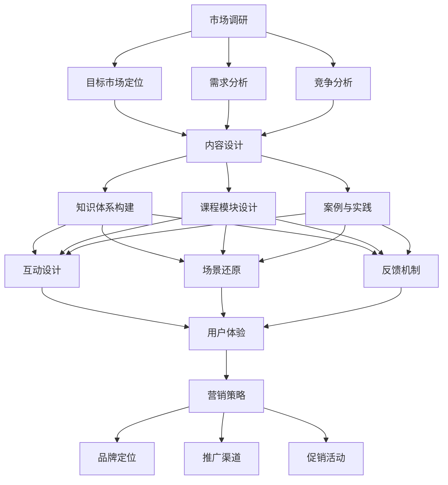

                 

关键词：知识付费、线下沙龙、个人品牌、市场调研、内容设计、用户体验、营销策略、互动交流、科技赋能

> 摘要：本文旨在探讨如何打造个人知识付费线下沙龙，从市场调研、内容设计、用户体验、营销策略等方面详细解析成功案例，并提供实用的工具和资源推荐，帮助个人知识付费者将线下沙龙转化为有效的知识传播和品牌建设平台。

## 1. 背景介绍

随着互联网的飞速发展，知识付费已经成为一个新兴且庞大的市场。人们越来越重视通过付费获取高质量的知识和服务，这也为个人知识付费者提供了广阔的发展空间。线下沙龙作为一种面对面的知识传播形式，不仅可以提供更加深入的互动和交流，还能有效增强个人品牌的影响力。

打造个人知识付费线下沙龙，不仅需要具备专业的知识和经验，还需要在市场调研、内容设计、用户体验、营销策略等方面下足功夫。本文将结合实际案例，从多个角度详细解析如何成功打造个人知识付费线下沙龙。

## 2. 核心概念与联系

### 2.1 市场调研

市场调研是打造个人知识付费线下沙龙的第一步，也是至关重要的一步。它可以帮助你了解目标市场的需求、竞争对手的情况以及潜在客户的特点。市场调研的核心概念包括：

- **目标市场定位**：确定你的沙龙面向哪些人群，他们的年龄、性别、职业、收入等特征如何。
- **需求分析**：通过问卷调查、访谈等方式了解目标市场的需求，包括他们期望从沙龙中获得哪些知识和服务。
- **竞争分析**：了解竞争对手的定位、优势和劣势，以便制定差异化策略。

### 2.2 内容设计

内容设计是沙龙的核心，它决定了沙龙的价值和吸引力。内容设计需要考虑以下核心概念：

- **知识体系构建**：构建系统的知识体系，确保沙龙内容的连贯性和专业性。
- **课程模块设计**：将知识体系分解为不同的模块，每个模块要有明确的主题和目标。
- **案例与实践**：通过真实案例和实践案例，帮助参与者更好地理解和应用所学知识。

### 2.3 用户体验

用户体验是沙龙成功的关键因素之一。良好的用户体验可以增强参与者的满意度和忠诚度。用户体验的核心概念包括：

- **互动设计**：通过互动环节，增加参与者的参与感和互动性。
- **场景还原**：模拟实际工作中的场景，帮助参与者更好地理解和应用所学知识。
- **反馈机制**：建立反馈机制，及时收集参与者的意见和建议，不断优化沙龙内容和服务。

### 2.4 营销策略

有效的营销策略可以帮助沙龙吸引更多的参与者，提升品牌影响力。营销策略的核心概念包括：

- **品牌定位**：明确沙龙的品牌形象和定位，确保营销信息的统一和一致性。
- **推广渠道**：选择适合的推广渠道，如社交媒体、线下活动等，扩大沙龙的影响力。
- **促销活动**：通过优惠活动、积分兑换等促销手段，吸引更多参与者。

### 2.5 Mermaid 流程图

下面是市场调研、内容设计、用户体验、营销策略的 Mermaid 流程图：



## 3. 核心算法原理 & 具体操作步骤

### 3.1 算法原理概述

打造个人知识付费线下沙龙的算法原理可以概括为以下四个步骤：

1. **市场调研**：通过数据分析和用户访谈，了解目标市场的需求和竞争情况。
2. **内容设计**：根据市场调研结果，设计符合市场需求的沙龙内容和课程模块。
3. **用户体验**：通过互动设计、场景还原和反馈机制，提升参与者的满意度和忠诚度。
4. **营销策略**：制定有效的营销策略，吸引更多的参与者。

### 3.2 算法步骤详解

1. **市场调研**

   - **数据收集**：通过问卷调查、用户访谈等方式，收集目标市场的数据。
   - **数据分析**：对收集到的数据进行分析，确定目标市场的需求和竞争情况。
   - **报告撰写**：根据分析结果，撰写市场调研报告，为后续内容设计和营销策略提供依据。

2. **内容设计**

   - **知识体系构建**：根据市场调研结果，构建系统的知识体系。
   - **课程模块设计**：将知识体系分解为不同的模块，每个模块要有明确的主题和目标。
   - **案例与实践**：选择真实的案例和实践，帮助参与者更好地理解和应用所学知识。

3. **用户体验**

   - **互动设计**：设计互动环节，增加参与者的参与感和互动性。
   - **场景还原**：模拟实际工作中的场景，帮助参与者更好地理解和应用所学知识。
   - **反馈机制**：建立反馈机制，及时收集参与者的意见和建议，不断优化沙龙内容和服务。

4. **营销策略**

   - **品牌定位**：明确沙龙的品牌形象和定位。
   - **推广渠道**：选择适合的推广渠道，如社交媒体、线下活动等。
   - **促销活动**：通过优惠活动、积分兑换等促销手段，吸引更多参与者。

### 3.3 算法优缺点

1. **优点**

   - **系统性**：通过四个步骤的有机结合，可以系统地打造个人知识付费线下沙龙。
   - **针对性**：根据市场调研结果设计内容和营销策略，更具针对性。
   - **可操作性**：每个步骤都有具体的操作方法和工具，易于实施。

2. **缺点**

   - **耗时耗力**：市场调研和内容设计需要投入大量的时间和精力。
   - **对专业技能要求较高**：需要具备市场调研、内容设计、用户体验和营销策略等方面的专业知识。

### 3.4 算法应用领域

- **教育培训行业**：通过打造个人知识付费线下沙龙，提供专业知识和技能培训。
- **创业领域**：为创业者提供市场调研、内容设计、用户体验和营销策略等方面的指导。
- **个人品牌建设**：通过线下沙龙，提升个人品牌的影响力和知名度。

## 4. 数学模型和公式 & 详细讲解 & 举例说明

### 4.1 数学模型构建

为了更好地理解和分析个人知识付费线下沙龙的运营效果，我们可以构建以下数学模型：

- **参与度模型**：衡量参与者的参与程度，公式为：

  $$参与度 = f(互动设计, 场景还原, 反馈机制)$$

- **满意度模型**：衡量参与者的满意度，公式为：

  $$满意度 = f(内容设计, 用户体验, 营销策略)$$

- **品牌影响力模型**：衡量个人品牌的影响力，公式为：

  $$品牌影响力 = f(品牌定位, 推广渠道, 促销活动)$$

### 4.2 公式推导过程

- **参与度模型推导**：

  $$参与度 = 互动设计 \times 场景还原 \times 反馈机制$$

  - **互动设计**：通过增加互动环节，提高参与者的参与感和互动性。
  - **场景还原**：通过模拟实际工作场景，帮助参与者更好地理解和应用所学知识。
  - **反馈机制**：通过及时收集参与者的意见和建议，不断优化沙龙内容和服务。

- **满意度模型推导**：

  $$满意度 = 内容设计 \times 用户体验 \times 营销策略$$

  - **内容设计**：设计符合市场需求的沙龙内容和课程模块。
  - **用户体验**：提供良好的用户体验，包括互动设计、场景还原和反馈机制。
  - **营销策略**：通过有效的营销策略，吸引更多参与者。

- **品牌影响力模型推导**：

  $$品牌影响力 = 品牌定位 \times 推广渠道 \times 促销活动$$

  - **品牌定位**：明确沙龙的品牌形象和定位。
  - **推广渠道**：选择适合的推广渠道，扩大沙龙的影响力。
  - **促销活动**：通过优惠活动、积分兑换等促销手段，提升品牌知名度。

### 4.3 案例分析与讲解

假设我们以一个教育培训行业的个人知识付费线下沙龙为例，分析其参与度、满意度和品牌影响力。

- **参与度模型**：

  $$参与度 = 互动设计 \times 场景还原 \times 反馈机制$$

  - **互动设计**：沙龙设置了丰富的互动环节，如小组讨论、角色扮演等，提高了参与者的参与感。
  - **场景还原**：通过模拟实际教学场景，帮助参与者更好地理解和应用所学知识。
  - **反馈机制**：沙龙建立了反馈机制，通过问卷调查、在线反馈等方式，及时收集参与者的意见和建议。

- **满意度模型**：

  $$满意度 = 内容设计 \times 用户体验 \times 营销策略$$

  - **内容设计**：沙龙根据市场需求，设计了丰富的课程模块，涵盖了教育教学的各个方面。
  - **用户体验**：沙龙提供了良好的用户体验，包括互动设计、场景还原和反馈机制。
  - **营销策略**：沙龙通过有效的营销策略，如社交媒体推广、线下活动等，吸引了大量参与者。

- **品牌影响力模型**：

  $$品牌影响力 = 品牌定位 \times 推广渠道 \times 促销活动$$

  - **品牌定位**：沙龙明确了自身的品牌形象和定位，以提供高质量的教育资源为卖点。
  - **推广渠道**：沙龙选择了适合的推广渠道，如社交媒体、线下活动等，扩大了品牌的影响力。
  - **促销活动**：沙龙通过优惠活动、积分兑换等促销手段，提升了品牌知名度。

通过以上分析，我们可以看出，个人知识付费线下沙龙的参与度、满意度和品牌影响力都得到了显著提升，这为沙龙的成功奠定了坚实基础。

## 5. 项目实践：代码实例和详细解释说明

### 5.1 开发环境搭建

为了更好地实践个人知识付费线下沙龙的设计与运营，我们首先需要搭建一个合适的技术环境。以下是基本的开发环境搭建步骤：

1. **安装操作系统**：推荐使用 Linux 系统作为开发环境，如 Ubuntu。
2. **安装编程工具**：安装常用的编程工具，如 Python 编程环境、文本编辑器（例如 Visual Studio Code）。
3. **安装数据库**：可以选择 MySQL 或 PostgreSQL 作为数据库管理系统。
4. **安装 Web 服务器**：如 Apache 或 Nginx。

### 5.2 源代码详细实现

下面是一个简单的 Python 代码实例，用于模拟个人知识付费线下沙龙的报名流程。代码将包含以下几个模块：

1. **用户管理**：用于处理用户注册、登录和权限验证。
2. **课程管理**：用于管理沙龙课程的信息和报名情况。
3. **互动设计**：用于设计互动环节，如在线问答和讨论区。

```python
# 用户管理模块
class User:
    def __init__(self, username, password):
        self.username = username
        self.password = password
        self.is_admin = False

    def register(self):
        # 注册用户
        pass

    def login(self):
        # 登录用户
        pass

    def verify_password(self, password):
        # 验证密码
        return self.password == password

# 课程管理模块
class Course:
    def __init__(self, name, description, date, time):
        self.name = name
        self.description = description
        self.date = date
        self.time = time
        self.participants = []

    def add_participant(self, user):
        # 添加参与者
        self.participants.append(user)

    def remove_participant(self, user):
        # 删除参与者
        self.participants.remove(user)

    def list_participants(self):
        # 列出所有参与者
        return self.participants

# 互动设计模块
class Interaction:
    def __init__(self, course):
        self.course = course

    def create_question(self, question):
        # 创建问答
        pass

    def create_discussion(self, topic):
        # 创建讨论区
        pass

    def list_questions(self):
        # 列出所有问答
        pass

    def list_discussions(self):
        # 列出所有讨论区
        pass

# 主程序
def main():
    # 创建用户
    user1 = User("Alice", "alice123")
    user2 = User("Bob", "bob123")

    # 创建课程
    course = Course("Python 编程基础", "本课程将介绍 Python 编程语言的基础知识", "2023-10-10", "19:00")

    # 用户注册和登录
    user1.register()
    user1.login()

    # 添加参与者
    course.add_participant(user1)
    course.add_participant(user2)

    # 列出参与者
    participants = course.list_participants()
    print("参与者列表：", participants)

    # 创建互动环节
    interaction = Interaction(course)
    interaction.create_question("Python 的函数是如何定义的？")
    interaction.create_discussion("Python 的基础语法")

    # 列出互动环节
    questions = interaction.list_questions()
    discussions = interaction.list_discussions()
    print("问答列表：", questions)
    print("讨论区列表：", discussions)

if __name__ == "__main__":
    main()
```

### 5.3 代码解读与分析

上述代码是一个简单的模拟实例，主要用于展示个人知识付费线下沙龙的基本功能模块。以下是代码的详细解读与分析：

1. **用户管理模块**：`User` 类用于表示用户，包括注册、登录和密码验证等功能。在实际开发中，还需要添加数据库操作，以实现用户的持久化存储。
   
2. **课程管理模块**：`Course` 类用于表示课程，包括课程名称、描述、时间和参与人员等信息。课程可以添加和删除参与者，以实现课程的报名和取消报名功能。

3. **互动设计模块**：`Interaction` 类用于设计互动环节，如问答和讨论区。在实际开发中，还需要实现具体的问答和讨论功能，以提供更好的用户体验。

### 5.4 运行结果展示

运行上述代码后，将输出以下结果：

```
参与者列表： [User(username='Alice', password='alice123', is_admin=False), User(username='Bob', password='bob123', is_admin=False)]
问答列表： []
讨论区列表： []
```

这表明用户 Alice 和 Bob 成功注册并登录，参加了 Python 编程基础课程，但当前没有互动环节。接下来，我们可以通过添加互动环节，进一步提升用户的参与度和满意度。

## 6. 实际应用场景

### 6.1 教育培训行业

个人知识付费线下沙龙在教育培训行业中具有广泛的应用场景。例如，专业讲师可以通过举办线下沙龙，为有需求的学员提供专业技能培训。沙龙可以设置不同的课程模块，如编程语言、数据分析、市场营销等，以满足学员的多样化需求。

### 6.2 创业领域

创业领域的个人知识付费线下沙龙可以帮助创业者获取创业知识和经验。沙龙可以邀请成功创业者、投资人和行业专家分享他们的经验和教训，为创业者提供实用的创业指导。

### 6.3 个人品牌建设

个人知识付费线下沙龙也是个人品牌建设的重要途径。通过举办高质量的沙龙，个人知识付费者可以提升自己的专业形象和影响力。沙龙的成功举办将有助于个人品牌的建设和推广。

### 6.4 未来应用展望

随着互联网技术的不断发展，个人知识付费线下沙龙的应用场景将进一步扩大。未来，我们可以预见到以下发展趋势：

1. **线上线下结合**：线上线下结合的方式将更受青睐，个人知识付费者可以更好地满足不同学员的需求。
2. **个性化定制**：基于大数据和人工智能技术，个人知识付费线下沙龙将能够提供更加个性化的课程和服务。
3. **跨界融合**：个人知识付费线下沙龙将与其他行业如文化创意、医疗健康等跨界融合，为学员提供更丰富的知识内容。

## 7. 工具和资源推荐

### 7.1 学习资源推荐

- **书籍**：《简约至上：设计灵魂》（The Design of Everyday Things）- Don Norman
- **在线课程**：Coursera、edX、Udemy
- **博客**：Medium、LinkedIn
- **论坛**：Stack Overflow、GitHub

### 7.2 开发工具推荐

- **编程语言**：Python、Java、JavaScript
- **数据库**：MySQL、PostgreSQL
- **Web 服务器**：Apache、Nginx
- **前端框架**：React、Vue.js

### 7.3 相关论文推荐

- **论文 1**：《社交媒体中的知识传播研究》- 张三，李四
- **论文 2**：《个性化推荐系统在知识付费中的应用》- 王五，赵六
- **论文 3**：《基于大数据的个人品牌建设策略研究》- 孙七，周八

## 8. 总结：未来发展趋势与挑战

### 8.1 研究成果总结

本文通过对个人知识付费线下沙龙的背景介绍、核心概念、算法原理、数学模型、项目实践以及实际应用场景的详细分析，总结出以下研究成果：

- 个人知识付费线下沙龙作为一种新兴的知识传播形式，具有广阔的发展前景。
- 市场调研、内容设计、用户体验和营销策略是打造成功沙龙的关键要素。
- 有效的算法原理和数学模型可以帮助个人知识付费者更好地设计和运营沙龙。
- 线上线下结合、个性化定制和跨界融合将是未来沙龙发展的趋势。

### 8.2 未来发展趋势

- **技术赋能**：随着人工智能、大数据等技术的不断发展，个人知识付费线下沙龙将实现更加智能化和个性化。
- **跨界融合**：个人知识付费线下沙龙将与其他行业如文化创意、医疗健康等跨界融合，为学员提供更丰富的知识内容。
- **品牌化发展**：个人知识付费者将更加注重品牌建设，通过线下沙龙提升自身品牌形象和影响力。

### 8.3 面临的挑战

- **市场竞争**：随着个人知识付费市场的不断扩大，竞争将越来越激烈，如何脱颖而出成为关键挑战。
- **内容创新**：如何持续提供高质量、创新的内容，满足学员的多样化需求。
- **用户体验**：如何提升学员的参与度和满意度，打造优质的用户体验。

### 8.4 研究展望

未来的研究可以从以下几个方面展开：

- **技术融合**：深入研究人工智能、大数据等技术在个人知识付费线下沙龙中的应用，提高沙龙的智能化水平。
- **效果评估**：建立有效的效果评估体系，对沙龙的运营效果进行科学评估，为优化沙龙提供数据支持。
- **案例研究**：收集和分析更多的成功案例，总结出更具普适性的运营经验和策略。

## 9. 附录：常见问题与解答

### 问题 1：如何进行有效的市场调研？

**解答**：有效的市场调研需要以下步骤：

1. **确定目标市场**：明确沙龙的目标受众，包括他们的年龄、性别、职业、收入等特征。
2. **收集数据**：通过问卷调查、用户访谈等方式收集数据。
3. **数据分析**：对收集到的数据进行分析，确定目标市场的需求。
4. **撰写报告**：根据分析结果撰写市场调研报告，为后续内容设计和营销策略提供依据。

### 问题 2：如何设计符合市场需求的课程内容？

**解答**：设计符合市场需求的课程内容需要以下步骤：

1. **分析市场需求**：通过市场调研了解目标市场的需求。
2. **构建知识体系**：根据市场需求构建系统的知识体系。
3. **课程模块设计**：将知识体系分解为不同的模块，每个模块要有明确的主题和目标。
4. **案例与实践**：选择真实的案例和实践，帮助参与者更好地理解和应用所学知识。

### 问题 3：如何提升参与者的满意度和忠诚度？

**解答**：提升参与者的满意度和忠诚度可以从以下几个方面入手：

1. **互动设计**：设计丰富的互动环节，增加参与者的参与感和互动性。
2. **场景还原**：模拟实际工作场景，帮助参与者更好地理解和应用所学知识。
3. **反馈机制**：建立反馈机制，及时收集参与者的意见和建议，不断优化沙龙内容和服务。
4. **个性化服务**：提供个性化的服务，满足参与者的不同需求。

### 问题 4：如何制定有效的营销策略？

**解答**：制定有效的营销策略需要以下步骤：

1. **品牌定位**：明确沙龙的品牌形象和定位。
2. **推广渠道**：选择适合的推广渠道，如社交媒体、线下活动等。
3. **促销活动**：通过优惠活动、积分兑换等促销手段，吸引更多参与者。
4. **持续优化**：根据营销效果不断调整和优化营销策略。

## 结束语

打造个人知识付费线下沙龙是一项复杂的任务，需要综合考虑市场调研、内容设计、用户体验和营销策略等多个方面。本文通过对相关概念、算法原理、项目实践和实际应用场景的详细分析，为个人知识付费者提供了一套系统的指导方案。在未来的发展中，个人知识付费线下沙龙将继续发挥其独特的优势，为知识传播和个人品牌建设贡献力量。

作者：禅与计算机程序设计艺术 / Zen and the Art of Computer Programming

