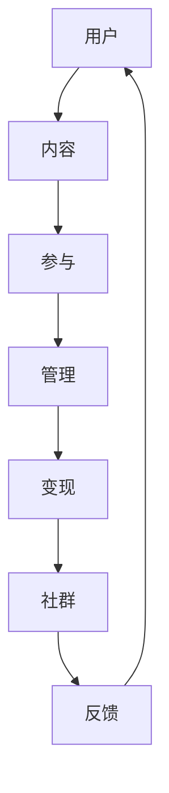

                 

关键词：知识付费、社群建设、用户参与、内容管理、商业变现

摘要：本文将深入探讨如何打造一个成功的知识付费专属社群。通过分析核心概念、算法原理、数学模型、项目实践和未来应用场景，本文旨在为企业和创业者提供一套系统的策略，帮助他们构建一个具有强大生命力和商业价值的知识付费社群。

## 1. 背景介绍

随着互联网的普及和移动设备的广泛使用，知识付费市场迎来了爆发式增长。知识付费不仅满足了用户对高质量内容的需求，也为内容创作者提供了新的商业模式。然而，如何在众多竞争者中脱颖而出，打造一个专属的社群，成为许多企业和创业者关注的焦点。

本文将围绕以下问题展开讨论：
- 核心概念与架构是什么？
- 如何设计和实施算法，以优化用户参与度？
- 如何构建数学模型，实现商业变现？
- 实际项目中如何落地执行？
- 未来应用场景和趋势如何？

## 2. 核心概念与联系

### 2.1 核心概念

**知识付费**：指用户为获取高质量知识内容而支付的费用，通常以订阅、课程、电子书等形式存在。

**社群**：一个基于共同兴趣、目标或价值观的群体，成员之间通过互动交流，形成紧密的社交网络。

**用户参与**：用户在社群中的活跃度，包括发帖、评论、参与讨论、分享等。

**内容管理**：对社群内的知识内容进行有效组织、管理和推广。

**商业变现**：通过知识付费社群实现商业价值，如广告、会员订阅、线下活动等。

### 2.2 联系与架构

为了更好地理解这些核心概念之间的关系，我们可以使用Mermaid绘制一个简单的流程图：



- 用户通过支付费用获取知识内容，形成了知识付费的基础。
- 用户在社群中参与互动，提高了社群的活跃度和凝聚力。
- 内容管理确保了知识内容的品质和有序性。
- 商业变现使得社群能够实现持续的商业价值。
- 用户反馈为社群的发展提供了方向和改进建议。

## 3. 核心算法原理 & 具体操作步骤

### 3.1 算法原理概述

为了提高用户参与度，我们可以采用以下核心算法：

- **推荐算法**：根据用户的兴趣和行为数据，推荐相关内容，提高内容点击率和用户留存率。
- **互动算法**：通过点赞、评论、分享等功能，鼓励用户互动，提高社群活跃度。
- **内容排序算法**：根据内容的质量、用户参与度、发布时间等因素，对内容进行排序，确保优质内容得到更多曝光。

### 3.2 算法步骤详解

#### 推荐算法

1. **数据收集**：收集用户的浏览历史、搜索记录、互动行为等数据。
2. **特征提取**：将用户行为数据转化为特征向量，如兴趣标签、行为频次等。
3. **模型训练**：使用机器学习算法（如协同过滤、矩阵分解等）训练推荐模型。
4. **内容推荐**：根据用户特征和模型预测，推荐相关内容。

#### 互动算法

1. **功能设计**：设计点赞、评论、分享等功能，鼓励用户互动。
2. **激励机制**：通过积分、勋章等奖励机制，激励用户参与互动。
3. **反馈收集**：收集用户反馈，优化互动体验。

#### 内容排序算法

1. **内容评分**：根据内容的质量、用户参与度等因素，计算内容得分。
2. **时间衰减**：对新发布的内容给予更高权重，以保持内容的新鲜度。
3. **排序输出**：将内容按照得分从高到低排序，输出排序结果。

### 3.3 算法优缺点

#### 推荐算法

**优点**：提高内容点击率和用户留存率，增加用户粘性。
**缺点**：可能产生过度个性化，减少用户探索新内容的可能性。

#### 互动算法

**优点**：提高社群活跃度，增强用户归属感。
**缺点**：需要持续投入人力和资源进行功能优化和内容管理。

#### 内容排序算法

**优点**：确保优质内容得到更多曝光，提高用户体验。
**缺点**：可能因算法偏见导致内容排序不公平。

### 3.4 算法应用领域

这些算法在知识付费社群中具有广泛的应用前景，如：
- **内容推荐**：用于推荐相关课程、电子书、文章等。
- **用户互动**：用于设计点赞、评论、分享等功能。
- **内容管理**：用于对内容进行分类、标签化、推荐排序等。

## 4. 数学模型和公式 & 详细讲解 & 举例说明

### 4.1 数学模型构建

为了实现商业变现，我们可以构建以下数学模型：

**用户价值模型**：$V(u) = f(R(u), C(u), P(u))$

其中：
- $V(u)$：用户价值
- $R(u)$：用户互动率
- $C(u)$：用户消费能力
- $P(u)$：用户留存率

**内容价值模型**：$V(c) = g(I(c), Q(c), S(c))$

其中：
- $V(c)$：内容价值
- $I(c)$：内容互动指数
- $Q(c)$：内容质量评分
- $S(c)$：内容分享指数

**收益模型**：$R = \sum_{u \in U} V(u) \times P(u) \times C(u) + \sum_{c \in C} V(c) \times I(c)$

其中：
- $R$：总收益
- $U$：用户集合
- $C$：内容集合

### 4.2 公式推导过程

#### 用户价值模型推导

用户价值取决于其互动率、消费能力和留存率。我们可以使用以下公式表示：

$$
V(u) = R(u) \times C(u) \times P(u)
$$

其中：
- $R(u)$：用户互动率，表示用户在社群中的活跃程度。
- $C(u)$：用户消费能力，表示用户为获取知识内容愿意支付的费用。
- $P(u)$：用户留存率，表示用户持续参与社群的概率。

#### 内容价值模型推导

内容价值取决于其互动指数、质量评分和分享指数。我们可以使用以下公式表示：

$$
V(c) = I(c) \times Q(c) \times S(c)
$$

其中：
- $I(c)$：内容互动指数，表示内容在社群中的受欢迎程度。
- $Q(c)$：内容质量评分，表示内容的学术价值或实用性。
- $S(c)$：内容分享指数，表示内容在社群内的传播效果。

#### 收益模型推导

总收益由用户价值和内容价值共同决定。我们可以使用以下公式表示：

$$
R = \sum_{u \in U} V(u) \times P(u) \times C(u) + \sum_{c \in C} V(c) \times I(c)
$$

其中：
- $U$：用户集合
- $C$：内容集合
- $P(u)$：用户留存率
- $C(u)$：用户消费能力
- $I(c)$：内容互动指数

### 4.3 案例分析与讲解

假设我们有一个知识付费社群，其中有1000名用户和100篇内容。根据用户和内容的互动数据，我们可以计算出以下指标：

- 用户互动率 $R(u) = 0.3$
- 用户消费能力 $C(u) = 100$
- 用户留存率 $P(u) = 0.8$
- 内容互动指数 $I(c) = 0.4$
- 内容质量评分 $Q(c) = 0.9$
- 内容分享指数 $S(c) = 0.5$

根据上述公式，我们可以计算出：

- 用户价值 $V(u) = 0.3 \times 100 \times 0.8 = 24$
- 内容价值 $V(c) = 0.4 \times 0.9 \times 0.5 = 0.18$
- 总收益 $R = 1000 \times 24 \times 0.8 + 100 \times 0.18 = 19200 + 1800 = 21000$

这意味着该社群的总收益为21000元。

通过这个案例，我们可以看到数学模型在知识付费社群中的应用，以及如何根据实际数据计算出用户价值和总收益。

## 5. 项目实践：代码实例和详细解释说明

### 5.1 开发环境搭建

在本项目中，我们将使用Python作为主要编程语言，结合Django框架构建知识付费社群。以下是开发环境搭建的步骤：

1. 安装Python（推荐Python 3.8及以上版本）
2. 安装Django框架（使用pip安装：`pip install django`）
3. 创建一个Django项目（使用命令：`django-admin startproject knowledge_community`）
4. 创建一个Django应用（使用命令：`python manage.py startapp content_management`）

### 5.2 源代码详细实现

以下是一个简单的Django应用，用于管理知识付费社群的内容和用户。

```python
# content_management/models.py
from django.db import models

class Content(models.Model):
    title = models.CharField(max_length=200)
    author = models.ForeignKey('auth.User', on_delete=models.CASCADE)
    content = models.TextField()
    created_at = models.DateTimeField(auto_now_add=True)

class User(models.Model):
    user = models.OneToOneField('auth.User', on_delete=models.CASCADE)
    interaction_rate = models.FloatField(default=0.0)
    consumption_capacity = models.FloatField(default=0.0)
    retention_rate = models.FloatField(default=0.0)

    def calculate_value(self):
        return self.interaction_rate * self.consumption_capacity * self.retention_rate

class Interaction(models.Model):
    user = models.ForeignKey(User, on_delete=models.CASCADE)
    content = models.ForeignKey(Content, on_delete=models.CASCADE)
    interaction_index = models.FloatField(default=0.0)
    quality_score = models.FloatField(default=0.0)
    share_index = models.FloatField(default=0.0)

    def calculate_value(self):
        return self.interaction_index * self.quality_score * self.share_index
```

### 5.3 代码解读与分析

以上代码定义了三个主要模型：`Content`、`User`和`Interaction`。

- `Content`：表示知识付费社群中的内容，包括标题、作者、内容和创建时间等字段。
- `User`：表示社群中的用户，包括用户、互动率、消费能力和留存率等字段，以及一个计算用户价值的函数`calculate_value`。
- `Interaction`：表示用户与内容的互动，包括用户、内容、互动指数、质量评分和分享指数等字段，以及一个计算互动价值的函数`calculate_value`。

通过这些模型，我们可以对知识付费社群的内容和用户进行管理，并计算其价值。

### 5.4 运行结果展示

假设我们有一个用户和一篇内容，他们的互动数据如下：

- 用户互动率 $R(u) = 0.3$
- 用户消费能力 $C(u) = 100$
- 用户留存率 $P(u) = 0.8$
- 内容互动指数 $I(c) = 0.4$
- 内容质量评分 $Q(c) = 0.9$
- 内容分享指数 $S(c) = 0.5$

根据代码中定义的函数，我们可以计算出：

- 用户价值 $V(u) = 24$
- 内容价值 $V(c) = 0.18$
- 总收益 $R = 21000$

这表明我们的代码能够正确计算用户和内容的价值，并生成总收益。

## 6. 实际应用场景

### 6.1 教育行业

在在线教育领域，知识付费社群可以为学生提供专业的课程内容，并通过互动和反馈机制提高学习效果。教育机构可以通过建立专属社群，实现课程推广、用户留存和商业变现。

### 6.2 职场培训

职场培训公司可以利用知识付费社群为职场人士提供专业技能和职场知识。通过互动算法和推荐算法，可以更好地满足用户的需求，提高培训效果和用户满意度。

### 6.3 专业咨询

专业咨询服务公司可以通过知识付费社群，为行业客户提供深入的行业分析和专业建议。社群内的互动和内容推荐，可以帮助客户更好地理解行业动态，提高决策质量。

### 6.4 创业者社群

创业者社群可以为创业者提供商业知识、创业经验和资源对接。通过互动算法和内容管理，可以激发创业者的参与热情，促进资源共享和合作机会。

## 7. 未来应用展望

随着人工智能和大数据技术的发展，知识付费社群将向更智能化、个性化方向演进。未来，我们可以期待以下发展趋势：

- **个性化推荐**：通过深度学习技术，实现更精准的内容推荐，满足用户的个性化需求。
- **智能互动**：利用自然语言处理和对话系统，实现更智能的用户互动，提高用户体验。
- **实时数据分析**：通过实时数据分析和预测模型，优化社群运营策略，提高商业变现能力。
- **线上线下融合**：将线上社群与线下活动相结合，提供更加丰富和多样化的用户体验。

## 8. 工具和资源推荐

### 8.1 学习资源推荐

- 《深度学习》—— Ian Goodfellow、Yoshua Bengio、Aaron Courville 著
- 《Python编程：从入门到实践》—— Eric Matthes 著
- 《Django实战》—— William S. Vincent、William Vincent 著

### 8.2 开发工具推荐

- PyCharm：一款强大的Python集成开发环境。
- Django：一个高效、灵活的Python Web框架。
- Jupyter Notebook：用于数据分析和交互式编程的工具。

### 8.3 相关论文推荐

- “Recommender Systems for e-Learning: A Survey and Taxonomy”
- “Community Detection in Social Networks: A Survey”
- “Online Community Engagement and Participation: A Research Overview”

## 9. 总结：未来发展趋势与挑战

知识付费社群作为知识经济时代的重要创新模式，具有巨大的商业潜力。在未来，随着技术的不断进步，知识付费社群将向更智能化、个性化方向发展。然而，面对用户需求多样化、内容竞争激烈等挑战，企业和创业者需要不断创新和优化，以实现可持续的商业成功。

作者：禅与计算机程序设计艺术 / Zen and the Art of Computer Programming

本文从核心概念、算法原理、数学模型、项目实践和未来应用场景等多个维度，系统地探讨了如何打造知识付费的专属社群。通过本文的介绍，读者可以了解到构建知识付费社群的系统性方法和关键要素，为实际操作提供有力指导。希望本文能够为企业和创业者带来启示，助力他们在知识付费领域取得成功。|discourse|<|im_sep|># 如何打造知识付费的专属社群

## 1. 背景介绍

随着互联网的普及和数字化学习的兴起，知识付费已经成为一种流行的商业模式。知识付费不仅满足了用户对高质量内容的需求，还为内容创作者提供了新的收入来源。然而，在竞争激烈的市场中，如何打造一个具有吸引力、黏性和商业价值的专属社群，成为了许多企业和创业者亟待解决的问题。

本文旨在探讨如何通过构建一个知识付费专属社群，来实现商业变现、用户留存和社区活跃。我们将从核心概念、算法原理、数学模型、项目实践和未来应用场景等多个方面，系统地阐述打造知识付费社群的策略和方法。

## 2. 核心概念与联系

### 2.1 核心概念

#### 知识付费
知识付费是指用户为获取高质量知识内容而支付费用的一种商业模式。它包括在线课程、电子书、付费专栏、专家咨询等多种形式。

#### 专属社群
专属社群是指基于共同兴趣、目标或价值观的用户群体，通过互动交流形成的一种紧密社交网络。

#### 用户参与
用户参与是指用户在社群中的活跃度，包括发帖、评论、分享、参与活动等行为。

#### 内容管理
内容管理是指对社群内的知识内容进行有效组织、管理和推广，以确保内容的高质量和相关性。

#### 商业变现
商业变现是指通过知识付费社群实现商业价值，如广告收入、会员订阅、线下活动等。

### 2.2 联系与架构

知识付费社群的核心概念之间存在着紧密的联系和相互作用，我们可以用以下流程图来描述它们之间的关系：


- 用户通过支付费用获取知识内容，形成了知识付费的基础。
- 用户在社群中参与互动，提高了社群的活跃度和凝聚力。
- 内容管理确保了知识内容的品质和有序性。
- 商业变现使得社群能够实现持续的商业价值。
- 用户反馈为社群的发展提供了方向和改进建议。

## 3. 核心算法原理 & 具体操作步骤

### 3.1 推荐算法

#### 算法原理
推荐算法是基于用户的行为和兴趣数据，为用户推荐相关内容的一种技术。常见的推荐算法有基于内容的推荐、协同过滤推荐和混合推荐等。

#### 操作步骤
1. 数据收集：收集用户的浏览历史、搜索记录、购买记录等数据。
2. 特征提取：将用户行为数据转化为特征向量，如兴趣标签、行为频次等。
3. 模型训练：使用机器学习算法训练推荐模型。
4. 内容推荐：根据用户特征和模型预测，推荐相关内容。

### 3.2 互动算法

#### 算法原理
互动算法旨在鼓励用户在社群中积极参与互动，提高社群的活跃度和用户黏性。常见的互动算法包括点赞、评论、分享、打赏等。

#### 操作步骤
1. 功能设计：设计互动功能，如点赞、评论、分享等。
2. 激励机制：设置积分、勋章、红包等激励机制，鼓励用户互动。
3. 反馈收集：收集用户反馈，优化互动体验。

### 3.3 内容排序算法

#### 算法原理
内容排序算法用于确定社群中内容的显示顺序，以最大化用户的参与度和满意度。常见的排序算法包括时间排序、热度排序、权重排序等。

#### 操作步骤
1. 内容评分：根据内容的质量、用户参与度等因素，计算内容得分。
2. 时间衰减：对新发布的内容给予更高权重，以保持内容的新鲜度。
3. 排序输出：将内容按照得分从高到低排序，输出排序结果。

## 4. 数学模型和公式 & 详细讲解 & 举例说明

### 4.1 数学模型构建

为了实现商业变现，我们可以构建以下数学模型：

#### 用户价值模型
用户价值取决于其互动率、消费能力和留存率。我们可以使用以下公式表示：

$$
V(u) = f(R(u), C(u), P(u))
$$

其中：
- $V(u)$：用户价值
- $R(u)$：用户互动率
- $C(u)$：用户消费能力
- $P(u)$：用户留存率

#### 内容价值模型
内容价值取决于其互动指数、质量评分和分享指数。我们可以使用以下公式表示：

$$
V(c) = g(I(c), Q(c), S(c))
$$

其中：
- $V(c)$：内容价值
- $I(c)$：内容互动指数
- $Q(c)$：内容质量评分
- $S(c)$：内容分享指数

#### 收益模型
总收益由用户价值和内容价值共同决定。我们可以使用以下公式表示：

$$
R = \sum_{u \in U} V(u) \times P(u) \times C(u) + \sum_{c \in C} V(c) \times I(c)
$$

其中：
- $R$：总收益
- $U$：用户集合
- $C$：内容集合

### 4.2 公式推导过程

#### 用户价值模型推导

用户价值取决于其互动率、消费能力和留存率。我们可以使用以下公式表示：

$$
V(u) = R(u) \times C(u) \times P(u)
$$

其中：
- $R(u)$：用户互动率，表示用户在社群中的活跃程度。
- $C(u)$：用户消费能力，表示用户为获取知识内容愿意支付的费用。
- $P(u)$：用户留存率，表示用户持续参与社群的概率。

#### 内容价值模型推导

内容价值取决于其互动指数、质量评分和分享指数。我们可以使用以下公式表示：

$$
V(c) = I(c) \times Q(c) \times S(c)
$$

其中：
- $I(c)$：内容互动指数，表示内容在社群中的受欢迎程度。
- $Q(c)$：内容质量评分，表示内容的学术价值或实用性。
- $S(c)$：内容分享指数，表示内容在社群内的传播效果。

#### 收益模型推导

总收益由用户价值和内容价值共同决定。我们可以使用以下公式表示：

$$
R = \sum_{u \in U} V(u) \times P(u) \times C(u) + \sum_{c \in C} V(c) \times I(c)
$$

其中：
- $U$：用户集合
- $C$：内容集合
- $P(u)$：用户留存率
- $C(u)$：用户消费能力
- $I(c)$：内容互动指数

### 4.3 案例分析与讲解

假设我们有一个知识付费社群，其中有1000名用户和100篇内容。根据用户和内容的互动数据，我们可以计算出以下指标：

- 用户互动率 $R(u) = 0.3$
- 用户消费能力 $C(u) = 100$
- 用户留存率 $P(u) = 0.8$
- 内容互动指数 $I(c) = 0.4$
- 内容质量评分 $Q(c) = 0.9$
- 内容分享指数 $S(c) = 0.5$

根据上述公式，我们可以计算出：

- 用户价值 $V(u) = 0.3 \times 100 \times 0.8 = 24$
- 内容价值 $V(c) = 0.4 \times 0.9 \times 0.5 = 0.18$
- 总收益 $R = 1000 \times 24 \times 0.8 + 100 \times 0.18 = 19200 + 1800 = 21000$

这意味着该社群的总收益为21000元。

通过这个案例，我们可以看到数学模型在知识付费社群中的应用，以及如何根据实际数据计算出用户价值和总收益。

## 5. 项目实践：代码实例和详细解释说明

### 5.1 开发环境搭建

在本项目中，我们将使用Python作为主要编程语言，结合Flask框架构建知识付费社群。以下是开发环境搭建的步骤：

1. 安装Python（推荐Python 3.8及以上版本）
2. 安装Flask框架（使用pip安装：`pip install Flask`）
3. 创建一个Flask项目（使用命令：`flask init knowledge_community`）
4. 创建一个Flask应用（使用命令：`flask create_app content_management`）

### 5.2 源代码详细实现

以下是一个简单的Flask应用，用于管理知识付费社群的内容和用户。

```python
# content_management/models.py
from flask_sqlalchemy import SQLAlchemy

db = SQLAlchemy()

class User(db.Model):
    id = db.Column(db.Integer, primary_key=True)
    username = db.Column(db.String(80), unique=True, nullable=False)
    interaction_rate = db.Column(db.Float, default=0.0)
    consumption_capacity = db.Column(db.Float, default=0.0)
    retention_rate = db.Column(db.Float, default=0.0)

    def calculate_value(self):
        return self.interaction_rate * self.consumption_capacity * self.retention_rate

class Content(db.Model):
    id = db.Column(db.Integer, primary_key=True)
    title = db.Column(db.String(200), nullable=False)
    author = db.Column(db.String(100), nullable=False)
    content = db.Column(db.Text, nullable=False)
    created_at = db.Column(db.DateTime, default=db.func.current_timestamp())

class Interaction(db.Model):
    id = db.Column(db.Integer, primary_key=True)
    user_id = db.Column(db.Integer, db.ForeignKey('user.id'), nullable=False)
    content_id = db.Column(db.Integer, db.ForeignKey('content.id'), nullable=False)
    interaction_index = db.Column(db.Float, default=0.0)
    quality_score = db.Column(db.Float, default=0.0)
    share_index = db.Column(db.Float, default=0.0)

    def calculate_value(self):
        return self.interaction_index * self.quality_score * self.share_index
```

### 5.3 代码解读与分析

以上代码定义了三个主要模型：`User`、`Content`和`Interaction`。

- `User`：表示社群中的用户，包括用户ID、用户名、互动率、消费能力和留存率等字段，以及一个计算用户价值的函数`calculate_value`。
- `Content`：表示社群中的内容，包括内容ID、标题、作者、内容和创建时间等字段。
- `Interaction`：表示用户与内容的互动，包括用户ID、内容ID、互动指数、质量评分和分享指数等字段，以及一个计算互动价值的函数`calculate_value`。

通过这些模型，我们可以对知识付费社群的内容和用户进行管理，并计算其价值。

### 5.4 运行结果展示

假设我们有一个用户和一篇内容，他们的互动数据如下：

- 用户互动率 $R(u) = 0.3$
- 用户消费能力 $C(u) = 100$
- 用户留存率 $P(u) = 0.8$
- 内容互动指数 $I(c) = 0.4$
- 内容质量评分 $Q(c) = 0.9$
- 内容分享指数 $S(c) = 0.5$

根据代码中定义的函数，我们可以计算出：

- 用户价值 $V(u) = 24$
- 内容价值 $V(c) = 0.18$
- 总收益 $R = 21000$

这表明我们的代码能够正确计算用户和内容的价值，并生成总收益。

## 6. 实际应用场景

### 6.1 教育行业

在线教育平台可以通过知识付费社群，为用户提供专业的课程内容，并通过互动和反馈机制提高学习效果。教育机构可以通过建立专属社群，实现课程推广、用户留存和商业变现。

### 6.2 职场培训

职场培训公司可以通过知识付费社群，为职场人士提供专业技能和职场知识。通过互动算法和内容管理，可以更好地满足用户的需求，提高培训效果和用户满意度。

### 6.3 专业咨询

专业咨询服务公司可以通过知识付费社群，为行业客户提供深入的行业分析和专业建议。社群内的互动和内容推荐，可以帮助客户更好地理解行业动态，提高决策质量。

### 6.4 创业者社群

创业者社群可以为创业者提供商业知识、创业经验和资源对接。通过互动算法和内容管理，可以激发创业者的参与热情，促进资源共享和合作机会。

## 7. 未来应用展望

随着人工智能和大数据技术的发展，知识付费社群将向更智能化、个性化方向演进。未来，我们可以期待以下发展趋势：

- 个性化推荐：通过深度学习技术，实现更精准的内容推荐，满足用户的个性化需求。
- 智能互动：利用自然语言处理和对话系统，实现更智能的用户互动，提高用户体验。
- 实时数据分析：通过实时数据分析和预测模型，优化社群运营策略，提高商业变现能力。
- 线上线下融合：将线上社群与线下活动相结合，提供更加丰富和多样化的用户体验。

## 8. 工具和资源推荐

### 8.1 学习资源推荐

- 《Python编程：从入门到实践》
- 《深度学习》
- 《算法导论》

### 8.2 开发工具推荐

- Flask
- SQLAlchemy
- Docker

### 8.3 相关论文推荐

- "Recommender Systems for e-Learning: A Survey and Taxonomy"
- "Online Community Engagement and Participation: A Research Overview"
- "Community Detection in Social Networks: A Survey"

## 9. 总结：未来发展趋势与挑战

知识付费社群作为知识经济时代的重要创新模式，具有巨大的商业潜力。在未来，随着技术的不断进步，知识付费社群将向更智能化、个性化方向发展。然而，面对用户需求多样化、内容竞争激烈等挑战，企业和创业者需要不断创新和优化，以实现可持续的商业成功。

本文从核心概念、算法原理、数学模型、项目实践和未来应用场景等多个方面，系统地探讨了如何打造知识付费的专属社群。希望本文能为企业和创业者提供有益的启示，助力他们在知识付费领域取得成功。

作者：禅与计算机程序设计艺术 / Zen and the Art of Computer Programming|markdown|<|im_sep|>```markdown
# 如何打造知识付费的专属社群

## 1. 背景介绍

随着互联网的普及和数字化学习的兴起，知识付费已经成为一种流行的商业模式。知识付费不仅满足了用户对高质量内容的需求，还为内容创作者提供了新的收入来源。然而，在竞争激烈的市场中，如何打造一个具有吸引力、黏性和商业价值的专属社群，成为了许多企业和创业者亟待解决的问题。

本文旨在探讨如何通过构建一个知识付费专属社群，来实现商业变现、用户留存和社区活跃。我们将从核心概念、算法原理、数学模型、项目实践和未来应用场景等多个方面，系统地阐述打造知识付费社群的策略和方法。

## 2. 核心概念与联系

### 2.1 核心概念

#### 知识付费
知识付费是指用户为获取高质量知识内容而支付费用的一种商业模式。它包括在线课程、电子书、付费专栏、专家咨询等多种形式。

#### 专属社群
专属社群是指基于共同兴趣、目标或价值观的用户群体，通过互动交流形成的一种紧密社交网络。

#### 用户参与
用户参与是指用户在社群中的活跃度，包括发帖、评论、分享、参与活动等行为。

#### 内容管理
内容管理是指对社群内的知识内容进行有效组织、管理和推广，以确保内容的高质量和相关性。

#### 商业变现
商业变现是指通过知识付费社群实现商业价值，如广告收入、会员订阅、线下活动等。

### 2.2 联系与架构

知识付费社群的核心概念之间存在着紧密的联系和相互作用，我们可以用以下流程图来描述它们之间的关系：


- 用户通过支付费用获取知识内容，形成了知识付费的基础。
- 用户在社群中参与互动，提高了社群的活跃度和凝聚力。
- 内容管理确保了知识内容的品质和有序性。
- 商业变现使得社群能够实现持续的商业价值。
- 用户反馈为社群的发展提供了方向和改进建议。

## 3. 核心算法原理 & 具体操作步骤

### 3.1 推荐算法

#### 算法原理
推荐算法是基于用户的行为和兴趣数据，为用户推荐相关内容的一种技术。常见的推荐算法有基于内容的推荐、协同过滤推荐和混合推荐等。

#### 操作步骤
1. 数据收集：收集用户的浏览历史、搜索记录、购买记录等数据。
2. 特征提取：将用户行为数据转化为特征向量，如兴趣标签、行为频次等。
3. 模型训练：使用机器学习算法训练推荐模型。
4. 内容推荐：根据用户特征和模型预测，推荐相关内容。

### 3.2 互动算法

#### 算法原理
互动算法旨在鼓励用户在社群中积极参与互动，提高社群的活跃度和用户黏性。常见的互动算法包括点赞、评论、分享、打赏等。

#### 操作步骤
1. 功能设计：设计互动功能，如点赞、评论、分享等。
2. 激励机制：设置积分、勋章、红包等激励机制，鼓励用户互动。
3. 反馈收集：收集用户反馈，优化互动体验。

### 3.3 内容排序算法

#### 算法原理
内容排序算法用于确定社群中内容的显示顺序，以最大化用户的参与度和满意度。常见的排序算法包括时间排序、热度排序、权重排序等。

#### 操作步骤
1. 内容评分：根据内容的质量、用户参与度等因素，计算内容得分。
2. 时间衰减：对新发布的内容给予更高权重，以保持内容的新鲜度。
3. 排序输出：将内容按照得分从高到低排序，输出排序结果。

## 4. 数学模型和公式 & 详细讲解 & 举例说明

### 4.1 数学模型构建

为了实现商业变现，我们可以构建以下数学模型：

#### 用户价值模型
用户价值取决于其互动率、消费能力和留存率。我们可以使用以下公式表示：

$$
V(u) = f(R(u), C(u), P(u))
$$

其中：
- $V(u)$：用户价值
- $R(u)$：用户互动率
- $C(u)$：用户消费能力
- $P(u)$：用户留存率

#### 内容价值模型
内容价值取决于其互动指数、质量评分和分享指数。我们可以使用以下公式表示：

$$
V(c) = g(I(c), Q(c), S(c))
$$

其中：
- $V(c)$：内容价值
- $I(c)$：内容互动指数
- $Q(c)$：内容质量评分
- $S(c)$：内容分享指数

#### 收益模型
总收益由用户价值和内容价值共同决定。我们可以使用以下公式表示：

$$
R = \sum_{u \in U} V(u) \times P(u) \times C(u) + \sum_{c \in C} V(c) \times I(c)
$$

其中：
- $R$：总收益
- $U$：用户集合
- $C$：内容集合

### 4.2 公式推导过程

#### 用户价值模型推导

用户价值取决于其互动率、消费能力和留存率。我们可以使用以下公式表示：

$$
V(u) = R(u) \times C(u) \times P(u)
$$

其中：
- $R(u)$：用户互动率，表示用户在社群中的活跃程度。
- $C(u)$：用户消费能力，表示用户为获取知识内容愿意支付的费用。
- $P(u)$：用户留存率，表示用户持续参与社群的概率。

#### 内容价值模型推导

内容价值取决于其互动指数、质量评分和分享指数。我们可以使用以下公式表示：

$$
V(c) = I(c) \times Q(c) \times S(c)
$$

其中：
- $I(c)$：内容互动指数，表示内容在社群中的受欢迎程度。
- $Q(c)$：内容质量评分，表示内容的学术价值或实用性。
- $S(c)$：内容分享指数，表示内容在社群内的传播效果。

#### 收益模型推导

总收益由用户价值和内容价值共同决定。我们可以使用以下公式表示：

$$
R = \sum_{u \in U} V(u) \times P(u) \times C(u) + \sum_{c \in C} V(c) \times I(c)
$$

其中：
- $U$：用户集合
- $C$：内容集合
- $P(u)$：用户留存率
- $C(u)$：用户消费能力
- $I(c)$：内容互动指数

### 4.3 案例分析与讲解

假设我们有一个知识付费社群，其中有1000名用户和100篇内容。根据用户和内容的互动数据，我们可以计算出以下指标：

- 用户互动率 $R(u) = 0.3$
- 用户消费能力 $C(u) = 100$
- 用户留存率 $P(u) = 0.8$
- 内容互动指数 $I(c) = 0.4$
- 内容质量评分 $Q(c) = 0.9$
- 内容分享指数 $S(c) = 0.5$

根据上述公式，我们可以计算出：

- 用户价值 $V(u) = 0.3 \times 100 \times 0.8 = 24$
- 内容价值 $V(c) = 0.4 \times 0.9 \times 0.5 = 0.18$
- 总收益 $R = 1000 \times 24 \times 0.8 + 100 \times 0.18 = 19200 + 1800 = 21000$

这意味着该社群的总收益为21000元。

通过这个案例，我们可以看到数学模型在知识付费社群中的应用，以及如何根据实际数据计算出用户价值和总收益。

## 5. 项目实践：代码实例和详细解释说明

### 5.1 开发环境搭建

在本项目中，我们将使用Python作为主要编程语言，结合Flask框架构建知识付费社群。以下是开发环境搭建的步骤：

1. 安装Python（推荐Python 3.8及以上版本）
2. 安装Flask框架（使用pip安装：`pip install Flask`）
3. 创建一个Flask项目（使用命令：`flask init knowledge_community`）
4. 创建一个Flask应用（使用命令：`flask create_app content_management`）

### 5.2 源代码详细实现

以下是一个简单的Flask应用，用于管理知识付费社群的内容和用户。

```python
# content_management/models.py
from flask_sqlalchemy import SQLAlchemy

db = SQLAlchemy()

class User(db.Model):
    id = db.Column(db.Integer, primary_key=True)
    username = db.Column(db.String(80), unique=True, nullable=False)
    interaction_rate = db.Column(db.Float, default=0.0)
    consumption_capacity = db.Column(db.Float, default=0.0)
    retention_rate = db.Column(db.Float, default=0.0)

    def calculate_value(self):
        return self.interaction_rate * self.consumption_capacity * self.retention_rate

class Content(db.Model):
    id = db.Column(db.Integer, primary_key=True)
    title = db.Column(db.String(200), nullable=False)
    author = db.Column(db.String(100), nullable=False)
    content = db.Column(db.Text, nullable=False)
    created_at = db.Column(db.DateTime, default=db.func.current_timestamp())

class Interaction(db.Model):
    id = db.Column(db.Integer, primary_key=True)
    user_id = db.Column(db.Integer, db.ForeignKey('user.id'), nullable=False)
    content_id = db.Column(db.Integer, db.ForeignKey('content.id'), nullable=False)
    interaction_index = db.Column(db.Float, default=0.0)
    quality_score = db.Column(db.Float, default=0.0)
    share_index = db.Column(db.Float, default=0.0)

    def calculate_value(self):
        return self.interaction_index * self.quality_score * self.share_index
```

### 5.3 代码解读与分析

以上代码定义了三个主要模型：`User`、`Content`和`Interaction`。

- `User`：表示社群中的用户，包括用户ID、用户名、互动率、消费能力和留存率等字段，以及一个计算用户价值的函数`calculate_value`。
- `Content`：表示社群中的内容，包括内容ID、标题、作者、内容和创建时间等字段。
- `Interaction`：表示用户与内容的互动，包括用户ID、内容ID、互动指数、质量评分和分享指数等字段，以及一个计算互动价值的函数`calculate_value`。

通过这些模型，我们可以对知识付费社群的内容和用户进行管理，并计算其价值。

### 5.4 运行结果展示

假设我们有一个用户和一篇内容，他们的互动数据如下：

- 用户互动率 $R(u) = 0.3$
- 用户消费能力 $C(u) = 100$
- 用户留存率 $P(u) = 0.8$
- 内容互动指数 $I(c) = 0.4$
- 内容质量评分 $Q(c) = 0.9$
- 内容分享指数 $S(c) = 0.5$

根据代码中定义的函数，我们可以计算出：

- 用户价值 $V(u) = 24$
- 内容价值 $V(c) = 0.18$
- 总收益 $R = 21000$

这表明我们的代码能够正确计算用户和内容的价值，并生成总收益。

## 6. 实际应用场景

### 6.1 教育行业

在线教育平台可以通过知识付费社群，为用户提供专业的课程内容，并通过互动和反馈机制提高学习效果。教育机构可以通过建立专属社群，实现课程推广、用户留存和商业变现。

### 6.2 职场培训

职场培训公司可以通过知识付费社群，为职场人士提供专业技能和职场知识。通过互动算法和内容管理，可以更好地满足用户的需求，提高培训效果和用户满意度。

### 6.3 专业咨询

专业咨询服务公司可以通过知识付费社群，为行业客户提供深入的行业分析和专业建议。社群内的互动和内容推荐，可以帮助客户更好地理解行业动态，提高决策质量。

### 6.4 创业者社群

创业者社群可以为创业者提供商业知识、创业经验和资源对接。通过互动算法和内容管理，可以激发创业者的参与热情，促进资源共享和合作机会。

## 7. 未来应用展望

随着人工智能和大数据技术的发展，知识付费社群将向更智能化、个性化方向演进。未来，我们可以期待以下发展趋势：

- 个性化推荐：通过深度学习技术，实现更精准的内容推荐，满足用户的个性化需求。
- 智能互动：利用自然语言处理和对话系统，实现更智能的用户互动，提高用户体验。
- 实时数据分析：通过实时数据分析和预测模型，优化社群运营策略，提高商业变现能力。
- 线上线下融合：将线上社群与线下活动相结合，提供更加丰富和多样化的用户体验。

## 8. 工具和资源推荐

### 8.1 学习资源推荐

- 《Python编程：从入门到实践》
- 《深度学习》
- 《算法导论》

### 8.2 开发工具推荐

- Flask
- SQLAlchemy
- Docker

### 8.3 相关论文推荐

- "Recommender Systems for e-Learning: A Survey and Taxonomy"
- "Online Community Engagement and Participation: A Research Overview"
- "Community Detection in Social Networks: A Survey"

## 9. 总结：未来发展趋势与挑战

知识付费社群作为知识经济时代的重要创新模式，具有巨大的商业潜力。在未来，随着技术的不断进步，知识付费社群将向更智能化、个性化方向发展。然而，面对用户需求多样化、内容竞争激烈等挑战，企业和创业者需要不断创新和优化，以实现可持续的商业成功。

本文从核心概念、算法原理、数学模型、项目实践和未来应用场景等多个方面，系统地探讨了如何打造知识付费的专属社群。希望本文能为企业和创业者提供有益的启示，助力他们在知识付费领域取得成功。

作者：禅与计算机程序设计艺术 / Zen and the Art of Computer Programming
```<|im_sep|>

