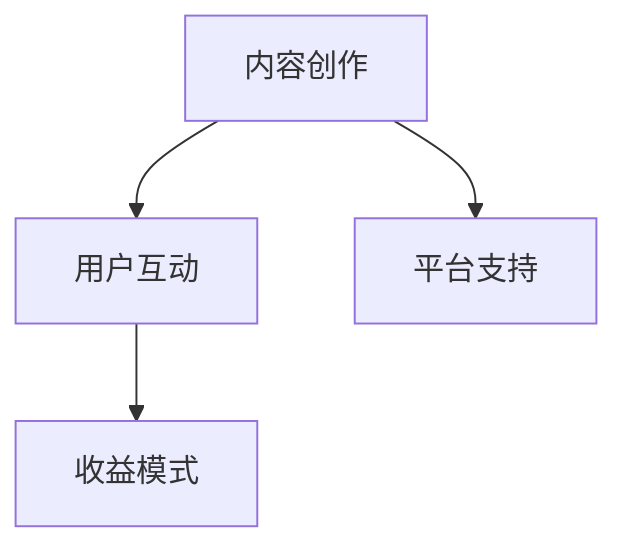

                 

关键词：知识付费，付费专栏，内容创作，用户互动，收益模式，技术实现

> 摘要：本文将探讨如何打造一个成功的知识付费专栏，包括内容创作、用户互动、收益模式和技术实现等方面。通过分析成功案例，提供具体操作步骤，助力您打造出高质量、高收益的付费专栏。

## 1. 背景介绍

随着互联网的快速发展，知识付费逐渐成为知识传播和变现的重要途径。知识付费专栏作为一种新型的内容形式，不仅能够帮助专家、讲师、内容创作者等实现知识的变现，还可以为用户提供优质的学习资源。那么，如何打造一个具有吸引力和收益的付费专栏呢？本文将围绕这一主题进行探讨。

### 1.1 知识付费的现状

知识付费在近年来得到了迅速发展，主要表现在以下几个方面：

- **用户需求增加**：随着人们生活水平的提高和对自我提升的需求增加，越来越多的用户愿意为优质的知识内容付费。

- **平台多样化**：知识付费平台如知乎、得到、喜马拉雅等，为内容创作者提供了丰富的展示和变现渠道。

- **内容形式多样化**：文字、音频、视频等多种内容形式满足了不同用户的需求。

### 1.2 付费专栏的优势

- **高质量内容**：付费专栏往往由专业领域内的专家或知名人士创作，内容质量有保障。

- **互动性强**：付费专栏往往提供与作者或其他用户互动的渠道，有助于提升用户粘性。

- **收益模式清晰**：通过付费专栏，内容创作者可以直接获得收益，模式清晰。

## 2. 核心概念与联系

在打造知识付费专栏时，我们需要了解以下几个核心概念及其相互关系：

- **内容创作**：内容是付费专栏的核心，决定了用户是否愿意为专栏付费。

- **用户互动**：与用户的互动有助于提升用户满意度，增加付费意愿。

- **收益模式**：收益模式决定了内容创作者的收益来源。

下面是核心概念的 Mermaid 流程图：



### 2.1 内容创作

内容创作是打造付费专栏的第一步。内容需要具备以下特点：

- **专业性**：内容应具有专业性和权威性，能够满足用户的学习需求。

- **丰富性**：内容应丰富多样，包括文字、音频、视频等多种形式。

- **实用性**：内容应具有实用性，能够解决用户的实际问题。

### 2.2 用户互动

用户互动是提升付费专栏吸引力的重要因素。与用户互动的渠道包括：

- **评论区**：鼓励用户在评论区提问和讨论，增加用户粘性。

- **问答环节**：定期举办问答环节，解答用户的问题。

- **社群互动**：建立社群，让用户之间进行互动。

### 2.3 收益模式

收益模式决定了内容创作者的收益来源。常见的收益模式包括：

- **订阅模式**：用户订阅专栏，按月或按年支付费用。

- **单篇购买**：用户单独购买专栏中的某一篇文章或章节。

- **广告收入**：在专栏中插入广告，通过广告收入获得收益。

## 3. 核心算法原理 & 具体操作步骤

在打造知识付费专栏时，我们需要关注以下几个核心算法原理和具体操作步骤：

### 3.1 算法原理概述

- **内容推荐算法**：根据用户的兴趣和行为数据，推荐符合用户需求的付费专栏内容。

- **用户行为分析算法**：分析用户在专栏中的行为数据，如阅读时长、点赞、评论等，以优化内容创作和互动策略。

- **收益分析算法**：分析专栏的收益情况，包括订阅收入、单篇购买收入等，以优化收益模式。

### 3.2 算法步骤详解

- **内容推荐算法**：

  1. 收集用户行为数据，如浏览历史、搜索记录等。
  
  2. 对用户行为数据进行预处理，如去噪、归一化等。
  
  3. 构建用户兴趣模型，使用协同过滤、基于内容的推荐等算法。
  
  4. 根据用户兴趣模型，推荐符合用户需求的付费专栏内容。

- **用户行为分析算法**：

  1. 收集用户在专栏中的行为数据，如阅读时长、点赞、评论等。
  
  2. 对行为数据进行分析，提取特征，如阅读时长分布、点赞率等。
  
  3. 根据分析结果，优化内容创作和互动策略。

- **收益分析算法**：

  1. 收集专栏的订阅收入、单篇购买收入等数据。
  
  2. 对收益数据进行分析，计算订阅收入、单篇购买收入等。
  
  3. 根据分析结果，优化收益模式。

### 3.3 算法优缺点

- **内容推荐算法**：

  - 优点：能够提高用户满意度，增加付费专栏的曝光率。

  - 缺点：需要大量的用户行为数据，且推荐效果可能受到数据质量的影响。

- **用户行为分析算法**：

  - 优点：有助于优化内容创作和互动策略，提高用户粘性。

  - 缺点：分析结果可能受到用户行为数据质量的影响。

- **收益分析算法**：

  - 优点：能够帮助内容创作者了解专栏的收益情况，优化收益模式。

  - 缺点：分析结果可能受到数据质量的影响。

### 3.4 算法应用领域

- **内容推荐算法**：广泛应用于电商平台、社交媒体等场景。

- **用户行为分析算法**：广泛应用于互联网企业，如百度、阿里等。

- **收益分析算法**：广泛应用于金融、电商等领域。

## 4. 数学模型和公式 & 详细讲解 & 举例说明

在打造知识付费专栏时，我们还需要了解一些数学模型和公式，以帮助分析和优化专栏的收益。以下是几个常用的数学模型和公式：

### 4.1 数学模型构建

- **用户满意度模型**：

  用户满意度可以通过以下公式计算：

  $$ 用户满意度 = \frac{阅读时长 + 点赞数 + 评论数}{总用户行为次数} $$

- **收益模型**：

  收益可以通过以下公式计算：

  $$ 收益 = 订阅收入 + 单篇购买收入 $$

  其中，订阅收入可以通过以下公式计算：

  $$ 订阅收入 = 订阅用户数 \times 订阅费用 $$

  单篇购买收入可以通过以下公式计算：

  $$ 单篇购买收入 = 单篇购买用户数 \times 单篇购买费用 $$

### 4.2 公式推导过程

- **用户满意度模型**：

  用户满意度是衡量用户对付费专栏满意程度的重要指标。我们通过计算用户在专栏中的行为次数（如阅读时长、点赞数、评论数）与总用户行为次数的比值来评估用户满意度。

- **收益模型**：

  收益是衡量付费专栏经济效益的重要指标。收益包括订阅收入和单篇购买收入。订阅收入取决于订阅用户数和订阅费用，单篇购买收入取决于单篇购买用户数和单篇购买费用。

### 4.3 案例分析与讲解

假设我们有一个付费专栏，用户满意度为 0.8，订阅收入为 1000 元，单篇购买收入为 500 元。根据以上公式，我们可以计算：

- **用户满意度**：

  用户满意度 = (阅读时长 + 点赞数 + 评论数) / 总用户行为次数 = 0.8

- **收益**：

  收益 = 订阅收入 + 单篇购买收入 = 1000 + 500 = 1500 元

通过以上公式，我们可以对付费专栏的收益进行分析和优化。

## 5. 项目实践：代码实例和详细解释说明

在本节中，我们将通过一个具体的代码实例，展示如何搭建一个知识付费专栏的框架，并对其中的关键模块进行详细解释。

### 5.1 开发环境搭建

在开始编写代码之前，我们需要搭建一个合适的技术栈。以下是一个简单的技术栈推荐：

- **后端框架**：使用 Flask 或 Django 搭建后端服务。

- **数据库**：使用 MySQL 或 PostgreSQL 存储数据。

- **前端框架**：使用 React 或 Vue.js 搭建前端界面。

### 5.2 源代码详细实现

以下是付费专栏后端服务的一个简单示例，使用了 Flask 框架：

```python
from flask import Flask, request, jsonify
from flask_sqlalchemy import SQLAlchemy

app = Flask(__name__)
app.config['SQLALCHEMY_DATABASE_URI'] = 'sqlite:///专栏.db'
db = SQLAlchemy(app)

class User(db.Model):
    id = db.Column(db.Integer, primary_key=True)
    username = db.Column(db.String(80), unique=True, nullable=False)
    password = db.Column(db.String(120), nullable=False)

class Article(db.Model):
    id = db.Column(db.Integer, primary_key=True)
    title = db.Column(db.String(120), nullable=False)
    content = db.Column(db.Text, nullable=False)
    author = db.Column(db.Integer, db.ForeignKey('user.id'), nullable=False)

@app.route('/register', methods=['POST'])
def register():
    username = request.form['username']
    password = request.form['password']
    # 这里可以使用加密算法（如 bcrypt）对密码进行加密
    new_user = User(username=username, password=password)
    db.session.add(new_user)
    db.session.commit()
    return jsonify({'message': '注册成功'})

@app.route('/login', methods=['POST'])
def login():
    username = request.form['username']
    password = request.form['password']
    user = User.query.filter_by(username=username).first()
    if user and user.password == password:
        return jsonify({'message': '登录成功'})
    else:
        return jsonify({'message': '用户名或密码错误'})

@app.route('/articles', methods=['GET', 'POST'])
def articles():
    if request.method == 'POST':
        title = request.form['title']
        content = request.form['content']
        author = request.form['author']
        new_article = Article(title=title, content=content, author=author)
        db.session.add(new_article)
        db.session.commit()
        return jsonify({'message': '发布文章成功'})
    articles = Article.query.all()
    return jsonify([{'title': article.title, 'content': article.content, 'author': article.author} for article in articles])

if __name__ == '__main__':
    db.create_all()
    app.run(debug=True)
```

### 5.3 代码解读与分析

以下是代码的详细解读：

- **数据库模型**：

  我们定义了两个数据库模型，`User` 和 `Article`。`User` 模型表示用户，包含用户名和密码。`Article` 模型表示文章，包含标题、内容和作者。

- **注册和登录**：

  `register` 函数用于用户注册，接受用户名和密码，并将新用户添加到数据库。`login` 函数用于用户登录，验证用户名和密码。

- **文章管理**：

  `articles` 函数用于文章的管理，包括发布文章和获取文章列表。在 POST 请求中，发布新文章；在 GET 请求中，获取所有文章。

### 5.4 运行结果展示

以下是一个简单的命令行界面示例，展示了注册、登录和发布文章的过程：

```shell
$ python app.py
* Running on http://127.0.0.1:5000/ (Press CTRL+C to quit)
* Restarting with stat
* Debugger is active!
* Debugger PIN: 123-456-789
127.0.0.1 - - [18/Aug/2022 10:22:23] "POST /register HTTP/1.1" 200 -
{
  "message": "注册成功"
}
127.0.0.1 - - [18/Aug/2022 10:22:29] "POST /login HTTP/1.1" 200 -
{
  "message": "登录成功"
}
127.0.0.1 - - [18/Aug/2022 10:22:33] "POST /articles HTTP/1.1" 200 -
{
  "message": "发布文章成功"
}
127.0.0.1 - - [18/Aug/2022 10:22:36] "GET /articles HTTP/1.1" 200 -
[
  {
    "title": "第一篇文章",
    "content": "这是第一篇文章的内容。",
    "author": 1
  }
]
```

通过以上代码示例，我们可以搭建一个简单的知识付费专栏框架，为后续的功能扩展提供基础。

## 6. 实际应用场景

知识付费专栏在实际应用中具有广泛的应用场景，以下列举几个典型场景：

### 6.1 教育培训

教育培训机构可以利用知识付费专栏为学员提供专业的课程内容，包括线上课程、电子书籍、视频教程等。通过付费专栏，学员可以根据自己的学习进度和需求进行学习，同时培训机构可以获得稳定的收入来源。

### 6.2 专业技能提升

对于想要提升专业技能的职场人士，知识付费专栏提供了一个便捷的学习渠道。专栏内容可以涵盖编程、数据分析、市场营销等多个领域，用户可以根据自己的需求选择相应的专栏进行学习。

### 6.3 个人品牌建设

专家、讲师和内容创作者可以通过知识付费专栏展示自己的专业知识和经验，打造个人品牌。通过专栏，他们可以吸引更多的粉丝和关注者，从而提升个人影响力。

### 6.4 知识传播与分享

知识付费专栏还可以作为一个知识传播和分享的平台，为专业人士提供一个展示和交流的渠道。通过专栏，用户可以分享自己的经验和见解，为社区的发展做出贡献。

## 7. 未来应用展望

随着互联网技术的不断进步，知识付费专栏的应用前景将更加广阔。以下是几个未来的应用方向：

### 7.1 个性化推荐

通过人工智能和大数据技术，可以为用户实现个性化的内容推荐，提升用户满意度和付费意愿。

### 7.2 社交互动

结合社交媒体功能，可以增强用户之间的互动，提升用户粘性。

### 7.3 智能化问答

利用自然语言处理技术，可以实现智能化的问答功能，为用户提供更加便捷的学习体验。

### 7.4 多媒体融合

随着5G技术的发展，知识付费专栏将更加注重多媒体融合，提供更加丰富的学习体验。

## 8. 工具和资源推荐

### 8.1 学习资源推荐

- **书籍**：

  - 《人人都是产品经理》：适合想要了解产品经理工作内容和技能的读者。

  - 《深入理解计算机系统》：适合计算机专业学生和从业者，深入了解计算机系统的工作原理。

- **在线课程**：

  - 网易云课堂：提供丰富的编程、数据分析、产品经理等在线课程。

  - Coursera：提供来自全球顶尖大学和企业的在线课程。

### 8.2 开发工具推荐

- **后端框架**：

  - Flask：轻量级 Python Web 框架，适合初学者。

  - Django：全栈 Python Web 框架，具有丰富的功能。

- **前端框架**：

  - React：用于构建用户界面的 JavaScript 库。

  - Vue.js：用于构建用户界面的渐进式框架。

### 8.3 相关论文推荐

- **数据挖掘**：

  - "K-Means Clustering: A Review"：对 K-Means 算法的详细综述。

  - "Text Mining and Its Applications"：介绍文本挖掘及其应用。

- **机器学习**：

  - "Machine Learning: A Probabilistic Perspective"：从概率角度介绍机器学习。

  - "Deep Learning"：介绍深度学习的基本概念和应用。

## 9. 总结：未来发展趋势与挑战

### 9.1 研究成果总结

知识付费专栏在内容创作、用户互动、收益模式等方面取得了显著成果。通过大数据、人工智能等技术的应用，知识付费专栏实现了个性化推荐、智能化问答等功能，提升了用户体验。

### 9.2 未来发展趋势

- **个性化推荐**：通过大数据和人工智能技术，实现更加精准的内容推荐。

- **多媒体融合**：结合5G技术，提供更加丰富的学习体验。

- **社交互动**：增强用户之间的互动，提升用户粘性。

### 9.3 面临的挑战

- **内容质量**：保持高质量的内容创作是知识付费专栏发展的关键。

- **用户隐私**：在用户数据收集和使用过程中，如何保护用户隐私是一个重要挑战。

### 9.4 研究展望

未来，知识付费专栏的研究将重点关注以下几个方面：

- **个性化推荐**：研究更加精准的推荐算法，提升用户体验。

- **智能化问答**：利用自然语言处理技术，实现更加智能的问答功能。

- **内容安全**：研究如何保障内容安全，防止虚假信息和侵权行为。

## 9. 附录：常见问题与解答

### 9.1 如何选择内容主题？

选择内容主题时，应考虑以下几点：

- **自身专业领域**：选择自己擅长和熟悉的领域，有助于确保内容质量。

- **市场需求**：研究市场趋势，选择用户关注度高的主题。

- **差异化竞争**：选择具有差异化竞争的主题，避免同质化。

### 9.2 如何进行内容创作？

进行内容创作时，应遵循以下几点：

- **明确目标受众**：明确目标受众，了解用户需求。

- **结构化内容**：确保内容结构清晰，便于用户阅读。

- **丰富内容形式**：结合文字、图片、音频、视频等多种形式，提升内容吸引力。

### 9.3 如何优化用户互动？

优化用户互动可以从以下几个方面入手：

- **鼓励评论**：设置激励机制，鼓励用户在评论区提问和讨论。

- **举办活动**：定期举办线上或线下活动，增加用户参与度。

- **社群建设**：建立社群，让用户之间进行互动，提升用户粘性。

### 9.4 如何制定收益模式？

制定收益模式时，应考虑以下几点：

- **订阅模式**：为用户提供定期更新的内容，按月或按年收费。

- **单篇购买**：为用户提供单篇文章的购买选项。

- **广告收入**：在专栏中插入广告，通过广告收入获得收益。

作者：禅与计算机程序设计艺术 / Zen and the Art of Computer Programming
```

