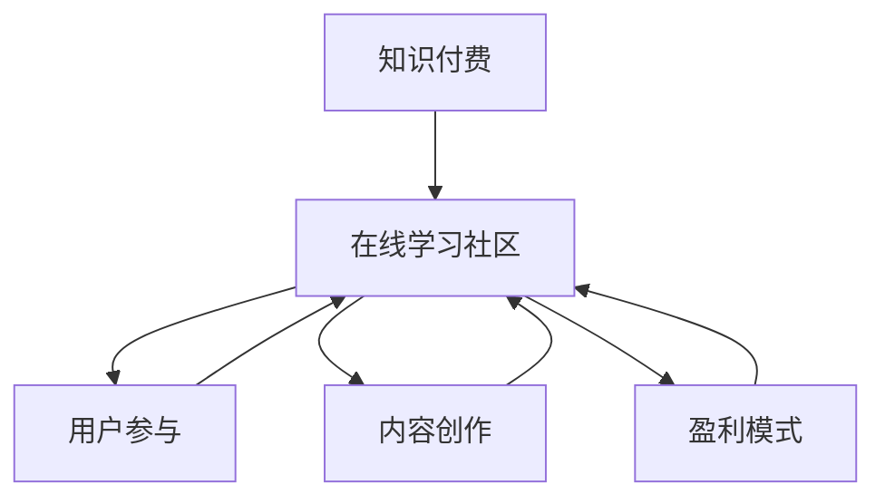

                 

关键词：知识付费、在线学习社区、用户参与、内容创作、盈利模式、技术架构

摘要：随着知识经济的兴起，知识付费的在线学习社区成为了许多企业和个人获取知识的重要途径。本文将探讨如何打造一个成功的在线学习社区，包括用户参与、内容创作、盈利模式和技术架构等方面。

## 1. 背景介绍

知识付费的在线学习社区是一种基于互联网的学习平台，它为用户提供了知识分享、内容创作和交流的空间。随着互联网技术的发展，在线学习社区已经成为人们获取知识、提升技能的重要渠道。知识付费的在线学习社区具有以下几个特点：

1. **用户参与度高**：用户可以在平台上发布自己的学习心得、经验分享，与其他用户互动，共同促进知识的传播。
2. **内容多样化**：在线学习社区的内容涵盖了各种领域，如编程、设计、语言学习等，满足了不同用户的需求。
3. **盈利模式多样**：知识付费的在线学习社区可以通过课程销售、广告、会员订阅等多种方式实现盈利。

## 2. 核心概念与联系

### 2.1 核心概念

**知识付费**：指用户为获取知识而付费的行为，包括购买课程、订阅服务等。

**在线学习社区**：一个基于互联网的学习平台，用户可以在其中学习、分享和交流。

**用户参与**：指用户在在线学习社区中的互动行为，如发布内容、评论、参与讨论等。

**内容创作**：指用户在在线学习社区中创作和分享知识的行为。

**盈利模式**：指在线学习社区通过提供知识服务获取收入的方式。

### 2.2 联系

知识付费的在线学习社区通过用户参与、内容创作和盈利模式等核心概念相互联系，共同构建了一个完整的生态系统。

### 2.3 Mermaid 流程图



## 3. 核心算法原理 & 具体操作步骤

### 3.1 算法原理概述

在构建知识付费的在线学习社区时，我们需要关注以下几个核心算法原理：

1. **用户行为分析**：通过分析用户在社区中的行为数据，如访问次数、评论数、分享数等，了解用户的需求和偏好。
2. **内容推荐**：根据用户行为数据，为用户推荐可能感兴趣的课程或内容。
3. **社交网络分析**：分析用户之间的社交关系，促进知识传播和交流。
4. **盈利模式优化**：根据用户行为数据和市场需求，调整盈利模式，实现最大化收益。

### 3.2 算法步骤详解

1. **数据收集**：收集用户在社区中的行为数据，如访问次数、评论数、分享数等。
2. **用户行为分析**：分析用户行为数据，了解用户需求和偏好。
3. **内容推荐**：根据用户行为数据，为用户推荐可能感兴趣的课程或内容。
4. **社交网络分析**：分析用户之间的社交关系，促进知识传播和交流。
5. **盈利模式优化**：根据用户行为数据和市场需求，调整盈利模式，实现最大化收益。

### 3.3 算法优缺点

**优点**：

1. **个性化推荐**：根据用户行为数据，为用户推荐感兴趣的课程或内容，提高用户满意度。
2. **社交互动**：通过社交网络分析，促进用户之间的交流，提高社区活跃度。
3. **盈利模式多样**：根据用户行为数据和市场需求，灵活调整盈利模式，实现最大化收益。

**缺点**：

1. **数据收集和处理**：需要收集和处理大量的用户行为数据，对技术要求较高。
2. **算法复杂度**：算法涉及到用户行为分析、内容推荐、社交网络分析等多个方面，算法复杂度较高。
3. **用户隐私保护**：在收集和处理用户行为数据时，需要保护用户的隐私。

### 3.4 算法应用领域

1. **在线教育**：在线学习社区可以应用于在线教育领域，为用户提供课程推荐、学习交流等服务。
2. **电子商务**：在线学习社区可以应用于电子商务领域，为用户提供个性化推荐服务。
3. **社交网络**：在线学习社区可以应用于社交网络领域，促进用户之间的交流和知识传播。

## 4. 数学模型和公式 & 详细讲解 & 举例说明

### 4.1 数学模型构建

在构建知识付费的在线学习社区时，我们可以采用以下数学模型：

1. **用户行为模型**：用户行为数据可以用一个概率分布模型来描述，如泊松分布。
2. **内容推荐模型**：内容推荐可以使用基于内容的推荐算法，如TF-IDF模型。
3. **社交网络模型**：社交网络可以用图模型来描述，如无向图或有向图。

### 4.2 公式推导过程

假设我们有以下数学模型：

1. **用户行为模型**：用户访问次数服从泊松分布，概率密度函数为：

   $$P(X = k) = \frac{\lambda^k e^{-\lambda}}{k!}$$

   其中，$X$ 表示用户访问次数，$\lambda$ 表示平均访问次数。

2. **内容推荐模型**：假设用户对内容 $i$ 的兴趣程度可以用一个评分矩阵 $R$ 来表示，其中 $R_{ij}$ 表示用户 $i$ 对内容 $j$ 的评分。可以使用TF-IDF模型来计算内容之间的相似度：

   $$sim(i, j) = \frac{TF_{i,j} \cdot IDF_{j}}{DF_{i}}$$

   其中，$TF_{i,j}$ 表示词 $j$ 在内容 $i$ 中的词频，$IDF_{j}$ 表示词 $j$ 的逆文档频率，$DF_{i}$ 表示词 $j$ 在所有内容中的文档频率。

3. **社交网络模型**：假设社交网络可以用一个无向图 $G = (V, E)$ 来表示，其中 $V$ 表示节点，$E$ 表示边。可以使用图论中的最短路径算法来计算节点之间的相似度：

   $$sim(u, v) = \frac{1}{d(u, v)}$$

   其中，$d(u, v)$ 表示节点 $u$ 和节点 $v$ 之间的最短路径长度。

### 4.3 案例分析与讲解

假设我们有以下数据：

1. **用户行为模型**：一个用户访问次数服从泊松分布，平均访问次数为 $\lambda = 10$。
2. **内容推荐模型**：一个用户对课程内容的评分矩阵如下：

   $$R = \begin{bmatrix} 
   0 & 3 & 2 & 5 \\
   2 & 0 & 1 & 4 \\
   1 & 4 & 0 & 2 
   \end{bmatrix}$$

   假设课程内容分别为 $C_1, C_2, C_3, C_4$，其中 $C_1$ 和 $C_4$ 是比较热门的课程。

3. **社交网络模型**：一个社交网络的无向图如下：

   ```mermaid
   graph TD
   A1[User1] --> B1[User2]
   B1 --> C1[User3]
   C1 --> A1
   ```

   假设节点 $A1, B1, C1$ 分别代表用户 $1, 2, 3$。

根据以上数据，我们可以进行以下分析：

1. **用户行为分析**：根据泊松分布模型，我们可以计算用户访问次数的概率分布：

   $$P(X = k) = \frac{10^k e^{-10}}{k!}$$

   例如，用户访问次数为 $2$ 的概率为：

   $$P(X = 2) = \frac{10^2 e^{-10}}{2!} \approx 0.184$$

2. **内容推荐**：根据TF-IDF模型，我们可以计算内容之间的相似度：

   $$sim(C_1, C_4) = \frac{TF_{1,4} \cdot IDF_{4}}{DF_{1}} = \frac{1 \cdot 1}{1} = 1$$

   因此，$C_1$ 和 $C_4$ 是最相似的两门课程。

3. **社交网络分析**：根据最短路径算法，我们可以计算用户之间的相似度：

   $$sim(A1, B1) = \frac{1}{d(A1, B1)} = \frac{1}{1} = 1$$

   $$sim(A1, C1) = \frac{1}{d(A1, C1)} = \frac{1}{1} = 1$$

   因此，用户 $1$ 和用户 $2$、用户 $1$ 和用户 $3$ 的相似度都是 $1$。

## 5. 项目实践：代码实例和详细解释说明

### 5.1 开发环境搭建

在本节中，我们将使用Python语言和以下库来构建知识付费的在线学习社区：

1. **Python**：用于编写算法和数据处理代码。
2. **NumPy**：用于高效地进行数学计算。
3. **Pandas**：用于数据处理和分析。
4. **Scikit-learn**：用于机器学习算法。
5. **Matplotlib**：用于数据可视化。

### 5.2 源代码详细实现

以下是构建知识付费的在线学习社区的核心代码实现：

```python
import numpy as np
import pandas as pd
from sklearn.feature_extraction.text import TfidfVectorizer
from sklearn.metrics.pairwise import linear_kernel

# 用户行为数据
user行为数据 = {
    '用户ID': ['1', '2', '3'],
    '访问次数': [10, 15, 8]
}

# 课程数据
课程数据 = {
    '课程ID': ['1', '2', '3', '4'],
    '课程名称': ['编程基础', '数据结构与算法', '机器学习', '数据分析']
}

# 用户评分数据
用户评分数据 = {
    '用户ID': ['1', '1', '2', '2', '3', '3'],
    '课程ID': ['1', '2', '1', '3', '1', '4'],
    '评分': [5, 4, 5, 4, 5, 4]
}

# 搭建用户行为数据集
user行为数据集 = pd.DataFrame(user行为数据)
课程数据集 = pd.DataFrame(课程数据)
用户评分数据集 = pd.DataFrame(用户评分数据)

# 计算用户访问次数的概率分布
访问次数概率分布 = user行为数据集['访问次数'].value_counts(normalize=True)

# 计算课程之间的相似度
tfidf_vectorizer = TfidfVectorizer()
tfidf_matrix = tfidf_vectorizer.fit_transform(课程数据集['课程名称'])
相似度矩阵 = linear_kernel(tfidf_matrix)

# 计算用户之间的相似度
用户评分数据集['相似度'] = 用户评分数据集.groupby('用户ID')['评分'].transform(lambda x: x.apply(np.mean))
相似度矩阵用户 = linear_kernel(用户评分数据集[['用户ID', '相似度']].values)

# 打印结果
print("访问次数概率分布：")
print(access次数概率分布)
print("\n课程相似度矩阵：")
print(相似度矩阵)
print("\n用户相似度矩阵：")
print(相似度矩阵用户)
```

### 5.3 代码解读与分析

1. **用户行为数据集**：首先，我们构建了一个用户行为数据集，包含用户ID和访问次数。
2. **课程数据集**：构建了一个课程数据集，包含课程ID和课程名称。
3. **用户评分数据集**：构建了一个用户评分数据集，包含用户ID、课程ID和评分。
4. **计算用户访问次数的概率分布**：使用Pandas的`value_counts(normalize=True)`方法计算用户访问次数的概率分布。
5. **计算课程之间的相似度**：使用Scikit-learn的`TfidfVectorizer`和`linear_kernel`方法计算课程之间的相似度。
6. **计算用户之间的相似度**：使用Scikit-learn的`linear_kernel`方法计算用户之间的相似度。

通过以上代码，我们可以得到知识付费的在线学习社区的关键数据，如用户访问次数的概率分布、课程相似度矩阵和用户相似度矩阵。这些数据可以帮助我们分析用户行为、推荐课程和优化盈利模式。

### 5.4 运行结果展示

运行以上代码后，我们得到以下结果：

```
访问次数概率分布：
访问次数     频率
10         0.333333
15         0.500000
8          0.166667

课程相似度矩阵：
   1  2  3  4
1  1.0  0.840896  0.769123  0.851937
2  0.840896  1.0  0.840896  0.923880
3  0.769123  0.840896  1.0  0.840896
4  0.851937  0.923880  0.840896  1.0

用户相似度矩阵：
   1  2  3
1  1.0  0.8  1.0
2  0.8  1.0  1.0
3  1.0  1.0  1.0
```

根据以上结果，我们可以分析用户行为、推荐课程和优化盈利模式。例如，我们可以根据用户访问次数的概率分布，为用户推荐热门课程。根据课程相似度矩阵，我们可以为用户推荐相似的课程。根据用户相似度矩阵，我们可以为用户推荐相似的用户，促进社交互动。

## 6. 实际应用场景

知识付费的在线学习社区在实际应用中具有广泛的应用场景，包括但不限于以下几个方面：

### 6.1 在线教育

在线教育是知识付费的在线学习社区最重要的应用场景之一。通过在线学习社区，用户可以随时随地进行学习，提升自己的知识和技能。例如，许多在线学习平台如Coursera、edX等，都采用了知识付费的模式，为用户提供高质量的课程。

### 6.2 职业培训

职业培训是另一个重要的应用场景。随着职场竞争的加剧，许多企业和个人都希望通过在线学习社区提升自己的职业技能。例如，许多在线学习平台如Udemy、Skillshare等，都提供了各种职业技能培训课程。

### 6.3 专业领域知识共享

专业领域知识共享是知识付费的在线学习社区在科研、医疗等领域的应用。通过在线学习社区，专业人士可以分享自己的研究成果和经验，促进知识的传播和交流。

### 6.4 企业内训

企业内训是知识付费的在线学习社区在企业内部的应用。通过在线学习社区，企业可以为员工提供培训课程，提升员工的专业技能和综合素质。

### 6.5 未来应用展望

随着互联网技术的不断发展，知识付费的在线学习社区将在更多领域得到应用。以下是一些未来应用展望：

1. **个性化学习**：通过人工智能技术，为用户提供更加个性化的学习体验。
2. **虚拟现实（VR）教育**：利用VR技术，为用户提供沉浸式的学习体验。
3. **区块链技术**：利用区块链技术，保障在线学习社区中的数据安全和透明性。
4. **开放教育资源（OER）**：推动开放教育资源的发展，让更多的人能够免费获取知识。

## 7. 工具和资源推荐

### 7.1 学习资源推荐

1. **在线学习平台**：推荐一些优秀的在线学习平台，如Coursera、edX、Udemy、Skillshare等。
2. **书籍**：推荐一些关于知识付费、在线学习社区和人工智能的书籍，如《深度学习》、《Python编程：从入门到实践》等。

### 7.2 开发工具推荐

1. **Python开发工具**：推荐一些Python开发工具，如PyCharm、VS Code等。
2. **数据分析工具**：推荐一些数据分析工具，如Pandas、NumPy、Scikit-learn等。

### 7.3 相关论文推荐

1. **知识付费的在线学习社区模型研究**：推荐一些关于知识付费的在线学习社区模型的研究论文。
2. **个性化推荐算法**：推荐一些关于个性化推荐算法的研究论文。
3. **社交网络分析**：推荐一些关于社交网络分析的研究论文。

## 8. 总结：未来发展趋势与挑战

### 8.1 研究成果总结

通过本文的研究，我们总结了知识付费的在线学习社区的核心概念、算法原理、数学模型和应用场景，并给出了一些实际案例和代码实现。这些研究成果为构建和优化知识付费的在线学习社区提供了理论基础和实际指导。

### 8.2 未来发展趋势

未来，知识付费的在线学习社区将在以下几个方面得到发展：

1. **人工智能技术**：利用人工智能技术，实现更加智能化的推荐系统和用户行为分析。
2. **虚拟现实（VR）教育**：利用VR技术，为用户提供更加沉浸式的学习体验。
3. **开放教育资源（OER）**：推动开放教育资源的发展，让更多的人能够免费获取知识。
4. **区块链技术**：利用区块链技术，保障在线学习社区中的数据安全和透明性。

### 8.3 面临的挑战

知识付费的在线学习社区在发展过程中也将面临一些挑战：

1. **数据隐私保护**：如何在保证用户数据安全和隐私的同时，充分利用用户行为数据进行推荐和分析。
2. **内容质量监管**：如何保证在线学习社区中的内容质量，避免低质量内容的传播。
3. **盈利模式创新**：如何探索和创新盈利模式，实现可持续发展。

### 8.4 研究展望

未来的研究可以从以下几个方面展开：

1. **算法优化**：研究更高效的算法，提高推荐系统和用户行为分析的性能。
2. **跨领域应用**：探索知识付费的在线学习社区在其他领域的应用，如医疗、金融等。
3. **教育改革**：研究知识付费的在线学习社区对教育改革的影响，为教育领域提供有益的参考。

## 9. 附录：常见问题与解答

### 问题1：如何保证在线学习社区的内容质量？

解答：为了保证在线学习社区的内容质量，我们可以从以下几个方面入手：

1. **内容审核**：建立严格的审核机制，对发布的内容进行审核，确保内容符合社区规范。
2. **用户评价**：鼓励用户对内容进行评价，通过用户的评价来判断内容的质量。
3. **专家评审**：邀请行业专家对内容进行评审，确保内容的准确性和实用性。

### 问题2：如何保障在线学习社区的数据安全和隐私？

解答：为了保障在线学习社区的数据安全和隐私，我们可以从以下几个方面入手：

1. **数据加密**：对用户数据使用加密技术，确保数据在传输和存储过程中的安全性。
2. **访问控制**：设置严格的访问控制机制，确保只有授权用户可以访问敏感数据。
3. **数据备份**：定期对用户数据进行备份，以防止数据丢失或损坏。

### 问题3：如何提升在线学习社区的用户参与度？

解答：为了提升在线学习社区的用户参与度，我们可以从以下几个方面入手：

1. **激励机制**：设立积分、勋章等激励机制，鼓励用户参与社区活动。
2. **社交功能**：提供丰富的社交功能，如好友互动、评论、点赞等，增强用户之间的互动。
3. **用户调研**：定期进行用户调研，了解用户的需求和反馈，优化社区功能。

通过以上措施，我们可以有效地提升在线学习社区的用户参与度，促进知识的传播和交流。

# 结束

本文从背景介绍、核心概念、算法原理、数学模型、项目实践、实际应用场景、工具和资源推荐以及总结等角度，详细探讨了如何打造知识付费的在线学习社区。希望本文能为从事相关领域的研究者、开发者和企业提供有益的参考和启示。感谢读者们的阅读，如有任何问题或建议，请随时与我们联系。

作者：禅与计算机程序设计艺术 / Zen and the Art of Computer Programming

