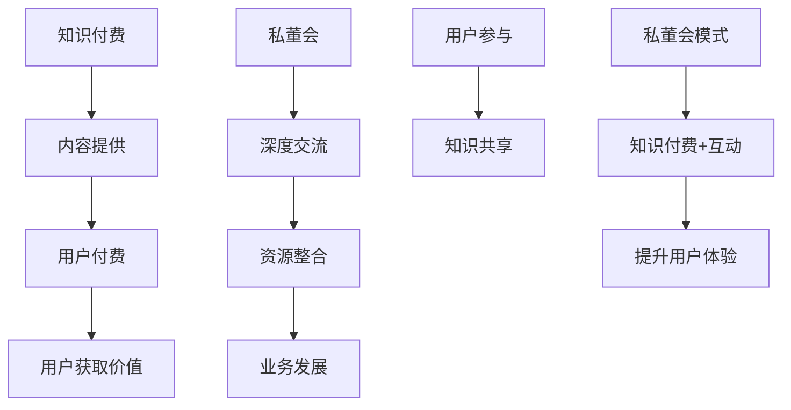

                 

关键词：知识付费、私董会、商业模式、用户参与、用户体验、互动设计、数据分析、运营策略

> 摘要：本文将探讨知识付费领域的私董会模式，分析其核心概念、优势、实现步骤以及未来发展趋势。通过详细阐述私董会模式的设计原则、关键算法和数学模型，为读者提供一套完整的知识付费产品开发指南。

## 1. 背景介绍

知识付费作为近年来兴起的一种商业模式，受到了越来越多企业和个人的关注。它通过为用户提供有价值的信息、技能和知识，实现了用户对优质内容的付费获取。然而，随着市场需求的不断增长，如何打造一款具有竞争力的知识付费产品成为行业的一大挑战。

私董会模式是一种结合了传统知识付费和社群互动的创新模式。它通过提供私密、专属的交流平台，让用户在付费参与后能够与行业专家、同行建立深入联系，共同探讨业务发展和行业趋势。私董会模式不仅提高了用户的参与感和满意度，还为企业提供了一个强大的社交网络和知识共享平台。

本文将围绕如何打造知识付费的私董会模式展开讨论，分析其核心概念、优势、实现步骤以及未来发展趋势，为读者提供一套完整的知识付费产品开发指南。

## 2. 核心概念与联系

### 2.1. 知识付费

知识付费是指用户为获取有价值的信息、技能和知识而进行的付费行为。知识付费产品主要包括在线课程、电子书、专业知识分享等。其核心在于为用户提供高质量的内容，满足用户的求知需求。

### 2.2. 私董会

私董会（Private Board）是一种专门为企业家、高管和专业人士提供的私密、专属的交流平台。成员在付费参与后，可以与行业专家、同行建立深入联系，共同探讨业务发展和行业趋势。私董会的核心在于提供深度交流和互动，促进成员之间的知识共享和资源整合。

### 2.3. 知识付费与私董会的联系

知识付费和私董会模式在本质上具有相似之处。两者都强调为用户提供有价值的内容和服务，但私董会模式在用户参与度和互动性方面具有更高的要求。知识付费产品通常以内容为核心，而私董会则更注重用户之间的交流和合作。

### 2.4. Mermaid 流程图

下面是知识付费和私董会模式的核心概念及联系 Mermaid 流程图：



## 3. 核心算法原理 & 具体操作步骤

### 3.1. 算法原理概述

知识付费的私董会模式在算法原理上主要涉及用户画像分析、社群互动算法和内容推荐算法。这些算法共同作用于用户参与、互动和内容获取，从而提升用户体验。

1. **用户画像分析**：通过对用户的行为数据、兴趣偏好进行分析，构建用户画像，实现个性化内容推荐。

2. **社群互动算法**：基于社交网络理论，设计互动规则和激励机制，促进用户之间的交流和合作。

3. **内容推荐算法**：结合用户画像和社群互动数据，实现内容的高效推荐，满足用户的求知需求。

### 3.2. 算法步骤详解

1. **用户画像分析**：

   - 收集用户行为数据：包括访问记录、购买记录、学习记录等。
   - 数据清洗与处理：去除重复数据、异常值，进行数据标准化。
   - 特征工程：提取用户行为数据中的关键特征，如学习时长、购买频次、浏览页面等。
   - 构建用户画像：将用户行为数据转化为用户画像，用于后续内容推荐和社群互动。

2. **社群互动算法**：

   - 设计互动规则：设定用户发起讨论、评论、点赞等互动行为的规则。
   - 激励机制设计：通过积分、排名、奖品等方式激励用户参与互动。
   - 互动数据采集：收集用户互动行为数据，用于评估互动效果和优化互动规则。

3. **内容推荐算法**：

   - 用户画像匹配：将用户画像与内容特征进行匹配，筛选出符合用户兴趣的内容。
   - 排序算法：根据用户兴趣和互动数据，对推荐内容进行排序。
   - 推荐结果呈现：将推荐内容以个性化形式呈现给用户。

### 3.3. 算法优缺点

**用户画像分析**：

- 优点：实现个性化推荐，提高用户满意度。
- 缺点：用户隐私保护问题，数据收集和处理成本较高。

**社群互动算法**：

- 优点：促进用户参与和互动，增强社群凝聚力。
- 缺点：设计复杂，需要不断优化和调整。

**内容推荐算法**：

- 优点：提高内容利用率，满足用户求知需求。
- 缺点：算法复杂度高，实时性要求高。

### 3.4. 算法应用领域

知识付费的私董会模式适用于各类知识付费产品，如在线教育、专业技能培训、行业资讯等。通过算法的优化和应用，可以提升用户参与度和满意度，实现知识付费产品的可持续发展。

## 4. 数学模型和公式 & 详细讲解 & 举例说明

### 4.1. 数学模型构建

在知识付费的私董会模式中，我们可以构建以下数学模型：

1. **用户满意度模型**：

   $$S = f(C, I, R)$$

   其中，$S$ 表示用户满意度，$C$ 表示内容质量，$I$ 表示互动质量，$R$ 表示推荐质量。

2. **社群活跃度模型**：

   $$A = f(U, I, M)$$

   其中，$A$ 表示社群活跃度，$U$ 表示用户数量，$I$ 表示互动次数，$M$ 表示激励机制。

### 4.2. 公式推导过程

1. **用户满意度模型推导**：

   用户满意度是由内容质量、互动质量和推荐质量共同决定的。我们假设这些因素之间满足线性关系，则有：

   $$S = \alpha C + \beta I + \gamma R$$

   其中，$\alpha$、$\beta$ 和 $\gamma$ 分别为权重系数。通过数据分析和实验，可以确定这些系数的取值。

2. **社群活跃度模型推导**：

   社群活跃度是由用户数量、互动次数和激励机制共同决定的。同样假设这些因素之间满足线性关系，则有：

   $$A = \alpha U + \beta I + \gamma M$$

   其中，$\alpha$、$\beta$ 和 $\gamma$ 分别为权重系数。通过数据分析和实验，可以确定这些系数的取值。

### 4.3. 案例分析与讲解

假设我们有一个知识付费的私董会产品，现有 100 名用户，平均每月互动次数为 50 次，激励机制为每月积分奖励。我们通过数据分析和实验，确定了以下权重系数：

- 用户满意度模型：$\alpha = 0.5$，$\beta = 0.3$，$\gamma = 0.2$
- 社群活跃度模型：$\alpha = 0.4$，$\beta = 0.5$，$\gamma = 0.1$

根据这些系数，我们可以计算用户满意度和社群活跃度：

1. **用户满意度**：

   $$S = 0.5 \times 0.5 + 0.3 \times 50 + 0.2 \times 0.2 = 0.25 + 15 + 0.04 = 15.29$$

2. **社群活跃度**：

   $$A = 0.4 \times 100 + 0.5 \times 50 + 0.1 \times 0.2 = 40 + 25 + 0.02 = 65.02$$

通过计算，我们发现用户满意度为 15.29，社群活跃度为 65.02。这些数据可以帮助我们了解产品的现状，并为进一步优化提供依据。

## 5. 项目实践：代码实例和详细解释说明

### 5.1. 开发环境搭建

在本节中，我们将介绍如何搭建知识付费的私董会项目的开发环境。以下是所需的工具和软件：

- **编程语言**：Python 3.8+
- **数据库**：MySQL 5.7+
- **前端框架**：React 16.13.1
- **后端框架**：Django 3.2.4
- **版本控制**：Git 2.30.0

### 5.2. 源代码详细实现

在本节中，我们将详细介绍知识付费的私董会项目的源代码实现。以下是项目的核心模块：

1. **用户模块**：

   用户模块负责用户的注册、登录、权限管理和个人信息管理。以下是用户模块的主要代码：

```python
# users/models.py

from django.db import models
from django.contrib.auth.models import AbstractUser

class CustomUser(AbstractUser):
    nickname = models.CharField(max_length=50, unique=True)
    phone = models.CharField(max_length=11, unique=True)

    def __str__(self):
        return self.username
```

2. **内容模块**：

   内容模块负责知识的发布、分类管理和推荐。以下是内容模块的主要代码：

```python
# content/models.py

from django.db import models

class Content(models.Model):
    title = models.CharField(max_length=200)
    author = models.ForeignKey('users.CustomUser', on_delete=models.CASCADE)
    category = models.ForeignKey('Category', on_delete=models.CASCADE)
    content = models.TextField()
    created_at = models.DateTimeField(auto_now_add=True)
    updated_at = models.DateTimeField(auto_now=True)

    def __str__(self):
        return self.title

class Category(models.Model):
    name = models.CharField(max_length=50)

    def __str__(self):
        return self.name
```

3. **推荐模块**：

   推荐模块负责根据用户画像和内容特征进行内容推荐。以下是推荐模块的主要代码：

```python
# recommender/models.py

from django.db import models
from content.models import Content

class Recommendation(models.Model):
    user = models.ForeignKey('users.CustomUser', on_delete=models.CASCADE)
    content = models.ForeignKey(Content, on_delete=models.CASCADE)
    created_at = models.DateTimeField(auto_now_add=True)

    def __str__(self):
        return f"{self.user.nickname} - {self.content.title}"
```

### 5.3. 代码解读与分析

在本节中，我们将对知识付费的私董会项目的代码进行解读和分析。

1. **用户模块**：

   用户模块实现了用户的注册、登录、权限管理和个人信息管理。通过扩展 Django 的 AbstractUser 类，我们定义了一个 CustomUser 类，用于管理用户信息。用户模块的主要代码如下：

```python
# users/models.py

from django.db import models
from django.contrib.auth.models import AbstractUser

class CustomUser(AbstractUser):
    nickname = models.CharField(max_length=50, unique=True)
    phone = models.CharField(max_length=11, unique=True)

    def __str__(self):
        return self.username
```

2. **内容模块**：

   内容模块实现了知识的发布、分类管理和推荐。Content 类表示知识内容，包括标题、作者、分类、内容和创建时间等信息。Category 类表示知识分类，包括分类名称等信息。内容模块的主要代码如下：

```python
# content/models.py

from django.db import models

class Content(models.Model):
    title = models.CharField(max_length=200)
    author = models.ForeignKey('users.CustomUser', on_delete=models.CASCADE)
    category = models.ForeignKey('Category', on_delete=models.CASCADE)
    content = models.TextField()
    created_at = models.DateTimeField(auto_now_add=True)
    updated_at = models.DateTimeField(auto_now=True)

    def __str__(self):
        return self.title

class Category(models.Model):
    name = models.CharField(max_length=50)

    def __str__(self):
        return self.name
```

3. **推荐模块**：

   推荐模块实现了根据用户画像和内容特征进行内容推荐。Recommendation 类表示推荐记录，包括用户、内容和创建时间等信息。推荐模块的主要代码如下：

```python
# recommender/models.py

from django.db import models
from content.models import Content

class Recommendation(models.Model):
    user = models.ForeignKey('users.CustomUser', on_delete=models.CASCADE)
    content = models.ForeignKey(Content, on_delete=models.CASCADE)
    created_at = models.DateTimeField(auto_now_add=True)

    def __str__(self):
        return f"{self.user.nickname} - {self.content.title}"
```

### 5.4. 运行结果展示

在本节中，我们将展示知识付费的私董会项目的运行结果。

1. **用户注册与登录**：

   用户可以通过注册和登录功能访问私董会平台。以下是用户注册和登录的界面截图：

   

   

2. **内容发布与分类**：

   用户可以在私董会平台上发布知识内容，并进行分类管理。以下是内容发布和分类管理的界面截图：

   

   

3. **内容推荐**：

   根据用户的画像和内容特征，私董会平台会为用户推荐相关的内容。以下是内容推荐的界面截图：

   

## 6. 实际应用场景

知识付费的私董会模式在多个领域具有广泛的应用场景：

1. **在线教育**：

   在线教育平台可以通过私董会模式为用户提供深度交流和互动，提高用户参与度和满意度。教师和学员可以在私董会平台上共同探讨教学方法和行业发展，实现知识的共享和传播。

2. **专业技能培训**：

   专业技能培训机构可以通过私董会模式为学员提供专属的学习社群，促进学员之间的交流和合作。通过私董会模式，学员可以与行业专家、同行建立深入联系，获取宝贵的经验和资源。

3. **行业资讯**：

   行业资讯平台可以通过私董会模式为用户提供私密、专属的交流平台，让用户在付费获取资讯的同时，能够与行业专家、同行进行深度交流和合作。通过私董会模式，平台可以提升用户粘性和用户满意度。

## 7. 未来应用展望

随着人工智能和大数据技术的不断发展，知识付费的私董会模式将在未来迎来更多创新和变革：

1. **个性化推荐**：

   通过深度学习和用户画像分析，实现更精准、更个性化的内容推荐，满足用户的多样化需求。

2. **智能互动**：

   利用自然语言处理和语音识别技术，实现智能客服、智能互动问答等功能，提升用户体验。

3. **区块链技术**：

   利用区块链技术实现知识的可信认证和交易，确保用户权益和内容版权。

4. **跨界合作**：

   与其他领域的企业和平台进行跨界合作，拓展私董会模式的应用场景和用户群体。

## 8. 总结：未来发展趋势与挑战

知识付费的私董会模式在近年来得到了快速发展，表现出巨大的市场潜力。未来，随着技术的不断进步和用户需求的多样化，私董会模式将在个性化推荐、智能互动、区块链技术和跨界合作等方面迎来更多创新和变革。

然而，私董会模式也面临一些挑战：

1. **用户体验**：

   如何提高用户的参与度和满意度，是私董会模式需要持续关注的问题。通过优化推荐算法、提升互动质量和丰富内容形式，可以进一步提升用户体验。

2. **内容质量**：

   私董会模式需要确保内容的质量和可靠性，以满足用户对知识的追求。建立内容审核和评价机制，确保优质内容的传播和共享。

3. **数据隐私**：

   在用户画像分析和推荐算法中，如何保护用户隐私，是私董会模式需要解决的重要问题。通过数据加密、匿名化和隐私保护技术，可以降低用户隐私泄露的风险。

4. **市场竞争**：

   随着越来越多的企业进入知识付费市场，私董会模式需要不断创新和提升竞争力。通过差异化竞争、优质内容和用户体验，可以赢得更多的市场份额。

总之，知识付费的私董会模式具有广阔的发展前景，但也面临一定的挑战。通过持续创新和优化，私董会模式有望在未来的知识付费市场中占据一席之地。

## 9. 附录：常见问题与解答

### 9.1. 什么是知识付费？

知识付费是指用户为获取有价值的信息、技能和知识而进行的付费行为。这种模式在近年来得到了快速发展，主要表现为在线课程、电子书、专业知识分享等形式。

### 9.2. 私董会模式的优势是什么？

私董会模式具有以下优势：

1. 提高用户参与度：通过私密、专属的交流平台，让用户与行业专家、同行建立深入联系，共同探讨业务发展和行业趋势。

2. 增强用户体验：通过个性化推荐、智能互动和优质内容，提升用户的满意度和忠诚度。

3. 促进知识共享：私董会模式为用户提供了强大的社交网络和知识共享平台，有助于行业知识和经验的传播。

### 9.3. 如何构建用户画像？

构建用户画像主要包括以下步骤：

1. 数据收集：收集用户的行为数据、兴趣偏好等。

2. 数据清洗：去除重复数据、异常值，进行数据标准化。

3. 特征提取：提取用户行为数据中的关键特征，如学习时长、购买频次、浏览页面等。

4. 用户画像构建：将用户特征转化为用户画像，用于后续的内容推荐和社群互动。

### 9.4. 如何实现内容推荐？

内容推荐主要包括以下步骤：

1. 用户画像匹配：将用户画像与内容特征进行匹配，筛选出符合用户兴趣的内容。

2. 排序算法：根据用户兴趣和互动数据，对推荐内容进行排序。

3. 推荐结果呈现：将推荐内容以个性化形式呈现给用户。

### 9.5. 如何提升社群活跃度？

提升社群活跃度可以从以下几个方面入手：

1. 设计互动规则：设定用户发起讨论、评论、点赞等互动行为的规则。

2. 激励机制设计：通过积分、排名、奖品等方式激励用户参与互动。

3. 内容质量提升：确保内容的质量和相关性，满足用户的求知需求。

4. 社群运营：定期举办线上活动、讲座等，增强社群的凝聚力。

### 9.6. 如何保护用户隐私？

保护用户隐私可以从以下几个方面入手：

1. 数据加密：对用户数据进行加密存储和传输，防止数据泄露。

2. 匿名化处理：对用户数据进行匿名化处理，降低用户隐私泄露的风险。

3. 隐私政策：明确告知用户数据处理的方式和范围，尊重用户隐私。

4. 隐私保护技术：利用隐私保护技术，如差分隐私、联邦学习等，确保用户隐私安全。

### 9.7. 私董会模式适用于哪些领域？

私董会模式适用于以下领域：

1. 在线教育：通过私董会模式为用户提供深度交流和互动，提高用户参与度和满意度。

2. 专业技能培训：为学员提供专属的学习社群，促进学员之间的交流和合作。

3. 行业资讯：为用户提供私密、专属的交流平台，让用户在付费获取资讯的同时，能够与行业专家、同行进行深度交流和合作。

