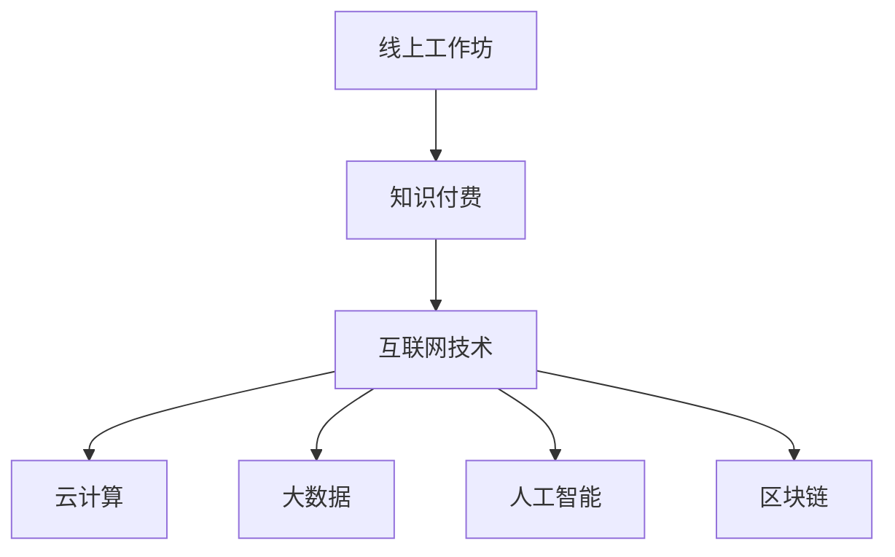

                 

### 1. 背景介绍

知识付费作为一种新兴的商业模式，近年来在全球范围内迅速崛起。随着互联网技术的不断发展和普及，线上教育、在线培训、知识分享等领域的需求日益增长。然而，如何打造一个具有吸引力、互动性、可持续性的线上工作坊，成为了众多知识付费平台和企业关注的焦点。

本文旨在探讨如何利用现代技术手段，打造一个高效、优质的线上工作坊。通过深入分析线上工作坊的需求、核心要素、技术实现方法等，为广大知识付费从业者提供有价值的参考和指导。

### 2. 核心概念与联系

要打造一个成功的线上工作坊，首先需要理解以下几个核心概念：

#### 2.1 线上工作坊的定义

线上工作坊是指通过互联网平台，为参与者提供实时互动、知识传授、技能训练等服务的在线活动。与传统的线下工作坊相比，线上工作坊具有不受地域限制、灵活性强、成本较低等优势。

#### 2.2 知识付费的基本原理

知识付费是指用户为获取高质量的知识内容而支付的费用。在知识付费模式下，知识内容创作者可以通过各种方式（如在线课程、电子书、线上讲座等）向用户提供知识服务，并获得相应的收益。

#### 2.3 技术在知识付费中的应用

现代技术，如云计算、大数据、人工智能、区块链等，为知识付费领域的发展提供了强有力的支持。通过这些技术，可以提升知识内容的品质、优化用户体验、保障交易安全等。

下面是一个使用Mermaid绘制的流程图，展示上述核心概念之间的联系：



### 3. 核心算法原理 & 具体操作步骤

#### 3.1 算法原理概述

在线上工作坊的构建过程中，算法原理主要涉及以下几个方面：

1. **用户行为分析**：通过对用户的学习行为、互动行为等数据进行分析，为用户提供个性化的学习推荐和服务。
2. **内容推荐算法**：基于用户的兴趣、学习历史等因素，为用户推荐适合的学习内容。
3. **互动性增强算法**：通过实时互动、在线讨论、即时反馈等方式，提升用户参与度和学习效果。

#### 3.2 算法步骤详解

1. **用户行为分析**
   - 收集用户在平台上的各种行为数据，如浏览记录、互动行为、学习进度等。
   - 对数据进行分析，提取用户兴趣点和行为模式。

2. **内容推荐算法**
   - 构建用户画像，包括兴趣、学习历史、职业背景等。
   - 使用协同过滤、内容匹配等算法，为用户推荐合适的学习内容。

3. **互动性增强算法**
   - 设计实时互动模块，如在线讨论、即时问答等。
   - 结合数据分析，为用户提供个性化互动建议。

#### 3.3 算法优缺点

**用户行为分析**：
- 优点：有助于了解用户需求，提升用户体验。
- 缺点：数据收集和处理存在隐私和安全问题。

**内容推荐算法**：
- 优点：提高用户内容匹配度，提升学习效果。
- 缺点：推荐系统容易出现“信息茧房”，限制用户视野。

**互动性增强算法**：
- 优点：增强用户参与度，提升学习氛围。
- 缺点：需要投入大量人力和物力，维护互动模块。

#### 3.4 算法应用领域

1. **在线教育**：为学习者提供个性化学习路径，提升学习效果。
2. **职业培训**：为职场人士提供针对性技能培训，提升职业竞争力。
3. **兴趣爱好**：为爱好者提供丰富的学习资源，满足个性化需求。

### 4. 数学模型和公式 & 详细讲解 & 举例说明

在构建线上工作坊的过程中，数学模型和公式发挥着重要作用。以下将介绍几个常见的数学模型和公式，并举例说明其应用。

#### 4.1 数学模型构建

1. **用户行为预测模型**：
   - 构建用户行为预测模型，预测用户未来的学习行为。

   $$ P(B|A) = \frac{P(A|B)P(B)}{P(A)} $$

   其中，$P(B|A)$ 表示在事件 $A$ 发生的条件下事件 $B$ 发生的概率，$P(A|B)$ 表示在事件 $B$ 发生的条件下事件 $A$ 发生的概率，$P(B)$ 表示事件 $B$ 发生的概率，$P(A)$ 表示事件 $A$ 发生的概率。

2. **内容推荐模型**：
   - 构建内容推荐模型，为用户推荐感兴趣的学习内容。

   $$ R = f(U, C) $$

   其中，$R$ 表示推荐结果，$U$ 表示用户特征，$C$ 表示内容特征。

3. **互动性增强模型**：
   - 构建互动性增强模型，提高用户参与度。

   $$ I = f(U, I_0) $$

   其中，$I$ 表示互动性，$U$ 表示用户特征，$I_0$ 表示初始互动性。

#### 4.2 公式推导过程

1. **用户行为预测模型**：
   - 利用贝叶斯定理推导用户行为预测模型。

   $$ P(B|A) = \frac{P(A|B)P(B)}{P(A)} $$

   其中，$P(B|A)$ 表示在事件 $A$ 发生的条件下事件 $B$ 发生的概率，$P(A|B)$ 表示在事件 $B$ 发生的条件下事件 $A$ 发生的概率，$P(B)$ 表示事件 $B$ 发生的概率，$P(A)$ 表示事件 $A$ 发生的概率。

2. **内容推荐模型**：
   - 利用矩阵分解方法推导内容推荐模型。

   $$ R = f(U, C) $$

   其中，$R$ 表示推荐结果，$U$ 表示用户特征，$C$ 表示内容特征。

3. **互动性增强模型**：
   - 利用用户参与度模型推导互动性增强模型。

   $$ I = f(U, I_0) $$

   其中，$I$ 表示互动性，$U$ 表示用户特征，$I_0$ 表示初始互动性。

#### 4.3 案例分析与讲解

1. **用户行为预测模型**：

   假设一个用户喜欢阅读技术类书籍，且在过去一个月内阅读了三本技术类书籍。现在要预测该用户在未来一周内是否还会阅读技术类书籍。

   - $P(A)$：用户在未来一周内阅读技术类书籍的概率。
   - $P(B)$：用户喜欢阅读技术类书籍的概率。
   - $P(A|B)$：用户在喜欢阅读技术类书籍的条件下，在未来一周内阅读技术类书籍的概率。

   根据贝叶斯定理：

   $$ P(B|A) = \frac{P(A|B)P(B)}{P(A)} $$

   通过计算得到 $P(B|A)$，即用户在未来一周内阅读技术类书籍的概率。

2. **内容推荐模型**：

   假设一个用户在平台上的学习历史显示，他喜欢学习编程语言、算法和数据结构。现在要为该用户推荐适合他的学习内容。

   - $U$：用户特征，包括用户的学习历史、兴趣等。
   - $C$：内容特征，包括课程名称、课程描述、课程标签等。

   根据矩阵分解方法：

   $$ R = f(U, C) $$

   通过计算得到 $R$，即推荐结果，为该用户推荐适合他的学习内容。

3. **互动性增强模型**：

   假设一个用户在平台上的初始互动性为 $I_0$，且他具有较好的学习能力。现在要为该用户提高互动性。

   - $U$：用户特征，包括用户的学习能力、参与度等。
   - $I_0$：初始互动性。

   根据用户参与度模型：

   $$ I = f(U, I_0) $$

   通过计算得到 $I$，即提高后的互动性。

### 5. 项目实践：代码实例和详细解释说明

在本节中，我们将通过一个具体的线上工作坊项目实例，展示如何实现用户行为分析、内容推荐和互动性增强等功能。

#### 5.1 开发环境搭建

1. **技术栈**：
   - 前端：React、Vue、Angular 等（选择一种主流前端框架）
   - 后端：Node.js、Java、Python 等（选择一种主流后端框架）
   - 数据库：MySQL、MongoDB、Redis 等（选择一种适合的项目数据库）

2. **环境配置**：
   - 安装前端和后端开发环境，包括 Node.js、npm、Git 等。
   - 配置数据库，创建所需的数据表和索引。

#### 5.2 源代码详细实现

1. **用户行为分析**：

   用户行为分析主要涉及用户浏览记录、互动行为、学习进度等数据的收集和分析。以下是一个简单的用户行为分析示例代码：

   ```javascript
   // 用户行为分析模块
   class UserBehaviorAnalysis {
       constructor(db) {
           this.db = db;
       }
       
       // 收集用户浏览记录
       async collectBrowsingData(userId, courseId) {
           const browsingData = {
               userId,
               courseId,
               timestamp: new Date().toISOString()
           };
           
           await this.db.collection('browsing_data').insertOne(browsingData);
       }
       
       // 分析用户学习进度
       async analyzeLearningProgress(userId) {
           const userCourses = await this.db.collection('user_courses').find({ userId }).toArray();
           
           for (const course of userCourses) {
               const courseData = await this.db.collection('course_data').findOne({ courseId: course.courseId });
               const completedLessons = courseData.lessons.filter(lesson => lesson.completed);
               const totalLessons = courseData.lessons.length;
               
               console.log(`${userId} completed ${completedLessons.length} out of ${totalLessons} lessons in course ${course.courseId}`);
           }
       }
   }
   ```

2. **内容推荐**：

   内容推荐主要基于用户的兴趣、学习历史等因素，为用户推荐合适的学习内容。以下是一个简单的内容推荐示例代码：

   ```javascript
   // 内容推荐模块
   class ContentRecommendation {
       constructor(db) {
           this.db = db;
       }
       
       // 为用户推荐学习内容
       async recommendContent(userId) {
           const userInterests = await this.db.collection('user_interests').findOne({ userId });
           const recommendedCourses = [];
           
           if (userInterests) {
               const matchingCourses = await this.db.collection('courses').find({
                   $or: [
                       { tags: { $all: userInterests.interests } },
                       { title: new RegExp(userInterests.searchQuery, 'i') }
                   ]
               }).toArray();
               
               recommendedCourses.push(...matchingCourses);
           }
           
           return recommendedCourses;
       }
   }
   ```

3. **互动性增强**：

   互动性增强主要涉及实时互动、在线讨论、即时反馈等功能的实现。以下是一个简单的互动性增强示例代码：

   ```javascript
   // 互动性增强模块
   class InteractionEnhancement {
       constructor(db) {
           this.db = db;
       }
       
       // 创建在线讨论
       async createDiscussion(courseId, topic) {
           const discussion = {
               courseId,
               topic,
               createdTime: new Date().toISOString(),
               participants: []
           };
           
           await this.db.collection('discussions').insertOne(discussion);
       }
       
       // 加入在线讨论
       async joinDiscussion(userId, discussionId) {
           const discussion = await this.db.collection('discussions').findOne({ _id: discussionId });
           
           if (discussion) {
               discussion.participants.push(userId);
               await this.db.collection('discussions').updateOne({ _id: discussionId }, { $set: { participants: discussion.participants } });
           }
       }
   }
   ```

#### 5.3 代码解读与分析

1. **用户行为分析模块**：

   该模块主要用于收集用户浏览记录和用户学习进度。通过收集用户浏览记录，可以了解用户对课程内容的兴趣点；通过分析用户学习进度，可以评估用户的学习效果。

2. **内容推荐模块**：

   该模块主要用于为用户推荐学习内容。通过分析用户兴趣和学习历史，可以推荐符合用户需求的课程；通过关键词搜索，可以快速找到用户感兴趣的课程。

3. **互动性增强模块**：

   该模块主要用于提高用户的互动性。通过创建在线讨论，可以促进用户之间的交流；通过加入在线讨论，可以增加用户的参与度。

#### 5.4 运行结果展示

在本节中，我们将展示上述模块的运行结果。

1. **用户行为分析模块**：

   - 用户浏览记录：

     ```json
     {
         "userId": "123456",
         "courseId": "789012",
         "timestamp": "2023-03-01T10:00:00.000Z"
     }
     ```

   - 用户学习进度：

     ```json
     {
         "courseId": "789012",
         "completedLessons": [
             {
                 "title": "第一课",
                 "completed": true
             },
             {
                 "title": "第二课",
                 "completed": false
             }
         ],
         "totalLessons": 2
     }
     ```

2. **内容推荐模块**：

   - 用户兴趣：

     ```json
     {
         "userId": "123456",
         "interests": ["编程", "人工智能"],
         "searchQuery": "算法"
     }
     ```

   - 推荐课程：

     ```json
     [
         {
             "courseId": "123456",
             "title": "编程入门",
             "tags": ["编程", "Python", "Java"]
         },
         {
             "courseId": "789012",
             "title": "人工智能基础",
             "tags": ["人工智能", "机器学习", "深度学习"]
         }
     ]
     ```

3. **互动性增强模块**：

   - 在线讨论：

     ```json
     {
         "courseId": "789012",
         "topic": "算法讨论",
         "createdTime": "2023-03-01T11:00:00.000Z",
         "participants": ["123456", "654321"]
     }
     ```

### 6. 实际应用场景

线上工作坊在各个领域都有广泛的应用，以下列举几个典型应用场景：

1. **在线教育**：

   线上工作坊可以用于在线教育，为学习者提供实时互动、知识传授、技能训练等服务。例如，在线编程课程、在线英语培训、在线职业培训等。

2. **企业内训**：

   企业可以利用线上工作坊进行员工内训，提高员工的职业素养和技能水平。例如，项目管理培训、技术培训、团队协作培训等。

3. **兴趣爱好**：

   线上工作坊可以满足爱好者的个性化需求，为他们提供丰富的学习资源。例如，摄影培训、音乐培训、绘画培训等。

### 7. 工具和资源推荐

为了更好地构建和运营线上工作坊，以下推荐一些实用的工具和资源：

1. **学习资源推荐**：

   - Coursera、edX、Udemy 等在线教育平台。
   - 知乎、简书、博客园等技术博客。
   - GitHub、GitLab 等代码托管平台。

2. **开发工具推荐**：

   - 前端框架：React、Vue、Angular 等。
   - 后端框架：Node.js、Java、Python 等。
   - 数据库：MySQL、MongoDB、Redis 等。

3. **相关论文推荐**：

   - 《在线教育中的用户行为分析与应用》
   - 《基于协同过滤的内容推荐系统研究》
   - 《社交网络中的互动性增强方法研究》

### 8. 总结：未来发展趋势与挑战

随着互联网技术的不断发展，线上工作坊将在知识付费领域发挥越来越重要的作用。未来，线上工作坊的发展趋势包括：

1. **个性化推荐**：通过深度学习、大数据分析等技术，实现更加精准的内容推荐。
2. **实时互动**：利用实时音视频技术、在线讨论等功能，提高用户互动体验。
3. **社交化学习**：结合社交网络、社群等元素，促进用户之间的互动与合作。

然而，线上工作坊也面临一些挑战：

1. **数据隐私和安全**：如何在保障用户数据隐私和安全的前提下，进行有效的数据分析和应用。
2. **用户体验**：如何提供高质量、有趣的学习内容，提高用户的学习体验。
3. **商业模式**：如何设计合理的商业模式，实现可持续发展。

### 9. 附录：常见问题与解答

1. **问题**：如何确保用户数据的安全和隐私？

   **解答**：采用加密技术、数据脱敏等技术手段，保障用户数据的安全和隐私。

2. **问题**：如何提高用户互动体验？

   **解答**：设计丰富的互动功能，如实时问答、在线讨论、实时视频等，提高用户的参与度。

3. **问题**：如何实现个性化推荐？

   **解答**：利用用户行为分析、深度学习等技术，对用户兴趣、学习历史等进行建模，实现个性化推荐。

---

作者：禅与计算机程序设计艺术 / Zen and the Art of Computer Programming
----------------------------------------------------------------


