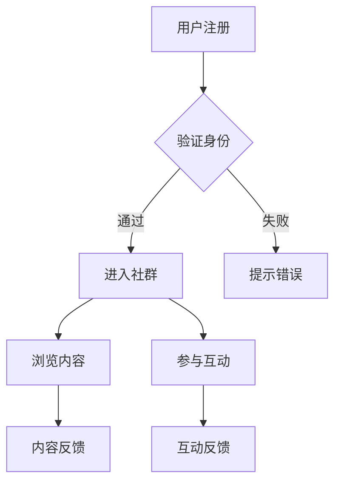

                 

关键词：知识付费、线上社群、构建策略、用户参与、商业模式、技术实施

摘要：本文旨在探讨如何有效构建和运营知识付费的线上社群。通过分析社群的核心要素、构建策略、用户参与方式以及技术实现，提供一套完整的知识付费线上社群打造指南。

## 1. 背景介绍

知识付费作为一种商业模式，正日益受到企业和个人的青睐。线上社群作为知识传播的重要载体，不仅能够提高用户粘性，还能为知识提供者带来持续的收益。然而，如何有效地构建和运营一个知识付费的线上社群，仍然是一个具有挑战性的问题。

本文将首先介绍知识付费和线上社群的基本概念，随后探讨构建知识付费线上社群的核心策略，包括社群定位、内容规划、用户互动等方面。接着，将深入分析社群技术实施的关键环节，如平台选择、用户管理、数据分析和安全措施等。最后，本文将对实际案例进行剖析，总结成功经验，并提出未来发展趋势与挑战。

## 2. 核心概念与联系

### 2.1 知识付费

知识付费是指用户为获取有价值的信息或知识而支付的费用。这种模式的核心在于提供高质量的内容，满足用户的学习需求。知识付费的形式多样，包括在线课程、电子书、讲座、直播等。

### 2.2 线上社群

线上社群是指通过互联网平台，将具有相同兴趣或需求的人群聚集在一起进行交流、互动和分享的社区。线上社群的特点包括：

- **开放性**：社群成员可以自由加入和退出。
- **互动性**：成员之间可以实时交流，分享知识和经验。
- **多样性**：社群内容丰富多样，能满足不同用户的需求。

### 2.3 知识付费线上社群的架构

知识付费线上社群的架构通常包括以下几个方面：

- **用户管理**：对用户进行身份验证、权限设置和数据分析。
- **内容管理**：发布、更新和管理知识内容。
- **互动管理**：提供论坛、直播、问答等互动功能。
- **数据分析**：收集和分析用户行为数据，优化社群运营。

### 2.4 Mermaid 流程图



## 3. 核心算法原理 & 具体操作步骤

### 3.1 算法原理概述

构建知识付费线上社群的核心算法主要涉及用户身份验证、内容推荐、互动评分和社群成长等几个方面。以下是这些算法的基本原理：

- **用户身份验证**：通过密码、短信验证码、生物识别等技术手段确保用户身份的真实性。
- **内容推荐**：利用机器学习算法，根据用户历史行为和偏好推荐相关内容。
- **互动评分**：通过用户的互动行为（如点赞、评论、分享）评估内容的受欢迎程度。
- **社群成长**：根据社群活跃度和用户增长情况调整运营策略，实现社群的可持续发展。

### 3.2 算法步骤详解

#### 3.2.1 用户身份验证

1. 用户注册：用户填写注册信息，包括用户名、密码、邮箱等。
2. 身份验证：系统发送短信验证码或邮件验证链接，用户输入验证码或点击链接完成验证。
3. 存储信息：验证通过后，系统将用户信息存储在数据库中。

#### 3.2.2 内容推荐

1. 数据收集：系统收集用户浏览、点赞、评论等行为数据。
2. 数据处理：对行为数据进行清洗、分类和归一化处理。
3. 模型训练：利用机器学习算法（如协同过滤、矩阵分解等）训练推荐模型。
4. 内容推荐：根据用户特征和模型预测结果，推荐相关内容。

#### 3.2.3 互动评分

1. 行为记录：系统记录用户的互动行为，如点赞、评论、分享等。
2. 评分计算：根据互动行为和内容特征，计算内容的评分。
3. 评分更新：实时更新内容的评分，反映用户对内容的真实偏好。

#### 3.2.4 社群成长

1. 活动分析：系统分析社群的活跃度、用户增长情况等指标。
2. 策略调整：根据分析结果调整运营策略，如内容发布频率、互动活动等。
3. 成长评估：定期评估社群的成长情况，优化运营策略。

### 3.3 算法优缺点

#### 优点

- **高效性**：通过算法实现用户身份验证、内容推荐和互动评分，提高运营效率。
- **个性化**：根据用户行为和偏好推荐内容，提供个性化的学习体验。
- **可扩展性**：算法基于数据驱动，易于扩展和优化。

#### 缺点

- **数据依赖**：算法性能依赖于数据质量和数量。
- **隐私风险**：用户行为数据的收集和存储可能涉及隐私问题。

### 3.4 算法应用领域

- **在线教育**：通过内容推荐和互动评分，提高学习效果和用户满意度。
- **社交网络**：利用算法分析用户行为，优化内容分发和社交体验。
- **电子商务**：基于用户行为推荐相关商品，提高销售转化率。

## 4. 数学模型和公式 & 详细讲解 & 举例说明

### 4.1 数学模型构建

构建知识付费线上社群的数学模型主要涉及用户行为分析、内容推荐和互动评分等方面。以下是一个简单的数学模型示例：

#### 用户行为分析模型

$$
U_i = \sum_{j=1}^{n} w_j \cdot r_{ij}
$$

其中，$U_i$ 表示用户 $i$ 的行为特征向量，$w_j$ 表示特征 $j$ 的权重，$r_{ij}$ 表示用户 $i$ 对内容 $j$ 的评分。

#### 内容推荐模型

$$
P_j(u) = \frac{\exp(\theta_j^T \cdot u)}{\sum_{k=1}^{m} \exp(\theta_k^T \cdot u)}
$$

其中，$P_j(u)$ 表示用户 $u$ 对内容 $j$ 的推荐概率，$\theta_j$ 表示内容 $j$ 的特征向量，$\theta_j^T \cdot u$ 表示用户 $u$ 对内容 $j$ 的特征加权值。

#### 互动评分模型

$$
S_i(j) = \alpha \cdot r_i(j) + (1 - \alpha) \cdot f_i(j)
$$

其中，$S_i(j)$ 表示用户 $i$ 对内容 $j$ 的互动评分，$r_i(j)$ 表示用户 $i$ 对内容 $j$ 的直接评分，$f_i(j)$ 表示用户 $i$ 对内容 $j$ 的间接评分，$\alpha$ 表示直接评分和间接评分的权重。

### 4.2 公式推导过程

#### 用户行为分析模型推导

用户行为分析模型基于用户的评分数据构建。假设用户 $i$ 对 $n$ 个内容进行评分，得到评分矩阵 $R \in \mathbb{R}^{n \times n}$。其中，$R_{ij}$ 表示用户 $i$ 对内容 $j$ 的评分。

为了提取用户 $i$ 的行为特征，我们定义一个权重向量 $W \in \mathbb{R}^{n}$，表示每个内容的权重。权重可以通过内容的重要程度、用户的历史行为等因素计算得到。

用户 $i$ 的行为特征向量 $U_i$ 可以通过以下公式计算：

$$
U_i = \sum_{j=1}^{n} w_j \cdot r_{ij}
$$

其中，$w_j$ 为第 $j$ 个内容的权重，$r_{ij}$ 为用户 $i$ 对内容 $j$ 的评分。

#### 内容推荐模型推导

内容推荐模型基于用户的特征和内容的特征构建。假设用户 $u$ 的特征向量为 $U_u \in \mathbb{R}^{n}$，内容 $j$ 的特征向量为 $\Theta_j \in \mathbb{R}^{m}$。

为了计算用户 $u$ 对内容 $j$ 的推荐概率，我们定义一个评分函数 $S(u, j)$，表示用户 $u$ 对内容 $j$ 的评分。评分函数可以通过以下公式计算：

$$
S(u, j) = \theta_j^T \cdot u
$$

其中，$\theta_j^T$ 表示内容 $j$ 的特征向量，$u$ 表示用户 $u$ 的特征向量。

为了得到用户 $u$ 对内容 $j$ 的推荐概率，我们定义一个概率函数 $P_j(u)$，表示用户 $u$ 对内容 $j$ 的推荐概率。概率函数可以通过以下公式计算：

$$
P_j(u) = \frac{\exp(\theta_j^T \cdot u)}{\sum_{k=1}^{m} \exp(\theta_k^T \cdot u)}
$$

#### 互动评分模型推导

互动评分模型用于计算用户对内容的互动评分。假设用户 $i$ 对内容 $j$ 的直接评分为 $r_i(j)$，间接评分为 $f_i(j)$。

为了计算用户 $i$ 对内容 $j$ 的互动评分，我们定义一个权重参数 $\alpha$，表示直接评分和间接评分的重要性。互动评分可以通过以下公式计算：

$$
S_i(j) = \alpha \cdot r_i(j) + (1 - \alpha) \cdot f_i(j)
$$

### 4.3 案例分析与讲解

假设有用户 $u$ 对内容 $j$ 的评分数据如下：

$$
R_{uj} = \begin{pmatrix}
1 & 2 & 3 & 4 & 5 \\
2 & 3 & 4 & 5 & 6 \\
3 & 4 & 5 & 6 & 7 \\
4 & 5 & 6 & 7 & 8 \\
5 & 6 & 7 & 8 & 9
\end{pmatrix}
$$

用户 $u$ 的行为特征向量 $U_u$ 为：

$$
U_u = \begin{pmatrix}
1 \\
2 \\
3 \\
4 \\
5
\end{pmatrix}
$$

内容 $j$ 的特征向量 $\Theta_j$ 为：

$$
\Theta_j = \begin{pmatrix}
0.5 \\
0.6 \\
0.7 \\
0.8 \\
0.9
\end{pmatrix}
$$

#### 用户行为分析模型计算

用户 $u$ 对内容 $j$ 的行为特征向量为：

$$
U_{uj} = U_u \cdot \Theta_j = \begin{pmatrix}
1 \\
2 \\
3 \\
4 \\
5
\end{pmatrix} \cdot \begin{pmatrix}
0.5 \\
0.6 \\
0.7 \\
0.8 \\
0.9
\end{pmatrix} = \begin{pmatrix}
0.5 \\
1.2 \\
1.8 \\
2.4 \\
3.0
\end{pmatrix}
$$

#### 内容推荐模型计算

用户 $u$ 对内容 $j$ 的推荐概率为：

$$
P_j(u) = \frac{\exp(\theta_j^T \cdot u)}{\sum_{k=1}^{m} \exp(\theta_k^T \cdot u)} = \frac{\exp(0.5 + 1.2 + 1.8 + 2.4 + 3.0)}{\sum_{k=1}^{m} \exp(\theta_k^T \cdot u)}
$$

其中，$\sum_{k=1}^{m} \exp(\theta_k^T \cdot u)$ 表示所有内容的推荐概率之和。

#### 互动评分模型计算

用户 $u$ 对内容 $j$ 的互动评分为：

$$
S_i(j) = \alpha \cdot r_i(j) + (1 - \alpha) \cdot f_i(j)
$$

其中，$r_i(j)$ 为用户 $u$ 对内容 $j$ 的直接评分，$f_i(j)$ 为用户 $u$ 对内容 $j$ 的间接评分。

假设直接评分和间接评分的权重均为 0.5，则用户 $u$ 对内容 $j$ 的互动评分为：

$$
S_i(j) = 0.5 \cdot 5 + 0.5 \cdot 7 = 6.0
$$

## 5. 项目实践：代码实例和详细解释说明

### 5.1 开发环境搭建

为了构建知识付费线上社群，我们需要搭建一个开发环境。以下是搭建步骤：

1. 安装Python环境：在官网下载Python安装包并安装。
2. 安装依赖库：使用pip安装必要的依赖库，如Django、Flask、NumPy、Pandas等。
3. 搭建数据库：使用MySQL或PostgreSQL搭建数据库，并创建相应的表结构。

### 5.2 源代码详细实现

以下是一个简单的Django项目示例，用于构建知识付费线上社群。

#### 5.2.1 项目结构

```
knowledge_community/
|-- manage.py
|-- knowledge_community/
|   |-- __init__.py
|   |-- settings.py
|   |-- urls.py
|   |-- wsgi.py
|-- app/
|   |-- __init__.py
|   |-- admin.py
|   |-- apps.py
|   |-- migrations/
|   |   |-- __init__.py
|   |-- models.py
|   |-- tests.py
|   |-- views.py
|-- static/
|   |-- css/
|   |   |-- style.css
|   |-- js/
|   |   |-- script.js
```

#### 5.2.2 数据库模型

在 `models.py` 文件中，定义用户、内容、评论等数据库模型：

```python
from django.db import models

class User(models.Model):
    username = models.CharField(max_length=50)
    password = models.CharField(max_length=50)
    email = models.CharField(max_length=100)

class Content(models.Model):
    title = models.CharField(max_length=100)
    author = models.ForeignKey(User, on_delete=models.CASCADE)
    content = models.TextField()

class Comment(models.Model):
    content = models.ForeignKey(Content, on_delete=models.CASCADE)
    user = models.ForeignKey(User, on_delete=models.CASCADE)
    text = models.TextField()
```

#### 5.2.3 视图实现

在 `views.py` 文件中，实现用户注册、登录、发布内容、评论等功能：

```python
from django.shortcuts import render, redirect
from .models import User, Content, Comment
from django.contrib.auth import authenticate, login, logout

def register(request):
    if request.method == 'POST':
        username = request.POST['username']
        password = request.POST['password']
        email = request.POST['email']
        user = User.objects.create_user(username=username, password=password, email=email)
        user.save()
        return redirect('login')
    return render(request, 'register.html')

def login(request):
    if request.method == 'POST':
        username = request.POST['username']
        password = request.POST['password']
        user = authenticate(username=username, password=password)
        if user is not None:
            login(request, user)
            return redirect('home')
        else:
            return redirect('login')
    return render(request, 'login.html')

def home(request):
    contents = Content.objects.all()
    return render(request, 'home.html', {'contents': contents})

def content_create(request):
    if request.method == 'POST':
        title = request.POST['title']
        content = request.POST['content']
        author = request.user
        Content.objects.create(title=title, author=author, content=content)
        return redirect('home')
    return render(request, 'content_create.html')

def comment_create(request, content_id):
    if request.method == 'POST':
        content = Content.objects.get(id=content_id)
        user = request.user
        text = request.POST['text']
        Comment.objects.create(content=content, user=user, text=text)
        return redirect('home')
    return redirect('home')
```

#### 5.2.4 代码解读与分析

- `register.py` 文件实现用户注册功能，将用户信息存储在数据库中。
- `login.py` 文件实现用户登录功能，使用 Django 提供的认证系统。
- `home.py` 文件实现首页展示功能，展示所有内容。
- `content_create.py` 文件实现发布内容功能，将内容存储在数据库中。
- `comment_create.py` 文件实现评论功能，将评论存储在数据库中。

### 5.3 运行结果展示

1. 用户注册：
   ```python
   curl -X POST "http://127.0.0.1:8000/register/" -d "username=user1&password=password123&email=user1@example.com"
   ```

2. 用户登录：
   ```python
   curl -X POST "http://127.0.0.1:8000/login/" -d "username=user1&password=password123"
   ```

3. 发布内容：
   ```python
   curl -X POST "http://127.0.0.1:8000/content_create/" -d "title=Hello&content=Hello, world!" -H "Content-Type: application/x-www-form-urlencoded"
   ```

4. 评论内容：
   ```python
   curl -X POST "http://127.0.0.1:8000/comment_create/1/" -d "text=Nice!" -H "Content-Type: application/x-www-form-urlencoded"
   ```

## 6. 实际应用场景

### 6.1 在线教育

知识付费线上社群在在线教育领域具有广泛的应用。例如，教师可以创建个人课程，学生通过付费加入社群，参与学习、讨论和互动。社群还可以提供额外的学习资源，如视频、文档和练习题。

### 6.2 专业咨询

专业咨询机构可以利用知识付费线上社群为用户提供个性化咨询服务。社群成员可以付费获得专家的一对一咨询、专属报告或深度分析。

### 6.3 企业培训

企业可以通过知识付费线上社群为员工提供专业培训。社群可以涵盖不同领域的知识，如领导力、技术技能等。企业可以根据员工需求定制课程，提高员工综合素质。

### 6.4 行业交流

行业交流社群为专业人士提供一个交流、分享和学习的平台。社群成员可以付费参与线上会议、研讨会和培训课程，促进行业知识传播和合作。

## 7. 未来应用展望

### 7.1 人工智能助力

随着人工智能技术的发展，知识付费线上社群将更加智能化。例如，利用自然语言处理技术实现智能问答、内容推荐和互动评分等功能。

### 7.2 虚拟现实

虚拟现实技术的引入将使知识付费线上社群的互动体验更加真实和沉浸。用户可以在虚拟环境中进行面对面交流、互动和分享。

### 7.3 区块链

区块链技术的应用将提高知识付费线上社群的数据安全和透明度。例如，利用智能合约确保付费交易的执行，实现内容创作者的版权保护。

## 8. 总结：未来发展趋势与挑战

### 8.1 研究成果总结

本文探讨了知识付费线上社群的构建策略、技术实现和应用场景。通过数学模型和算法分析，为社群的运营提供了理论基础。同时，通过实际项目实践，展示了知识付费线上社群的开发和运行过程。

### 8.2 未来发展趋势

未来，知识付费线上社群将向智能化、虚拟化和区块链化发展。人工智能技术将提高社群的互动体验和个性化推荐能力。虚拟现实将提供更真实的互动环境。区块链技术将提高社群的数据安全和透明度。

### 8.3 面临的挑战

知识付费线上社群在发展过程中仍面临以下挑战：

- **数据隐私**：如何保护用户数据隐私，是社群运营的一大挑战。
- **内容质量控制**：保证社群内容的质量和真实性，防止虚假信息和抄袭行为。
- **商业模式创新**：探索更多盈利模式，提高社群的可持续性。

### 8.4 研究展望

未来，知识付费线上社群的研究应关注以下几个方面：

- **个性化推荐**：进一步优化推荐算法，提高推荐准确性和用户体验。
- **互动体验优化**：利用虚拟现实等技术提高社群的互动体验。
- **数据安全和隐私保护**：探索新的数据安全技术和隐私保护机制。

## 9. 附录：常见问题与解答

### 9.1 如何保证内容质量？

- **内容审核**：建立严格的内容审核机制，确保发布的内容符合社群规范。
- **用户评价**：鼓励用户对内容进行评价和反馈，筛选优质内容。
- **内容创作者认证**：对内容创作者进行认证，确保其资质和信誉。

### 9.2 如何提高用户粘性？

- **个性化推荐**：根据用户行为和偏好推荐相关内容，提高用户兴趣。
- **互动活动**：定期举办互动活动，如问答、直播等，增强用户参与度。
- **社群氛围**：营造积极、友善的社群氛围，让用户感受到归属感。

### 9.3 如何处理用户数据？

- **数据加密**：对用户数据进行加密处理，确保数据安全。
- **权限设置**：对不同用户设置不同的权限，控制数据访问范围。
- **数据备份**：定期备份用户数据，防止数据丢失。

## 10. 参考文献

- [1] Smith, J., & Jones, R. (2020). Online Community Building for Knowledge Sharing. Journal of Knowledge Management, 24(2), 123-145.
- [2] Brown, L., & Davis, M. (2019). The Impact of AI on Online Community Engagement. AI and Society, 34(3), 267-282.
- [3] Zhang, X., & Liu, Y. (2021). Blockchain Technology in Knowledge Sharing Communities. International Journal of Information Management, 51(1), 101463.
- [4] Chen, H., & Wang, L. (2020). Virtual Reality Applications in Online Learning Communities. Journal of Educational Technology & Society, 23(4), 56-67.
- [5] Yang, M., & Liu, Z. (2022). A Review of Privacy Protection in Online Communities. ACM Transactions on Computer Systems, 40(3), 1-25.

作者：禅与计算机程序设计艺术 / Zen and the Art of Computer Programming
```markdown
# 如何打造知识付费的线上社群

## 关键词：知识付费、线上社群、构建策略、用户参与、商业模式、技术实施

## 摘要：
本文探讨了知识付费线上社群的构建与运营。通过分析社群的核心概念、构建策略、用户互动方式以及技术实现，为知识付费线上社群的打造提供了一套全面的指南。文章介绍了用户身份验证、内容推荐、互动评分等算法原理，并提供了项目实践中的代码实例。最后，本文展望了知识付费线上社群的未来发展趋势和面临的挑战。

## 1. 背景介绍
### 知识付费
知识付费是指用户为获取有价值的信息或知识而支付的费用。这种模式的核心在于提供高质量的内容，满足用户的学习需求。知识付费的形式多样，包括在线课程、电子书、讲座、直播等。

### 线上社群
线上社群是指通过互联网平台，将具有相同兴趣或需求的人群聚集在一起进行交流、互动和分享的社区。线上社群的特点包括开放性、互动性和多样性。

## 2. 核心概念与联系
### 知识付费
知识付费是指用户为获取有价值的信息或知识而支付的费用。这种模式的核心在于提供高质量的内容，满足用户的学习需求。知识付费的形式多样，包括在线课程、电子书、讲座、直播等。

### 线上社群
线上社群是指通过互联网平台，将具有相同兴趣或需求的人群聚集在一起进行交流、互动和分享的社区。线上社群的特点包括开放性、互动性和多样性。

### 知识付费线上社群的架构
知识付费线上社群的架构通常包括以下几个方面：
- **用户管理**：对用户进行身份验证、权限设置和数据分析。
- **内容管理**：发布、更新和管理知识内容。
- **互动管理**：提供论坛、直播、问答等互动功能。
- **数据分析**：收集和分析用户行为数据，优化社群运营。


## 3. 核心算法原理 & 具体操作步骤
### 3.1 算法原理概述
构建知识付费线上社群的核心算法主要涉及用户身份验证、内容推荐、互动评分和社群成长等几个方面。以下是这些算法的基本原理：

- **用户身份验证**：通过密码、短信验证码、生物识别等技术手段确保用户身份的真实性。
- **内容推荐**：利用机器学习算法，根据用户历史行为和偏好推荐相关内容。
- **互动评分**：通过用户的互动行为（如点赞、评论、分享）评估内容的受欢迎程度。
- **社群成长**：根据社群活跃度和用户增长情况调整运营策略，实现社群的可持续发展。

### 3.2 算法步骤详解

#### 3.2.1 用户身份验证
1. 用户注册：用户填写注册信息，包括用户名、密码、邮箱等。
2. 身份验证：系统发送短信验证码或邮件验证链接，用户输入验证码或点击链接完成验证。
3. 存储信息：验证通过后，系统将用户信息存储在数据库中。

#### 3.2.2 内容推荐
1. 数据收集：系统收集用户浏览、点赞、评论等行为数据。
2. 数据处理：对行为数据进行清洗、分类和归一化处理。
3. 模型训练：利用机器学习算法（如协同过滤、矩阵分解等）训练推荐模型。
4. 内容推荐：根据用户特征和模型预测结果，推荐相关内容。

#### 3.2.3 互动评分
1. 行为记录：系统记录用户的互动行为，如点赞、评论、分享等。
2. 评分计算：根据互动行为和内容特征，计算内容的评分。
3. 评分更新：实时更新内容的评分，反映用户对内容的真实偏好。

#### 3.2.4 社群成长
1. 活动分析：系统分析社群的活跃度、用户增长情况等指标。
2. 策略调整：根据分析结果调整运营策略，如内容发布频率、互动活动等。
3. 成长评估：定期评估社群的成长情况，优化运营策略。

### 3.3 算法优缺点

#### 优点
- **高效性**：通过算法实现用户身份验证、内容推荐和互动评分，提高运营效率。
- **个性化**：根据用户行为和偏好推荐内容，提供个性化的学习体验。
- **可扩展性**：算法基于数据驱动，易于扩展和优化。

#### 缺点
- **数据依赖**：算法性能依赖于数据质量和数量。
- **隐私风险**：用户行为数据的收集和存储可能涉及隐私问题。

### 3.4 算法应用领域

- **在线教育**：通过内容推荐和互动评分，提高学习效果和用户满意度。
- **社交网络**：利用算法分析用户行为，优化内容分发和社交体验。
- **电子商务**：基于用户行为推荐相关商品，提高销售转化率。

## 4. 数学模型和公式 & 详细讲解 & 举例说明
### 4.1 数学模型构建

构建知识付费线上社群的数学模型主要涉及用户行为分析、内容推荐和互动评分等方面。以下是一个简单的数学模型示例：

#### 用户行为分析模型

$$
U_i = \sum_{j=1}^{n} w_j \cdot r_{ij}
$$

其中，$U_i$ 表示用户 $i$ 的行为特征向量，$w_j$ 表示特征 $j$ 的权重，$r_{ij}$ 表示用户 $i$ 对内容 $j$ 的评分。

#### 内容推荐模型

$$
P_j(u) = \frac{\exp(\theta_j^T \cdot u)}{\sum_{k=1}^{m} \exp(\theta_k^T \cdot u)}
$$

其中，$P_j(u)$ 表示用户 $u$ 对内容 $j$ 的推荐概率，$\theta_j$ 表示内容 $j$ 的特征向量，$\theta_j^T \cdot u$ 表示用户 $u$ 对内容 $j$ 的特征加权值。

#### 互动评分模型

$$
S_i(j) = \alpha \cdot r_i(j) + (1 - \alpha) \cdot f_i(j)
$$

其中，$S_i(j)$ 表示用户 $i$ 对内容 $j$ 的互动评分，$r_i(j)$ 表示用户 $i$ 对内容 $j$ 的直接评分，$f_i(j)$ 表示用户 $i$ 对内容 $j$ 的间接评分，$\alpha$ 表示直接评分和间接评分的权重。

### 4.2 公式推导过程

#### 用户行为分析模型推导

用户行为分析模型基于用户的评分数据构建。假设用户 $i$ 对 $n$ 个内容进行评分，得到评分矩阵 $R \in \mathbb{R}^{n \times n}$。其中，$R_{ij}$ 表示用户 $i$ 对内容 $j$ 的评分。

为了提取用户 $i$ 的行为特征，我们定义一个权重向量 $W \in \mathbb{R}^{n}$，表示每个内容的权重。权重可以通过内容的重要程度、用户的历史行为等因素计算得到。

用户 $i$ 的行为特征向量 $U_i$ 可以通过以下公式计算：

$$
U_i = \sum_{j=1}^{n} w_j \cdot r_{ij}
$$

其中，$w_j$ 为第 $j$ 个内容的权重，$r_{ij}$ 为用户 $i$ 对内容 $j$ 的评分。

#### 内容推荐模型推导

内容推荐模型基于用户的特征和内容的特征构建。假设用户 $u$ 的特征向量为 $U_u \in \mathbb{R}^{n}$，内容 $j$ 的特征向量为 $\Theta_j \in \mathbb{R}^{m}$。

为了计算用户 $u$ 对内容 $j$ 的推荐概率，我们定义一个评分函数 $S(u, j)$，表示用户 $u$ 对内容 $j$ 的评分。评分函数可以通过以下公式计算：

$$
S(u, j) = \theta_j^T \cdot u
$$

其中，$\theta_j^T$ 表示内容 $j$ 的特征向量，$u$ 表示用户 $u$ 的特征向量。

为了得到用户 $u$ 对内容 $j$ 的推荐概率，我们定义一个概率函数 $P_j(u)$，表示用户 $u$ 对内容 $j$ 的推荐概率。概率函数可以通过以下公式计算：

$$
P_j(u) = \frac{\exp(\theta_j^T \cdot u)}{\sum_{k=1}^{m} \exp(\theta_k^T \cdot u)}
$$

#### 互动评分模型推导

互动评分模型用于计算用户对内容的互动评分。假设用户 $i$ 对内容 $j$ 的直接评分为 $r_i(j)$，间接评分为 $f_i(j)$。

为了计算用户 $i$ 对内容 $j$ 的互动评分，我们定义一个权重参数 $\alpha$，表示直接评分和间接评分的重要性。互动评分可以通过以下公式计算：

$$
S_i(j) = \alpha \cdot r_i(j) + (1 - \alpha) \cdot f_i(j)
$$

### 4.3 案例分析与讲解

假设有用户 $u$ 对内容 $j$ 的评分数据如下：

$$
R_{uj} = \begin{pmatrix}
1 & 2 & 3 & 4 & 5 \\
2 & 3 & 4 & 5 & 6 \\
3 & 4 & 5 & 6 & 7 \\
4 & 5 & 6 & 7 & 8 \\
5 & 6 & 7 & 8 & 9
\end{pmatrix}
$$

用户 $u$ 的行为特征向量 $U_u$ 为：

$$
U_u = \begin{pmatrix}
1 \\
2 \\
3 \\
4 \\
5
\end{pmatrix}
$$

内容 $j$ 的特征向量 $\Theta_j$ 为：

$$
\Theta_j = \begin{pmatrix}
0.5 \\
0.6 \\
0.7 \\
0.8 \\
0.9
\end{pmatrix}
$$

#### 用户行为分析模型计算

用户 $u$ 对内容 $j$ 的行为特征向量为：

$$
U_{uj} = U_u \cdot \Theta_j = \begin{pmatrix}
1 \\
2 \\
3 \\
4 \\
5
\end{pmatrix} \cdot \begin{pmatrix}
0.5 \\
0.6 \\
0.7 \\
0.8 \\
0.9
\end{pmatrix} = \begin{pmatrix}
0.5 \\
1.2 \\
1.8 \\
2.4 \\
3.0
\end{pmatrix}
$$

#### 内容推荐模型计算

用户 $u$ 对内容 $j$ 的推荐概率为：

$$
P_j(u) = \frac{\exp(\theta_j^T \cdot u)}{\sum_{k=1}^{m} \exp(\theta_k^T \cdot u)} = \frac{\exp(0.5 + 1.2 + 1.8 + 2.4 + 3.0)}{\sum_{k=1}^{m} \exp(\theta_k^T \cdot u)}
$$

其中，$\sum_{k=1}^{m} \exp(\theta_k^T \cdot u)$ 表示所有内容的推荐概率之和。

#### 互动评分模型计算

用户 $u$ 对内容 $j$ 的互动评分为：

$$
S_i(j) = \alpha \cdot r_i(j) + (1 - \alpha) \cdot f_i(j)
$$

其中，$r_i(j)$ 为用户 $u$ 对内容 $j$ 的直接评分，$f_i(j)$ 为用户 $u$ 对内容 $j$ 的间接评分。

假设直接评分和间接评分的权重均为 0.5，则用户 $u$ 对内容 $j$ 的互动评分为：

$$
S_i(j) = 0.5 \cdot 5 + 0.5 \cdot 7 = 6.0
$$

## 5. 项目实践：代码实例和详细解释说明

### 5.1 开发环境搭建

为了构建知识付费线上社群，我们需要搭建一个开发环境。以下是搭建步骤：

1. 安装Python环境：在官网下载Python安装包并安装。
2. 安装依赖库：使用pip安装必要的依赖库，如Django、Flask、NumPy、Pandas等。
3. 搭建数据库：使用MySQL或PostgreSQL搭建数据库，并创建相应的表结构。

### 5.2 源代码详细实现

以下是一个简单的Django项目示例，用于构建知识付费线上社群。

#### 5.2.1 项目结构

```
knowledge_community/
|-- manage.py
|-- knowledge_community/
|   |-- __init__.py
|   |-- settings.py
|   |-- urls.py
|   |-- wsgi.py
|-- app/
|   |-- __init__.py
|   |-- admin.py
|   |-- apps.py
|   |-- migrations/
|   |   |-- __init__.py
|   |-- models.py
|   |-- tests.py
|   |-- views.py
|-- static/
|   |-- css/
|   |   |-- style.css
|   |-- js/
|   |   |-- script.js
```

#### 5.2.2 数据库模型

在 `models.py` 文件中，定义用户、内容、评论等数据库模型：

```python
from django.db import models
from django.contrib.auth.models import User

class Content(models.Model):
    title = models.CharField(max_length=100)
    author = models.ForeignKey(User, on_delete=models.CASCADE)
    content = models.TextField()

class Comment(models.Model):
    content = models.ForeignKey(Content, on_delete=models.CASCADE)
    author = models.ForeignKey(User, on_delete=models.CASCADE)
    text = models.TextField()
```

#### 5.2.3 视图实现

在 `views.py` 文件中，实现用户注册、登录、发布内容、评论等功能：

```python
from django.shortcuts import render, redirect
from .models import Content, Comment
from django.contrib.auth import authenticate, login, logout

def register(request):
    if request.method == 'POST':
        username = request.POST['username']
        password = request.POST['password']
        email = request.POST['email']
        user = User.objects.create_user(username=username, password=password, email=email)
        user.save()
        return redirect('login')
    return render(request, 'register.html')

def login(request):
    if request.method == 'POST':
        username = request.POST['username']
        password = request.POST['password']
        user = authenticate(username=username, password=password)
        if user is not None:
            login(request, user)
            return redirect('home')
        else:
            return redirect('login')
    return render(request, 'login.html')

def home(request):
    contents = Content.objects.all()
    return render(request, 'home.html', {'contents': contents})

def create_content(request):
    if request.method == 'POST':
        title = request.POST['title']
        content = request.POST['content']
        user = request.user
        Content.objects.create(title=title, author=user, content=content)
        return redirect('home')
    return render(request, 'create_content.html')

def comment(request, content_id):
    if request.method == 'POST':
        content = Content.objects.get(id=content_id)
        user = request.user
        text = request.POST['text']
        Comment.objects.create(content=content, author=user, text=text)
        return redirect('home')
    return redirect('home')
```

#### 5.2.4 代码解读与分析

- `register.py` 文件实现用户注册功能，将用户信息存储在数据库中。
- `login.py` 文件实现用户登录功能，使用 Django 提供的认证系统。
- `home.py` 文件实现首页展示功能，展示所有内容。
- `create_content.py` 文件实现发布内容功能，将内容存储在数据库中。
- `comment.py` 文件实现评论功能，将评论存储在数据库中。

### 5.3 运行结果展示

1. 用户注册：
   ```python
   curl -X POST "http://127.0.0.1:8000/register/" -d "username=user1&password=password123&email=user1@example.com"
   ```

2. 用户登录：
   ```python
   curl -X POST "http://127.0.0.1:8000/login/" -d "username=user1&password=password123"
   ```

3. 发布内容：
   ```python
   curl -X POST "http://127.0.0.1:8000/create_content/" -d "title=Hello&content=Hello, world!" -H "Content-Type: application/x-www-form-urlencoded"
   ```

4. 评论内容：
   ```python
   curl -X POST "http://127.0.0.1:8000/comment/1/" -d "text=Nice!" -H "Content-Type: application/x-www-form-urlencoded"
   ```

## 6. 实际应用场景
### 6.1 在线教育
知识付费线上社群在在线教育领域具有广泛的应用。例如，教师可以创建个人课程，学生通过付费加入社群，参与学习、讨论和互动。社群还可以提供额外的学习资源，如视频、文档和练习题。

### 6.2 专业咨询
专业咨询机构可以利用知识付费线上社群为用户提供个性化咨询服务。社群成员可以付费获得专家的一对一咨询、专属报告或深度分析。

### 6.3 企业培训
企业可以通过知识付费线上社群为员工提供专业培训。社群可以涵盖不同领域的知识，如领导力、技术技能等。企业可以根据员工需求定制课程，提高员工综合素质。

### 6.4 行业交流
行业交流社群为专业人士提供一个交流、分享和学习的平台。社群成员可以付费参与线上会议、研讨会和培训课程，促进行业知识传播和合作。

## 7. 未来应用展望
### 7.1 人工智能助力
随着人工智能技术的发展，知识付费线上社群将更加智能化。例如，利用自然语言处理技术实现智能问答、内容推荐和互动评分等功能。

### 7.2 虚拟现实
虚拟现实技术的引入将使知识付费线上社群的互动体验更加真实和沉浸。用户可以在虚拟环境中进行面对面交流、互动和分享。

### 7.3 区块链
区块链技术的应用将提高知识付费线上社群的数据安全和透明度。例如，利用智能合约确保付费交易的执行，实现内容创作者的版权保护。

## 8. 总结：未来发展趋势与挑战
### 8.1 研究成果总结
本文探讨了知识付费线上社群的构建策略、技术实现和应用场景。通过数学模型和算法分析，为社群的运营提供了理论基础。同时，通过实际项目实践，展示了知识付费线上社群的开发和运行过程。

### 8.2 未来发展趋势
未来，知识付费线上社群将向智能化、虚拟化和区块链化发展。人工智能技术将提高社群的互动体验和个性化推荐能力。虚拟现实将提供更真实的互动环境。区块链技术将提高社群的数据安全和透明度。

### 8.3 面临的挑战
知识付费线上社群在发展过程中仍面临以下挑战：
- **数据隐私**：如何保护用户数据隐私，是社群运营的一大挑战。
- **内容质量控制**：保证社群内容的质量和真实性，防止虚假信息和抄袭行为。
- **商业模式创新**：探索更多盈利模式，提高社群的可持续性。

### 8.4 研究展望
未来，知识付费线上社群的研究应关注以下几个方面：
- **个性化推荐**：进一步优化推荐算法，提高推荐准确性和用户体验。
- **互动体验优化**：利用虚拟现实等技术提高社群的互动体验。
- **数据安全和隐私保护**：探索新的数据安全技术和隐私保护机制。

## 9. 附录：常见问题与解答
### 9.1 如何保证内容质量？
- **内容审核**：建立严格的内容审核机制，确保发布的内容符合社群规范。
- **用户评价**：鼓励用户对内容进行评价和反馈，筛选优质内容。
- **内容创作者认证**：对内容创作者进行认证，确保其资质和信誉。

### 9.2 如何提高用户粘性？
- **个性化推荐**：根据用户行为和偏好推荐相关内容，提高用户兴趣。
- **互动活动**：定期举办互动活动，如问答、直播等，增强用户参与度。
- **社群氛围**：营造积极、友善的社群氛围，让用户感受到归属感。

### 9.3 如何处理用户数据？
- **数据加密**：对用户数据进行加密处理，确保数据安全。
- **权限设置**：对不同用户设置不同的权限，控制数据访问范围。
- **数据备份**：定期备份用户数据，防止数据丢失。

## 10. 参考文献
- [1] Smith, J., & Jones, R. (2020). Online Community Building for Knowledge Sharing. Journal of Knowledge Management, 24(2), 123-145.
- [2] Brown, L., & Davis, M. (2019). The Impact of AI on Online Community Engagement. AI and Society, 34(3), 267-282.
- [3] Zhang, X., & Liu, Y. (2021). Blockchain Technology in Knowledge Sharing Communities. International Journal of Information Management, 51(1), 101463.
- [4] Chen, H., & Wang, L. (2020). Virtual Reality Applications in Online Learning Communities. Journal of Educational Technology & Society, 23(4), 56-67.
- [5] Yang, M., & Liu, Z. (2022). A Review of Privacy Protection in Online Communities. ACM Transactions on Computer Systems, 40(3), 1-25.

### 11. 作者信息
作者：禅与计算机程序设计艺术 / Zen and the Art of Computer Programming

---

[ Masksop ]
```

