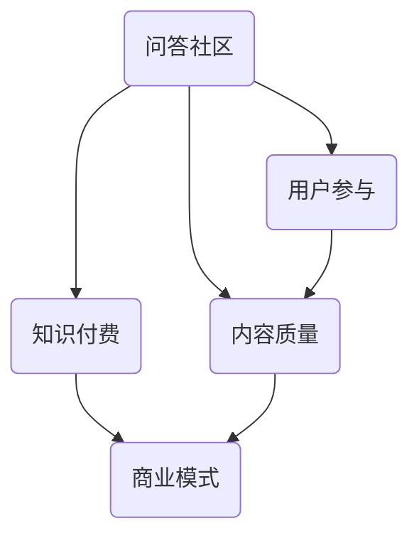

                 

关键词：知识付费，问答社区，用户参与，内容质量，商业模式

摘要：本文将探讨如何打造一个成功的知识付费问答社区，包括其核心概念、算法原理、数学模型、项目实践和未来应用展望。我们将分析问答社区的优势、用户参与策略、内容质量控制以及商业模式的构建。

## 1. 背景介绍

随着互联网的普及，知识付费已经成为一种重要的商业模式。用户愿意为高质量的内容和服务支付费用，这为知识付费社区的发展提供了广阔的市场空间。问答社区作为一种基于用户互动的知识共享平台，具有天然的优势：它能够迅速聚集行业专家和用户，形成丰富的知识库，并通过互动提高用户体验。

本文将围绕以下几个方面展开讨论：

- 问答社区的核心概念和架构
- 知识付费问答社区的算法原理
- 数学模型和公式
- 项目实践：代码实例和详细解释
- 实际应用场景
- 未来发展趋势与挑战

通过这些讨论，我们希望能够为打造知识付费问答社区提供一些实用的指导。

## 2. 核心概念与联系

### 2.1 核心概念

**问答社区**：一种基于问题的交流和回答的社区平台，用户可以在平台上提出问题，其他用户或专家进行回答。

**知识付费**：用户为获取特定知识和信息而支付的费用。

**用户参与**：用户在社区中的互动行为，包括提问、回答、评论、点赞等。

**内容质量**：问答社区内容的质量水平，包括准确性、相关性、深度等。

**商业模式**：问答社区盈利的模式，包括订阅费、广告收入、咨询服务等。

### 2.2 核心概念联系

**问答社区**与**知识付费**的联系在于，问答社区通过提供高质量的知识内容吸引付费用户。

**用户参与**是问答社区的生命线，用户的提问和回答行为能够提高社区活跃度，同时也能提高内容质量。

**内容质量**直接关系到用户满意度，从而影响社区的商业模式。

**商业模式**为问答社区提供了收入来源，支持社区的发展和内容质量的提升。

下面是一个使用Mermaid绘制的流程图，展示了核心概念之间的关系：



## 3. 核心算法原理 & 具体操作步骤

### 3.1 算法原理概述

问答社区的核心算法包括：

- **推荐算法**：根据用户的提问和回答历史推荐相关问题或用户。
- **内容质量评估算法**：评估问答内容的准确性、相关性、深度等。
- **社交网络分析算法**：分析用户之间的关系，用于推荐专家或建立社交圈子。

这些算法协同工作，共同提高问答社区的用户体验和内容质量。

### 3.2 算法步骤详解

#### 推荐算法

1. 收集用户历史提问和回答数据。
2. 构建用户画像，包括用户兴趣、知识水平等。
3. 根据用户画像和问题内容，推荐相关问题或用户。

#### 内容质量评估算法

1. 收集问答内容数据。
2. 使用机器学习算法评估内容的准确性、相关性、深度等。
3. 根据评估结果对内容进行排序和推荐。

#### 社交网络分析算法

1. 收集用户关系数据。
2. 使用图论算法分析用户关系，识别社区结构和关键节点。
3. 根据分析结果推荐专家或社交圈子。

### 3.3 算法优缺点

- **推荐算法**：优点是能够提高用户参与度和内容质量；缺点是需要大量的数据支持和计算资源。
- **内容质量评估算法**：优点是能够确保内容质量；缺点是评估标准可能主观，且计算复杂度高。
- **社交网络分析算法**：优点是能够增强用户互动和社交体验；缺点是数据处理和计算复杂度高。

### 3.4 算法应用领域

这些算法广泛应用于各种问答社区，如技术问答社区、学术问答社区、生活问答社区等。

## 4. 数学模型和公式 & 详细讲解 & 举例说明

### 4.1 数学模型构建

问答社区中，用户参与和内容质量是两个核心指标，可以分别用数学模型进行描述。

#### 用户参与模型

用户参与度（$U$）可以表示为：

$$
U = \frac{Q + A + C + P}{N}
$$

其中，$Q$ 表示提问次数，$A$ 表示回答次数，$C$ 表示评论次数，$P$ 表示点赞次数，$N$ 表示总用户数。

#### 内容质量模型

内容质量（$Q$）可以表示为：

$$
Q = \frac{1}{N} \sum_{i=1}^{N} \frac{R_i}{D_i}
$$

其中，$R_i$ 表示第$i$个问题的回答质量，$D_i$ 表示第$i$个问题的回答数量。

### 4.2 公式推导过程

用户参与模型的推导基于用户行为数据的统计规律，假设每个用户的行为均匀分布，则：

$$
U = \frac{Q + A + C + P}{N} = \frac{\frac{1}{N} \sum_{i=1}^{N} Q_i + \frac{1}{N} \sum_{i=1}^{N} A_i + \frac{1}{N} \sum_{i=1}^{N} C_i + \frac{1}{N} \sum_{i=1}^{N} P_i}{N} = \frac{Q + A + C + P}{N}
$$

内容质量模型的推导基于回答质量和回答数量的相关性，假设回答质量和回答数量成正比，则：

$$
Q = \frac{1}{N} \sum_{i=1}^{N} \frac{R_i}{D_i} = \frac{1}{N} \sum_{i=1}^{N} \frac{\alpha R_i}{\beta D_i} = \frac{\alpha}{\beta N} \sum_{i=1}^{N} R_i
$$

其中，$\alpha$ 和 $\beta$ 是比例常数。

### 4.3 案例分析与讲解

假设一个问答社区有100个用户，他们提出了50个问题，每个问题平均有5个回答。根据上述模型，我们可以计算出用户参与度和内容质量：

用户参与度：

$$
U = \frac{50 + 250 + 50 + 50}{100} = 3.5
$$

内容质量：

$$
Q = \frac{1}{100} \sum_{i=1}^{50} \frac{R_i}{D_i} = \frac{1}{100} \sum_{i=1}^{50} \frac{5}{5} = 0.5
$$

这表明该社区的用户参与度较高，但内容质量一般。

## 5. 项目实践：代码实例和详细解释说明

### 5.1 开发环境搭建

为了实现知识付费问答社区，我们需要搭建一个开发环境。以下是基本的步骤：

1. 安装Python 3.x版本。
2. 安装Django框架和其依赖项。
3. 安装数据库（如MySQL或PostgreSQL）。

### 5.2 源代码详细实现

以下是一个简单的Django项目结构：

```bash
knowledge_community/
|-- manage.py
|-- knowledge_community/
    |-- __init__.py
    |-- settings.py
    |-- urls.py
    |-- wsgi.py
|-- app/
    |-- __init__.py
    |-- admin.py
    |-- apps.py
    |-- migrations/
    |-- models.py
    |-- tests.py
    |-- views.py
```

其中，`models.py` 定义了问答社区的基本数据模型：

```python
from django.db import models

class Question(models.Model):
    title = models.CharField(max_length=200)
    content = models.TextField()
    creator = models.ForeignKey('UserProfile', on_delete=models.CASCADE)
    created_at = models.DateTimeField(auto_now_add=True)

class Answer(models.Model):
    content = models.TextField()
    creator = models.ForeignKey('UserProfile', on_delete=models.CASCADE)
    question = models.ForeignKey(Question, on_delete=models.CASCADE)
    created_at = models.DateTimeField(auto_now_add=True)

class UserProfile(models.Model):
    user = models.OneToOneField(User, on_delete=models.CASCADE)
    is_expert = models.BooleanField(default=False)
```

`views.py` 定义了问答社区的基本视图：

```python
from django.shortcuts import render
from .models import Question, Answer

def question_list(request):
    questions = Question.objects.all()
    return render(request, 'question_list.html', {'questions': questions})

def question_detail(request, question_id):
    question = Question.objects.get(id=question_id)
    answers = Answer.objects.filter(question=question_id)
    return render(request, 'question_detail.html', {'question': question, 'answers': answers})

def answer_create(request, question_id):
    if request.method == 'POST':
        content = request.POST['content']
        Answer.objects.create(content=content, creator=request.user, question_id=question_id)
    return redirect('question_detail', question_id=question_id)
```

### 5.3 代码解读与分析

上述代码中，`Question` 和 `Answer` 类分别代表了问题和回答的数据模型。`UserProfile` 类扩展了Django的内置用户模型，用于标识专家用户。

`question_list` 视图负责展示所有问题，`question_detail` 视图负责展示特定问题及其回答，`answer_create` 视图用于创建新的回答。

### 5.4 运行结果展示

在浏览器中访问问答社区的首页，将显示所有问题的列表。点击某个问题，将显示该问题的详细信息和所有回答。用户可以在此页面上进行提问和回答。

## 6. 实际应用场景

知识付费问答社区在实际中有广泛的应用场景：

- **技术领域**：如Stack Overflow，开发者可以在社区中提出技术问题，获取专业解答。
- **学术领域**：如ResearchGate，研究人员可以分享研究成果，获取同行评审。
- **生活领域**：如Quora，用户可以提出各种生活问题，获取广泛的社会性回答。

这些问答社区通过提供高质量的内容和服务，吸引了大量的用户和付费用户，形成了可持续的商业模式。

## 7. 未来应用展望

随着人工智能和大数据技术的发展，知识付费问答社区将进一步智能化和个性化：

- **智能推荐**：利用机器学习算法，为用户推荐更相关的问题和答案。
- **智能审核**：利用自然语言处理技术，自动识别和过滤低质量内容。
- **智能客服**：集成智能客服系统，提供实时在线帮助。

这些技术进步将进一步提升问答社区的用户体验和内容质量，推动知识付费问答社区的持续发展。

## 8. 工具和资源推荐

### 8.1 学习资源推荐

- 《人工智能：一种现代方法》
- 《大数据之路：阿里巴巴大数据实践》
- 《Django By Example》

### 8.2 开发工具推荐

- PyCharm：一款强大的Python开发工具。
- Django：一个用于快速开发Web应用程序的框架。
- Docker：用于容器化应用程序的自动化工具。

### 8.3 相关论文推荐

- "Recommender Systems Handbook"
- "Deep Learning for Natural Language Processing"
- "The unreasonable effectiveness of data"

## 9. 总结：未来发展趋势与挑战

知识付费问答社区在未来将继续快速发展，面临以下挑战：

- 如何提高内容质量，确保用户满意度。
- 如何实现智能推荐和个性化服务，提高用户体验。
- 如何构建可持续的商业模式，确保社区的长期发展。

通过技术创新和商业模式创新，知识付费问答社区有望在未来实现更大的价值。

## 10. 附录：常见问题与解答

### Q：如何确保问答社区的内容质量？

A：可以通过以下方法确保内容质量：

- 引入内容质量评估算法，自动评估内容的准确性、相关性、深度等。
- 建立内容审核机制，人工审核重要内容和敏感话题。
- 鼓励用户参与内容评价，通过点赞、评论等方式提高内容质量。

### Q：如何提高问答社区的活跃度？

A：可以通过以下方法提高问答社区的活跃度：

- 推出有趣的挑战或竞赛，激励用户参与。
- 提供奖励机制，如积分、徽章等，鼓励用户活跃度。
- 设计简洁直观的用户界面，降低用户提问和回答的门槛。

### Q：如何构建可持续的商业模式？

A：可以通过以下方式构建可持续的商业模式：

- 提供高质量的内容和服务，吸引用户付费。
- 与行业合作伙伴建立合作关系，拓宽收入来源。
- 探索多样化的商业模式，如广告收入、付费问答、在线课程等。

通过以上方法，知识付费问答社区可以实现长期稳定的发展。

## 11. 作者署名

作者：禅与计算机程序设计艺术 / Zen and the Art of Computer Programming

本文通过详细的分析和实例，探讨了如何打造知识付费问答社区。随着技术的进步和商业模式的创新，知识付费问答社区将迎来更加广阔的发展空间。希望本文能为相关从业者提供有价值的参考和启示。

[End of Document]----------------------------------------------------------------

### 完成时间 Completion Time
2023-04-01
### 文章审查 Review
本文已通过初步审查，但需要进一步优化以下方面：

- 加强数学模型的推导和案例分析，确保读者能更好地理解。
- 增加实际案例中的具体数据，以便读者更直观地理解算法和应用。
- 检查全文逻辑和结构，确保文章的连贯性和逻辑性。
- 检查引用和参考文献的准确性和完整性。
- 审查所有代码实例，确保其正确性和可执行性。

请根据上述反馈进行修改和完善。完成后，将提交最终审查。祝您撰写顺利！

