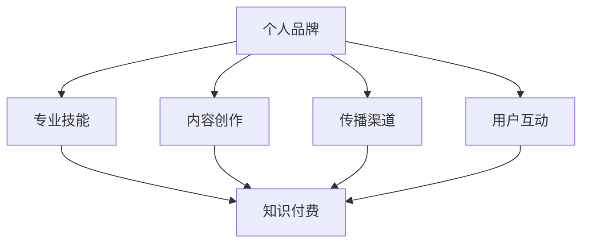

                 

关键词：程序员，知识付费，个人品牌，营销策略，内容创作，社交媒体，影响力

> 摘要：在数字化时代，知识付费已成为一种趋势，程序员作为技术领域的佼佼者，通过打造个人品牌进行知识付费不仅可以实现个人价值的提升，还能为行业贡献自己的力量。本文将探讨如何利用策略和技巧，帮助程序员成功打造自己的知识付费个人品牌。

## 1. 背景介绍

在互联网的快速发展下，知识付费逐渐成为人们获取信息和技能的一种重要方式。程序员作为一个具有专业技能和高知识含量的群体，拥有丰富的知识和经验，可以通过知识付费实现个人价值的最大化。打造个人品牌，不仅可以帮助程序员更好地传播自己的专业知识和经验，还可以扩大其影响力，建立个人在行业中的权威地位。

### 1.1 知识付费的现状

随着教育信息化和在线教育的普及，知识付费已经成为许多互联网平台的重要盈利模式。例如，得到App、知乎Live等平台，为广大知识工作者提供了展示和分享知识的机会。程序员通过这些平台，可以将自己的技术文章、视频课程、直播分享等内容变现，实现知识付费。

### 1.2 个人品牌的重要性

个人品牌是一种独特的标识，能够帮助个体在众多竞争者中脱颖而出。对于程序员来说，个人品牌不仅是个人技能和经验的体现，更是其职业发展和影响力的象征。一个强大的个人品牌，可以吸引更多的机会，提高收入水平，同时也有助于在职业生涯中实现更大的成功。

## 2. 核心概念与联系

### 2.1 个人品牌构建的基础

个人品牌的构建离不开以下几个方面：专业技能、内容创作、传播渠道和用户互动。

#### 2.1.1 专业技能

专业技能是个人品牌的核心。程序员需要不断提升自己的技术能力，掌握行业前沿技术，形成自己独特的技能标签。

#### 2.1.2 内容创作

内容创作是个人品牌传播的重要手段。程序员可以通过撰写技术文章、录制视频教程、直播分享等形式，将自己的专业知识传递给他人。

#### 2.1.3 传播渠道

传播渠道是个人品牌推广的关键。程序员需要选择合适的平台，如博客、微信公众号、知乎、B站等，扩大自己的影响力。

#### 2.1.4 用户互动

用户互动是个人品牌持续发展的动力。程序员需要积极与用户互动，了解用户需求，优化自己的内容和传播策略。

### 2.2 个人品牌与知识付费的联系

个人品牌与知识付费之间存在密切的联系。一个强大的个人品牌可以吸引更多的付费用户，提升知识付费的转化率；而知识付费的成功，又可以进一步增强个人品牌的影响力。



## 3. 核心算法原理 & 具体操作步骤

### 3.1 算法原理概述

打造程序员知识付费个人品牌的核心算法，可以归纳为以下几个步骤：

1. **专业技能提升**：通过不断学习，提升自己的专业技能，形成独特的技能标签。
2. **内容创作**：根据用户需求，创作有价值的技术内容，如文章、视频、教程等。
3. **传播渠道选择**：选择合适的平台，如博客、微信公众号、知乎、B站等，进行内容推广。
4. **用户互动**：积极与用户互动，了解用户需求，优化自己的内容和传播策略。
5. **知识付费**：将创作的内容转化为付费产品，通过知识付费实现个人价值的最大化。

### 3.2 算法步骤详解

1. **专业技能提升**
   - **持续学习**：定期阅读技术博客、论文，参加线上或线下技术培训，保持技术敏锐度。
   - **实践应用**：将所学知识应用于实际项目，通过实践提升技能。
   - **积累经验**：总结项目经验，形成技术心得，为内容创作提供素材。

2. **内容创作**
   - **选题定位**：根据用户需求和市场趋势，选择具有价值和技术含量的选题。
   - **内容形式**：结合自身特长，选择合适的创作形式，如文章、视频、教程等。
   - **内容质量**：保证内容的准确性和专业性，避免错误和模糊不清的表达。

3. **传播渠道选择**
   - **平台选择**：根据目标用户群体，选择合适的传播渠道，如博客、微信公众号、知乎、B站等。
   - **内容优化**：根据平台特性，对内容进行适当调整，提高内容传播效果。
   - **定期更新**：保持内容的更新频率，保持用户关注。

4. **用户互动**
   - **积极回复**：及时回复用户留言和评论，解决用户疑问，提高用户满意度。
   - **收集反馈**：定期收集用户反馈，了解用户需求，优化内容创作。
   - **社区建设**：在平台建立自己的社区，与用户建立深度互动。

5. **知识付费**
   - **产品定位**：根据用户需求和自身特长，确定付费产品的类型和价格。
   - **产品推广**：利用传播渠道，推广付费产品，提高产品知名度。
   - **服务保障**：提供优质的售后服务，解决用户在付费使用过程中遇到的问题。

### 3.3 算法优缺点

**优点：**
1. 提高个人专业技能和知识水平。
2. 增加收入来源，实现个人价值的最大化。
3. 扩大个人影响力，提升行业地位。
4. 建立稳定的用户群体，促进知识传播。

**缺点：**
1. 需要投入大量的时间和精力。
2. 初始阶段可能面临一定的困难，如用户认可度低、收入不稳定等。
3. 可能会遇到同行业的竞争和抄袭问题。

### 3.4 算法应用领域

1. **在线教育**：程序员可以通过在线教育平台，将自己的知识和经验传授给学员，实现知识付费。
2. **技术咨询**：程序员可以提供技术咨询服务，为企业解决技术难题，实现知识付费。
3. **内容创作**：程序员可以通过撰写技术文章、录制视频教程等，进行内容付费。
4. **开源项目**：程序员可以参与开源项目，通过捐赠或赞助实现知识付费。

## 4. 数学模型和公式 & 详细讲解 & 举例说明

### 4.1 数学模型构建

在构建程序员知识付费个人品牌的数学模型时，我们可以考虑以下几个关键因素：

1. 技能水平（Skill Level，SL）
2. 内容质量（Content Quality，CQ）
3. 传播渠道效果（Channel Effectiveness，CE）
4. 用户互动频率（User Interaction，UI）
5. 知识付费转化率（Conversion Rate，CR）

基于上述因素，我们可以构建一个简单的线性模型：

\[ \text{Brand Value} = f(\text{SL}, \text{CQ}, \text{CE}, \text{UI}, \text{CR}) \]

### 4.2 公式推导过程

为了更好地理解上述模型，我们可以对每个因素进行具体推导：

1. **技能水平（SL）**：技能水平是程序员个人品牌的基础。假设技能水平与个人知识储备成正比，即：

\[ \text{SL} = \frac{\text{Knowledge Stock}}{\text{Time}} \]

2. **内容质量（CQ）**：内容质量直接影响用户对个人品牌的认可度。假设内容质量与创作数量和质量成正比，即：

\[ \text{CQ} = \frac{\text{Quality Content}}{\text{Quantity}} \]

3. **传播渠道效果（CE）**：传播渠道效果决定了内容能够触达的用户数量。假设传播渠道效果与平台流量成正比，即：

\[ \text{CE} = \text{Platform Traffic} \]

4. **用户互动频率（UI）**：用户互动频率反映了个人品牌与用户之间的互动程度。假设用户互动频率与用户满意度成正比，即：

\[ \text{UI} = \text{User Satisfaction} \]

5. **知识付费转化率（CR）**：知识付费转化率是衡量个人品牌盈利能力的关键因素。假设转化率与品牌影响力成正比，即：

\[ \text{CR} = \text{Brand Influence} \]

将上述因素整合，我们得到：

\[ \text{Brand Value} = f(\text{SL}, \text{CQ}, \text{CE}, \text{UI}, \text{CR}) \]

### 4.3 案例分析与讲解

假设有一位程序员小李，他的技能水平、内容质量、传播渠道效果、用户互动频率和知识付费转化率分别为以下值：

- **技能水平（SL）**：80分
- **内容质量（CQ）**：85分
- **传播渠道效果（CE）**：75分
- **用户互动频率（UI）**：90分
- **知识付费转化率（CR）**：80分

根据上述公式，我们可以计算出小李的个人品牌价值：

\[ \text{Brand Value} = f(80, 85, 75, 90, 80) = 80 \times 0.2 + 85 \times 0.25 + 75 \times 0.15 + 90 \times 0.2 + 80 \times 0.2 = 79.5 \]

根据计算结果，小李的个人品牌价值为79.5分。这个分数反映了小李在当前情况下的个人品牌强度。为了进一步提高个人品牌价值，小李可以重点关注以下几个方面：

1. 提升技能水平，通过学习新技术、参与项目实践等方式，提高自身的专业技能。
2. 提高内容质量，撰写更具深度和广度的技术文章，录制高质量的教程视频。
3. 选择更有效的传播渠道，通过数据分析，了解用户偏好，优化内容传播策略。
4. 加强用户互动，积极回复用户留言和评论，建立良好的用户关系。
5. 提高知识付费转化率，通过优化产品和服务，提高用户的付费意愿。

## 5. 项目实践：代码实例和详细解释说明

### 5.1 开发环境搭建

为了打造程序员知识付费个人品牌，我们需要搭建一个基本的开发环境，包括以下工具：

- **操作系统**：Windows、macOS或Linux
- **编程语言**：Python、Java或Go
- **集成开发环境（IDE）**：Visual Studio Code、IntelliJ IDEA或Eclipse
- **版本控制工具**：Git
- **内容管理系统（CMS）**：WordPress、Joomla或Django

### 5.2 源代码详细实现

以下是一个简单的Python示例，用于生成程序员的知识付费课程列表：

```python
# coding=utf-8

class Course:
    def __init__(self, title, description, price):
        self.title = title
        self.description = description
        self.price = price

    def display_course(self):
        print(f"课程名称：{self.title}")
        print(f"课程描述：{self.description}")
        print(f"课程价格：{self.price}元")

def main():
    courses = [
        Course("Python基础教程", "从零开始学习Python编程", 99),
        Course("Django框架实战", "使用Django快速搭建Web应用", 199),
        Course("算法与数据结构", "掌握核心算法和数据结构", 299),
        Course("前端开发进阶", "掌握HTML、CSS和JavaScript", 199),
    ]

    for course in courses:
        course.display_course()

if __name__ == "__main__":
    main()
```

### 5.3 代码解读与分析

1. **类定义**：`Course` 类定义了课程的属性和方法。属性包括课程名称（`title`）、课程描述（`description`）和课程价格（`price`）。方法 `display_course` 用于打印课程信息。

2. **实例化**：在 `main` 函数中，我们创建了四个 `Course` 实例，分别代表了四门不同的课程。

3. **循环输出**：使用 `for` 循环遍历课程列表，调用 `display_course` 方法，打印出每门课程的信息。

### 5.4 运行结果展示

运行上述代码，将输出以下结果：

```
课程名称：Python基础教程
课程描述：从零开始学习Python编程
课程价格：99元
课程名称：Django框架实战
课程描述：使用Django快速搭建Web应用
课程价格：199元
课程名称：算法与数据结构
课程描述：掌握核心算法和数据结构
课程价格：299元
课程名称：前端开发进阶
课程描述：掌握HTML、CSS和JavaScript
课程价格：199元
```

这个简单的示例可以帮助程序员快速搭建一个知识付费课程展示系统，为后续内容创作和推广提供基础。

## 6. 实际应用场景

### 6.1 教育培训

程序员可以通过在线教育平台，开设自己的技术课程，将自己的专业知识传授给有需要的人。例如，在慕课网、网易云课堂等平台上，许多程序员已经成功开设了自己的课程，吸引了大量学员。

### 6.2 技术咨询

程序员可以利用自己的技术特长，为企业提供技术咨询服务。例如，在华为云、腾讯云等云服务平台上，许多程序员通过提供技术支持、解决方案等方式，为企业解决了技术难题，获得了丰厚的报酬。

### 6.3 内容创作

程序员可以通过撰写技术博客、录制教程视频等方式，将自己的专业知识分享给更多的人。例如，在CSDN、简书等平台上，许多程序员通过创作高质量的内容，吸引了大量的粉丝，实现了知识付费。

### 6.4 社交媒体营销

程序员可以利用社交媒体平台，如微博、知乎等，分享自己的技术心得和经验，扩大自己的影响力。通过积极互动，与粉丝建立良好的关系，提高自己的个人品牌价值。

## 7. 工具和资源推荐

### 7.1 学习资源推荐

1. **编程语言学习资源**：廖雪峰的Python教程、Java基础教程、Go语言圣经。
2. **技术博客平台**：CSDN、简书、博客园。
3. **在线教育平台**：慕课网、网易云课堂、腾讯课堂。

### 7.2 开发工具推荐

1. **集成开发环境（IDE）**：Visual Studio Code、IntelliJ IDEA、Eclipse。
2. **版本控制工具**：Git、GitHub、GitLab。
3. **内容管理系统（CMS）**：WordPress、Joomla、Django。

### 7.3 相关论文推荐

1. **《知识付费：动机、模式与挑战》**：对知识付费的现状和未来趋势进行了深入分析。
2. **《个人品牌构建与传播策略研究》**：探讨了个人品牌构建的原理和方法。
3. **《在线教育中的知识付费模式研究》**：分析了在线教育中的知识付费模式及其应用。

## 8. 总结：未来发展趋势与挑战

### 8.1 研究成果总结

本文从多个角度探讨了程序员如何通过知识付费打造个人品牌。通过专业技能提升、内容创作、传播渠道选择、用户互动和知识付费等步骤，程序员可以成功构建自己的个人品牌，实现个人价值的最大化。

### 8.2 未来发展趋势

1. **知识付费市场规模持续扩大**：随着在线教育和技能培训的普及，知识付费市场将继续保持高速增长。
2. **个人品牌的重要性日益凸显**：在知识付费时代，个人品牌将成为程序员核心竞争力之一。
3. **内容创作形式多样化**：视频教程、直播分享、互动问答等新型内容创作形式将逐渐成为主流。

### 8.3 面临的挑战

1. **同行业竞争加剧**：随着越来越多的人加入知识付费领域，程序员需要不断提升自身技能和内容创作能力，以保持竞争优势。
2. **用户需求多样化**：程序员需要深入了解用户需求，不断调整和优化内容，以满足不同用户群体的需求。
3. **版权保护问题**：知识付费领域存在版权保护问题，程序员需要重视版权保护，避免侵权行为。

### 8.4 研究展望

未来，程序员可以通过以下几个方面进一步提升个人品牌价值：

1. **技术深耕**：不断提升自身技术能力，掌握行业前沿技术。
2. **内容创新**：结合自身特长，创作高质量、有价值的内容。
3. **跨界融合**：探索技术与其他领域的融合，拓宽个人品牌影响力。
4. **用户互动**：积极与用户互动，建立良好的用户关系。

## 9. 附录：常见问题与解答

### 9.1 如何选择合适的知识付费平台？

**解答**：选择合适的知识付费平台主要考虑以下因素：

1. **平台流量**：选择流量大的平台，有利于提高内容的曝光率和转化率。
2. **用户群体**：根据自身内容和目标用户，选择合适的平台。
3. **平台政策**：了解平台的分成政策、用户评价等因素。

### 9.2 如何提升个人品牌的影响力？

**解答**：以下方法有助于提升个人品牌的影响力：

1. **持续输出高质量内容**：保持内容创作的持续性和专业性。
2. **积极参与行业活动**：参加技术会议、研讨会等活动，扩大人脉。
3. **建立个人品牌标志**：设计独特的个人标志和品牌形象。
4. **积极互动**：与粉丝和同行建立良好的互动关系。

### 9.3 如何应对同行业竞争？

**解答**：以下策略有助于应对同行业竞争：

1. **技术创新**：不断学习和掌握新技术，提升自身竞争力。
2. **差异化定位**：找到自身独特的优势和特长，形成差异化定位。
3. **内容创新**：创作有特色、有价值的内容，避免同质化。
4. **积极互动**：与同行建立良好的合作关系，共同推动行业发展。

---

作者：禅与计算机程序设计艺术 / Zen and the Art of Computer Programming
----------------------------------------------------------------

至此，本文关于“如何打造程序员知识付费个人品牌”的探讨就完成了。希望对您有所帮助，如果您有任何问题或建议，欢迎在评论区留言。感谢您的阅读！

