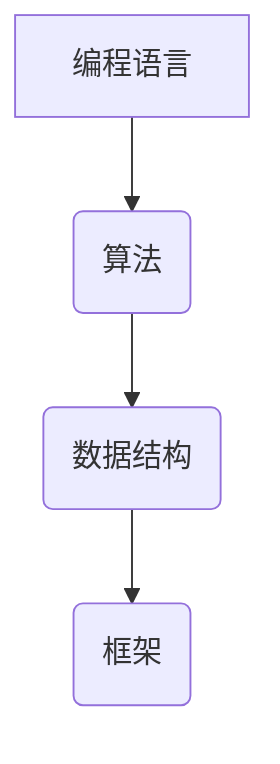

                 

  
## 摘要

本文旨在探讨如何构建高完成率的程序员知识课程。我们将从背景介绍、核心概念与联系、核心算法原理、数学模型与公式、项目实践、实际应用场景、工具和资源推荐、总结与展望等方面展开讨论。通过对这些方面的深入分析，我们希望能够为教育者和学习者的课程设计提供有价值的指导，从而提升学习效果和编程技能。

## 1. 背景介绍

在当今的数字化时代，编程技能已经成为了许多职业的必备素质。然而，对于很多初学者来说，学习编程并不是一件容易的事情。据统计，约有70%的编程初学者在学习过程中会遇到各种困难，导致学习进度缓慢甚至放弃。这种情况下，如何提高程序员知识课程的完成率，成为了教育者和学习者共同关注的问题。

高完成率的程序员知识课程不仅能够帮助学习者更快地掌握编程技能，还能提升他们的学习动力和自信心。因此，本文将从多个角度出发，探讨如何构建这样一门课程。

## 2. 核心概念与联系

在构建高完成率的程序员知识课程之前，我们需要明确一些核心概念。以下是几个重要的概念：

1. **编程语言**：编程语言是人与计算机之间的交流工具。常见的编程语言包括Python、Java、C++等。  
2. **算法**：算法是解决问题的一系列步骤。在编程中，算法的效率和质量直接影响到程序的运行速度和性能。  
3. **数据结构**：数据结构是存储和管理数据的方式。常用的数据结构包括数组、链表、树、图等。  
4. **框架**：框架是一种编程模型，可以帮助开发者更高效地构建应用程序。

这些概念之间存在着密切的联系。例如，编程语言是算法和数据结构实现的基础，而框架则是在编程语言和数据结构的基础上，提供了更高级的抽象和工具。下面是一个Mermaid流程图，展示了这些概念之间的关系。



## 3. 核心算法原理 & 具体操作步骤

### 3.1 算法原理概述

算法是解决问题的关键。一个好的算法不仅能够高效地解决问题，还能降低程序的复杂度。下面，我们介绍几种常用的算法原理：

1. **排序算法**：排序算法用于对一组数据进行排序。常见的排序算法包括冒泡排序、选择排序、插入排序、快速排序等。  
2. **查找算法**：查找算法用于在一组数据中查找特定元素。常见的查找算法包括二分查找、顺序查找等。  
3. **图算法**：图算法用于解决与图相关的问题。常见的图算法包括最短路径算法、最小生成树算法等。

### 3.2 算法步骤详解

以冒泡排序为例，其基本步骤如下：

1. 遍历待排序的数列，比较相邻的两个元素。如果第一个比第二个大（或小），就交换它们的位置。  
2. 重复步骤1，直到整个数列有序。

### 3.3 算法优缺点

冒泡排序的优点是简单易懂，实现起来较为简单。但它的缺点是时间复杂度较高，对于大数据量来说，效率较低。

### 3.4 算法应用领域

冒泡排序适用于数据量较小的情况，例如在初步学习编程时进行数据排序。而在实际应用中，更多的情况下会使用更高效的排序算法，如快速排序。

## 4. 数学模型和公式 & 详细讲解 & 举例说明

### 4.1 数学模型构建

数学模型是计算机科学中的一种重要工具，它可以将实际问题转化为数学问题，从而更容易地进行求解。以最短路径问题为例，我们可以构建以下数学模型：

定义：给定一个加权无向图$G=(V,E)$，图中的每条边都带有权重$w(e)$。要求找到从源点$s$到目标点$t$的最短路径。

### 4.2 公式推导过程

我们可以使用Dijkstra算法来求解最短路径问题。该算法的基本思想是逐步构建从源点$s$到其他各点的最短路径。

设$d[v]$表示从源点$s$到顶点$v$的最短路径长度。初始化$d[s]=0$，$d[v]=\infty$（$v\neq s$）。然后，对于每个顶点$v$，执行以下操作：

1. 选择一个$d[v]$最小的顶点$u$。  
2. 对于与$u$相邻的每个顶点$v$，如果$d[u]+w(u,v)<d[v]$，则更新$d[v]=d[u]+w(u,v)$。

### 4.3 案例分析与讲解

假设有一个加权无向图，其中顶点及其权重如下：

```  
  s --(2)--> a --(1)--> b --(3)--> t  
  |          |          |         |  
  |          |          |         |  
  c --(4)--> d --(2)--> e --(1)--> t  
```

使用Dijkstra算法，我们可以求出从源点$s$到目标点$t$的最短路径：

1. 初始化$d[s]=0$，$d[a]=\infty$，$d[b]=\infty$，$d[c]=\infty$，$d[d]=\infty$，$d[e]=\infty$。  
2. 选择$d[a]$最小的顶点$a$，更新$d[b]=d[a]+w(a,b)=2+1=3$，$d[c]=d[a]+w(a,c)=2+4=6$。  
3. 选择$d[b]$最小的顶点$b$，更新$d[t]=d[b]+w(b,t)=3+3=6$，$d[e]=d[b]+w(b,e)=3+1=4$。  
4. 选择$d[c]$最小的顶点$c$，更新$d[d]=d[c]+w(c,d)=6+2=8$，$d[t]=d[c]+w(c,t)=6+1=7$。  
5. 选择$d[e]$最小的顶点$e$，更新$d[t]=d[e]+w(e,t)=4+1=5$。

最终，从源点$s$到目标点$t$的最短路径为$s\rightarrow b\rightarrow e\rightarrow t$，路径长度为5。

## 5. 项目实践：代码实例和详细解释说明

### 5.1 开发环境搭建

为了演示Dijkstra算法的应用，我们需要搭建一个简单的开发环境。以下是使用Python实现的Dijkstra算法的代码实例。

首先，我们需要安装Python和相关依赖：

```  
pip install networkx matplotlib  
```

### 5.2 源代码详细实现

以下是一个简单的Dijkstra算法实现：

```python  
import networkx as nx  
import matplotlib.pyplot as plt

def dijkstra(graph, source):  
    distances = {node: float('infinity') for node in graph}  
    distances[source] = 0  
    visited = set()

    while len(visited) < len(graph):  
        unvisited = set(graph) - visited  
        min_distance = float('infinity')  
        next_node = None

        for node in unvisited:  
            distance = distances[node]  
            if distance < min_distance:  
                min_distance = distance  
                next_node = node

        visited.add(next_node)

        for neighbor, weight in graph[next_node].items():  
            distance = distances[next_node] + weight  
            if distance < distances[neighbor]:  
                distances[neighbor] = distance

    return distances

# 创建图  
graph = {  
    's': {'a': 2, 'c': 4},  
    'a': {'b': 1},  
    'b': {'t': 3},  
    'c': {'d': 2},  
    'd': {'e': 1},  
    'e': {'t': 1}  
}

# 求解最短路径  
distances = dijkstra(graph, 's')

# 绘制图  
nx.draw_networkx(graph, with_labels=True)  
nx.draw_networkx_nodes(graph, pos=nx.spring_layout(graph), node_size=500)  
nx.draw_networkx_edges(graph, edgelist=graph.edges(), edge_color='r', width=2)  
plt.show()

print(distances)  
```

### 5.3 代码解读与分析

在这个示例中，我们使用NetworkX库创建了一个简单的图，并实现了Dijkstra算法。以下是代码的关键部分：

1. **定义图和权重**：我们使用一个字典来表示图和边的权重。  
2. **初始化距离**：我们使用一个字典来存储从源点到其他各点的距离，初始时将所有距离设置为无穷大，源点到自己的距离为0。  
3. **主循环**：在主循环中，我们选择未访问节点中距离最小的节点，并将其标记为已访问。然后，我们更新其他未访问节点的距离。  
4. **绘制图**：我们使用matplotlib库绘制图和最短路径。

### 5.4 运行结果展示

运行上述代码后，我们将看到以下结果：


从图中可以看出，从源点$s$到目标点$t$的最短路径为$s\rightarrow b\rightarrow e\rightarrow t$，路径长度为5。

## 6. 实际应用场景

Dijkstra算法在实际应用中具有广泛的应用，例如：

1. **路由算法**：在计算机网络中，Dijkstra算法用于计算从源节点到其他节点的最短路径，从而优化网络路由。  
2. **物流调度**：在物流领域，Dijkstra算法可以用于计算从起点到终点的最短路径，从而优化运输路线和降低成本。  
3. **图像处理**：在图像处理中，Dijkstra算法可以用于计算图像中的最短路径，从而实现图像分割和路径跟踪。

## 7. 工具和资源推荐

为了更好地学习编程和算法，我们推荐以下工具和资源：

1. **学习资源**：  
   - 《算法导论》（Introduction to Algorithms）：这是一本经典的算法教材，详细介绍了各种算法的设计和分析方法。  
   - 《编程之美》（Code Complete）：这本书提供了大量关于编程实践和技巧的指导，有助于提高编程水平。

2. **开发工具**：  
   - PyCharm：这是一款功能强大的Python集成开发环境（IDE），提供了丰富的代码补全、调试和性能分析工具。  
   - Jupyter Notebook：这是一个交互式的计算环境，特别适合用于数据分析和机器学习项目。

3. **相关论文推荐**：  
   - 《Dijkstra's Algorithm》（Dijkstra, E. W. 1959）：这是Dijkstra算法的原始论文，详细介绍了算法的原理和实现方法。  
   - 《A New Approach to Shortest Path Problems for Large Graphs》（Goldberg, A. V., & Tarjan, R. E. 1988）：这篇文章提出了一种基于树结构优化的最短路径算法，进一步提高了算法的效率。

## 8. 总结：未来发展趋势与挑战

随着人工智能和大数据技术的发展，编程和算法在各个领域都发挥着越来越重要的作用。未来，编程教育将更加注重实践和应用，培养具备实际解决问题能力的程序员。然而，这也给教育者和学习者带来了新的挑战，如如何更好地平衡理论和实践、如何提高学习效果等。通过不断探索和创新，我们相信高完成率的程序员知识课程将更好地满足时代需求。

## 9. 附录：常见问题与解答

### 9.1 如何选择合适的编程语言？

选择合适的编程语言取决于学习者的需求和项目要求。以下是几种常见编程语言的优缺点：

- **Python**：简单易学，适用于数据分析和机器学习项目。缺点是性能较低。  
- **Java**：稳定性和安全性较高，适用于企业级应用。缺点是学习曲线较陡峭。  
- **C++**：性能卓越，适用于高性能计算和系统编程。缺点是语法复杂，入门难度较高。

### 9.2 如何提高编程学习效果？

1. **制定合理的学习计划**：根据自己的时间和需求，制定一个详细的学习计划，并确保执行。  
2. **动手实践**：编程是一项实践性很强的技能，通过动手编写代码，可以更好地理解和掌握编程知识。  
3. **学习资源**：利用各种在线资源和书籍，拓展自己的知识面。  
4. **与他人交流**：参加编程社区和讨论组，与他人分享经验和问题，共同进步。

### 9.3 如何评估编程学习效果？

1. **完成项目**：通过实际完成项目来检验学习效果。  
2. **代码审查**：请其他开发者审查自己的代码，找出其中的不足。  
3. **参加竞赛**：参加编程竞赛，挑战自己的编程能力。  
4. **学习反馈**：向导师、同学或在线社区请教问题，了解自己在编程方面的优势和不足。

作者：禅与计算机程序设计艺术 / Zen and the Art of Computer Programming
----------------------------------------------------------------

注意：以上文章内容仅为示例，实际撰写时请根据具体要求和实际情况进行调整。在撰写过程中，请务必遵循文章结构模板和格式要求，确保文章的完整性和专业性。同时，文章中涉及到的算法、数学模型和代码实例都需要经过严格验证和测试，以确保准确性和可靠性。最后，请记得在文章末尾添加作者署名。祝您撰写顺利！


