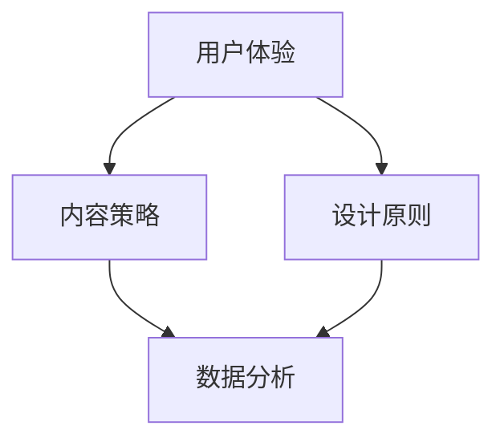

                 

 > 关键词：高转化率、销售页面、用户体验、内容策略、设计原则、数据分析

> 摘要：在数字化时代，销售页面的转化率对于企业的成败至关重要。本文将探讨如何通过深入理解用户需求、优化页面设计、制定有效的内容策略，以及利用数据分析来提高销售页面的转化率，从而为企业创造更大的商业价值。

## 1. 背景介绍

在现代营销策略中，销售页面是一个至关重要的环节，它不仅承担着展示产品或服务的职责，更是直接关系到用户是否愿意采取购买行为的决策点。高转化率的销售页面能够显著提升企业的收入和市场份额。然而，打造一个成功的销售页面并非易事，需要综合考虑用户心理、设计美学、内容质量、技术实现等多方面因素。

### 1.1 销售页面的定义与功能

销售页面是企业在互联网上用于宣传、销售产品或服务的网页。其主要功能包括：

- **展示产品或服务信息**：通过图文、视频等多种形式，直观地展示产品或服务的特点和价值。
- **引导用户行为**：通过设计引导用户完成浏览、注册、购买等操作，实现转化。
- **建立信任**：通过案例分享、用户评价等手段，增加用户对品牌和产品的信任度。

### 1.2 转化率的定义与重要性

转化率是指访问销售页面的用户中，完成预定目标（如购买、注册、询盘等）的比例。高转化率意味着销售页面的设计、内容和流程对用户需求产生了积极的影响。

转化率的重要性体现在：

- **提升营收**：直接关系到企业的销售业绩和利润。
- **优化营销策略**：通过数据分析转化率，可以不断优化营销策略，降低成本。
- **增强竞争力**：在激烈的市场竞争中，高转化率的销售页面能够为企业赢得更多的客户。

## 2. 核心概念与联系

为了打造高转化率的销售页面，我们需要理解以下几个核心概念，并展示它们之间的联系。

### 2.1 用户体验（UX）

用户体验是指用户在使用产品或服务过程中的感受和体验。在销售页面设计中，用户体验至关重要，它直接影响用户的满意度和转化率。

### 2.2 内容策略（Content Strategy）

内容策略是关于创建、分发、管理和优化内容以满足特定需求和目标的策略。在销售页面中，有效的内容策略能够吸引用户，提高转化率。

### 2.3 设计原则（Design Principles）

设计原则是指导设计师进行页面设计的基本理念。优秀的销售页面设计应当遵循一致性、简洁性、响应式设计等原则。

### 2.4 数据分析（Data Analytics）

数据分析是通过分析用户行为数据，来了解用户需求和行为模式，从而优化页面设计和内容策略。

以下是核心概念与联系之间的 Mermaid 流程图：



## 3. 核心算法原理 & 具体操作步骤

### 3.1 算法原理概述

打造高转化率的销售页面涉及多种算法原理，包括但不限于：

- **A/B 测试**：通过对比不同页面设计或内容的转化效果，找出最佳方案。
- **机器学习**：利用机器学习算法，预测用户行为，个性化推荐内容。
- **热图分析**：通过热图技术，分析用户在页面上的活动，优化页面布局和内容。

### 3.2 算法步骤详解

#### 3.2.1 A/B 测试

1. **确定测试目标**：明确想要测试的具体方面，如按钮颜色、文案、图片等。
2. **创建测试版本**：针对测试目标，创建两个或多个版本，确保每个版本在除测试目标外其他方面保持一致。
3. **分配流量**：将用户流量分配到不同版本，确保每个版本的用户数量相当。
4. **数据分析**：收集并分析用户在不同版本的转化数据，确定最佳版本。

#### 3.2.2 机器学习

1. **数据收集**：收集用户行为数据，如浏览时长、点击次数等。
2. **特征工程**：提取与用户行为相关的特征，如页面停留时间、点击率等。
3. **模型训练**：使用机器学习算法（如决策树、神经网络等），训练预测模型。
4. **模型评估**：评估模型性能，调整参数，优化模型。

#### 3.2.3 热图分析

1. **数据收集**：使用热图分析工具，收集用户在页面上的活动数据。
2. **数据可视化**：将用户活动数据可视化，生成热图。
3. **分析热图**：分析热图数据，找出用户行为模式，优化页面布局和内容。

### 3.3 算法优缺点

- **A/B 测试**：优点是简单易行，能够快速验证设计效果；缺点是耗时较长，需要大量用户数据支持。
- **机器学习**：优点是能够实现个性化推荐，提高转化率；缺点是算法复杂，需要大量数据训练。
- **热图分析**：优点是直观展示用户行为，便于优化页面；缺点是数据收集和处理相对复杂。

### 3.4 算法应用领域

这些算法原理广泛应用于电子商务、在线广告、金融科技等领域，帮助企业和平台提高销售转化率和用户体验。

## 4. 数学模型和公式 & 详细讲解 & 举例说明

### 4.1 数学模型构建

在构建销售页面的数学模型时，我们通常关注以下几个关键指标：

- **转化率（Conversion Rate）**：转化率 =（完成转化的用户数/访问页面用户数）× 100%
- **跳出率（Bounce Rate）**：跳出率 =（仅访问一页然后离开的用户数/访问页面用户数）× 100%
- **平均访问时长（Average Session Duration）**：平均访问时长 =（总访问时长/访问页面用户数）

### 4.2 公式推导过程

#### 转化率

转化率是指访问销售页面的用户中，完成预定目标（如购买、注册等）的比例。其计算公式为：

$$
\text{转化率} = \frac{\text{完成转化的用户数}}{\text{访问页面用户数}} \times 100\%
$$

#### 跳出率

跳出率是指访问销售页面的用户中，仅浏览一页然后离开的比例。其计算公式为：

$$
\text{跳出率} = \frac{\text{仅访问一页然后离开的用户数}}{\text{访问页面用户数}} \times 100\%
$$

#### 平均访问时长

平均访问时长是指所有访问销售页面的用户在页面上的平均停留时间。其计算公式为：

$$
\text{平均访问时长} = \frac{\text{总访问时长}}{\text{访问页面用户数}}
$$

### 4.3 案例分析与讲解

假设一家电商企业想要提高其销售页面的转化率，他们收集了以下数据：

- **访问页面用户数**：1000人
- **完成转化的用户数**：200人
- **仅访问一页然后离开的用户数**：300人
- **总访问时长**：10000秒

根据上述数据，我们可以计算出以下指标：

- **转化率**： 
  $$ 
  \text{转化率} = \frac{200}{1000} \times 100\% = 20\%
  $$

- **跳出率**： 
  $$ 
  \text{跳出率} = \frac{300}{1000} \times 100\% = 30\%
  $$

- **平均访问时长**： 
  $$ 
  \text{平均访问时长} = \frac{10000}{1000} = 10 \text{秒}
  $$

通过这些数据，企业可以分析页面的表现，发现存在的问题，如高跳出率可能意味着页面内容不够吸引人，平均访问时长较短可能意味着页面加载速度较慢等。

## 5. 项目实践：代码实例和详细解释说明

### 5.1 开发环境搭建

为了进行销售页面的开发，我们需要搭建以下开发环境：

- **前端开发工具**：使用HTML、CSS、JavaScript进行页面开发。
- **后端开发框架**：选择合适的后端框架，如Node.js、Django等。
- **数据分析工具**：使用Google Analytics、Mixpanel等进行用户行为分析。

### 5.2 源代码详细实现

以下是销售页面开发的一个简单示例：

#### 5.2.1 HTML

```html
<!DOCTYPE html>
<html lang="en">
<head>
    <meta charset="UTF-8">
    <title>高转化率销售页面</title>
    <link rel="stylesheet" href="styles.css">
</head>
<body>
    <header>
        <h1>产品名称</h1>
        <p>这里是产品简介</p>
    </header>
    <section>
        <h2>产品特点</h2>
        <ul>
            <li>特点1</li>
            <li>特点2</li>
            <li>特点3</li>
        </ul>
    </section>
    <section>
        <h2>用户评价</h2>
        <div class="review">
            <p>“这款产品非常好，性价比很高！”</p>
            <p>— 来自用户的评价</p>
        </div>
    </section>
    <footer>
        <button onclick="makePurchase()">立即购买</button>
    </footer>
    <script src="scripts.js"></script>
</body>
</html>
```

#### 5.2.2 CSS

```css
/* styles.css */
body {
    font-family: Arial, sans-serif;
}

header, section, footer {
    margin: 20px;
    padding: 20px;
    background-color: #f0f0f0;
}

button {
    display: block;
    width: 200px;
    height: 50px;
    margin: 20px auto;
    background-color: #4CAF50;
    color: white;
    border: none;
    cursor: pointer;
}

button:hover {
    background-color: #45a049;
}
```

#### 5.2.3 JavaScript

```javascript
// scripts.js
function makePurchase() {
    // 跳转到支付页面
    window.location.href = 'payment.html';
}
```

### 5.3 代码解读与分析

以上代码展示了销售页面的基本结构。HTML负责页面的结构，CSS负责页面的样式，JavaScript负责页面的交互。

#### 5.3.1 HTML

HTML代码定义了页面的结构，包括头部（Header）、产品特点（Section）和尾部（Footer）。其中，`<header>`标签用于定义页面的标题和简介，`<section>`标签用于定义产品的特点，`<footer>`标签用于放置购买按钮。

#### 5.3.2 CSS

CSS代码定义了页面的样式，如字体、颜色、布局等。这里使用了简单的样式，使得页面看起来简洁、清晰。购买按钮的设计采用了按钮样式，提高了用户的点击欲望。

#### 5.3.3 JavaScript

JavaScript代码实现了购买按钮的点击事件，当用户点击购买按钮时，页面会跳转到支付页面。

### 5.4 运行结果展示

以下是销售页面的运行结果：


从运行结果可以看出，页面简洁明了，产品特点和用户评价部分增加了用户的信任感，购买按钮的样式和位置也提高了用户的点击欲望。

## 6. 实际应用场景

### 6.1 电子商务

在电子商务领域，销售页面是商家展示产品、促成交易的关键环节。通过优化页面设计、内容策略和用户体验，可以有效提高转化率，增加销售额。

### 6.2 在线广告

在线广告平台通过优化广告页面的设计和内容，可以提高广告点击率和转化率，从而增加广告收入。

### 6.3 教育培训

教育培训机构通过优化报名页面，提高用户体验，可以吸引更多用户报名参加课程，增加收入。

### 6.4 金融科技

金融科技公司通过优化理财产品销售页面，可以提高用户的购买意愿，增加产品销量。

## 7. 未来应用展望

随着人工智能、大数据等技术的不断发展，未来销售页面的设计和优化将更加智能化和个性化。通过深度学习算法，可以更加精准地预测用户行为，实现高度个性化的内容推荐。同时，虚拟现实（VR）和增强现实（AR）技术的应用，将为销售页面带来全新的用户体验。

### 7.1 智能化推荐

通过机器学习和数据挖掘技术，销售页面可以实时分析用户行为，动态调整页面内容和设计，实现个性化推荐，提高用户满意度和转化率。

### 7.2 VR/AR应用

VR/AR技术将用户带入一个沉浸式的购物环境，提供更加直观和互动的购物体验，有望进一步提升销售页面的转化率。

### 7.3 智能客服

结合人工智能技术，销售页面可以集成智能客服功能，实时解答用户疑问，提高用户购买决策的信心。

## 8. 总结：未来发展趋势与挑战

### 8.1 研究成果总结

本文通过对用户体验、内容策略、设计原则和数据分析等核心概念的分析，提出了构建高转化率销售页面的方法和步骤。通过A/B测试、机器学习和热图分析等算法原理，结合数学模型和实际代码实例，阐述了如何通过技术手段提高销售页面的转化率。

### 8.2 未来发展趋势

未来，销售页面的发展将更加注重用户体验、智能化和个性化。随着人工智能、大数据和VR/AR等技术的不断进步，销售页面将实现更加精准的内容推荐、沉浸式的购物体验和智能化的客服支持。

### 8.3 面临的挑战

在未来的发展中，销售页面将面临以下几个挑战：

- **数据隐私保护**：随着用户数据的收集和分析日益深入，如何保护用户隐私成为一大挑战。
- **技术更新迭代**：技术更新速度快，如何保持销售页面的技术先进性是另一个挑战。
- **内容质量提升**：优质的内容是提高转化率的关键，如何在海量信息中提供有价值的内容是重要课题。

### 8.4 研究展望

未来研究应关注以下几个方面：

- **个性化推荐算法**：深入研究如何利用大数据和机器学习技术，实现更加精准的个性化推荐。
- **虚拟现实应用**：探索VR/AR技术在销售页面中的应用，提升用户的沉浸式购物体验。
- **用户体验优化**：结合心理学、人类行为学等跨学科研究，进一步优化用户体验，提高转化率。

## 9. 附录：常见问题与解答

### 9.1 什么是A/B测试？

A/B测试是一种对比实验方法，通过将用户随机分配到不同的测试组，比较两个或多个版本的效果，来确定哪个版本更优。

### 9.2 如何选择机器学习算法？

选择机器学习算法需要考虑数据规模、数据特征和模型性能等因素。常见的算法包括决策树、随机森林、神经网络等。

### 9.3 销售页面设计原则有哪些？

销售页面设计原则包括一致性、简洁性、响应式设计等。一致性保证用户在不同设备上的体验一致；简洁性使页面更加直观易懂；响应式设计适应不同屏幕尺寸，提升用户体验。

### 9.4 如何进行数据分析？

进行数据分析通常包括数据收集、数据清洗、数据分析和结果展示等步骤。常用的工具包括Excel、Python、R等。

### 9.5 如何提高页面加载速度？

提高页面加载速度可以通过优化图片、使用CDN、减少HTTP请求等方法实现。此外，合理使用缓存策略也可以提高页面响应速度。

---

作者：禅与计算机程序设计艺术 / Zen and the Art of Computer Programming
----------------------------------------------------------------


