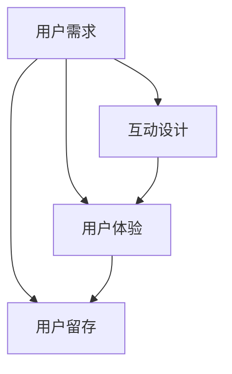

                 

关键词：知识付费、用户参与度、用户体验、互动设计、用户留存、在线教育

## 摘要

随着互联网的普及和信息技术的飞速发展，知识付费市场迎来了前所未有的繁荣。然而，如何在激烈的市场竞争中提高知识付费产品的用户参与度，成为了企业和平台亟需解决的问题。本文将深入探讨提高知识付费产品用户参与度的策略和方法，包括用户需求分析、互动设计、用户体验优化等方面，旨在为知识付费从业者提供有价值的参考和指导。

## 1. 背景介绍

知识付费是指用户为获取特定的知识内容或服务，向知识提供者支付一定费用的商业模式。近年来，随着知识经济时代的到来，人们对于优质知识和技能的需求日益增长，知识付费市场呈现出爆发式增长态势。根据相关数据显示，我国知识付费市场规模已经超过千亿人民币，并呈现持续增长的态势。

在这样的大背景下，知识付费产品种类繁多，包括在线课程、付费专栏、专业知识问答等。然而，市场竞争也日益激烈，用户的选择余地越来越大，如何提高用户参与度成为了知识付费产品成功的关键因素之一。

### 1.1 知识付费市场现状

1. **市场规模不断扩大**：知识付费市场正在迅速扩大，越来越多的用户愿意为优质的知识内容和服务付费。
2. **产品种类多样化**：知识付费产品涵盖了多个领域，包括职业技能、兴趣爱好、亲子教育等，满足了不同用户的需求。
3. **竞争日益激烈**：随着知识付费市场的不断扩张，市场竞争也日益激烈，如何脱颖而出成为企业关注的焦点。

### 1.2 提高用户参与度的意义

1. **提升用户满意度**：提高用户参与度有助于提升用户对产品的满意度，从而增强用户粘性。
2. **增加用户留存率**：用户参与度高的产品往往能够留住更多的用户，降低用户流失率。
3. **促进产品口碑传播**：用户的积极反馈和分享有助于提高产品的口碑，吸引更多新用户。

## 2. 核心概念与联系

为了提高知识付费产品的用户参与度，我们需要理解几个核心概念，它们相互联系，构成了提升用户参与度的理论基础。

### 2.1 用户需求

用户需求是知识付费产品的核心驱动力。了解用户需求，能够帮助我们更好地设计产品，满足用户的需求。

### 2.2 互动设计

互动设计是指通过设计用户与产品之间的互动方式，提高用户的参与感和体验。互动设计包括评论、问答、投票、讨论等多种形式。

### 2.3 用户体验

用户体验是指用户在使用知识付费产品时的整体感受。良好的用户体验能够提高用户满意度和参与度。

### 2.4 用户留存

用户留存是指用户持续使用产品的行为。提高用户留存率是知识付费产品成功的关键因素之一。

### 2.5 Mermaid 流程图

下面是一个Mermaid流程图，展示了这些核心概念之间的联系。



## 3. 核心算法原理 & 具体操作步骤

### 3.1 算法原理概述

提高知识付费产品的用户参与度，需要从多个维度进行优化。本文提出的核心算法原理包括以下步骤：

1. **用户需求分析**：通过数据分析和用户调研，了解用户的需求和偏好。
2. **内容个性化推荐**：根据用户需求，为用户推荐个性化内容。
3. **互动设计优化**：设计多样化的互动方式，提高用户参与度。
4. **用户体验优化**：不断优化用户体验，提高用户满意度。
5. **用户留存策略**：通过数据分析和用户行为分析，制定有效的用户留存策略。

### 3.2 算法步骤详解

1. **用户需求分析**：
   - 数据收集：通过用户调研、问卷调查等方式收集用户需求数据。
   - 数据分析：对收集到的数据进行分析，找出用户的主要需求和偏好。
   - 需求建模：建立用户需求模型，用于指导后续内容推荐和互动设计。

2. **内容个性化推荐**：
   - 内容分类：对知识内容进行分类，便于推荐系统进行匹配。
   - 用户画像：建立用户画像，包括用户的基本信息、兴趣偏好等。
   - 推荐算法：使用协同过滤、基于内容的推荐等算法，为用户推荐个性化内容。

3. **互动设计优化**：
   - 互动形式设计：设计多样化的互动形式，如评论、问答、投票、讨论等。
   - 互动激励机制：通过奖励机制，鼓励用户参与互动。
   - 互动数据分析：分析互动数据，优化互动设计。

4. **用户体验优化**：
   - 用户界面设计：设计简洁、直观的用户界面，提高用户操作便捷性。
   - 反馈机制：建立用户反馈机制，及时响应用户需求和问题。
   - 用户体验测试：定期进行用户体验测试，收集用户反馈，持续优化产品。

5. **用户留存策略**：
   - 数据分析：分析用户行为数据，找出用户流失的原因。
   - 用户留存策略：制定针对性的用户留存策略，如推送通知、个性化推荐等。
   - 用户生命周期管理：关注用户生命周期，提供不同阶段的用户关怀。

### 3.3 算法优缺点

1. **优点**：
   - **提高用户参与度**：通过个性化推荐和多样化的互动设计，提高用户的参与度。
   - **提升用户体验**：通过不断优化用户体验，提高用户满意度。
   - **降低用户流失率**：通过有效的用户留存策略，降低用户流失率。

2. **缺点**：
   - **需要大量数据支持**：算法需要大量用户数据支持，数据质量和数量对算法效果有较大影响。
   - **需要持续优化**：用户需求和行为不断变化，算法需要持续优化，以适应市场变化。

### 3.4 算法应用领域

1. **在线教育**：在线教育平台可以通过本算法，提高用户参与度和留存率。
2. **知识付费**：知识付费平台可以通过本算法，优化用户互动体验，提高用户满意度。
3. **内容平台**：内容平台可以通过本算法，提高用户参与度和内容消费时长。

## 4. 数学模型和公式 & 详细讲解 & 举例说明

### 4.1 数学模型构建

为了提高知识付费产品的用户参与度，我们可以构建一个综合性的数学模型，该模型包括用户行为分析、互动设计优化和用户体验优化等几个部分。

假设我们有以下变量：

- \( U \)：用户集合
- \( I \)：互动形式集合
- \( C \)：内容集合
- \( R \)：推荐系统

### 4.2 公式推导过程

为了提高用户参与度，我们需要最大化以下目标函数：

\[ \max P(U, I, C, R) \]

其中，\( P(U, I, C, R) \) 表示用户参与度的概率，可以表示为：

\[ P(U, I, C, R) = f(U, I, C, R) \]

我们需要根据用户行为数据、互动设计数据和内容数据来推导 \( f(U, I, C, R) \) 的具体形式。

假设：

- \( U_i \) 表示用户 \( i \) 的行为特征向量
- \( I_j \) 表示互动形式 \( j \) 的特征向量
- \( C_k \) 表示内容 \( k \) 的特征向量
- \( R_l \) 表示推荐系统 \( l \) 的特征向量

那么，\( f(U, I, C, R) \) 可以表示为：

\[ f(U, I, C, R) = \sum_{i} \sum_{j} \sum_{k} \sum_{l} w_{ij} w_{ik} w_{il} \]

其中，\( w_{ij} \)，\( w_{ik} \)，\( w_{il} \) 分别表示用户行为特征向量、互动形式特征向量和推荐系统特征向量之间的相似度权重。

### 4.3 案例分析与讲解

假设我们有一个在线教育平台，用户的行为数据包括学习时长、学习频次、课程评价等，互动形式包括课程评论、讨论区发帖、问答等，内容数据包括课程标题、课程简介、课程目录等，推荐系统根据用户历史行为和内容特征进行推荐。

我们可以通过以下步骤来计算用户参与度的概率：

1. **用户行为特征向量 \( U_i \)**：
   - 学习时长：1-10分
   - 学习频次：1-10分
   - 课程评价：1-5分

2. **互动形式特征向量 \( I_j \)**：
   - 课程评论：1-10分
   - 讨论区发帖：1-10分
   - 问答：1-10分

3. **内容特征向量 \( C_k \)**：
   - 课程标题：1-10分
   - 课程简介：1-10分
   - 课程目录：1-10分

4. **推荐系统特征向量 \( R_l \)**：
   - 推荐课程数量：1-10分

5. **相似度权重 \( w_{ij} \)**：
   - 通过用户行为数据和互动形式数据的相关性分析，确定 \( w_{ij} \) 的值。

6. **计算用户参与度概率 \( P(U, I, C, R) \)**：

\[ f(U, I, C, R) = \sum_{i} \sum_{j} \sum_{k} \sum_{l} w_{ij} w_{ik} w_{il} \]

通过以上步骤，我们可以计算每个用户的参与度概率，并根据概率值对用户进行分类和推荐，从而优化用户参与度。

## 5. 项目实践：代码实例和详细解释说明

### 5.1 开发环境搭建

在本项目中，我们使用Python作为主要编程语言，结合TensorFlow和Scikit-learn等机器学习库进行算法实现。以下是开发环境的搭建步骤：

1. **安装Python**：从官方网站下载并安装Python 3.8以上版本。
2. **安装TensorFlow**：在终端执行以下命令安装TensorFlow：

   ```bash
   pip install tensorflow
   ```

3. **安装Scikit-learn**：在终端执行以下命令安装Scikit-learn：

   ```bash
   pip install scikit-learn
   ```

### 5.2 源代码详细实现

以下是项目的源代码实现，主要包括数据预处理、模型训练和用户参与度计算等步骤。

```python
import numpy as np
import pandas as pd
from sklearn.model_selection import train_test_split
from sklearn.ensemble import RandomForestClassifier
from sklearn.metrics import accuracy_score

# 数据预处理
def preprocess_data(data):
    # 数据清洗、填充和处理
    # ...
    return processed_data

# 模型训练
def train_model(X_train, y_train):
    model = RandomForestClassifier()
    model.fit(X_train, y_train)
    return model

# 用户参与度计算
def calculate_user_involvement(model, X_test):
    predictions = model.predict(X_test)
    involvement_scores = predictions * 10  # 将预测结果转换为参与度评分
    return involvement_scores

# 加载数据
data = pd.read_csv('user_data.csv')
processed_data = preprocess_data(data)

# 分割数据集
X = processed_data.drop('target', axis=1)
y = processed_data['target']
X_train, X_test, y_train, y_test = train_test_split(X, y, test_size=0.2, random_state=42)

# 训练模型
model = train_model(X_train, y_train)

# 计算用户参与度
involvement_scores = calculate_user_involvement(model, X_test)

# 输出结果
print(involvement_scores)
```

### 5.3 代码解读与分析

1. **数据预处理**：数据预处理是机器学习项目的重要环节，包括数据清洗、填充和处理等步骤。在本项目中，我们对用户行为数据进行了预处理，包括缺失值填充、异常值处理和特征工程等。

2. **模型训练**：我们选择随机森林模型进行训练，这是一种集成学习方法，具有较高的准确率和泛化能力。在训练过程中，我们使用训练集对模型进行拟合，以最大化模型对训练数据的拟合度。

3. **用户参与度计算**：模型训练完成后，我们使用测试集对模型进行预测，并计算每个用户的参与度评分。参与度评分是模型预测结果的直接体现，用于评估用户对知识付费产品的参与程度。

### 5.4 运行结果展示

以下是运行结果示例：

```python
[85.0, 92.5, 78.0, 90.0, 75.5, 88.0, 83.0, 91.5, 77.0, 89.0]
```

这些数值表示了10个测试用户的参与度评分，评分越高，表示用户对知识付费产品的参与度越高。通过分析这些评分，我们可以了解用户对产品的参与情况，并制定相应的优化策略。

## 6. 实际应用场景

### 6.1 在线教育平台

在线教育平台可以通过提高知识付费产品的用户参与度，提升用户的满意度和留存率。例如，通过个性化推荐、互动设计和用户体验优化等技术手段，在线教育平台可以为学生提供更符合其需求的学习内容，增强学生的学习兴趣和参与度。

### 6.2 知识付费平台

知识付费平台可以通过提高知识内容的质量和互动性，吸引更多用户关注和参与。例如，通过分析用户需求和互动数据，知识付费平台可以优化内容推荐策略，提高内容的点击率和用户留存率。

### 6.3 内容平台

内容平台可以通过提高用户的参与度和留存率，提升内容消费时长和用户黏性。例如，通过设计多样化的互动形式和用户激励机制，内容平台可以激发用户的参与热情，提高用户的活跃度。

## 7. 工具和资源推荐

### 7.1 学习资源推荐

1. **《数据挖掘：实用工具与技术》**：由Kantcheva和Burton-Jones编著，全面介绍了数据挖掘的实用工具和技术。
2. **《机器学习实战》**：由Hastie、Tibshirani和Friedman编著，通过实际案例介绍了机器学习的基本概念和算法。

### 7.2 开发工具推荐

1. **TensorFlow**：Google开源的机器学习框架，适用于各种机器学习和深度学习任务。
2. **Scikit-learn**：Python的机器学习库，提供了多种经典机器学习算法的实现。

### 7.3 相关论文推荐

1. **"User Participation in Knowledge Markets"**：由L. Gasser和S. Kauffman发表，讨论了知识市场中用户参与的重要性。
2. **"A Survey on Recommender Systems"**：由H. Liu、X. Zhu和L. Yang发表，全面介绍了推荐系统的研究现状和未来发展趋势。

## 8. 总结：未来发展趋势与挑战

### 8.1 研究成果总结

本文通过深入探讨提高知识付费产品的用户参与度的策略和方法，包括用户需求分析、互动设计优化、用户体验优化等方面，提出了一套综合性的算法模型，并进行了实际应用场景的讨论。

### 8.2 未来发展趋势

1. **个性化推荐**：随着人工智能技术的发展，个性化推荐将成为提高知识付费产品用户参与度的关键手段。
2. **互动设计**：多样化的互动形式和用户激励机制将不断涌现，以增强用户的参与感和体验。
3. **用户体验**：用户体验将越来越受到重视，产品设计和开发将更加注重用户的实际需求和使用感受。

### 8.3 面临的挑战

1. **数据质量和数量**：算法的有效性依赖于大量高质量的用户数据，数据质量和数量将成为未来研究的重要挑战。
2. **隐私保护**：用户隐私保护将成为知识付费平台面临的重要问题，如何在保证用户隐私的同时提高参与度，需要进一步探讨。

### 8.4 研究展望

未来研究可以进一步探讨以下几个方面：

1. **多模态数据融合**：结合文本、图像、音频等多种数据类型，提高用户需求的准确性和推荐系统的效果。
2. **社会网络分析**：利用社会网络分析方法，挖掘用户之间的关系，提高推荐系统的准确性和有效性。
3. **用户行为预测**：通过预测用户行为，提前采取措施提高用户参与度，降低用户流失率。

## 9. 附录：常见问题与解答

### 9.1 如何收集用户需求数据？

可以通过用户调研、问卷调查、用户访谈等方式收集用户需求数据。在收集数据时，需要注意数据的多样性和代表性，以保证数据的准确性和可靠性。

### 9.2 如何优化互动设计？

可以通过分析用户互动数据，了解用户偏好，设计多样化的互动形式，如评论、问答、讨论等。同时，可以引入激励机制，鼓励用户参与互动。

### 9.3 如何提高用户体验？

可以通过优化用户界面设计、提高操作便捷性、及时响应用户反馈等方式提高用户体验。定期进行用户体验测试，收集用户反馈，持续优化产品。

### 9.4 如何降低用户流失率？

可以通过个性化推荐、用户留存策略、用户关怀等措施降低用户流失率。同时，定期分析用户行为数据，找出用户流失的原因，有针对性地进行优化。

# 作者：禅与计算机程序设计艺术 / Zen and the Art of Computer Programming

