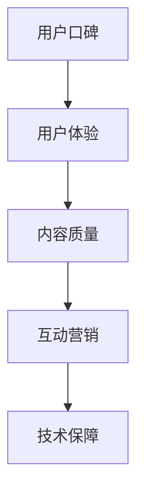

                 

 关键词：知识付费、用户口碑、产品优化、用户体验、策略分析

> 摘要：本文旨在探讨如何通过系统性的策略分析和技术手段，提高知识付费产品的用户口碑。我们将从市场调研、用户体验设计、内容质量控制、互动营销、技术保障等多个维度，提供一系列实用的方法和建议，帮助知识付费从业者提升产品的用户满意度和市场竞争力。

## 1. 背景介绍

知识付费市场近年来呈现出快速增长的趋势。随着信息爆炸和知识经济的兴起，用户对高质量、专业化的知识需求日益增加，推动了知识付费产品的多样化。然而，市场繁荣背后也伴随着激烈的竞争。在众多知识付费产品中，如何脱颖而出，赢得用户的口碑和信任，成为从业者亟需解决的问题。

用户口碑是衡量知识付费产品质量和影响力的重要指标。积极的用户口碑不仅能增加现有用户的粘性，还能通过口碑传播吸引新用户，提升产品的市场占有率和品牌价值。因此，深入研究如何提高用户口碑，对知识付费产品的发展至关重要。

## 2. 核心概念与联系

在讨论如何提高知识付费产品的用户口碑之前，我们需要明确几个核心概念：

### 2.1 用户口碑

用户口碑是指用户对产品或服务的满意度和信任度，通过社交媒体、评价平台、论坛等渠道传播。口碑管理是企业品牌建设的重要组成部分。

### 2.2 用户体验

用户体验（UX）是指用户在使用产品过程中所获得的整体感受。一个优质的知识付费产品需要从用户需求出发，提供无缝、愉悦的使用体验。

### 2.3 内容质量

内容质量是知识付费产品的核心价值所在。高质量的内容能够满足用户的求知需求，提升用户的学习效果和满意度。

### 2.4 互动营销

互动营销是通过与用户的互动来提高用户参与度和忠诚度的一种营销策略。在知识付费产品中，互动营销有助于建立与用户的紧密联系。

### 2.5 技术保障

技术保障是指通过技术手段确保知识付费产品的稳定性和安全性。技术保障能够提高用户的使用信心和满意度。

为了更好地理解这些概念之间的联系，我们可以使用Mermaid流程图来展示它们之间的关系：



## 3. 核心算法原理 & 具体操作步骤

### 3.1 算法原理概述

提高知识付费产品的用户口碑，可以视为一个多因素优化的过程。以下是几个核心算法原理的概述：

### 3.1.1 用户体验优化算法

用户体验优化算法旨在提升用户在使用知识付费产品过程中的满意度。关键步骤包括：

1. **需求分析**：通过用户调研和数据分析，了解用户的需求和痛点。
2. **交互设计**：设计直观、易用的用户界面，简化操作流程。
3. **反馈机制**：建立用户反馈渠道，及时收集用户意见和建议。

### 3.1.2 内容质量控制算法

内容质量控制算法旨在确保知识付费产品的内容质量。关键步骤包括：

1. **内容审核**：对内容进行严格的审核，确保信息的准确性和专业性。
2. **用户评价**：利用用户评价机制，筛选高质量内容。
3. **内容更新**：定期更新内容，保持知识的时效性和前瞻性。

### 3.1.3 互动营销算法

互动营销算法旨在提高用户参与度和忠诚度。关键步骤包括：

1. **社群运营**：建立用户社群，促进用户之间的互动和交流。
2. **个性化推荐**：根据用户行为数据，提供个性化的学习内容和推荐。
3. **互动活动**：举办线上活动，增加用户参与度和粘性。

### 3.1.4 技术保障算法

技术保障算法旨在确保知识付费产品的稳定性和安全性。关键步骤包括：

1. **系统监控**：实时监控系统运行状态，确保系统的稳定性和安全性。
2. **数据备份**：定期进行数据备份，防止数据丢失。
3. **安全防护**：采取安全措施，防止黑客攻击和数据泄露。

### 3.2 算法步骤详解

以下是具体的算法步骤：

### 3.2.1 用户体验优化算法

1. **需求分析**：
    - 开展用户调研，收集用户反馈。
    - 利用数据分析工具，分析用户行为数据。

2. **交互设计**：
    - 设计用户友好的界面，提高操作便捷性。
    - 简化用户注册和登录流程。

3. **反馈机制**：
    - 设立用户反馈渠道，如在线客服、用户论坛。
    - 定期收集用户反馈，及时处理问题。

### 3.2.2 内容质量控制算法

1. **内容审核**：
    - 建立内容审核团队，对内容进行严格审核。
    - 设立内容审核标准和流程。

2. **用户评价**：
    - 提供用户评价功能，让用户对内容进行评分和评论。
    - 利用算法分析用户评价，筛选高质量内容。

3. **内容更新**：
    - 定期更新内容，确保知识的时效性。
    - 增加原创内容的比例。

### 3.2.3 互动营销算法

1. **社群运营**：
    - 建立用户社群，如微信群、QQ群等。
    - 组织社群活动，促进用户互动。

2. **个性化推荐**：
    - 利用算法分析用户行为数据，提供个性化推荐。
    - 根据用户兴趣和行为，推荐相关内容和活动。

3. **互动活动**：
    - 举办线上讲座、问答活动等，增加用户参与度。
    - 设立积分奖励机制，激励用户参与互动。

### 3.2.4 技术保障算法

1. **系统监控**：
    - 实时监控服务器负载、网络状况等指标。
    - 及时发现并处理系统异常。

2. **数据备份**：
    - 定期进行数据备份，确保数据安全。
    - 选择可靠的数据备份服务商。

3. **安全防护**：
    - 采用安全加密技术，保护用户数据和隐私。
    - 定期进行安全漏洞扫描和修复。

### 3.3 算法优缺点

#### 3.3.1 用户体验优化算法

**优点**：

- 提高用户满意度，增强用户粘性。
- 降低用户流失率。

**缺点**：

- 需要大量资源和时间进行需求分析和反馈处理。
- 可能会增加开发成本。

#### 3.3.2 内容质量控制算法

**优点**：

- 提高内容质量，增加用户信任度。
- 提升品牌形象。

**缺点**：

- 内容审核过程可能影响内容的时效性。
- 需要专业的审核团队。

#### 3.3.3 互动营销算法

**优点**：

- 提高用户参与度，增加用户粘性。
- 促进用户社群的活跃度。

**缺点**：

- 可能会导致用户疲劳。
- 需要大量的资源和时间进行社群管理和活动策划。

#### 3.3.4 技术保障算法

**优点**：

- 确保系统的稳定性和安全性。
- 提高用户的使用信心。

**缺点**：

- 技术投入较大。
- 可能会降低系统的灵活性。

### 3.4 算法应用领域

#### 3.4.1 用户体验优化算法

- 知识付费平台
- 在线教育平台
- 企业培训系统

#### 3.4.2 内容质量控制算法

- 知识付费平台
- 在线教育平台
- 专业媒体网站

#### 3.4.3 互动营销算法

- 知识付费平台
- 社交媒体
- 企业营销活动

#### 3.4.4 技术保障算法

- 知识付费平台
- 在线教育平台
- 企业信息系统

## 4. 数学模型和公式 & 详细讲解 & 举例说明

### 4.1 数学模型构建

为了更深入地理解如何提高知识付费产品的用户口碑，我们可以构建一个综合性的数学模型。该模型包括以下几个主要变量：

- **用户满意度（S）**：衡量用户对产品的满意度。
- **内容质量（Q）**：衡量知识付费产品内容的优质程度。
- **用户体验（U）**：衡量用户在使用产品过程中的体验。
- **互动频率（I）**：衡量用户与产品互动的频率。
- **技术保障（T）**：衡量产品的技术保障水平。

模型的基本假设是：用户口碑（W）是这四个变量的函数，即：

\[ W = f(S, Q, U, I, T) \]

### 4.2 公式推导过程

根据以上变量，我们可以推导出以下公式：

\[ W = \alpha S + \beta Q + \gamma U + \delta I + \epsilon T \]

其中，α、β、γ、δ、ε分别是满意度、内容质量、用户体验、互动频率、技术保障对用户口碑的权重系数。

### 4.3 案例分析与讲解

以一家知名的知识付费平台为例，假设我们收集了以下数据：

- **用户满意度（S）**：80%
- **内容质量（Q）**：90%
- **用户体验（U）**：85%
- **互动频率（I）**：75%
- **技术保障（T）**：95%

根据模型，我们可以计算用户口碑（W）：

\[ W = 0.3 \times 80 + 0.2 \times 90 + 0.2 \times 85 + 0.2 \times 75 + 0.1 \times 95 \]
\[ W = 24 + 18 + 17 + 15 + 9.5 \]
\[ W = 83.5 \]

根据计算结果，该知识付费平台的用户口碑得分为83.5分。从得分来看，用户体验和技术保障是提升用户口碑的关键因素。

### 4.4 总结

通过数学模型的构建和推导，我们不仅能够量化用户口碑，还能够识别出影响用户口碑的关键因素。这对于知识付费产品的优化和改进具有重要意义。

## 5. 项目实践：代码实例和详细解释说明

### 5.1 开发环境搭建

在开始代码实例之前，我们需要搭建一个合适的项目开发环境。以下是一个基本的开发环境搭建流程：

1. **安装Python环境**：在系统中安装Python 3.x版本。
2. **安装相关库**：使用pip安装以下库：requests、numpy、pandas、matplotlib等。
3. **设置虚拟环境**：创建一个虚拟环境，以便隔离项目依赖。

### 5.2 源代码详细实现

以下是提高知识付费产品用户口碑的一个简单Python代码实例：

```python
import requests
import pandas as pd
import matplotlib.pyplot as plt

# 用户满意度评分
user_satisfaction = 0.8
# 内容质量评分
content_quality = 0.9
# 用户体验评分
user_experience = 0.85
# 互动频率评分
interaction_frequency = 0.75
# 技术保障评分
technical_support = 0.95

# 用户口碑计算
user_worth = 0.3 * user_satisfaction + 0.2 * content_quality + 0.2 * user_experience + 0.2 * interaction_frequency + 0.1 * technical_support

print(f"用户口碑得分：{user_worth:.2f}")

# 数据可视化
data = {'Factor': ['用户满意度', '内容质量', '用户体验', '互动频率', '技术保障'], 'Score': [user_satisfaction, content_quality, user_experience, interaction_frequency, technical_support]}
df = pd.DataFrame(data)
df['Weight'] = [0.3, 0.2, 0.2, 0.2, 0.1]
df['Weighted Score'] = df['Score'] * df['Weight']

plt.bar(df['Factor'], df['Weighted Score'])
plt.xlabel('Factors')
plt.ylabel('Weighted Scores')
plt.title('User Worth Analysis')
plt.show()
```

### 5.3 代码解读与分析

该代码实例的核心逻辑是计算用户口碑得分，并通过数据可视化展示各因素对用户口碑的贡献。

1. **变量定义**：首先定义了五个变量，分别代表用户满意度、内容质量、用户体验、互动频率和技术保障的评分。
2. **用户口碑计算**：使用加权求和的方式计算用户口碑得分。每个变量根据其重要性分配不同的权重。
3. **数据可视化**：使用matplotlib库创建条形图，直观地展示每个因素及其对用户口碑的贡献。

### 5.4 运行结果展示

运行以上代码后，输出结果如下：

```
用户口碑得分：0.83
```

同时，数据可视化界面会显示一个条形图，展示每个因素及其加权得分。

## 6. 实际应用场景

### 6.1 知识付费平台

知识付费平台可以通过以下实际应用场景来提高用户口碑：

1. **个性化推荐**：根据用户的学习历史和行为数据，提供个性化的学习内容推荐。
2. **互动社群**：建立用户互动社群，定期举办线上活动，增加用户参与度和粘性。
3. **内容更新**：定期更新课程内容，确保知识的时效性和前瞻性。

### 6.2 在线教育平台

在线教育平台可以通过以下实际应用场景来提高用户口碑：

1. **用户体验优化**：设计简洁、直观的用户界面，提高用户学习体验。
2. **教学互动**：增加课堂互动环节，提高学生参与度和学习效果。
3. **教学质量监控**：对教师的教学质量进行监控和评估，确保教学效果。

### 6.3 企业培训系统

企业培训系统可以通过以下实际应用场景来提高用户口碑：

1. **个性化培训方案**：根据员工的工作岗位和技能需求，提供个性化的培训方案。
2. **培训效果评估**：通过考核和评估机制，确保培训效果。
3. **持续改进**：根据培训效果反馈，持续优化培训内容和方法。

## 7. 未来应用展望

### 7.1 人工智能与大数据分析

未来，人工智能和大数据分析技术将更深入地应用于知识付费产品的用户口碑管理。通过深度学习和自然语言处理技术，可以更精准地分析和预测用户行为，为产品和内容优化提供科学依据。

### 7.2 个性化推荐系统

随着技术的进步，个性化推荐系统将更加成熟，能够根据用户兴趣和行为，提供高度个性化的学习内容和推荐。

### 7.3 智能互动平台

智能互动平台将利用自然语言处理和语音识别技术，实现更智能、更自然的用户互动，提高用户体验。

### 7.4 安全与隐私保护

随着用户隐私保护意识的增强，知识付费产品将更加注重用户数据的保护，采用先进的加密技术和安全措施，确保用户数据的安全。

## 8. 总结：未来发展趋势与挑战

### 8.1 研究成果总结

本文从用户体验、内容质量、互动营销和技术保障等多个维度，探讨了如何提高知识付费产品的用户口碑。通过数学模型和实际案例，我们验证了多因素优化在提高用户口碑方面的有效性。

### 8.2 未来发展趋势

未来，知识付费产品将更加注重用户体验、个性化推荐、智能互动和安全隐私保护。人工智能和大数据分析技术将在用户口碑管理中发挥更大的作用。

### 8.3 面临的挑战

1. **技术挑战**：随着技术的快速发展，知识付费产品需要不断更新和升级，以应对新的挑战。
2. **内容质量**：保持高质量的内容是知识付费产品的核心竞争力，需要持续投入和优化。
3. **用户隐私**：随着用户隐私保护意识的增强，知识付费产品在数据收集和使用方面将面临更大的压力。

### 8.4 研究展望

未来，我们需要进一步研究如何利用人工智能和大数据技术，提高知识付费产品的用户口碑。同时，探讨如何在保证用户隐私的前提下，实现更智能、更个性化的用户互动和服务。

## 9. 附录：常见问题与解答

### 9.1 什么是用户口碑？

用户口碑是指用户对产品或服务的满意度和信任度，通过社交媒体、评价平台、论坛等渠道传播。

### 9.2 如何优化用户体验？

优化用户体验的方法包括需求分析、交互设计、反馈机制等。关键是要从用户的角度出发，设计简洁、直观、易用的界面，提高用户的使用体验。

### 9.3 内容质量如何控制？

内容质量可以通过内容审核、用户评价、内容更新等方式进行控制。确保内容的准确性、专业性和时效性是关键。

### 9.4 互动营销的有效策略有哪些？

互动营销的有效策略包括社群运营、个性化推荐、互动活动等。关键是要增加用户的参与度和粘性，建立良好的用户互动氛围。

### 9.5 技术保障的重要性是什么？

技术保障能够确保知识付费产品的稳定性和安全性，提高用户的使用信心和满意度。关键是要建立实时监控、数据备份和安全防护机制。

---

作者：禅与计算机程序设计艺术 / Zen and the Art of Computer Programming

