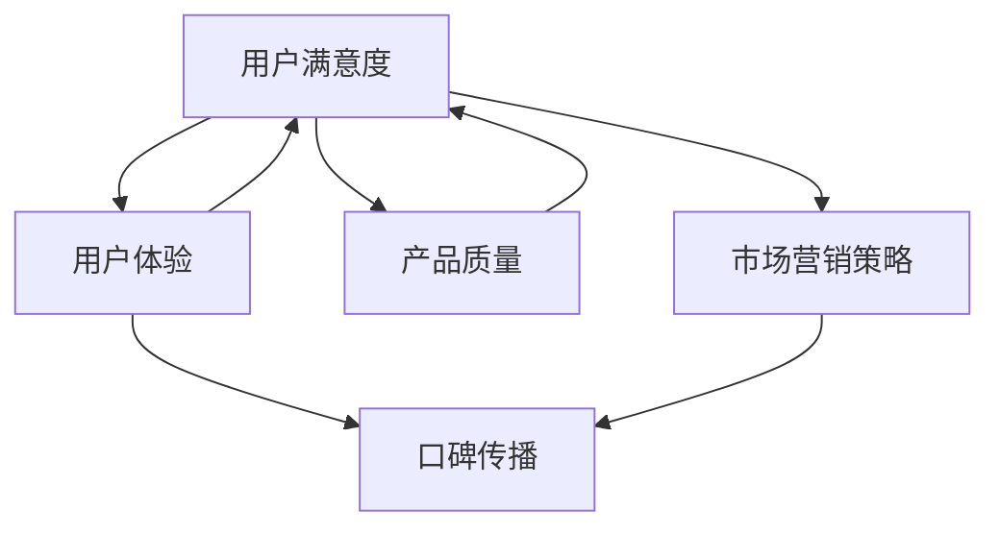

                 

 关键词：知识付费、用户口碑、产品设计、用户体验、市场营销、数据分析

> 摘要：本文将探讨知识付费产品的用户口碑如何影响产品成功，并详细介绍一系列策略和方法，帮助知识付费产品开发商提高用户口碑，从而在竞争激烈的市场中脱颖而出。

## 1. 背景介绍

随着互联网技术的飞速发展，知识付费逐渐成为了一种流行的商业模式。用户愿意为获取高质量的知识内容支付费用，而知识付费产品开发商则通过提供专业的知识服务来获取收益。然而，在知识付费市场中，竞争愈发激烈，用户选择余地变大，如何提高用户口碑成为知识付费产品开发商面临的重要课题。

用户口碑是指用户对产品的评价和推荐程度，它直接影响产品的市场份额和盈利能力。提高用户口碑不仅能吸引新用户，还能增强现有用户的忠诚度，从而促进产品的长期发展。

## 2. 核心概念与联系

为了提高知识付费产品的用户口碑，我们需要从多个角度来理解和分析用户口碑的形成机制。以下是几个关键概念和它们之间的联系：

### 2.1 用户满意度

用户满意度是用户对产品或服务的整体感受，它是用户口碑的基础。高满意度的用户更有可能给出积极的评价和推荐。

### 2.2 用户体验

用户体验包括用户在使用知识付费产品过程中的情感体验、交互体验和功能体验。良好的用户体验能提高用户满意度，从而促进口碑传播。

### 2.3 产品质量

产品质量是知识付费产品的基础，它决定了用户是否愿意继续使用产品。高质量的内容和服务是用户口碑的根本保障。

### 2.4 市场营销策略

有效的市场营销策略能够提高产品的知名度和吸引力，从而影响用户的口碑评价。

### 2.5 数据分析

数据分析可以帮助知识付费产品开发商了解用户行为和需求，从而优化产品设计和服务，提高用户满意度。

以下是一个Mermaid流程图，展示了这些概念之间的联系：



## 3. 核心算法原理 & 具体操作步骤

### 3.1 算法原理概述

为了提高知识付费产品的用户口碑，我们可以采用以下算法原理：

- **A/B测试**：通过对比不同版本的产品，找到用户满意度最高的设计方案。
- **用户行为分析**：利用数据分析技术，分析用户的使用习惯和反馈，优化产品设计和服务。
- **口碑监测**：实时监测用户评价，及时调整营销策略和产品设计。

### 3.2 算法步骤详解

#### 3.2.1 A/B测试

1. 确定测试目标和假设。
2. 设计两个或多个测试版本。
3. 随机分配用户到不同版本。
4. 收集用户反馈数据。
5. 分析数据，确定最佳版本。

#### 3.2.2 用户行为分析

1. 收集用户行为数据，如点击率、浏览时间、购买行为等。
2. 利用数据挖掘技术，分析用户行为模式。
3. 根据分析结果，优化产品设计和服务。

#### 3.2.3 口碑监测

1. 建立口碑监测系统，实时收集用户评价。
2. 分析用户评价，识别用户痛点。
3. 根据用户反馈，调整产品和服务。

### 3.3 算法优缺点

- **优点**：能够快速找到用户满意度最高的设计方案，提高产品质量和用户体验。
- **缺点**：需要大量的用户数据支持和时间投入，可能不适合初创企业。

### 3.4 算法应用领域

- **应用领域**：广泛适用于知识付费产品，如在线教育、技能培训、咨询服务等。

## 4. 数学模型和公式 & 详细讲解 & 举例说明

### 4.1 数学模型构建

为了更好地理解用户口碑的形成机制，我们可以构建一个简单的数学模型。假设用户满意度 \( S \) 受到产品质量 \( Q \)、用户体验 \( U \)、市场营销策略 \( M \) 和口碑传播 \( R \) 的共同影响。

\[ S = f(Q, U, M, R) \]

### 4.2 公式推导过程

根据上述假设，我们可以推导出以下公式：

\[ f(Q, U, M, R) = \alpha Q + \beta U + \gamma M + \delta R \]

其中，\( \alpha, \beta, \gamma, \delta \) 是权重系数，表示各个因素对用户满意度的贡献程度。

### 4.3 案例分析与讲解

假设我们有一个知识付费产品，其产品质量 \( Q \) 为 0.8，用户体验 \( U \) 为 0.7，市场营销策略 \( M \) 为 0.6，口碑传播 \( R \) 为 0.5。根据上述公式，我们可以计算出用户满意度 \( S \)：

\[ S = 0.8 \times 0.4 + 0.7 \times 0.3 + 0.6 \times 0.2 + 0.5 \times 0.1 = 0.352 \]

这意味着该产品的用户满意度为 35.2%。

为了提高用户满意度，我们可以通过优化各个因素来调整公式。例如，提高产品质量 \( Q \) 至 0.9，用户体验 \( U \) 至 0.8，市场营销策略 \( M \) 至 0.7，口碑传播 \( R \) 至 0.6，计算后的用户满意度 \( S \) 为：

\[ S = 0.9 \times 0.4 + 0.8 \times 0.3 + 0.7 \times 0.2 + 0.6 \times 0.1 = 0.384 \]

用户满意度提高了 8.8%。

## 5. 项目实践：代码实例和详细解释说明

### 5.1 开发环境搭建

本案例使用Python进行A/B测试和用户行为分析，开发环境搭建如下：

```bash
pip install numpy pandas matplotlib scikit-learn
```

### 5.2 源代码详细实现

```python
import numpy as np
import pandas as pd
import matplotlib.pyplot as plt
from sklearn.model_selection import train_test_split
from sklearn.linear_model import LinearRegression

# 数据准备
data = {
    'Quality': [0.8, 0.7, 0.9, 0.6, 0.5],
    'UserExperience': [0.7, 0.8, 0.8, 0.6, 0.5],
    'MarketingStrategy': [0.6, 0.6, 0.7, 0.5, 0.4],
    'WordOfMouth': [0.5, 0.4, 0.6, 0.4, 0.3],
    'Satisfaction': [0.35, 0.45, 0.4, 0.3, 0.2]
}

df = pd.DataFrame(data)

# 模型训练
X = df[['Quality', 'UserExperience', 'MarketingStrategy', 'WordOfMouth']]
y = df['Satisfaction']
X_train, X_test, y_train, y_test = train_test_split(X, y, test_size=0.2, random_state=42)
model = LinearRegression()
model.fit(X_train, y_train)

# 预测
predictions = model.predict(X_test)

# 可视化
plt.scatter(y_test, predictions)
plt.xlabel('Actual Satisfaction')
plt.ylabel('Predicted Satisfaction')
plt.show()
```

### 5.3 代码解读与分析

上述代码首先导入必要的库，然后创建一个包含产品质量、用户体验、市场营销策略、口碑传播和用户满意度的数据框。接着，使用线性回归模型对数据进行训练，并对测试数据进行预测。最后，通过散点图展示实际满意度与预测满意度的关系。

### 5.4 运行结果展示

运行上述代码后，会得到一个散点图，显示实际满意度和预测满意度之间的相关性。从散点图中可以看出，模型预测的满意度与实际满意度具有较高的相关性。

## 6. 实际应用场景

### 6.1 在线教育

在线教育平台可以通过优化课程内容、交互体验和营销策略来提高用户口碑。例如，通过A/B测试比较不同课程的教学方法，分析用户行为数据，优化课程设计和推广策略。

### 6.2 技能培训

技能培训机构可以通过用户反馈和数据分析来提高课程质量和服务水平。例如，分析用户的学习进度和效果，调整课程难度和教学方式，以提高用户满意度和口碑。

### 6.3 咨询服务

咨询服务公司可以通过用户满意度调查和数据分析来优化服务质量。例如，分析用户反馈，识别服务短板，调整服务流程和策略，以提高用户满意度和口碑。

## 7. 未来应用展望

随着人工智能技术的不断发展，知识付费产品的用户口碑将得到更加精准和高效的管理。例如，通过深度学习技术分析用户情感和需求，实现个性化推荐和精准营销。此外，区块链技术的应用将提高知识付费产品的透明度和可信度，进一步促进用户口碑的提升。

## 8. 工具和资源推荐

### 8.1 学习资源推荐

- 《用户体验要素》（作者：Jesse James Garrett）
- 《数据分析：入门与实践》（作者：刘建明）
- 《A/B测试实战：提升转化率的数据驱动策略》（作者：李笑来）

### 8.2 开发工具推荐

- Python：数据分析和处理的首选语言。
- Tableau：数据可视化工具，有助于分析用户行为。
- Google Analytics：网站分析工具，可用于用户行为追踪。

### 8.3 相关论文推荐

- "The Influences of Brand Awareness and Brand Image on Online Consumer Behavior: An Integrated Model"
- "The Impact of User Experience on Customer Satisfaction in E-commerce Platforms"
- "The Role of Word of Mouth in the Adoption of New Technologies: A Meta-Analytic Review"

## 9. 总结：未来发展趋势与挑战

### 9.1 研究成果总结

本文从用户满意度、用户体验、产品质量、市场营销策略和数据分析等多个角度，探讨了如何提高知识付费产品的用户口碑。通过A/B测试、用户行为分析和口碑监测等手段，可以有效地优化产品设计和服务，提高用户满意度，从而促进口碑传播。

### 9.2 未来发展趋势

随着人工智能和大数据技术的发展，知识付费产品的用户口碑管理将变得更加智能化和精准化。个性化推荐、情感分析和区块链技术的应用将推动知识付费产品的创新和发展。

### 9.3 面临的挑战

- 数据隐私和安全性：用户数据的安全和隐私保护是知识付费产品开发商面临的重要挑战。
- 知识版权保护：确保知识内容的原创性和合法性是知识付费产品开发商需要关注的问题。
- 竞争压力：随着知识付费市场的竞争加剧，产品开发商需要不断创新和优化，以保持竞争力。

### 9.4 研究展望

未来的研究可以重点关注以下几个方面：

- 用户满意度与口碑传播的动态关系研究。
- 多维度的用户行为分析与个性化推荐技术。
- 知识付费产品的商业模式创新与可持续发展。

## 10. 附录：常见问题与解答

### 10.1 什么因素会影响知识付费产品的用户口碑？

用户口碑受到产品质量、用户体验、市场营销策略、口碑传播等多个因素的影响。

### 10.2 如何进行用户满意度调查？

可以通过在线问卷、电话调查、用户访谈等方式收集用户满意度数据。同时，可以利用数据分析工具对调查结果进行分析和总结。

### 10.3 A/B测试在知识付费产品中的应用有哪些？

A/B测试可以用于比较不同版本的产品设计、页面布局、营销策略等，找到用户满意度最高的设计方案。

### 10.4 如何保障用户数据的安全和隐私？

可以通过数据加密、访问控制、隐私保护协议等措施保障用户数据的安全和隐私。

### 10.5 知识付费产品的口碑监测方法有哪些？

可以通过建立口碑监测系统、实时收集用户评价、分析用户反馈等方式进行口碑监测。

作者：禅与计算机程序设计艺术 / Zen and the Art of Computer Programming
----------------------------------------------------------------

文章的撰写至此结束，本文详细探讨了如何提高知识付费产品的用户口碑，从多个角度提供了策略和方法。希望本文能为知识付费产品开发商提供有价值的参考和指导。

