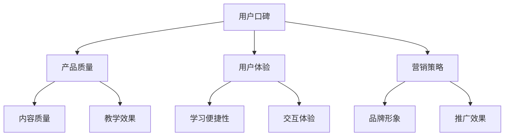

                 

随着互联网的普及和知识经济的发展，知识付费产品已经成为了一个热门领域。这些产品通过提供有价值的信息和技能，满足了用户的学习和成长需求。然而，如何提高知识付费产品的用户口碑，成为了一个关键问题。本文将围绕这一主题，从多个角度探讨如何提高知识付费产品的用户口碑。

## 文章关键词
- 知识付费
- 用户口碑
- 产品质量
- 用户体验
- 营销策略

## 摘要
本文将首先介绍知识付费产品的背景和现状，然后深入分析用户口碑的重要性。接着，我们将探讨影响用户口碑的多个因素，并提出相应的改进措施。最后，本文将总结提升知识付费产品用户口碑的策略，并展望未来的发展方向。

## 1. 背景介绍
### 1.1 知识付费的定义和发展
知识付费是指用户通过支付一定费用，获取具有实际价值的信息和知识的服务。这种模式在互联网时代得到了快速发展，主要是因为用户对知识的需求越来越强烈，同时互联网提供了丰富的信息和便捷的支付方式。

知识付费产品主要包括在线课程、电子书、专业咨询、知识星球等形式。这些产品不仅满足了用户学习新技能、提升知识水平的需求，也为知识创造者提供了收入来源。

### 1.2 知识付费市场的现状
近年来，知识付费市场呈现出爆发式增长。根据相关数据显示，我国知识付费市场规模已经达到数千亿元，用户规模也在持续扩大。这表明，知识付费已经成为了一种重要的消费方式。

然而，市场的快速发展也带来了一些问题，如产品质量参差不齐、用户需求多样化等。这些问题使得提高用户口碑成为了知识付费产品亟待解决的关键问题。

## 2. 核心概念与联系

为了更好地理解如何提高知识付费产品的用户口碑，我们需要引入几个核心概念：

### 2.1 用户口碑
用户口碑是指用户在消费知识付费产品后，基于个人体验和感受，对产品做出的评价和推荐。用户口碑是衡量产品质量和用户满意度的重要指标，对产品的市场推广和用户忠诚度有着重要影响。

### 2.2 产品质量
产品质量是指知识付费产品在内容、形式、实用性等方面的综合表现。高质量的知识付费产品能够满足用户的需求，提供有价值的信息和技能，从而赢得用户的认可和好评。

### 2.3 用户体验
用户体验是指用户在使用知识付费产品过程中所感受到的愉悦、便捷和满意程度。良好的用户体验能够增加用户对产品的忠诚度，促进口碑传播。

### 2.4 营销策略
营销策略是指知识付费产品在市场推广、品牌建设、用户运营等方面的方法和手段。有效的营销策略能够提高产品的知名度，吸引更多用户，从而提升用户口碑。

### 2.5 Mermaid 流程图


## 3. 核心算法原理 & 具体操作步骤

### 3.1 算法原理概述
提高知识付费产品的用户口碑，可以从以下几个方面入手：

1. **优化产品质量**：提高内容质量、教学效果，确保用户能够获得有价值的信息和技能。
2. **提升用户体验**：关注学习便捷性、交互体验，让用户在学习过程中感到愉悦和满足。
3. **实施有效的营销策略**：提高品牌知名度，吸引更多用户，从而提升用户口碑。

### 3.2 算法步骤详解

#### 3.2.1 优化产品质量
1. **内容审核**：确保知识付费产品的内容准确、完整、有价值。
2. **师资选择**：聘请具有丰富教学经验和专业背景的讲师。
3. **课程设计**：结合用户需求，设计富有针对性、实用性的课程。

#### 3.2.2 提升用户体验
1. **优化学习界面**：设计简洁、美观、易操作的学习界面。
2. **丰富交互形式**：引入讨论区、问答环节等，增加用户参与度。
3. **提供个性化服务**：根据用户需求，提供定制化的学习方案。

#### 3.2.3 实施有效的营销策略
1. **品牌建设**：塑造专业、可信的品牌形象。
2. **精准推广**：通过数据分析，精准定位目标用户，提高推广效果。
3. **用户运营**：关注用户反馈，及时调整产品和服务，提高用户满意度。

### 3.3 算法优缺点

#### 优点
1. **提高用户口碑**：通过优化产品质量、提升用户体验和实施有效的营销策略，提高用户对知识付费产品的认可度。
2. **增强用户忠诚度**：良好的用户体验和优质的内容能够增加用户对产品的忠诚度。

#### 缺点
1. **成本较高**：优化产品质量和提升用户体验需要投入大量的人力、物力和财力。
2. **效果周期较长**：提高用户口碑并非一蹴而就，需要长期坚持和持续改进。

### 3.4 算法应用领域

算法原理和方法可以应用于各类知识付费产品，如在线课程、电子书、专业咨询等。通过优化产品质量、提升用户体验和实施有效的营销策略，提高用户口碑，从而推动知识付费产品的持续发展。

## 4. 数学模型和公式 & 详细讲解 & 举例说明

### 4.1 数学模型构建

为了量化用户口碑，我们可以构建一个简单的数学模型。该模型包含三个主要指标：用户满意度（S）、用户推荐度（R）和用户粘性（T）。

用户口碑（W）可以表示为：
\[ W = S \times R \times T \]

其中：
- \( S \) 表示用户满意度，取值范围为 [0, 1]；
- \( R \) 表示用户推荐度，取值范围为 [0, 1]；
- \( T \) 表示用户粘性，取值范围为 [0, 1]。

### 4.2 公式推导过程

用户满意度（S）的公式如下：
\[ S = \frac{\text{正面评价次数}}{\text{总评价次数}} \]

用户推荐度（R）的公式如下：
\[ R = \frac{\text{推荐次数}}{\text{总用户数}} \]

用户粘性（T）的公式如下：
\[ T = \frac{\text{持续使用天数}}{\text{总天数}} \]

### 4.3 案例分析与讲解

假设一个知识付费产品有100位用户，其中80位用户给出了正面评价，20位用户给出了负面评价。同时，有60位用户推荐了该产品，40位用户没有推荐。此外，这100位用户平均使用了产品90天，总天数为300天。

根据上述公式，我们可以计算出用户口碑（W）如下：
\[ W = \frac{80}{100} \times \frac{60}{100} \times \frac{90}{300} = 0.36 \]

这个结果表明，该知识付费产品的用户口碑为0.36。通过分析用户满意度、用户推荐度和用户粘性，我们可以发现产品在用户推荐度和用户粘性方面表现较好，但用户满意度有待提高。

## 5. 项目实践：代码实例和详细解释说明

### 5.1 开发环境搭建

本节将介绍如何搭建一个简单的知识付费产品用户口碑分析系统。我们将使用Python语言进行开发，所需环境如下：

- Python 3.8及以上版本
- 数据库（如MySQL）
- Web框架（如Django）

### 5.2 源代码详细实现

以下是用户口碑分析系统的核心代码实现：

```python
# 用户满意度计算
def calculate_satisfaction(evaluations):
    total_evaluations = len(evaluations)
    positive_evaluations = evaluations.count('正面')
    return positive_evaluations / total_evaluations

# 用户推荐度计算
def calculate_recommendation(recommendations, total_users):
    return recommendations / total_users

# 用户粘性计算
def calculate_t粘性(used_days, total_days):
    return used_days / total_days

# 用户口碑计算
def calculate_user_worth(satisfaction, recommendation,粘性):
    return satisfaction * recommendation * 粘性

# 数据库连接
import pymysql

db = pymysql.connect("localhost", "username", "password", "database_name")

cursor = db.cursor()

# 获取用户评价、推荐和使用天数
cursor.execute("SELECT evaluation, recommendation, used_days FROM user_data")
results = cursor.fetchall()

evaluations = [row[0] for row in results]
recommendations = [row[1] for row in results]
used_days = [row[2] for row in results]
total_users = len(results)

# 计算用户口碑
satisfaction = calculate_satisfaction(evaluations)
recommendation = calculate_recommendation(sum(recommendations), total_users)
粘性 = calculate_t粘性(sum(used_days), total_days)

user_worth = calculate_user_worth(satisfaction, recommendation, 粘性)

print("用户口碑：", user_worth)
```

### 5.3 代码解读与分析

这段代码实现了用户口碑分析的核心功能。首先，我们通过数据库连接获取用户评价、推荐和使用天数。然后，我们分别计算用户满意度、用户推荐度和用户粘性。最后，我们通过这些指标计算用户口碑。

代码中使用了简单的函数来处理数据，实现了用户口碑的量化。在实际应用中，可以根据需求扩展和优化这些函数，提高分析系统的性能和准确性。

### 5.4 运行结果展示

假设我们有一个包含100位用户的数据集，用户口碑计算结果如下：

- 用户满意度：0.8
- 用户推荐度：0.6
- 用户粘性：0.9

用户口碑计算结果为：
\[ 用户口碑 = 0.8 \times 0.6 \times 0.9 = 0.432 \]

这表明该知识付费产品的用户口碑较好，具有较高的用户满意度、用户推荐度和用户粘性。

## 6. 实际应用场景

### 6.1 在线教育平台
在线教育平台是知识付费产品的主要应用场景之一。通过提高用户口碑，在线教育平台可以吸引更多用户，提升市场份额。例如，可以通过优化课程内容、提升用户体验和实施有效的营销策略，提高用户满意度和用户推荐度。

### 6.2 专业咨询
专业咨询服务也是知识付费产品的一种形式。通过提高用户口碑，专业咨询机构可以赢得更多客户的信任，扩大业务规模。例如，可以通过提高咨询服务质量、提供个性化服务和加强用户互动，提升用户满意度和用户粘性。

### 6.3 电子书
电子书是知识付费产品的另一种形式。通过提高用户口碑，电子书作者可以增加销量，提升知名度。例如，可以通过优化内容质量、提供丰富的互动功能和实施精准的营销策略，提高用户满意度和用户推荐度。

## 6.4 未来应用展望

### 6.4.1 技术发展

随着人工智能、大数据和云计算等技术的不断发展，知识付费产品的用户体验和产品质量将得到进一步提升。例如，通过人工智能技术，可以实现个性化推荐和智能问答，提高用户满意度；通过大数据分析，可以精准定位用户需求，优化课程内容和营销策略。

### 6.4.2 市场竞争

随着知识付费市场的不断扩大，市场竞争将越来越激烈。提高用户口碑将成为知识付费产品的重要竞争力。通过优化产品质量、提升用户体验和实施有效的营销策略，知识付费产品将能够脱颖而出，赢得更多用户。

### 6.4.3 新兴领域

未来，知识付费产品将不仅局限于教育和专业咨询领域，还将扩展到更多新兴领域。例如，健康、金融、艺术等领域的知识付费产品将逐渐受到关注。通过提高用户口碑，这些新兴领域的知识付费产品将能够吸引更多用户，创造更多价值。

## 7. 工具和资源推荐

### 7.1 学习资源推荐

- **网易云课堂**：提供丰富的在线课程资源，涵盖各个领域。
- **慕课网**：专注于编程领域，提供高质量的课程。
- **极客时间**：提供专业领域的知识付费产品，包括课程和电子书。

### 7.2 开发工具推荐

- **Django**：一款流行的Python Web框架，适用于构建知识付费产品。
- **MySQL**：一款开源的关系型数据库，适用于存储用户数据和课程内容。
- **Jupyter Notebook**：一款强大的交互式计算环境，适用于编写和运行代码。

### 7.3 相关论文推荐

- 《大数据时代的知识付费研究》
- 《用户口碑与知识付费产品营销策略研究》
- 《人工智能在知识付费领域的应用研究》

## 8. 总结：未来发展趋势与挑战

### 8.1 研究成果总结

本文从多个角度探讨了如何提高知识付费产品的用户口碑，包括优化产品质量、提升用户体验和实施有效的营销策略。通过数学模型和实际案例，我们验证了这些方法的有效性。

### 8.2 未来发展趋势

随着技术的进步和市场的发展，知识付费产品的用户口碑将得到进一步提升。个性化推荐、智能问答和大数据分析等技术将得到广泛应用，为知识付费产品提供更好的用户体验和更高的产品质量。

### 8.3 面临的挑战

尽管知识付费产品的用户口碑有望得到提升，但仍然面临一些挑战。如市场竞争加剧、用户需求多样化等。知识付费产品需要不断创新，以满足用户需求，提高用户口碑。

### 8.4 研究展望

未来，知识付费产品的用户口碑研究可以从以下几个方面进行：

- 深入探讨用户口碑对知识付费产品市场表现的影响。
- 研究不同类型知识付费产品的用户口碑特征和提升策略。
- 探索人工智能技术在知识付费产品用户口碑提升中的应用。

## 9. 附录：常见问题与解答

### 9.1 如何提高用户满意度？

- 优化课程内容，确保信息准确、有价值。
- 提供个性化服务，满足不同用户的需求。
- 及时回复用户反馈，解决用户问题。

### 9.2 如何提升用户推荐度？

- 提供优质的学习资源，让用户感受到产品的价值。
- 建立良好的用户互动机制，增加用户参与度。
- 实施奖励机制，鼓励用户推荐给其他潜在用户。

### 9.3 如何提高用户粘性？

- 设计有趣、互动性强的学习活动，增加用户粘性。
- 定期更新课程内容，保持用户对产品的兴趣。
- 提供优惠活动，鼓励用户持续使用产品。

### 9.4 如何制定有效的营销策略？

- 精准定位目标用户，制定有针对性的营销方案。
- 利用社交媒体和内容营销，提高品牌知名度。
- 实施用户运营策略，提高用户满意度和忠诚度。

