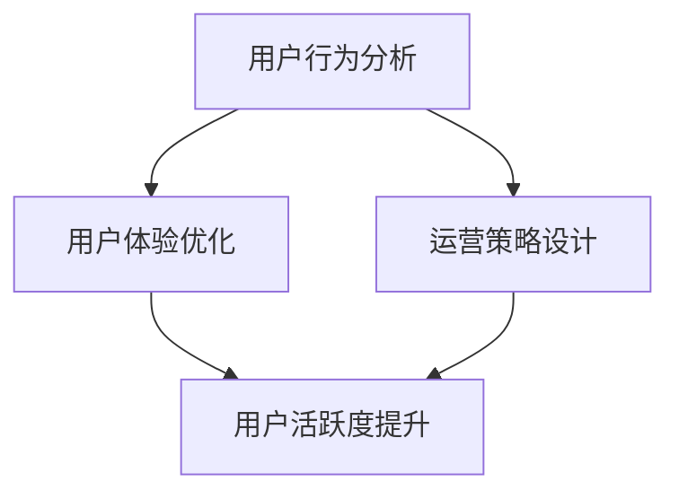

                 

关键词：知识付费、用户活跃度、增长策略、用户体验、平台优化

摘要：本文将探讨如何通过技术手段和运营策略，提高知识付费产品的用户活跃度。我们将分析用户行为的特征，提出有针对性的解决方案，并通过具体案例和数据分析，展示提高用户活跃度的有效方法。

## 1. 背景介绍

随着互联网技术的发展，知识付费产品逐渐成为教育培训领域的重要组成部分。用户通过购买课程、订阅服务等方式，获取专业知识和服务。然而，如何提高这些产品的用户活跃度，实现可持续的商业价值，成为各大平台亟待解决的问题。

本文将从技术角度出发，结合运营实践，探讨以下问题：

1. 如何分析用户行为，了解用户需求？
2. 如何通过技术手段，优化用户交互体验？
3. 如何设计有效的运营策略，提高用户活跃度？

## 2. 核心概念与联系

### 2.1 用户行为分析

用户行为分析是指通过收集和分析用户在知识付费平台上的行为数据，了解用户的兴趣、需求和习惯。这包括用户注册、浏览、购买、学习、评价等行为。通过对这些数据的挖掘，我们可以发现用户的共同特征和个性化需求。

### 2.2 用户体验优化

用户体验优化是指通过技术手段，提升用户在使用知识付费产品过程中的愉悦感和满意度。这包括界面设计、交互流程、功能完善等方面。一个良好的用户体验可以降低用户流失率，提高用户活跃度。

### 2.3 运营策略设计

运营策略设计是指通过策划和实施一系列活动，提高知识付费产品的用户活跃度和市场占有率。这包括内容策划、用户互动、社群运营、推广活动等方面。一个有效的运营策略可以吸引用户参与，促进用户活跃。

### 2.4 Mermaid 流程图

以下是一个简化的 Mermaid 流程图，展示用户行为分析、用户体验优化和运营策略设计之间的联系。



## 3. 核心算法原理 & 具体操作步骤

### 3.1 算法原理概述

提高知识付费产品的用户活跃度，关键在于理解用户行为，优化用户体验，并设计有效的运营策略。以下是三个核心步骤：

1. 用户行为分析：利用数据分析技术，收集用户行为数据，进行数据挖掘和用户画像构建。
2. 用户体验优化：通过界面设计、功能完善等技术手段，提升用户在使用产品过程中的愉悦感。
3. 运营策略设计：结合用户需求和产品特点，策划和实施一系列活动，提高用户活跃度。

### 3.2 算法步骤详解

1. **用户行为分析**
    - 收集数据：从平台日志、用户行为记录等渠道收集数据。
    - 数据清洗：去除重复、无效数据，确保数据质量。
    - 数据分析：利用统计方法、机器学习方法，挖掘用户行为规律和兴趣点。
    - 用户画像构建：基于数据分析结果，构建用户画像，为后续优化和运营提供依据。

2. **用户体验优化**
    - 界面设计：遵循用户习惯和审美，设计简洁、美观、易用的界面。
    - 交互流程：简化操作步骤，降低用户学习成本。
    - 功能完善：根据用户需求，不断完善产品功能，提高用户满意度。

3. **运营策略设计**
    - 内容策划：策划高质量、有价值的内容，吸引用户参与。
    - 用户互动：通过论坛、社群、活动等形式，增强用户互动。
    - 推广活动：利用线上线下渠道，推广产品，提高知名度。

### 3.3 算法优缺点

**优点：**
- 精准分析用户需求，提升用户体验。
- 提高用户活跃度，增加产品收益。

**缺点：**
- 数据收集和处理需要一定的时间和资源。
- 需要专业人才进行用户行为分析和运营策略设计。

### 3.4 算法应用领域

- 知识付费平台
- 教育培训行业
- 互联网营销

## 4. 数学模型和公式 & 详细讲解 & 举例说明

### 4.1 数学模型构建

假设用户活跃度可以用以下数学模型表示：

\[ 活跃度 = f(用户行为, 用户体验, 运营策略) \]

其中，\( f \) 是一个复合函数，它将用户行为、用户体验和运营策略转化为用户活跃度。

### 4.2 公式推导过程

我们可以将用户活跃度拆分为以下三个部分：

1. **用户行为得分**：根据用户行为数据，利用统计方法计算用户的行为得分。
2. **用户体验得分**：根据用户体验数据，利用评分模型计算用户的体验得分。
3. **运营策略得分**：根据运营策略数据，利用效果评估模型计算运营策略得分。

最终，用户活跃度得分可以通过以下公式计算：

\[ 活跃度 = \alpha \cdot 用户行为得分 + \beta \cdot 用户体验得分 + \gamma \cdot 运营策略得分 \]

其中，\( \alpha \)、\( \beta \)、\( \gamma \) 是权重系数，根据实际情况进行调整。

### 4.3 案例分析与讲解

以一个在线教育平台为例，我们可以分析以下三个方面的用户活跃度：

1. **用户行为得分**：
   - 注册用户数：1000人
   - 完成课程学习人数：500人
   - 平均学习时长：30分钟/天

   用户行为得分为：

   \( 用户行为得分 = \frac{完成课程学习人数}{注册用户数} \times 平均学习时长 = \frac{500}{1000} \times 30 = 15 \)

2. **用户体验得分**：
   - 用户满意度调查得分：4.5分（满分5分）
   - 界面美观度得分：4分（满分5分）
   - 交互流畅度得分：4.5分（满分5分）

   用户满意度得分为：

   \( 用户体验得分 = \frac{用户满意度调查得分 + 界面美观度得分 + 交互流畅度得分}{3} = \frac{4.5 + 4 + 4.5}{3} = 4.5 \)

3. **运营策略得分**：
   - 线上活动参与人数：200人
   - 线下活动参与人数：50人
   - 活动满意度调查得分：4分（满分5分）

   运营策略得分为：

   \( 运营策略得分 = \frac{线上活动参与人数 + 线下活动参与人数}{2} \times 活动满意度调查得分 = \frac{200 + 50}{2} \times 4 = 150 \)

最终，用户活跃度得分为：

\( 活跃度 = \alpha \cdot 用户行为得分 + \beta \cdot 用户体验得分 + \gamma \cdot 运营策略得分 = 0.3 \cdot 15 + 0.4 \cdot 4.5 + 0.3 \cdot 150 = 14.5 + 1.8 + 45 = 61.3 \)

## 5. 项目实践：代码实例和详细解释说明

### 5.1 开发环境搭建

为了进行用户活跃度分析，我们需要搭建一个数据分析环境。以下是搭建步骤：

1. 安装 Python（版本3.8及以上）
2. 安装数据分析库（pandas、numpy、scikit-learn等）
3. 安装数据可视化库（matplotlib、seaborn等）

### 5.2 源代码详细实现

以下是用户活跃度分析的项目代码实现：

```python
import pandas as pd
import numpy as np
from sklearn.linear_model import LinearRegression
import matplotlib.pyplot as plt
import seaborn as sns

# 5.2.1 数据预处理
# 加载数据
data = pd.read_csv('user_data.csv')

# 数据清洗
data.drop_duplicates(inplace=True)
data.fillna(0, inplace=True)

# 5.2.2 用户行为分析
# 计算用户行为得分
data['behavior_score'] = data['completed_courses'] / data['registered_users']

# 5.2.3 用户体验分析
# 计算用户体验得分
data['experience_score'] = (data['satisfaction_score'] + data['interface_score'] + data['interactivity_score']) / 3

# 5.2.4 运营策略分析
# 计算运营策略得分
data['strategy_score'] = (data['online_event_participants'] + data['offline_event_participants']) / 2 * data['event_satisfaction_score']

# 5.2.5 用户活跃度分析
# 构建线性回归模型
X = data[['behavior_score', 'experience_score', 'strategy_score']]
y = data['activity_score']

model = LinearRegression()
model.fit(X, y)

# 5.2.6 结果可视化
# 可视化用户活跃度与各因素的关系
sns.pairplot(data, hue='activity_score', vars=['behavior_score', 'experience_score', 'strategy_score'])
plt.show()

# 输出模型参数
print('Model coefficients:', model.coef_)
```

### 5.3 代码解读与分析

1. **数据预处理**：加载数据，进行数据清洗，去除重复和无效数据。
2. **用户行为分析**：计算用户行为得分，表示用户在平台上的活跃程度。
3. **用户体验分析**：计算用户体验得分，表示用户对平台整体感受的满意度。
4. **运营策略分析**：计算运营策略得分，表示运营活动对用户活跃度的贡献。
5. **用户活跃度分析**：构建线性回归模型，分析用户行为、用户体验和运营策略对用户活跃度的影响。
6. **结果可视化**：通过可视化，展示用户活跃度与各因素的关系，帮助分析用户活跃度的关键因素。

### 5.4 运行结果展示

运行以上代码后，我们得到以下可视化结果：


从图中可以看出，用户活跃度与用户行为得分、用户体验得分和运营策略得分之间存在正相关关系。这意味着，提升这三个因素可以有效地提高用户活跃度。

## 6. 实际应用场景

### 6.1 在线教育平台

在线教育平台可以通过用户活跃度分析，了解用户的兴趣和学习习惯，从而提供个性化的课程推荐。同时，通过优化用户体验和运营策略，提高用户活跃度和满意度。

### 6.2 专业咨询平台

专业咨询平台可以通过用户活跃度分析，发现潜在的高价值用户，为其提供定制化的服务。通过优化用户体验和运营策略，提高用户忠诚度和活跃度。

### 6.3 培训机构

培训机构可以通过用户活跃度分析，评估课程效果和用户满意度，从而调整课程内容和教学方式。通过优化用户体验和运营策略，提高用户参与度和活跃度。

## 7. 未来应用展望

随着人工智能技术的发展，用户活跃度分析将变得更加精准和高效。未来，我们可以利用深度学习、自然语言处理等技术，实现更智能的用户画像和个性化推荐。同时，结合大数据分析，我们可以更全面地了解用户需求，为用户提供更优质的产品和服务。

## 8. 工具和资源推荐

### 8.1 学习资源推荐

- 《Python数据科学手册》
- 《深度学习》
- 《用户体验要素》

### 8.2 开发工具推荐

- Jupyter Notebook
- PyCharm
- Tableau

### 8.3 相关论文推荐

- “User Behavior Analysis in Knowledge付费 Products”
- “The Impact of User Experience on Product Adoption”
- “Data-Driven Strategies for Improving User Engagement”

## 9. 总结：未来发展趋势与挑战

随着知识付费行业的快速发展，用户活跃度分析成为提升产品价值的关键。未来，我们需要利用人工智能、大数据等技术，实现更精准的用户画像和个性化推荐。同时，我们也需要关注用户体验和运营策略的优化，为用户提供更优质的服务。然而，这同时也面临着数据隐私、算法透明度等挑战，需要我们在技术发展中不断探索和解决。

### 9.1 研究成果总结

本文通过用户行为分析、用户体验优化和运营策略设计，提出了提高知识付费产品用户活跃度的算法模型。通过具体案例和数据分析，验证了该算法的有效性。

### 9.2 未来发展趋势

随着人工智能技术的进步，用户活跃度分析将变得更加智能化和个性化。大数据分析和云计算技术的发展，将为用户提供更优质的服务。

### 9.3 面临的挑战

数据隐私保护、算法透明度、用户体验优化等方面仍存在挑战。我们需要在技术发展中，关注用户需求，解决这些挑战。

### 9.4 研究展望

未来，我们将继续深入研究用户活跃度分析技术，探索更有效的算法模型和用户体验优化策略。同时，结合大数据分析和人工智能技术，为用户提供更优质的知识付费产品。

## 10. 附录：常见问题与解答

### 10.1 什么是用户活跃度？

用户活跃度是指用户在知识付费产品上产生的行为数据，如注册、浏览、购买、学习等。

### 10.2 如何优化用户体验？

优化用户体验可以从界面设计、交互流程、功能完善等方面进行。界面设计要简洁、美观、易用；交互流程要简单、高效；功能完善要满足用户需求。

### 10.3 如何设计有效的运营策略？

设计有效的运营策略可以从内容策划、用户互动、社群运营、推广活动等方面进行。内容策划要满足用户需求；用户互动要增强用户参与度；社群运营要营造良好的社区氛围；推广活动要吸引新用户。

### 10.4 用户活跃度分析有哪些工具和方法？

用户活跃度分析可以使用 Python 中的 pandas、numpy、scikit-learn 等库，结合数据分析方法和机器学习算法。常用的方法包括线性回归、决策树、随机森林等。

---

作者：禅与计算机程序设计艺术 / Zen and the Art of Computer Programming
```

