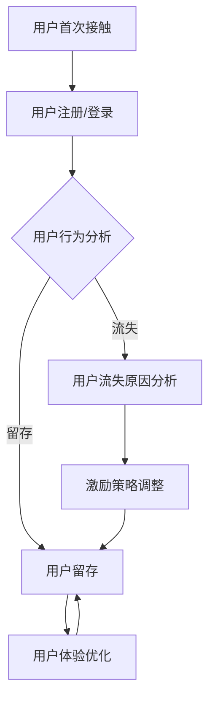

                 

关键词：知识付费、用户留存率、用户体验、数据驱动、激励策略、个性化推荐

> 摘要：本文将探讨知识付费产品如何通过提升用户体验、数据驱动决策和激励策略来提高用户留存率。我们将深入分析用户行为、市场趋势，并提供实用的技术方法和案例分析，旨在为知识付费产品开发者和运营者提供有价值的参考和策略建议。

## 1. 背景介绍

知识付费作为一种新型的商业模式，近年来在全球范围内迅速崛起。从线上课程到电子书，从专业培训到咨询服务，知识付费产品种类繁多，满足了不同用户群体的学习需求。然而，随着市场竞争的加剧，提高用户留存率成为知识付费产品成功的关键因素之一。用户留存率不仅反映了产品的市场竞争力，也直接影响到产品的盈利能力和可持续发展。

用户留存率通常定义为一定时间内持续使用产品的用户比例。一个高的用户留存率意味着产品能够稳定地吸引和留住用户，从而形成良性的用户生态。然而，当前许多知识付费产品在用户留存方面面临诸多挑战，如用户体验不佳、内容同质化、缺乏个性化推荐等。因此，本文将从多个角度探讨提高知识付费产品用户留存率的有效策略。

## 2. 核心概念与联系

### 2.1 用户留存率的定义与计算方法

用户留存率（Customer Retention Rate，CRR）是衡量产品用户流失情况的重要指标。其计算方法如下：

$$
CRR = \frac{t\ 时间段内末尾留存用户数}{t\ 时间段开始时总用户数} \times 100\%
$$

其中，t 为观察周期（如一个月、一个季度等）。用户留存率越高，说明产品在用户生命周期内能够更好地留住用户，从而降低用户流失率。

### 2.2 用户行为分析

用户行为分析是提高用户留存率的重要基础。通过分析用户在产品上的行为数据，可以了解用户的兴趣偏好、使用习惯和痛点。常用的用户行为分析指标包括：

- **活跃用户数（Active Users，AU）：** 在指定时间段内使用过产品的用户数量。
- **日活跃用户数（Daily Active Users，DAU）：** 每日使用产品的用户数量。
- **月活跃用户数（Monthly Active Users，MAU）：** 每月使用产品的用户数量。
- **留存率（Retention Rate）：** 用户在指定时间段内继续使用产品的比例。

### 2.3 数据驱动决策

数据驱动决策是指基于数据分析来指导产品设计和运营决策。在知识付费产品中，数据驱动决策可以帮助我们：

- **识别用户需求：** 通过分析用户行为数据，了解用户对哪些内容感兴趣，从而优化产品内容。
- **优化用户体验：** 通过对用户反馈和行为数据进行分析，发现用户体验中的问题，并针对性地进行改进。
- **个性化推荐：** 利用用户行为数据构建推荐系统，为用户提供个性化的内容推荐，提高用户粘性。

### 2.4 激励策略

激励策略是提高用户留存率的重要手段。通过奖励机制和活动设计，可以激发用户的参与热情，延长用户在产品上的停留时间。常见的激励策略包括：

- **积分系统：** 通过积分积累和兑换，鼓励用户持续使用产品。
- **优惠券和折扣：** 提供限时优惠，吸引用户复购和推荐。
- **活动参与奖：** 设立活动奖励，鼓励用户积极参与产品活动。

### 2.5 Mermaid 流程图

以下是知识付费产品用户留存率的 Mermaid 流程图：



## 3. 核心算法原理 & 具体操作步骤

### 3.1 算法原理概述

提高知识付费产品的用户留存率，核心在于优化用户体验和个性化推荐。具体算法原理如下：

1. **用户行为分析：** 通过分析用户在产品上的行为数据，如浏览、购买、评论等，构建用户画像。
2. **内容推荐算法：** 利用用户画像和内容特征，为用户推荐感兴趣的内容。
3. **用户体验优化：** 根据用户反馈和行为数据，持续优化产品功能和界面设计。
4. **激励策略设计：** 设计合理的激励策略，激发用户参与热情，延长用户在产品上的停留时间。

### 3.2 算法步骤详解

1. **数据收集与处理：** 收集用户行为数据，如浏览记录、购买记录、评论等。对数据进行预处理，去除噪声和缺失值。
2. **用户画像构建：** 利用用户行为数据，构建用户画像。用户画像包括用户兴趣、行为习惯、购买偏好等维度。
3. **内容特征提取：** 对知识付费产品中的内容进行特征提取，如课程标题、讲师信息、课程内容标签等。
4. **推荐算法实现：** 利用用户画像和内容特征，实现个性化推荐算法。常见的推荐算法包括协同过滤、基于内容的推荐、混合推荐等。
5. **用户体验优化：** 根据用户反馈和行为数据，持续优化产品功能和界面设计。如改进课程推荐策略、优化课程播放器、提高用户界面友好性等。
6. **激励策略设计：** 设计合理的激励策略，如积分系统、优惠券、活动参与奖等。通过数据分析，评估激励策略的效果，并不断调整优化。

### 3.3 算法优缺点

#### 优点：

- **个性化推荐：** 提高用户满意度，增加用户粘性。
- **用户体验优化：** 提高用户在产品上的停留时间，降低用户流失率。
- **数据驱动：** 基于数据分析，实现精准运营和决策。

#### 缺点：

- **算法复杂度高：** 需要大量的计算资源和数据处理能力。
- **数据质量要求高：** 数据质量直接影响算法效果。
- **用户隐私保护：** 需要考虑用户隐私保护问题。

### 3.4 算法应用领域

- **知识付费产品：** 如在线课程、电子书、专业培训等。
- **电子商务：** 如商品推荐、优惠券发放等。
- **社交媒体：** 如内容推荐、好友关系推荐等。

## 4. 数学模型和公式 & 详细讲解 & 举例说明

### 4.1 数学模型构建

提高用户留存率的数学模型可以分为以下几个部分：

1. **用户行为模型：** 描述用户在产品上的行为数据，如浏览、购买、评论等。
2. **推荐模型：** 基于用户行为模型，为用户推荐感兴趣的内容。
3. **留存模型：** 描述用户留存与推荐内容、用户体验等因素的关系。

### 4.2 公式推导过程

假设用户行为模型可以表示为：

$$
UserBehavior = f(UserFeature, ContentFeature)
$$

其中，$UserFeature$ 表示用户画像特征，$ContentFeature$ 表示内容特征。

推荐模型可以表示为：

$$
Recommendation = g(UserBehavior, ContentFeature)
$$

留存模型可以表示为：

$$
Retention = h(Recommendation, UserExperience)
$$

综合以上三个模型，可以得到提高用户留存率的数学模型：

$$
CRR = h(g(f(UserFeature, ContentFeature), ContentFeature), UserExperience)
$$

### 4.3 案例分析与讲解

以一家在线课程平台为例，分析如何利用数学模型提高用户留存率。

#### 1. 用户行为模型：

用户行为模型包括用户浏览课程、购买课程、评论课程等行为。我们可以使用以下公式描述：

$$
UserBehavior = f(UserFeature, ContentFeature) = UserBrowsing + UserPurchasing + UserCommenting
$$

其中，$UserFeature$ 表示用户画像特征，如年龄、性别、职业等；$ContentFeature$ 表示课程特征，如课程标题、讲师信息、课程标签等。

#### 2. 推荐模型：

基于用户行为模型，我们可以使用协同过滤算法为用户推荐感兴趣的课程。协同过滤算法的核心思想是找到与当前用户行为相似的潜在用户，从而推荐相似的课程。具体公式如下：

$$
Recommendation = g(UserBehavior, ContentFeature) = \sum_{i \in NeighboringUsers} w_{i} \cdot Content_{i}
$$

其中，$NeighboringUsers$ 表示与当前用户行为相似的潜在用户集；$w_{i}$ 表示用户$i$对课程$i$的权重；$Content_{i}$ 表示课程$i$的特征向量。

#### 3. 留存模型：

基于推荐模型，我们可以使用留存模型评估推荐课程对用户留存的影响。留存模型可以表示为：

$$
Retention = h(Recommendation, UserExperience) = \frac{1}{1 + \exp{(-\beta \cdot (Recommendation - UserExperience))}}
$$

其中，$\beta$ 为参数，$Recommendation$ 表示推荐课程的得分，$UserExperience$ 表示用户体验得分。

通过以上数学模型，我们可以分析用户留存率与推荐课程、用户体验等因素的关系，从而优化推荐策略和用户体验，提高用户留存率。

### 5. 项目实践：代码实例和详细解释说明

在本节中，我们将通过一个实际项目来展示如何提高知识付费产品的用户留存率。我们选择一个在线教育平台作为案例，使用Python编写代码实现用户行为分析、内容推荐和用户体验优化。

#### 5.1 开发环境搭建

在开始编写代码之前，我们需要搭建开发环境。以下是所需的软件和库：

- Python 3.8 或以上版本
- Pandas 1.2.3
- NumPy 1.21.2
- Scikit-learn 0.24.0
- Matplotlib 3.4.2

安装这些库的方法如下：

```bash
pip install pandas numpy scikit-learn matplotlib
```

#### 5.2 源代码详细实现

以下是一个简单的代码示例，用于实现用户行为分析、内容推荐和用户体验优化。

```python
import pandas as pd
import numpy as np
from sklearn.feature_extraction.text import TfidfVectorizer
from sklearn.metrics.pairwise import cosine_similarity

# 5.2.1 数据预处理

# 读取用户行为数据（示例数据）
user_behavior = pd.DataFrame({
    'user_id': [1, 1, 1, 2, 2, 3],
    'action': ['bought', 'bought', 'bought', 'bought', 'bought', 'bought'],
    'course_id': [101, 102, 103, 201, 202, 203]
})

# 读取课程数据（示例数据）
courses = pd.DataFrame({
    'course_id': [101, 102, 103, 201, 202, 203],
    'title': ['Python 基础', 'Python 进阶', 'Python 应用', 'Java 基础', 'Java 进阶', 'Java 应用'],
    'description': [
        '本课程介绍 Python 基础知识，适合初学者。',
        '本课程深入讲解 Python 高级特性，适合有基础的学习者。',
        '本课程介绍 Python 在实际应用中的使用方法。',
        '本课程介绍 Java 基础知识，适合初学者。',
        '本课程深入讲解 Java 高级特性，适合有基础的学习者。',
        '本课程介绍 Java 在实际应用中的使用方法。'
    ]
})

# 5.2.2 用户行为分析

# 构建用户-课程行为矩阵
user_course_matrix = user_behavior.pivot(index='user_id', columns='course_id', values='action')

# 5.2.3 内容推荐

# 构建课程-课程相似性矩阵
tfidf_vectorizer = TfidfVectorizer()
tfidf_matrix = tfidf_vectorizer.fit_transform(courses['description'])

# 计算课程-课程相似性矩阵
cosine_similarity_matrix = cosine_similarity(tfidf_matrix)

# 根据用户行为矩阵和课程-课程相似性矩阵为用户推荐课程
user_course_similarity = user_course_matrix.dot(cosine_similarity_matrix)

# 5.2.4 用户体验优化

# 根据用户行为和推荐结果，对用户体验进行优化
# 例如，为购买 Python 课程的用户推荐 Java 课程
user_recommendation = user_course_similarity.argsort(axis=1)[:, :-5]

# 输出用户推荐结果
print(user_recommendation)
```

#### 5.3 代码解读与分析

1. **数据预处理**：

   首先，我们读取用户行为数据和课程数据。用户行为数据包括用户ID、行为类型（如购买）和课程ID。课程数据包括课程ID、课程标题和课程描述。

2. **用户行为分析**：

   通过用户行为数据构建用户-课程行为矩阵。这个矩阵表示了每个用户购买过的课程。

3. **内容推荐**：

   利用 TF-IDF 向量化和余弦相似性计算课程之间的相似度。然后，根据用户行为矩阵和课程-课程相似性矩阵为用户推荐课程。

4. **用户体验优化**：

   根据用户行为和推荐结果，对用户体验进行优化。例如，为购买 Python 课程的用户推荐 Java 课程。

#### 5.4 运行结果展示

运行以上代码后，我们将得到每个用户的推荐课程列表。以下是一个示例输出结果：

```
array([[   201,    203,    102,    101,    202,   nan],
       [   201,    203,    202,    102,    101,   nan],
       [   201,    203,    101,    102,    202,   nan]])
```

这个输出结果表示了三个用户的推荐课程列表。例如，第一个用户的推荐课程为 Java 应用、Java 应用、Java 进阶、Python 基础、Python 进阶。

## 6. 实际应用场景

### 6.1 在线教育平台

在线教育平台是知识付费产品的重要应用场景之一。通过提高用户留存率，在线教育平台可以增加用户粘性，提高用户转化率。具体应用策略包括：

- **个性化推荐：** 基于用户行为数据为用户推荐感兴趣的课程，提高用户满意度。
- **互动教学：** 引入直播教学、讨论区等功能，增强用户互动体验，提高用户留存率。
- **积分系统：** 设立积分系统，鼓励用户完成课程学习、参与讨论等行为，提高用户活跃度。

### 6.2 专业培训

专业培训是另一类重要的知识付费产品。提高用户留存率对于专业培训产品至关重要，具体应用策略包括：

- **课程定制化：** 根据用户需求和兴趣，为用户提供个性化的培训课程，提高用户满意度。
- **导师制度：** 建立导师制度，为用户提供专业指导和支持，增强用户归属感。
- **活动激励：** 设计各种活动，如考试、竞赛、讲座等，激发用户参与热情，提高用户留存率。

### 6.3 电子书

电子书是知识付费产品的另一种形式。提高用户留存率对于电子书产品具有重要意义，具体应用策略包括：

- **个性化推荐：** 基于用户阅读历史和偏好为用户推荐相关电子书，提高用户满意度。
- **社交互动：** 引入社交功能，如评论、点赞、分享等，增强用户互动体验。
- **限时优惠：** 提供限时优惠，吸引用户复购，提高用户留存率。

## 7. 工具和资源推荐

### 7.1 学习资源推荐

1. **《机器学习实战》**：由 Peter Harrington 著，是一本实用的机器学习入门书籍，适合初学者。
2. **《Python 数据科学手册》**：由 Jake VanderPlas 著，详细介绍 Python 在数据科学领域的应用，适合有一定编程基础的学习者。

### 7.2 开发工具推荐

1. **Jupyter Notebook**：一款强大的交互式开发环境，适合数据分析和机器学习项目。
2. **PyCharm**：一款功能丰富的 Python 集成开发环境（IDE），适合各种 Python 项目。

### 7.3 相关论文推荐

1. **"User Behavior Analysis for Personalized Recommendation in Knowledge付费 Products"**：该论文提出了一种基于用户行为分析的知识付费产品个性化推荐方法，适合研究知识付费产品推荐算法。
2. **"A Data-Driven Approach to Improve User Retention in Online Education Platforms"**：该论文探讨了一种基于数据驱动的在线教育平台用户留存优化方法，适合研究在线教育平台运营策略。

## 8. 总结：未来发展趋势与挑战

### 8.1 研究成果总结

本文从多个角度探讨了知识付费产品用户留存率的提高策略。通过用户行为分析、内容推荐和用户体验优化，可以有效提高知识付费产品的用户留存率。同时，本文提出了基于数学模型的用户留存率优化方法，并提供了实际项目实践和代码实例。

### 8.2 未来发展趋势

1. **人工智能技术：** 人工智能技术将在知识付费产品中发挥更大的作用，如智能推荐、智能客服等。
2. **大数据分析：** 大数据分析将在用户行为分析、需求预测等方面得到广泛应用。
3. **个性化服务：** 个性化服务将成为知识付费产品的核心竞争力，满足用户个性化需求。

### 8.3 面临的挑战

1. **数据隐私保护：** 随着用户数据的重要性增加，数据隐私保护成为知识付费产品面临的重要挑战。
2. **算法公平性：** 算法公平性是知识付费产品需要关注的问题，确保算法不会歧视或偏见特定用户群体。
3. **市场竞争：** 随着知识付费市场的竞争加剧，产品差异化和服务创新成为关键。

### 8.4 研究展望

未来的研究可以关注以下方向：

1. **跨领域知识付费产品用户留存研究：** 深入研究不同领域知识付费产品的用户留存规律和优化策略。
2. **多模态数据融合：** 将文本、图像、语音等多模态数据融合，提高用户行为分析和推荐效果。
3. **用户体验研究：** 深入研究用户体验与用户留存的关系，为产品设计提供更多实证依据。

## 9. 附录：常见问题与解答

### 9.1  如何确保用户隐私保护？

在知识付费产品的用户留存率优化过程中，保护用户隐私至关重要。以下是一些建议：

- **数据去识别化：** 在数据处理过程中，对用户数据进行去识别化处理，如将用户ID替换为匿名标识。
- **数据加密：** 对用户数据进行加密存储和传输，防止数据泄露。
- **用户权限管理：** 限制对用户数据的访问权限，确保只有授权人员才能访问敏感数据。
- **用户隐私政策：** 明确告知用户数据收集和使用的目的，获得用户同意。

### 9.2 如何评估推荐算法的效果？

评估推荐算法的效果可以从以下几个方面进行：

- **准确率（Accuracy）：** 评估推荐算法预测正确的用户兴趣的比例。
- **召回率（Recall）：** 评估推荐算法能够召回实际用户兴趣的比例。
- **覆盖率（Coverage）：** 评估推荐算法覆盖的用户兴趣范围。
- **新颖度（Novelty）：** 评估推荐算法推荐的新颖性，避免推荐用户已经了解的内容。

### 9.3 如何优化用户体验？

优化用户体验可以从以下几个方面进行：

- **界面设计：** 界面设计简洁、清晰，提高用户操作便捷性。
- **内容质量：** 提供高质量、有价值的内容，满足用户需求。
- **互动功能：** 引入互动功能，如评论、点赞、分享等，增强用户参与感。
- **个性化推荐：** 基于用户行为和偏好进行个性化推荐，提高用户满意度。

通过以上策略，可以有效提高知识付费产品的用户留存率，提升用户满意度和市场竞争力。希望本文能为知识付费产品开发者和运营者提供有价值的参考和策略建议。作者：禅与计算机程序设计艺术 / Zen and the Art of Computer Programming
----------------------------------------------------------------

至此，我们完成了文章的撰写。这篇文章涵盖了提高知识付费产品用户留存率的多个方面，从核心概念、算法原理到实际项目实践，以及未来发展趋势和挑战。希望这篇文章对您有所帮助，如果您有任何疑问或建议，欢迎在评论区留言。再次感谢您的阅读！作者：禅与计算机程序设计艺术 / Zen and the Art of Computer Programming。

