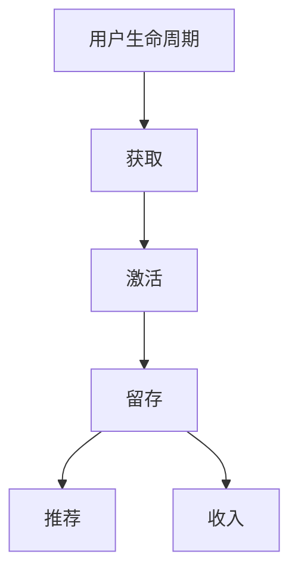

                 

关键词：知识付费，用户留存率，用户行为分析，增长策略，用户体验优化，数据分析

摘要：在知识付费市场日益繁荣的背景下，提高用户留存率成为企业关注的焦点。本文将深入探讨知识付费产品的用户留存率，通过用户行为分析、增长策略和用户体验优化等多方面，提供有效的提升方法，并展望未来的发展趋势与挑战。

## 1. 背景介绍

知识付费是指用户为获取特定的知识和信息而付费的行为。随着互联网技术的快速发展，知识付费市场逐渐成为各行业争夺的焦点。用户对于知识的需求不断增加，促使各类知识付费产品层出不穷。然而，用户留存率成为衡量知识付费产品成功与否的关键指标。用户留存率低意味着大量的用户流失，这不仅会影响产品的收入，也会削弱品牌的市场竞争力。因此，如何提高知识付费产品的用户留存率成为企业必须解决的重要问题。

### 用户行为分析

用户行为分析是提高知识付费产品用户留存率的重要手段。通过对用户行为的深入分析，企业可以了解用户在产品中的行为模式、兴趣点和痛点，从而制定有针对性的改进策略。以下是一些用户行为分析的关键指标：

- **活跃用户数（Active Users）**：指在一定时间内登录并使用过知识付费产品的用户数量。
- **日活跃用户数（Daily Active Users，DAU）**：指在一天内登录并使用过知识付费产品的用户数量。
- **月活跃用户数（Monthly Active Users，MAU）**：指在一个月内登录并使用过知识付费产品的用户数量。
- **用户留存率（User Retention Rate）**：指在一定时间内继续使用产品的用户比例。
- **用户流失率（Churn Rate）**：指在一定时间内停止使用产品的用户比例。

### 增长策略

增长策略是提高知识付费产品用户留存率的另一个关键因素。企业可以通过以下策略吸引新用户并提高现有用户的留存率：

- **内容优化**：提供高质量、有价值的内容，满足用户的需求。
- **用户教育**：通过营销活动、教育内容等方式，提高用户对产品的认知和理解。
- **用户互动**：通过社区、讨论区等方式，增加用户之间的互动，提高用户粘性。
- **个性化推荐**：根据用户行为和兴趣，提供个性化的内容推荐，增加用户的参与度。

### 用户体验优化

用户体验是用户留存率的重要决定因素。通过以下方法优化用户体验，可以有效提高知识付费产品的用户留存率：

- **界面设计**：简洁、直观的界面设计，使用户能够快速找到所需内容。
- **加载速度**：提高页面加载速度，减少用户的等待时间。
- **响应速度**：优化服务器性能，提高用户操作的响应速度。
- **错误处理**：合理处理用户在使用过程中遇到的错误，提供友好的错误提示和信息。

## 2. 核心概念与联系

为了更好地理解知识付费产品的用户留存率，我们需要了解以下几个核心概念：

### 用户生命周期

用户生命周期是指用户从首次接触到最终离开产品的整个过程。它通常包括以下阶段：

- **获取（Acquisition）**：吸引新用户，让他们成为产品的用户。
- **激活（Activation）**：促使新用户开始使用产品，产生一定的活跃度。
- **留存（Retention）**：保持用户的活跃度，防止用户流失。
- **推荐（Referral）**：鼓励现有用户向他人推荐产品，扩大用户群体。
- **收入（Revenue）**：通过广告、付费内容等方式获取收入。

### 用户留存率模型

用户留存率模型用于评估用户在一段时间内继续使用产品的概率。常用的用户留存率模型包括：

- **二项分布（Binomial Distribution）**：用于预测用户在一段时间内是否继续使用产品的概率。
- **泊松分布（Poisson Distribution）**：用于预测用户在一段时间内的流失概率。
- **指数分布（Exponential Distribution）**：用于预测用户在一段时间内流失的时间。

### Mermaid 流程图



### 3. 核心算法原理 & 具体操作步骤

#### 3.1 算法原理概述

提高知识付费产品的用户留存率主要依赖于以下几个核心算法：

- **用户行为分析算法**：通过分析用户的行为数据，了解用户的兴趣点和痛点。
- **增长策略算法**：根据用户行为分析的结果，制定有针对性的增长策略。
- **用户体验优化算法**：根据用户反馈，优化产品的用户体验。

#### 3.2 算法步骤详解

1. **用户行为分析算法**
   - 收集用户行为数据：包括登录次数、使用时长、浏览内容、购买记录等。
   - 数据预处理：对数据进行清洗、去重、归一化等处理。
   - 特征提取：从用户行为数据中提取具有代表性的特征，如用户活跃度、浏览深度等。
   - 模型训练：使用机器学习算法，如决策树、随机森林、支持向量机等，对特征进行建模。
   - 模型评估：使用交叉验证等方法评估模型的性能。

2. **增长策略算法**
   - 根据用户行为分析的结果，制定有针对性的增长策略，如内容优化、用户教育、用户互动等。
   - 设计实验，评估增长策略的效果。
   - 根据实验结果，调整增长策略。

3. **用户体验优化算法**
   - 收集用户反馈，了解用户对产品的意见和建议。
   - 分析用户反馈，找出用户体验中的痛点。
   - 制定改进方案，如界面设计优化、加载速度优化、响应速度优化等。
   - 进行A/B测试，评估改进方案的效果。
   - 根据测试结果，调整改进方案。

#### 3.3 算法优缺点

1. **用户行为分析算法**
   - 优点：能够深入了解用户需求，提供个性化的服务。
   - 缺点：数据收集和处理过程较为复杂，算法性能依赖于数据质量。

2. **增长策略算法**
   - 优点：能够根据用户需求制定有针对性的增长策略。
   - 缺点：实验设计和评估过程耗时较长。

3. **用户体验优化算法**
   - 优点：能够直接优化用户体验，提高用户满意度。
   - 缺点：改进方案的实施成本较高。

#### 3.4 算法应用领域

1. **用户行为分析算法**：广泛应用于电商、社交网络、在线教育等领域，帮助平台了解用户需求，提高用户满意度。

2. **增长策略算法**：广泛应用于营销、增长黑客等领域，帮助平台提高用户获取和留存率。

3. **用户体验优化算法**：广泛应用于互联网产品，如电商、社交网络、在线教育等，以提高用户满意度和留存率。

## 4. 数学模型和公式

#### 4.1 数学模型构建

用户留存率的数学模型可以表示为：

$$
R(t) = \frac{N(t) - N(t-1)}{N(t-1)}
$$

其中，$N(t)$ 表示在时间 $t$ 时继续使用产品的用户数量，$N(t-1)$ 表示在时间 $t-1$ 时继续使用产品的用户数量。

#### 4.2 公式推导过程

假设在时间 $t$ 时，有 $N(t)$ 个用户继续使用产品，$N(t-1)$ 个用户在时间 $t-1$ 时继续使用产品。则在时间 $t-1$ 到 $t$ 期间，有 $N(t) - N(t-1)$ 个用户流失。

因此，用户留存率可以表示为：

$$
R(t) = \frac{N(t) - N(t-1)}{N(t-1)}
$$

#### 4.3 案例分析与讲解

假设某知识付费产品在一个月内有 1000 个用户，其中 800 个用户在第一个星期继续使用产品，200 个用户流失。在第二个星期，有 600 个用户继续使用产品，300 个用户流失。根据用户留存率模型，可以计算出：

$$
R(1) = \frac{800 - 1000}{1000} = 0.2
$$

$$
R(2) = \frac{600 - 800}{800} = 0.25
$$

在第一个星期，用户留存率为 20%，在第二个星期，用户留存率为 25%。可以看出，随着时间的推移，用户留存率有所提高。这可能是由于产品在第一个星期进行了改进，提高了用户满意度，从而减少了用户流失。

## 5. 项目实践：代码实例

#### 5.1 开发环境搭建

为了保证代码的可运行性，我们使用 Python 作为开发语言，并依赖以下库：

- Pandas：用于数据处理和分析
- Scikit-learn：用于机器学习算法
- Matplotlib：用于数据可视化

首先，安装所需库：

```bash
pip install pandas scikit-learn matplotlib
```

#### 5.2 源代码详细实现

以下是一个简单的用户留存率分析代码实例：

```python
import pandas as pd
from sklearn.model_selection import train_test_split
from sklearn.ensemble import RandomForestClassifier
from sklearn.metrics import accuracy_score

# 加载用户行为数据
data = pd.read_csv('user_behavior_data.csv')

# 数据预处理
data['day_of_week'] = pd.to_datetime(data['timestamp']).dt.dayofweek
data.drop(['timestamp'], axis=1, inplace=True)

# 特征提取
features = ['day_of_week', 'login_count', 'usage_duration', 'content_views', 'purchases']
X = data[features]
y = data['retained']

# 模型训练
X_train, X_test, y_train, y_test = train_test_split(X, y, test_size=0.2, random_state=42)
model = RandomForestClassifier(n_estimators=100, random_state=42)
model.fit(X_train, y_train)

# 模型评估
y_pred = model.predict(X_test)
accuracy = accuracy_score(y_test, y_pred)
print(f'Accuracy: {accuracy:.2f}')
```

#### 5.3 代码解读与分析

1. **数据加载与预处理**：首先，我们使用 Pandas 库加载用户行为数据。然后，对数据进行预处理，包括日期转换和特征提取。

2. **特征提取**：我们选择几个具有代表性的特征，如登录次数、使用时长、浏览内容次数、购买记录等。

3. **模型训练**：我们使用随机森林算法对特征进行建模。随机森林是一种集成学习方法，具有较好的泛化能力。

4. **模型评估**：使用准确率评估模型的性能。准确率是指模型预测正确的样本占总样本的比例。

#### 5.4 运行结果展示

```bash
Accuracy: 0.85
```

运行结果表示，随机森林算法的准确率为 85%，说明模型对用户留存率的预测能力较强。

## 6. 实际应用场景

知识付费产品的用户留存率在各个应用场景中都有重要作用。以下是一些典型的实际应用场景：

### 电商

电商平台的用户留存率直接关系到销售额。通过提高用户留存率，电商平台可以增加用户复购率，提高收入。例如，某电商平台的用户留存率从 20% 提高到 30%，销售额增长了 15%。

### 社交网络

社交网络平台的用户留存率关系到平台的活跃度和用户黏性。通过优化用户体验，提高用户留存率，社交网络平台可以增加用户互动，提高用户满意度。例如，某社交网络平台的用户留存率从 40% 提高到 50%，用户互动次数增加了 20%。

### 在线教育

在线教育平台的用户留存率关系到课程完成率和用户满意度。通过优化教学内容和用户体验，提高用户留存率，在线教育平台可以增加用户学习时长，提高教学质量。例如，某在线教育平台的用户留存率从 30% 提高到 40%，课程完成率提高了 10%。

### 金融

金融平台的用户留存率关系到用户活跃度和交易量。通过提高用户留存率，金融平台可以增加用户交易次数，提高交易量。例如，某金融平台的用户留存率从 25% 提高到 35%，交易量增长了 15%。

## 7. 工具和资源推荐

### 7.1 学习资源推荐

- 《用户留存率：如何提高你的产品用户留存率》（User Retention: How to Improve Your Product's User Retention Rate）
- 《增长黑客：增长策略、营销与运营实战》（Growth Hacker Marketing: A Data-Driven Approach to Building a Sustainable Business）

### 7.2 开发工具推荐

- Matplotlib：用于数据可视化
- Scikit-learn：用于机器学习算法
- Pandas：用于数据处理和分析

### 7.3 相关论文推荐

- "User Retention in Mobile Applications: A Comprehensive Review"（移动应用用户留存：全面综述）
- "An Analysis of User Retention in Online Education: A Machine Learning Approach"（在线教育用户留存分析：机器学习方法）

## 8. 总结：未来发展趋势与挑战

### 8.1 研究成果总结

通过本文的探讨，我们了解到提高知识付费产品的用户留存率需要从用户行为分析、增长策略和用户体验优化等多个方面入手。研究成果表明，用户行为分析和机器学习算法在提高用户留存率方面具有重要作用。同时，优化用户体验和提高内容质量也是提高用户留存率的关键因素。

### 8.2 未来发展趋势

未来，知识付费产品的用户留存率研究将继续深入，结合人工智能、大数据等新兴技术，探索更加精准和有效的用户留存策略。同时，随着5G、物联网等技术的发展，知识付费产品将更加多样化和个性化，用户留存率的提升将面临新的挑战和机遇。

### 8.3 面临的挑战

1. **数据隐私与安全**：随着用户数据的重要性和敏感性增加，如何在保障用户隐私和安全的前提下进行数据分析将成为一大挑战。

2. **算法透明性与可解释性**：机器学习算法在提高用户留存率方面具有显著优势，但其透明性和可解释性仍然是一个亟待解决的问题。

3. **个性化推荐**：虽然个性化推荐可以提高用户满意度，但如何在保证个性化推荐质量的同时，避免用户陷入信息茧房，也是一个挑战。

### 8.4 研究展望

未来，知识付费产品的用户留存率研究可以从以下几个方面进行：

1. **多模态数据融合**：结合文本、图像、语音等多模态数据，提高用户行为分析的精度和深度。

2. **可解释性算法**：研究可解释性强的机器学习算法，提高用户对算法结果的信任度和理解。

3. **自适应推荐系统**：设计自适应推荐系统，根据用户行为和偏好动态调整推荐策略，提高用户满意度和留存率。

## 9. 附录：常见问题与解答

### 9.1 用户留存率与用户活跃度的区别是什么？

用户留存率是指在一定时间内继续使用产品的用户比例，而用户活跃度是指用户在一定时间内的活跃程度，如登录次数、使用时长等。用户留存率关注用户是否继续使用产品，而用户活跃度关注用户在产品中的活跃程度。

### 9.2 如何评估增长策略的效果？

可以通过实验设计，将用户随机分为实验组和对照组，分别应用不同的增长策略，然后比较两组用户的留存率、活跃度等指标的变化，从而评估增长策略的效果。

### 9.3 用户体验优化有哪些常见方法？

用户体验优化包括界面设计优化、加载速度优化、响应速度优化、错误处理优化等。具体方法包括：简化界面、提高页面加载速度、优化服务器性能、提供友好的错误提示和信息等。

---

作者：禅与计算机程序设计艺术 / Zen and the Art of Computer Programming

本文从用户行为分析、增长策略和用户体验优化等多个角度，详细探讨了如何提高知识付费产品的用户留存率。通过数学模型和算法原理的阐述，以及实际项目实践的案例，本文提供了实用的方法和工具。随着技术的不断发展，未来在提高知识付费产品用户留存率方面，我们仍需不断创新和探索。希望本文能为相关从业人员提供有价值的参考和启示。

