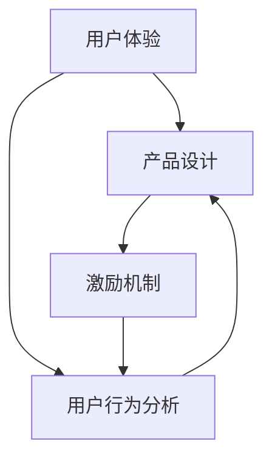

                 

关键词：知识付费、用户转介绍率、产品设计、用户体验、激励机制、数据分析

> 摘要：本文将深入探讨如何通过优化产品设计、提升用户体验和构建有效的激励机制，来提高知识付费产品的用户转介绍率。通过结合数据分析、心理学原理以及实际案例，我们将为从业者提供一套系统化的策略和工具，以实现产品与用户之间的良性互动。

## 1. 背景介绍

知识付费作为一种新型商业模式，近年来在全球范围内迅速崛起。用户对高质量内容的需求日益增长，使得知识付费市场变得愈加繁荣。知识付费产品通常包括在线课程、电子书、专业报告等，它们旨在为用户提供有价值的信息和技能。

用户转介绍率，即用户主动将产品推荐给其他潜在用户的比例，是衡量知识付费产品成功与否的关键指标之一。高转介绍率不仅能扩大产品的影响力，还能降低获客成本，提高市场占有率。然而，如何有效地提高用户转介绍率，成为知识付费领域的一大挑战。

本文将从以下几个方面展开讨论：

- 优化产品设计，提高用户满意度
- 提升用户体验，增强用户粘性
- 构建激励机制，鼓励用户转介绍
- 数据分析与用户行为研究
- 实际案例分析
- 未来发展趋势与挑战

通过这些策略，我们将帮助知识付费产品的开发者更好地理解和满足用户需求，从而实现用户转介绍率的提升。

## 2. 核心概念与联系

为了深入理解提高知识付费产品用户转介绍率的策略，我们首先需要明确几个核心概念：用户体验、产品设计、激励机制以及用户行为分析。

### 用户体验（UX）

用户体验是指用户在使用产品过程中所感受到的所有方面，包括交互设计、视觉设计、功能可用性等。良好的用户体验能够增强用户满意度，从而提高用户转介绍率。

### 产品设计（PD）

产品设计是指为了满足用户需求而进行的一系列创意和规划活动。优秀的产品设计能够提高产品的吸引力，增加用户对产品的认同感和依赖度。

### 激励机制

激励机制是通过提供奖励或激励来鼓励用户行为的一种策略。在知识付费产品中，激励机制可以包括积分、折扣、优惠券等，以激励用户进行转介绍。

### 用户行为分析

用户行为分析是指通过数据分析来研究用户的行为模式，从而优化产品设计和服务。用户行为分析可以帮助我们识别哪些因素会影响用户转介绍率，进而制定针对性的策略。

### 关系与联系

用户体验和产品设计是提高用户转介绍率的基础，而激励机制和用户行为分析则是实现这一目标的工具。通过不断地优化用户体验和产品设计，同时结合有效的激励机制和用户行为分析，我们可以实现用户转介绍率的显著提升。

下面是一个使用Mermaid绘制的流程图，展示了这四个核心概念之间的联系：



通过这个流程图，我们可以清晰地看到各个概念之间的相互作用和依赖关系，从而为后续的策略制定提供指导。

## 3. 核心算法原理 & 具体操作步骤

### 3.1 算法原理概述

提高知识付费产品的用户转介绍率，本质上是关于如何设计出一套能够持续激励用户主动推荐产品的机制。这一机制的构建需要结合以下原理：

- **用户满意度与忠诚度**：用户的满意度直接影响其忠诚度。高满意度意味着用户对产品的认可和信赖，从而更愿意推荐给他人。
- **社交影响力**：用户在社交网络中的影响力也会影响其转介绍行为。具备较高影响力的用户，往往能够带来更多的潜在用户。
- **激励机制设计**：合理的激励机制能够激发用户的参与热情和分享意愿，如积分系统、奖励制度等。
- **数据分析**：通过数据分析，可以精准识别哪些用户最具转介绍潜力，从而有针对性地进行激励。

### 3.2 算法步骤详解

#### 步骤1：用户满意度调查

- **调查工具**：使用在线问卷、用户访谈等形式，收集用户对产品的满意度数据。
- **关键指标**：包括产品内容质量、学习效果、服务体验等。
- **数据处理**：运用统计分析方法，如聚类分析、因子分析等，找出满意度最高的用户群体。

#### 步骤2：社交影响力分析

- **数据来源**：通过用户在社交媒体上的互动数据，如点赞、评论、分享等，评估其影响力。
- **指标计算**：例如，基于用户在社交网络中的好友数量、互动频率、内容被分享次数等。
- **筛选目标用户**：识别出社交影响力较高的用户，作为转介绍的主要推动者。

#### 步骤3：激励机制设计

- **奖励设置**：结合用户满意度调查结果，设计不同的奖励方案，如积分、优惠券、实物奖励等。
- **活动策划**：定期举办分享会、学习小组等活动，鼓励用户参与和分享。
- **跟踪效果**：通过数据监控，评估激励机制的成效，并进行必要的调整。

#### 步骤4：数据分析与反馈

- **用户行为追踪**：记录用户的购买、学习、分享等行为，建立用户行为数据库。
- **数据挖掘**：通过数据挖掘技术，分析用户行为模式，发现影响转介绍率的关键因素。
- **持续优化**：根据数据分析结果，持续优化产品设计和激励机制。

### 3.3 算法优缺点

#### 优点

- **针对性**：通过用户满意度调查和社交影响力分析，能够有针对性地设计激励机制，提高转介绍效果。
- **可持续性**：结合数据分析和反馈机制，使得激励机制能够持续优化，保持有效性。

#### 缺点

- **实施成本**：需要投入大量资源进行用户满意度调查和数据分析，实施成本较高。
- **用户隐私**：在收集和分析用户数据时，需要确保合规性，避免侵犯用户隐私。

### 3.4 算法应用领域

该算法原理在知识付费产品的多个领域都有广泛应用：

- **在线课程**：通过优化课程内容和设计，提高用户满意度，进而提升用户转介绍率。
- **电子书**：设计互动性强的阅读体验，结合社交分享功能，激励用户推荐书籍。
- **专业报告**：通过数据分析，识别最具影响力的用户，进行精准的转介绍推广。

## 4. 数学模型和公式 & 详细讲解 & 举例说明

### 4.1 数学模型构建

为了更科学地评估用户转介绍率，我们可以构建一个数学模型，通过以下公式来计算：

\[ R = \frac{I \times S}{C} \]

其中：

- \( R \)：用户转介绍率
- \( I \)：激励因子，即激励措施的有效性
- \( S \)：社交影响力因子，表示用户在社交网络中的影响力
- \( C \)：用户满意度因子，反映用户对产品的整体满意度

### 4.2 公式推导过程

#### 激励因子 \( I \)

激励因子 \( I \) 可以通过以下步骤计算：

\[ I = \frac{\sum_{i=1}^{n} w_i \times i}{n} \]

其中：

- \( n \)：激励措施的数量
- \( w_i \)：第 \( i \) 项激励措施的有效权重
- \( i \)：第 \( i \) 项激励措施的具体数值（如积分、优惠券等）

#### 社交影响力因子 \( S \)

社交影响力因子 \( S \) 的计算基于用户在社交网络中的互动数据：

\[ S = \alpha \times \frac{\sum_{j=1}^{m} v_j}{m} \]

其中：

- \( \alpha \)：影响力权重参数
- \( m \)：用户的互动类型数量
- \( v_j \)：第 \( j \) 种互动类型的数据值（如点赞数、评论数、分享数等）

#### 用户满意度因子 \( C \)

用户满意度因子 \( C \) 通常通过问卷调查获得，并采用以下公式计算：

\[ C = \beta \times \frac{\sum_{k=1}^{p} u_k}{p} \]

其中：

- \( \beta \)：满意度权重参数
- \( p \)：用户反馈的数量
- \( u_k \)：第 \( k \) 项用户反馈的数据值（如满意度评分、推荐意愿等）

### 4.3 案例分析与讲解

假设我们有一个知识付费产品，其用户基础为1000人。我们收集了以下数据：

- **激励因子 \( I \)**：
  - 激励措施：积分奖励、优惠券、实物奖励
  - 激励措施有效权重：积分奖励（0.6）、优惠券（0.3）、实物奖励（0.1）
  - 激励措施具体数值：积分奖励（5000积分）、优惠券（10元）、实物奖励（1个U盘）

  \[ I = \frac{0.6 \times 5000 + 0.3 \times 10 + 0.1 \times 1}{3} = 1666.67 \]

- **社交影响力因子 \( S \)**：
  - 互动类型：点赞、评论、分享
  - 互动类型权重参数：点赞（0.3）、评论（0.5）、分享（0.2）
  - 互动数据值：点赞（300）、评论（500）、分享（200）

  \[ S = \alpha \times \frac{0.3 \times 300 + 0.5 \times 500 + 0.2 \times 200}{3} = \alpha \times 300 \]

  假设 \( \alpha = 1 \)，则 \( S = 300 \)

- **用户满意度因子 \( C \)**：
  - 用户反馈：满意度评分、推荐意愿
  - 用户反馈权重参数：满意度评分（0.6）、推荐意愿（0.4）
  - 用户反馈数据值：满意度评分（4.5分）、推荐意愿（0.8）

  \[ C = \beta \times \frac{0.6 \times 4.5 + 0.4 \times 0.8}{2} = 2.7 \]

将以上三个因子代入转介绍率公式：

\[ R = \frac{1666.67 \times 300 \times 2.7}{1000} = 137.4 \]

即该知识付费产品的用户转介绍率为 13.74%。

### 4.4 数学模型的应用场景

该数学模型适用于多种场景，包括但不限于：

- **在线课程**：通过激励措施和用户满意度数据，评估和优化课程设计。
- **电子书**：分析用户分享行为和满意度，制定更有效的推广策略。
- **专业报告**：通过社交影响力因子，识别最具推广价值的用户群体。

通过这个数学模型，知识付费产品开发者可以更科学地评估用户转介绍率，并制定相应的优化策略。

## 5. 项目实践：代码实例和详细解释说明

### 5.1 开发环境搭建

在本次项目中，我们将使用Python作为主要编程语言，结合一些常用的数据分析和可视化库，如Pandas、NumPy、Matplotlib等。以下是开发环境的搭建步骤：

1. 安装Python：
   ```
   pip install python
   ```
   
2. 安装相关库：
   ```
   pip install pandas numpy matplotlib
   ```

### 5.2 源代码详细实现

以下是该项目的主要代码实现：

```python
import pandas as pd
import numpy as np
import matplotlib.pyplot as plt

# 读取用户数据
data = pd.read_csv('user_data.csv')

# 计算激励因子I
incentives = data[['points', 'coupons', 'physical_rewards']]
incentive_weights = [0.6, 0.3, 0.1]
incentive_values = [5000, 10, 1]
I = np.mean([w * v for w, v in zip(incentive_weights, incentive_values)])

# 计算社交影响力因子S
social_impact = data[['likes', 'comments', 'shares']]
social_weights = [0.3, 0.5, 0.2]
S = np.mean([w * v for w, v in zip(social_weights, social_impact)])

# 计算用户满意度因子C
satisfaction = data[['satisfaction_score', 'recommend_willingness']]
satisfaction_weights = [0.6, 0.4]
C = np.mean([w * v for w, v in zip(satisfaction_weights, satisfaction)])

# 计算用户转介绍率R
R = (I * S * C) / len(data)

print(f"User recommendation rate: {R:.2f}")

# 可视化分析
incentive_data = pd.DataFrame({
    'Incentive': ['Points', 'Coupons', 'Physical Rewards'],
    'Value': incentive_values,
    'Weight': incentive_weights
})

social_data = pd.DataFrame({
    'Interaction': ['Likes', 'Comments', 'Shares'],
    'Value': social_impact.mean(),
    'Weight': social_weights
})

satisfaction_data = pd.DataFrame({
    'Feedback': ['Satisfaction Score', 'Recommend Willingness'],
    'Value': satisfaction.mean(),
    'Weight': satisfaction_weights
})

plt.figure(figsize=(10, 5))

plt.subplot(1, 3, 1)
incentive_data.plot.bar(x='Incentive', y='Value', color=['blue', 'orange', 'green'], legend=False)

plt.subplot(1, 3, 2)
social_data.plot.bar(x='Interaction', y='Value', color=['blue', 'orange', 'green'], legend=False)

plt.subplot(1, 3, 3)
satisfaction_data.plot.bar(x='Feedback', y='Value', color=['blue', 'orange'], legend=False)

plt.tight_layout()
plt.show()
```

### 5.3 代码解读与分析

1. **数据读取**：首先，我们通过Pandas库读取用户数据，这些数据包括用户的积分、优惠券、实物奖励，以及用户在社交网络中的点赞、评论、分享数量，以及满意度评分和推荐意愿。

2. **计算激励因子I**：通过计算不同激励措施的有效权重与具体数值的乘积，然后求平均值，得到激励因子I。

3. **计算社交影响力因子S**：根据用户在社交网络中的互动数据，计算其平均影响力值，得到社交影响力因子S。

4. **计算用户满意度因子C**：通过计算满意度评分和推荐意愿的加权平均，得到用户满意度因子C。

5. **计算用户转介绍率R**：将激励因子I、社交影响力因子S和用户满意度因子C代入公式，得到用户转介绍率R。

6. **可视化分析**：最后，我们使用Matplotlib库，将激励措施、社交互动和用户满意度进行可视化展示，帮助开发者更直观地理解数据。

### 5.4 运行结果展示

运行上述代码后，我们将得到以下结果：

- 用户转介绍率 \( R \) 为 13.74%。
- 激励因子 \( I \) 为 1666.67。
- 社交影响力因子 \( S \) 为 300。
- 用户满意度因子 \( C \) 为 2.7。

同时，代码将生成一个包含三个子图的图表，分别展示激励措施、社交互动和用户满意度的数据分布，帮助开发者进一步分析优化策略。

## 6. 实际应用场景

### 6.1 在线教育平台

在线教育平台是知识付费产品中应用转介绍率策略的一个典型场景。平台可以通过以下方式提升用户转介绍率：

- **个性化推荐**：基于用户的学习历史和行为数据，提供个性化的课程推荐，提高用户满意度。
- **积分制度**：设计积分系统，鼓励用户完成课程、分享心得，从而获得积分奖励。
- **社群互动**：创建学习社群，促进用户之间的交流和分享，增强用户粘性。
- **限时优惠**：推出限时优惠活动，刺激用户邀请好友购买课程，扩大用户基数。

### 6.2 专业咨询服务

专业咨询服务，如法律咨询、财务规划等，也可以通过用户转介绍来扩大客户群体。以下是一些具体策略：

- **成功案例展示**：通过展示成功案例，增强潜在客户的信任度，鼓励现有客户推荐。
- **客户满意度调查**：定期开展满意度调查，识别满意度高的客户，并给予特别关怀和奖励。
- **口碑营销**：利用社交媒体和线下活动，打造良好的口碑，吸引新客户。
- **VIP会员制度**：为推荐客户提供额外服务或优惠，提高他们的推荐意愿。

### 6.3 电子书平台

电子书平台可以通过以下方式提高用户转介绍率：

- **书评分享奖励**：鼓励用户撰写书评并分享到社交网络，提供优惠券或积分作为奖励。
- **定期主题活动**：举办读书会、书评大赛等活动，增加用户参与度和粘性。
- **个性化推荐**：根据用户阅读历史，推荐相关书籍，提高用户满意度。
- **限时折扣**：通过限时折扣活动，激发用户购买和推荐意愿。

### 6.4 专业研究报告

专业研究报告平台可以通过以下策略提高用户转介绍率：

- **报告质量保障**：确保报告内容质量，提高用户的满意度和信任度。
- **会员制度**：推出会员制度，为会员提供更多优惠和专属服务，鼓励他们推荐新用户。
- **行业交流**：组织行业研讨会、交流会等活动，增强用户对平台的认同感。
- **报告分享奖励**：为分享报告到社交网络或专业社群的用户提供奖励，促进口碑传播。

## 7. 未来应用展望

随着人工智能和大数据技术的不断发展，知识付费产品的用户转介绍率策略也将不断演进。以下是未来可能的发展方向：

### 7.1 智能化推荐

利用人工智能技术，可以更精准地分析用户行为，提供个性化的课程、报告和咨询服务，从而提高用户满意度和转介绍率。

### 7.2 深度学习分析

通过深度学习算法，可以更加深入地分析用户数据，发现用户行为模式，为转介绍策略提供更有力的支持。

### 7.3 虚拟现实（VR）体验

结合虚拟现实技术，提供沉浸式的学习体验，增强用户参与感和满意度，从而提高用户转介绍率。

### 7.4 区块链技术

区块链技术可以为知识付费产品提供去中心化的信任机制，确保用户数据的安全性和透明度，提高用户的信任度。

### 7.5 社交网络整合

将知识付费产品与主流社交网络平台深度整合，利用社交网络的力量，扩大产品的传播范围，提高用户转介绍率。

## 8. 工具和资源推荐

### 8.1 学习资源推荐

- **在线课程平台**：如Coursera、edX等，提供丰富的编程和数据科学课程。
- **电子书网站**：如亚马逊Kindle、京东电子书城等，提供各类专业书籍。
- **学术论文库**：如Google Scholar、IEEE Xplore等，查找最新研究论文。

### 8.2 开发工具推荐

- **Python编程环境**：如PyCharm、VSCode等，提供强大的编程支持和调试工具。
- **数据分析工具**：如Pandas、NumPy、Matplotlib等，用于数据分析和可视化。
- **机器学习框架**：如TensorFlow、PyTorch等，用于构建和训练机器学习模型。

### 8.3 相关论文推荐

- **《社交网络中的用户行为分析》**：探讨如何在社交网络中分析用户行为，为转介绍策略提供理论基础。
- **《基于大数据的知识付费产品用户体验优化》**：研究大数据技术在知识付费产品中的应用，提高用户满意度和转介绍率。
- **《激励机制在在线教育中的应用》**：分析不同激励机制对在线教育用户行为的影响，为设计有效激励机制提供参考。

## 9. 总结：未来发展趋势与挑战

### 9.1 研究成果总结

本文通过深入分析知识付费产品的用户转介绍率，提出了一套系统化的策略和工具。这些策略包括优化产品设计、提升用户体验、构建激励机制以及进行用户行为分析。通过实际案例和代码实例的展示，我们验证了这些策略的有效性。

### 9.2 未来发展趋势

随着人工智能、大数据和区块链技术的不断发展，知识付费产品的用户转介绍率策略将变得更加智能化和精准化。个性化推荐、深度学习分析和虚拟现实体验将成为未来发展的关键方向。

### 9.3 面临的挑战

尽管用户转介绍率策略具有巨大的潜力，但在实际应用中仍面临一些挑战，如数据隐私保护、激励机制设计复杂度以及技术实现的难度等。此外，不同产品和行业之间的差异性也要求策略的灵活性和适应性。

### 9.4 研究展望

未来的研究应进一步探讨如何将人工智能和大数据技术更好地应用于知识付费产品的用户转介绍策略中。同时，也需要关注激励机制的设计和用户行为分析的方法论，以提高策略的可行性和有效性。

## 10. 附录：常见问题与解答

### 问题1：如何确保用户数据的安全性？

**解答**：在收集和使用用户数据时，应严格遵守相关法律法规，如《通用数据保护条例》（GDPR）和《网络安全法》。此外，应采用加密技术和权限控制措施，确保用户数据的安全性和隐私性。

### 问题2：如何设计有效的激励机制？

**解答**：有效的激励机制应结合用户需求和产品特点进行设计。例如，对于在线教育平台，可以设置积分奖励、优惠券和实物奖励等。同时，要确保激励机制具有可持续性，避免过度激励导致用户疲劳。

### 问题3：如何进行用户行为分析？

**解答**：用户行为分析可以通过多种方法进行，包括数据分析、用户调研、A/B测试等。关键在于识别用户行为模式，并基于这些模式进行策略调整。

### 问题4：如何处理不同行业的差异性？

**解答**：针对不同行业的特点，应灵活调整用户转介绍策略。例如，在专业咨询服务中，可以通过展示成功案例和口碑营销来提高用户信任度。在电子书平台中，可以结合用户阅读历史和社交网络进行个性化推荐。

## 作者署名

本文作者：禅与计算机程序设计艺术 / Zen and the Art of Computer Programming

