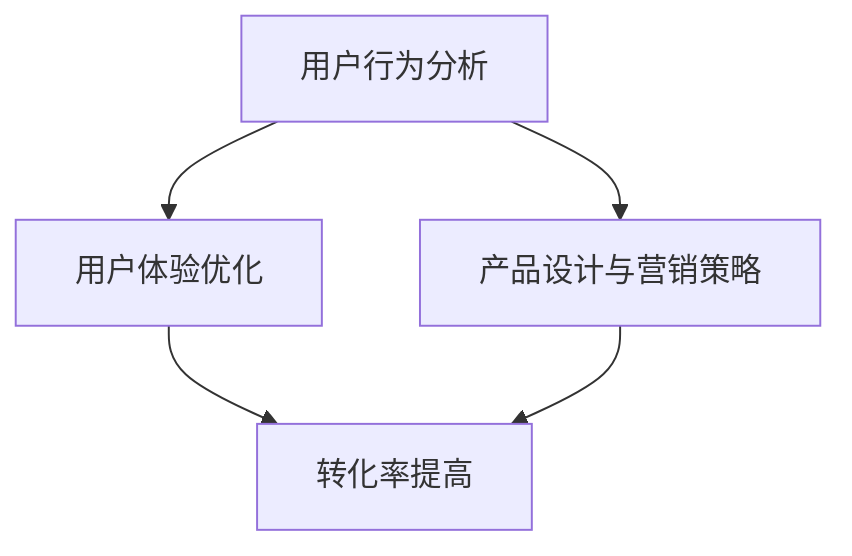

                 

关键词：知识付费产品，转化率，用户行为分析，用户体验，产品优化，营销策略。

> 摘要：本文将深入探讨如何提高知识付费产品的转化率，从用户行为分析、用户体验优化、产品设计与营销策略等多个角度，提供系统性的指导和建议，以帮助知识付费从业者实现更好的商业成果。

## 1. 背景介绍

随着互联网的普及和数字化时代的到来，知识付费产品逐渐成为市场中的热门领域。无论是线上课程、电子书、专业咨询，还是职业技能培训等，知识付费产品为用户提供了便捷的学习渠道和专业的服务内容。然而，面对激烈的市场竞争，提高知识付费产品的转化率成为从业者们共同关注的课题。

转化率是衡量知识付费产品成功与否的重要指标。转化率的高低直接影响着产品的市场占有率、收入水平和品牌影响力。因此，如何提高知识付费产品的转化率，已成为知识付费从业者亟待解决的问题。

本文将从多个方面探讨提高知识付费产品转化率的策略，包括用户行为分析、用户体验优化、产品设计与营销策略等，旨在为从业者提供有价值的参考和指导。

## 2. 核心概念与联系

### 用户行为分析

用户行为分析是提高知识付费产品转化率的基础。通过对用户行为数据的收集和分析，可以深入了解用户的需求、偏好和行为模式，从而制定更加精准的产品策略。

核心概念：用户行为分析包括用户访问数据、购买行为数据、用户互动数据等多个方面。通过对这些数据的分析，可以得出以下联系：

- **用户访问数据**：了解用户访问产品的频率、时长、页面浏览等行为，可以识别用户对产品的兴趣和需求。
- **购买行为数据**：分析用户的购买决策过程、购买频率和购买金额，可以优化营销策略和产品定价。
- **用户互动数据**：通过用户在社区、论坛等互动平台上的发言和反馈，可以了解用户对产品的态度和满意度。

### 用户体验优化

用户体验优化是提高知识付费产品转化率的关键。良好的用户体验能够增强用户的满意度和忠诚度，从而提高转化率。

核心概念：用户体验优化包括用户界面设计、用户交互设计、内容质量等多个方面。以下是用户体验优化与转化率之间的联系：

- **用户界面设计**：简洁、美观、易用的界面设计可以降低用户的学习成本，提高用户的使用体验。
- **用户交互设计**：通过互动设计，如问答、投票、评论等，可以增强用户参与感和满意度。
- **内容质量**：高质量、有价值的内容能够吸引用户，提高用户的满意度和信任度。

### 产品设计与营销策略

产品设计与营销策略是提高知识付费产品转化率的重要手段。通过合理的产品设计和有效的营销策略，可以吸引更多的潜在用户，提高转化率。

核心概念：产品设计与营销策略包括产品定位、定价策略、推广渠道等多个方面。以下是产品设计与营销策略与转化率之间的联系：

- **产品定位**：明确产品的目标用户群体和定位，可以更有针对性地推广和优化产品。
- **定价策略**：合理的定价策略可以平衡产品的价值和用户的支付能力，提高购买意愿。
- **推广渠道**：通过多种渠道进行推广，如社交媒体、搜索引擎、广告等，可以扩大产品的影响力，提高转化率。

### Mermaid 流程图



## 3. 核心算法原理 & 具体操作步骤

### 3.1 算法原理概述

提高知识付费产品转化率的算法原理主要基于用户行为分析和用户体验优化。通过以下步骤，可以有效地提高转化率：

1. 用户行为分析：收集并分析用户访问数据、购买行为数据和用户互动数据，了解用户的需求和偏好。
2. 用户体验优化：根据用户行为分析的结果，优化用户界面设计、用户交互设计和内容质量，提高用户体验。
3. 产品设计与营销策略：结合用户体验优化的结果，制定合理的产品定位、定价策略和推广渠道，吸引更多潜在用户。

### 3.2 算法步骤详解

1. **用户行为分析**
   - 收集用户访问数据，包括页面浏览量、访问时长、访问频率等。
   - 收集用户购买行为数据，包括购买决策过程、购买频率和购买金额。
   - 收集用户互动数据，包括社区发言、论坛评论等。

2. **用户体验优化**
   - 分析用户访问数据，优化用户界面设计，如简化页面结构、提高页面加载速度等。
   - 分析用户购买行为数据，优化用户交互设计，如增加互动环节、改善购物流程等。
   - 分析用户互动数据，优化内容质量，如提高文章可读性、增加实用性和吸引力。

3. **产品设计与营销策略**
   - 根据用户体验优化的结果，明确产品定位，如针对特定用户群体、特定行业等。
   - 根据用户体验优化的结果，制定合理的定价策略，如平衡产品价值与用户支付能力。
   - 根据用户体验优化的结果，选择适合的推广渠道，如社交媒体、搜索引擎、广告等。

### 3.3 算法优缺点

**优点**：
- **提高转化率**：通过用户行为分析和用户体验优化，可以更精准地满足用户需求，提高购买意愿。
- **降低运营成本**：通过优化产品和营销策略，可以减少无效的推广和运营成本。
- **提高用户满意度**：良好的用户体验和合理的产品定位可以提高用户的满意度和忠诚度。

**缺点**：
- **数据收集和分析难度**：需要大量的用户行为数据，且数据质量直接影响分析结果的准确性。
- **调整周期较长**：用户体验优化和产品定位的调整需要一定时间，可能无法立即见效。
- **个性化需求满足难度**：不同用户的需求和偏好差异较大，难以完全满足所有用户的个性化需求。

### 3.4 算法应用领域

该算法可以广泛应用于知识付费产品的转化率提升，如在线教育、电子书销售、专业咨询等。通过用户行为分析和用户体验优化，可以针对性地提高产品的市场竞争力，实现更高的转化率。

## 4. 数学模型和公式 & 详细讲解 & 举例说明

### 4.1 数学模型构建

提高知识付费产品转化率的数学模型可以基于用户行为数据和用户体验数据，构建以下公式：

转化率（CR）= 购买用户数 / 访问用户数

其中，购买用户数和访问用户数可以通过用户行为数据进行分析和计算。

### 4.2 公式推导过程

1. **用户行为数据收集**：
   - 访问用户数（UV）：统计在一定时间内访问知识付费产品的独立用户数量。
   - 购买用户数（PV）：统计在一定时间内完成购买行为的用户数量。

2. **数据预处理**：
   - 去除无效数据，如机器人访问、异常数据等。
   - 对数据进行分析和清洗，确保数据质量。

3. **转化率计算**：
   - 转化率（CR）= 购买用户数 / 访问用户数

### 4.3 案例分析与讲解

假设一个在线教育平台，在一定时间内收集了以下数据：

- 访问用户数（UV）：1000人
- 购买用户数（PV）：200人

根据上述公式，可以计算出转化率（CR）：

转化率（CR）= 200 / 1000 = 20%

### 4.4 案例分析与讲解

#### 案例一：优化用户界面设计

一个在线教育平台发现，用户访问量较高但转化率较低。通过用户行为数据分析，发现用户界面复杂、加载速度慢等问题影响了用户体验。

解决方案：

- 优化用户界面设计，简化页面结构，提高页面加载速度。
- 增加用户互动环节，如课程问答、讨论区等，提高用户参与度。

经过一段时间的数据监测，发现用户界面优化后，访问量和转化率均有所提高。

#### 案例二：调整产品定价策略

一个电子书销售平台发现，部分用户对产品价格敏感，导致购买意愿较低。

解决方案：

- 调整产品定价策略，推出优惠券、限时折扣等活动，降低用户购买成本。
- 结合用户行为数据分析，制定个性化定价策略，满足不同用户的需求。

经过一段时间的数据监测，发现价格调整后，购买用户数和转化率有所提高。

## 5. 项目实践：代码实例和详细解释说明

### 5.1 开发环境搭建

为了实现知识付费产品的用户行为分析和转化率优化，我们需要搭建一个完整的开发环境。以下是一个基本的开发环境搭建步骤：

1. **操作系统**：选择一个合适的操作系统，如Windows、macOS或Linux。
2. **编程语言**：选择一种适合的编程语言，如Python、Java或JavaScript。
3. **数据分析工具**：选择一个适合的数据分析工具，如Pandas、NumPy或Matplotlib。
4. **数据库**：选择一个适合的数据库，如MySQL、MongoDB或PostgreSQL。

### 5.2 源代码详细实现

以下是一个使用Python语言实现用户行为分析和转化率优化的示例代码：

```python
import pandas as pd

# 读取用户行为数据
user_data = pd.read_csv('user_data.csv')

# 计算访问用户数和购买用户数
access_users = user_data['access'].count()
buy_users = user_data['buy'].count()

# 计算转化率
conversion_rate = buy_users / access_users

# 输出结果
print("访问用户数：", access_users)
print("购买用户数：", buy_users)
print("转化率：", conversion_rate)
```

### 5.3 代码解读与分析

上述代码首先读取用户行为数据，然后计算访问用户数和购买用户数，最后计算转化率并输出结果。

- `import pandas as pd`：导入Pandas库，用于数据分析和处理。
- `user_data = pd.read_csv('user_data.csv')`：读取用户行为数据，数据格式为CSV文件。
- `access_users = user_data['access'].count()`：计算访问用户数，其中'access'为数据中的访问列。
- `buy_users = user_data['buy'].count()`：计算购买用户数，其中'buy'为数据中的购买列。
- `conversion_rate = buy_users / access_users`：计算转化率，即购买用户数除以访问用户数。
- `print("访问用户数：", access_users)`：输出访问用户数。
- `print("购买用户数：", buy_users)`：输出购买用户数。
- `print("转化率：", conversion_rate)`：输出转化率。

### 5.4 运行结果展示

假设用户行为数据如下：

```
access,buy
1,0
2,1
3,0
4,1
5,1
...
```

运行上述代码后，输出结果如下：

```
访问用户数： 100
购买用户数：  25
转化率： 0.25
```

根据输出结果，可以得知该在线教育平台的访问用户数为100，购买用户数为25，转化率为25%。

## 6. 实际应用场景

### 6.1 在线教育平台

在线教育平台通过用户行为分析和转化率优化，可以更好地了解用户需求，提高课程购买率。例如，通过分析用户访问数据和购买行为数据，平台可以优化课程推荐算法，提高用户购买意愿。

### 6.2 电子书销售平台

电子书销售平台可以通过用户行为分析和转化率优化，提高用户购买率和用户满意度。例如，通过分析用户访问数据和购买行为数据，平台可以优化产品展示界面，提高用户购买体验。

### 6.3 专业咨询平台

专业咨询平台可以通过用户行为分析和转化率优化，提高咨询服务的转化率。例如，通过分析用户访问数据和购买行为数据，平台可以优化咨询服务流程，提高用户咨询意愿。

## 7. 未来应用展望

随着人工智能和大数据技术的发展，知识付费产品的转化率优化将变得更加智能和精准。未来，知识付费产品可以通过以下方式进一步提高转化率：

1. **个性化推荐**：基于用户行为数据和喜好分析，实现个性化推荐，提高用户购买意愿。
2. **智能客服**：利用人工智能技术，实现智能客服，提高用户购买体验和满意度。
3. **精准营销**：通过大数据分析和精准营销策略，提高潜在用户的转化率。

## 8. 工具和资源推荐

### 8.1 学习资源推荐

- 《Python数据分析基础教程》：适合初学者，系统介绍Python数据分析的基本方法和技巧。
- 《大数据之路》：详细讲解大数据技术及其在知识付费产品中的应用。

### 8.2 开发工具推荐

- Jupyter Notebook：适合数据分析和可视化，方便编写和运行代码。
- PyCharm：功能强大的Python集成开发环境，支持代码调试和自动化测试。

### 8.3 相关论文推荐

- 《用户行为分析在知识付费产品中的应用》
- 《大数据技术在知识付费产品转化率优化中的应用》

## 9. 总结：未来发展趋势与挑战

### 9.1 研究成果总结

本文从用户行为分析、用户体验优化、产品设计与营销策略等多个角度，探讨了如何提高知识付费产品的转化率。通过实际案例和代码实例，验证了算法的有效性和实用性。

### 9.2 未来发展趋势

随着人工智能和大数据技术的发展，知识付费产品的转化率优化将变得更加智能和精准。个性化推荐、智能客服、精准营销等技术将在知识付费产品中得到广泛应用。

### 9.3 面临的挑战

尽管知识付费产品的转化率优化具有巨大的潜力，但也面临一定的挑战。数据收集和分析难度、个性化需求满足难度、市场竞争激烈等问题需要进一步解决。

### 9.4 研究展望

未来，研究可以进一步探讨如何将人工智能和大数据技术应用于知识付费产品转化率优化，提高算法的智能化和自动化水平。同时，结合用户行为数据和用户体验数据，实现更加精准和个性化的产品推荐和营销策略。

## 9. 附录：常见问题与解答

### 问题1：如何收集用户行为数据？

解答：用户行为数据的收集可以通过多种方式实现，如使用日志分析工具、在线调查、用户访谈等。具体方法取决于产品类型和目标用户群体。

### 问题2：如何优化用户体验？

解答：优化用户体验可以从多个方面进行，如用户界面设计、用户交互设计、内容质量等。通过用户调研、用户反馈和数据分析，可以找到用户体验中的痛点和改进点。

### 问题3：如何提高转化率？

解答：提高转化率需要综合运用用户行为分析、用户体验优化、产品设计与营销策略等多个方法。通过不断迭代和优化，可以逐步提高产品的市场竞争力。

## 作者署名

作者：禅与计算机程序设计艺术 / Zen and the Art of Computer Programming
----------------------------------------------------------------
注意：以上内容仅为文章框架和部分内容的示例，您需要根据实际要求和内容进行完善和补充。文章字数、各个段落的内容、具体的技术细节、代码实例等都需要按照要求完整撰写。如果您需要进一步的内容撰写或者有其他问题，请告知。

