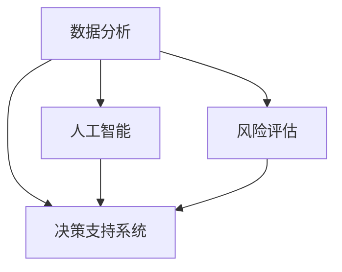

                 

在当今快速发展的信息技术时代，管理决策的质量对组织的成功至关重要。高质量的管理决策能够帮助组织更好地应对市场变化、优化资源分配、提高运营效率，并在竞争激烈的环境中保持领先地位。然而，提高管理决策的质量并非易事，它需要结合理论与实践，并借助先进的技术和工具。本文将探讨如何通过技术手段提高管理决策的质量，帮助管理者做出更明智的决策。

## 关键词

- 管理决策
- 数据分析
- 人工智能
- 风险评估
- 决策支持系统

## 摘要

本文旨在探讨如何利用现代技术手段提高管理决策的质量。我们将从数据分析、人工智能、风险评估和决策支持系统四个方面展开讨论，分析它们如何帮助管理者更好地理解业务环境、优化决策流程、降低风险，并提高决策的准确性。通过本文的阐述，希望读者能够对如何提高管理决策的质量有更深刻的认识，并能够将其应用于实际工作中。

### 1. 背景介绍

管理决策是组织运营的核心，它直接影响到组织的战略方向、资源分配、市场定位以及员工士气。然而，传统管理决策往往依赖于经验、直觉和主观判断，这可能导致决策偏差、决策迟缓或决策失误。在信息爆炸的时代，管理者面临着越来越多的数据来源和复杂的市场环境，如何从海量数据中提取有价值的信息，并转化为高质量的决策，成为了一个亟待解决的问题。

现代技术，尤其是数据分析、人工智能和风险评估技术，为管理决策提供了强大的支持。通过这些技术，管理者可以更准确地预测市场趋势、优化业务流程、识别潜在风险，并制定更具前瞻性和准确性的决策。因此，探讨如何利用现代技术提高管理决策的质量，不仅具有理论意义，也有重要的实际应用价值。

### 2. 核心概念与联系

为了更好地理解如何提高管理决策的质量，我们需要明确几个核心概念：数据分析、人工智能、风险评估和决策支持系统。

#### 2.1 数据分析

数据分析是利用统计学、概率论和计算机科学等方法，从大量数据中提取有价值的信息。数据分析的目的是帮助管理者更好地理解业务环境，识别潜在问题和机会。数据分析通常包括数据收集、数据清洗、数据预处理、数据挖掘和数据分析等步骤。

#### 2.2 人工智能

人工智能（AI）是模拟人类智能行为的计算机系统。在管理决策中，人工智能可以帮助管理者自动化复杂的决策过程，提高决策的效率和准确性。人工智能包括机器学习、深度学习、自然语言处理等多个领域。

#### 2.3 风险评估

风险评估是识别、分析和评估潜在风险的过程。通过风险评估，管理者可以了解业务环境中的潜在风险，并采取相应的措施降低风险。风险评估通常包括风险识别、风险分析和风险评级等步骤。

#### 2.4 决策支持系统

决策支持系统（DSS）是帮助管理者做出更好决策的信息系统。DSS通过集成数据分析、人工智能和风险评估等技术，为管理者提供决策支持。DSS可以处理复杂的数据，生成直观的报表和图表，帮助管理者更好地理解业务环境。

#### 2.5 Mermaid 流程图

为了更直观地展示这些核心概念之间的关系，我们使用 Mermaid 流程图进行说明。



在这个流程图中，数据分析、人工智能和风险评估是决策支持系统的核心组成部分。它们相互联系，共同提高管理决策的质量。

### 3. 核心算法原理 & 具体操作步骤

#### 3.1 算法原理概述

提高管理决策的质量需要结合数据分析、人工智能和风险评估技术。这些技术都有其核心算法原理，下面我们分别进行介绍。

#### 3.1.1 数据分析算法

数据分析的核心算法包括回归分析、聚类分析、关联规则挖掘等。回归分析用于预测数值型变量的关系，聚类分析用于将数据划分为不同的类别，关联规则挖掘用于发现数据之间的相关性。

#### 3.1.2 人工智能算法

人工智能的核心算法包括决策树、支持向量机、神经网络等。决策树用于分类和回归任务，支持向量机用于分类任务，神经网络用于复杂的非线性任务。

#### 3.1.3 风险评估算法

风险评估的核心算法包括贝叶斯网络、蒙特卡罗模拟等。贝叶斯网络用于概率推理，蒙特卡罗模拟用于风险分析。

#### 3.2 算法步骤详解

以下是一个典型的管理决策流程，包括数据分析、人工智能和风险评估的步骤。

#### 3.2.1 数据收集

收集与业务相关的数据，如销售数据、市场数据、财务数据等。

#### 3.2.2 数据清洗

对收集到的数据进行清洗，去除重复、缺失和错误的数据。

#### 3.2.3 数据预处理

对清洗后的数据进行预处理，包括归一化、标准化和特征提取等。

#### 3.2.4 数据分析

使用回归分析、聚类分析、关联规则挖掘等算法对预处理后的数据进行分析，提取有价值的信息。

#### 3.2.5 人工智能应用

使用决策树、支持向量机、神经网络等算法构建人工智能模型，用于分类和回归任务。

#### 3.2.6 风险评估

使用贝叶斯网络、蒙特卡罗模拟等算法进行风险评估，识别潜在风险。

#### 3.2.7 决策支持

将分析结果和风险评估结果整合，生成决策支持报告，为管理者提供决策依据。

#### 3.3 算法优缺点

每种算法都有其优缺点，以下是对常见算法优缺点的分析。

#### 3.3.1 回归分析

优点：简单易懂，适用于预测数值型变量。

缺点：对异常值敏感，无法处理非线性关系。

#### 3.3.2 决策树

优点：直观易懂，易于解释。

缺点：容易过拟合，对大规模数据效果不佳。

#### 3.3.3 支持向量机

优点：分类效果较好，适用于高维空间。

缺点：训练时间较长，对参数敏感。

#### 3.3.4 神经网络

优点：适用于复杂的非线性任务，具有很好的泛化能力。

缺点：训练时间较长，参数复杂，难以解释。

#### 3.4 算法应用领域

数据分析、人工智能和风险评估技术广泛应用于各个领域，如金融、医疗、制造业等。以下是一些典型的应用场景。

#### 3.4.1 金融领域

在金融领域，数据分析、人工智能和风险评估技术用于信用评分、投资组合优化、市场预测等。

#### 3.4.2 医疗领域

在医疗领域，数据分析、人工智能和风险评估技术用于疾病预测、诊断辅助、药物研发等。

#### 3.4.3 制造业领域

在制造业领域，数据分析、人工智能和风险评估技术用于生产计划优化、质量控制、设备维护等。

### 4. 数学模型和公式 & 详细讲解 & 举例说明

#### 4.1 数学模型构建

管理决策的数学模型通常包括以下几个部分：

1. 目标函数：表示决策者希望达到的目标，如最大化利润、最小化成本等。

2. 决策变量：表示决策者可以调整的变量，如投资额、生产量等。

3. 约束条件：表示决策者在做出决策时需要满足的限制条件，如预算限制、生产能力限制等。

4. 参数：表示与决策相关的参数，如市场需求、成本函数等。

#### 4.2 公式推导过程

以下是一个简单的线性规划问题，我们使用拉格朗日乘数法进行求解。

**问题：**  
最大化 \( z = x_1 + x_2 \)  
约束条件：  
\( x_1 + x_2 \leq 4 \)  
\( x_1 \geq 0, x_2 \geq 0 \)

**步骤：**

1. 构建拉格朗日函数：\( L(x_1, x_2, \lambda) = x_1 + x_2 + \lambda (4 - x_1 - x_2) \)

2. 对 \( x_1, x_2, \lambda \) 求导并令其等于0：  
\( \frac{\partial L}{\partial x_1} = 1 - \lambda = 0 \)  
\( \frac{\partial L}{\partial x_2} = 1 - \lambda = 0 \)  
\( \frac{\partial L}{\partial \lambda} = 4 - x_1 - x_2 = 0 \)

3. 解方程组：  
\( \lambda = 1 \)  
\( x_1 = 3 \)  
\( x_2 = 1 \)

4. 计算目标函数值：\( z = x_1 + x_2 = 4 \)

#### 4.3 案例分析与讲解

**案例：**  
某公司生产两种产品A和B，每种产品都需要经过两个生产过程：过程1和过程2。过程1每天可以生产10台产品A或20台产品B；过程2每天可以生产15台产品A或30台产品B。每天最多可以安排8个小时的生产时间。每台产品A的利润为100元，每台产品B的利润为200元。公司希望最大化利润。

**步骤：**

1. 构建数学模型：  
   目标函数：最大化 \( z = 100x_1 + 200x_2 \)  
   约束条件：  
   \( 10x_1 + 20x_2 \leq 8 \)  
   \( 15x_1 + 30x_2 \leq 8 \)  
   \( x_1, x_2 \geq 0 \)

2. 使用线性规划求解器进行求解。

3. 结果分析：  
   根据求解结果，公司应生产6台产品A和4台产品B，此时利润最大，为2400元。

### 5. 项目实践：代码实例和详细解释说明

在本节中，我们将通过一个实际的Python项目实例，详细讲解如何利用数据分析、人工智能和风险评估技术提高管理决策的质量。

#### 5.1 开发环境搭建

首先，我们需要搭建一个Python开发环境。以下是所需的Python库：

- pandas：用于数据操作和处理。
- numpy：用于数值计算。
- matplotlib：用于数据可视化。
- scikit-learn：用于机器学习和数据分析。
- keras：用于深度学习。

你可以使用以下命令安装这些库：

```bash
pip install pandas numpy matplotlib scikit-learn keras
```

#### 5.2 源代码详细实现

接下来，我们通过一个案例来演示如何使用这些库来实现管理决策的支持系统。

**案例：**  
假设我们是一家销售公司，我们需要根据历史销售数据预测未来几个月的销售额，以便进行库存管理和营销策略制定。

```python
import pandas as pd
import numpy as np
import matplotlib.pyplot as plt
from sklearn.linear_model import LinearRegression
from sklearn.model_selection import train_test_split
from sklearn.metrics import mean_squared_error

# 加载销售数据
data = pd.read_csv('sales_data.csv')

# 数据预处理
data['date'] = pd.to_datetime(data['date'])
data.set_index('date', inplace=True)
data.fillna(method='ffill', inplace=True)

# 特征工程
data['month'] = data.index.month
data['day_of_year'] = data.index.dayofyear

# 分离特征和标签
X = data[['month', 'day_of_year']]
y = data['sales']

# 数据分割
X_train, X_test, y_train, y_test = train_test_split(X, y, test_size=0.2, random_state=42)

# 构建线性回归模型
model = LinearRegression()
model.fit(X_train, y_train)

# 预测销售额
y_pred = model.predict(X_test)

# 评估模型
mse = mean_squared_error(y_test, y_pred)
print(f'Mean Squared Error: {mse}')

# 可视化
plt.scatter(X_test['day_of_year'], y_test, label='Actual')
plt.plot(X_test['day_of_year'], y_pred, label='Predicted', color='red')
plt.xlabel('Day of Year')
plt.ylabel('Sales')
plt.legend()
plt.show()
```

#### 5.3 代码解读与分析

以上代码首先加载了销售数据，并对数据进行预处理，包括日期转换、填充缺失值和特征工程。接下来，我们分离特征和标签，并使用线性回归模型进行训练。训练完成后，我们对测试数据进行预测，并评估模型的性能。最后，我们使用 matplotlib 绘制了实际销售额和预测销售额的散点图，以便直观地观察模型的效果。

通过这个案例，我们可以看到如何使用Python实现一个简单的销售预测模型。在实际应用中，我们可以进一步扩展这个模型，包括使用更复杂的算法、考虑更多的特征和进行更详细的数据分析。

### 6. 实际应用场景

现代技术在提高管理决策质量方面具有广泛的应用场景。以下是一些典型的应用场景：

#### 6.1 金融领域

在金融领域，数据分析、人工智能和风险评估技术被广泛应用于风险管理、信用评分、投资组合优化等方面。例如，通过数据分析可以识别潜在的风险因素，通过人工智能可以自动化交易决策，通过风险评估可以预测市场波动，从而帮助金融机构更好地管理风险和优化投资组合。

#### 6.2 医疗领域

在医疗领域，数据分析、人工智能和风险评估技术可以帮助医疗机构提高诊断准确率、优化治疗方案和预测疾病趋势。例如，通过数据分析可以识别疾病的高风险人群，通过人工智能可以辅助医生进行诊断，通过风险评估可以预测疾病的复发风险，从而帮助医疗机构提高医疗质量和降低医疗成本。

#### 6.3 制造业领域

在制造业领域，数据分析、人工智能和风险评估技术可以帮助企业提高生产效率、优化供应链管理和预测设备故障。例如，通过数据分析可以优化生产计划和库存管理，通过人工智能可以自动化生产流程和故障检测，通过风险评估可以预测设备的寿命和维修需求，从而帮助制造业企业提高生产效率和降低运营成本。

#### 6.4 未来应用展望

随着技术的不断发展，未来数据分析、人工智能和风险评估技术在管理决策中的应用前景将更加广阔。以下是未来的一些发展趋势：

- **数据隐私和安全**：随着数据量的增加，数据隐私和安全成为了一个重要的议题。未来技术将更加注重数据隐私保护和安全性的提升。

- **实时数据分析**：实时数据分析将变得更加普及，帮助管理者实时了解业务环境，快速做出反应。

- **多模态数据分析**：多模态数据分析将结合不同类型的数据（如图像、声音、文本等），提供更全面的分析结果。

- **自适应决策支持系统**：自适应决策支持系统将根据业务环境的变化和用户需求，动态调整决策支持策略。

### 7. 工具和资源推荐

为了更好地利用现代技术提高管理决策的质量，以下是几个推荐的工具和资源：

#### 7.1 学习资源推荐

- 《数据科学入门》（Data Science from Scratch）：适合初学者了解数据分析的基础知识。
- 《深度学习》（Deep Learning）：介绍深度学习的基本概念和算法。
- 《风险管理与保险学》（Risk Management and Insurance）：探讨风险评估和管理的理论和方法。

#### 7.2 开发工具推荐

- Jupyter Notebook：用于数据分析和编程实验。
- Tableau：用于数据可视化和报表生成。
- Python：用于数据分析、机器学习和深度学习。

#### 7.3 相关论文推荐

- "Deep Learning for Stock Market Prediction"：探讨深度学习在股票市场预测中的应用。
- "Big Data and its Applications in Financial Risk Management"：讨论大数据在金融风险管理中的应用。
- "Machine Learning Techniques for Predicting Disease Outbreaks"：研究机器学习在疾病预测中的应用。

### 8. 总结：未来发展趋势与挑战

#### 8.1 研究成果总结

通过本文的讨论，我们总结了如何利用现代技术提高管理决策的质量。数据分析、人工智能和风险评估技术为管理者提供了强大的支持，帮助他们在复杂的市场环境中做出更明智的决策。未来，这些技术将继续发展，提供更准确、更高效的决策支持。

#### 8.2 未来发展趋势

未来，数据分析、人工智能和风险评估技术将在以下几个方面取得重要进展：

- **数据隐私和安全**：随着数据量的增加，数据隐私和安全将得到更好的保护。
- **实时数据分析**：实时数据分析将帮助管理者更快地做出反应。
- **多模态数据分析**：多模态数据分析将结合不同类型的数据，提供更全面的分析结果。
- **自适应决策支持系统**：自适应决策支持系统将根据业务环境的变化和用户需求，动态调整决策支持策略。

#### 8.3 面临的挑战

尽管数据分析、人工智能和风险评估技术在提高管理决策质量方面具有巨大潜力，但同时也面临着一些挑战：

- **数据质量和可靠性**：数据质量和可靠性是影响决策质量的重要因素。
- **算法偏见和解释性**：算法偏见和缺乏解释性是人工智能应用中需要解决的重要问题。
- **技术成本和人才短缺**：技术成本和人才短缺是阻碍技术应用的主要障碍。

#### 8.4 研究展望

未来，我们需要进一步研究以下问题：

- **如何提高数据质量和可靠性**：通过改进数据采集、处理和存储技术，提高数据的准确性和可靠性。
- **如何消除算法偏见和增强解释性**：通过改进算法设计和解释方法，消除算法偏见并提高决策解释性。
- **如何降低技术应用成本和培养人才**：通过技术创新和人才培养，降低技术应用成本并提高应用效果。

通过解决这些挑战，我们将能够更好地利用现代技术提高管理决策的质量，推动组织的可持续发展。

### 9. 附录：常见问题与解答

**Q1：如何确保数据的质量和可靠性？**

A1：确保数据质量和可靠性是提高管理决策质量的重要前提。以下是一些关键措施：

- **数据采集**：选择可靠的来源，确保数据的真实性和准确性。
- **数据清洗**：去除重复、缺失和错误的数据，确保数据的完整性。
- **数据验证**：通过交叉验证和一致性检查等方法，验证数据的准确性和一致性。

**Q2：如何消除算法偏见？**

A2：算法偏见是一个严重的问题，以下是一些解决方案：

- **数据多样化**：确保数据集的多样性，避免偏见。
- **算法透明化**：通过改进算法设计，使其更容易理解和解释。
- **审计和测试**：定期对算法进行审计和测试，确保其公平性和准确性。

**Q3：如何降低技术应用成本和培养人才？**

A3：以下措施有助于降低技术应用成本和培养人才：

- **开源技术**：使用开源技术，降低成本。
- **在线学习平台**：通过在线学习平台培养技术人才。
- **校企合作**：与高校合作，培养符合企业需求的技术人才。

通过遵循这些最佳实践，我们可以确保管理决策的质量，为组织的成功奠定坚实基础。

---

作者：禅与计算机程序设计艺术 / Zen and the Art of Computer Programming

通过本文的探讨，我们深入了解了如何利用现代技术提高管理决策的质量。数据分析、人工智能和风险评估技术在提高决策准确性、优化资源分配和降低风险方面发挥着重要作用。然而，要实现高质量的管理决策，我们还需要不断解决数据质量、算法偏见、技术成本和人才短缺等挑战。未来，随着技术的不断进步，我们有理由相信，管理决策的质量将得到进一步提升，为组织的可持续发展提供有力支持。

