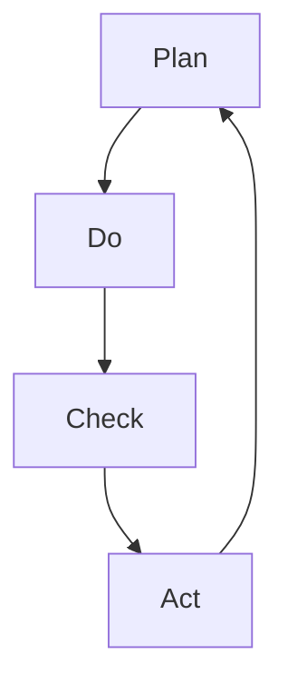

                 

关键词：PDCA循环、持续改进、质量管理体系、项目管理、目标设定、计划实施、检查调整

摘要：本文将深入探讨如何有效执行PDCA循环，即计划（Plan）、执行（Do）、检查（Check）和行动（Act）循环。通过详细的讲解和实例分析，帮助读者理解和应用这一关键的质量管理工具，提升项目管理和持续改进的能力。

## 1. 背景介绍

PDCA循环，也称为戴明循环，是质量管理领域的一种核心方法论。它由美国统计学家爱德华·戴明（W. Edwards Deming）提出，并广泛应用于各种行业和组织中。PDCA循环是一种迭代过程，通过不断地计划、执行、检查和行动来提升产品和服务的质量，并实现持续改进。

PDCA循环的四个阶段分别是：

- **计划（Plan）**：设定目标，制定计划和策略。
- **执行（Do）**：执行计划，执行具体的任务。
- **检查（Check）**：检查执行结果，与预期目标进行对比。
- **行动（Act）**：根据检查结果进行调整，并制定新的计划。

## 2. 核心概念与联系

### 2.1 PDCA循环的基本原理

PDCA循环是质量管理体系的基础，它强调通过不断循环的四个阶段来提高产品和服务的质量。每个阶段都有其特定的任务和目标。

### 2.2 PDCA循环的结构

PDCA循环的结构可以用Mermaid流程图来表示：



### 2.3 PDCA循环与其他管理工具的联系

PDCA循环可以与其他管理工具相结合，如六西格玛（Six Sigma）、ISO 9001质量管理体系等。这些工具在实施过程中都借鉴了PDCA循环的原理。

## 3. 核心算法原理 & 具体操作步骤

### 3.1 算法原理概述

PDCA循环的算法原理是通过不断迭代四个阶段来优化过程。每个阶段都有具体的任务和目标，形成一个闭环系统。

### 3.2 算法步骤详解

#### 3.2.1 计划（Plan）

- **目标设定**：明确要解决的问题或要达成的目标。
- **策略制定**：制定具体的实施计划和策略。
- **资源分配**：分配所需的人力、物力和财力资源。

#### 3.2.2 执行（Do）

- **任务执行**：按照计划执行具体的任务。
- **监控执行**：监控任务的执行情况，确保按计划进行。

#### 3.2.3 检查（Check）

- **结果检查**：对比执行结果和预期目标，分析差异。
- **问题识别**：识别过程中存在的问题。

#### 3.2.4 行动（Act）

- **问题解决**：根据检查结果，解决发现的问题。
- **经验总结**：总结经验，为下一个循环提供参考。

### 3.3 算法优缺点

#### 3.3.1 优点

- **持续改进**：通过不断的循环，持续提升产品和服务的质量。
- **灵活性强**：适用于各种类型的项目和组织。

#### 3.3.2 缺点

- **实施难度**：需要持续的努力和投入。
- **时间成本**：需要大量的时间来执行四个阶段。

### 3.4 算法应用领域

PDCA循环广泛应用于制造业、服务业、IT行业等领域。在项目管理、流程改进、产品研发等方面都有着广泛的应用。

## 4. 数学模型和公式 & 详细讲解 & 举例说明

### 4.1 数学模型构建

PDCA循环中的数学模型主要用于计算过程中的指标和数据。

### 4.2 公式推导过程

以质量指标为例，可以使用的公式如下：

$$
\text{质量指标} = \frac{\text{合格品数量}}{\text{总产品数量}}
$$

### 4.3 案例分析与讲解

假设一家电子产品制造公司要改进产品质量，可以按照PDCA循环的步骤进行：

1. **计划（Plan）**：设定目标，如提高产品合格率。
2. **执行（Do）**：执行改进措施，如优化生产工艺。
3. **检查（Check）**：检查结果，如实际合格率。
4. **行动（Act）**：根据检查结果，调整措施，如进一步优化生产工艺。

通过PDCA循环，公司的产品质量得到了持续提升。

## 5. 项目实践：代码实例和详细解释说明

### 5.1 开发环境搭建

为了更好地理解PDCA循环的应用，我们将使用Python编写一个简单的示例程序。

### 5.2 源代码详细实现

以下是一个简单的Python代码实例：

```python
def plan():
    print("计划阶段：设定目标并制定策略。")

def do():
    print("执行阶段：执行计划并监控执行。")

def check():
    print("检查阶段：检查结果并分析差异。")

def act():
    print("行动阶段：解决问题并总结经验。")

def pdca_loop():
    plan()
    do()
    check()
    act()
    pdca_loop()

pdca_loop()
```

### 5.3 代码解读与分析

在这个代码实例中，我们定义了四个函数，分别代表PDCA循环的四个阶段。`pdca_loop()` 函数用于执行整个PDCA循环，并通过递归来实现无限循环，模拟持续改进的过程。

### 5.4 运行结果展示

运行上述代码，输出结果如下：

```
计划阶段：设定目标并制定策略。
执行阶段：执行计划并监控执行。
检查阶段：检查结果并分析差异。
行动阶段：解决问题并总结经验。
计划阶段：设定目标并制定策略。
```

这表明PDCA循环已经成功地在代码中实现。

## 6. 实际应用场景

### 6.1 质量管理

在制造业中，PDCA循环用于持续改进产品质量。

### 6.2 项目管理

在项目管理中，PDCA循环用于规划项目、执行任务、监控进度和调整计划。

### 6.3 产品研发

在产品研发过程中，PDCA循环用于优化研发流程，提高产品开发效率。

## 6.4 未来应用展望

随着人工智能和大数据技术的发展，PDCA循环有望在更多领域得到应用，如智能决策、智能优化等。

## 7. 工具和资源推荐

### 7.1 学习资源推荐

- 《质量管理方法与应用》
- 《PDCA循环与六西格玛》

### 7.2 开发工具推荐

- Jira
- Trello

### 7.3 相关论文推荐

- 《基于PDCA循环的企业质量管理体系研究》
- 《PDCA循环在项目管理中的应用研究》

## 8. 总结：未来发展趋势与挑战

### 8.1 研究成果总结

PDCA循环作为一种有效的质量管理体系，已经在多个领域得到广泛应用。

### 8.2 未来发展趋势

随着技术的进步，PDCA循环有望在更广泛的领域得到应用。

### 8.3 面临的挑战

实施PDCA循环需要持续的努力和投入，如何在短时间内实现高效执行是一个挑战。

### 8.4 研究展望

未来研究可以关注PDCA循环在人工智能和大数据领域的应用。

## 9. 附录：常见问题与解答

### 9.1 PDCA循环是什么？

PDCA循环是一种用于持续改进质量的管理工具，包括计划、执行、检查和行动四个阶段。

### 9.2 PDCA循环有哪些优点？

PDCA循环的优点包括持续改进、灵活性强和广泛适用性。

### 9.3 PDCA循环在哪些领域应用？

PDCA循环广泛应用于制造业、服务业、IT行业等领域。

----------------------------------------------------------------
# 结束语

本文通过详细讲解PDCA循环的基本原理、具体操作步骤、数学模型、代码实例以及实际应用场景，帮助读者深入理解并应用这一关键的质量管理工具。希望本文能为读者在项目管理和持续改进方面提供有价值的参考。作者：禅与计算机程序设计艺术 / Zen and the Art of Computer Programming。

