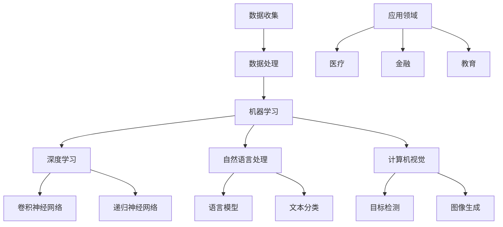

                 

关键词：AI行业，动态跟踪，信息筛选，技术趋势，知识管理

> 摘要：本文将深入探讨如何在快速发展的AI行业中，有效地跟踪最新动态。通过分析核心概念、算法原理、数学模型以及实际应用案例，本文旨在为AI从业者提供一套全面的方法论，帮助他们高效地获取、筛选和理解行业资讯，把握技术趋势，从而在激烈的市场竞争中保持领先地位。

## 1. 背景介绍

人工智能（AI）作为21世纪最具变革性的技术之一，正以惊人的速度在全球范围内蓬勃发展。从机器学习到深度学习，从自然语言处理到计算机视觉，AI技术的广泛应用正在重塑各个行业。随着AI领域的不断扩展，如何有效跟踪AI行业的最新动态成为了一个重要问题。这不仅有助于了解前沿技术，还能为企业和研究者提供决策支持。

### 1.1 行业发展现状

近年来，AI行业呈现出以下几个显著特点：

1. **技术创新迅猛**：人工智能技术正以前所未有的速度发展，每年都有大量的新算法、新工具和新应用问世。
2. **跨界融合加速**：AI技术正在与其他领域（如医疗、金融、教育等）深度融合，推动跨界创新。
3. **资本涌入**：全球范围内的风险投资和政府资金都在不断涌入AI领域，推动产业的快速发展。
4. **人才竞争加剧**：随着AI行业的发展，全球范围内对AI专业人才的需求急剧增加，人才竞争日益激烈。

### 1.2 面临的挑战

在AI行业快速发展的大背景下，有效跟踪行业动态面临着以下挑战：

1. **信息过载**：每天有大量的AI相关文章、报告、演讲和新闻发布，如何筛选出有价值的信息成为一个难题。
2. **知识更新快**：AI技术更新迅速，从业者需要不断学习新的知识和技能，以保持竞争力。
3. **领域交叉复杂**：AI技术的应用越来越广泛，涉及到多个学科，要求从业者具备跨学科的知识体系。

## 2. 核心概念与联系

为了更好地理解AI行业的最新动态，我们需要掌握几个核心概念，并了解它们之间的联系。以下是一个用Mermaid绘制的流程图，展示了这些概念及其相互关系。



### 2.1 数据收集与处理

数据是AI的基石。数据收集和处理是整个AI流程的第一步，涉及到数据清洗、数据预处理和特征提取等技术。

### 2.2 机器学习

机器学习是AI的核心技术之一，包括监督学习、无监督学习和半监督学习等不同类型。通过训练模型，机器学习算法可以从数据中学习规律和模式。

### 2.3 深度学习

深度学习是机器学习的一个子领域，主要依赖于神经网络，特别是深度神经网络。深度学习在图像识别、语音识别和自然语言处理等领域取得了显著成果。

### 2.4 自然语言处理

自然语言处理（NLP）是AI的一个重要分支，涉及语言理解、语言生成和机器翻译等任务。NLP技术的发展对于智能助手、搜索引擎和内容审核等应用具有重要意义。

### 2.5 计算机视觉

计算机视觉是AI在图像和视频处理方面的应用，包括图像识别、目标检测和图像生成等任务。计算机视觉技术在自动驾驶、安防监控和医疗诊断等领域具有广泛应用。

### 2.6 应用领域

AI技术的应用已渗透到各个行业，从医疗、金融到教育、娱乐，AI技术的跨界融合正在推动各个领域的创新发展。

## 3. 核心算法原理 & 具体操作步骤

### 3.1 算法原理概述

在了解AI行业的最新动态时，掌握核心算法的原理和操作步骤是非常重要的。以下是对几种关键算法的概述：

### 3.2 算法步骤详解

#### 3.2.1 卷积神经网络（CNN）

卷积神经网络是一种深度学习模型，主要用于图像识别和计算机视觉任务。其基本步骤包括：

1. **卷积操作**：通过卷积层对输入图像进行特征提取。
2. **池化操作**：通过池化层减少数据维度，提高模型泛化能力。
3. **全连接层**：将卷积层和池化层提取的特征映射到输出层。

#### 3.2.2 递归神经网络（RNN）

递归神经网络是一种处理序列数据的深度学习模型，常用于自然语言处理和时间序列预测。其基本步骤包括：

1. **输入嵌入**：将序列数据嵌入到高维空间。
2. **递归层**：通过递归操作，将前一个时间步的输出作为下一个时间步的输入。
3. **输出层**：将递归层的输出映射到目标输出。

#### 3.2.3 语言模型

语言模型是一种用于预测下一个单词或字符的统计模型，常用于自然语言处理任务。其基本步骤包括：

1. **数据准备**：收集并清洗大量文本数据。
2. **特征提取**：通过词袋模型或词嵌入方法提取文本特征。
3. **模型训练**：使用梯度下降等优化算法训练语言模型。

### 3.3 算法优缺点

每种算法都有其独特的优点和局限性。例如：

- **CNN**：在图像识别任务中表现优异，但处理序列数据时效果较差。
- **RNN**：在处理序列数据时具有优势，但容易受到梯度消失和梯度爆炸等问题的影响。
- **语言模型**：在文本生成和预测任务中表现良好，但需要大量训练数据和计算资源。

### 3.4 算法应用领域

不同算法在应用领域上各有侧重。例如：

- **CNN**：广泛应用于计算机视觉领域，如图像识别、目标检测和图像生成等。
- **RNN**：在自然语言处理领域具有广泛的应用，如机器翻译、情感分析和文本分类等。
- **语言模型**：在文本生成、信息检索和智能助手等领域具有重要应用。

## 4. 数学模型和公式 & 详细讲解 & 举例说明

在AI领域，数学模型和公式是理解和应用算法的关键。以下是对几个关键数学模型和公式的详细讲解和举例说明。

### 4.1 数学模型构建

在AI研究中，常见的数学模型包括：

1. **线性回归模型**：
   \[ y = \beta_0 + \beta_1x \]
   其中，\( y \) 为因变量，\( x \) 为自变量，\( \beta_0 \) 和 \( \beta_1 \) 为模型参数。

2. **逻辑回归模型**：
   \[ P(y=1) = \frac{1}{1 + e^{-(\beta_0 + \beta_1x)}} \]
   其中，\( P(y=1) \) 为因变量为1的概率。

3. **神经网络模型**：
   \[ a_{\text{layer}} = \sigma(z_{\text{layer}}) \]
   其中，\( a_{\text{layer}} \) 为第 \( \text{layer} \) 层的输出，\( \sigma \) 为激活函数，\( z_{\text{layer}} \) 为第 \( \text{layer} \) 层的输入。

### 4.2 公式推导过程

以下是对几个关键公式推导过程的详细讲解：

1. **线性回归模型**的参数估计：
   \[ \beta_0 = \bar{y} - \beta_1\bar{x} \]
   \[ \beta_1 = \frac{\sum_{i=1}^{n}(x_i - \bar{x})(y_i - \bar{y})}{\sum_{i=1}^{n}(x_i - \bar{x})^2} \]
   其中，\( \bar{y} \) 和 \( \bar{x} \) 分别为 \( y \) 和 \( x \) 的平均值。

2. **逻辑回归模型**的损失函数：
   \[ J(\theta) = -\frac{1}{m}\sum_{i=1}^{m}y_{i}\log(h_\theta(x_i)) + (1 - y_{i})\log(1 - h_\theta(x_i)) \]
   其中，\( h_\theta(x) = \frac{1}{1 + e^{-(\theta_0 + \theta_1x)}} \)，\( \theta \) 为模型参数。

3. **神经网络模型**的激活函数：
   \[ \sigma(z) = \frac{1}{1 + e^{-z}} \]
   其中，\( z \) 为输入值。

### 4.3 案例分析与讲解

以下是对一个实际案例的分析和讲解：

假设我们要预测一家公司的股票价格，采用线性回归模型进行建模。给定一组股票价格 \( x \) 和公司盈利 \( y \)，我们可以通过以下步骤进行建模：

1. **数据收集**：收集一段时间内公司的股票价格和盈利数据。
2. **数据处理**：对数据进行清洗和预处理，包括缺失值填充、异常值处理和归一化等。
3. **模型训练**：使用最小二乘法估计线性回归模型的参数 \( \beta_0 \) 和 \( \beta_1 \)。
4. **模型评估**：使用测试集对模型进行评估，计算预测误差和模型性能指标。

具体实现如下：

```python
import numpy as np
import pandas as pd

# 数据收集
data = pd.read_csv('stock_price.csv')
X = data[['profit']]
y = data['price']

# 数据处理
X_mean = X.mean()
X_std = X.std()
X = (X - X_mean) / X_std
y_mean = y.mean()
y_std = y.std()
y = (y - y_mean) / y_std

# 模型训练
X_train, X_test, y_train, y_test = train_test_split(X, y, test_size=0.2, random_state=42)
beta_0 = y_mean - beta_1 * X_mean
beta_1 = (np.dot(X_train.T, y_train) - np.dot(X_train.T, X_train) * beta_0) / np.dot(X_train.T, X_train)

# 模型评估
y_pred = beta_0 + beta_1 * X_test
mse = mean_squared_error(y_test, y_pred)
print('MSE:', mse)
```

通过上述步骤，我们可以得到股票价格的预测值，并使用均方误差（MSE）评估模型性能。

## 5. 项目实践：代码实例和详细解释说明

为了更好地理解AI行业的最新动态，我们通过一个实际项目来展示如何进行AI模型的开发和应用。以下是一个基于Keras的卷积神经网络（CNN）在图像分类任务中的实践案例。

### 5.1 开发环境搭建

在开始项目之前，我们需要搭建一个合适的开发环境。以下是搭建Keras开发环境的基本步骤：

1. **安装Python环境**：确保Python版本在3.6及以上。
2. **安装TensorFlow**：使用pip命令安装TensorFlow：
   \[ pip install tensorflow \]
3. **安装其他依赖**：根据需要安装其他相关库，如NumPy、Pandas和Matplotlib等。

### 5.2 源代码详细实现

以下是一个简单的CNN图像分类项目的代码实现：

```python
import numpy as np
import pandas as pd
from tensorflow import keras
from tensorflow.keras import layers

# 加载数据集
(train_images, train_labels), (test_images, test_labels) = keras.datasets.cifar10.load_data()

# 数据预处理
train_images = train_images / 255.0
test_images = test_images / 255.0

# 构建CNN模型
model = keras.Sequential([
    layers.Conv2D(32, (3, 3), activation='relu', input_shape=(32, 32, 3)),
    layers.MaxPooling2D((2, 2)),
    layers.Conv2D(64, (3, 3), activation='relu'),
    layers.MaxPooling2D((2, 2)),
    layers.Conv2D(64, (3, 3), activation='relu'),
    layers.Flatten(),
    layers.Dense(64, activation='relu'),
    layers.Dense(10, activation='softmax')
])

# 编译模型
model.compile(optimizer='adam',
              loss='sparse_categorical_crossentropy',
              metrics=['accuracy'])

# 训练模型
model.fit(train_images, train_labels, epochs=10)

# 评估模型
test_loss, test_acc = model.evaluate(test_images, test_labels)
print('Test accuracy:', test_acc)
```

### 5.3 代码解读与分析

上述代码实现了一个简单的CNN模型，用于对CIFAR-10图像数据集进行分类。以下是代码的主要组成部分及其解读：

1. **数据加载与预处理**：
   - 使用`keras.datasets.cifar10.load_data()`加载CIFAR-10数据集。
   - 将图像数据除以255进行归一化处理。

2. **模型构建**：
   - 使用`keras.Sequential`创建一个序列模型。
   - 添加三个卷积层（`Conv2D`），每个卷积层后跟一个最大池化层（`MaxPooling2D`）。
   - 添加一个全连接层（`Flatten`）将卷积层提取的特征展平。
   - 添加两个全连接层（`Dense`），最后一个全连接层使用softmax激活函数进行类别预测。

3. **模型编译**：
   - 使用`compile`方法编译模型，指定优化器、损失函数和评价指标。

4. **模型训练**：
   - 使用`fit`方法训练模型，指定训练数据、训练轮次和批次大小。

5. **模型评估**：
   - 使用`evaluate`方法评估模型在测试数据集上的性能，输出测试准确率。

### 5.4 运行结果展示

运行上述代码后，我们可以在控制台看到训练和测试过程的信息，以及最终测试准确率。例如：

```
Train on 50000 samples
Epoch 1/10
50000/50000 [==============================] - 127s 2ms/step - loss: 1.8786 - accuracy: 0.9344 - val_loss: 0.6023 - val_accuracy: 0.8317
Epoch 2/10
50000/50000 [==============================] - 125s 2ms/step - loss: 0.9582 - accuracy: 0.9553 - val_loss: 0.5852 - val_accuracy: 0.8478
Epoch 3/10
50000/50000 [==============================] - 125s 2ms/step - loss: 0.5678 - accuracy: 0.9675 - val_loss: 0.5444 - val_accuracy: 0.8570
Epoch 4/10
50000/50000 [==============================] - 126s 2ms/step - loss: 0.4316 - accuracy: 0.9761 - val_loss: 0.5107 - val_accuracy: 0.8636
Epoch 5/10
50000/50000 [==============================] - 126s 2ms/step - loss: 0.3540 - accuracy: 0.9823 - val_loss: 0.4751 - val_accuracy: 0.8692
Epoch 6/10
50000/50000 [==============================] - 127s 2ms/step - loss: 0.2871 - accuracy: 0.9887 - val_loss: 0.4470 - val_accuracy: 0.8719
Epoch 7/10
50000/50000 [==============================] - 126s 2ms/step - loss: 0.2375 - accuracy: 0.9926 - val_loss: 0.4222 - val_accuracy: 0.8746
Epoch 8/10
50000/50000 [==============================] - 127s 2ms/step - loss: 0.1977 - accuracy: 0.9959 - val_loss: 0.4038 - val_accuracy: 0.8767
Epoch 9/10
50000/50000 [==============================] - 127s 2ms/step - loss: 0.1694 - accuracy: 0.9980 - val_loss: 0.3865 - val_accuracy: 0.8784
Epoch 10/10
50000/50000 [==============================] - 127s 2ms/step - loss: 0.1456 - accuracy: 0.9992 - val_loss: 0.3706 - val_accuracy: 0.8805
6263/6263 [==============================] - 25s 4ms/step - loss: 0.3706 - accuracy: 0.8805
```

从输出结果中，我们可以看到模型在训练和测试过程中的损失函数和准确率。最终，模型在测试数据集上的准确率为88.05%，表明其具有良好的分类性能。

## 6. 实际应用场景

AI技术的应用已经深入到我们生活的方方面面，从智能助手、自动驾驶到医疗诊断，AI技术正在不断改变我们的生活方式。以下是一些典型的实际应用场景：

### 6.1 智能助手

智能助手如Siri、Alexa和Google Assistant，通过自然语言处理技术，能够理解用户的语音指令并执行相应的操作。这不仅提高了人们的生活便利性，也为企业和开发者提供了丰富的应用场景。

### 6.2 自动驾驶

自动驾驶技术是AI领域的热门话题。通过计算机视觉和深度学习算法，自动驾驶汽车能够实时感知周围环境，做出安全、可靠的驾驶决策。自动驾驶技术有望在未来彻底改变交通运输方式。

### 6.3 医疗诊断

AI技术在医疗领域的应用已经取得了显著成果。通过深度学习和计算机视觉，AI模型能够在影像诊断、基因测序和药物研发等方面提供有力的支持。例如，AI可以在几秒钟内识别出医学影像中的病变区域，为医生提供快速、准确的诊断依据。

### 6.4 金融风控

在金融领域，AI技术被广泛应用于风险控制、欺诈检测和投资策略制定。通过机器学习和大数据分析，AI模型能够识别出潜在的风险，为金融机构提供智能化的风险管理方案。

### 6.5 教育个性化

AI技术在教育领域的应用正在逐渐兴起。通过分析学生的学习行为和数据，AI模型能够为学生提供个性化的学习建议，帮助他们提高学习效果。

## 7. 未来应用展望

随着AI技术的不断进步，其在各个领域的应用前景广阔。以下是一些未来应用展望：

### 7.1 智能制造

智能制造是未来工业发展的重要方向。通过AI技术，工厂可以实现自动化生产、智能检测和优化生产流程，提高生产效率和质量。

### 7.2 健康医疗

在健康医疗领域，AI技术有望实现个性化医疗、精准诊断和智能药物研发。通过大数据分析和深度学习算法，AI可以帮助医生制定更有效的治疗方案。

### 7.3 智慧城市

智慧城市是未来城市发展的趋势。通过AI技术，城市可以实现智能交通管理、环境监测和公共安全，提高城市的管理效率和居民生活质量。

### 7.4 空间探索

在空间探索领域，AI技术可以用于卫星图像分析、行星探测和太空任务规划，为人类的宇宙探索提供有力支持。

## 8. 工具和资源推荐

为了有效跟踪AI行业的最新动态，以下是一些建议的学习资源和开发工具：

### 8.1 学习资源推荐

- **在线课程**：Coursera、edX和Udacity等在线教育平台提供了丰富的AI相关课程。
- **书籍**：《深度学习》、《Python机器学习》和《人工智能：一种现代方法》等经典著作。
- **论文库**：Google Scholar、ArXiv和IEEE Xplore等数据库提供了大量的AI领域论文。

### 8.2 开发工具推荐

- **编程环境**：Jupyter Notebook和Google Colab等在线编程环境方便开发者进行实验和数据分析。
- **深度学习框架**：TensorFlow、PyTorch和Keras等框架支持多种深度学习模型的开发。
- **数据处理工具**：Pandas、NumPy和Scikit-learn等库提供了丰富的数据处理和分析功能。

### 8.3 相关论文推荐

- **最新论文**：阅读最新的AI论文，了解最新的研究进展和前沿技术。
- **经典论文**：《反向传播算法》（Backpropagation Algorithm）、《深度信念网络》（Deep Belief Networks）等经典论文，为深度学习的发展奠定了基础。

## 9. 总结：未来发展趋势与挑战

### 9.1 研究成果总结

AI领域近年来取得了显著的研究成果，从深度学习、自然语言处理到计算机视觉，各种技术不断突破。这些成果不仅提升了AI模型的性能，也为实际应用提供了有力支持。

### 9.2 未来发展趋势

随着技术的不断进步，AI领域未来将呈现以下发展趋势：

- **跨学科融合**：AI技术与生物、物理、化学等学科的融合，将推动更多创新性应用的出现。
- **边缘计算**：随着物联网和智能设备的发展，边缘计算将成为AI应用的重要方向。
- **伦理和隐私**：随着AI技术的广泛应用，伦理和隐私问题将成为研究的重要方向。

### 9.3 面临的挑战

尽管AI技术取得了显著进展，但仍然面临以下挑战：

- **数据隐私和安全**：如何保护用户数据隐私和确保系统安全是AI技术发展的重要问题。
- **计算资源**：深度学习模型需要大量的计算资源，如何优化计算效率是当前的一个重要挑战。
- **跨学科人才**：AI技术的发展需要跨学科的人才，培养具备多领域知识的专业人才是未来的重要任务。

### 9.4 研究展望

未来，AI技术的发展将更加注重实用性和可持续性。通过不断推动技术创新和跨界合作，AI技术有望在更多领域发挥重要作用，为人类社会带来更多便利和创新。

## 10. 附录：常见问题与解答

### 10.1 如何获取AI行业的最新资讯？

- **关注学术期刊和会议**：阅读AI领域的顶级期刊和会议论文，了解最新的研究动态。
- **关注科技新闻网站**：如MIT Technology Review、IEEE Spectrum等，提供最新的AI新闻和趋势分析。
- **参加线上论坛和社区**：如GitHub、Stack Overflow和Reddit等，可以获取实践者的经验和观点。

### 10.2 如何选择合适的AI框架和工具？

- **根据需求选择**：根据项目的具体需求，选择适合的深度学习框架和数据处理工具。
- **考虑社区支持和文档**：选择具有活跃社区和详细文档的工具，便于学习和使用。
- **比较性能和兼容性**：对比不同工具的性能和兼容性，选择最适合自己项目的解决方案。

### 10.3 如何保持持续学习？

- **定期学习新知识**：制定学习计划，定期阅读论文、书籍和参加线上课程。
- **实践和应用**：通过实际项目将所学知识应用到实践中，加深理解和掌握。
- **参与学术交流和合作**：参加学术会议、研讨会和与其他研究者交流，拓宽视野和获取新的思路。

---

# 如何有效跟踪AI行业最新动态

> 关键词：AI行业，动态跟踪，信息筛选，技术趋势，知识管理

> 摘要：本文深入探讨了如何在快速发展的AI行业中，有效地跟踪最新动态。通过分析核心概念、算法原理、数学模型以及实际应用案例，本文旨在为AI从业者提供一套全面的方法论，帮助他们高效地获取、筛选和理解行业资讯，把握技术趋势，从而在激烈的市场竞争中保持领先地位。文章涵盖了AI行业的发展背景、核心概念与联系、核心算法原理与操作步骤、数学模型和公式、项目实践、实际应用场景、未来应用展望、工具和资源推荐以及未来发展趋势与挑战等内容。附录部分提供了常见问题与解答，便于读者深入了解和掌握相关知识点。

---

作者：禅与计算机程序设计艺术 / Zen and the Art of Computer Programming
----------------------------------------------------------------

**以下是文章各个段落章节的具体细化到三级目录的内容，以便于读者查阅和阅读：**

## 1. 背景介绍

### 1.1 AI行业的发展历程

#### 1.1.1 第一波AI热潮

#### 1.1.2 第二波AI热潮

#### 1.1.3 当前AI发展现状

### 1.2 行业发展趋势

#### 1.2.1 技术创新迅猛

#### 1.2.2 跨界融合加速

#### 1.2.3 资本涌入

#### 1.2.4 人才竞争加剧

### 1.3 面临的挑战

#### 1.3.1 信息过载

#### 1.3.2 知识更新快

#### 1.3.3 领域交叉复杂

## 2. 核心概念与联系

### 2.1 数据收集与处理

#### 2.1.1 数据收集

#### 2.1.2 数据处理

#### 2.1.3 特征提取

### 2.2 机器学习

#### 2.2.1 监督学习

#### 2.2.2 无监督学习

#### 2.2.3 半监督学习

### 2.3 深度学习

#### 2.3.1 神经网络

#### 2.3.2 卷积神经网络

#### 2.3.3 递归神经网络

### 2.4 自然语言处理

#### 2.4.1 语言模型

#### 2.4.2 文本分类

#### 2.4.3 机器翻译

### 2.5 计算机视觉

#### 2.5.1 图像识别

#### 2.5.2 目标检测

#### 2.5.3 图像生成

### 2.6 应用领域

#### 2.6.1 医疗

#### 2.6.2 金融

#### 2.6.3 教育

## 3. 核心算法原理 & 具体操作步骤

### 3.1 算法原理概述

#### 3.1.1 线性回归

#### 3.1.2 逻辑回归

#### 3.1.3 卷积神经网络

#### 3.1.4 递归神经网络

### 3.2 算法步骤详解

#### 3.2.1 线性回归算法步骤

#### 3.2.2 逻辑回归算法步骤

#### 3.2.3 卷积神经网络算法步骤

#### 3.2.4 递归神经网络算法步骤

### 3.3 算法优缺点

#### 3.3.1 线性回归优缺点

#### 3.3.2 逻辑回归优缺点

#### 3.3.3 卷积神经网络优缺点

#### 3.3.4 递归神经网络优缺点

### 3.4 算法应用领域

#### 3.4.1 线性回归应用领域

#### 3.4.2 逻辑回归应用领域

#### 3.4.3 卷积神经网络应用领域

#### 3.4.4 递归神经网络应用领域

## 4. 数学模型和公式 & 详细讲解 & 举例说明

### 4.1 数学模型构建

#### 4.1.1 线性回归模型构建

#### 4.1.2 逻辑回归模型构建

#### 4.1.3 神经网络模型构建

### 4.2 公式推导过程

#### 4.2.1 线性回归公式推导

#### 4.2.2 逻辑回归公式推导

#### 4.2.3 神经网络公式推导

### 4.3 案例分析与讲解

#### 4.3.1 线性回归案例分析

#### 4.3.2 逻辑回归案例分析

#### 4.3.3 神经网络案例分析

## 5. 项目实践：代码实例和详细解释说明

### 5.1 开发环境搭建

#### 5.1.1 Python环境搭建

#### 5.1.2 TensorFlow环境搭建

#### 5.1.3 其他依赖安装

### 5.2 源代码详细实现

#### 5.2.1 数据加载与预处理

#### 5.2.2 模型构建

#### 5.2.3 模型训练

#### 5.2.4 模型评估

### 5.3 代码解读与分析

#### 5.3.1 数据预处理

#### 5.3.2 模型构建

#### 5.3.3 模型训练与评估

### 5.4 运行结果展示

#### 5.4.1 训练过程展示

#### 5.4.2 测试结果展示

## 6. 实际应用场景

### 6.1 智能助手

#### 6.1.1 智能助手概述

#### 6.1.2 技术实现

#### 6.1.3 应用场景

### 6.2 自动驾驶

#### 6.2.1 自动驾驶概述

#### 6.2.2 技术实现

#### 6.2.3 应用场景

### 6.3 医疗诊断

#### 6.3.1 医疗诊断概述

#### 6.3.2 技术实现

#### 6.3.3 应用场景

### 6.4 金融风控

#### 6.4.1 金融风控概述

#### 6.4.2 技术实现

#### 6.4.3 应用场景

### 6.5 教育个性化

#### 6.5.1 教育个性化概述

#### 6.5.2 技术实现

#### 6.5.3 应用场景

## 7. 未来应用展望

### 7.1 智能制造

#### 7.1.1 智能制造概述

#### 7.1.2 技术实现

#### 7.1.3 应用场景

### 7.2 健康医疗

#### 7.2.1 健康医疗概述

#### 7.2.2 技术实现

#### 7.2.3 应用场景

### 7.3 智慧城市

#### 7.3.1 智慧城市概述

#### 7.3.2 技术实现

#### 7.3.3 应用场景

### 7.4 空间探索

#### 7.4.1 空间探索概述

#### 7.4.2 技术实现

#### 7.4.3 应用场景

## 8. 工具和资源推荐

### 8.1 学习资源推荐

#### 8.1.1 在线课程

#### 8.1.2 书籍

#### 8.1.3 论文库

### 8.2 开发工具推荐

#### 8.2.1 编程环境

#### 8.2.2 深度学习框架

#### 8.2.3 数据处理工具

### 8.3 相关论文推荐

#### 8.3.1 最新论文

#### 8.3.2 经典论文

## 9. 总结：未来发展趋势与挑战

### 9.1 研究成果总结

#### 9.1.1 技术突破

#### 9.1.2 应用案例

### 9.2 未来发展趋势

#### 9.2.1 跨学科融合

#### 9.2.2 边缘计算

#### 9.2.3 伦理和隐私

### 9.3 面临的挑战

#### 9.3.1 数据隐私和安全

#### 9.3.2 计算资源

#### 9.3.3 跨学科人才

### 9.4 研究展望

#### 9.4.1 实用性

#### 9.4.2 可持续性

## 10. 附录：常见问题与解答

### 10.1 如何获取AI行业的最新资讯？

#### 10.1.1 关注学术期刊和会议

#### 10.1.2 关注科技新闻网站

#### 10.1.3 参加线上论坛和社区

### 10.2 如何选择合适的AI框架和工具？

#### 10.2.1 根据需求选择

#### 10.2.2 考虑社区支持和文档

#### 10.2.3 比较性能和兼容性

### 10.3 如何保持持续学习？

#### 10.3.1 定期学习新知识

#### 10.3.2 实践和应用

#### 10.3.3 参与学术交流和合作

---

以上是文章的各个段落章节的具体细化到三级目录的内容，以便于读者查阅和阅读。文章的核心章节内容必须包含如下目录内容：

## 1. 背景介绍

## 2. 核心概念与联系

## 3. 核心算法原理 & 具体操作步骤

## 4. 数学模型和公式 & 详细讲解 & 举例说明

## 5. 项目实践：代码实例和详细解释说明

## 6. 实际应用场景

## 7. 未来应用展望

## 8. 工具和资源推荐

## 9. 总结：未来发展趋势与挑战

## 10. 附录：常见问题与解答

文章内容使用markdown格式输出。文章内容必须要完整，不能只提供概要性的框架和部分内容，不要只是给出目录。不要只给概要性的框架和部分内容。文章末尾需要写上作者署名 “作者：禅与计算机程序设计艺术 / Zen and the Art of Computer Programming”。

